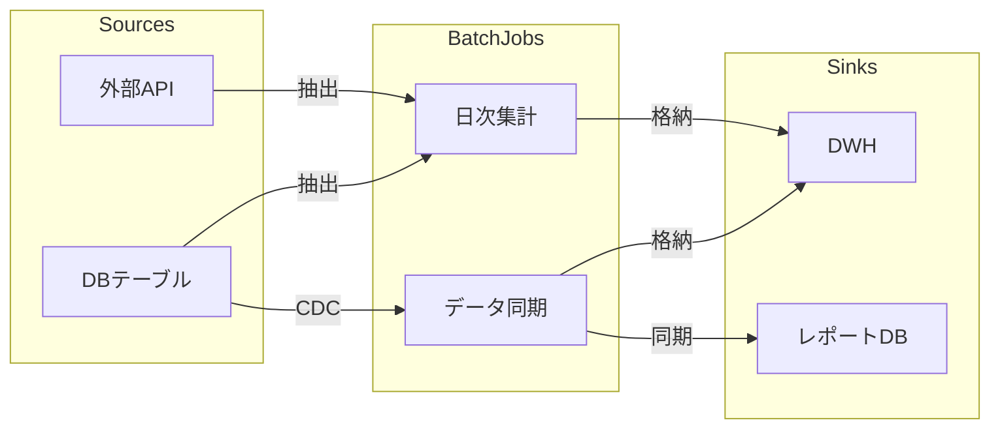

# データフロー定義書テンプレ（記入ガイド付き）

> 目的：バッチ処理要件定義で特定した各バッチ処理のデータの流れ（ソース→変換→シンク）を **一貫した粒度**で定義し、Mermaid 図で可視化する。

---

## 使い方（必読）
1. 成果物 `docs/batch/data-flow.md` は、このテンプレを **コピーして**作成する。
2. 推測は禁止。根拠がない場合は `TBD` を置き、`根拠:` に参照ファイル（パス）を記す。
3. 例は **あくまで例**。対象プロジェクト固有の用語/ID に置き換える。

---

## 記法ルール
- セクション見出しは削除しない。
- Mermaid 図は `graph LR`（左→右）または `graph TD`（上→下）で統一。
- 各セクションは 必須/任意/例/根拠 の構造を推奨。
- キーワード：`TBD`（未確定）、`N/A`（該当なし・理由併記）

---

## 1. データフロー概要図（全体）

### 必須
- 全バッチ処理を1つの Mermaid 図に集約した概要図
- データソース → バッチ処理 → データシンク の流れを可視化

### 例

### 根拠
- docs/batch/batch-requirements.md

---

## 2. バッチ別データフロー詳細

### 各バッチ処理について以下を記載

#### 2.x {Batch-ID}: {バッチ名}

##### データフロー図
（Mermaid 図）

##### 入力データ仕様

###### 必須
| 項目 | 内容 |
|------|------|
| データソース | |
| データ形式 | |
| 主要フィールド | |
| データ量（1回あたり） | |
| 取得方式（Pull/Push） | |

##### 変換ロジック概要

###### 必須
- 変換ルールの概要（詳細なビジネスロジックは書かない）
- フィルタリング条件
- 集約・結合の概要
- データクレンジングルール

##### 出力データ仕様

###### 必須
| 項目 | 内容 |
|------|------|
| データシンク | |
| データ形式 | |
| 主要フィールド | |
| 書き込み方式（Upsert/Append/Truncate-Insert） | |

##### データ品質ゲート

###### 必須
- 変換前バリデーション条件（入力データの品質チェック）
- 変換後バリデーション条件（出力データの品質チェック）
- 品質違反時のアクション（中断/スキップ/アラート）

### 根拠
- docs/batch/batch-requirements.md
- docs/data-model.md（存在する場合）

---

## 3. データ変換ルール一覧

### 必須
| 変換ID | 対象 Batch-ID | 変換種別 | 入力フィールド | 出力フィールド | 変換ルール概要 |
|--------|-------------|---------|-------------|-------------|-------------|

---

## 4. データ品質ゲート一覧

### 必須
| ゲートID | 対象 Batch-ID | チェックポイント | バリデーション条件 | 違反時アクション |
|---------|-------------|----------------|-----------------|---------------|

---

## 最終チェックリスト（必須）

- [ ] 全体概要図を作成した
- [ ] 各バッチ処理のデータフロー詳細を記述した
- [ ] 入力/変換/出力の仕様を網羅した
- [ ] データ品質ゲートを定義した
- [ ] Mermaid 図が正しく描画されることを確認した
- [ ] 推測で変換ルールを作成していない（根拠がない場合 TBD）
