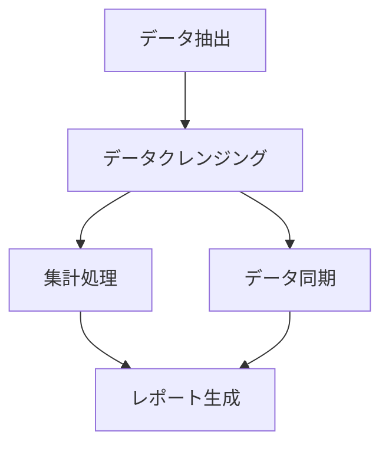

# ジョブ設計書テンプレ（記入ガイド付き）

> 目的：データフローを実行単位（ジョブ）に分解し、ジョブ間の依存関係 DAG・実行順序・並列度・リトライ戦略・冪等性保証を **一貫した粒度**で設計する。

---

## 使い方（必読）
1. 成果物 `docs/batch/job-design.md` は、このテンプレを **コピーして**作成する。
2. 推測は禁止。根拠がない場合は `TBD` を置き、`根拠:` に参照ファイル（パス）を記す。
3. 例は **あくまで例**。対象プロジェクト固有の用語/ID に置き換える。

---

## 記法ルール
- セクション見出しは削除しない。
- 各セクションは 必須/任意/例/根拠 の構造を推奨。
- キーワード：`TBD`（未確定）、`N/A`（該当なし・理由併記）
- **注意**: 本書の「ジョブ依存関係 DAG」はデータ処理の実行順序であり、AGENTS.md の「タスク計画 DAG」とは別概念です。

---

## 1. ジョブ一覧

### 必須
| Job-ID | ジョブ名 | 対応 Batch-ID | 処理パターン | 入力 | 出力 | 並列度 | タイムアウト | リトライ回数 |
|--------|---------|--------------|------------|------|------|-------|------------|------------|

### 根拠
- docs/batch/data-flow.md
- docs/batch/batch-requirements.md

---

## 2. ジョブ依存関係 DAG

### 必須
- 全ジョブの依存関係を Mermaid 図で表現

### 例

---

## 3. スケジューリング定義

### 必須
| Job-ID | トリガー種別 | Cron 式/イベント | 実行ウィンドウ | 排他制御 | タイムゾーン |
|--------|-----------|---------------|-------------|---------|-----------|

---

## 4. リトライ・エラー処理戦略

### 4.1 リトライポリシー（ジョブ別）

#### 必須
| Job-ID | リトライ回数 | リトライ間隔 | Backoff 方式 | リトライ対象エラー | 非リトライ対象エラー |
|--------|------------|------------|-------------|----------------|------------------|

### 4.2 Dead Letter Queue 設計

#### 必須
- DLQ の配置場所（概念）
- DLQ メッセージの構造（最小限のフィールド）
- DLQ からの再処理方針

### 4.3 冪等性保証方針

#### 必須
- 各ジョブの冪等性確保手法（Upsert/一意キー/バージョニング等）
- 重複実行検知方法

---

## 5. チェックポイント・リスタート設計

### 必須
- チェックポイントの記録方式
- リスタート時の動作（最初から/チェックポイントから）
- チェックポイント間隔の方針

### 任意
- 部分的な障害からの復旧手順（概念）

---

## 6. データパーティショニング戦略

### 必須
- パーティションキーの選定方針
- パーティション数の決定方針

### 任意
- ホットパーティション回避策

---

## 最終チェックリスト（必須）

- [ ] 全ジョブを一覧化した
- [ ] ジョブ依存関係 DAG を Mermaid で作成した
- [ ] スケジューリングを定義した
- [ ] リトライ・エラー処理戦略を各ジョブについて定義した
- [ ] 冪等性保証方針を各ジョブについて定義した
- [ ] 推測で並列度やタイムアウトを設定していない（根拠がない場合 TBD）
