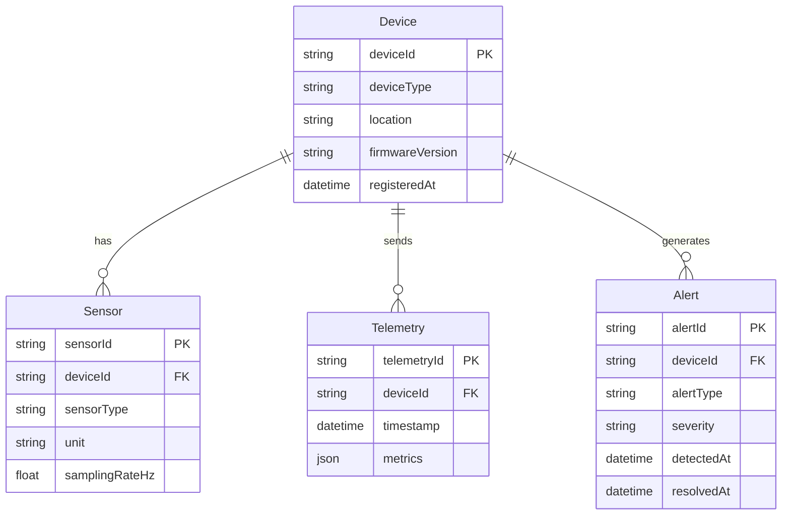

# IoT データモデルテンプレ（記入ガイド付き）

> 目的：IoT システムにおけるテレメトリ・デバイスツイン・コマンド・エッジキャッシュ・イベントの各データ構造を一貫した粒度で定義する。

---

## 使い方（必読）
1. 成果物 `docs/data-model.md` は、このテンプレを **コピーして**作成する。
2. 推測は禁止。根拠がない場合は `TBD` を置き、`根拠:` に参照ファイル（パス）を記す。
3. 例は **あくまで例**。対象プロジェクト固有の用語/ID に置き換える。
4. サンプルデータ（`data/.../sample-data.json`）の **値の転記は禁止**。必要なら「フィールド名/型/意味」を要約する。

---

## 記法ルール
- セクション見出しは削除しない（将来の自動処理/比較のため）。
- 各セクションは以下の構造を推奨：
  - **必須**：最低限埋めるべき項目
  - **任意**：あれば有益だが未確定でも可
  - **例**：短い例（2〜10行程度）
  - **根拠**：参照ファイル（パス）／決定理由
- キーワード：
  - `TBD`：未確定
  - `N/A`：該当なし（理由を併記）

---

## 1. 概要（Summary）

### 必須
- データモデルの全体概要（1〜3行）
- 主要なデータカテゴリとその関係の概略

### 根拠
- （ドメイン分析文書・ユースケース文書のパスを記載）

---

## 2. テレメトリデータモデル

### 必須
- デバイスから送信される時系列データの構造を定義

| フィールド名 | データ型 | 必須/任意 | 説明 | 単位 | 有効範囲 |
|------------|---------|---------|------|------|---------|
| deviceId | string | 必須 | デバイス一意識別子 | - | - |
| timestamp | datetime (ISO 8601) | 必須 | 計測日時（UTC） | - | - |
| sequenceNo | int64 | 任意 | シーケンス番号（欠損検知用） | - | - |
| metrics | object | 必須 | センサー計測値のコレクション | - | - |

### 例（JSON Schema）

```json
{
  "$schema": "http://json-schema.org/draft-07/schema",
  "type": "object",
  "required": ["deviceId", "timestamp", "metrics"],
  "properties": {
    "deviceId": { "type": "string" },
    "timestamp": { "type": "string", "format": "date-time" },
    "sequenceNo": { "type": "integer" },
    "metrics": {
      "type": "object",
      "properties": {
        "temperature": { "type": "number", "description": "温度 (℃)" },
        "humidity": { "type": "number", "description": "湿度 (%RH)" }
      }
    }
  }
}
```

### 根拠
- （センサー仕様書・デバイス接続性分析文書のパスを記載）

---

## 3. デバイスツインモデル

### 必須
- クラウド上のデバイス状態デジタル表現（Desired / Reported プロパティ）を定義

#### 3.1 Desired Properties（Cloud → Device への設定値）
| プロパティ名 | データ型 | 説明 | デフォルト値 | 更新者 |
|-----------|---------|------|-----------|-------|

#### 3.2 Reported Properties（Device → Cloud の現在状態）
| プロパティ名 | データ型 | 説明 | 更新者 |
|-----------|---------|------|-------|

#### 3.3 Tags（メタデータ）
| タグ名 | データ型 | 説明 | 更新者 |
|------|---------|------|-------|

### 例

```json
{
  "deviceId": "DEV-001",
  "tags": {
    "location": "Factory-A-Line-1",
    "deviceType": "SensorNode"
  },
  "desired": {
    "samplingIntervalMs": 1000,
    "alertThreshold": { "temperature": 80.0 }
  },
  "reported": {
    "firmwareVersion": "TBD（デバイスが実際に報告する値。プロジェクト固有の形式で記載）",
    "batteryLevel": "TBD（バッテリー残量 %。電源種別に応じて N/A の場合もあり）",
    "lastConnected": "TBD（ISO 8601 形式の日時。デバイス稼働後に設定）",
    "samplingIntervalMs": 1000
  }
}
```

### 根拠
- （デバイス管理要件・ユースケース文書のパスを記載）

---

## 4. コマンドモデル

### 必須
- Cloud → Device のコマンド構造を定義

| コマンドID | コマンド名 | 説明 | パラメータ | 応答形式 | タイムアウト |
|-----------|----------|------|---------|---------|----------|

### 例

```json
{
  "commandId": "CMD-001",
  "name": "setThreshold",
  "parameters": {
    "metricName": "temperature",
    "threshold": 80.0
  },
  "requestedAt": "2024-01-01T00:00:00Z"
}
```

### 応答フォーマット

```json
{
  "commandId": "CMD-001",
  "status": "success",
  "resultCode": 200,
  "message": "Threshold updated",
  "respondedAt": "TBD"
}
```

---

## 5. エッジキャッシュモデル

### 必須
- エッジで保持するデータの構造・TTL・同期方式を定義

| データ種別 | 保持場所 | 最大保持件数/容量 | TTL | 同期トリガー | 同期方式 |
|----------|---------|---------------|-----|-----------|---------|

### 5.1 オフラインバッファ
- ローカルストレージ方式（SQLite / LevelDB / ファイルシステム 等）
- バッファ溢れ時の対応（古いデータから削除 / 新規データを破棄 等）

### 5.2 推論モデルキャッシュ
- モデルファイルの保存場所
- モデル更新チェック間隔
- ロールバック用の旧バージョン保持数

### 根拠
- （オフライン要件・エッジアーキテクチャ文書のパスを記載）

---

## 6. イベントモデル

### 必須
- IoT イベントの標準ペイロード構造を定義

| フィールド名 | データ型 | 必須/任意 | 説明 |
|------------|---------|---------|------|
| eventId | string (UUID) | 必須 | イベント一意識別子 |
| eventType | string (enum) | 必須 | イベント種別 |
| source | string | 必須 | 発生源（deviceId/serviceId） |
| timestamp | datetime (ISO 8601) | 必須 | 発生日時（UTC） |
| payload | object | 必須 | イベント固有データ |
| correlationId | string | 任意 | 関連イベントの追跡用ID |

### イベント種別一覧
| イベント種別 | 発生元層 | 説明 |
|-----------|---------|------|

### 例

```json
{
  "eventId": "evt-xxxxxxxx-xxxx-xxxx-xxxx-xxxxxxxxxxxx",
  "eventType": "AnomalyDetected",
  "source": "DEV-001",
  "timestamp": "2024-01-01T00:00:00Z",
  "payload": {
    "metricName": "temperature",
    "value": "TBD",
    "threshold": "TBD",
    "confidence": "TBD"
  }
}
```

---

## 7. エンティティ関連図（Mermaid ER 図）

### 必須
- デバイス / センサー / テレメトリ / アラート 等の主要エンティティ関係を可視化

### 例



### 根拠
- （ドメイン分析文書・ユースケース文書のパスを記載）

---

## 8. サンプルデータ構造（JSON Schema 概要）

### 任意
- 主要エンティティの JSON Schema を概要として記載（詳細はコード内 schema/ を参照）

### 注意
- 実際のサンプルデータ値（data/.../sample-data.json）の転記は禁止
- フィールド名・型・意味の要約のみ記載すること

---

## 9. データ保持ポリシー

### 必須
| データ種別 | ストレージ層 | 保持期間 | 容量見積 | アーカイブ先 | 根拠 |
|----------|-----------|---------|---------|-----------|------|

### 9.1 ホットストレージ（リアルタイムアクセス）
- 対象：直近のテレメトリ・アクティブアラート・デバイス状態
- 保持期間：TBD
- ストレージ種別：TBD（例：Azure Cosmos DB / Azure Cache for Redis）

### 9.2 ウォームストレージ（分析・トレンド）
- 対象：過去数週間〜数ヶ月のテレメトリ集計データ
- 保持期間：TBD
- ストレージ種別：TBD（例：Azure SQL / Azure Data Explorer）

### 9.3 コールドストレージ（長期保管・コンプライアンス）
- 対象：生テレメトリデータ・監査ログ
- 保持期間：TBD（法規制要件がある場合は記載）
- ストレージ種別：TBD（例：Azure Blob Storage / Azure Data Lake Storage）

### 根拠
- （データ保持要件・コンプライアンス要件のパスを記載）

---

## 10. メモ

### 任意
- 分析中の未決事項、仮説、今後の調査項目

---

## 最終チェックリスト（必須）

- [ ] 1〜9 を埋めた（未確定は TBD ＋根拠）
- [ ] テレメトリデータモデルにデバイスID・タイムスタンプ・メトリクスを含めた
- [ ] デバイスツインモデルに Desired/Reported プロパティを定義した
- [ ] コマンドモデルに応答フォーマットを定義した
- [ ] エッジキャッシュモデルに TTL・同期方式を定義した
- [ ] ER 図（Mermaid）を作成した
- [ ] データ保持ポリシー（ホット/ウォーム/コールド）を定義した
- [ ] sample-data の値を転記していない
- [ ] 推測でデータ量・保持期間を記載していない（根拠がない場合 TBD）
