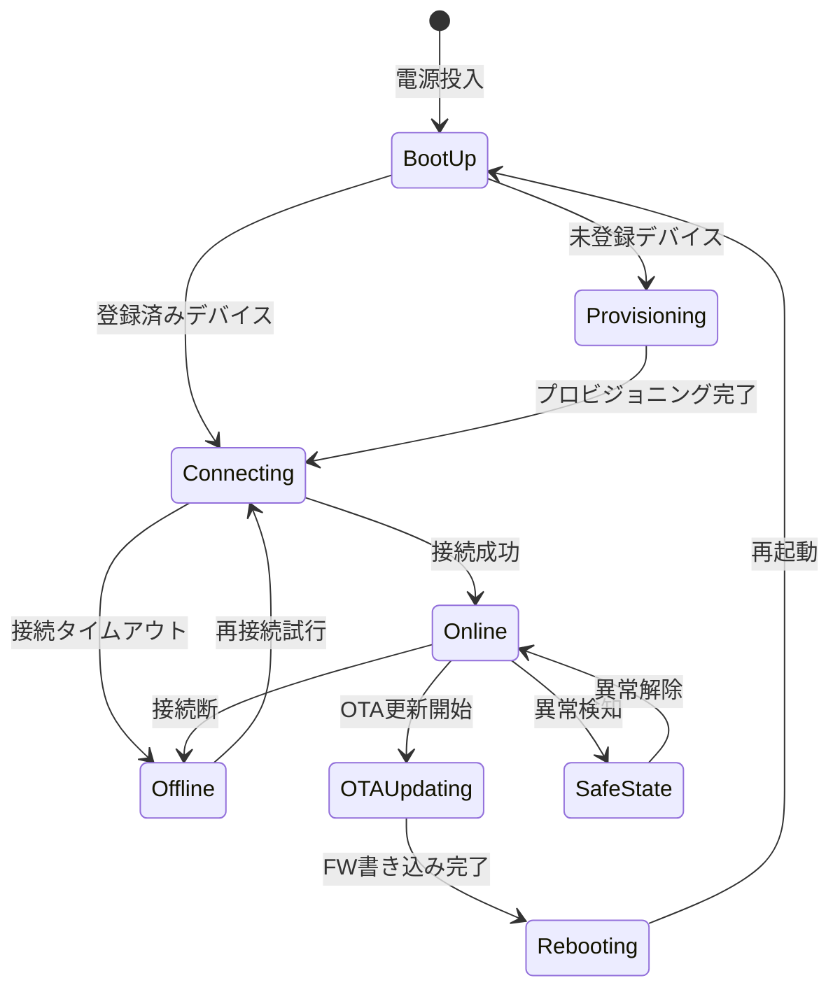

# IoT デバイスプロファイル＋接続性分析テンプレ（記入ガイド付き）

> 目的：対象デバイスの HW 制約・通信方式・オフライン戦略・消費電力・AI 推論要件・状態遷移・フェイルセーフ設計を一貫した粒度で定義する。

---

## 使い方（必読）
1. 成果物 `docs/device-connectivity.md` は、このテンプレを **コピーして**作成する。
2. 推測は禁止。根拠がない場合は `TBD` を置き、`根拠:` に参照ファイル（パス）を記す。
3. 例は **あくまで例**。対象プロジェクト固有の用語/ID に置き換える。
4. サンプルデータ（`data/.../sample-data.json`）の **値の転記は禁止**。必要なら「フィールド名/型/意味」を要約する。

---

## 記法ルール
- セクション見出しは削除しない（将来の自動処理/比較のため）。
- 各セクションは以下の構造を推奨：
  - **必須**：最低限埋めるべき項目
  - **任意**：あれば有益だが未確定でも可
  - **例**：短い例（2〜10行程度）
  - **根拠**：参照ファイル（パス）／決定理由
- キーワード：
  - `TBD`：未確定
  - `N/A`：該当なし（理由を併記）

---

## 1. 概要（Summary）

### 必須
- プロジェクト概要（1〜3行）
- 対象デバイス種別の概要
- 物理展開環境（工場/屋外/家庭内/移動体 等）

### 根拠
- （ユースケース文書のパスを記載）

---

## 2. デバイスプロファイル一覧

### 必須
| デバイスID | 種別 | CPU/MPU | RAM | Storage | OS/RTOS | 電源 | 動作環境 | 備考 |
|-----------|------|---------|-----|---------|---------|------|---------|------|

### 例
| デバイスID | 種別 | CPU/MPU | RAM | Storage | OS/RTOS | 電源 | 動作環境 |
|-----------|------|---------|-----|---------|---------|------|---------|
| DEV-01 | エッジゲートウェイ | ARM Cortex-A53 | 2GB | 32GB eMMC | Linux | AC電源 | 屋内・常時稼働 |
| DEV-02 | センサーノード | ARM Cortex-M4 | 256KB | 1MB Flash | FreeRTOS | 電池（単三×2） | 屋外・間欠稼働 |

### 根拠
- （ハードウェア仕様書・ユースケース文書のパスを記載）

---

## 3. センサー/アクチュエーター インターフェース仕様

### 必須
| センサーID | 名称 | データ型 | サンプリングレート | 精度 | 接続バス | 対応デバイスID | 備考 |
|-----------|------|---------|----------------|------|---------|-------------|------|

### 例
| センサーID | 名称 | データ型 | サンプリングレート | 精度 | 接続バス |
|-----------|------|---------|----------------|------|---------|
| SNS-01 | 温度センサー | float32 (℃) | 1Hz | ±0.5℃ | I2C |
| SNS-02 | 加速度センサー | float32[3] (G) | 100Hz | ±0.01G | SPI |
| ACT-01 | リレー制御 | bool | オンデマンド | N/A | GPIO |

### 根拠
- （センサー仕様書・ハードウェア設計書のパスを記載）

---

## 4. 接続性分析

### 必須
- 使用する通信プロトコルとその選定理由

| プロトコル | 適用区間 | レイテンシ | 帯域 | 電力消費 | 選定理由 | 採否 |
|----------|---------|----------|------|---------|---------|------|
| MQTT | Device→Cloud | TBD | TBD | 低 | | |
| AMQP | Edge→Cloud | TBD | TBD | 中 | | |
| HTTP/REST | Device→Cloud | TBD | TBD | 中 | | |
| BLE | Device局所 | TBD | 低 | 極低 | | |
| LoRa/LoRaWAN | Device→Gateway | TBD | 極低 | 極低 | | |
| Cellular (LTE/5G) | Device→Cloud | TBD | 高 | 高 | | |
| Wi-Fi | Device→Gateway | TBD | 高 | 中 | | |
| Ethernet | Gateway→Cloud | TBD | 高 | 低 | | |

### 任意
- QoS レベル（MQTT の場合：0/1/2）
- TLS/mTLS の要否
- プロトコル固有の設定パラメータ

### 根拠
- （接続性要件・ユースケース文書のパスを記載）

---

## 5. オフライン分類

### 必須
- 各デバイスのオフライン時の動作分類を以下に明記

| デバイスID | オフライン分類 | ローカルバッファ容量 | 再接続後の同期方式 | 最大許容オフライン時間 |
|-----------|-------------|----------------|----------------|------------------|

### 5.1 間欠接続（Intermittent Connectivity）
- ローカルバッファリング戦略
- 再接続トリガー条件
- データ優先度付け方式

### 5.2 完全オフライン（Fully Disconnected）
- スタンドアロン動作時の機能範囲
- ローカル永続化方式
- 接続回復時のバルク同期方式

### 5.3 帯域制限（Bandwidth Constrained）
- データ圧縮方式（gzip / CBOR / MessagePack 等）
- 送信頻度の動的調整（Adaptive Sampling）
- 優先データの選別基準

### 根拠
- （オフライン要件・ユースケース文書のパスを記載）

---

## 6. 消費電力分析

### 必須
| デバイスID | 動作モード | 消費電力 (mW) | 稼働率 (%) | 平均消費電力 (mW) | バッテリー容量 (mAh) | 推定寿命 |
|-----------|----------|------------|----------|----------------|------------------|---------|

### 例
| デバイスID | 動作モード | 消費電力 | 稼働率 | 備考 |
|-----------|----------|---------|------|------|
| DEV-02 | 通常稼働 | TBD | TBD | センサー読み取り+送信 |
| DEV-02 | スリープ | TBD | TBD | 定期ウェイクアップ待機 |
| DEV-02 | OTA更新 | TBD | TBD | ピーク消費 |

### 任意
- 省電力最適化の方針（Deep Sleep / Light Sleep の使い分け）
- ソーラー/エナジーハーベスティングの適用有無

### 根拠
- （電力設計書・ハードウェア仕様書のパスを記載）

---

## 7. AI/ML 推論要件

### 必須
| 推論ID | 用途 | 推論場所（Device/Edge/Cloud） | モデル形式 | 推論レイテンシ要件 | メモリフットプリント | フレームワーク | 備考 |
|--------|------|---------------------------|----------|----------------|----------------|------------|------|

### 例
| 推論ID | 用途 | 推論場所 | モデル形式 | レイテンシ要件 | メモリ | フレームワーク |
|--------|------|---------|----------|------------|------|------------|
| INF-01 | 振動異常検知 | Edge | ONNX | < 50ms | < 64MB | ONNX Runtime |
| INF-02 | 画像分類 | Edge/Cloud | TFLite | < 200ms | < 128MB | TensorFlow Lite |

### 任意
- モデル更新頻度（OTA によるモデル入れ替えサイクル）
- モデル精度要件（Precision / Recall / F1 の目標値）
- ハードウェアアクセラレーター（NPU/GPU/VPU）の使用有無

### 根拠
- （AI要件・ユースケース文書のパスを記載）

---

## 8. デバイス状態遷移

### 必須
- Mermaid `stateDiagram-v2` でデバイスの主要状態と遷移を定義

### 例

### 必須補足
| 状態名 | 説明 | 許可される操作 | 禁止される操作 |
|--------|------|------------|------------|

---

## 9. フェイルセーフ設計

### 必須
| 障害シナリオ | 検知方式 | フェイルセーフ動作 | 復旧手順 | 対象デバイスID |
|------------|---------|----------------|---------|------------|

### 9.1 ウォッチドッグタイマー
- ウォッチドッグタイマーの設定値（タイムアウト時間）
- タイムアウト時のアクション（リセット/アラーム通知）

### 9.2 自己回復（Self-Healing）
- 自動リトライ戦略（回数・インターバル）
- 自動再起動条件
- サーキットブレーカーパターンの適用有無

### 9.3 フォールバック
- クラウド接続断時のローカル動作継続範囲
- エッジ推論失敗時のルールベースフォールバック

### 9.4 セーフステート定義
- 安全に遷移すべき状態の定義
- セーフステート遷移トリガー条件

### 根拠
- （安全要件・機能安全規格（IEC 61508等）の参照がある場合はパスを記載）

---

## 10. セキュリティ要件

### 必須
| セキュリティ要件ID | 種別 | 要件内容 | 実装方式 | 対象デバイスID |
|----------------|------|---------|---------|------------|

### 10.1 デバイス認証
- 認証方式（X.509 証明書 / TPM / SAS トークン 等）
- 証明書管理（発行/更新/失効）

### 10.2 通信暗号化
- TLS バージョン要件
- 証明書ピンニングの要否
- 通信データの暗号化スコープ

### 10.3 セキュアブート
- ブートローダー検証方式
- 署名検証に使用する鍵管理

### 10.4 FW 署名検証
- OTA 更新パッケージの署名検証方式
- ロールバック防止（Rollback Protection）の要否

### 根拠
- （セキュリティ要件・IoT セキュリティガイドラインのパスを記載）

---

## 11. メモ

### 任意
- 分析中の未決事項、仮説、今後の調査項目

---

## 最終チェックリスト（必須）

- [ ] 1〜10 を埋めた（未確定は TBD ＋根拠）
- [ ] 全デバイスにプロファイル（CPU/RAM/Storage/OS/電源）を記載した
- [ ] センサー/アクチュエーターの接続バスを明記した
- [ ] 通信プロトコル選定理由を記載した
- [ ] オフライン分類を全デバイスについて行った
- [ ] 消費電力分析（バッテリー寿命見積）を行った（N/A の場合は理由を記載）
- [ ] AI/ML 推論要件を定義した（N/A の場合は理由を記載）
- [ ] デバイス状態遷移図（Mermaid stateDiagram-v2）を作成した
- [ ] フェイルセーフ設計（ウォッチドッグ/自己回復/フォールバック/セーフステート）を定義した
- [ ] セキュリティ要件（デバイス認証/暗号化/セキュアブート/FW署名）を定義した
- [ ] 推測でスペック・SLA を記載していない（根拠がない場合 TBD）
