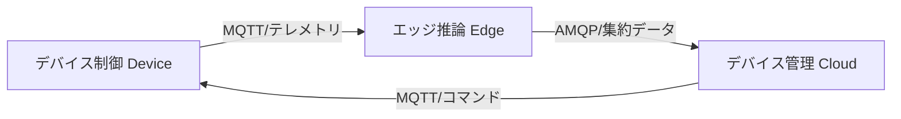

# IoT ドメイン分析テンプレ（記入ガイド付き）

> 目的：ユースケース文書を根拠に、DDD 観点でドメイン分析を行い、IoT/Physical AI の3層境界（Device/Edge/Cloud）を明示して定義する。

---

## 使い方（必読）
1. 成果物 `docs/domain-analytics.md` は、このテンプレを **コピーして**作成する。
2. 推測は禁止。根拠がない場合は `TBD` を置き、`根拠:` に参照ファイル（パス）を記す。
3. 例は **あくまで例**。対象プロジェクト固有の用語/ID に置き換える。
4. サンプルデータ（`data/.../sample-data.json`）の **値の転記は禁止**。必要なら「フィールド名/型/意味」を要約する。

---

## 記法ルール
- セクション見出しは削除しない（将来の自動処理/比較のため）。
- 各セクションは以下の構造を推奨：
  - **必須**：最低限埋めるべき項目
  - **任意**：あれば有益だが未確定でも可
  - **例**：短い例（2〜10行程度）
  - **根拠**：参照ファイル（パス）／決定理由
- キーワード：
  - `TBD`：未確定
  - `N/A`：該当なし（理由を併記）

---

## 1. 概要（Summary）

### 必須
- プロジェクト概要（1〜3行）
- IoT ドメインの分類（産業IoT / コンシューマ / ヘルスケア / スマートシティ 等）
- 対象デバイスの種別概要

### 根拠
- （ユースケース文書のパスを記載）

---

## 2. ユビキタス言語（Ubiquitous Language）

### 必須
| 用語 | 定義 | IoT 固有（Y/N） | 所属層（Device/Edge/Cloud） |
|------|------|----------------|---------------------------|

### 例
| 用語 | 定義 | IoT 固有 | 所属層 |
|------|------|---------|--------|
| テレメトリ | デバイスから送信されるセンサー計測データ | Y | Device → Cloud |
| デバイスツイン | クラウド上のデバイス状態のデジタル表現 | Y | Cloud |
| OTA更新 | Over-The-Air によるファームウェア更新 | Y | Cloud → Device |

---

## 3. エンティティ（Entity）

### 必須
| エンティティID | 名称 | 所属層 | 識別子 | 主要属性 | 備考 |
|---------------|------|--------|--------|---------|------|

### 根拠
- （ユースケース文書・データモデル文書のパスを記載）

---

## 4. 値オブジェクト（Value Object）

### 必須
| VO ID | 名称 | 所属層 | データ型 | 単位 | 有効範囲 | 備考 |
|-------|------|--------|---------|------|---------|------|

### 例
- テレメトリ値（温度、湿度、加速度）
- GPS 座標
- バッテリー残量

---

## 5. 集約（Aggregate）と集約ルート

### 必須
| 集約名 | 集約ルート | 所属層 | 含まれるエンティティ/VO | 不変条件 |
|--------|----------|--------|----------------------|---------|

---

## 6. ドメインサービス（Domain Service）

### 必須
| サービスID | 名称 | 所属層 | 責務概要 | 入力 | 出力 |
|-----------|------|--------|---------|------|------|

---

## 7. リポジトリ（Repository）

### 必須
| リポジトリID | 対象集約 | 所属層 | 永続化方式 |
|------------|---------|--------|----------|

---

## 8. ファクトリ（Factory）

### 任意
- 複雑な生成ロジックが必要なエンティティ/集約のみ記載

---

## 9. バウンデッドコンテキスト（Bounded Context）

### 必須
| BC ID | 名称 | 所属層（Device/Edge/Cloud） | 責務概要 | 主要集約 |
|-------|------|---------------------------|---------|---------|

### 例
| BC ID | 名称 | 所属層 | 責務概要 | 主要集約 |
|-------|------|--------|---------|---------|
| BC-01 | デバイス制御 | Device | センサー読み取り・アクチュエーター制御 | Device集約 |
| BC-02 | エッジ推論 | Edge | リアルタイム異常検知・フィルタリング | EdgeProcessor集約 |
| BC-03 | デバイス管理 | Cloud | デバイス登録・監視・OTA更新 | DeviceFleet集約 |

---

## 10. コンテキストマップ（Context Map）

### 必須
- Mermaid 図で Bounded Context 間の関係を可視化
- 統合スタイルに IoT 固有プロトコル（MQTT / AMQP / BLE / LoRa 等）を含める

### 例

---

## 11. ドメインイベント（Domain Event）

### 必須
| イベントID | イベント名 | 発生元層 | 伝播経路 | ペイロード概要 | トリガー条件 |
|-----------|----------|---------|---------|-------------|-----------|

### 例
| イベントID | イベント名 | 発生元層 | 伝播経路 | ペイロード | トリガー |
|-----------|----------|---------|---------|----------|---------|
| EVT-01 | テレメトリ受信済 | Device | Device→Edge→Cloud | センサー値+タイムスタンプ | サンプリング周期到達 |
| EVT-02 | 異常検知済 | Edge | Edge→Cloud | 異常種別+確信度+センサー値 | 推論結果が閾値超過 |
| EVT-03 | OTA更新完了 | Device | Device→Cloud | FW バージョン+更新結果 | FW書き込み完了 |

---

## 12. リアルタイム制約分類

### 必須
| BC/サービス | 制約レベル | レイテンシ要件 | 根拠 |
|------------|----------|-------------|------|

### 例
| BC/サービス | 制約レベル | レイテンシ要件 | 根拠 |
|------------|----------|-------------|------|
| デバイス制御 | Hard RT | < 10ms | 安全停止制御 |
| エッジ推論 | Soft RT | < 100ms | 異常検知のUX要件 |
| デバイス管理 | Best Effort | < 5s | ダッシュボード表示 |

---

## 13. メモ

### 任意
- 分析中の未決事項、仮説、今後の調査項目

---

## 14. 参照

### 必須
- 参照したユースケース文書のパスを記載

---

## 最終チェックリスト（必須）

- [ ] 1〜12 を埋めた（未確定は TBD ＋根拠）
- [ ] 全 BC に Device/Edge/Cloud の所属層を明記した
- [ ] ドメインイベントに IoT 固有イベント（テレメトリ・OTA・異常検知等）を含めた
- [ ] コンテキストマップに IoT プロトコル（MQTT/AMQP/BLE 等）を記載した
- [ ] リアルタイム制約分類を全 BC/サービスについて行った
- [ ] 推測でデータ量・SLA を記載していない（根拠がない場合 TBD）
