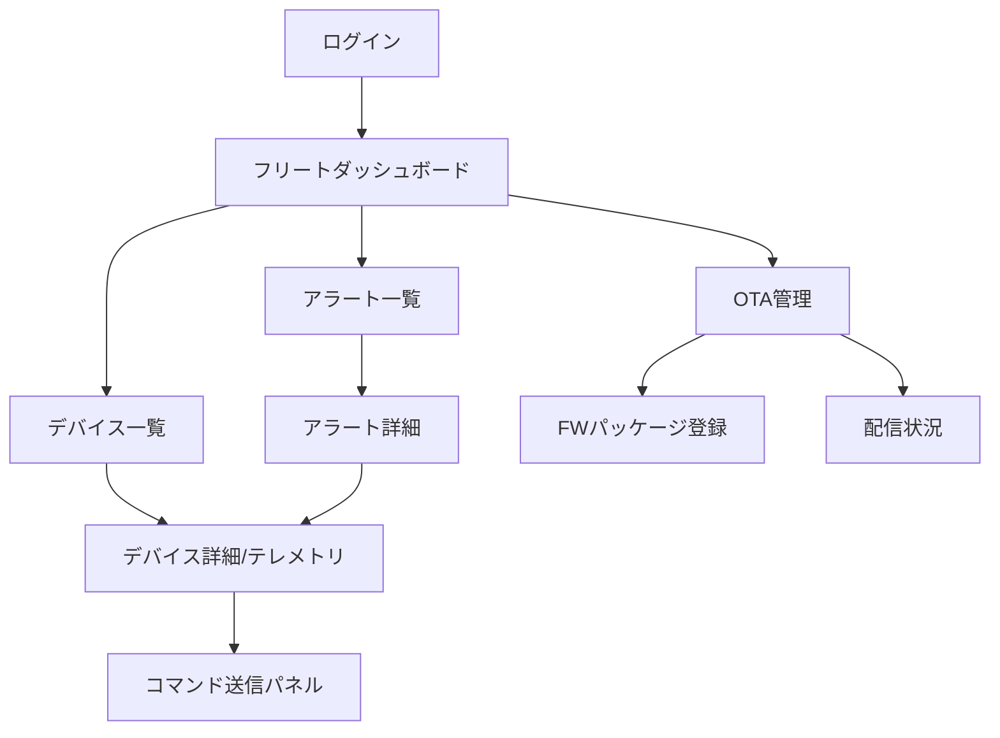

# IoT 画面一覧テンプレ（記入ガイド付き）

> 目的：IoT システムの画面一覧・画面遷移・リアルタイム更新要件を一貫した粒度で定義する（成果物パス：`docs/screen-list.md`）。

---

## 使い方（必読）
1. 成果物 `docs/screen-list.md` は、このテンプレを **コピーして**作成する（画面一覧・画面遷移・リアルタイム更新要件をすべて本ファイルに記載する）。
2. 推測は禁止。根拠がない場合は `TBD` を置き、`根拠:` に参照ファイル（パス）を記す。
3. 例は **あくまで例**。対象プロジェクト固有の用語/ID に置き換える。
4. サンプルデータ（`data/.../sample-data.json`）の **値の転記は禁止**。必要なら「フィールド名/型/意味」を要約する。

---

## 記法ルール
- セクション見出しは削除しない（将来の自動処理/比較のため）。
- 各セクションは以下の構造を推奨：
  - **必須**：最低限埋めるべき項目
  - **任意**：あれば有益だが未確定でも可
  - **例**：短い例（2〜10行程度）
  - **根拠**：参照ファイル（パス）／決定理由
- キーワード：
  - `TBD`：未確定
  - `N/A`：該当なし（理由を併記）

---

## 1. 概要（Summary）

### 必須
- システム概要（1〜3行）
- 対象ユーザー/ロール
- UI プラットフォーム（Web / モバイル / 組み込み HMI 等）

### 根拠
- （ユースケース文書のパスを記載）

---

## 2. 画面一覧

### 必須
| 画面ID | 画面名 | 種別 | 主要機能 | 対応サービス | 対応ユースケースID | 優先度 |
|-------|------|------|---------|-----------|---------------|------|

### 種別の分類
- **ダッシュボード**：複数デバイスの状態・メトリクスを集約表示
- **デバイス管理**：デバイス一覧・登録・設定・プロビジョニング
- **テレメトリ監視**：リアルタイムセンサーデータの時系列グラフ表示
- **アラート管理**：アラート一覧・詳細・対応状況管理
- **OTA管理**：ファームウェア更新管理・配信状況
- **フリート管理**：デバイス群の一括操作・ポリシー管理
- **設定**：システム設定・ユーザー設定
- **レポート**：集計データ・分析レポート

### 例
| 画面ID | 画面名 | 種別 | 主要機能 | 対応サービス |
|-------|------|------|---------|-----------|
| SCR-01 | フリートダッシュボード | ダッシュボード | 全デバイスの状態サマリー表示 | デバイス管理サービス |
| SCR-02 | デバイス詳細 | テレメトリ監視 | リアルタイムセンサーデータ表示 | テレメトリサービス |
| SCR-03 | アラート一覧 | アラート管理 | アクティブアラートの一覧・対応 | アラートサービス |
| SCR-04 | OTA管理 | OTA管理 | FW更新パッケージ配信・進捗管理 | OTA更新サービス |

### 根拠
- （ユースケース文書・サービスカタログのパスを記載）

---

## 3. IoT 固有画面の分類

### 3.1 デバイス管理画面
| 画面ID | 機能概要 | 主要操作 |
|-------|---------|---------|

### 3.2 テレメトリ監視画面
| 画面ID | 表示メトリクス | 更新頻度 | グラフ種別 |
|-------|------------|---------|---------|

### 3.3 アラート管理画面
| 画面ID | アラート種別 | 重要度フィルター | エスカレーション |
|-------|-----------|------------|------------|

### 3.4 OTA 管理画面
| 画面ID | 対象デバイス種別 | 配信ポリシー | ロールバック操作 |
|-------|------------|-----------|------------|

### 3.5 フリート管理画面
| 画面ID | 管理対象グループ | 一括操作種別 |
|-------|------------|---------|

---

## 4. 画面遷移図（Mermaid）

### 必須
- 主要な画面遷移を Mermaid で可視化

### 例

### 根拠
- （ユースケース文書・画面遷移要件のパスを記載）

---

## 5. リアルタイム更新要件

### 必須
- 各画面のリアルタイムデータ更新方式を定義

| 画面ID | 更新対象データ | 更新頻度 | 更新方式 | バッファリング | 備考 |
|-------|------------|---------|---------|------------|------|

### 5.1 更新方式の選定

| 更新方式 | 適用条件 | 採否 | 選定理由 |
|--------|---------|------|---------|
| WebSocket | 双方向・高頻度（< 1秒更新） | TBD | |
| Server-Sent Events (SSE) | 一方向・中頻度（秒〜分単位） | TBD | |
| ポーリング（Short Polling） | 低頻度（分単位以上） | TBD | |
| Long Polling | SSE 代替（古いブラウザ対応） | TBD | |

### 5.2 接続断時の挙動
- 再接続戦略（自動再接続・指数バックオフ）
- オフライン表示（最終更新時刻の表示・グレーアウト）
- データキャッシュ（ローカルストレージ/IndexedDB の活用）

### 根拠
- （リアルタイム要件・ユースケース文書のパスを記載）

---

## 6. メモ

### 任意
- 分析中の未決事項、仮説、今後の調査項目

---

## 最終チェックリスト（必須）

- [ ] 1〜5 を埋めた（未確定は TBD ＋根拠）
- [ ] 全ユースケースに対応する画面を網羅した
- [ ] IoT 固有画面（デバイス管理/テレメトリ監視/アラート管理/OTA管理/フリート管理）を含めた
- [ ] 画面遷移図（Mermaid）を作成した
- [ ] リアルタイム更新方式（WebSocket/SSE/ポーリング）の選定理由を記載した
- [ ] 接続断時の挙動を定義した
- [ ] 推測でデータ量・更新頻度を記載していない（根拠がない場合 TBD）
