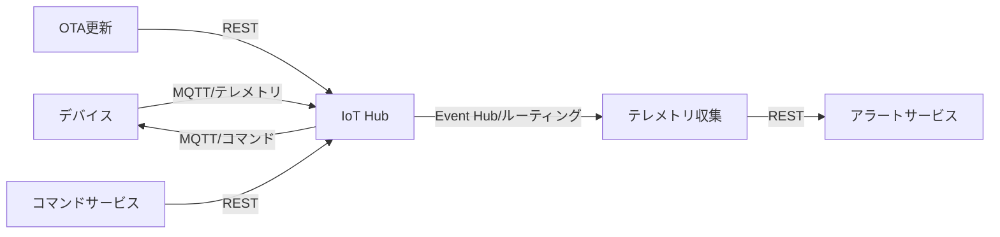

# IoT サービスカタログテンプレ（記入ガイド付き）

> 目的：IoT システムを構成するマイクロサービスの一覧・種別・API エンドポイント・依存関係・サービス間通信方式を一貫した粒度で定義する。

---

## 使い方（必読）
1. 成果物 `docs/service-catalog.md` は、このテンプレを **コピーして**作成する。
2. 推測は禁止。根拠がない場合は `TBD` を置き、`根拠:` に参照ファイル（パス）を記す。
3. 例は **あくまで例**。対象プロジェクト固有の用語/ID に置き換える。
4. サンプルデータ（`data/.../sample-data.json`）の **値の転記は禁止**。必要なら「フィールド名/型/意味」を要約する。

---

## 記法ルール
- セクション見出しは削除しない（将来の自動処理/比較のため）。
- 各セクションは以下の構造を推奨：
  - **必須**：最低限埋めるべき項目
  - **任意**：あれば有益だが未確定でも可
  - **例**：短い例（2〜10行程度）
  - **根拠**：参照ファイル（パス）／決定理由
- キーワード：
  - `TBD`：未確定
  - `N/A`：該当なし（理由を併記）

---

## 1. 概要（Summary）

### 必須
- サービスカタログの全体概要（1〜3行）
- 主要なサービス群の分類

### 根拠
- （ドメイン分析文書・ユースケース文書のパスを記載）

---

## 2. サービス一覧

### 必須
| サービスID | サービス名 | 種別 | 概要（One-liner） | 主要 API エンドポイント | 依存サービス | ホスティング | 優先度 |
|-----------|---------|------|----------------|-------------------|-----------|-----------|------|

### 種別の分類
- **デバイス管理**：デバイス登録・プロビジョニング・監視・設定管理
- **テレメトリ**：センサーデータの受信・処理・保存・集約
- **OTA更新**：ファームウェア更新パッケージ管理・配信・進捗追跡
- **エッジ推論**：エッジでの AI/ML 推論オーケストレーション
- **アラート**：異常検知・アラート生成・通知・エスカレーション
- **コマンド**：Cloud→Device コマンド送信・実行状況追跡
- **フリート管理**：デバイスグループ管理・ポリシー適用
- **認証/認可**：デバイス認証・ユーザー認証・アクセス制御

### 例
| サービスID | サービス名 | 種別 | 概要 | 主要 API |
|-----------|---------|------|------|---------|
| SVC-01 | デバイス登録サービス | デバイス管理 | デバイスの登録・プロビジョニング管理 | POST /devices, GET /devices/{id} |
| SVC-02 | テレメトリ収集サービス | テレメトリ | センサーデータ受信・バリデーション・保存 | POST /telemetry |
| SVC-03 | OTA更新サービス | OTA更新 | FWパッケージ管理・配信スケジュール | POST /ota/packages, POST /ota/deployments |
| SVC-04 | アラートサービス | アラート | 異常検知・アラート生成・通知 | GET /alerts, PATCH /alerts/{id} |
| SVC-05 | コマンドサービス | コマンド | Cloud→Device コマンド送信・追跡 | POST /commands, GET /commands/{id}/status |

### 根拠
- （ドメイン分析文書・ユースケース文書のパスを記載）

---

## 3. IoT 固有サービス詳細

### 3.1 デバイス登録/プロビジョニング
- プロビジョニングフロー（ゼロタッチ / マニュアル / DPS 経由）
- デバイス証明書の発行・管理方式
- 初回接続時の設定配布（デバイスツイン初期値）

### 3.2 テレメトリ収集・集約
- メッセージ受信プロトコル（MQTT / AMQP / HTTP）
- 受信レート（最大 messages/sec）：TBD
- バリデーションルール（スキーマ検証・値域チェック）
- 集約処理（ウィンドウ集計・ダウンサンプリング）

### 3.3 コマンド送信
- コマンドキューイング方式
- コマンドの TTL 設定
- コマンド実行結果の確認方式（Ack / 状態ポーリング）
- コマンド失敗時の再試行・エスカレーション

### 3.4 OTA 更新管理
- FW パッケージの格納場所（Storage アカウント等）
- 配信ポリシー（段階的ロールアウト / カナリアデプロイ）
- 更新進捗の追跡方式
- ロールバック手順

### 3.5 エッジ推論オーケストレーション
- エッジモジュールのデプロイ管理（IoT Edge / Kubernetes Edge）
- モデルの配信・バージョン管理
- 推論結果のクラウド送信方式

---

## 4. サービス間通信マトリクス

### 必須
- サービス間の通信方式（同期/非同期）を一覧化

| 送信元 | 受信先 | 通信方式 | プロトコル/インフラ | 備考 |
|-------|-------|---------|----------------|------|

### 通信方式の分類

#### 4.1 同期通信（REST / gRPC）
| 送信元サービス | 受信先サービス | メソッド | エンドポイント | SLA（レイテンシ） |
|-------------|-------------|--------|-------------|---------------|

#### 4.2 非同期通信（メッセージング）
| 送信元サービス | 受信先サービス | プロトコル | トピック/キュー名 | メッセージ形式 | 冪等性 |
|-------------|-------------|---------|------------|----------|------|

### 例（Mermaid）

### 根拠
- （アーキテクチャ設計書・ドメイン分析文書のパスを記載）

---

## 5. API 仕様概要

### 必須
- 各サービスの主要エンドポイントを概要として記載（詳細は各サービス仕様書を参照）

#### 5.x {サービスID}: {サービス名}

| メソッド | パス | 概要 | リクエスト概要 | レスポンス概要 | 認証 |
|--------|------|------|------------|-----------|-----|

### 根拠
- （API 設計書・OpenAPI 定義ファイルのパスを記載）

---

## 6. メモ

### 任意
- 分析中の未決事項、仮説、今後の調査項目

---

## 最終チェックリスト（必須）

- [ ] 1〜5 を埋めた（未確定は TBD ＋根拠）
- [ ] IoT 固有サービス（デバイス登録/テレメトリ/コマンド/OTA/エッジ推論/アラート）を網羅した
- [ ] サービス間通信マトリクス（同期/非同期）を定義した
- [ ] 非同期通信のプロトコル（MQTT/AMQP/Event Hub）を明記した
- [ ] API エンドポイント概要を記載した
- [ ] 推測でスループット・SLA を記載していない（根拠がない場合 TBD）
