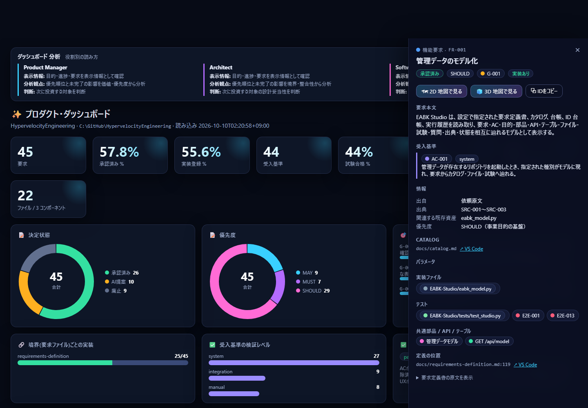
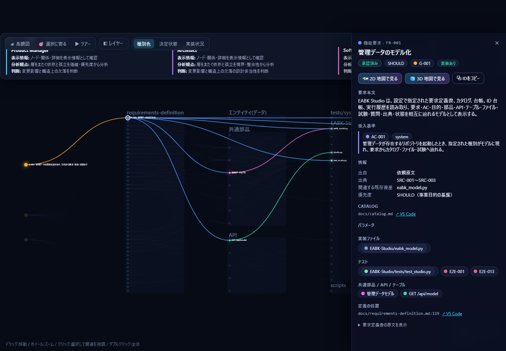
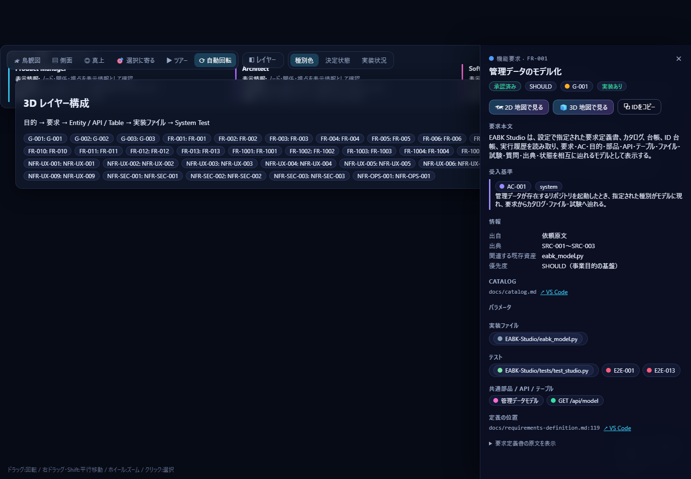
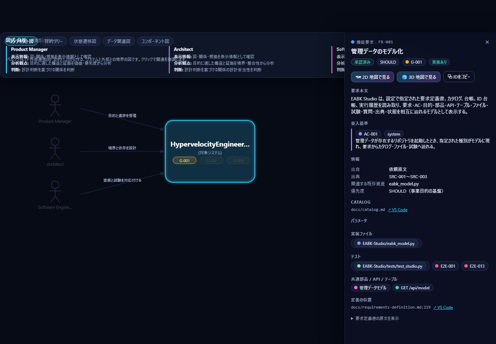
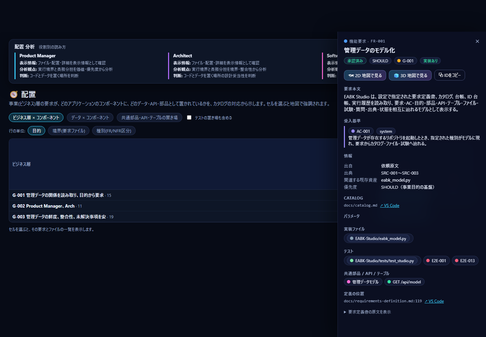
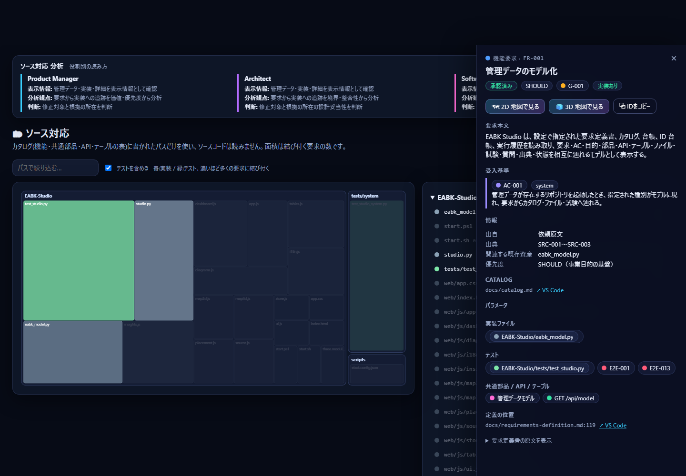
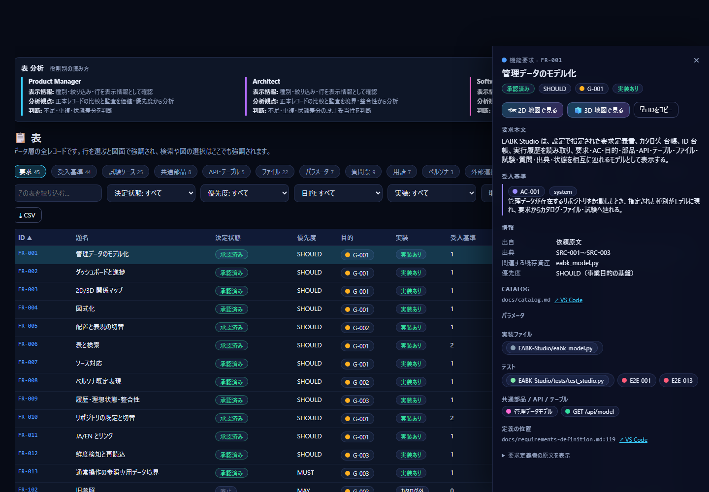

# 2. 画面の見かた

上部のタブで切り替えます。どの画面でも、**選んだ項目と、それに関連する項目が強調**されます（検索・図・表で共通）。

## 実画面の例

以下は同じコミットの管理データを読み取り、Playwright 検証で保存した実画面です。
採取条件と SHA-256 は [screen-images.json](screen-images.json) に記録しています。

| 画面 | 実画面 |
|---|---|
| ダッシュボード |  |
| 2D マップ |  |
| 3D マップ |  |
| 図式 |  |
| 配置 |  |
| ソース対応 |  |
| 表 |  |

## ダッシュボード
要求・承認・実装登録・受入基準・試験合格・未回答の質問・BLOCKED の数。決定状態、優先度、目的ごとの進捗、要求の境界（要求を分けたファイル）ごとの実装、受入基準の検証レベル、System Test の結果、実行履歴。**グラフや数字をクリックすると、該当する要求が 2D マップで強調されます。**

## 2D マップ
左から右へ「目的 → 要求 → データ・共通部品・API・テーブル → ソースファイル → 試験ケース」の順に並べた全体図です。

| 操作 | 結果 |
|---|---|
| ホイール／ドラッグ | 拡大縮小／移動 |
| 点にポイント | 直接つながる項目を強調 |
| 点をクリック | 2 段先まで強調し、右に詳細 |
| ダブルクリック／「鳥観図」 | 全体を見渡す |
| 「ツアー」 | 目的ごとに自動でカメラが巡る |
| 「レイヤー」 | 受入基準・パラメータ・質問などの表示を追加 |
| 色の切替 | 種別／決定状態／実装状況（赤＝未実装）で要求を色分け |

左下のミニマップをクリックすると、その場所へ飛べます。

## 3D マップ
2D と同じ関係を、層にして立体で見ます。ドラッグで回転、右ドラッグか Shift+ドラッグで平行移動、ホイールでズームです。選ぶとカメラが寄り、関連する線に光が流れます。「側面」で層の積み重なり、「真上」で配置の広がり、「自動回転」で何もしないときのゆっくりした回転を切り替えます。

## 図式
要求定義でよく使う図を、データ層の内容だけから作ります。

| 図 | 分かること |
|---|---|
| コンテキスト図 | システムと、利用者（ペルソナ）・外部連携の境界 |
| 目的ツリー | 目的ごとの要求の数と、実装の有無（色） |
| 状態遷移図 | 申請・実行などの対象が取る状態と遷移 |
| データ関連図 | 要求で一緒に扱われるデータ（エンティティ）のつながり |
| コンポーネント図 | アプリの部品（コンポーネント）、その中のモジュール、置かれた共通部品・API・テーブル |

## 配置
「事業の要求が、アプリのどこに作られているか」の表（ヒートマップ）です。

- **ビジネス層 × コンポーネント**: 行は目的・境界・種別から選びます。数字は、その行の要求のうち、そのコンポーネントに実装があるものの数です。
- **データ × コンポーネント**: 要求の「対象エンティティ」（扱うデータ）が、どこで実装されているか。
- **共通部品・API・テーブルの置き場**: それぞれの定義ファイルがあるコンポーネント。

セルを選ぶと、要求とファイルの一覧が出て、地図でも強調されます。

`#/placement?kind=runtime` では、PC、ブラウザー、Studio サーバー、対象リポジトリ、
管理データ、実装ファイル、明示されたクラウド/外部境界の位置と読取・書込・外部送信方向を確認できます。

## 構造・一貫性・保守

- `#/structure`: 全データ層を、現状・理想・差分・適用規則・判定理由・根拠で比較します。
- `#/consistency`: 要求 → AC → System Test → カタログ → 実装ファイルを要求 ID ごとに追跡します。
- `整合性保守 / Maintenance`: 要求正本と異なるカタログ行をプレビューし、確認後に題名と決定状態だけを更新します。

## ソース対応
カタログに書かれたファイルの名前を、面積で見る図（ツリーマップ）です。面積は結び付く要求の数で、青は実装、緑はテストです。ファイルを選ぶと、そのファイルが満たす要求・使っている部品・テストが分かります。**ソースコードの中身は読みません。**

## 表
全レコードの一覧です（要求・受入基準・試験ケース・共通部品・API/テーブル・ファイル・パラメータ・質問票・用語・ペルソナ・外部連携・決定記録・監査指摘・出典・実行履歴）。見出しで並べ替え、上の欄で絞り込み、「選択に関連する行だけ」で、地図で選んだものに関係する行だけを表示、CSV で書き出せます。

## 右の詳細パネル
項目を選ぶと出ます。要求なら本文、受入基準、決定状態、優先度、上位の目的、扱うデータ、パラメータ、実装ファイル、テスト、BLOCKED の質問が分かります。「VS Code」リンクで、定義の位置やファイルをエディターで開けます。「2D／3D 地図で見る」で画面を移れます。
