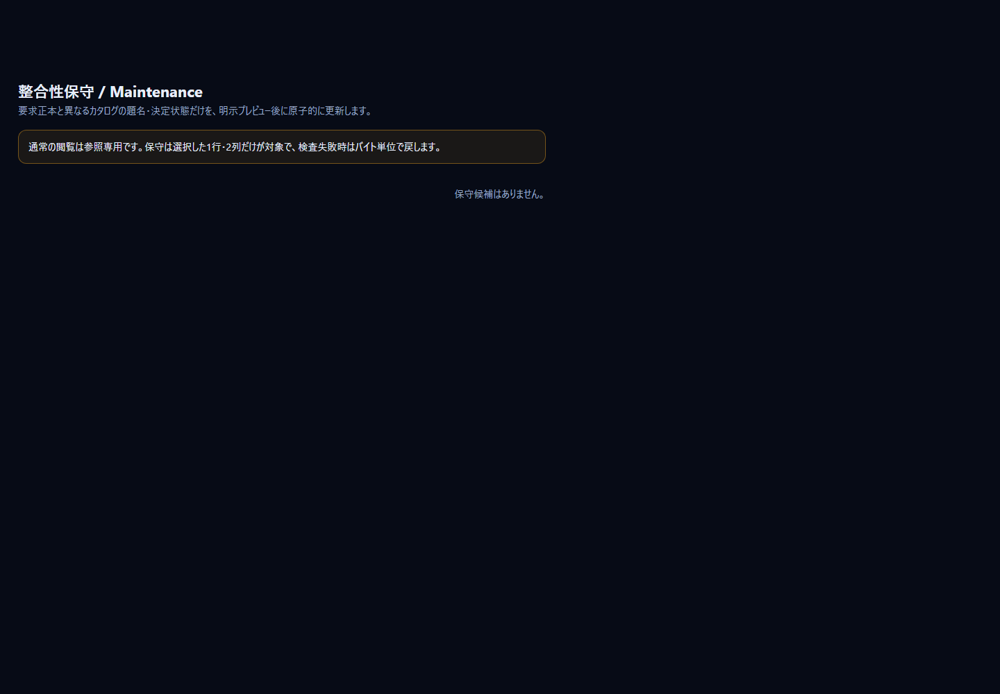

# 5. Product Manager 向けガイド

「何を作ると決めたか」「どこまで進んだか」「次に何へ投資するか」を、コードを読まずに判断するための手順です。所要時間は約 15 分です。

画面右上の `🎯 Product Manager` を押すと、ダッシュボードが開きます。`--role pm` で起動しても、最初にこの画面が開きます。


> 画像は、このツールを作ったリポジトリ自身のデータを読んだ例です。あなたのリポジトリでは、数字や ID が違います。

## 5.1 見る画面と、読んでいるデータ

| 画面 | PM が見ること | 読むデータ（詳細は [08](08-data-reference.md)） |
|---|---|---|
| ダッシュボード | 要求数・承認率・実装登録率・試験合格率・未回答の質問・BLOCKED | 要求定義書、カタログ、台帳、質問票 |
| 目的ごとの進捗 | 事業の目的（G）ごとの、実装登録済みの要求の割合 | 目的、要求の `上位`、カタログ |
| 表 → 質問票・決定記録・出典 | 回答待ちの質問、いつ何を決めたか、何を根拠にしたか | 要求定義書の表 |
| 2D マップ | 要求がどの目的・データ・部品につながるか | 要求定義書、カタログ |
| 整合性保守 | 要求とカタログの題名・状態のずれ | 要求定義書、カタログ |

## 5.2 15 分のチュートリアル

1. **起動します**（約 1 分）。リポジトリのフォルダーで次を実行します。ブラウザーが開きます。
   ```powershell
   python EABK-Studio/studio.py --role pm
   ```
   うまく開かないときは、先に `python EABK-Studio/studio.py --check` で、データ層が見つかっているかを確認します。
2. **全体の数字を読みます**（2 分）。ダッシュボードの上段の数字を、左から読みます。

   

   | 数字 | 読み方 |
   |---|---|
   | 要求 | 決定状態を問わない全件 |
   | 承認済み % | 人が承認した要求の割合。低いと、まだ「AI の提案」が多い |
   | 実装登録 % | カタログに実装ファイルが書かれた要求の割合（作られたかではなく、**登録されたか**） |
   | 試験合格 % | System Test のうち pass の割合。`not_run` は含めない |
   | 未回答の質問 | あなたの回答待ちの項目 |
   | BLOCKED の要求 | 質問が未回答で、進められない受入基準を持つ要求 |
3. **数字の中身を見ます**（2 分）。`実装登録 %` のカードをクリックします。その数字に含まれる要求が、2D マップで強調されます。ダッシュボードのグラフ・数字は、どれもクリックできます。
4. **目的ごとの進捗を見ます**（2 分）。ダッシュボードの「目的ごとの実装進捗」で、進みが遅い目的の棒をクリックします。その目的に属する要求が地図で光ります。**色の切替**を `実装状況` にすると、未登録の要求が赤で分かります。
5. **回答待ちの質問に答える準備をします**（2 分）。`表` → `質問票` を開き、`state` の絞り込みで「回答済み」以外の状態を選びます。質問・選択肢・推奨が並びます。BLOCKED の要求は、`表` → `要求` の「BLOCKED」列で分かります。回答は、EABK の運用に従って `<answers>` として conductor へ渡します（本体 README の「依頼の書き方」）。Studio からは回答できません。
   
6. **決定の経緯を見ます**（2 分）。`表` → `決定記録`・`出典` で、日付・対象・決定・根拠・run を確認します。ダッシュボード下部の「設計・開発履歴と進捗」の各カードを押すと、根拠のファイルと行が右に出ます。
7. **要求の中身を確かめます**（2 分）。上部の検索欄（`/` キー）に気になる言葉を入れ、結果を選びます。右の詳細パネルに、要求の本文・受入基準・優先度・上位の目的・実装ファイルが出ます。
8. **ずれを確認します**（1 分）。`整合性保守` を開きます。要求の題名や決定状態と、カタログの記載が違う行があれば候補に出ます。直すかどうかは 5.4 を参照してください。

   
9. **言語を切り替えます**（1 分）。右上の `JA | EN` で切り替えると、役員・海外のメンバーにもそのまま見せられます。

## 5.3 おすすめのリンク

ブラウザーのアドレスに、起動時の URL（`http://127.0.0.1:8765/`）の後ろを付けて開きます。

| 目的 | リンク |
|---|---|
| 全体の進み具合 | `#/dashboard` |
| 特定の要求の周りを見る | `#/map2d?q=<要求ID>`（部分一致で強調。検索欄に入った状態で開く） |
| 回答待ちの質問 | `#/tables?tab=questions` |
| 決定記録 | `#/tables?tab=decisions` |
| 要求の一覧（承認・優先度で絞る） | `#/tables?tab=reqs` |
| 目的の分解 | `#/diagrams?kind=goals` |
| 利用者・外部連携の境界 | `#/diagrams?kind=ctx` |

> `?select=<ID>` を付けたリンクは、画面の撮影用の表示（上部のメニューと検索が隠れます）になります。普段は `?q=` を使ってください。

## 5.4 PM が判断できること

| 判断 | 根拠にする画面 | 次の行動 |
|---|---|---|
| 次に投資する目的を決める | ダッシュボードの目的ごとの実装進捗、優先度の円グラフ | 進みが遅い目的の MUST の要求を、次の run の `scope` に入れる |
| 承認を進める | 承認済み %、`表` → `要求`（status = proposed。AI提案） | `<answers>` で承認・却下・保留を conductor へ渡す |
| 止まっている要求を動かす | BLOCKED の要求、未回答の質問 | 質問票へ回答する |
| 品質の状況を報告する | 試験合格 %、`表` → `試験ケース` | `not_run` が多いときは、run の実行を依頼する |
| 要求とカタログのずれを直す | `整合性保守` | プレビューを確認して実行（カタログの題名・決定状態だけが変わる） |

## 5.5 読むときの注意

- 「実装登録」は、カタログに書かれたパスの有無です。ファイルが実在するか、動くかは見ていません。動くかは「試験合格」と、`python scripts/verify.py` の結果で判断します。
- `試験合格 %` が 0 のときは、台帳がない・ケースが `not_run` のどちらかです。`python EABK-Studio/studio.py --check` で台帳が見つかっているかを確認できます。
- 要求の追加・変更は Studio ではできません。`/build` で依頼します（本体 README）。

次は [06-architect.md](06-architect.md)（設計の整合を見る）か、[08-data-reference.md](08-data-reference.md)（数字の根拠）へ進んでください。
