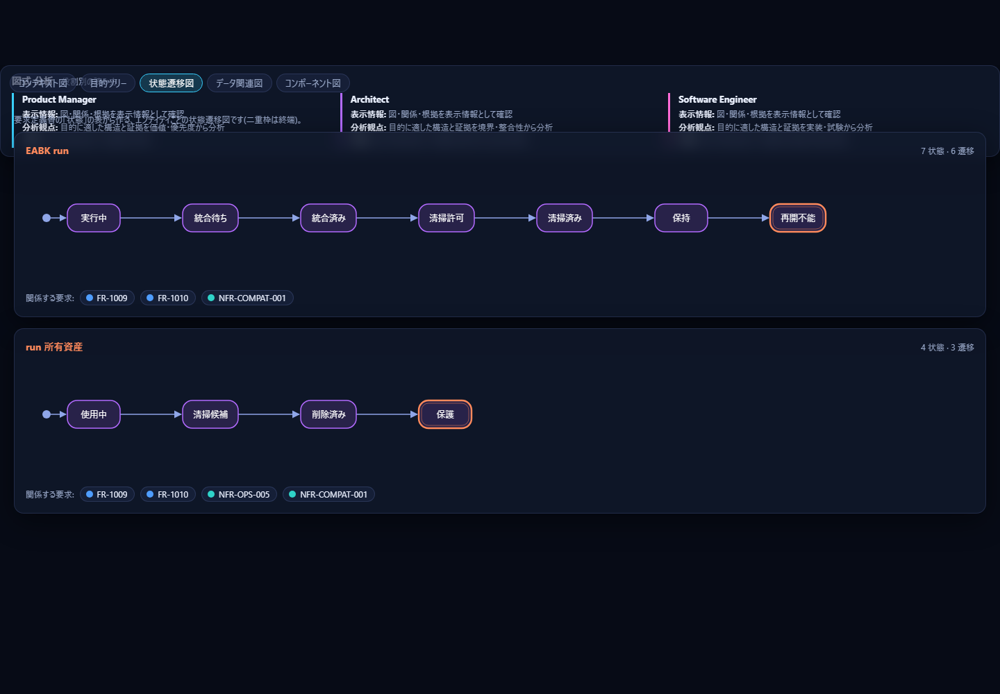
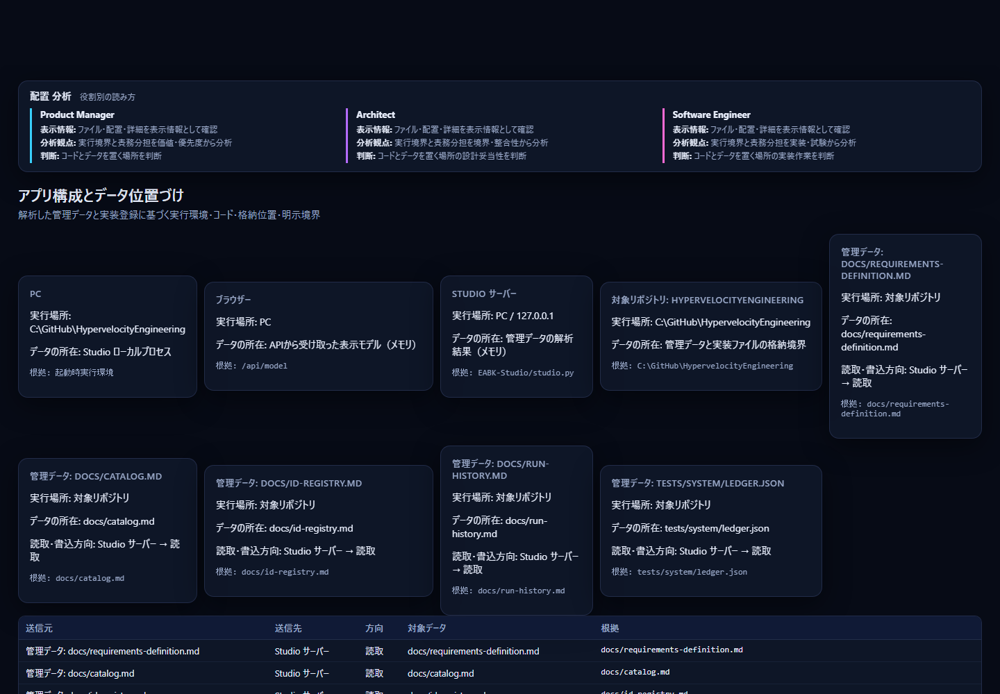
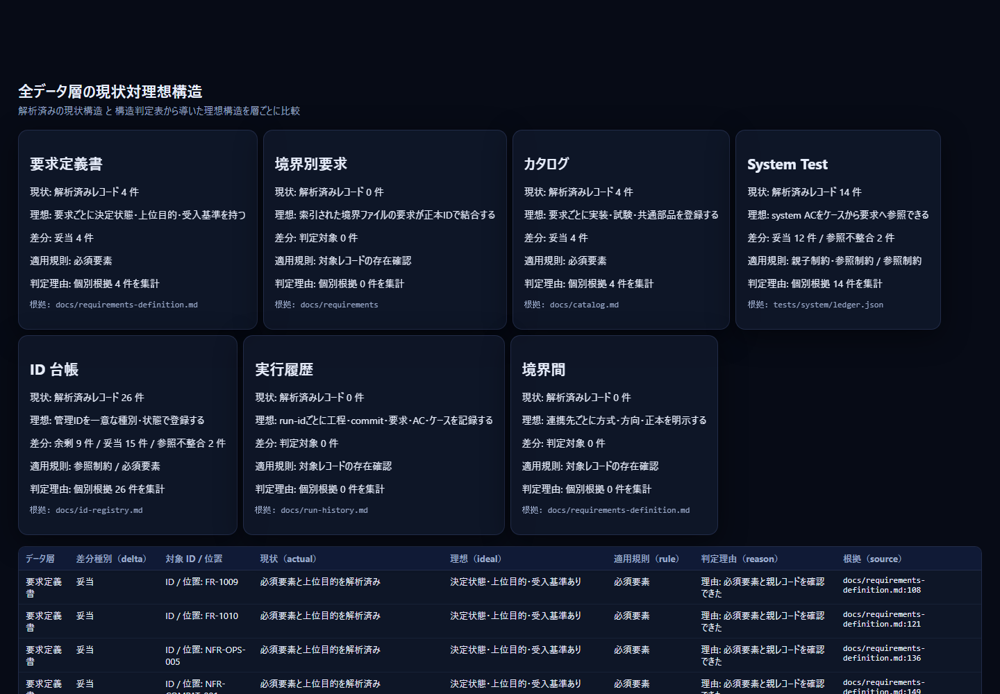

# 6. Architect 向けガイド

要求と実装の**つながり・境界・置き場所**を、設計の観点で確かめるための手順です。所要時間は約 15 分です。

画面右上の `🏗️ Architect` を押すと、2D マップが開きます。`--role architect` で起動しても、最初にこの画面が開きます。

## 6.1 見る画面と、読んでいるデータ

| 画面 | Architect が見ること | 読むデータ（詳細は [08](08-data-reference.md)） |
|---|---|---|
| 2D / 3D マップ | 目的 → 要求 → データ・部品・API・テーブル → ファイル → 試験の依存。孤立・集中 | 要求定義書、カタログ、台帳 |
| 図式 | 境界（コンテキスト）、状態遷移、データの関連、コンポーネント | 要求定義書の表、カタログのパス |
| 配置 | どの要求・データが、どのコンポーネントに実装されているか | 要求、カタログのパス |
| 配置（実行環境） | Studio が何を読み、何を書き、何を外へ出すか | 読み込んだファイル、外部連携 |
| ソース対応 | ファイルと要求の対応の濃さ | カタログのパス（コードは読まない） |
| 構造 | 7 つのデータ層の、現状と理想の差 | すべてのデータ層 |
| 一貫性 | 要求 → AC → 試験 → カタログ → 実装の欠け | 要求・台帳・カタログ |

## 6.2 15 分のチュートリアル

1. **起動します**（1 分）。
   ```powershell
   python EABK-Studio/studio.py --role architect
   ```
2. **全体を俯瞰します**（2 分）。2D マップは、左から「目的 → 要求 → データ・共通部品・API・テーブル → ソースファイル → 試験ケース」の順です。ホイールで拡大し、ドラッグで動かします。ダブルクリックか `鳥観図` で全体に戻ります。

   

   `レイヤー` で受入基準・パラメータ・質問を足せます。色の切替で、`実装状況` にすると、実装ファイルのない要求（赤）がすぐ分かります。
3. **1 つの要求の影響範囲を見ます**（2 分）。要求の点をクリックします。2 段先までの関連（データ・部品・ファイル・試験）が強調され、右に詳細が出ます。「変更するとどこに波及するか」の見当になります。`Esc` で解除します。
4. **立体で見ます**（1 分）。`3D マップ` で、同じ関係が層になって見えます。`側面` で層の積み重なり、`真上` で配置の広がりを確かめます。
5. **境界を確かめます**（2 分）。`図式` → `コンテキスト図` で、利用者（ペルソナ）と外部連携（方式・正本）を確認します。次に `状態遷移図` で、エンティティごとの状態と遷移を確認します。

   
6. **置き場所を確かめます**（2 分）。`配置` を開きます。行（目的・境界・種別）と列（コンポーネント）の交点の数字が、その行の要求のうち、そのコンポーネントに実装があるものの数です。特定の列に集中していないか、1 つの要求が多くのコンポーネントに散らばっていないかを見ます。

   

   セルを選ぶと、要求とファイルの一覧が出ます。`データ × コンポーネント` で、エンティティごとの置き場も確認します。
7. **Studio 自身の動きを確かめます**（1 分）。`#/placement?kind=runtime` を開きます。読むファイル、読む方向、書く先（なし）、外部送信（要求定義書の外部連携があればその定義）が一覧になります。導入前のセキュリティの確認に使えます。

   
8. **層の欠けを確かめます**（3 分）。`#/consistency` を開き、要求ごとに 要求・AC・試験・カタログ・実装ファイルの 5 つがそろっているかを見ます。続けて `#/structure` で、7 つのデータ層の「現状・理想・差分・適用規則・判定理由・根拠」を読みます。差分の種別は、妥当・不足・孤立・参照不整合・重複・余剰です。

   
9. **根拠の位置へ移ります**（1 分）。判定の行の `根拠`（ファイル:行）か、詳細パネルの `↗ VS Code` で、要求定義書やカタログの該当行を開きます。設計の修正は、`/build` で rd-author に依頼します。

## 6.3 おすすめのリンク

| 目的 | リンク |
|---|---|
| 依存の全体 | `#/map2d` |
| 特定の要求の周り | `#/map2d?q=<要求ID>` |
| 立体の俯瞰 | `#/map3d` |
| 境界（コンテキスト図） | `#/diagrams?kind=ctx` |
| 状態遷移 | `#/diagrams?kind=states` |
| データの関連 | `#/diagrams?kind=entities`、根拠付きの ER 図は `#/diagrams?kind=er` |
| コンポーネント構成 | `#/diagrams?kind=components` |
| 要求 × コンポーネント | `#/placement?tab=biz` |
| エンティティ × コンポーネント | `#/placement?tab=data` |
| 部品・API・テーブルの置き場 | `#/placement?tab=items` |
| Studio の読取・書込の位置づけ | `#/placement?kind=runtime` |
| 層の欠け | `#/consistency`、`#/structure` |
| 部品・API・テーブルの表 | `#/tables?tab=parts`、`#/tables?tab=apis` |

## 6.4 Architect が判断できること

| 判断 | 根拠にする画面 | 次の行動 |
|---|---|---|
| 変更の影響範囲 | 2D / 3D の 2 段先までの強調、詳細パネルの実装ファイル・部品 | 影響する要求・試験を、依頼の `scope` に含める |
| 責務の置き場所 | 配置のヒートマップ、コンポーネント図 | 1 つの責務が散らばっているなら、共通部品への切り出しを依頼する |
| 境界とデータの正本 | コンテキスト図、外部連携の表（方式・方向・正本） | 正本が空の連携を、要求定義書で補うよう依頼する |
| 状態モデルの妥当性 | 状態遷移図（終端のない状態、孤立した状態） | 状態の表の修正を依頼する |
| 設計の抜け | 一貫性（一層欠落）、構造（不足・孤立・参照不整合） | rd-author（要求・カタログ）か implementer（実装）への依頼を分ける |
| 導入の安全性 | 配置（実行環境）、[08 の 8.9・8.10](08-data-reference.md) | 読む・書く・送るの範囲を、セキュリティ担当へ説明する |

## 6.5 読むときの注意

- 地図の点の位置（座標）に意味はありません。意味があるのは、線でつながっているか、どの列・層にいるかです。
- コンポーネントは、カタログに書かれたパスの先頭の 1〜2 階層で決めます（[8.5.2](08-data-reference.md)）。実際のビルド単位とは限りません。
- 関係の根拠は、要求・カタログに**書かれたこと**だけです。ER 図の関係は、`関係` の記述がないものを推測せず「関係情報が不足」と表示します。
- ソースコードは読みません。コードの実際の依存関係（import など）は、このツールでは分かりません。

次は [07-software-engineer.md](07-software-engineer.md) か、[08-data-reference.md](08-data-reference.md) へ進んでください。
