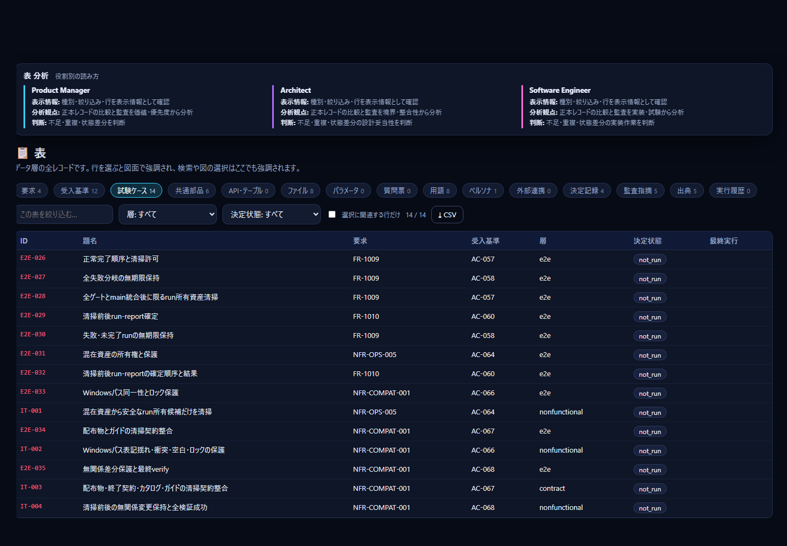
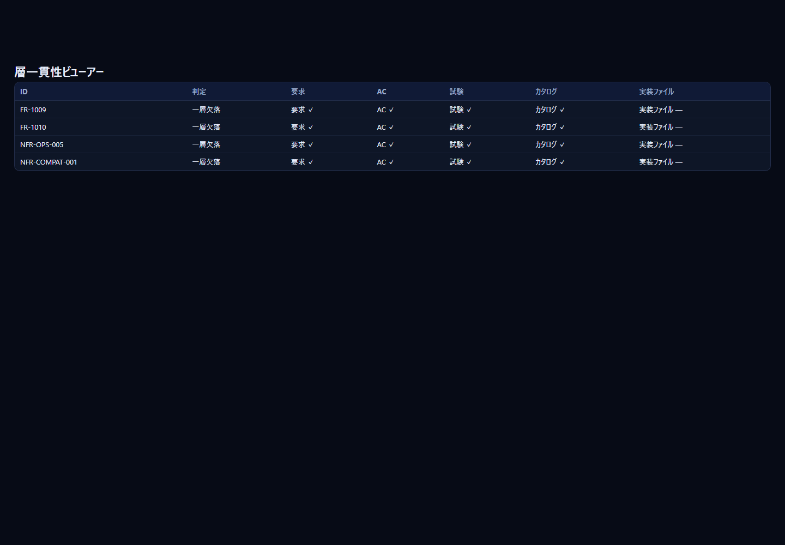

# 7. Software Engineer 向けガイド

「この要求を満たす実装・テストはどこか」「次に直すのはどのファイルか」を、要求から**ファイルまで**たどって決めるための手順です。所要時間は約 15 分です。

画面右上の `💻 Software Engineer` を押すと、表の画面が開きます。`--role swe` で起動しても、最初にこの画面が開きます。

## 7.1 見る画面と、読んでいるデータ

| 画面 | Software Engineer が見ること | 読むデータ（詳細は [08](08-data-reference.md)） |
|---|---|---|
| 表 → 要求・受入基準 | 要求の本文・受入基準・検証レベル・BLOCKED・実装の有無 | 要求定義書、カタログ |
| 表 → 試験ケース | ケースの層・状態・最終実行・実行コマンド | 台帳 |
| 表 → ファイル | 実装・テストのパスと、結び付く要求の数 | カタログ、台帳の `command` |
| ソース対応 | ファイルごとの、要求・共通部品・テストの対応 | カタログのパス |
| 詳細パネル | 要求 → 実装ファイル・テスト・部品・API・テーブル | カタログ |
| 一貫性 | 要求 → AC → 試験 → カタログ → 実装の欠け | 要求・台帳・カタログ |

## 7.2 15 分のチュートリアル

1. **起動します**（1 分）。
   ```powershell
   python EABK-Studio/studio.py --role swe
   ```
2. **作業する要求を選びます**（2 分）。`表` → `要求` を開きます。`status: すべて` の絞り込みで `approved`（承認済み）を、`impl` の絞り込みで `none`（実装ファイルが空）か `unlisted`（カタログに行がない）を選びます。優先度は `MUST` から見ます。

   
3. **要求の中身を読みます**（2 分）。行をクリックします。右の詳細パネルに、本文・受入基準（検証レベル system / integration / unit / manual）・BLOCKED が出ます。BLOCKED が付いた受入基準は、質問が未回答のため進められません。
4. **受入基準だけを並べます**（1 分）。`表` → `受入基準` で、検証レベルの絞り込みを使います。自分が書く単体・結合テストの対象（unit / integration）と、System Test の対象（system）を分けて見られます。
5. **既存のテストとコマンドを確認します**（2 分）。`表` → `試験ケース` を開きます。層（`layer`）・状態（`status`）・最終実行が並びます。

   

   行を選ぶと、詳細パネルに実行コマンド（`command`）・最後の commit・evidence が出ます。ここに書かれたコマンドで、そのケースを手元で実行できます。System Test の台帳は、`python scripts/ledger.py` でだけ更新します（直接編集しない）。
6. **実装のある場所へ移ります**（2 分）。要求の詳細パネルの「実装ファイル」「テスト」「共通部品・API・テーブル」のチップから、関係するファイルへ移れます。`↗ VS Code` のリンクを押すと、VS Code でファイルや定義の行が開きます（`vscode://file/…` を使うので、VS Code が入っている PC で動きます）。
7. **ファイルから要求へ逆引きします**（2 分）。`ソース対応` を開き、パスの絞り込みにファイル名を入れます。面積が大きいファイルは、多くの要求に結び付いています。変更するときの影響の大きさの目安になります。

   
8. **欠けた層を探します**（2 分）。`#/consistency` を開きます。判定が「一層欠落」の要求は、要求・AC・試験・カタログ・実装ファイルのどれかが欠けています。欠けている層が、あなたの作業の入口です。

   
9. **データを持ち出します**（1 分）。`表` の `CSV` で、表示中のタブの全行を書き出せます（UTF-8 で Excel でも開けます）。

## 7.3 おすすめのリンク

| 目的 | リンク |
|---|---|
| 要求の一覧 | `#/tables?tab=reqs` |
| 受入基準の一覧 | `#/tables?tab=acs` |
| 試験ケースと実行コマンド | `#/tables?tab=cases` |
| 実装・テストのファイル | `#/tables?tab=files` |
| 共通部品・API・テーブル | `#/tables?tab=parts`、`#/tables?tab=apis` |
| パラメータ（閾値・期間） | `#/tables?tab=params` |
| 用語（使ってはいけない言い方） | `#/tables?tab=terms` |
| ファイル → 要求の対応 | `#/source` |
| 特定の要求 | `#/map2d?q=<要求ID>` |
| 欠けた層 | `#/consistency` |

## 7.4 Software Engineer が判断できること

| 判断 | 根拠にする画面 | 次の行動 |
|---|---|---|
| 次に実装する要求 | `表` → `要求`（approved・MUST・impl が none/unlisted）、BLOCKED の有無 | `/build` の依頼の `scope` に要求 ID を指定する |
| 変更するファイル | 詳細パネルの実装ファイル・共通部品、ソース対応の面積 | 影響する要求の試験を実行する |
| 実行するテスト | `表` → `試験ケース` の `command`・層・状態 | `python scripts/ledger.py` で実行・記録する |
| 実装済みと言えるか | 一貫性（5 つの層）と、試験の `status` | 欠けた層を補う |
| 値の根拠 | `表` → `パラメータ`、AC 本文の `{PARAM-nnn}` | 値を変えるときは PARAM の決定を更新するよう依頼する |
| 使う言葉 | `表` → `用語`（使ってはいけない言い方） | 識別子・メッセージの命名に反映する |

## 7.5 読むときの注意

- 「実装あり」は、カタログにパスが書かれているかどうかです。ファイルの実在・内容は読みません。ずれが疑われるときは、`python scripts/verify.py` を実行してください。
- 試験ケースの `status` は、台帳に最後に記録された結果です。Studio はテストを実行しません。
- Studio は読み取り専用です（整合性保守の、カタログの題名・決定状態だけを除く）。実装も要求も、`/build` で依頼します。
- コードの中身・テストの結果の詳細（ログ）は表示しません。証跡の場所は、`試験ケース` の evidence の欄にあります。

[06-architect.md](06-architect.md) で設計の見方を、[08-data-reference.md](08-data-reference.md) で各画面の根拠を確認できます。
