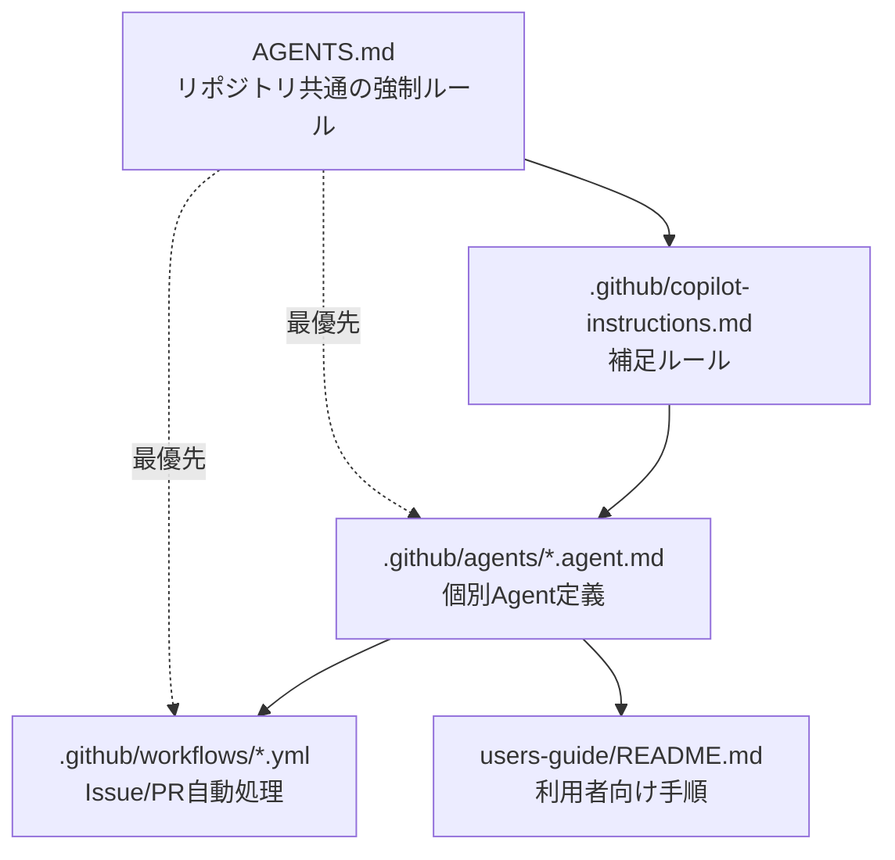
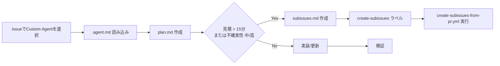

# HypervelocityEngineering

このリポジトリは、要件整理・設計・実装運用のためのテンプレートとガイドをまとめた作業ベースです。

## 目的

- プロジェクト開始時のドキュメント整備を標準化する
- 設計・要件・運用の参照先を一本化する
- エージェント運用時のルールを明確にする

## 対象読者

- プロダクトマネージャー
- アーキテクト / 開発リード
- 開発者（実装・レビュー担当）
- ドキュメント整備担当

## クイックスタート

1. ルール確認: `AGENTS.md`
2. 設計テンプレート確認: `docs/templates/`
3. サンプル確認: `sample/`
4. ユーザーガイド確認: `users-guide/`

## ディレクトリ構成

```text
.
├─ AGENTS.md
├─ docs/
│  └─ templates/
├─ sample/
└─ users-guide/
```

## 主なドキュメント

- `AGENTS.md`: リポジトリ運用の強制ルール
- `docs/templates/agent-playbook.md`: エージェント作業テンプレート
- `docs/templates/microservice-definition.md`: マイクロサービス定義テンプレート
- `sample/business-requirement.md`: 要件定義サンプル
- `sample/usecase-list.md`: ユースケース一覧サンプル
- `users-guide/README.md`: ユーザーガイド入口

## 使用方法に関する重要事項

本リポジトリの**具体的な使用手順・運用方法・実行フローは `users-guide/` 配下に集約**されています。
実務で利用する際は、最初に `users-guide/README.md` を参照し、各ユースケースに対応するガイドに従って進めてください。

- 使用方法の一次参照先: `users-guide/README.md`
- 設計・開発・運用の詳細手順: `users-guide/` 配下の各ガイド

運用の一貫性と品質確保のため、README は概要・索引、`users-guide/` は実行手順という役割分担で管理します。

## 進め方（推奨）

1. `sample/` を参考に要件を整理
2. `docs/templates/` を用いて設計ドキュメントを作成
3. `users-guide/` の該当ガイドで実装・運用の方針を確認
4. PR では目的・変更点・検証結果を明記

## sample ドキュメントの取り扱い

`sample/` 配下のドキュメントは、Microsoft 365 Copilot のリサーチツール Agent により作成されたサンプルです。
そのため、正式なプロジェクト成果物として利用する場合は、利用者が内容を確認したうえで、必要なファイルを `docs/` 配下へコピーして管理してください。

- `sample/`: 参照用サンプル（原本）
- `docs/`: プロジェクトで採用・運用する正式ドキュメント

この運用により、サンプルと正式版の責務を分離し、レビュー・更新履歴・参照先の一貫性を維持できます。

## 開発ルール（抜粋）

- 変更前に `AGENTS.md` を確認する
- 変更は最小差分で行う
- 検証手順（テスト/チェック）を PR に記録する
- 機密情報をコミットしない

## Custom Agent 索引

### 優先ルール（最重要）



- ルールの衝突時は `AGENTS.md` が常に優先
- 15分超または不確実性が中/高の場合は分割モード（Plan-Only）

### どこを編集すると何が変わるか

| 目的 | 編集するファイル/場所 | 影響範囲 |
|---|---|---|
| 全Agent共通ルールを変更 | `AGENTS.md` | 全Agent/全ワークフロー |
| Copilot向け補足ルールを変更 | `.github/copilot-instructions.md` | 全Agent実行時の指示 |
| 個別Agentの役割・入力・出力を変更 | `.github/agents/<Agent名>.agent.md` | 該当Agentのみ |
| Sub Issue自動作成を変更 | `.github/workflows/create-subissues-from-pr.yml` | 分割運用全体 |
| 15分判定のCI検証を変更 | `.github/workflows/validate-plan.yml` / `.github/workflows/check-split-mode.yml` | 分割判定/実装禁止チェック |
| 利用者向け説明を変更 | `users-guide/README.md` | 運用手順の理解 |

### Custom Agent 一覧（カテゴリ別）

#### アーキテクチャ/設計系（Arch-*）

| Agent名 | 主な役割 | ファイル |
|---|---|---|
| Arch-AIAgentDesign | AI Agentの定義/粒度/詳細設計を作成 | `.github/agents/Arch-AIAgentDesign.agent.md` |
| Arch-ApplicationCandidateAnalyzer | UCからアプリ候補/MVP選定のための定義を作成 | `.github/agents/Arch-ApplicationCandidateAnArchalyzer.agent.md` |
| Arch-ArchitectureCandidateAnalyzer | APPごとに最適アーキテクチャ候補を選定 | `.github/agents/Arch-ArchitectureCandidateAnalyzer.agent.md` |
| Arch-DataModeling | エンティティ抽出とデータモデル作成 | `.github/agents/Arch-DataModeling.agent.md` |
| Arch-Micro-DomainAnalytics | DDD観点のドメイン分析 | `.github/agents/Arch-Micro-DomainAnalytics.agent.md` |
| Arch-Micro-ServiceCatalog | 画面→機能→API→SoTのサービスカタログ化 | `.github/agents/Arch-Micro-ServiceCatalog.agent.md` |
| Arch-Micro-ServiceDetail | サービス詳細仕様を作成/更新 | `.github/agents/Arch-Micro-ServiceDetail.agent.md` |
| Arch-Micro-ServiceIdentify | ドメイン分析からサービス候補を抽出 | `.github/agents/Arch-Micro-ServiceIdentify.agent.md` |
| Arch-UI-Detail | 画面定義書を生成/更新 | `.github/agents/Arch-UI-Detail.agent.md` |
| Arch-UI-List | 画面一覧/遷移図を作成 | `.github/agents/Arch-UI-List.agent.md` |

#### 開発/デプロイ系（Dev-*）

| Agent名 | 主な役割 | ファイル |
|---|---|---|
| Dev-WebAzure-AddServiceDeploy | 追加Azureサービスを冪等デプロイ | `.github/agents/Dev-WebAzure-AddServiceDeploy.agent.md` |
| Dev-WebAzure-AddServiceDesign | 追加Azureサービスの設計 | `.github/agents/Dev-WebAzure-AddServiceDesign.agent.md` |
| Dev-WebAzure-ComputeDeploy-AzureFunctions | Functionsデプロイ/CI-CD/スモークテスト | `.github/agents/Dev-WebAzure-ComputeDeploy-AzureFunctions.agent.md` |
| Dev-WebAzure-ComputeDesign | Azureコンピュート選定設計 | `.github/agents/Dev-WebAzure-ComputeDesign.agent.md` |
| Dev-WebAzure-DataDeploy | データ系Azureサービス作成とデータ登録 | `.github/agents/Dev-WebAzure-DataDeploy.agent.md` |
| Dev-WebAzure-DataDesign | Polyglot Persistenceに基づくデータ設計 | `.github/agents/Dev-WebAzure-DataDesign.agent.md` |
| Dev-WebAzure-ServiceCoding-AzureFunctions | Azure Functions実装とテスト整備 | `.github/agents/Dev-WebAzure-ServiceCoding-AzureFunctions.agent.md` |
| Dev-WebAzure-UICoding | UI実装とAPIクライアント整備 | `.github/agents/Dev-WebAzure-UICoding.agent.md` |
| Dev-WebAzure-UIDeploy-AzureStaticWebApps | Static Web Appsデプロイ/CD構築 | `.github/agents/Dev-WebAzure-UIDeploy-AzureStaticWebApps.agent.md` |

#### PM/QA系

| Agent名 | 主な役割 | ファイル |
|---|---|---|
| PM-UseCaseDetail | UCを1件詳細化し仕様書化 | `.github/agents/PM-UseCaseDetail.agent.md` |
| QA-AzureArchitectureReview | WAF/ASB準拠のAzure構成レビュー | `.github/agents/QA-AzureArchitectureReview.agent.md` |
| QA-AzureDependencyReview | Azure依存の証跡点検と必要最小修正 | `.github/agents/QA-AzureDependencyReview.agent.md` |

### 実行フロー（Issue→Agent→分割→Sub Issue）



### カスタマイズ時の最短チェックリスト

1. `AGENTS.md` の優先ルールと分割判定を確認
2. 変更対象の `.agent.md` の `name` / `description` / 入出力定義を確認
3. 分割運用に関わるなら workflow（`create-subissues-from-pr.yml`, `validate-plan.yml`）を確認
4. 利用者への案内が必要なら `users-guide/README.md` を更新

### 注意点

- `Arch-ApplicationCandidateAnArchalyzer.agent.md` はファイル名と Agent名表記に揺れがあるため、編集時は参照ミスに注意
- `.agent.md` で固有ルールを追加しても、共通ルールは `AGENTS.md` が優先

## ライセンス

`LICENSE` を参照してください。

## 貢献

Issue / Pull Request での改善提案を歓迎します。大きな変更は先に方針を共有してください。
