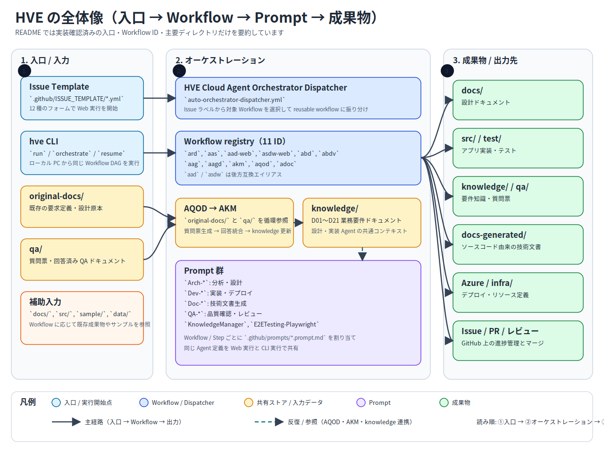
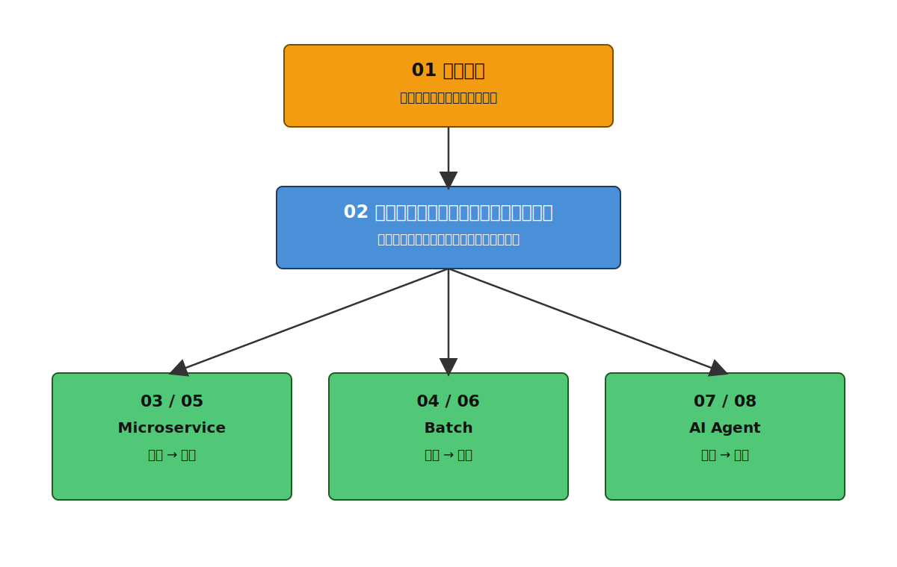

# Hypervelocity Engineering

> **🚧 開発途中** — ワークフロー・Custom Agent・ドキュメントは随時更新されます。

Vibe Coding のベストプラクティスを組み込んだワークフローにより、要求定義からアプリケーション設計・実装までを段階的に実行するテンプレートリポジトリです。現在の実装例は Azure を対象としています。

<!-- English summary for international readers -->
> A workflow-based template repository for rapid application prototyping — from business requirements through architecture design to implementation — powered by GitHub Copilot cloud agent. Supports two execution modes: Web UI (GitHub Actions) and local SDK execution. Targeting Azure as the primary cloud platform.

> **📊 プレゼンテーション資料**: このリポジトリの設計思想（Prompt / Context / Harness Engineering、CLI とバッチ自動化の両立）を視覚的に紹介するサイトを用意しています → [presentation/index.html](presentation/index.html)

---

## 目次

- [目的](#目的)
- [対象読者](#対象読者)
- [概要](#概要)
- [3 つの使い方](#3-つの使い方)
- [クイックスタート](#クイックスタート)
- [実行フェーズ別ガイド](#実行フェーズ別ガイド)
- [ドキュメント一覧](#ドキュメント一覧)
- [ツール](#ツール)
- [リポジトリ構造](#リポジトリ構造)
- [サンプル](#サンプル)
- [ライセンス](#ライセンス)

---

## 目的

**Vibe Coding のベストプラクティスを組み込んだワークフローの実施**を目的としています。

人が「何を作るか」を定義し、GitHub Copilot cloud agent が設計書・コード・テストを依存関係に従って順次生成する。この一連のプロセスをワークフローとして標準化し、再現可能な開発を実現します。

> **ベストプラクティス**: Copilot を使用してタスクに取り組むためのベストプラクティスは以下を参照してください。
> https://docs.github.com/ja/copilot/using-github-copilot/coding-agent/best-practices-for-using-copilot-to-work-on-tasks
>
> ⚠️ プロダクション環境での利用には十二分に注意をしてください。Pull Request をマージするかどうかは、**人**の判断ですので！

---

## 対象読者

| 対象 | 前提スキル |
|------|----------|
| アプリケーション設計・実装を担当するエンジニア / アーキテクト | GitHub Issues / Actions の基本操作 |
| このリポジトリで初めて Copilot cloud agent を使う開発者 | Markdown / YAML の読み書き |
| Azure を活用したクラウドネイティブ開発を行うチーム | Azure 基礎知識（推奨）、Python 基礎（SDK 版利用時）、MCP Server の概念（推奨） |

---

## 概要

本リポジトリは **ワークフローベース** のアプローチを取ります。



**基本サイクル:** Issue 作成 → Sub Issue 自動生成 → Copilot cloud agent（Custom Agent）が自動アサイン → PR 作成 → レビュー・マージ → 次の Step が自動起動（方式2）。方式1では手動で 1 Issue ずつ実行、方式3ではローカル PC から直接実行することも可能です。

各ワークフローの Step では TDD 原則に基づいて設計成果物・テスト・実装コードを自動生成します。

## 本リポジトリの中核的特徴

ビジネス分析と開発のインターフェースとなる要求定義を `knowledge/` ディレクトリ（D01〜D21）に一元集約します。詳細は [overview.md](users-guide/overview.md#本リポジトリの中核的特徴--knowledge-を介した要求定義の一元管理) を参照してください。

### 主な運用・検証ワークフロー

- `validate-plan.yml` / `validate-knowledge.yml` / `validate-agents.yml` / `validate-skills.yml`
- `audit-plans.yml` / `sync-azure-skills.yml` / `test-cli-scripts.yml`

### 3 段構造

フローは以下の 3 段構造で構成されます。



1. **01 — 要求定義**: 事業分析・ユースケースを作成
2. **02 — アプリケーションアーキテクチャ設計**: ユースケースからアプリ一覧を作成し、アーキテクチャを推薦
3. **03 以降 — 設計 & 実装**: 選定されたベースアーキテクチャ（Microservice、Batch、AI Agent）に応じて分岐

---

## 3 つの使い方

本リポジトリのワークフローは **3 通りの方式** で実行できます。

1. **方式 1: Copilot cloud agent 手動実行** — Issue を個別に作成し Custom Agent をアサイン → [web-ui-guide.md](users-guide/web-ui-guide.md)
2. **方式 2: ワークフローオーケストレーション（Web）** — Issue Template から自動実行 → [web-ui-guide.md](users-guide/web-ui-guide.md)
3. **方式 3: ワークフローオーケストレーション（ローカル）** — Python SDK でローカル実行（[Work IQ 連携](users-guide/sdk-guide.md#work-iq-mcp-連携オプション)対応） → [sdk-guide.md](users-guide/sdk-guide.md)

> 比較表・詳細は [overview.md](users-guide/overview.md#3-つの使い方) を参照してください。

---

## クイックスタート

初期セットアップ（リポジトリ作成 → 権限設定 → MCP 設定 → シークレット設定 → ラベル作成 → Issue 作成）の詳細は **[getting-started.md](users-guide/getting-started.md)** を参照してください。

---

## 実行フェーズ別ガイド

| フェーズ | ガイド | ワークフロー ID |
|---------|--------|:---:|
| **01 — 要求定義** | [01-business-requirement.md](users-guide/01-business-requirement.md) | — |
| **02 — アプリケーションアーキテクチャ設計** | [02-app-architecture-design.md](users-guide/02-app-architecture-design.md) | `aas` |
| **03 — Microservice 設計** | [03-app-design-microservice-azure.md](users-guide/03-app-design-microservice-azure.md) | `aad` |
| **04 — Batch 設計** | [04-app-design-batch.md](users-guide/04-app-design-batch.md) | `abd` |
| **05 — Microservice 実装** | [05-app-dev-microservice-azure.md](users-guide/05-app-dev-microservice-azure.md) | `asdw` |
| **06 — Batch 実装** | [06-app-dev-batch-azure.md](users-guide/06-app-dev-batch-azure.md) | `abdv` |
| **07 — AI Agent（Quick）** | [07-ai-agent-simple.md](users-guide/07-ai-agent-simple.md) | — |
| **08 — AI Agent（本格）** | [08-ai-agent.md](users-guide/08-ai-agent.md) | — |
| **Knowledge Management（AKM）** | [km-guide.md](users-guide/km-guide.md) | `akm` |
| **Original Docs Review（AQOD）** | [original-docs-review.md](users-guide/original-docs-review.md) | `aqod` |
| **Source Codeからのドキュメント作成** | [sourcecode-documentation.md](users-guide/sourcecode-documentation.md) | `adoc` |

> 01（要求定義）、07（AI Agent Quick）、08（AI Agent 本格）は手動実行です。それ以外はワークフローによる自動実行が可能です。

---

## ドキュメント一覧

### セットアップ・利用ガイド

| ドキュメント | 内容 |
|-------------|------|
| [overview.md](users-guide/overview.md) | 概要・内部アーキテクチャ・3 つの使い方の比較（入口ページ） |
| [getting-started.md](users-guide/getting-started.md) | 初期セットアップ（Step.1〜5: リポジトリ作成・MCP 設定・PAT 設定・ラベル設定） |
| [web-ui-guide.md](users-guide/web-ui-guide.md) | 方式 1 / 方式 2: Web UI 方式の利用手順・Custom Agent 一覧 |
| [sdk-guide.md](users-guide/sdk-guide.md) | 方式 3: GitHub Copilot CLI SDK 版ユーザーガイド |
| [workflow-reference.md](users-guide/workflow-reference.md) | ワークフロー一覧・ラベル一覧・Custom Agent 完全一覧 |
| [prompt-examples.md](users-guide/prompt-examples.md) | 便利なプロンプト例（敵対的レビュー・質問票・エラー対応） |
| [troubleshooting.md](users-guide/troubleshooting.md) | トラブルシューティング |
| [km-guide.md](users-guide/km-guide.md) | Knowledge Management: `qa/` / `original-docs/` を統合して `knowledge/`（D01〜D21）を生成・更新 |
| [original-docs-review.md](users-guide/original-docs-review.md) | Original Docs Review（AQOD）: `original-docs/` を横断分析し質問票を `qa/` に自動生成 |
| [sourcecode-documentation.md](users-guide/sourcecode-documentation.md) | Source Codeからのドキュメント作成: ソースコードからの段階的ドキュメント生成 |
| [km-app-documentation.md](users-guide/km-app-documentation.md) | Source Code ドキュメントガイドの互換ページ（移行案内） |

#### 共通セットアップ手順

フェーズ別ガイドから参照される「共通セットアップ手順」は、**[getting-started.md](users-guide/getting-started.md)** を正とします。

既存ドキュメントからリンクする場合は、このルート README のアンカー [`#共通セットアップ手順`](#共通セットアップ手順) を利用してください。

### リファレンス

| ドキュメント | 内容 |
|-------------|------|
| [.github/copilot-instructions.md](.github/copilot-instructions.md) | Copilot Agent 行動規約 |
| [.github/scripts/README.md](.github/scripts/README.md) | CLI コマンドリファレンス（Bash / PowerShell） |
| [presentation/](presentation/) | アーキテクチャ紹介プレゼンテーション |

---

## ツール

- **GitHub Copilot cloud agent**: Issue から GitHub Copilot cloud agent に作業を依頼
  - https://github.blog/news-insights/product-news/github-copilot-meet-the-new-coding-agent/
  - https://github.blog/changelog/2026-04-01-research-plan-and-code-with-copilot-cloud-agent/
- **GitHub Spark**: React での画面作成とリポジトリとの同期によるプレビュー
  - https://github.com/features/spark
- **Visual Studio Code + GitHub Copilot Agent Mode**: Markdown プレビュー・ファイル編集・コード修正
  - Azure SDK を使う場合は [GitHub Copilot for Azure](https://learn.microsoft.com/ja-jp/azure/developer/github-copilot-azure/introduction) も活用

---

## リポジトリ構造

```
.
├── users-guide/                    ← ワークフローのユーザーガイド（各フェーズ）
│   ├── overview.md                 ← 概要・内部アーキテクチャ・3つの使い方（入口ページ）
│   ├── getting-started.md          ← 初期セットアップ（Step.1〜5）
│   ├── web-ui-guide.md             ← 方式1/方式2: Web UI 方式の利用手順
│   ├── sdk-guide.md                ← 方式3: GitHub Copilot CLI SDK 版ユーザーガイド
│   ├── workflow-reference.md       ← ワークフロー・ラベル・Custom Agent 完全一覧
│   ├── prompt-examples.md          ← 便利なプロンプト例
│   ├── troubleshooting.md          ← トラブルシューティング
│   ├── 01-business-requirement.md
│   ├── 02-app-architecture-design.md
│   ├── 03-app-design-microservice-azure.md
│   ├── 04-app-design-batch.md
│   ├── 05-app-dev-microservice-azure.md
│   ├── 06-app-dev-batch-azure.md
│   ├── 07-ai-agent-simple.md
│   ├── 08-ai-agent.md
│   ├── km-guide.md                 ← Knowledge Management（AKM）
│   ├── qa-original-docs.md         ← 互換ページ（Original Docs Review への移行案内）
│   ├── sourcecode-documentation.md ← Source Codeからのドキュメント作成（adoc）
│   ├── km-app-documentation.md     ← 互換ページ（sourcecode-documentation への移行案内）
├── .github/
│   ├── agents/                     ← Custom Agent 定義ファイル（65 個）
│   ├── ISSUE_TEMPLATE/             ← ワークフロー起動用 Issue テンプレート（10 個）
│   ├── workflows/                  ← GitHub Actions ワークフロー定義（35 個）
│   ├── scripts/                    ← CLI コマンド（Bash / PowerShell）
│   ├── skills/                     ← GitHub Copilot Skills
│   └── copilot-instructions.md     ← Copilot 追加指示
├── docs/                           ← 設計ドキュメント（Copilot が生成）
├── src/                            ← ソースコード（Copilot が生成）
├── hve/                            ← GitHub Copilot SDK ローカルオーケストレーター
├── .claude/                        ← Claude Code 設定（plugins/ は .gitignore で除外）
├── images/                         ← README 用画像
├── presentation/                   ← アーキテクチャ紹介プレゼンテーション
├── qa/                             ← 質問票ファイル
├── sample/                         ← サンプルデータ・設計書
├── work/                           ← 計画・作業ファイル（Copilot が生成）
└── LICENSE                         ← MIT License
```

---

## サンプル

**会員サービス**を題材にした要求定義や設計書のサンプルです。

[サンプル](sample/)

---

## ライセンス

[MIT License](LICENSE)
