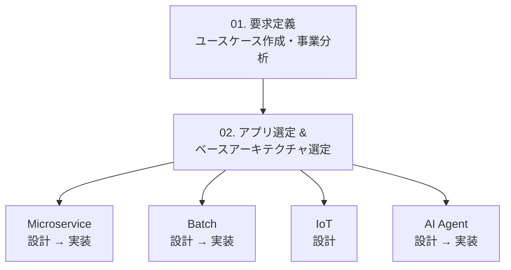

# Hypervelocity Engineering

> **🚧 開発途中** — ワークフロー・Custom Agent・ドキュメントは随時更新されます。

Vibe Coding のベストプラクティスを組み込んだワークフローにより、要求定義からアプリケーション設計・実装までを段階的に実行するテンプレートリポジトリです。現在の実装例は Azure を対象としています。

<!-- English summary for international readers -->
> A workflow-based template repository for rapid application prototyping — from business requirements through architecture design to implementation — powered by GitHub Copilot Coding Agent.

---

## 目的

**Vibe Coding のベストプラクティスを組み込んだワークフローの実施**を目的としています。

人が「何を作るか」を定義し、GitHub Copilot Coding Agent が設計書・コード・テストを依存関係に従って順次生成する。この一連のプロセスをワークフローとして標準化し、再現可能な開発を実現します。

---

## 対象読者

| 対象 | 前提スキル |
|------|----------|
| アプリケーション設計・実装を担当するエンジニア / アーキテクト | GitHub Issues / Actions の基本操作 |
| このリポジトリで初めて Copilot Coding Agent を使う開発者 | Markdown / YAML の読み書き |

---

## 概要

本リポジトリは **ワークフローベース** のアプローチを取ります。

**基本サイクル:** Issue 作成 → Sub-issue 自動生成 → Copilot Coding Agent（Custom Agent）が自動アサイン → PR 作成 → レビュー・マージ → 次の Step が自動起動

各ワークフローの Step では TDD 原則に基づいて設計成果物・テスト・実装コードを自動生成します。

### 3 段構造

フローは以下の 3 段構造で構成されます。


```mermaid
graph TD
    A["01. 要求定義<br>ユースケース作成・事業分析"]
    B["02. アプリ選定 &<br>ベースアーキテクチャ選定"]
    C1["Microservice<br>設計 → 実装"]
    C2["Batch<br>設計 → 実装"]
    C3["IoT<br>設計"]
    C4["AI Agent<br>設計 → 実装"]

    A --> B
    B --> C1
    B --> C2
    B --> C3
    B --> C4
```

1. **01 — 要求定義**: 事業分析・ユースケースを作成
2. **02 — アプリ選定 & ベースアーキテクチャ選定**: ユースケースからアプリ一覧を作成し、アーキテクチャを推薦
3. **03 以降 — 設計 & 実装**: 選定されたベースアーキテクチャ（Microservice、Batch、IoT、AI Agent）に応じて分岐

---

## ワークフロー一覧

| フェーズ | ガイド | ワークフロー ID | Issue テンプレート |
|---------|--------|:---:|:---:|
| **01 — 要求定義** | [01-Business-Requirement.md](users-guide/01-Business-Requirement.md) | — | — |
| **02 — アプリ選定** | [02-App-Selection.md](users-guide/02-App-Selection.md) | `aas` | `auto-app-selection.yml` |
| **03 — Microservice 設計** | [03-App-Design-Microservice-Azure.md](users-guide/03-App-Design-Microservice-Azure.md) | `aad` | `auto-app-design.yml` |
| **04 — Batch 設計** | [04-App-Design-Batch.md](users-guide/04-App-Design-Batch.md) | `abd` | `auto-batch-design.yml` |
| **05 — Microservice 実装** | [05-App-Dev-Microservice-Azure.md](users-guide/05-App-Dev-Microservice-Azure.md) | `asdw` | `auto-app-dev-microservice.yml` |
| **06 — Batch 実装** | [06-App-Dev-Batch-Azure.md](users-guide/06-App-Dev-Batch-Azure.md) | `abdv` | `auto-batch-dev.yml` |
| **07 — AI Agent（Quick）** | [07-AIAgent-Simple.md](users-guide/07-AIAgent-Simple.md) | — | — |
| **08 — AI Agent（本格）** | [08-AIAgent.md](users-guide/08-AIAgent.md) | — | — |
| **IoT 設計** | — | `aid` | `auto-iot-design.yml` |

> 01（要求定義）と 07（AI Agent Quick）は手動実行です。それ以外はワークフローによる自動実行が可能です。

---

## 2 つの実行方法

本リポジトリのワークフローは **2 通りの方法** で実行できます。いずれも `.github/scripts/` 配下の CLI コマンド（Bash / PowerShell）と連動して動作します。

| | **方法 1: GitHub Copilot Coding Agent** | **方法 2: Copilot CLI SDK** |
|---|---|---|
| **概要** | GitHub.com 上で Issue を登録し、Copilot をアサインして動作させる | ローカルの PC / Mac 上で Python SDK を実行 |
| **実行場所** | クラウド（GitHub Actions） | ローカル |
| **操作** | Issue 作成 → ラベル付与 → Copilot が自動アサイン | CLI コマンドで実行 |
| **認証** | `COPILOT_PAT` シークレット | `gh auth login` |
| **詳細** | [users-guide/README.md](users-guide/README.md) | [users-guide/SDK-Guide.md](users-guide/SDK-Guide.md) |

### 方法 1: GitHub Copilot Coding Agent（GitHub.com Web UI 方式）

GitHub.com の Issues タブから Issue テンプレートで Issue を作成すると、GitHub Actions が起動し、Sub-issue を自動生成します。各 Sub-issue には Custom Agent 付きで Copilot が自動アサインされ、設計ドキュメントやコードを含む PR が自動作成されます。

```
Issue 作成 → GitHub Actions 起動 → Sub-issue 一括生成
  → Copilot が各 Sub-issue に自動アサイン → PR 作成 → マージ → 次 Step 自動起動
```

### 方法 2: Copilot CLI SDK（ローカル実行方式）

ローカル環境から Python スクリプトでワークフローを実行します。GitHub Actions を使わずに MCP Server や Custom Agent を柔軟に組み合わせられます。

> 詳細 → [SDK ユーザーガイド](users-guide/SDK-Guide.md)

### CLI スクリプトとの連携

ワークフローのオーケストレーション・Sub-issue 作成・plan.md バリデーションなどを行う CLI コマンド群（Bash / PowerShell）を同梱しています。両方の実行方法から利用できます。

> 詳細 → [.github/scripts/README.md](.github/scripts/README.md)

---

## リポジトリ構造

```
.
├── AGENTS.md                       ← Copilot Agent 行動規約（全 Agent 共通ルール）
├── users-guide/                    ← ワークフローのユーザーガイド（各フェーズ）
│   ├── README.md                   ← セットアップ手順・利用方法
│   ├── 01-Business-Requirement.md
│   ├── 02-App-Selection.md
│   ├── 03-App-Design-Microservice-Azure.md
│   ├── 04-App-Design-Batch.md
│   ├── 05-App-Dev-Microservice-Azure.md
│   ├── 06-App-Dev-Batch-Azure.md
│   ├── 07-AIAgent-Simple.md
│   ├── 08-AIAgent.md
│   └── SDK-Guide.md
├── .github/
│   ├── agents/                     ← Custom Agent 定義ファイル
│   ├── ISSUE_TEMPLATE/             ← ワークフロー起動用 Issue テンプレート
│   ├── workflows/                  ← GitHub Actions ワークフロー定義
│   ├── scripts/                    ← CLI コマンド（Bash / PowerShell）
│   └── copilot-instructions.md     ← Copilot 追加指示
└── LICENSE                         ← MIT License
```

---

## Custom Agent

`.github/agents/` 配下に Custom Agent が定義されています。各ワークフローの Step ごとに専用の Custom Agent が自動的に選択されます。

| カテゴリ | Agent 例 | 用途 |
|---------|---------|------|
| **設計 — Microservice** | `Arch-Microservice-DomainAnalytics`, `Arch-DataModeling`, `Arch-UI-List` 等 | ドメイン分析・データモデル・画面一覧・サービスカタログ |
| **設計 — Batch** | `Arch-Batch-DomainAnalytics`, `Arch-Batch-JobCatalog` 等 | バッチドメイン分析・ジョブ設計・監視運用 |
| **設計 — IoT** | `Arch-IoT-DomainAnalytics`, `Arch-IoT-DeviceConnectivity` | IoT ドメイン分析・デバイス接続設計 |
| **設計 — AI Agent** | `Arch-AIAgentDesign` | AI Agent アプリケーション定義・粒度設計・詳細設計 |
| **設計 — テスト** | `Arch-TDD-TestStrategy`, `Arch-TDD-TestSpec` | テスト戦略・テスト仕様書 |
| **実装** | `Dev-Microservice-Azure-ServiceCoding-AzureFunctions` 等 | Azure Functions 実装・UI コーディング・デプロイ |
| **QA / レビュー** | `QA-AzureArchitectureReview`, `QA-AzureDependencyReview` | Azure WAF レビュー・依存関係レビュー |

> 全 Agent 一覧 → [.github/agents/](https://github.com/dahatake/RoyalytyService2ndGen/tree/main/.github/agents)

---

## AGENTS.md — Copilot Agent 行動規約

[AGENTS.md](AGENTS.md) は、すべての Copilot Coding Agent が従う共通ルール（ベースライン）です。AGENTS.md のルールは Custom Agent の指示より優先されます。

主なルール:
- **コンテキスト収集プロトコル** — 不足情報は質問票で確認してから作業開始
- **計画（DAG）と分割** — 15 分超のタスクは Sub-issue に分割必須
- **work/ ディレクトリ** — 計画・作業ファイルの標準構造
- **最終品質レビュー** — 3 つの異なる観点でセルフレビュー

---

## クイックスタート

> 詳細な手順は [users-guide/README.md](users-guide/README.md) を参照してください。

1. **リポジトリ作成** — このリポジトリの内容を自分のリポジトリにコピー
2. **権限設定** — Settings → Actions → Workflow permissions を **Read and write** に設定
3. **Copilot 有効化** — リポジトリで GitHub Copilot を有効にする
4. **シークレット設定** — `COPILOT_PAT` に PAT を設定（Copilot 自動アサインに必要）
5. **ラベル作成** — 各ワークフロー用のラベルを作成（Bootstrap ワークフローが自動作成するものもあり）
6. **Issue 作成** — Issues タブ → New Issue → ワークフローテンプレートを選択して開始

---

## ドキュメント一覧

| ドキュメント | 説明 |
|-------------|------|
| [users-guide/README.md](users-guide/README.md) | ユーザーガイド（準備・セットアップ・利用手順・トラブルシューティング） |
| [users-guide/SDK-Guide.md](users-guide/SDK-Guide.md) | Copilot CLI SDK コマンドリファレンス |
| [AGENTS.md](AGENTS.md) | Copilot Agent 行動規約（コンテキスト収集・計画・分割・品質レビュー） |
| [.github/scripts/README.md](.github/scripts/README.md) | CLI コマンドリファレンス（Bash / PowerShell） |
| [presentation/](presentation/index.html) | アーキテクチャ紹介プレゼンテーション（Prompt / Context / Harness Engineering、実行モード比較） |

---

## ライセンス

[MIT License](LICENSE)