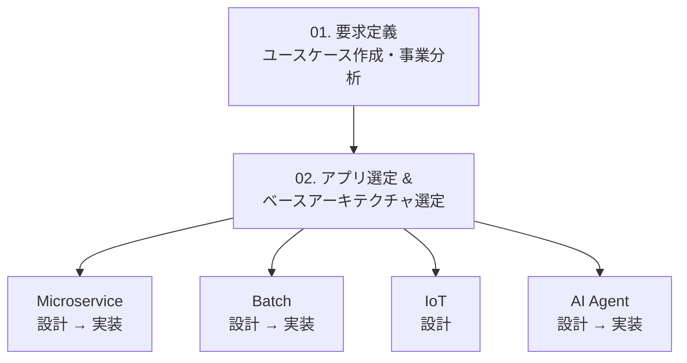

# Hypervelocity Engineering

> **🚧 開発途中** — ワークフロー・Custom Agent・ドキュメントは随時更新されます。

Vibe Coding のベストプラクティスを組み込んだワークフローにより、要求定義からアプリケーション設計・実装までを段階的に実行するテンプレートリポジトリです。現在の実装例は Azure を対象としています。

<!-- English summary for international readers -->
> A workflow-based template repository for rapid application prototyping — from business requirements through architecture design to implementation — powered by GitHub Copilot Coding Agent. Supports two execution modes: Web UI (GitHub Actions) and local SDK execution. Targeting Azure as the primary cloud platform.

---

## 目次

- [目的](#目的)
- [対象読者](#対象読者)
- [概要](#概要)
- [2 つの実行方法](#2-つの実行方法)
- [クイックスタート](#クイックスタート)
- [リポジトリ構造](#リポジトリ構造)
- [ドキュメント一覧](#ドキュメント一覧)
- [ライセンス](#ライセンス)

---

## 目的

**Vibe Coding のベストプラクティスを組み込んだワークフローの実施**を目的としています。

人が「何を作るか」を定義し、GitHub Copilot Coding Agent が設計書・コード・テストを依存関係に従って順次生成する。この一連のプロセスをワークフローとして標準化し、再現可能な開発を実現します。

---

## 対象読者

| 対象 | 前提スキル |
|------|----------|
| アプリケーション設計・実装を担当するエンジニア / アーキテクト | GitHub Issues / Actions の基本操作 |
| このリポジトリで初めて Copilot Coding Agent を使う開発者 | Markdown / YAML の読み書き |
| Azure を活用したクラウドネイティブ開発を行うチーム | Azure 基礎知識（推奨）、Python 基礎（SDK 版利用時）、MCP Server の概念（推奨） |

---

## 概要

本リポジトリは **ワークフローベース** のアプローチを取ります。

**基本サイクル:** Issue 作成 → Sub Issue 自動生成 → Copilot Coding Agent（Custom Agent）が自動アサイン → PR 作成 → レビュー・マージ → 次の Step が自動起動

各ワークフローの Step では TDD 原則に基づいて設計成果物・テスト・実装コードを自動生成します。

### 3 段構造

フローは以下の 3 段構造で構成されます。


```mermaid
graph TD
    A["01. 要求定義<br>ユースケース作成・事業分析"]
    B["02. アプリ選定 &<br>ベースアーキテクチャ選定"]
    C1["Microservice<br>設計 → 実装"]
    C2["Batch<br>設計 → 実装"]
    C3["IoT<br>設計"]
    C4["AI Agent<br>設計 → 実装"]

    A --> B
    B --> C1
    B --> C2
    B --> C3
    B --> C4
```

1. **01 — 要求定義**: 事業分析・ユースケースを作成
2. **02 — アプリ選定 & ベースアーキテクチャ選定**: ユースケースからアプリ一覧を作成し、アーキテクチャを推薦
3. **03 以降 — 設計 & 実装**: 選定されたベースアーキテクチャ（Microservice、Batch、IoT、AI Agent）に応じて分岐

---

## 2 つの実行方法

本リポジトリのワークフローは **2 通りの方法** で実行できます。

- **方法 1: GitHub Copilot Coding Agent（Web UI 方式）** — GitHub.com 上で Issue を登録し、Copilot をアサインして動作させる
- **方法 2: Copilot CLI SDK（ローカル実行方式）** — ローカルの PC / Mac 上で Python SDK を実行

> 詳細な比較・利用手順 → [users-guide/README.md](users-guide/README.md)

---

## クイックスタート

> 詳細な手順は [users-guide/getting-started.md](users-guide/getting-started.md) を参照してください。

1. **リポジトリ作成** — 「Use this template」ボタンから自分のリポジトリを作成（または git clone してコピー）
2. **権限設定** — Settings → Actions → Workflow permissions を **Read and write** に設定
3. **MCP 設定** — Settings → Copilot → Coding agent → MCP Servers に設定を追加
4. **シークレット設定** — `COPILOT_PAT` に PAT を設定（Copilot 自動アサインに必要）
5. **ラベル作成** — 各ワークフロー用のラベルを作成
6. **Issue 作成** — Issues タブ → New Issue → ワークフローテンプレートを選択して開始

---

## リポジトリ構造

```
.
├── AGENTS.md                       ← Copilot Agent 行動規約（全 Agent 共通ルール）
├── users-guide/                    ← ワークフローのユーザーガイド（各フェーズ）
│   ├── README.md                   ← ガイド目次（全ドキュメントへの導線ハブ）
│   ├── getting-started.md          ← 初期セットアップ（Step.1〜5）
│   ├── web-ui-guide.md             ← 方法1: Web UI 方式の利用手順
│   ├── SDK-Guide.md                ← 方法2: Copilot SDK 版コマンドリファレンス
│   ├── workflow-reference.md       ← ワークフロー・ラベル・Custom Agent 完全一覧
│   ├── prompt-examples.md          ← 便利なプロンプト例
│   ├── troubleshooting.md          ← トラブルシューティング
│   ├── 01-Business-Requirement.md
│   ├── 02-App-Selection.md
│   ├── 03-App-Design-Microservice-Azure.md
│   ├── 04-App-Design-Batch.md
│   ├── 05-App-Dev-Microservice-Azure.md
│   ├── 06-App-Dev-Batch-Azure.md
│   ├── 07-AIAgent-Simple.md
│   ├── 08-AIAgent.md
├── .github/
│   ├── agents/                     ← Custom Agent 定義ファイル（44 個）
│   ├── ISSUE_TEMPLATE/             ← ワークフロー起動用 Issue テンプレート
│   ├── workflows/                  ← GitHub Actions ワークフロー定義（19 個）
│   ├── scripts/                    ← CLI コマンド（Bash / PowerShell）
│   ├── skills/                     ← GitHub Copilot Skills
│   └── copilot-instructions.md     ← Copilot 追加指示
├── docs/                           ← 設計ドキュメント（Copilot が生成）
├── src/                            ← ソースコード（Copilot が生成）
├── hve/                            ← SDK 版ワークフローオーケストレーター
├── images/                         ← README 用画像
├── presentation/                   ← アーキテクチャ紹介プレゼンテーション
├── qa/                             ← 質問票ファイル
├── sample/                         ← サンプルデータ・設計書
├── work/                           ← 計画・作業ファイル（Copilot が生成）
└── LICENSE                         ← MIT License
```

---

## ドキュメント一覧

| ドキュメント | 説明 |
|-------------|------|
| [users-guide/README.md](users-guide/README.md) | ユーザーガイド目次（導線ハブ） |
| [users-guide/getting-started.md](users-guide/getting-started.md) | 初期セットアップ手順 |
| [users-guide/web-ui-guide.md](users-guide/web-ui-guide.md) | Web UI 方式ガイド |
| [users-guide/SDK-Guide.md](users-guide/SDK-Guide.md) | SDK 版コマンドリファレンス |
| [users-guide/workflow-reference.md](users-guide/workflow-reference.md) | ワークフロー・ラベル・Custom Agent 完全一覧 |
| [users-guide/prompt-examples.md](users-guide/prompt-examples.md) | 便利なプロンプト例 |
| [users-guide/troubleshooting.md](users-guide/troubleshooting.md) | トラブルシューティング |
| [AGENTS.md](AGENTS.md) | Copilot Agent 行動規約 |
| [.github/scripts/README.md](.github/scripts/README.md) | CLI コマンドリファレンス（Bash / PowerShell） |
| [presentation/](presentation/) | アーキテクチャ紹介プレゼンテーション |

---

## ライセンス

[MIT License](LICENSE)
