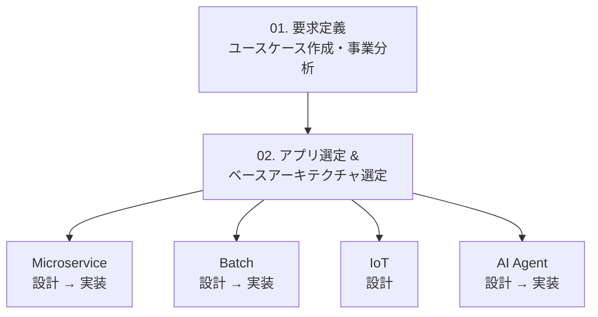

# Hypervelocity Engineering

> **🚧 開発途中** — ワークフロー・Custom Agent・ドキュメントは随時更新されます。

Vibe Coding のベストプラクティスを組み込んだワークフローにより、要求定義からアプリケーション設計・実装までを段階的に実行するテンプレートリポジトリです。現在の実装例は Azure を対象としています。

<!-- English summary for international readers -->
> A workflow-based template repository for rapid application prototyping — from business requirements through architecture design to implementation — powered by GitHub Copilot Coding Agent. Supports two execution modes: Web UI (GitHub Actions) and local SDK execution. Targeting Azure as the primary cloud platform.

> **📊 プレゼンテーション資料**: このリポジトリの設計思想（Prompt / Context / Harness Engineering、CLI とバッチ自動化の両立）を視覚的に紹介するサイトを用意しています → [presentation/index.html](presentation/index.html)

---

## 目次

- [目的](#目的)
- [対象読者](#対象読者)
- [概要](#概要)
- [2 つの実行方法](#2-つの実行方法)
- [クイックスタート](#クイックスタート)
- [実行フェーズ別ガイド](#実行フェーズ別ガイド)
- [ドキュメント一覧](#ドキュメント一覧)
- [ツール](#ツール)
- [リポジトリ構造](#リポジトリ構造)
- [サンプル](#サンプル)
- [ライセンス](#ライセンス)

---

## 目的

**Vibe Coding のベストプラクティスを組み込んだワークフローの実施**を目的としています。

人が「何を作るか」を定義し、GitHub Copilot Coding Agent が設計書・コード・テストを依存関係に従って順次生成する。この一連のプロセスをワークフローとして標準化し、再現可能な開発を実現します。

> **ベストプラクティス**: Copilot を使用してタスクに取り組むためのベストプラクティスは以下を参照してください。
> https://docs.github.com/ja/copilot/using-github-copilot/coding-agent/best-practices-for-using-copilot-to-work-on-tasks
>
> ⚠️ プロダクション環境での利用には十二分に注意をしてください。Pull Request をマージするかどうかは、**人**の判断ですので！

---

## 対象読者

| 対象 | 前提スキル |
|------|----------|
| アプリケーション設計・実装を担当するエンジニア / アーキテクト | GitHub Issues / Actions の基本操作 |
| このリポジトリで初めて Copilot Coding Agent を使う開発者 | Markdown / YAML の読み書き |
| Azure を活用したクラウドネイティブ開発を行うチーム | Azure 基礎知識（推奨）、Python 基礎（SDK 版利用時）、MCP Server の概念（推奨） |

---

## 概要

本リポジトリは **ワークフローベース** のアプローチを取ります。

**基本サイクル:** Issue 作成 → Sub Issue 自動生成 → Copilot Coding Agent（Custom Agent）が自動アサイン → PR 作成 → レビュー・マージ → 次の Step が自動起動

各ワークフローの Step では TDD 原則に基づいて設計成果物・テスト・実装コードを自動生成します。

### 3 段構造

フローは以下の 3 段構造で構成されます。


```mermaid
graph TD
    A["01. 要求定義<br>ユースケース作成・事業分析"]
    B["02. アプリ選定 &<br>ベースアーキテクチャ選定"]
    C1["Microservice<br>設計 → 実装"]
    C2["Batch<br>設計 → 実装"]
    C3["IoT<br>設計"]
    C4["AI Agent<br>設計 → 実装"]

    A --> B
    B --> C1
    B --> C2
    B --> C3
    B --> C4
```

1. **01 — 要求定義**: 事業分析・ユースケースを作成
2. **02 — アプリ選定 & ベースアーキテクチャ選定**: ユースケースからアプリ一覧を作成し、アーキテクチャを推薦
3. **03 以降 — 設計 & 実装**: 選定されたベースアーキテクチャ（Microservice、Batch、IoT、AI Agent）に応じて分岐

---

## 2 つの実行方法

本リポジトリのワークフローは **2 通りの方法** で実行できます。

- **方法 1: GitHub Copilot Coding Agent（Web UI 方式）** — GitHub.com 上で Issue を登録し、Copilot をアサインして動作させる
- **方法 2: GitHub Copilot CLI SDK（ローカル実行方式）** — ローカルの PC / Mac 上で Python SDK を実行

### 比較表

| 項目 | Web UI 方式 | GitHub Copilot CLI SDK 版（ローカル実行） |
|------|-----------|-------------------|
| Agent 実行場所 | GitHub Actions | ローカル PC |
| Issue 作成 | 必須 | オプション（デフォルト: しない） |
| Copilot アサイン | する | しない（ローカル直接実行） |
| 並列実行 | GitHub Actions 並列ジョブ | 同時実行数を制限（デフォルト: 15） |
| MCP Server | GitHub 管理の MCP 設定 | 対応（`--mcp-config` で任意設定） |
| Custom Agents | GitHub Issue 経由で選択 | SDK の API でステップごとに指定 |
| 必要な認証 | `COPILOT_PAT` | GitHub Copilot CLI 認証（`gh auth login`） |
| モデルデフォルト | GitHub 管理 | `claude-opus-4.6` |
| 課金 | GitHub Actions 分 | Copilot ライセンスのみ |

### 方法 1: GitHub Copilot Coding Agent（Web UI 方式）

GitHub.com 上で Issue を作成し、Copilot Coding Agent が Issue にアサインされて GitHub Actions 上で自動実行されます。

> 詳細 → [users-guide/web-ui-guide.md](users-guide/web-ui-guide.md)

### 方法 2: GitHub Copilot CLI SDK 版（ローカル実行方式）

ローカル環境から Python スクリプトでワークフローを実行します。

> 詳細 → [users-guide/SDK-Guide.md](users-guide/SDK-Guide.md)

---

## クイックスタート

> 詳細な手順は [getting-started.md](users-guide/getting-started.md) を参照してください。

1. **リポジトリ作成** — 「Use this template」ボタンから自分のリポジトリを作成（または git clone してコピー）
2. **権限設定** — Settings → Actions → Workflow permissions を **Read and write** に設定
3. **MCP 設定** — Settings → Copilot → Coding agent → MCP Servers に設定を追加
4. **シークレット設定** — `COPILOT_PAT` に PAT を設定（Copilot 自動アサインに必要）
5. **ラベル作成** — 各ワークフロー用のラベルを作成
6. **Issue 作成** — Issues タブ → New Issue → ワークフローテンプレートを選択して開始

---

## 実行フェーズ別ガイド

| フェーズ | ガイド | ワークフロー ID |
|---------|--------|:---:|
| **01 — 要求定義** | [01-Business-Requirement.md](users-guide/01-Business-Requirement.md) | — |
| **02 — アプリ選定** | [02-App-Selection.md](users-guide/02-App-Selection.md) | `aas` |
| **03 — Microservice 設計** | [03-App-Design-Microservice-Azure.md](users-guide/03-App-Design-Microservice-Azure.md) | `aad` |
| **04 — Batch 設計** | [04-App-Design-Batch.md](users-guide/04-App-Design-Batch.md) | `abd` |
| **05 — Microservice 実装** | [05-App-Dev-Microservice-Azure.md](users-guide/05-App-Dev-Microservice-Azure.md) | `asdw` |
| **06 — Batch 実装** | [06-App-Dev-Batch-Azure.md](users-guide/06-App-Dev-Batch-Azure.md) | `abdv` |
| **07 — AI Agent（Quick）** | [07-AIAgent-Simple.md](users-guide/07-AIAgent-Simple.md) | — |
| **08 — AI Agent（本格）** | [08-AIAgent.md](users-guide/08-AIAgent.md) | — |
| **IoT 設計** | — | `aid` |

> 01（要求定義）と 07（AI Agent Quick）は手動実行です。それ以外はワークフローによる自動実行が可能です。

---

## ドキュメント一覧

### セットアップ・利用ガイド

| ドキュメント | 内容 |
|-------------|------|
| [getting-started.md](users-guide/getting-started.md) | 初期セットアップ（Step.1〜5: リポジトリ作成・MCP 設定・PAT 設定・ラベル設定） |
| [web-ui-guide.md](users-guide/web-ui-guide.md) | 方法 1: Web UI 方式の利用手順・Custom Agent 一覧 |
| [SDK-Guide.md](users-guide/SDK-Guide.md) | 方法 2: GitHub Copilot CLI SDK 版ユーザーガイド |
| [workflow-reference.md](users-guide/workflow-reference.md) | ワークフロー一覧・ラベル一覧・Custom Agent 完全一覧 |
| [prompt-examples.md](users-guide/prompt-examples.md) | 便利なプロンプト例（敵対的レビュー・質問票・エラー対応） |
| [troubleshooting.md](users-guide/troubleshooting.md) | トラブルシューティング |

#### 共通セットアップ手順

フェーズ別ガイドから参照される「共通セットアップ手順」は、**[getting-started.md](users-guide/getting-started.md)** を正とします。

既存ドキュメントからリンクする場合は、このルート README のアンカー [`#共通セットアップ手順`](#共通セットアップ手順) を利用してください。

### リファレンス

| ドキュメント | 内容 |
|-------------|------|
| [AGENTS.md](AGENTS.md) | Copilot Agent 行動規約 |
| [.github/scripts/README.md](.github/scripts/README.md) | CLI コマンドリファレンス（Bash / PowerShell） |
| [presentation/](presentation/) | アーキテクチャ紹介プレゼンテーション |

---

## ツール

- **GitHub Copilot Coding Agent**: Issue から Coding Agent に作業を依頼
  - https://github.blog/news-insights/product-news/github-copilot-meet-the-new-coding-agent/
- **GitHub Spark**: React での画面作成とリポジトリとの同期によるプレビュー
  - https://github.com/features/spark
- **Visual Studio Code + GitHub Copilot Agent Mode**: Markdown プレビュー・ファイル編集・コード修正
  - Azure SDK を使う場合は [GitHub Copilot for Azure](https://learn.microsoft.com/ja-jp/azure/developer/github-copilot-azure/introduction) も活用

---

## リポジトリ構造

```
.
├── AGENTS.md                       ← Copilot Agent 行動規約（全 Agent 共通ルール）
├── users-guide/                    ← ワークフローのユーザーガイド（各フェーズ）
│   ├── getting-started.md          ← 初期セットアップ（Step.1〜5）
│   ├── web-ui-guide.md             ← 方法1: Web UI 方式の利用手順
│   ├── SDK-Guide.md                ← 方法2: GitHub Copilot CLI SDK 版ユーザーガイド
│   ├── workflow-reference.md       ← ワークフロー・ラベル・Custom Agent 完全一覧
│   ├── prompt-examples.md          ← 便利なプロンプト例
│   ├── troubleshooting.md          ← トラブルシューティング
│   ├── 01-Business-Requirement.md
│   ├── 02-App-Selection.md
│   ├── 03-App-Design-Microservice-Azure.md
│   ├── 04-App-Design-Batch.md
│   ├── 05-App-Dev-Microservice-Azure.md
│   ├── 06-App-Dev-Batch-Azure.md
│   ├── 07-AIAgent-Simple.md
│   ├── 08-AIAgent.md
├── .github/
│   ├── agents/                     ← Custom Agent 定義ファイル（44 個）
│   ├── ISSUE_TEMPLATE/             ← ワークフロー起動用 Issue テンプレート
│   ├── workflows/                  ← GitHub Actions ワークフロー定義（19 個）
│   ├── scripts/                    ← CLI コマンド（Bash / PowerShell）
│   ├── skills/                     ← GitHub Copilot Skills
│   └── copilot-instructions.md     ← Copilot 追加指示
├── docs/                           ← 設計ドキュメント（Copilot が生成）
├── src/                            ← ソースコード（Copilot が生成）
├── hve/                            ← GitHub Copilot CLI SDK 版ワークフローオーケストレーター
├── images/                         ← README 用画像
├── presentation/                   ← アーキテクチャ紹介プレゼンテーション
├── qa/                             ← 質問票ファイル
├── sample/                         ← サンプルデータ・設計書
├── work/                           ← 計画・作業ファイル（Copilot が生成）
└── LICENSE                         ← MIT License
```

---

## サンプル

**会員サービス**を題材にした要求定義や設計書のサンプルです。

[サンプル](sample/)

---

## ライセンス

[MIT License](LICENSE)
