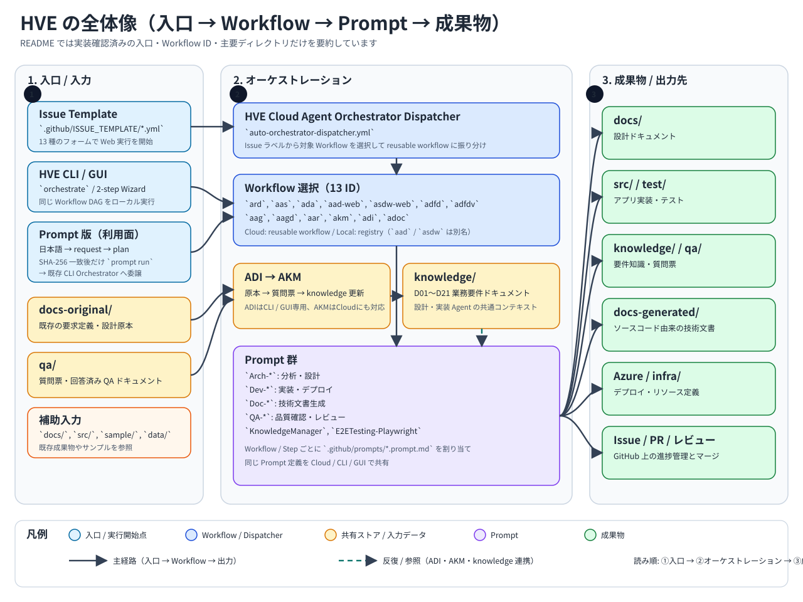
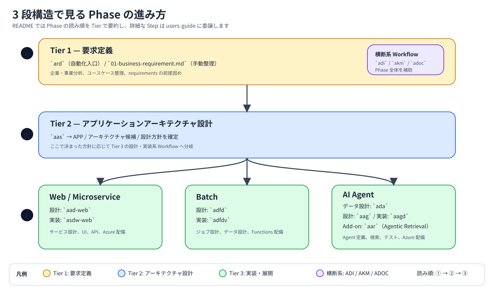
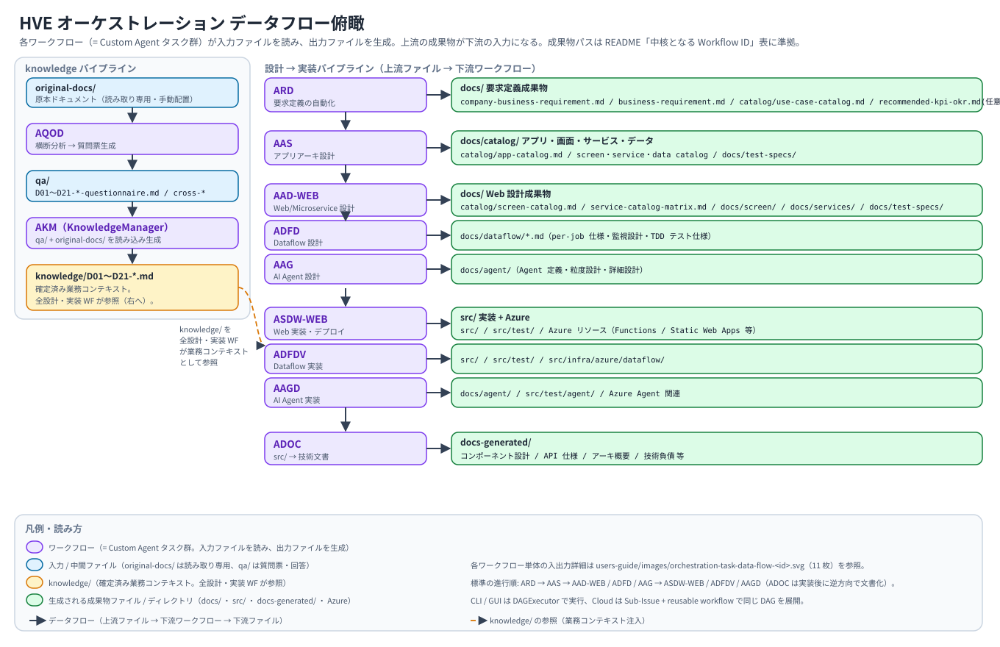
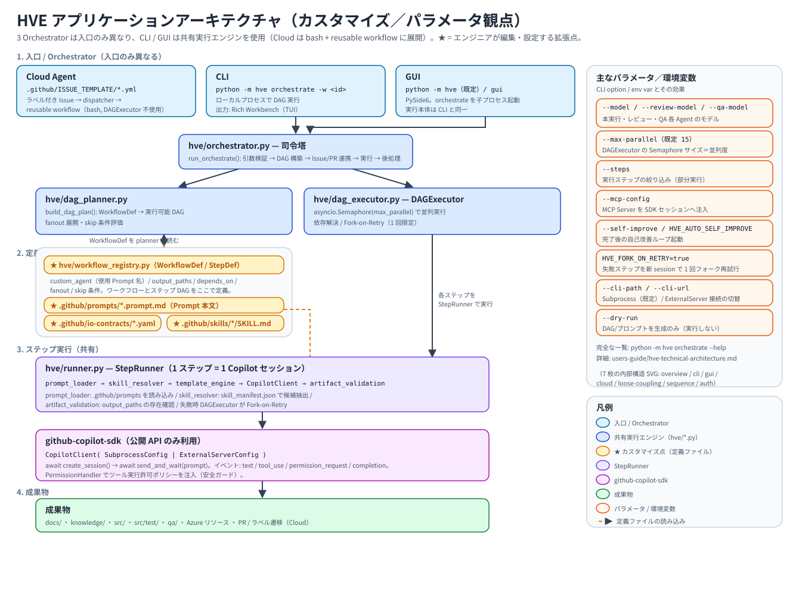

# Hypervelocity Engineering

> **開発中のテンプレートリポジトリです。** 実装は随時更新されるため、README は「概要 + 導線」に絞り、実体確認できる内容だけを記載しています。

Hypervelocity Engineering（HVE）は、GitHub Copilot cloud agent、`hve` CLI / GUI、自然言語の Prompt 版を入口に、要求定義・設計・実装・ドキュメント生成を段階実行する Vibe Coding フレームワークです。現在のテンプレート実装は Azure を前提にしています。

## 目次

- [目的](#目的)
- [全体像](#全体像)
- [はじめての方へ（4 つの入口）](#はじめての方へ-4-つの入口)
- [方式比較表（5 つの使い方）](#方式比較表5-つの使い方)
- [用語](#用語)
- [技術アーキテクチャ](#技術アーキテクチャ)
- [Issue Template 一覧](#issue-template-一覧)
- [GitHub Actions workflows](#github-actions-workflows)
- [`hve` CLI](#hve-cli)
- [users-guide への導線](#users-guide-への導線)
- [リポジトリ構造](#リポジトリ構造)
- [ライセンス](#ライセンス)

## 目的

このリポジトリの目的は、**業務要件の整理から設計・実装・検証までを、再現可能なワークフローとして運用すること**です。

- GitHub Issues / Issue Template を起点に Web 上で実行する
- `python -m hve` からローカルで同じ Workflow / Prompt を実行する
- Copilot へ日本語で依頼し、計画を承認してから同じローカル Workflow を実行する
- `knowledge/` を中核ストアとして、`docs-original/`・`qa/`・既存コードの情報を再利用する

## 全体像

HVE は Issue Template、CLI / GUI、自然言語の Prompt 版を入口とし、選択した実行経路が Workflow に沿って `.github/prompts/` の Prompt を起動し、`docs/` / `knowledge/` / `src/` / `test/` などの成果物を生成します。

**Prompt 版** はこの入口を 1 段手前へ延ばしたものです。日本語の依頼文を Copilot が **request（JSON）** へ変換し、HVE が検証した実行計画を提示します。利用者が計画を承認してはじめて、既存の `hve orchestrate` が起動されます。新しい実行エンジンは持ちません。



### 3 段構造

各ワークフローは **(1) 入力ドキュメント → (2) Prompt チェーン → (3) 成果物ファイル** の 3 段で表現されます。上流の成果物が下流ワークフローの入力になるため、「ARD → AAS → AAD-WEB / ADFD / ADA → ASDW-WEB / ADFDV / AAG → AAGD」の順で進めます。`AAR` は既存サービスへ検索基盤を追加する独立の Add-on です。



次の俯瞰図は、**どのファイルがどのワークフローで生成されるか**（タスク = Custom Agent 群が入力ファイルを読み、出力ファイルを生成する）をデータフローとして示します。`knowledge/` は全設計・実装ワークフローが業務コンテキストとして参照します。各ワークフロー単体の入出力詳細は `users-guide/images/orchestration-task-data-flow-<id>.svg`（10 枚）を参照してください。



### `knowledge/` と `qa/` と `docs-original/` の関係

- `docs-original/`—社内ドキュメント等の **取り込み元（読み取り専用）**。全 Prompt は記述を変更しません。
- `docs/original-design-doc-ingest/`—`ADI` が `docs-original/` を正規化した **派生物**（Markdown 化した本文 / 目録 / Doc Card）。原本が PDF / Office でも下流 ワークフローが読める形にします。
- `qa/`—`ADI`（Step 1.1 / 1.2）や Prompt が生成した **質問票 / 回答** ファイル。
- `knowledge/`—`AKM`（`KnowledgeManager`）が `qa/` / `docs-original/` を読み込んで生成・更新する **確定済みドキュメント（D01〜D21）**。以降の設計・実装ワークフローが業務コンテキストとして参照します。

詳細は [km-guide.md](users-guide/km-guide.md) を参照してください。Markdown 以外の設計書を取り込む場合は、前段として [00-design-doc-ingestion.md](users-guide/00-design-doc-ingestion.md) を参照してください。

## はじめての方へ (4 つの入口)

利用したい入口を選んで、対応する Getting Started を開いてください。いずれもチュートリアル形式で、セットアップからサンプルの起動までをカバーしています。

| 利用面 | 入口 | Getting Started |
|---|---|---|
| HVE Cloud Agent Orchestrator | GitHub Actions（Issue Template） | [hve-cloud-getting-started.md](users-guide/hve-cloud-getting-started.md) |
| HVE CLI Orchestrator | ローカル端末 `python -m hve cli` | [hve-cli-getting-started.md](users-guide/hve-cli-getting-started.md) |
| HVE GUI Orchestrator | ローカル端末 `python -m hve`（GUI） | [hve-gui-getting-started.md](users-guide/hve-gui-getting-started.md) |
| HVE Prompt 版（ローカルプレビュー） | Copilot へ日本語の依頼文を貼り付ける（コマンド入力不要） | [hve-prompt-getting-started.md](users-guide/hve-prompt-getting-started.md) |

> **Prompt 版**: コマンドを打たずに日本語だけで進められます。貼り付け用の依頼文は [users-guide/prompts/README.md](users-guide/prompts/README.md) にあります。モデルを固定したい場合は、先に GUI（`python -m hve`）で設定を 1 回保存してください（任意）。

> **Prompt 版は 4 つ目の Orchestrator ではありません。** 自然言語を型付き request に変換し、既存の `hve orchestrate` へ委譲するローカル実行のプレビューです。GitHub.com の Cloud Agent Orchestrator からの Prompt 実行には対応していません。

### Prompt 版をはじめて使う

CLI のオプションを覚えずに、日本語の依頼文からワークフローを起動する入口です。
セットアップは CLI / GUI と共通のため、**環境構築を済ませていればすぐ使えます**。

| # | やること | 参照先 |
|---|---|---|
| 1 | 環境構築（`.venv` 作成、Copilot CLI ログイン） | [hve-cli-getting-started.md](users-guide/hve-cli-getting-started.md) または [hve-gui-getting-started.md](users-guide/hve-gui-getting-started.md) |
| 2 | （任意）GUI（`python -m hve`）を 1 回起動してモデル等の設定を保存する。未保存なら既定値が使われる | [hve-gui-getting-started.md](users-guide/hve-gui-getting-started.md) |
| 3 | 依頼文を選んで Copilot（GUI 内の Copilot CLI タブ / GitHub Copilot CLI / VS Code Copilot Chat）へ貼り付ける | [users-guide/prompts/README.md](users-guide/prompts/README.md) |
| 4 | Copilot が提示した実行計画を読む（特に Step の範囲） | [hve-prompt-getting-started.md](users-guide/hve-prompt-getting-started.md) |
| 5 | 問題なければ「この計画で実行してください」と日本語で伝える | 同上 |

- **あなたがコマンドを打つ必要はありません。** CLI の実行、request ファイルの管理、plan SHA-256 の転記はすべて Copilot が代行します。
- **Step 3 の依頼文は自分で書いても構いません。** 変換手順は Agent Skill [.github/skills/hve-prompt-edition/SKILL.md](.github/skills/hve-prompt-edition/SKILL.md) が担い、Workflow / Step / パラメータが一意に定まらない場合は Copilot が推測せずに質問します。
- **計画の提示段階では成果物（`docs/` / `src/` / `knowledge/` / `qa/`）を生成・変更しません。** 承認した計画と plan SHA-256 が一致した場合だけ実行されます。自然言語の承認だけでは書き込みは始まりません。
- **入力ファイル名が canonical と違う場合** は実行時エイリアスで指定できます → [users-guide/prompts/custom-inputs.md](users-guide/prompts/custom-inputs.md)
- **複数 Workflow をまとめて実行したい場合** → [users-guide/prompts/cross-workflow.md](users-guide/prompts/cross-workflow.md)
- 内部構造を知りたい場合 → [hve-technical-architecture.md](users-guide/hve-technical-architecture.md) の「2.2 Prompt 版」

## 方式比較表（5 つの使い方）

| 方式 | 入口 | 実行場所 | 向いているケース | 参照先 |
|---|---|---|---|---|
| 方式 1 | 個別 Issue に Prompt を手動アサイン | GitHub Actions | 単一タスクの試行、特定 Step のデバッグ | [web-ui-guide.md#方式1-copilot-cloud-agent-手動実行](users-guide/web-ui-guide.md#方式1-copilot-cloud-agent-手動実行) |
| 方式 2 | Issue Template から親 Issue を作成 | GitHub Actions | Sub Issue 自動生成を含むフルオーケストレーション | [web-ui-guide.md#方式2-ワークフローオーケストレーションweb](users-guide/web-ui-guide.md#方式2-ワークフローオーケストレーションweb) |
| 方式 3 | `python -m hve cli` / `python -m hve orchestrate` | PC / Mac / 仮想マシン | GitHub Actions を使わずに同じ DAG をターミナルで実行したい場合 | [hve-cli-orchestrator-guide.md](users-guide/hve-cli-orchestrator-guide.md) |
| 方式 4 | `python -m hve`（既定）/ `python -m hve gui` | PC / Mac / 仮想マシン | GUI ウィザードでオプションを選択して実行したい場合 | [hve-gui-orchestrator-guide.md](users-guide/hve-gui-orchestrator-guide.md) |
| 方式 5 | Copilot へ日本語の依頼文 → 計画を確認 → 「実行してください」と伝える | PC / Mac / 仮想マシン | CLI のオプションを覚えず、コマンドを打たずに文章で依頼して計画を確認してから実行したい場合 | [hve-prompt-getting-started.md](users-guide/hve-prompt-getting-started.md) |

方式 2 では、Issue 作成後に [`auto-orchestrator-dispatcher.yml`](.github/workflows/auto-orchestrator-dispatcher.yml)（`name: HVE Cloud Agent Orchestrator Dispatcher`）がラベルを見て対象 Workflow を判定し、対応する reusable workflow を起動します。

## 用語

| 用語 | この README での意味 |
|---|---|
| **Prompt** | `.github/prompts/` 配下の再利用 Prompt 定義ファイル（`*.prompt.md`）。例: `Arch-ApplicationAnalytics`, `Dev-Dataflow-FunctionsDeploy`, `QA-DocConsistency`, `KnowledgeManager`。`workflow_registry.py` の各 Step は `custom_agent` フィールドでこの Prompt 名を指定します（フィールド名は歴史的経緯で残置）。 |
| **Workflow** | `hve/workflow_registry.py` の Workflow ID と、それに対応する GitHub Actions ワークフロー群 |
| **Phase** | `users-guide/00`〜`08` と Knowledge / Documentation 系ガイドで区切った利用フェーズ |
| **Chain** | 複数の Workflow / Step を前後関係で束ねた流れ。README では Phase の進行順として扱います |

### Prompt の見方

README では全 Prompt の列挙は行わず、命名規則と代表例だけを示します。完全一覧は [workflow-reference.md](users-guide/workflow-reference.md) を参照してください。

| 系統 | 役割 | 実在する代表例 |
|---|---|---|
| `Arch-*` | 分析・設計 | `Arch-ApplicationAnalytics`, `Arch-Microservice-DomainAnalytics`, `Arch-Dataflow-AppSpec` |
| `Dev-*` | 実装・デプロイ | `Dev-Microservice-Azure-ServiceCoding-AzureFunctions`, `Dev-Dataflow-DataDeploy`, `Dev-Dataflow-FunctionsDeploy` |
| `Doc-*` | ソースコード由来の技術文書生成 | `Doc-APISpec`, `Doc-ComponentDesign`, `Doc-TechDebt` |
| `QA-*` | 品質確認・レビュー | `QA-AzureArchitectureReview`, `QA-DocConsistency`, `QA-RequirementsConformanceEval` |
| 固有名 | 例外的な単独 Prompt | `KnowledgeManager`, `E2ETesting-Playwright` |

## 技術アーキテクチャ

3 つの Orchestrator（Cloud Agent / CLI / GUI）、メッセージフロー、4 ゾーン疎結合境界（HVE Python 制御コード / Copilot CLI SDK / Copilot CLI が管理する MCP・Plugin・Skill・認証 / HVE が管理する Prompt・Workflow・Skill）、認証と資格情報の取扱いを 7 枚の SVG 図と共に詳述したドキュメントを用意しています。

- [users-guide/hve-technical-architecture.md](users-guide/hve-technical-architecture.md)

内部構造を把握する場合は、このドキュメントを参照してください。

次の図は、CLI / GUI が共有するローカル実行エンジン（`orchestrator.py` → `dag_planner.py` → `dag_executor.py` → `runner.py` → `github-copilot-sdk`）、Cloud の別経路、Prompt 版の委譲先、編集・設定できる **カスタマイズ点**（`workflow_registry.py` / `.github/prompts/` / `.github/io-contracts/` / `.github/skills/`）を 1 枚に俯瞰したものです。内部構造の詳細図（7 枚）は上記の技術アーキテクチャ文書を参照してください。



### 中核となる Workflow ID

`hve/workflow_registry.py` で定義されているオーケストレーション Workflow ID は次の 13 個です。**正の一覧は `workflow_registry.py` を参照**し、`python -m hve orchestrate --help` の例示や後方互換エイリアスよりこちらを優先してください。

| Workflow ID | 役割 | 主な成果物 | 対応ガイド |
|---|---|---|---|
| `ard` | 企業・業務分析からユースケース候補とアプリケーション一覧・APP別要求定義書までを整理する（5 表示グループ・10 実 Step。Step 2.1「KPI/OKR 定義」は任意） | `docs/catalog/use-case-catalog.md`, `docs/company-business-requirement.md`, `docs/business-requirement.md`, `docs/recommended-kpi-okr.md`（Step 2.1 を `--include-kpi-okr` で有効化時）, `docs/catalog/app-catalog.md`, `docs/architectural-requirements-app-NNN.md` | [01-business-requirement.md（ARD セクション）](users-guide/01-business-requirement.md#要求定義の自動化ard-auto-requirement-definition) |
| `aas` | アプリケーションアーキテクチャ設計（`app-catalog.md` は ARD Step 4.1 生成、本 Workflow は入力として消費） | `docs/catalog/app-arch-catalog.md`, `docs/catalog/data-model.md` など | [02-app-architecture-design.md](users-guide/02-app-architecture-design.md) |
| `aad-web` | Web / Microservice 設計 | `docs/catalog/screen-catalog.md`, `docs/catalog/service-catalog-matrix.md`, `docs/screen/`, `docs/services/`, `docs/test-specs/` | [03-app-design-microservice-azure.md](users-guide/03-app-design-microservice-azure.md) |
| `asdw-web` | Web / Microservice 実装・デプロイ | `src/`, `src/test/`, Azure リソース関連成果物 | [05-app-dev-microservice-azure.md](users-guide/05-app-dev-microservice-azure.md) |
| `adfd` | Dataflow 設計 | `docs/dataflow/*.md` | [04-app-design-dataflow.md](users-guide/04-app-design-dataflow.md) |
| `adfdv` | Dataflow 実装・デプロイ | `src/`, `src/test/`, `src/infra/azure/dataflow/` など | [06-app-dev-dataflow-azure.md](users-guide/06-app-dev-dataflow-azure.md) |
| `ada` | 画面を持たないデータ中心 AI Agent 向けのデータ設計（AAG の前段） | `docs/catalog/data-catalog.md`, `docs/catalog/persona-catalog.md`, `docs/catalog/unstructured-data-catalog.md` など | [09-agent-data-architecture.md](users-guide/09-agent-data-architecture.md) |
| `aag` | AI Agent 設計（アプリケーション定義・粒度設計・詳細設計） | `docs/agent/` 配下の Agent 詳細設計書群 | [07-ai-agent-simple.md](users-guide/07-ai-agent-simple.md) |
| `aagd` | AI Agent 詳細設計・実装 | `docs/agent/`, `src/test/agent/`, Azure Agent 関連成果物 | [08-ai-agent.md](users-guide/08-ai-agent.md) |
| `aar` | Agentic Retrieval Add-on（既存サービスへの検索基盤追加） | `docs/services/<serviceId>-agentic-retrieval-spec.md`, `docs/azure/agentic-retrieval/`, `src/infra/azure/create-azure-agentic-retrieval/` | [agentic-retrieval-guide.md](users-guide/agentic-retrieval-guide.md) |
| `adi` | `docs-original/` の原本（PDF / Office 等）を目録化・正規化し、D01〜D21 の質問票生成と横断統合を行い、目的に沿って選別して下流成果物へ候補を反映する | `docs/original-design-doc-ingest/index.json`, `docs/catalog/design-doc-inventory.md`, `qa/D01〜D21-docs-original-questionnaire.md`, `qa/docs-original-cross-questionnaire.md`, `docs/catalog/design-doc-catalog.md`, `docs/catalog/design-doc-routing.md`, 下流成果物への候補セクション（`use-case-skeleton.md` / `app-catalog.md` / `domain-analytics.md` / `data-model.md` / `dataflow-app-catalog.md`） | [00-design-doc-ingestion.md](users-guide/00-design-doc-ingestion.md) |
| `akm` | `qa/` と `docs-original/` から `knowledge/` を生成・更新 | `knowledge/D01〜D21-*.md` | [km-guide.md](users-guide/km-guide.md) |
| `adoc` | ソースコードから技術ドキュメントを生成 | `docs-generated/` | [sourcecode-documentation.md](users-guide/sourcecode-documentation.md) |

> [!NOTE]
> `aad` / `asdw` は bash 旧実装との parity 照合で使われる旧 ID です（`hve/dag_parity.py` の `DEFAULT_WORKFLOW_ALIASES` 参照）。`hve/__main__.py` のヘルプ例や使用例には `aad` / `asdw` が残りますが、`workflow_registry.py` の canonical な ID は `aad-web` / `asdw-web` で、README では canonical 表記を採用しています。

## Issue Template 一覧

`.github/ISSUE_TEMPLATE/*.yml` に存在する 13 個のテンプレートです。README では「どのフォームを選ぶか」を判断できる粒度だけを記載し、詳細な手順は users-guide に委譲します。下表の「主な入力」列は代表項目の抜粋です。各テンプレートには他にレビュー・QA・自己改善などのチェックボックスや追加項目がある場合があり、全項目は各 `.github/ISSUE_TEMPLATE/*.yml` または [workflow-reference.md](users-guide/workflow-reference.md#issue-テンプレート一覧) を参照してください。

> 自己改善（Self-Improve）は独立の Issue Template を持たず、上記の設計・実装テンプレートの `enable_self_improve` チェックボックスで起動します。

> `adi`（原本の取り込みと質問票生成）は Issue Template を持たない CLI / GUI 専用ワークフローです。手順は [00-design-doc-ingestion.md](users-guide/00-design-doc-ingestion.md) を参照してください。

| ファイル | UI 名 (`name`) | 使うとき | 主な入力 |
|---|---|---|---|
| `setup-labels.yml` | `Setup Labels: ラベル初期セットアップ` | リポジトリ作成直後にラベル群を投入・更新したい | `confirm` |
| `auto-requirement-definition.yml` | `Auto Requirement Definition（要求定義）` | 事業分析からユースケース、APP 一覧、APP 別要求定義書までを生成したい | `branch`, `groups`, `company_name`, `target_business`, `runner_type`, `model` |
| `app-architecture-design.yml` | `Architecture Design（アーキテクチャ設計）` | ユースケースからアプリ構成を設計したい | `branch`, `runner_type`, `steps`, `model`, `review_model`, `qa_model` |
| `web-app-design.yml` | `Web App Design` | 対象 APP-ID の Web / Microservice 設計を進めたい | `branch`, `runner_type`, `app_ids`, `steps`, `model`, `review_model` |
| `web-app-dev.yml` | `Web App Dev & Deploy` | 対象 APP-ID の Web / Microservice 実装・デプロイを進めたい | `app_ids`, `branch`, `runner_type`, `resource_group`, `steps`, `model` |
| `dataflow-design.yml` | `Dataflow Design` | バッチの設計書を作りたい | `app_ids`, `branch`, `runner_type`, `steps`, `model`, `review_model` |
| `dataflow-dev.yml` | `Dataflow Dev` | バッチを実装・デプロイしたい | `app_ids`, `branch`, `runner_type`, `resource_group`, `app_ids`, `steps` |
| `agent-data-architecture.yml` | `Agent Data Architecture（AI Agent 向けデータ設計）` | 画面を持たないデータ中心の AI Agent 向けにデータ資産を設計したい | `branch`, `runner_type`, `app_ids`, `additional_comment` |
| `ai-agent-design.yml` | `AI Agent Design` | AI Agent の設計を開始したい | `app_ids`, `usecase_id`, `branch`, `runner_type`, `steps`, `model` |
| `ai-agent-dev.yml` | `AI Agent Dev & Deploy` | AI Agent の実装・デプロイを進めたい | `app_ids`, `branch`, `runner_type`, `resource_group`, `usecase_id`, `steps` |
| `agentic-retrieval.yml` | `Agentic Retrieval Add-on` | 既存アプリケーションへ Agentic Retrieval を後付けして実測評価したい | `enable_agentic_retrieval`, `app_ids`, `branch`, `resource_group`, `runner_type`, `additional_comment` |
| `knowledge-management.yml` | `knowledge/ ドキュメント生成・管理` | `qa/` / `docs-original/` / 追加ソースから `knowledge/` を再構成したい | `branch`, `runner_type`, `sources`, `target_files`, `force_refresh`, `enable_review` |
| `sourcecode-to-documentation.yml` | `Source Codeからのドキュメント作成` | 既存コードから技術文書を自動生成したい | `branch`, `runner_type`, `target_dirs`, `exclude_patterns`, `doc_purpose`, `max_file_lines` |

## GitHub Actions workflows

ワークフロー棚卸し結果をもとに、用途別に整理します。

### Orchestrators / dispatchers

このリポジトリのオーケストレーションは以下 3 系統に正式名称を統一しています。

| 正式名称 | 実行場所 | 起動点 | 代表エントリ |
|---|---|---|---|
| **HVE Cloud Agent Orchestrator** | GitHub Actions | Issue Template から作成された Issue の label / state | `.github/workflows/auto-orchestrator-dispatcher.yml`（`name: HVE Cloud Agent Orchestrator Dispatcher`）から各 `auto-*-reusable.yml` を `workflow_call` で起動 |
| **HVE CLI Orchestrator** | PC / Mac / 仮想マシン | ローカル端末での `python -m hve cli` / `python -m hve orchestrate --workflow <id>` | `hve/__main__.py` / `hve/orchestrator.py`。詳細は [hve-cli-orchestrator-guide.md](users-guide/hve-cli-orchestrator-guide.md) |
| **HVE GUI Orchestrator** | PC / Mac / 仮想マシン | ローカル端末での `python -m hve`（既定）/ `python -m hve gui` | `hve/gui/main_window.py`（PySide6 `QMainWindow` + `QStackedWidget` の 2 ページ構成）。詳細は [hve-gui-orchestrator-guide.md](users-guide/hve-gui-orchestrator-guide.md)。多言語対応（日本語 / English）— [hve/gui/i18n/README.md](hve/gui/i18n/README.md) |

> **Prompt 版は 4 つ目の Orchestrator ではありません。** 自然言語を request へ変換して検証し、承認後に **HVE CLI Orchestrator** を子プロセスとして起動する利用面（surface）です。境界の詳細は [hve-technical-architecture.md](users-guide/hve-technical-architecture.md) の「2.2 Prompt 版」を参照してください。

- `.github/workflows/auto-orchestrator-dispatcher.yml` — issue-label-driven dispatcher。Issue Template 向け reusable orchestrator を呼び出します。
- `.github/workflows/auto-pr-transition-dispatcher.yml` — PR transition dispatcher。QA/review/create-subissues の transition workflow を呼び出します。

### Reusable issue-template orchestrators
`auto-orchestrator-dispatcher.yml` から呼び出され、Issue Template ラベルと紐づく orchestrator 群です。
- `.github/workflows/auto-requirement-definition-reusable.yml`
- `.github/workflows/auto-app-selection-reusable.yml`
- `.github/workflows/auto-app-detail-design-web-reusable.yml`
- `.github/workflows/auto-app-dev-microservice-web-reusable.yml`
- `.github/workflows/auto-dataflow-design-reusable.yml`
- `.github/workflows/auto-dataflow-dev-reusable.yml`
- `.github/workflows/auto-agent-data-architecture-reusable.yml`
- `.github/workflows/auto-ai-agent-design-reusable.yml`
- `.github/workflows/auto-ai-agent-dev-reusable.yml`
- `.github/workflows/auto-agentic-retrieval-reusable.yml`
- `.github/workflows/auto-app-documentation-reusable.yml`
- `.github/workflows/auto-knowledge-management-reusable.yml`
- `.github/workflows/setup-labels.yml`

### Reusable helper workflows
Issue Template とは紐づかず、他 workflow から `workflow_call` で利用される部品です。
- `.github/workflows/check-auto-qa-skip-reusable.yml` — auto-QA の skip 判定。上記 reusable orchestrator のうち 10 件から呼ばれます。
- `.github/workflows/mdq-index-reusable.yml` — `mdq` 索引の構築。現時点で `.github/workflows/` 内に `uses:` 呼び出し元はありません。

### PR / Issue automation workflows
- `.github/workflows/auto-qa-to-review-transition.yml`
- `.github/workflows/auto-review-to-approve-transition.yml`
- `.github/workflows/auto-create-subissues-transition.yml`
- `.github/workflows/create-subissues-from-pr.yml`
- `.github/workflows/sync-issue-labels-to-pr.yml`
- `.github/workflows/auto-draft-to-ready.yml`
- `.github/workflows/auto-approve-and-merge.yml`
- `.github/workflows/copilot-auto-feedback.yml`
- `.github/workflows/post-qa-to-pr-comment.yml`
- `.github/workflows/auto-qa-default-answer.yml`
- `.github/workflows/restore-auto-qa-label.yml`
- `.github/workflows/auto-issue-qa-ready-transition.yml`
- `.github/workflows/auto-human-resolved-to-ready.yml`
- `.github/workflows/advance-subissues.yml`
- `.github/workflows/link-copilot-pr-to-issue.yml`
- `.github/workflows/auto-self-improve-close.yml`
- `.github/workflows/auto-akm-after-qa.yml`
- `.github/workflows/detect-qa-questionnaire-pr.yml`
- `.github/workflows/verify-qa-reference-in-pr.yml`
- `.github/workflows/state-transition-on-pr-merge.yml`

### Validation and test workflows
- `.github/workflows/protect-readonly-paths.yml`
- `.github/workflows/plan-validation-and-labeling.yml`
- `.github/workflows/validate-subissues.yml`
- `.github/workflows/validate-skills.yml`
- `.github/workflows/validate-knowledge.yml`
- `.github/workflows/validate-io-contract.yml`
- `.github/workflows/validate-hve-requirement-traceability.yml`
- `.github/workflows/validate-hve-requirement-traceability-trusted.yml`
- `.github/workflows/test-hve-python.yml`
- `.github/workflows/test-cli-scripts.yml`
- `.github/workflows/bats-tests.yml`

### Operational monitoring workflows

従来 6 件あった定期実行のうち 5 件を停止し、FR-CLOUD-41 が要求する毎時の HITL エスカレーションだけを維持します。

- `.github/workflows/auto-blocked-to-human-required.yml` — 唯一の定期実行 workflow（毎時）＋手動実行。
- `.github/workflows/aas-timeout-monitor.yml` — 手動実行のみ。
- `.github/workflows/auto-qa-timeout-watcher.yml` — 手動実行のみ。
- `.github/workflows/label-consistency-audit.yml` — Issue イベント駆動＋手動実行。
- `.github/workflows/sync-azure-skills.yml` — 手動実行のみ。

> `audit-plans.yml` と `tdd-retry-metrics.yml` は削除済みです。`plan-validation-and-labeling.yml` は PR で変更された `plan.md` だけを検証し、リポジトリ全件の定期再監査は代替しません。詳しい手動操作は [workflow-reference.md](users-guide/workflow-reference.md#運用監視-workflow-の起動方法) を参照してください。

### Manual workflows
以下は棚卸し時点で `workflow_dispatch` が確認された manual / confirmation-required workflow です（未使用とは断定しない）。
- `.github/workflows/rollback-drill.yml` — 意図的に保持する手動 `workflow_dispatch` 運用 workflow です。rollback drill / rollback verification で使用し、`uses:` 呼び出し元がないことは未使用の根拠になりません（手動実行が意図された経路です）。
- `.github/workflows/self-hosted-runner-smoke-test.yml`
- `.github/workflows/test-hve-gui-macos.yml` — 費用見積りを利用者が明示承認した1回だけ、`macos-15` で HVE GUI の Cocoa smoke または full suite を実行します。既存 run の rerun は実行しません。

### Reusable E2E workflow intentionally retained
- `.github/workflows/e2e-playwright-reusable.yml` — reusable な E2E Playwright workflow として意図的に保持します。workflow ファイル内で確定した `uses:` 呼び出しは見つかっておらず、現在は複数のテキスト参照（例: `.github/workflows/auto-app-dev-microservice-web-reusable.yml` の Sub Issue 向け生成指示、`.github/prompts/E2ETesting-Playwright.prompt.md`、`users-guide/workflow-reference.md`）で運用上参照されています。削除/改名時は、これらの参照と依存する生成指示を合わせて更新してください。

### Removed / removal-candidate workflows
- `.github/workflows/integration-tests-sample.yml` — 過去の棚卸しで PR1 の削除候補として整理された optional sample workflow（棚卸し事実: `workflow_dispatch` のみ確認、Issue Template 連携と `uses:` caller は未確認）。現時点では `.github/workflows/` 配下に当該ファイルは存在しません。

## `hve` CLI

`hve` は `python -m hve` で起動する Python パッケージです。エントリポイントは [`hve/__main__.py`](hve/__main__.py) です。

### サブコマンド

| サブコマンド | 役割 | 主なオプション |
|---|---|---|
| （引数なし） | GUI ウィザードを起動（PySide6 未導入時は `cli` に自動フォールバック） | — |
| `gui` | GUI ウィザードを明示起動 | — |
| `run` | インタラクティブモードでワークフローを選んで実行（中身は対話型 wizard） | wizard で対話入力 |
| `cli` | `run` のエイリアス（引数なし起動が GUI に変わったため導入した明示起動用コマンド） | 同上 |
| `orchestrate` | Workflow ID を指定して DAG を実行 | `--workflow/-w`, `--model`, `--review-model`, `--qa-model`, `--max-parallel`, `--auto-qa`, `--auto-contents-review`, `--auto-coding-agent-review`, `--create-issues`, `--mcp-config`, `--branch`, `--steps`, `--app-id`, `--app-ids`, `--resource-group`, `--purpose`, `--target-scope`, `--depth`, `--focus-areas`, `--target-dirs`, `--exclude-patterns`, `--doc-purpose`, `--max-file-lines`, `--input-alias`, `--dry-run` |
| `prompt` | **Prompt 版**。request（JSON）から実行計画を提示し、承認後に `orchestrate` へ委譲（詳細: [hve-prompt-getting-started.md](users-guide/hve-prompt-getting-started.md)） | `plan --request <path>` / `run --request <path> --expected-sha256 <64 桁 hex>` |
| `qa-merge` | 回答済みの質問票をマージし、統合 QA ドキュメントを生成 | `qa/` 配下の回答ファイル指定 |
| `workiq-doctor` | Work IQ 連携の診断 | `--json`, `--skip-mcp-probe`, `--tenant-id`, `--timeout`, `--sdk-probe`, `--sdk-tool-probe`, `--sdk-event-trace`, `--sdk-tool-probe-tools-all` |
| `emit-prompt` | プロンプトテンプレートの出力（ワークフロー内部用途・テスト用途） | `--comment-body` 等 |
| `login` | Copilot SDK のログイン補助 | — |
| `pricing` | GitHub Copilot 料金表の表示・再取得（詳細: [pricing-guide.md](users-guide/pricing-guide.md)） | `show`, `refresh` |

### 実行例

```bash
# インタラクティブ実行
python -m hve

# Web / Microservice 設計を CLI から実行
python -m hve orchestrate --workflow aad-web --dry-run

# docs-original の原本を目録化し、D01〜D21 の質問票まで生成
python -m hve orchestrate --workflow adi --target-scope docs-original/ --depth lightweight

# knowledge/ を再生成
python -m hve orchestrate --workflow akm --sources both

# Prompt 版: 計画だけを取得し、SHA-256 を確認してから実行
python -m hve prompt plan --request <request.json のパス>
python -m hve prompt run  --request <request.json のパス> --expected-sha256 <plan が表示した値>
```

### ランチャースクリプトでの起動

環境セットアップ（[hve-cli-getting-started.md](users-guide/hve-cli-getting-started.md) / [hve-gui-getting-started.md](users-guide/hve-gui-getting-started.md)）完了後、`.venv` を activate せずにリポジトリ直下のランチャーから直接起動できます。リポジトリ直下での実行を想定しており、シンボリックリンク経由の起動は非サポートです。

| OS | ランチャー | 実行例 |
|---|---|---|
| Windows (cmd) | `hve.cmd` | `hve.cmd --help` |
| Linux / macOS (sh) | `hve.sh` | `./hve.sh --help` |

いずれもリポジトリ直下の `.venv` の Python から `python -m hve` を呼び出します。`.venv` 未作成時はエラー終了するため、先に以下のいずれかでセットアップしてください。

- Windows: `hve\setup-hve.cmd` または `powershell -ExecutionPolicy Bypass -File hve\setup-hve.ps1`
- Linux / macOS: `./hve/setup-hve.sh`

#### Linux / macOS で実行権限が落ちている場合

clone 直後やファイルシステムの都合で `hve.sh` に実行権限が無い場合は、以下のいずれかで付与します。

```bash
# 利用者側で一時的に付与
chmod +x hve.sh

# リポジトリにコミットされた実行ビットを修正する場合（Windows 環境からの貢献者向け）
git add hve.sh
git update-index --chmod=+x hve.sh
git commit -m "chore: mark hve.sh as executable"
```

> [!NOTE]
> Work IQ を使う場合は、セットアップと利用条件を [hve-cli-orchestrator-guide.md#work-iq-mcp-連携オプション](users-guide/hve-cli-orchestrator-guide.md#work-iq-mcp-連携オプション) で確認してください。

## users-guide への導線

### まず読むガイド

| ドキュメント | 用途 |
|---|---|
| [hve-cloud-getting-started.md](users-guide/hve-cloud-getting-started.md) | HVE Cloud Agent Orchestrator はじめかた（GitHub Actions） |
| [hve-cli-getting-started.md](users-guide/hve-cli-getting-started.md) | HVE CLI Orchestrator はじめかた（ローカル CLI） |
| [hve-gui-getting-started.md](users-guide/hve-gui-getting-started.md) | HVE GUI Orchestrator はじめかた（ローカル GUI） |
| [hve-prompt-getting-started.md](users-guide/hve-prompt-getting-started.md) | HVE Prompt 版 はじめかた（自然言語 → 計画 → 承認 → 実行） |
| [prompts/README.md](users-guide/prompts/README.md) | Prompt 版の貼り付け用スニペット索引（Workflow 別） |
| [prompt-reference/README.md](users-guide/prompt-reference/README.md) | HVE が使用する固定 Prompt の全文コピー・利用状態・デバッグ手順 |
| [web-ui-guide.md](users-guide/web-ui-guide.md) | 方式 1 / 方式 2（GitHub Web 実行） |
| [hve-cli-orchestrator-guide.md](users-guide/hve-cli-orchestrator-guide.md) | 方式 3（ローカル CLI 実行） |
| [hve-gui-orchestrator-guide.md](users-guide/hve-gui-orchestrator-guide.md) | 方式 4（GUI ウィザード実行） |
| [hve-technical-architecture.md](users-guide/hve-technical-architecture.md) | 技術アーキテクチャ詳細（3 Orchestrator / メッセージフロー / 4 ゾーン疎結合 / 認証） |
| [workflow-reference.md](users-guide/workflow-reference.md) | Workflow / ラベル / Prompt の一覧 |
| [troubleshooting.md](users-guide/troubleshooting.md) | トラブル対応 |

### フェーズ別ガイド

| フェーズ | ドキュメント |
|---|---|
| 既存設計書の取り込み（前段・任意） | [00-design-doc-ingestion.md](users-guide/00-design-doc-ingestion.md) |
| ARD（要求定義の自動化） | [01-business-requirement.md（ARD セクション）](users-guide/01-business-requirement.md#要求定義の自動化ard-auto-requirement-definition) |
| 要求定義 | [01-business-requirement.md](users-guide/01-business-requirement.md) |
| アプリケーションアーキテクチャ設計 | [02-app-architecture-design.md](users-guide/02-app-architecture-design.md) |
| Web / Microservice 設計 | [03-app-design-microservice-azure.md](users-guide/03-app-design-microservice-azure.md) |
| Dataflow 設計 | [04-app-design-dataflow.md](users-guide/04-app-design-dataflow.md) |
| Web / Microservice 実装 | [05-app-dev-microservice-azure.md](users-guide/05-app-dev-microservice-azure.md) |
| Dataflow 実装 | [06-app-dev-dataflow-azure.md](users-guide/06-app-dev-dataflow-azure.md) |
| AI Agent 向けデータ設計（ADA・AAG の前段） | [09-agent-data-architecture.md](users-guide/09-agent-data-architecture.md) |
| AI Agent（簡易） | [07-ai-agent-simple.md](users-guide/07-ai-agent-simple.md) |
| AI Agent（本格） | [08-ai-agent.md](users-guide/08-ai-agent.md) |
| AI Agent の評価（AAGD Step.6） | [10-agent-evaluation.md](users-guide/10-agent-evaluation.md) |
| AI Agent の配布・Microsoft 365 公開（AAGD Step.7） | [11-agent-m365-publish.md](users-guide/11-agent-m365-publish.md) |
| Agentic Retrieval Add-on（既存サービスへの検索基盤追加） | [agentic-retrieval-guide.md](users-guide/agentic-retrieval-guide.md) |
| Knowledge Management | [km-guide.md](users-guide/km-guide.md) |
| Source Code からの Documentation | [sourcecode-documentation.md](users-guide/sourcecode-documentation.md) |
| プロンプト例 | [prompt-examples.md](users-guide/prompt-examples.md) |
| Prompt 版の貼り付け用スニペット | [prompts/README.md](users-guide/prompts/README.md) |

### セットアップ・運用オプション

本編フローの外側で、必要になったときだけ参照する任意セットアップ / 運用機能のガイドです。

| ドキュメント | 用途 |
|---|---|
| [setup-self-hosted-runner.md](users-guide/setup-self-hosted-runner.md) | Self-hosted Runner のセットアップ（Issue Template の `runner_type` で self-hosted を選ぶ場合） |
| [local-cicd-enablement.md](users-guide/local-cicd-enablement.md) | ローカル実行から CI/CD を有効化する手順 |
| [cloud-session.md](users-guide/cloud-session.md) | Copilot SDK Cloud Sessions（`--cloud-session` 系オプションの正典。HVE Cloud Agent Orchestrator とは別機能） |
| [plugin-mcp-auth.md](users-guide/plugin-mcp-auth.md) | Plugin / MCP Server 認証の操作手順とトラブルシュート |
| [setup-playwright-mcp.md](users-guide/setup-playwright-mcp.md) | GitHub Copilot CLI への Playwright MCP 導入手順 |
| [pricing-guide.md](users-guide/pricing-guide.md) | 料金 / リアルタイム統計表示（`hve pricing`） |

### Skill: `markdown-query` 独立 GUI

`tools/skills/markdown_query/` は **フォルダごと他リポジトリへコピー** すれば
そのリポジトリでも GUI 設定画面（言語 / Strategy / 対象フォルダ / 索引統計 /
利用統計）を独立して起動できる。HVE GUI 本体はこの同じクラス（`MdqIndexSection`）
を import 経由で参照しているため、両者の機能は常に同期する。

- セットアップ・概要: [tools/skills/markdown_query/README.md](tools/skills/markdown_query/README.md)
- 画面の使い方: [tools/skills/markdown_query/USAGE.md](tools/skills/markdown_query/USAGE.md)
- 仕様: [users-guide/skills-markdown-query.md](users-guide/skills-markdown-query.md)

### Skill: `code-query` 導入キット / HVE GUI

`tools/skills/code_query/` は、コピー前に `sync-vendor` で `vendor/cq/` を生成し、
**フォルダごと他リポジトリへコピー**すれば、そのリポジトリでも
ソースコード専用のローカル検索 CLI `cq` を利用できる。
独立 GUI はこの導入キットに同梱されていない。GUI 設定画面は HVE GUI 本体の
`CqIndexSection` として実装されており、[設定] → skills → Code-Query から利用できる。

- セットアップ・概要: [tools/skills/code_query/README.md](tools/skills/code_query/README.md)
- 日常運用: [tools/skills/code_query/USAGE.md](tools/skills/code_query/USAGE.md)
- 仕様・GUI 操作: [users-guide/skills-code-query.md](users-guide/skills-code-query.md)

### Tool Search（HVE ランタイムのツール検索）

`hve/toolsearch/` は、HVE 自身の Copilot SDK セッションに対して
**ツール定義を毎ターン全件渡すのをやめ、必要なものだけをその場で発見させる**仕組みです。
SDK 組み込みの `tool_search_tool` を HVE 実装で差し替え、ランキングを HVE が所有します。

- 日本語で機能する検索（`mdq` の CJK バイグラムトークナイザを再利用したフィールド重み付き BM25）
- MCP ツール・HVE 自作ツールに加えて **Skill もカタログへ合流**させ、
  普段使わない Skill も必要な場面で発見できるようにする
- Core は常時公開、long-tail は検索、という振り分けを `hve/toolsearch/policy.json` で調整できる
- 検索専用語彙（`additional_search_text`）は索引にだけ載り、モデルへ渡る定義は増えない
- Recall@k とトークン削減率を golden クエリで計測できる
- 実行時の検索状況を収集し、`hve toolsearch dashboard` で可視化できる

> **注意**: [users-guide/tool-search-guide.md](users-guide/tool-search-guide.md) は HVE が**生成する AI Agent** 側の
> Microsoft Foundry Toolbox 設定を扱う別ガイドです。本機能は Foundry を使いません。
>
> **既定値**: SDK の遅延ロード（`tool_search`）は**既定で有効**、HVE 実装への
> ランキング差し替え（`tool_search_ranking`）は**既定 `sdk`（＝差し替えなし）**です。
> 差し替えを試すには `--tool-search-ranking hve` を指定します。GUI は設定画面の
> **skills → Tool-Search** で設定・ポリシー確認・統計表示を行えます。
>
> **⚠ 現行の Copilot CLI では差し替えを有効化しないでください。** 2026-08-13 の実測で
> 遅延公開が発火せず、ツール定義トークンが逆に増えることを確認しています。詳細と
> 判定方法は [users-guide/tool-search.md](users-guide/tool-search.md) の冒頭バナーを参照してください。

- 設計・カスタマイズ・図解: [users-guide/tool-search.md](users-guide/tool-search.md)
- ダッシュボードと統計の見方: [users-guide/tool-search-dashboard.md](users-guide/tool-search-dashboard.md)

## リポジトリ構造

README では、実在確認できた主要ディレクトリだけを掲載します。

| パス | 内容 |
|---|---|
| `.github/ISSUE_TEMPLATE/` | Issue Template 定義 |
| `.github/workflows/` | GitHub Actions ワークフロー |
| `.github/prompts/` | 再利用 Prompt 定義（`*.prompt.md`）|
| `hve/` | ローカル実行用 CLI / オーケストレーター |
| `users-guide/` | ユーザー向けガイド |
| `src/data/` | サンプルデータ生成先（AAS Step 3.2 出力） |
| `knowledge/` | 業務要件ドキュメント（D01〜D21）— AKM 実行時に生成 |
| `docs-original/` | 原本ドキュメント（読み取り専用、手動配置） |
| `qa/` | 質問票（ADI Step 1.1 / 1.2 / Prompt が生成） |
| `template/` | テンプレート類 |
| `sample/` | サンプル成果物 |
| `work/` | 実行ログ・作業成果物 |
| `infra/` | インフラ関連資産（ASDW-WEB / ADFDV 実行時に生成） |
| `tools/` | 補助ツール |
| `docs/` | 設計ドキュメント出力先（AAS / AAD-WEB / ADFD 等で生成） |
| `docs-generated/` | ADOC で生成される技術文書 |
| `src/` | 実装コード出力先（ASDW-WEB / ADFDV / AAGD 実行時に生成） |

> [!NOTE]
> `knowledge/` / `docs-original/` / `qa/` / `infra/` / `docs/` / `docs-generated/` / `src/` / `work/` は `.gitignore` や `template/` の敗見れ上未トラックのことがあり、ワークフロー実行時に生成・更新されるディレクトリです。クローン直後に存在しないことがあります。

## ライセンス

[MIT License](LICENSE)
