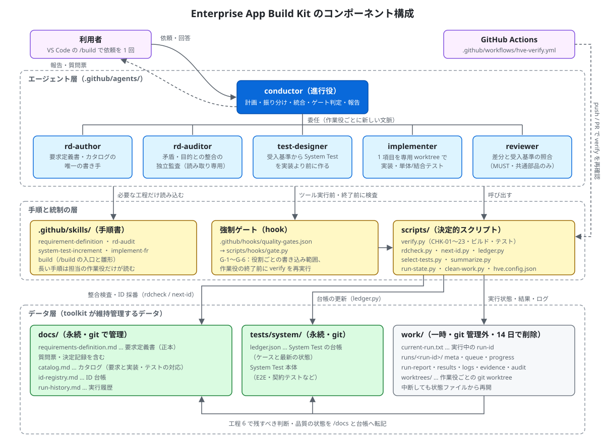
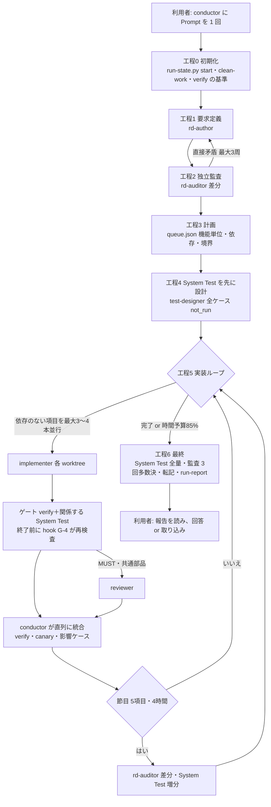
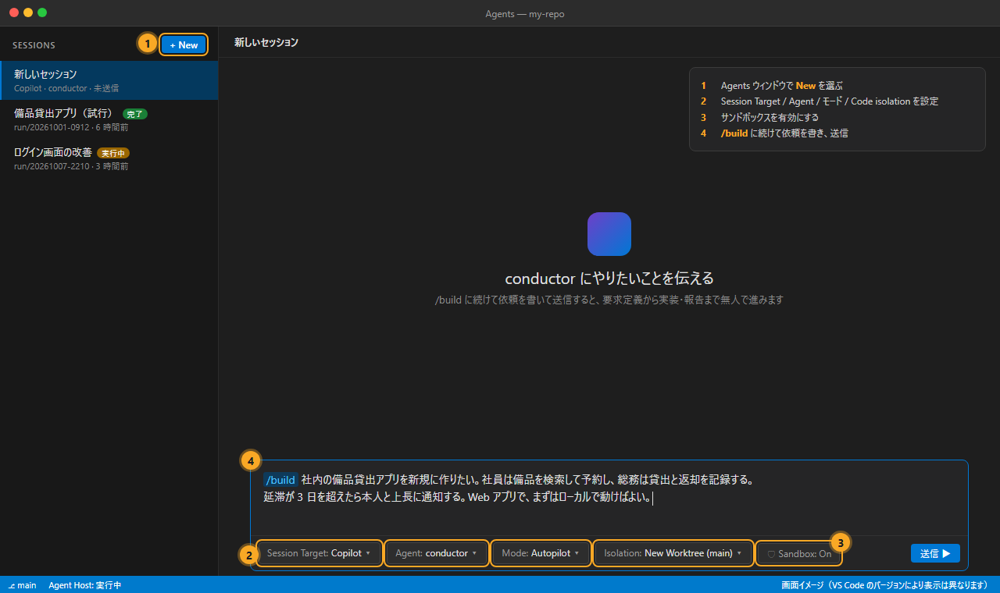
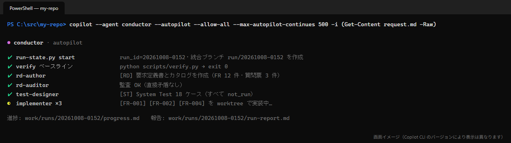
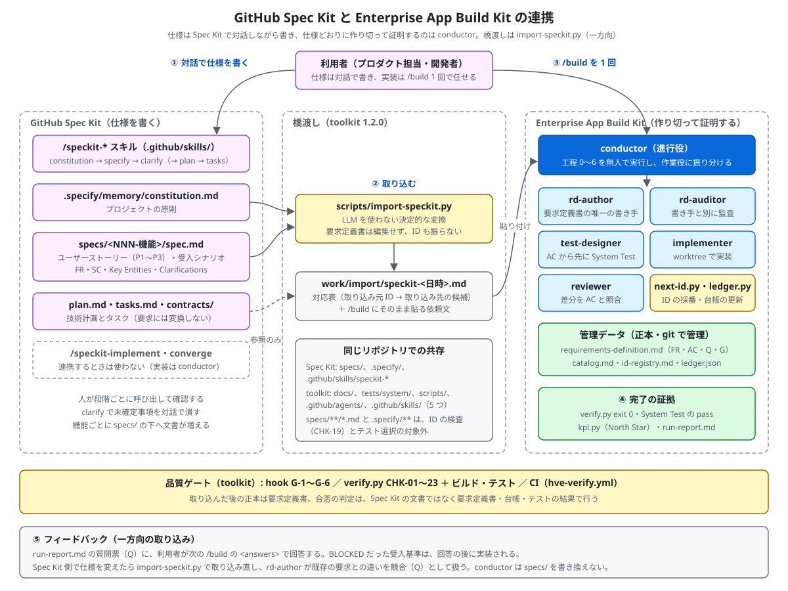
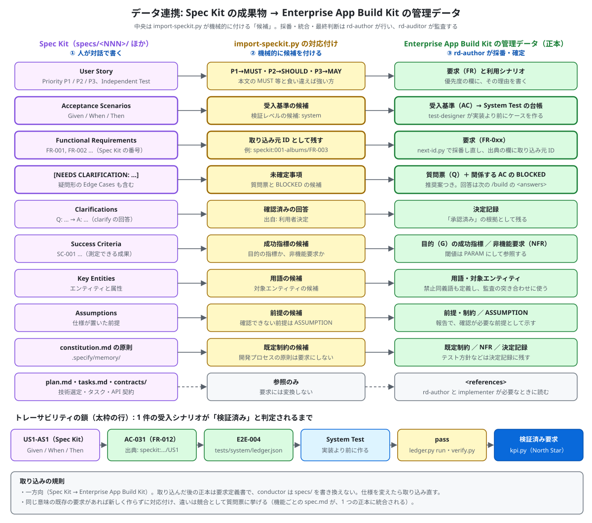

# HypervelocityEngineering — Enterprise App Build Kit

GitHub Copilot（VS Code の Agents ウィンドウ / Copilot CLI / GitHub Copilot app）用のマルチエージェント開発 toolkit です。要求定義書・カタログ・System Test の整合性を保ったまま、アプリケーションを**最高品質・最短時間・最小 Token** で実装することを目指します。

- やることは、オーケストレーターのエージェント `conductor` に Prompt を **1 回**送るだけです。
- conductor は、要求定義 → 独立監査 → System Test の先行設計 → 並行実装 → 直列の統合 → 最終監査 → 報告 までを、最大 24〜48 時間、人の介入なしで実行します。
- 品質を左右する規則は、LLM の判断に任せずに hook と決定的スクリプト（LLM を使わず、同じ入力から常に同じ結果を返すスクリプト）で強制します。具体的には次の 4 つです。
  - 要求定義書を書けるエージェントは 1 つだけ
  - 実装担当は System Test を変更できない
  - 終了前に必ず検証する
  - 危険な操作は拒否する
- これらの規則の多くは、`/build` で run を開始したときだけ働きます。`/build` 以外の Prompt で変更を依頼するリスクは、[重要: `/build` 以外の Prompt を送るときのリスク](#重要-build-以外の-prompt-を送るときのリスク) を参照してください。
- [GitHub Spec Kit](https://github.com/github/spec-kit) で書いた仕様を取り込み、実装と検証を conductor に任せることもできます（[GitHub Spec Kit との連携](#github-spec-kit-との連携)）。

## 目次

- [概要](#概要)
- [インストール](#インストール)
- [Quickstart](#quickstart)
- [GitHub Spec Kit との連携](#github-spec-kit-との連携)
- [詳細ドキュメント](#詳細ドキュメント)
- [用語](#用語)
- [リポジトリの構成](#リポジトリの構成)

## 概要

### 解決する問題

複数の AI エージェントに要求定義・実装・テストを繰り返させると、次の問題が起きがちです。

- 実装の途中で要求が書き換わり、承認していない内容が「承認済み」になる。
- 離れた要求どうしの矛盾に、書いた本人のセルフレビューでは気づけない。
- テストを実装に合わせて書き換えてしまい、要求の意味が変わる（実装のバグが「正解」になる）。
- 並行作業で ID が重複したり、要求の意味が衝突したりする。
- 監査結果やログがチャット履歴にしか残らず、失われる。

Enterprise App Build Kit は、次の 4 つの手段でこれらを防ぎます。

| 手段 | 内容 |
|---|---|
| **役割の分離** | 要求を書く役・監査する役・テストを作る役・実装する役を別のエージェントに分けます。どのエージェントも、自分が作った成果物を自分で「正解」と判定できません。 |
| **強制ゲート** | エージェントごとの書き込み範囲と、作業を終える前の検証を、hook と verify で強制します。 |
| **決定的スクリプト** | 検査・ID の採番・台帳の更新・ログの要約は、LLM ではなくスクリプトで行います。同じ入力なら常に同じ結果になります。 |
| **データの永続管理** | 要求定義書、カタログ、ID 台帳、System Test の台帳、run の状態・結果・ログ・証跡・監査結果を、決まったパスのファイルとして作成・更新します。チャット履歴に依存しないので、要求・テスト・実装のトレーサビリティを後から追えます。中断しても途中から再開できます。 |

土台になるのは、4 つ目の**データの永続管理**です。要求・判断・品質の状態は、永続データとして `/docs` と `tests/system/ledger.json` に置きます（git で管理）。run ごとの状態・ログ・証跡は、一時データとして `/work` に置きます。残すべき内容は、run の最後に `/docs` と台帳へ転記します（[データの置き場所](#データの置き場所)）。

### アーキテクチャ



利用者は conductor に依頼を 1 回渡すだけです。

1. conductor が作業を subagent（作業役）に割り当てます。
2. 作業役は、skills の手順書を読みながら scripts を使って作業します。
3. 規則は hook と verify が強制します。verify は CI でも再実行します。
4. 成果はデータ層のファイルに残ります。

ファイルの配置は次のとおりです。

```text
.github/
  agents/        conductor（オーケストレーター）と 5 つの作業役の定義（*.agent.md）
  skills/        手順書。必要な作業役だけが読み込む（Token を節約）
                 requirement-definition / implement-fr / system-test-increment / rd-audit
                 build … 利用者が /build で呼ぶ依頼の入口と雛形（手動呼び出し専用）
  hooks/         quality-gates.json … 全エージェント共通の強制ゲート（G-1〜G-6）
  workflows/     hve-verify.yml … GitHub Actions で verify を再実行（外部での再確認）
scripts/         決定的スクリプト（Python 3.9 以上。標準ライブラリだけを使用）
  verify.py / verify.ps1 / verify.sh   L1 検査（CHK-01〜23）＋ビルド・テスト
  rdcheck.py  next-id.py  ledger.py  select-tests.py  summarize.py  clean-work.py  run-state.py
  rdfix.py         データ層のファイル間の不整合を、要求定義書に合わせて自動修正
  kpi.py           KPI の集計（North Star: 人の介入 1 回あたりの検証済み要求）
  import-speckit.py  GitHub Spec Kit の成果物を /build の依頼文に変換
  hooks/gate.py   hook の本体
  hve.config.json 設定（検証コマンド、モデル、ゲート、保持期間）
docs/            永続のドキュメント（git で管理）
  requirements-definition.md  catalog.md  id-registry.md  run-history.md
tests/system/ledger.json      System Test の台帳（永続）
work/            一時ファイル（.gitignore 対象。14 日で削除）
  current-run.txt  runs/<run-id>/{meta.json, queue.json, progress.md, run-report.md, results.json, logs/, evidence/, audit/}
  worktrees/<run-id>-<item>/  作業役ごとの git worktree（統合後に削除）
```

常に読み込まれる instructions（`AGENTS.md`、`.github/copilot-instructions.md`）は数行に抑えています。長い手順は skills に置き、担当の作業役が必要になったときだけ読み込みます。

### エージェントと権限

| エージェント | 責務 | 書き込める範囲（hook で強制） | 読み込む skill |
|---|---|---|---|
| **conductor** | 計画、作業の割り当て、統合、ゲートの判定、報告。小さな作業は自分で行う | `work/` と `docs/run-history.md` だけ | build（利用者が `/build` で呼んだときだけ） |
| **rd-author** | 要求定義書・カタログの作成と更新、質問票、決定記録。**要求を書けるのはこのエージェントだけ** | `docs/`（run-history を除く） | requirement-definition |
| **rd-auditor** | 意味の監査（矛盾・目的との整合・記述の質）。rd-author とは別系統のモデルを使う | `work/` だけ（読み取り専用） | rd-audit |
| **test-designer** | 受入基準から System Test と台帳のケースを、**実装より前に**作る | `tests/system/`（台帳は ledger.py 経由） | system-test-increment |
| **implementer** | 1 つの作業項目（要求 1〜3 個）を専用の worktree で実装し、単体テスト・結合テストとカタログの行を書く | 自分の worktree（要求定義書と System Test は変更不可） | implement-fr |
| **reviewer** | 差分と受入基準の照合。MUST の要求と共通部品の変更にだけ使う | なし（読み取り専用） | なし |

どのエージェントも frontmatter でツールを限定していません。利用者が GitHub Copilot に設定した MCP Server・plugin・拡張機能のツールと skill は、そのまま使えます。例は、Work IQ（社内のメール・会議・チャット・ドキュメント）、Microsoft Learn、Azure MCP Server、Copilot Studio の plugin です。rd-author は、これらを一次情報の参照に使い、得た事実を出典付きで要求定義書に残します。外部のシステムを変更する操作（送信・作成・更新・削除・デプロイ）は、run_options の `external_write`・`deploy` で許可したときだけ行えます（hook G-5）。詳しくは [設定とカスタマイズ 4.4](users-guide/04-customization.md#44-mcp-serverplugin拡張機能を使う) を参照してください。

### 1 回の run の流れ


```mermaid
flowchart TD
  P[利用者: conductor に Prompt を 1 回] --> S0[工程0 初期化<br/>run-state.py start・clean-work・verify の基準]
  S0 --> S1[工程1 要求定義<br/>rd-author]
  S1 --> A1[工程2 独立監査<br/>rd-auditor 差分]
  A1 -->|直接矛盾 最大3周| S1
  A1 --> S3[工程3 計画<br/>queue.json 機能単位・依存・境界]
  S3 --> S4[工程4 System Test を先に設計<br/>test-designer 全ケース not_run]
  S4 --> L{工程5 実装ループ}
  L -->|依存のない項目を最大3〜4本並行| W[implementer 各 worktree]
  W --> G[ゲート verify＋関係する System Test<br/>終了前に hook G-4 が再検査]
  G -->|MUST・共通部品| RV[reviewer]
  G --> M[conductor が直列に統合<br/>verify・canary・影響ケース]
  RV --> M
  M --> K{節目 5項目・4時間}
  K -->|はい| A2[rd-auditor 差分・System Test 増分] --> L
  K -->|いいえ| L
  L -->|完了 or 時間予算85%| F[工程6 最終<br/>System Test 全量・監査 3回多数決・転記・run-report]
  F --> U[利用者: 報告を読み、回答 or 取り込み]
```

- **品質の土台（工程 1〜2）**: 実装を始める前に、要求定義書の直接矛盾を 0 件にします。利用者の判断が必要なものは質問票に挙げます。関係する受入基準は BLOCKED にして、残りの作業を先に進めます。
- **テストファースト（工程 4）**: test-designer は要求定義書だけを根拠に期待値を決めます。実装を正解として扱わないためです（テストオラクル問題）。
- **項目単位の並行実装（工程 5）**: 並行するのは、依存関係がなく、同じ共通部品・テーブル・境界に触れない項目だけです。統合は 1 本ずつ直列に行い、そのたびに verify と canary テストを実行します。
- **最終工程（工程 6）**: System Test の全量実行と、rd-auditor による全量監査（3 回の多数決）を行います。残すべき情報を `/docs` と台帳に転記してから報告します。

### 2 層の品質ゲート

| 層 | 実装 | 発火するタイミング | 例 |
|---|---|---|---|
| hook | `.github/hooks/quality-gates.json` → `scripts/hooks/gate.py` | ツール実行の**前**と、作業役・conductor が**終了する前** | rd-author 以外が要求定義書を編集しようとしたら拒否する（G-1）。implementer の終了前に verify を実行し、失敗なら差し戻す（G-4） |
| verify | `scripts/verify.py`（CHK-01〜23） | 作業役のゲート、統合のたび、CI | 台帳のケースが理由なく削除された（CHK-12）。AC の本文が変わったのに台帳が古いまま（CHK-11） |

VS Code の hook はプレビュー機能で、harness によって動作が異なることがあります（Copilot CLI と、その上に構築された GitHub Copilot app は同じ `.github/hooks` を読み込みます）。そのため同じ規則を verify でも検査し、hook が効かない環境でも統合の時点で必ず止まるようにしています。詳しくは [品質ゲートと検査項目](users-guide/06-quality-gates.md) を参照してください。

verify が見つけたデータ層のファイル間の不整合（カタログの決定状態のずれ、ID 台帳の状態、マージで重複した行、名前が変わったファイルの参照など）のうち、要求定義書から機械的に決まるものは `python scripts/rdfix.py --apply` で直せます。要求定義書は変更せず、判断が要るもの（AC の本文の変更、ID の再利用など）は担当の役割とともに `MANUAL` として示します（[6.3](users-guide/06-quality-gates.md#63-データ層の不整合の自動修正rdfix)）。

### 状態の永続化と再開

会話の要約（compaction）には依存しません。状態はすべて次のファイルと git にあります。

- `work/current-run.txt`: 実行中の run-id
- `work/runs/<run-id>/meta.json`: 開始時刻、run_options、現在の工程、統合ブランチ
- `work/runs/<run-id>/queue.json`: 作業キュー（項目ごとの要求 ID、AC、境界、依存、状態、試行回数、ブランチ）
- `work/runs/<run-id>/progress.md`: 工程・判断・残課題（1 項目 3 行以内）

新しいコンテキストで起動すると、conductor は `python scripts/run-state.py start` から始めます。実行中の run があれば、`RESUME` と状態を表示して続きを実行します。止まったときは、同じセッションで「続けて」と送るか、新しいセッションで同じ Prompt を送れば再開します。

### データの置き場所

| 置き場所 | 置くもの | git | 保持期間 |
|---|---|---|---|
| `/docs` | 要求定義書、カタログ、ID 台帳、実行履歴 | 管理する | 永続 |
| `tests/system/ledger.json` | System Test のケースと最新の状態 | 管理する | 永続 |
| `/work` | キュー、進捗、報告、結果、証跡、監査の生データ、ログ、worktree | 管理しない | 14 日 |

`/work` が消えても、要求・判断・品質の状態を `/docs` と台帳だけで追えるように、工程 6 で転記します。

### Token 消費を抑える設計

| 工夫 | 実装 |
|---|---|
| 長い手順書は、必要な作業役だけが読む | `.github/skills/`（長い手順を skill に分け、担当の作業役だけが読み込む） |
| 機械的な検査・採番・台帳更新・要約はスクリプトで行う | `scripts/*.py`。LLM には要約だけを渡す（`summarize.py`、`verify.py` の短い出力） |
| 必要な節だけを読む | `rdcheck.py show FR-012 AC-031` |
| 工程ごとに新しいコンテキストから再開する | `run-state.py status` と progress.md |
| テストは影響範囲だけを実行し、全量は節目と最終工程だけ | `select-tests.py`、`ledger.py run --select changed` |
| 多数決の監査は最終工程だけ | 節目は runs: 1、最終は runs: 3 |
| 作業役のモデルを難易度で振り分け、失敗したときだけ上位モデルに切り替える | `scripts/hve.config.json` の `models`（[設定とカスタマイズ](users-guide/04-customization.md)） |

---

## インストール

### 前提条件

| 必要なもの | 確認方法 | 備考 |
|---|---|---|
| git リポジトリ | `git status` | まだなら `git init -b main` して最初の commit を作ります |
| Python 3.9 以上 | `python --version`（macOS/Linux は `python3 --version`） | スクリプトと hook が使います。標準ライブラリだけで動くので、追加パッケージは不要です。Windows では Microsoft Store の `python` スタブではなく、実体の Python をインストールします（`winget install Python.Python.3.12`） |
| GitHub Copilot | VS Code（Agents ウィンドウ）、Copilot CLI、または GitHub Copilot app | 長時間の実行は、VS Code の Copilot harness（Agent Host）か GitHub Copilot app と、Autopilot を前提にしています |
| MCP Server・plugin（任意） | VS Code の `MCP: List Servers`、Copilot CLI の `/mcp`、GitHub Copilot app の **カスタマイズ** → **MCP** | Work IQ、Microsoft Learn、Azure などを設定しておくと、エージェントが自動で使います。toolkit は MCP の設定を配布しません |

### インストールコマンド（推奨）

インストール先のリポジトリの**ルート**で、次の 1 行を実行します。このコマンドは toolkit を一時フォルダーにダウンロードし、`tools/install.py` を実行してから一時フォルダーを削除します。

**Windows（PowerShell）**

```powershell
irm https://raw.githubusercontent.com/dahatake/HypervelocityEngineering/main/tools/install.ps1 | iex
```

オプションを付ける場合:

```powershell
& ([scriptblock]::Create((irm https://raw.githubusercontent.com/dahatake/HypervelocityEngineering/main/tools/install.ps1))) -DryRun
```

**macOS / Linux / WSL / Git Bash**

```bash
curl -fsSL https://raw.githubusercontent.com/dahatake/HypervelocityEngineering/main/tools/install.sh | bash
# オプションを付ける場合
curl -fsSL https://raw.githubusercontent.com/dahatake/HypervelocityEngineering/main/tools/install.sh | bash -s -- --dry-run
```

特定のバージョン（タグ・ブランチ・commit）を使う場合は、環境変数 `HVE_REF` を指定します（例: `HVE_REF=v1.0.0`）。フォークを使う場合は `HVE_REPO=<owner>/<repo>` を指定します。

**toolkit を clone 済みの場合**

```bash
python tools/install.py --target /path/to/your-repo
```

### オプション

| オプション（install.py / install.sh） | PowerShell | 動作 |
|---|---|---|
| `--target <dir>` | `-Target` | インストール先（既定: カレントディレクトリ） |
| `--dry-run` | `-DryRun` | 何も書き込まず、実行する操作だけを表示します |
| `--check` | `-Check` | 更新が必要かどうかを確認します（必要なら exit 1。CI でバージョンのずれを検出できます） |
| `--force` | `-Force` | ローカルで変更した toolkit のファイルも上書きします（`*.hve-backup-<日時>` を残します） |
| `--no-ci` | `-NoCi` | `.github/workflows/hve-verify.yml` をインストールしません |
| `--uninstall` | `-Uninstall` | 変更していない toolkit のファイル、`AGENTS.md` などのブロック、マニフェスト、空になったフォルダーを削除します（管理データと設定は残します）。`uninstall.ps1` / `uninstall.sh` でも実行できます |
| `--purge` | `-Purge` | `--uninstall` に加えて、管理データ（`docs/` の要求定義書・カタログ・ID 台帳・run 履歴・手動テスト、`tests/system/ledger.json`）、`scripts/hve.config.json`、`/work`、`.gitignore`・`.gitattributes` に追記した行、`*.hve-backup-*` も削除します |

### インストールされるファイル

| 種類 | ファイル | 再実行時の扱い |
|---|---|---|
| toolkit のファイル | `.github/agents/*.agent.md`（6）、`.github/skills/*/SKILL.md`（5。`/build` の skill を含む）、`.github/hooks/quality-gates.json`、`.github/workflows/hve-verify.yml`、`scripts/*.py`・`verify.ps1`・`verify.sh`・`scripts/hooks/gate.py` | 変更していなければ新しいバージョンに更新します。ローカルで変更していれば**そのまま残します**（`KEEP-LOCAL`。`--force` で上書き） |
| 管理データの雛形 | `docs/requirements-definition.md`、`docs/catalog.md`、`docs/id-registry.md`、`docs/run-history.md`、`tests/system/ledger.json` | **存在しない場合だけ**作成します。既存のファイルは上書きしません |
| 設定 | `scripts/hve.config.json` | なければ作成します。あれば新しいキーだけを追加し、利用者が設定した値は変更しません |
| 追記 | `.gitignore` に `/work/`、`.gitattributes` に `docs/id-registry.md merge=union` と `docs/run-history.md merge=union` | 足りない行だけを追記します |
| ブロック | `AGENTS.md`、`.github/copilot-instructions.md` に `<!-- hve-abk:begin -->`〜`end` で囲んだ数行 | ブロックの中だけを置き換えます。ブロック外の記述は変更しません |
| マニフェスト | `.github/hve-toolkit.json` | バージョンと、インストールしたファイルのハッシュ（更新・削除の判定に使います） |

インストールの最後に `python scripts/verify.py --docs-only` を実行し、結果を表示します。

### インストール後の設定

1. 差分を確認して commit します。
   ```bash
   git add -A && git commit -m "Add Enterprise App Build Kit"
   ```
2. `scripts/hve.config.json` の `verify.commands` に、ビルド・静的解析・テストのコマンドを登録します（[設定とカスタマイズ](users-guide/04-customization.md)）。空のままでも、初回の run で implementer がその技術スタックの標準的なコマンドを登録します。
3. CI でアプリのツールチェーン（Node.js など）が必要な場合は、`.github/workflows/hve-verify.yml` の verify ステップの前にセットアップのステップを追加します。
4. 既存の要求定義書がある場合は、その ID を ID 台帳に取り込みます。
   ```bash
   python scripts/next-id.py --sync --adopt
   ```
   続けて `python scripts/verify.py --docs-only --show-warnings` を実行し、構造化欄の不足（CHK-20）などを確認します。修正は最初の run で rd-author に任せてかまいません（依頼に「既存の要求定義書を toolkit の書式に合わせる」と書きます）。
   [GitHub Spec Kit](https://github.com/github/spec-kit) の仕様（`specs/*/spec.md`、`.specify/memory/constitution.md`）がある場合は、`python scripts/import-speckit.py` で `/build` の依頼文を作ります（[Spec Kit からの取り込み](users-guide/01-writing-requests.md#17-github-spec-kit-の仕様を取り込む)）。
5. （任意）社内の情報や対象の技術のツールを使う場合は、run を実行する環境（VS Code・Copilot CLI・GitHub Copilot app）に MCP Server・plugin を設定し、サインインしておきます。例は、要求の一次情報には Work IQ、Azure を使う開発には Microsoft Learn と Azure MCP Server、Copilot Studio を使う開発には Microsoft が提供する plugin です。エージェント側の設定は不要です（[設定とカスタマイズ 4.4](users-guide/04-customization.md#44-mcp-serverplugin拡張機能を使う)）。

### 更新・確認

```bash
# 更新（同じインストールコマンドをもう一度実行するだけ）
curl -fsSL https://raw.githubusercontent.com/dahatake/HypervelocityEngineering/main/tools/install.sh | bash

# 更新が必要かどうかだけを確認する
curl -fsSL .../tools/install.sh | bash -s -- --check
```

### アンインストール・クリーンアップ

インストールと同じように、インストール先のリポジトリの**ルート**で 1 行を実行します。

**Windows（PowerShell）**

```powershell
# アンインストール（toolkit のファイルとブロックを削除します。docs・台帳・設定・/work は残します）
irm https://raw.githubusercontent.com/dahatake/HypervelocityEngineering/main/tools/uninstall.ps1 | iex

# クリーンアップ（管理データ・設定・/work・追記した行も含めて、toolkit が加えたものをすべて削除します）
& ([scriptblock]::Create((irm https://raw.githubusercontent.com/dahatake/HypervelocityEngineering/main/tools/uninstall.ps1))) -Purge -DryRun   # 確認
& ([scriptblock]::Create((irm https://raw.githubusercontent.com/dahatake/HypervelocityEngineering/main/tools/uninstall.ps1))) -Purge
```

**macOS / Linux / WSL / Git Bash**

```bash
curl -fsSL https://raw.githubusercontent.com/dahatake/HypervelocityEngineering/main/tools/uninstall.sh | bash
curl -fsSL https://raw.githubusercontent.com/dahatake/HypervelocityEngineering/main/tools/uninstall.sh | bash -s -- --purge --dry-run   # 確認
curl -fsSL https://raw.githubusercontent.com/dahatake/HypervelocityEngineering/main/tools/uninstall.sh | bash -s -- --purge
```

toolkit を clone 済みの場合は `python tools/install.py --target /path/to/your-repo --uninstall`（または `--purge`）です。`install.ps1 -Uninstall`、`install.sh --uninstall` でも同じです。

| 対象 | `--uninstall` | `--purge` |
|---|---|---|
| toolkit のファイル（`.github/agents`・`skills`・`hooks`・`workflows/hve-verify.yml`、`scripts/*.py` など）と旧版のファイル | 変更していなければ削除（変更していれば `KEEP-LOCAL` で残す。`--force` で削除） | 同じ |
| `AGENTS.md`・`.github/copilot-instructions.md` のブロック | ブロックだけを削除（ほかに記述がなければファイルごと削除） | 同じ |
| マニフェスト `.github/hve-toolkit.json`、空になったフォルダー、削除した `.py` の `__pycache__` | 削除 | 削除 |
| 管理データ（`docs/requirements-definition.md`・`catalog.md`・`id-registry.md`・`run-history.md`・`manual-tests.md`・`docs/requirements/`、`tests/system/ledger.json`）。パスは `scripts/hve.config.json` の `files` に従います | 残す | 削除 |
| `scripts/hve.config.json`、`/work`、`*.hve-backup-*` | 残す | 削除 |
| `.gitignore` の `/work/`、`.gitattributes` の `merge=union` の行 | 残す | 追記した行だけを削除（空になればファイルごと削除） |
| System Test のコード（`tests/system/` の台帳以外）、アプリのコード、`docs/` のほかの文書 | 残す | 残す |

- マニフェストが失われている場合は、この版の toolkit と同じ内容のファイルだけを削除します（`WARN` を表示します）。
- 削除は git の作業ツリーに対して行います。結果を `git status` で確認してから commit します（`git restore` で戻せます。`/work` は git の管理対象外なので戻せません）。
- run が作った worktree と `work/*` ブランチは削除しません。必要なら `git worktree list`・`git branch --list "work/*"` で確認して削除します。
- 何度実行しても安全です（2 回目は `changes=0`）。

### plugin ではなくインストーラーを使う理由

GitHub Copilot には、agents・skills・hooks をまとめて配布する標準の仕組みとして **plugin**（`copilot plugin install OWNER/REPO`、Agent Plugins 仕様）があります。採用を検討しましたが、この toolkit の配布には使っていません。理由は次のとおりです。

| 観点 | plugin | この toolkit に必要なこと |
|---|---|---|
| インストール先 | 利用者のホーム（plugin のディレクトリ）。リポジトリには入らない | 決定的スクリプト（`scripts/`）、管理データの雛形（`docs/`）、台帳、`.gitignore`、CI を**対象リポジトリの中**に置いて git で管理し、CI（GitHub Actions）でも同じ verify を実行する必要がある |
| 可搬性 | Agent Plugins 1.0 で可搬なのは skills と MCP だけ。custom agents と hooks はクライアントごとの拡張 | VS Code の Copilot harness・Copilot CLI・Copilot app で、同じ `.github/agents`・`.github/skills`・`.github/hooks` を使う |
| hook のスコープ | plugin の hook は、利用者のすべてのリポジトリ・セッションで動く | ゲートは、toolkit をインストールしたリポジトリでだけ動くべき |
| チームでの共有 | 利用者ごとにインストールが必要 | リポジトリを clone すれば、チーム全員と CI が同じバージョンを使える |

そこで、customizations（`.github/`）と `scripts/` をリポジトリに直接置く方式にしました。これは VS Code・Copilot CLI・Copilot app・cloud agent が標準で読み込む場所です。そのインストール・更新・アンインストールを 1 コマンドで行うために `tools/install.*`・`tools/uninstall.*` を用意しています。

### インストール時のトラブル

| 症状 | 対処 |
|---|---|
| `Python 3.9 以上が必要です` | Python をインストールし、`python --version` が通ることを確認します |
| `git リポジトリではありません` | `git init -b main` してから実行します |
| `KEEP-LOCAL` が表示された | ローカルで変更したファイルは更新していません。差分を確認し、上書きしてよければ `--force` を付けて再実行します |
| hook の実行時に `python` が見つからない | hook は `python3`（macOS/Linux）または `python`（Windows）を呼び出します。PATH を確認します |

---

## Quickstart

全体の流れは次の 3 ステップです。

1. 自分のリポジトリのルートで、インストールコマンドを 1 回実行します（[インストール](#インストール)）。
   - Windows: `irm https://raw.githubusercontent.com/dahatake/HypervelocityEngineering/main/tools/install.ps1 | iex`
   - macOS / Linux: `curl -fsSL https://raw.githubusercontent.com/dahatake/HypervelocityEngineering/main/tools/install.sh | bash`
2. VS Code の Agents ウィンドウで conductor を選び、チャット欄に `/build` に続けてやりたいことを書いて送信します（[VS Code で実行する](#vs-code-で実行する推奨)）。GitHub Copilot app でも同じように送れます（[GitHub Copilot app で実行する](#github-copilot-app-で実行する)）。
3. 終わったら `work/runs/<run-id>/run-report.md` を読みます。そのうえで、質問票に回答するか、統合ブランチをマージします（[実行中と終了後](users-guide/02-during-and-after-run.md)）。

### VS Code で実行する（推奨）



*画面イメージです。番号は下の手順に対応します。VS Code のバージョンによって、表示や項目の位置は異なります。*

1. toolkit をインストールしたリポジトリを VS Code で開き、**Agents ウィンドウ**で **New** を選びます。
2. 次のように設定します。

   | 設定 | 値 | 理由 |
   |---|---|---|
   | Session Target | **Copilot** | Copilot harness（Agent Host）では、ウィンドウを閉じてもセッションが続きます。`.github/hooks` の hook も Copilot CLI と同じ仕様で動きます |
   | Agent | **conductor** | 利用者が直接呼ぶ唯一のエージェントです |
   | モード | **Autopilot** | ツールを承認なしで実行し、エラー時は再試行し、作業が完了するまで続けます |
   | Code isolation | **New Worktree**（ベースは main） | 元の作業ツリーを汚さずに作業します。アプリの依存関係をコンテナーで揃えたい場合は Dev Container を選びます |

3. エージェントの**サンドボックス**を有効にします。ネットワークは、パッケージレジストリなど必要な宛先だけを許可します（worktree はセキュリティ境界ではないためです）。
4. チャット欄に `/build` と入力し、**同じ欄に続けて**やりたいことを書いて送信します（例: `/build 社内の備品貸出アプリを新規に作りたい。…`）。
   - `/build` は skill（`.github/skills/build/SKILL.md`）です。入力した文章を `<request>` として扱い、`<run_options>` には既定値（`max_hours: 24` など）を使います。回答や run_options も指定する場合は、[依頼の書き方](users-guide/01-writing-requests.md) の雛形を `/build` の後に貼り付けて書き換えます。雛形は `/build-template`（または `/build template`）と送るとチャットに表示されます（run は開始しません）。
   - `<request>` などの**入力フォームは表示されません**。依頼の文章はチャット欄に直接書きます。
   - `/build` が候補に出ない場合は、インストールコマンドを再実行して更新します。更新しなくても、Agent が conductor なら、雛形を書き換えてそのまま送信すれば同じように動きます（prompt file は Agent Host では読み込まれないため、Session Target が Copilot のときは `/build` として表示されません）。
5. 送信したらウィンドウを閉じてもかまいません。ただし **PC はスリープさせないでください**（Agent Host はローカルの PC 上で動きます）。途中経過は、Agents ウィンドウのセッション一覧から開いて確認できます。

> New Worktree では、git の管理対象外のファイル（`/work` など）は新しい worktree にコピーされません。conductor の `/work` は、そのセッションの worktree の中に作られます。

### GitHub Copilot app で実行する

[GitHub Copilot app](https://docs.github.com/ja/copilot/how-tos/github-copilot-app)（デスクトップアプリ）は Copilot CLI の上に構築されており、リポジトリの `.github/agents`（custom agents）・`.github/skills`（`/build` を含む skill）・`.github/hooks`（品質ゲート）をそのまま読み込みます。toolkit 側の追加設定は不要です。

1. toolkit のインストールを **commit** しておきます（新しい作業ツリーは commit からチェックアウトされるため、commit していないファイルは入りません）。GitHub からリポジトリを選ぶ場合やクラウド サンドボックスを使う場合は、push もしておきます。
2. サイドバーの **プロジェクト** の横の **+** で新しいセッションを作り、toolkit を入れたリポジトリを選びます。
3. プロンプト欄の下で次のように設定します。

   | 設定 | 値 | 理由 |
   |---|---|---|
   | 実行場所 | **新しい作業ツリー**（推奨） | セッションごとに専用のブランチと worktree（例: `<リポジトリの親>/copilot-worktrees/<リポジトリ名>/<ブランチ名>`）で動くので、元の作業ツリーを汚しません。**ローカル リポジトリ**を選ぶと、Copilot CLI と同じく今のチェックアウトで動きます |
   | セッション モード | **Autopilot** | 入力を待たずに最後まで進みます。早すぎる完了は agentStop の hook が差し戻します |
   | モデル | 推論の強いモデル | conductor のモデルです。作業役のモデルは `scripts/hve.config.json` の `models` で指定します |
   | Agent | **conductor** | エージェント ピッカー、またはプロンプト欄の `/agent` で選びます |

4. ローカル サンドボックスを有効にします（アプリの設定 → プロジェクト → **サンドボックス** の **サンドボックスの新しいセッション**、またはセッション中に `/sandbox on`）。既定のポリシーで、worktree の読み書き、パッケージのインストール、ローカルの開発サーバーへの接続ができます。hook もサンドボックスの中で動きます。
5. プロンプト欄に `/build` と入力し、続けてやりたいことを書いて送信します。雛形は `/build-template`（または `/build template`）で表示されます（run は開始しません）。
6. 送信後は、アプリを起動したままにし、**PC をスリープさせないでください**（ローカルのセッションは PC 上で動きます）。途中経過は、サイドバーのセッションから確認できます。

GitHub Copilot app に固有の注意点:

- **ブランチ名の変更**: アプリは、セッションのブランチ名をエージェントのツール（`rename_branch`）で付け直すことがあります。run の開始後は、統合ブランチが `meta.json` に記録されているため、hook（G-5）がこのツールを拒否します。アプリの画面などでブランチ名を変えた場合も、`python scripts/run-state.py status` が現在のブランチを統合ブランチとして記録し直します。
- **取り込み**: 新しい作業ツリーで始めた run は、セッションのブランチがそのまま統合ブランチになり、conductor は main へマージしません。`run-report.md` を確認してから、アプリのプル要求の作成（または `git merge`）で取り込みます。`git_push: しない` の場合、push はアプリの操作で利用者が行います。
- **再開**: `/work`（run の状態）は git の管理対象外なので、そのセッションの worktree の中にしかありません。止まったときは**同じセッション**で「続けて」と送ります。新しいセッションを作ると別の worktree になり、run の状態を引き継げません。run が終わって取り込むまで、セッションをアーカイブ・削除しないでください。
- **クラウド サンドボックス**: GitHub がホストする Linux 環境でセッション全体が動くため、PC をスリープさせても続きます。ただし、リポジトリは GitHub から取得されるので toolkit を push 済みであること、組織・Enterprise のポリシーで有効になっていること、使用量に応じた課金があることに注意します。成果物はサンドボックスの中にあるので、`git_push` を「作業ブランチへ push する」にするか、終了後にアプリから push・プル要求の作成を行います。最初は短い run で[初回に確認すること](#初回に確認すること)を確かめます。

### Copilot CLI で実行する

同じ customizations（`.github/agents`・`.github/skills`・`.github/hooks`）を Copilot CLI でも使えます。



*画面イメージです。Copilot CLI のバージョンによって表示は異なります。*

```bash
# 依頼を書いたファイル（雛形は users-guide/01-writing-requests.md の 1.1）を用意して
copilot --agent conductor --autopilot --allow-all --max-autopilot-continues 500 -i "$(cat request.md)"
```

```powershell
copilot --agent conductor --autopilot --allow-all --max-autopilot-continues 500 -i (Get-Content request.md -Raw)
```

- `--max-autopilot-continues` の既定値は 5 です。24〜48 時間の run では大きな値にします。
- サンドボックスは、対話中に `/sandbox` で設定します（`copilot help sandbox`）。全権限（`--allow-all`）はサンドボックスと組み合わせて使うことが推奨されています。
- 別のブランチで実行したい場合は、先に `git switch -c run/<名前>` してから起動します。main 上で起動した場合も、conductor が最初に統合ブランチ `run/<run-id>` を作ります。

### 最初の依頼の例

```text
<request>
社内の備品貸出アプリを新規に作りたい。社員は備品を検索して予約し、総務は貸出と返却を記録する。
延滞が 3 日を超えたら本人と上長に通知する。Web アプリで、まずはローカルで動けばよい。
</request>
<answers>
</answers>
<references>
docs/source/備品管理の現状.md
</references>
<run_options>
max_hours: 8
approval_policy: 安全範囲は推奨どおり
parallel_workers: 3
scope: 承認済みすべて
git_push: しない
deploy: しない
external_write: しない
paid_services: 使わない
external_exposure: 公開しない
</run_options>
```

最初は `max_hours` を短め（4〜8 時間）にして、報告の形式と品質を確認することをお勧めします。

### run の中で起きること

1. conductor が `run-state.py start` で run を開始し、統合ブランチを作り、verify のベースラインを記録します。
2. rd-author が要求定義書とカタログを作り、質問票を挙げます（`[RD]` の commit）。
3. rd-auditor が独立に監査します。直接矛盾があれば rd-author に差し戻します。
4. conductor が作業キューを作ります。
5. test-designer が System Test と台帳のケースを作ります（`[ST]` の commit。すべて `not_run`）。
6. implementer が項目ごとに worktree で実装し（`[FR-xxx]` の commit）、conductor が 1 本ずつ統合します。
7. 最後に System Test の全量実行と全量監査を行い、`work/runs/<run-id>/run-report.md` を書きます。

### 初回に確認すること

hook や subagent の動作は、クライアント（VS Code・Copilot CLI・GitHub Copilot app）やそのバージョンによって異なることがあります。最初の run（または短い試行）で次の項目を確認し、結果を `docs/run-history.md` の備考かチームの記録に残します（導入の段取りでは「Phase 1 のチェックリスト」と呼びます。[導入ロードマップと KPI](users-guide/08-roadmap.md)）。

| # | 確認すること | 確認方法 |
|---|---|---|
| 1 | custom agent を subagent として呼べるか | progress.md に rd-author・test-designer・implementer の結果が記録されている |
| 2 | custom agent ごとのモデル指定が効くか | Agent Debug Logs や使用量の表示で、作業役ごとのモデルを確認する |
| 3 | hook のイベントで、呼び出し元のエージェントを識別できるか | `work/.hve/gate.log` に `START rd-author` などと `DENY`/`BLOCK` が記録されている |
| 4 | ウィンドウを閉じても処理が続くか | ウィンドウを閉じて 30 分後に開き直し、progress.md が進んでいる |
| 5 | サンドボックス内でテストとブラウザー自動操作（Playwright）が動くか | `ledger.py run` の結果が pass/fail で記録される（`TIMEOUT` や権限エラーではない） |
| 6 | Advanced Autopilot の有無で完了判定がどう変わるか | 早すぎる完了宣言が起きないか（agentStop の hook が `完了条件を満たしていません` で差し戻しているか） |
| 7 | （GitHub Copilot app）サンドボックスの中で hook が動くか、統合ブランチが変わらないか | `work/.hve/gate.log` に記録がある。アプリに hook の失敗の警告が出ていない。`python scripts/run-state.py status` の `integration:` が、セッションのブランチ（main 上で始めた場合は `run/<run-id>`）と一致する |

3 で subagent を識別できない場合は、[トラブルシューティング](users-guide/07-troubleshooting.md) の「拒否・差し戻し」にある `[G-5] conductor が編集できるのは…` の行を参照してください。

### 重要: `/build` 以外の Prompt を送るときのリスク

> [!IMPORTANT]
> この toolkit の品質保証は、`/build`（conductor）で run を開始したときに働くように作られています。toolkit を入れたリポジトリでも、`/build` を使わない通常の Prompt（Agent モードでの依頼など）では、多くのゲートが働きません。**要求・テスト・実装の変更は `/build` で依頼してください。** 通常の Prompt は、質問や調査など読み取りだけの用途にとどめることをお勧めします。

`scripts/hooks/gate.py` の規則の多くは、run が active なとき（`work/current-run.txt` の run の状態が `active`）か、作業ブランチ（`work/<run-id>/…`）の上にいるときだけ適用されます。

| 区分 | 規則 |
|---|---|
| run の外でも拒否される | 台帳（`tests/system/ledger.json`）の直接編集（G-2）、ID 台帳の直接編集（G-3）、一時ファイルを `/work` の外に書くこと（G-6）、作業ディレクトリの外への書き込み、`main` への push と force push、履歴を書き換える git 操作、`/work` の直接削除 |
| run の外では**止まらない** | rd-author 以外による要求定義書の編集（G-1）、`main` への直接の commit・merge、`run_options` の `deploy`・`git_push`・`external_write` による制限（デプロイと、MCP などの外部ツールでの変更）、hook 自体の変更、終了前の完了確認（agentStop）、作業役の終了前の verify（G-4） |

このため、通常の Prompt では次のことが起こりえます。

1. **要求定義書が無断で変わる**: `docs/requirements-definition.md` が、rd-author の構造化欄、質問票、決定記録を経ずに書き換わります。独立監査（rd-auditor）も通りません。ID は `next-id.py` を使わずに手で付けられがちです。その結果、ID の不整合や未採番は後の verify で初めて見つかります。
2. **System Test が実装に合わせられる**: 通常のエージェントは `tests/system/` を編集できます。受入基準ではなく実装を正解としてテストを直してしまうと、test-designer の独立性（テストオラクル問題への対策）が失われます。
3. **`main` に未検証の変更が入る**: 統合ブランチ・worktree による隔離、統合ごとの verify と canary、失敗時の自動の取り消し、reviewer のレビューがありません。
4. **外部に変更が及ぶ**: run_options による制限が働かないため、デプロイや、MCP・plugin による外部システムの変更が止まりません。
5. **途中で完了と宣言される**: 完了条件の確認がないため、検証を実行しないまま終わることがあります。
6. **文脈と Token が膨らむ**: 作業役への委譲と状態ファイルによる再開がないため、長い作業が 1 つの会話にたまり、圧縮されたときに規則や進捗を取り違えやすくなります。

逆に、**中断中の run が残っている**（run が `active`）と、通常の Prompt にも conductor 用の制限がかかります。たとえば、`/work` と `docs/run-history.md` 以外は編集を拒否されます（G-5）。また、作業ツリーでは統合ブランチ（`run/<run-id>`）がチェックアウトされたままのことがあり、そこに無関係な変更を commit すると、run の再開時に前提が崩れます。通常の Prompt を使う前に `python scripts/run-state.py status` で状態を確認し、run を続けるなら `/build` で再開します。

通常の Prompt でファイルを変更した場合は、commit の前に `python scripts/verify.py` を実行し、exit 0 になることを確認してください。CI（`.github/workflows/hve-verify.yml`）でも同じ検査を実行します。

---

## GitHub Spec Kit との連携

[GitHub Spec Kit](https://github.com/github/spec-kit)（以下 Spec Kit）で書いた仕様を、この toolkit に取り込んで実装・検証できます。**仕様は Spec Kit で対話しながら書き、仕様どおりに作り切って証明するのは conductor** という分担です。橋渡しは `scripts/import-speckit.py` で、取り込みは一方向（Spec Kit → Enterprise App Build Kit）です。

### なぜ連携するのか

どちらも「仕様を正本にする」という考え方は同じですが、得意な工程が違います。

| 観点 | Spec Kit | Enterprise App Build Kit |
|---|---|---|
| 解く問題 | 仕様を**どう書くか**（Spec-Driven Development の作法とテンプレート） | 仕様どおりに**最後まで作り切り、それを証明する**こと |
| 人の関わり方 | `/speckit-*` を段階ごとに呼び、人が結果を確かめて次へ進む | `/build` を 1 回送るだけ。判断が要る点は質問票にまとめ、止まらずに進む |
| 未確定事項の扱い | `/speckit-clarify` で、その場で対話して潰す | 質問票（Q）と BLOCKED に記録し、次の `/build` の `<answers>` で回答する |
| 完了の判定 | `/speckit-converge` が、仕様・タスク・コードを LLM で読み比べる | 要求 → 受入基準 → System Test → verify の鎖で、決定的に判定する（exit 0） |
| 正本の形 | 機能ごとの `specs/<NNN-機能>/spec.md` | 1 つの要求定義書（ID 付き）、カタログ、System Test の台帳 |

ここから、次のように分担するのが合理的だと考えます。

1. **仕様を育てる段階は、対話が向いている。** 要求の意図や優先度は、人と短いやりとりを重ねるほど正確になります。Spec Kit の specify・clarify・constitution は、この段階のために作られています。conductor は質問を run の後にまとめて返すため、仕様を一緒に練り上げる用途には向きません。
2. **作る・確かめる段階は、無人と決定的な判定が向いている。** 実装・テスト・統合は手数が多く、人が段階ごとに呼び出すと介入が増えます。また、「仕様どおりか」を LLM の読み比べで判定すると、判定そのものが揺れます。conductor は役割を分けた作業役と hook・verify で、この段階を人の手 1 回で進め、合否を機械的に出します。
3. **2 つをつなぐには、仕様の各要素を Enterprise App Build Kit の管理データへ対応付ける必要がある。** ユーザーストーリー・受入シナリオ・未確定事項などは、それぞれ要求・受入基準・質問票に対応します。この対応付けを毎回手で行うと、抜けや ID の重複が起きます。`import-speckit.py` が機械的に候補を付け、rd-author が採番と最終判断を行います。

**計測での裏付け**: 同じ 3 課題を両方のツールで各 2 回実行しました（[bench/RESULTS.md](bench/RESULTS.md)）。課題が小さく合格率が上限に張りついたため、品質の差はまだ検出できていません。分かっているのは次の 4 点です。

- 隠し受入テストは、どちらも 100% 合格でした。
- 人の介入は、Spec Kit が平均 7.7 回、conductor が 1 回でした。
- conductor の reviewer と最終監査は、隠しテストでは測れない欠陥を見つけました（テストの脆さ、受入基準と非機能要求の矛盾）。
- 一方で、所要時間は conductor のほうが長くかかりました（役割を分けて実行した run で約 40 分、Spec Kit は約 17 分）。

### 何が、どう連携するのか



| 段階 | 担当 | すること | 主な成果物 |
|---|---|---|---|
| ① 仕様を書く | 利用者 ＋ Spec Kit | `/speckit-constitution` → `/speckit-specify` → `/speckit-clarify`（必要なら `/speckit-plan`・`/speckit-tasks`） | `.specify/memory/constitution.md`、`specs/<NNN-機能>/spec.md` ほか |
| ② 取り込む | `import-speckit.py`（決定的スクリプト） | Spec Kit の文書を読み、要素ごとに取り込み先の候補を付ける。要求定義書は編集せず、ID も振らない | `work/import/speckit-<日時>.md`（対応表と `/build` の依頼文） |
| ③ 作り切る | conductor と作業役 | 依頼文を `/build` に貼って送る。rd-author が採番して要求定義書に書き、rd-auditor が監査し、test-designer → implementer → reviewer の順に進む | 要求定義書、カタログ、System Test と台帳、実装 |
| ④ 証明する | hook・verify・kpi.py | ゲートを通るまで完了にしない。KPI と報告を出す | `verify.py` の exit 0、`kpi.md`、`run-report.md` |
| ⑤ 回答・更新 | 利用者 | 質問票に `<answers>` で回答する。Spec Kit 側で仕様を変えたら、②から取り込み直す | 決定記録、更新された要求 |

```bash
# ① の後で、リポジトリのルートで実行する
python scripts/import-speckit.py                         # specs/*/spec.md をすべて取り込む
python scripts/import-speckit.py --feature 001           # 機能を選ぶ（前方一致・複数可）
python scripts/import-speckit.py --source ../photo-app   # 別のリポジトリにある Spec Kit のプロジェクト
python scripts/import-speckit.py --implement             # 取り込みと実装を 1 回の run で行う依頼文にする
```

出力された `work/import/speckit-<日時>.md` の「依頼文」を、conductor の `/build` の後に貼り付けて送ります。既定の依頼文は、`scope: なし`・`approval_policy: 厳格` で、**要求定義だけ**を行います。報告の質問票を確認・回答してから、次の `/build` で実装します。確認を挟まずに進めてよい場合は、`--implement` を付けて依頼文を作ります。

**同じリポジトリでの共存**: 2 つのツールは、置き場所が分かれています。

| ツール | 置き場所 |
|---|---|
| Spec Kit | `specs/`、`.specify/`、`.github/skills/speckit-*` |
| Enterprise App Build Kit | `docs/`、`tests/system/`、`scripts/`、`.github/agents/`、`.github/skills/` の 5 つ、`.github/hooks/` |

Spec Kit は独自の番号（`FR-001`、`SC-001` など）を使います。toolkit の ID と衝突しないよう、`specs/**/*.md` と `.specify/**` は ID の検査（CHK-19）と影響範囲のテスト選択（`select-tests.py`）の対象外です。連携するときは `/speckit-implement`・`/speckit-converge` を使いません。実装を 2 つのツールで二重に行わないためです。また、run の実行中（run が `active`）は Spec Kit のスキルを使わず、run が終わってから仕様を更新します（[`/build` 以外の Prompt を送るときのリスク](#重要-build-以外の-prompt-を送るときのリスク)）。

### データをどう連携するか



取り込みの規則は次のとおりです（対応表の全体は [users-guide 1.7](users-guide/01-writing-requests.md#17-github-spec-kit-の仕様を取り込む)）。

- **ID は採番し直し、出典を残す。** Spec Kit の `FR-003` は、`speckit:001-albums/FR-003` という取り込み元 ID になります。rd-author は `next-id.py` で toolkit の ID（例: `FR-012`）を振り、要求の出典の欄に取り込み元 ID を書きます。取り込み元のファイルは、出典台帳に SRC として登録します。
- **受入シナリオは受入基準になり、System Test につながる。** Given / When / Then は AC になります（検証レベルの候補は system）。test-designer は実装より前に、その AC から System Test と台帳のケースを作ります。
- **未確定事項は消えない。** `[NEEDS CLARIFICATION: …]` と、疑問形の Edge Cases は、質問票（Q）になります。関係する AC には BLOCKED が付き、回答が出るまで実装されません。clarify で決まった回答は、決定記録になります。
- **技術計画は要求にしない。** `plan.md`・`tasks.md`・`contracts/` は `<references>` に載せるだけです。何を満たすか（要求）と、どう作るか（設計）を混ぜないためです。
- **機能ごとの仕様を、1 つの正本に統合する。** 同じ意味の既存の要求があれば、新しく作らずに対応付けます。違いがあれば、競合として質問票に挙げます。
- **取り込みは一方向。** 取り込んだ後の正本は要求定義書です。conductor は `specs/` を書き換えません。仕様を変えるときは、Spec Kit 側を直して取り込み直します（rd-author が差分を扱います）。

### 連携で得られる効果

| 効果 | 仕組み | 根拠・確かめ方 |
|---|---|---|
| 仕様の質を、対話で上げられる | Spec Kit の clarify と constitution で、意図・優先度・未確定事項を詰めてから渡す | 取り込み時に、Clarifications は決定記録、未確定事項は質問票になる |
| 実装は人の手 1 回で最後まで進む | `/build` 1 回で、工程 0〜6 を無人で実行する | 計測では、人の介入が Spec Kit の 7〜9 回に対して、conductor は 1 回（[bench/RESULTS.md](bench/RESULTS.md)） |
| 仕様どおりかを、機械的に証明できる | AC → System Test → 台帳 → `verify.py` の鎖。合否は LLM の判断ではなくテストの結果で決まる | `python scripts/kpi.py run` の「検証済み要求」と「トレーサビリティ網羅率」 |
| 仕様の出典を、後から追える | 要求の出典の欄に `speckit:<機能>/<元 ID>` が残る | 要求定義書と、出典台帳（SRC） |
| 未確定事項が実装に紛れ込まない | NEEDS CLARIFICATION → 質問票 ＋ BLOCKED。BLOCKED の AC は実装しない | `run-report.md` の未回答の質問票 |
| 書いた本人以外が確かめる | rd-auditor（監査）と reviewer（差分の確認）は、書き手と別の作業役 | 計測では、reviewer の差し戻し 2 回、最終監査による矛盾の検出 1 件 |
| 仕様が機能ごとにばらけない | rd-author が既存の要求と突き合わせて、1 つの要求定義書に統合する | 競合は質問票に挙がる |

### 向いている場面と注意点

- **向いている場面**: 仕様は人が詰めたいが、実装と検証は任せたい場合。夜間などに無人で実行したい場合や、レビューの担当者が少ないチーム。監査やトレーサビリティの証拠が必要な開発。
- **時間と計算資源**: conductor は作業役を何度も呼び出すため、Spec Kit 単独より時間と Token を多く使います。小さな変更や試作で素早く作るなら、Spec Kit 単独（`/speckit-implement`）のほうが速いことがあります。
- **一方向であること**: run の中で決まった回答や設計の判断は、要求定義書と決定記録に残ります。`specs/` には戻りません。Spec Kit の文書を最新に保ちたい場合は、決定記録を見て Spec Kit 側にも反映します。
- **テンプレートの前提**: `import-speckit.py` は、Spec Kit の標準テンプレートの見出し（User Scenarios、Requirements、Success Criteria など）を読みます。preset で見出しを大きく変えた場合は、対応表が粗くなります。ただし、元の文書は依頼文に全文が入るので、rd-author が判断できます。テンプレートのまま（`[FEATURE NAME]` など）の箇所があると、`WARN` を出します。
- **計測の範囲**: 上の計測は、小さな 3 課題を各 2 回実行したものです。より難しい課題での品質の差や、コストの差（クレジット）は、まだ測っていません（[bench/README.md](bench/README.md)）。

---

## 詳細ドキュメント

詳細は [users-guide/](users-guide/README.md) にあります。

| # | ドキュメント | 読むタイミング |
|---|---|---|
| 1 | [依頼の書き方（/build と run_options）](users-guide/01-writing-requests.md) | よい依頼・回答の書き方や、承認ポリシーを知りたい |
| 2 | [実行中と終了後](users-guide/02-during-and-after-run.md) | 進捗の確認、再開、報告の読み方、マージの方法を知りたい |
| 3 | [管理データの書式](users-guide/03-requirements-format.md) | 要求定義書・カタログ・ID 台帳・System Test の台帳のフォーマットを知りたい |
| 4 | [設定とカスタマイズ](users-guide/04-customization.md) | ビルド・テストのコマンド、モデルの割り当て、ゲートを調整したい。MCP Server・plugin（Work IQ・Azure など）を使いたい |
| 5 | [スクリプトリファレンス](users-guide/05-scripts-reference.md) | `scripts/` の各コマンドの使い方を知りたい |
| 6 | [品質ゲートと検査項目](users-guide/06-quality-gates.md) | hook（G-1〜G-6）と verify（CHK-01〜23）の意味と直し方を知りたい |
| 7 | [トラブルシューティング](users-guide/07-troubleshooting.md) | 止まった・拒否された・失敗した |
| 8 | [導入ロードマップと KPI](users-guide/08-roadmap.md) | 診断から本番運用までの段取りと、効果の測り方を知りたい |
| 9 | [バージョンアップの手順](users-guide/09-versioning.md) | 版を上げる（配布元）、導入済みのリポジトリを更新する（利用者） |
GitHub Spec Kit との比較計測（同じ課題・隠し受入テスト・North Star の比較）の手順と結果は [bench/](bench/README.md) にあります。最新の結果は [bench/RESULTS.md](bench/RESULTS.md) です。

## 用語

| 用語 | 意味 |
|---|---|
| conductor（オーケストレーター） | 利用者が直接呼ぶ唯一のエージェント。計画・作業の割り当て・統合・ゲートの判定・報告を行います。 |
| 作業役（worker） | conductor が subagent として呼ぶ custom agent。rd-author、rd-auditor、test-designer、implementer、reviewer の 5 つです。 |
| 管理データ | 要求定義書（`docs/requirements-definition.md`）とカタログ（`docs/catalog.md`）。要求と既存資産の Single Source of Truth です。 |
| 台帳（ledger） | System Test のケース定義と最新の状態（`tests/system/ledger.json`）。 |
| run | conductor の 1 回の実行。`run-id`（開始日時。例: `202610080900`）で識別します。 |
| 工程（stage） | run の段階。工程 0（初期化）から工程 6（最終）まであります（[1 回の run の流れ](#1-回の-run-の流れ)）。 |
| `/work` | 一時ファイルの置き場所（git の管理対象外。14 日で削除）。作業キュー、進捗、ログ、証跡、報告を置きます。 |
| ゲート | モデルの判断に関係なく規則を強制する仕組み。hook（G-1〜G-6）と決定的検査 verify（CHK-01〜23）の 2 層です。 |
| 包括承認 | run_options の `approval_policy` で、「この範囲の AI 提案は推奨案どおりでよい」と事前に決めておくこと。 |

## リポジトリの構成

| 内容 | 場所 |
|---|---|
| 詳細ドキュメント | [users-guide/](users-guide/README.md) |
| エージェント（conductor＋作業役 5） | [.github/agents/](.github/agents/) |
| 手順書（skills） | [.github/skills/](.github/skills/) |
| 強制ゲート（hooks） | [.github/hooks/quality-gates.json](.github/hooks/quality-gates.json)、[scripts/hooks/gate.py](scripts/hooks/gate.py) |
| 決定的スクリプト | [scripts/](scripts/) |
| 管理データの雛形 | [docs/](docs/)、[tests/system/ledger.json](tests/system/ledger.json) |
| インストールスクリプト | [tools/](tools/) |
| toolkit のテスト | [tests/toolkit/](tests/toolkit/)（`python -m pytest tests/toolkit -q`） |
| GitHub Spec Kit との比較計測（配布しない） | [bench/](bench/README.md)、結果は [bench/RESULTS.md](bench/RESULTS.md) |
