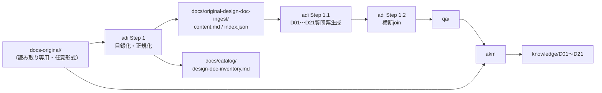

# Auto Design-doc Ingestion（ADI）ガイド

← [README](../README.md)

---

## 目次

- [対象読者](#対象読者)
- [前提](#前提)
- [次のステップ](#次のステップ)
- [概要](#概要)
- [Agent チェーン図（ADI）](#agent-チェーン図adi)
- [出力](#出力)
- [Step 構成](#step-構成)
- [前提条件](#前提条件)
- [完了条件](#完了条件)
- [利用手順（前提・操作・入出力・完了確認・失敗時対応）](#利用手順前提操作入出力完了確認失敗時対応)
- [CLI 例](#cli-例)
- [GUI 操作](#gui-操作)
- [`adi` と `akm` の関係](#adi-と-akm-の関係)
- [`adi` と設計ワークフロー（`ard` / `aas` / `adfd`）の関係](#adi-と設計ワークフローard--aas--adfdの関係)
- [カスタマイズ](#カスタマイズ)
- [セットアップ・トラブルシューティング](#セットアップトラブルシューティング)
- [既知の制約](#既知の制約)

---

## 対象読者

- 既存システムの設計書（Markdown / PDF / Office 等）を `docs-original/` に投入し、HVE の設計・実装ワークフローで活用したい担当者
- 大量の原本から、いま作ろうとしているアプリケーションに必要なものだけを選別したい担当者

## 前提

- Workflow ID / Prompt: `adi` / `Doc-OriginalInventory`（`hve/workflow_registry.py`）
- **ローカル実行専用**。GitHub Actions のワークフローファイルは持ちません（`ard` と同じ扱い）
- `docs-original/` は **読み取り専用**。CI ジョブ `check-docs-original` が変更を拒否します

## 次のステップ

- 生成した目録をもとに質問票を作る処理は、本ガイドの Step 1.1 / 1.2 に含まれます
- `knowledge/` への統合は [km-guide.md](./km-guide.md) を参照
- 取り込みが済んだら、標準の進行順（要求定義）は [01-business-requirement.md](./01-business-requirement.md) を参照

## 概要

ADI は `docs-original/` 配下の原本を **決定的に走査・正規化**し、機械可読な目録（`docs/original-design-doc-ingest/index.json`）と
人間可読な設計書インベントリ（`docs/catalog/design-doc-inventory.md`）を生成するワークフローです。

ADI は、従来別経路だった原本質問票生成も含め、次を一つのDAGで担います。

| 課題 | ADI の対応 |
|---|---|
| PDF / Word / Excel / PowerPoint / HTML が CLI 経路で読めない | [microsoft/markitdown](https://github.com/microsoft/markitdown) で Markdown へ変換 |
| 何が入っているか毎回 LLM が再発見する | `index.json` と目録を一度だけ生成 |
| 同じ資料が重複投入される | `sha256` による重複検出（`duplicate_of`） |
| 再実行のたびに全件を作り直す | `sha256` 一致時は派生物を再書き込みしない |

## Agent チェーン図（ADI）

以下の図は、このワークフローで使用される Prompt がファイルの入出力を介してどのように連鎖するかを示します。

> 他ワークフローのガイドは `users-guide/images/chain-*.svg` を参照しますが、
> **ADI 用の SVG は未生成**のため、ここでは Mermaid を直接掲載しています。

```mermaid
flowchart LR
  PRE["python -m hve ingest-docs<br/> （決定的前処理・Agent なし）"] --> IDX["docs/original-design-doc-ingest/index.json<br/>content.md / provenance.json"]
  IDX --> A1["Doc-OriginalInventory<br/>Step 1"]
  A1 --> INV["docs/catalog/<br/>design-doc-inventory.md"]
  IDX --> Q11["QA-DocConsistency<br/>Step 1.1（D01〜D21 fan-out）"]
  Q11 --> DQA["qa/D01〜D21-<br/>original-docs-questionnaire.md"]
  DQA --> Q12["QA-DocConsistency<br/>Step 1.2（join）"]
  Q12 --> CQA["qa/original-docs-<br/>cross-questionnaire.md"]
  INV --> A2["Doc-OriginalDocCard<br/>Step 2（文書単位 fan-out）"]
  CQA --> A2
  A2 --> CARD["docs/original-design-doc-ingest/&lt;slug&gt;/card.md"]
  CARD --> A3["Doc-OriginalTriage<br/>Step 3"]
  A3 --> CAT["docs/catalog/<br/>design-doc-catalog.md"]
  CAT --> A4["Doc-OriginalRouting<br/>Step 4"]
  A4 --> ROUTE["docs/catalog/<br/>design-doc-routing.md"]
  ROUTE --> A51["Doc-OriginalDownstreamSeed<br/>Step 5.1"]
  ROUTE --> A52["Doc-OriginalDownstreamSeed<br/>Step 5.2"]
  ROUTE --> A53["Doc-OriginalDownstreamSeed<br/>Step 5.3"]
  A51 --> S1["docs/catalog/<br/>use-case-skeleton.md"]
  A52 --> S2["docs/catalog/<br/>app-catalog.md 他 2 件"]
  A53 --> S3["docs/dataflow/<br/>dataflow-app-catalog.md"]
```



> [!IMPORTANT]
> **Step 1 の前処理は LLM を使いません。**
> 走査・`sha256` 算出・Markdown 変換・`index.json` 生成は Python（[hve/doc_ingest.py](../hve/doc_ingest.py)）が行います。
> Agent はその結果を人間可読な目録へ変換するだけです。
> これにより、同じ入力に対して常に同じ `index.json` が得られます（FR-WF-ADI-01）。

## 出力

| パス | 内容 | 生成 Step |
|---|---|---|
| `docs/original-design-doc-ingest/index.json` |  決定的な目録（`docs` / `excluded`） | 1 |
| `docs/original-design-doc-ingest/<slug>/content.md` | 正規化済み Markdown | 1 |
| `docs/original-design-doc-ingest/<slug>/provenance.json` | 変換来歴（`source_path` / `sha256` / `converter`） | 1 |
| `docs/catalog/design-doc-inventory.md` | 人間可読な設計書インベントリ | 1 |
| `qa/D01-original-docs-questionnaire.md` 〜 `qa/D21-original-docs-questionnaire.md` | D分類ごとの原本質問票（質問0件も有効） | 1.1 |
| `qa/original-docs-cross-questionnaire.md` | 21質問票の重複・矛盾・横断論点を統合した質問票 | 1.2 |
| `docs/original-design-doc-ingest/<slug>/card.md` | Doc Card（文脈カード） | 2 |
| `docs/catalog/design-doc-catalog.md` | トリアージ結果（must / should / may / out / excluded） | 3 |
| `docs/catalog/design-doc-routing.md` | 下流ワークフローへのルーティング表と依存図 | 4 |
| `docs/catalog/use-case-skeleton.md` | ARD 成果物への候補セクション追記 | 5.1 |
| `docs/catalog/app-catalog.md`<br/>`docs/catalog/domain-analytics.md`<br/>`docs/catalog/data-model.md` | AAS 成果物への候補セクション追記 | 5.2 |
| `docs/dataflow/dataflow-app-catalog.md` | ADFD 成果物への候補セクション追記 | 5.3 |

`<slug>` は `doc-0001-agelas10201` のような ASCII 安全な連番ディレクトリ名です。
日本語ファイル名は `index.json` の `source_path` に原文で保持されます。

## Step 構成

| Step | タイトル | Agent | fan-out |
|---|---|---|---|
| 1 | 原本インベントリ | `Doc-OriginalInventory` | なし |
| 1.1 | 原本質問票生成 | `QA-DocConsistency` | D01〜D21（21並列） |
| 1.2 | 原本質問票 join | `QA-DocConsistency` | なし |
| 2 | Doc Card 生成 | `Doc-OriginalDocCard` | 文書単位（`DOC-NNNN`） |
| 3 | 関連性トリアージ・カタログ統合 | `Doc-OriginalTriage` | なし |
| 4 | 下流ルーティング表 | `Doc-OriginalRouting` | なし |
| 5.1 | ARD 成果物への設計書由来候補の反映 | `Doc-OriginalDownstreamSeed` | なし |
| 5.2 | AAS 成果物への設計書由来候補の反映 | `Doc-OriginalDownstreamSeed` | なし |
| 5.3 | ADFD 成果物への設計書由来候補の反映 | `Doc-OriginalDownstreamSeed` | なし |

Step 1.1 の21子は同一waveで並列実行され、全件完了後にStep 1.2がjoinします。
Step 5.1 / 5.2 / 5.3 は書き込み先が重ならないため**並列実行**されます。

### トリアージの判定ラベル

| ラベル | 意味 | 下流での扱い |
|---|---|---|
| `must` | この文書なしでは目的の設計が成立しない | 全文を渡す |
| `should` | 目的に直接寄与するが、欠けても代替可能 | 全文を渡す（優先度低） |
| `may` | 背景・周辺情報 | Doc Card のみを渡す |
| `out` | 目的と無関係 | 渡さない。**除外理由を必ず記録** |
| `excluded` | 機械的に処理不能 | 人手対応リストへ |

> `--purpose` を省略した場合、**`must` は付与されません**（`should` / `may` / `out` の 3 値）。
> 目的が無い状態で「必須」とは判定できないためです。
>
> `must` の依存先（Doc Card の `depends_on` / `depended_by`）は自動的に `should` へ昇格されます。

## 前提条件

- `docs-original/` に 1 件以上のファイルが配置されていること
- 対応拡張子: `.md` / `.markdown` / `.txt` / `.csv`（標準ライブラリ）、
  `.html` / `.htm` / `.docx` / `.pdf` / `.xlsx` / `.xls` / `.pptx`（`gui-docconvert` extras の markitdown）
- 上記以外（`.drawio` / `.vsdx` / 画像 / `.zip` 等）は **`excluded`** として理由付きで記録されます

## 完了条件

- `python -m hve ingest-docs` が終了コード 0 で完了している
- `docs/catalog/design-doc-inventory.md` が生成されている（第 1 列が `doc_id`）
- `qa/D01〜D21-original-docs-questionnaire.md` の21ファイルと `qa/original-docs-cross-questionnaire.md` が生成されている
- 質問が0件の質問票は、サマリーに `総質問数: 0` と `質問なし` の両方がある
- Step 5.x の反映先 5 ファイルに `## 設計書由来の候補（ADI）` セクションがある（0 件の場合も `なし` と明記）
- 候補行に出典 `doc_id` があり、採番済み ID が含まれていない
- `docs-original/` 配下に変更が無い

## 利用手順（前提・操作・入出力・完了確認・失敗時対応）

| 軸 | 内容 |
|---|---|
| **前提** | `docs-original/` に 1 件以上のファイルがあること。PDF / Office を扱う場合は `pip install -e .[gui-docconvert]` が済んでいること。GitHub Copilot が有効なこと |
| **操作** | CLI: `python -m hve orchestrate --workflow adi --purpose "<目的>"`。GUI: Step 1 で `adi`（**既存ドキュメントのインポート** カテゴリ）を選び、Step 2 の「ADI 固有」枠に目的を入力する。**Cloud（Issue Template）経路は未対応** |
| **入力** | `purpose`（任意）/ `target_scope`（既定 `docs-original/`）/ `depth`（`standard` / `lightweight`）/ `focus_areas`（任意）/ `docs-original/` 配下の原本（読み取り専用） |
| **出力** | 上記「出力」のファイル群（`index.json` / `content.md` / 原本質問票22ファイル / `card.md` / 目録 / カタログ / ルーティング表） |
| **完了確認** | `qa/original-docs-cross-questionnaire.md` とD01〜D21の21質問票がそろい、`docs/catalog/design-doc-routing.md` まで生成されていること。`design-doc-catalog.md` の件数サマリ（must / should / may / out / excluded）の合計が目録の総数と一致していること。`git status` で `docs-original/` に変更が無いこと |
| **失敗時対応** | まず `python -m hve ingest-docs` を単体で実行して前処理だけを切り分ける（Agent を起動しないので安価）。除外・変換失敗は下記「セットアップ・トラブルシューティング」を参照。共通の切り分けは [troubleshooting.md](./troubleshooting.md) |

> `docs-original/` は**読み取り専用**です。ADI は読むだけで変更しません（CI ジョブ `check-docs-original` が変更を拒否します）。

### 初回実行の推奨手順

1. 設計書を `docs-original/` に配置します（サブディレクトリ可）。
2. **まず前処理だけ**を実行します: `python -m hve ingest-docs`。
   ここで除外・重複の件数が分かるので、原本の問題を先に直せます。
3. 問題がなければワークフロー全体を実行します。
4. `docs/catalog/design-doc-inventory.md` の「除外一覧」を確認します。
   変換できなかったファイルは Markdown / PDF へ書き出し直して再投入してください。
5. `docs/catalog/design-doc-catalog.md` の「対象外（out）」を目視で確認します。
   除外理由に納得できない文書があれば、`--purpose` を書き直して再実行します。

## CLI 例

```bash
# 目的を指定して実行（推奨）
python -m hve orchestrate --workflow adi --purpose "EC 倉庫の取り置き算出バッチを再構築する"

# 目的を指定せずに実行（何があるかをまず把握したい場合）
python -m hve orchestrate --workflow adi

# 原本質問票の対象範囲・分析深さ・重点観点を指定
python -m hve orchestrate --workflow adi \
  --target-scope docs-original/subsystem/ \
  --depth lightweight \
  --focus-areas "データ整合性、冪等性"

# 前処理だけを単体で実行する（Agent を起動しない）
python -m hve ingest-docs
python -m hve ingest-docs --source-dir docs-original --out-dir docs/original-design-doc-ingest
```

`--purpose` は**任意**です。省略した場合、ADI は目的非依存モードで動作します。
`--target-scope` は `/` 区切りの `docs-original/` 配下だけを受け付け、実行前に正規化・検証されます。

## GUI 操作

1. Step 1 でワークフロー `adi`（**既存ドキュメントのインポート** カテゴリ）を選択します。
2. Step 1右ペインの「ADI 固有」枠で **選別の目的** / **対象設計書フォルダ** / **分析の深さ** / **分析の観点** を設定します。
3. 実行します。

## `adi` と `akm` の関係



- 原本質問票生成と横断joinはADI Step 1.1 / 1.2のmain成果物です。独立したWorkflow ID、Cloud Issue Template、後方互換aliasはありません。
- Step 1.1 / 1.2は後段Step 4のrouting表を参照せず、Step 1が生成した `index.json` と正規化済み `content.md` を入力にします。
- `akm` は `docs/catalog/design-doc-routing.md` が存在する場合、「D分類別の担当文書」節を優先します。存在しない場合は従来どおり `docs-original/` を走査します。
- `docs/original-design-doc-ingest/` は `docs/` 配下のため `mdq`（BM25 全文検索）の索引対象に含まれ、
  正規化済み Markdown と Doc Card は `python -m mdq search` から検索できます。

## `adi` と設計ワークフロー（`ard` / `aas` / `adfd`）の関係

Step 5.1 / 5.2 / 5.3 は、下流ワークフローの**最上流 Step の成果物**に「設計書由来の候補」セクションを追記します。

| Step | 反映先 | その成果物を確定させる下流 Step |
|---|---|---|
| 5.1 | `docs/catalog/use-case-skeleton.md` | ARD Step 3.1 |
| 5.2 | `docs/catalog/app-catalog.md` | AAS Step 1 |
| 5.2 | `docs/catalog/domain-analytics.md` | AAS Step 3.1 |
| 5.2 | `docs/catalog/data-model.md` | AAS Step 4.1 |
| 5.3 | `docs/dataflow/dataflow-app-catalog.md` | ADFD Step 0.2 |

> [!IMPORTANT]
> **ADI は ID を採番しません。**
> `APP-` / `UC-` / `SVC-` などの識別子は下流ワークフローが採番します。ADI が先に振ると採番が衝突するため、候補は**名称と根拠と出典だけ**を持ちます。
> この制約は [hve/artifact_validation.py](../hve/artifact_validation.py) の `validate_downstream_seed_section` が機械検証します。

> [!IMPORTANT]
> **ADI は下流ワークフローを自動起動しません。**
> 候補セクションを書くところまでが ADI の責務です。`ard` / `aas` / `adfd` はご自身で実行してください。

### 既存成果物がある場合

対象ファイルが既にある場合、ADI は**全文を読んでから**候補セクションのみを追記します。既存の表・本文・見出しは変更しません。既に本表に載っている実体と重複する候補は追加せず、除外件数を完了報告に記録します。

> [!WARNING]
> **前提成果物チェックが「あり」と判定するようになります。**
> HVE は下流 Step の前提成果物を**ファイルの存在有無**だけで判定します（[hve/orchestrator.py](../hve/orchestrator.py) の `check_step_input_artifacts`）。
> ADI が `app-catalog.md` などを新規作成すると、中身が候補セクションだけでも「成果物あり」と判定されるため、**AAS を実行していないのに AAD-WEB の前提チェックが通ってしまいます**。
> ADI の後は、設計ワークフロー（ARD / AAS / ADFD）を必ず実行して本表を確定させてください。

### 候補セクションの形式

```markdown
## 設計書由来の候補（ADI）

> 下流ワークフローが正式 ID を採番して本表へ統合する。ADI は ID を採番しない。

| 候補 | 根拠 | 出典 doc_id | 出典パス |
| --- | --- | --- | --- |
| EC 倉庫取り置き算出 | 取り置き必要数の算出処理が独立して記述されている | DOC-0028 | docs/original-design-doc-ingest/doc-0028-x/content.md |
```

候補が 0 件の場合も、セクションを省略せず `なし` と明記します。

### 対象外のワークフロー

`aad-web` / `asdw-web` / `adfdv` / `aar` の成果物は生成しません。

- `aad-web` は成果物のファイル名に APP-ID を含む（`screen-catalog-<APP-ID>.md`）ため、`app-catalog.md` が確定するまで書き出し先が決まりません。
- `asdw-web` / `adfdv` / `aar` の成果物は `src/` のコード・Azure スクリプト・デプロイ設定が中心で、TDD RED→GREEN と Azure 公式情報に基づいて生成する契約です。旧設計書から生成すると根拠のない実装・サービス選定になります。

## カスタマイズ

| 変えたいもの | 設定の正本（ここだけを編集する） | 拡張手順 | 回帰検証 |
|---|---|---|---|
| Step 構成・依存・出力パス・fan-out | `hve/workflow_registry.py` の `adi` 定義 | `required_input_paths` を変えたら `.github/io-contracts/Doc-Original*--adi--*.yaml` の `agent_artifact` を 1:1 で揃える | `python -m pytest hve/tests/test_adi.py hve/tests/test_workflow_registry.py -q` と `python .github/scripts/validate-io-contract.py` |
| 取り込み対象の拡張子・上限件数 | `hve/doc_ingest.py`（`MAX_DOCS`、`_PASSTHROUGH_EXTS` / `_STDLIB_EXTS`）と `hve/gui/doc_convert.py`（`supported_extensions`） | 対応拡張子を増やす場合は `doc_convert` 側の変換経路を先に実装する | `python -m pytest hve/tests/test_doc_ingest.py hve/tests/test_gui_doc_convert.py -q` |
| 目録のテーブル形式 | `.github/prompts/Doc-OriginalInventory.prompt.md` の §3 | **第 1 列の `doc_id` は変えない**（fan-out キー抽出の前提） | `python -m pytest hve/tests/test_catalog_parsers_design_doc.py -q` |
| トリアージの判定基準・節名 | `.github/prompts/Doc-OriginalTriage.prompt.md` の §3 / §5 | 節見出しの英字ラベル（`must` / `out`）は検証関数が節を特定する手掛かりなので**変えない** | `python -m pytest hve/tests/test_adi_validation.py -q` |
| Doc Card の属性項目 | `.github/prompts/Doc-OriginalDocCard.prompt.md` の §3 | 必須キーを増やす場合は `hve/artifact_validation.py` の `_DESIGN_DOC_CARD_REQUIRED_KEYS` と対で更新する | `python -m pytest hve/tests/test_adi_validation.py -q` |
| Step 本文テンプレート | `.github/scripts/templates/adi/step-1.md` / `step-1.1.md` / `step-1.2.md` / `step-2.md` 〜 `step-5.3.md`、fan-out共通は `hve/prompt/fanout/adi/_common.md` / `_questionnaire.md` | 出力先パスの表記を変えるときはregistryの `output_paths` / `output_paths_template` と揃える | `python -m pytest hve/tests/test_template_engine.py hve/tests/test_prompts.py -q` |
| 原本質問票の形式・検証 | `.github/prompts/QA-DocConsistency.prompt.md` / `.github/io-contracts/QA-DocConsistency--adi--1.1.yaml` / `--adi--1.2.yaml` / `hve/artifact_validation.py` | H1、0件明示、D01〜D21とjoinのパスを同時に更新する | `python -m pytest hve/tests/test_adi_validation.py hve/tests/test_orchestrator.py::TestAdiQuestionnairePostDag -q` |
| AKM への接続方法 | `hve/prompt/fanout/akm/_common.md` | 「ルーティング表が無ければ従来どおり」の後方互換規定を残す | `python -m pytest hve/tests/test_adi_downstream_contract.py -q` |

**互換性・安全性で壊してはならない境界**

- `docs-original/` を変更しない（読み取り専用。CI ジョブ `check-docs-original` が拒否する）。
- 目録の**第 1 列は `doc_id`**。`hve/catalog_parsers.py` の `parse_design_doc_inventory` がここから fan-out キーを抽出する。
- カタログから文書を**消さない**。`out` も含めて全件をいずれかの節に載せる（無言の除外は後から監査できない）。
- 派生物の出力先を `docs/` の外へ戻さない。`docs/` 配下であることで `mdq.toml` の `[index].roots` / `.github/scripts/hve_scope.py` の版管理対象外リスト / GUI の `explorer_roots` の 3 箇所へ個別登録せずに済む。
- AKM との接続は **soft 依存**。ルーティング表が無い環境でも従来どおり動くことを崩さない。

## セットアップ・トラブルシューティング

共通手順は [hve-cli-getting-started.md](./hve-cli-getting-started.md) / [hve-gui-getting-started.md](./hve-gui-getting-started.md) を参照してください（ADI は Cloud 未対応のため `hve-cloud-getting-started.md` は対象外）。

PDF / Word / Excel / PowerPoint / HTML を取り込む場合は、`markitdown` を含む extras が必要です。

```bash
pip install -e .[gui-docconvert]
```

（`hve/setup-hve.ps1` / `hve/setup-hve.sh` をオプション無しで実行していれば、既に導入済みです）

| 症状 | 原因 | 対処 |
|---|---|---|
| `未対応の拡張子です: .drawio` | 変換対象外の形式 | PNG / SVG / PDF へエクスポートして再投入する（画像自体は現時点で未対応。下記「既知の制約」参照） |
| `変換失敗 (.pdf): ...` | `markitdown` 未インストール | 上記の `pip install -e .[gui-docconvert]` を実行する |
| `ファイル数 N が上限 200 を超えています` | 原本が多すぎる | 原本をサブセットに分けて実行する（fail-closed のため目録は書かれません） |
| 目録の件数が原本より多い | 同一ファイルがサブディレクトリに重複配置されている | 「重複一覧」で `duplicate_of` を確認し、原本側を整理する |
| `must` が 1 件も付かない | `--purpose` を省略している | 目的を指定して再実行する（仕様として目的なしでは `must` を付与しません） |
| 再実行しても成果物が更新されない | 原本の `sha256` が前回と同一 | 仕様どおりの差分スキップです。強制的に作り直すに は `docs/original-design-doc-ingest/` を削除してから実行する |

## 既知の制約

- **図の取り込みは未対応**です。画像ファイル（`.png` / `.jpg` / `.svg` 等）は現時点で `excluded` になります。
- **Cloud（GitHub Actions）実行は未対応**です。`python -m hve orchestrate --workflow adi` によるローカル実行のみ提供します。
- 変換は `markitdown` の `convert_local()` のみを使用します（URL / ストリーム経路は使いません）。
  なお PDF や Office のテキスト抽出はローカルで完結しますが、**Agent が `content.md` を読む時点で内容は Copilot へ送信されます**。
  機密資料を扱う場合はこの点を確認してください。
- 派生物は `docs/` 配下に置かれるため、**`--self-improve-target-scope "*"` の走査対象に含まれます**（`hve/config.py` の `SELF_IMPROVE_WILDCARD_PATHS` に `docs` が含まれるため）。原本の件数が多い場合は `*` ではなく具体的なパスを指定してください。
- 同じ理由で、ADI 実行後は `docs/` 配下のファイル数が原本の件数分だけ増えます。`docs/` は `.gitignore` 対象外のため、コミットすると差分が大きくなります。
