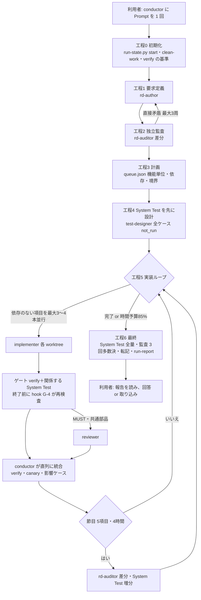

# 1. 仕組みの全体像

## 1.1 何を解決するのか

複数の AI エージェントが要求定義・実装・テストを繰り返すと、次のことが起きやすくなります（計画書 §3・§4）。

- 実装の途中で要求が書き換えられ、承認していない内容が「承認済み」になる。
- 離れた要求どうしの矛盾が、書いた本人の点検では見つからない。
- テストを実装に合わせて直し、要求の意味が変わる（実装の誤りが正解になる）。
- 並行作業で ID や意味が衝突する。
- 監査結果やログがチャットで消える。

conductor toolkit は、これを **役割の分離・強制ゲート・決定的スクリプト・状態ファイル** で防ぎます。

## 1.2 構成（§7.1）

```text
.github/
  agents/        conductor（進行役）と 5 つの作業役の定義（*.agent.md）
  skills/        手順書。必要な工程の作業役だけが読み込む（Token を節約）
                 requirement-definition / implement-fr / system-test-increment / rd-audit
  hooks/         quality-gates.json … 全エージェント共通の強制ゲート（G-1〜G-6）
  prompts/       build.prompt.md … 利用者が書く依頼の雛形（VS Code の /build）
  workflows/     hve-verify.yml … GitHub Actions で verify を再実行（外部での再確認）
scripts/         決定的スクリプト（Python 3.9 以上、標準ライブラリだけ）
  verify.py / verify.ps1 / verify.sh   L1 検査（CHK-01〜23）＋ビルド・テスト
  rdcheck.py  next-id.py  ledger.py  select-tests.py  summarize.py  clean-work.py  run-state.py
  hooks/gate.py   hook の本体
  hve.config.json 設定（検証コマンド、モデル、ゲート、保持期間）
docs/            永続の文書（git で管理）
  requirements-definition.md  catalog.md  id-registry.md  run-history.md
tests/system/ledger.json      System Test の台帳（永続）
work/            一時ファイル（.gitignore。14 日で削除）
  current-run.txt  runs/<run-id>/{meta.json, queue.json, progress.md, run-report.md, results.json, logs/, evidence/, audit/}
  worktrees/<run-id>-<item>/  作業役ごとの git worktree（統合後に削除）
```

常時読み込まれる指示（`AGENTS.md`、`.github/copilot-instructions.md`）は数行だけにしています。長い手順は skills に置き、担当の作業役が必要なときだけ読みます（§7.1、R-21、R-22）。

## 1.3 役割（§7.2）

| エージェント | 役割 | 書き込める範囲（hook で強制） | 読み込む skill |
|---|---|---|---|
| **conductor** | 計画、振り分け、統合、ゲートの判定、報告。小さな作業は自分で行う | `work/` と `docs/run-history.md` だけ | なし（本文だけ） |
| **rd-author** | 要求定義書・カタログの作成と更新、質問票、決定記録。**要求の唯一の書き手** | `docs/`（run-history を除く） | requirement-definition |
| **rd-auditor** | 意味の監査（矛盾・目的との整合・記述の質）。rd-author と別系統のモデル | `work/` だけ（読み取り専用） | rd-audit |
| **test-designer** | 受入基準から System Test と台帳のケースを、**実装より前に**作る | `tests/system/`（台帳は ledger.py 経由） | system-test-increment |
| **implementer** | 1 項目（要求 1〜3 個）を専用の worktree で実装し、単体・結合テストとカタログの行を書く | 自分の worktree（要求定義書・System Test は不可） | implement-fr |
| **reviewer** | 差分と受入基準の照合。MUST と共通部品の変更にだけ使う | なし（読み取り専用） | なし |

## 1.4 1 回の実行の流れ（§7.3）



- **品質の土台（工程 1〜2）**: 実装の前に、要求定義書の直接矛盾を 0 件にします。利用者の判断が要るものは質問票に挙げ、関係する受入基準を BLOCKED にして先に進みます。
- **テストを先に（工程 4）**: test-designer は要求定義書だけから期待値を決めます。実装を正解にしないためです（テストオラクル問題、R-7）。
- **1 項目ずつ・並行（工程 5）**: 依存がなく、同じ共通部品・テーブル・境界を触らない項目だけを並行します。統合は 1 本ずつ直列に行い、そのたびに verify と canary を実行します。
- **最終（工程 6）**: System Test の全量と、rd-auditor の全量監査（3 回の多数決）を行い、残すべき情報を `/docs` と台帳に転記してから報告します。

## 1.5 2 重のゲート（§7.4、§10）

| 層 | 仕組み | いつ効くか | 例 |
|---|---|---|---|
| hook | `.github/hooks/quality-gates.json` → `scripts/hooks/gate.py` | ツールを実行する**前**と、作業役・進行役が**終わる前** | 要求定義書を rd-author 以外が編集しようとしたら拒否（G-1）。implementer が終わる前に verify を実行し、失敗なら差し戻す（G-4） |
| verify | `scripts/verify.py`（CHK-01〜23） | 作業役のゲート、統合のたび、CI | 台帳のケースが理由なく削除された（CHK-12）。AC の本文が変わったのに台帳が古い（CHK-11） |

hook は VS Code ではプレビューで、harness によって動きが違うことがあります。そのため同じ規則を verify でも検査し、hook が効かない場合でも統合の時点で必ず止まるようにしています（R-23）。詳細は [09-quality-gates.md](09-quality-gates.md)。

## 1.6 状態ファイルと再開（§7.5）

会話の要約（compaction）には頼りません。状態は次のファイルと git にあります。

- `work/current-run.txt`: 実行中の run-id
- `work/runs/<run-id>/meta.json`: 開始時刻、run_options、工程、統合ブランチ
- `work/runs/<run-id>/queue.json`: 作業キュー（項目ごとの要求 ID、AC、境界、依存、状態、試行回数、ブランチ）
- `work/runs/<run-id>/progress.md`: 工程・判断・残課題（1 項目 3 行以内）

新しい文脈では、conductor が `python scripts/run-state.py start`（実行中なら `RESUME` と状態を表示）から再開します。止まったら、同じセッションで「続けて」と送るか、新しいセッションで同じ Prompt を送れば続きから再開します。

## 1.7 置き場所の原則（§7.6）

| 置き場所 | 置くもの | git | 保持 |
|---|---|---|---|
| `/docs` | 要求定義書、カタログ、ID 台帳、実行履歴 | 管理する | 永続 |
| `tests/system/ledger.json` | System Test のケースと最新の状態 | 管理する | 永続 |
| `/work` | キュー、進捗、報告、結果、証跡、監査の生データ、ログ、worktree | 管理しない | 14 日 |

`/work` が消えても、要求・判断・品質の状態は `/docs` と台帳だけでたどれるように、工程 6 で転記します。

## 1.8 Token を最小にする工夫（§11）

| 工夫 | 実装 |
|---|---|
| 長い手順書を必要な作業役だけが読む | `.github/skills/`（約 100KB の原本 3 本を skill 化） |
| 機械的な検査・採番・台帳・要約をスクリプトで行う | `scripts/*.py`。LLM には要約だけを渡す（`summarize.py`、`verify.py` の短い出力） |
| 必要な節だけ読む | `rdcheck.py show FR-012 AC-031` |
| 工程ごとに新しい文脈から再開 | `run-state.py status` と progress.md |
| テストは影響範囲だけ、全量は節目と最終だけ | `select-tests.py`、`ledger.py run --select changed` |
| 多数決の監査は最終だけ | 節目は runs: 1、最終は runs: 3 |
| 作業役のモデルを難しさで振り分け、失敗したときだけ上げる | `scripts/hve.config.json` の `models`（[07-customization.md](07-customization.md)） |
