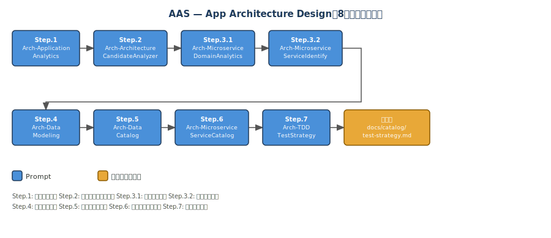
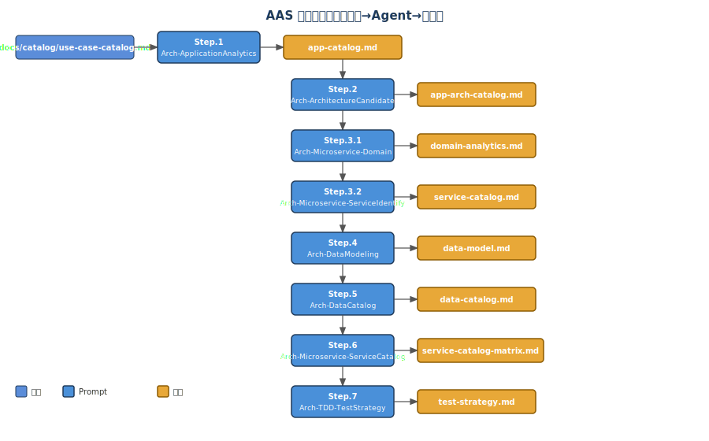
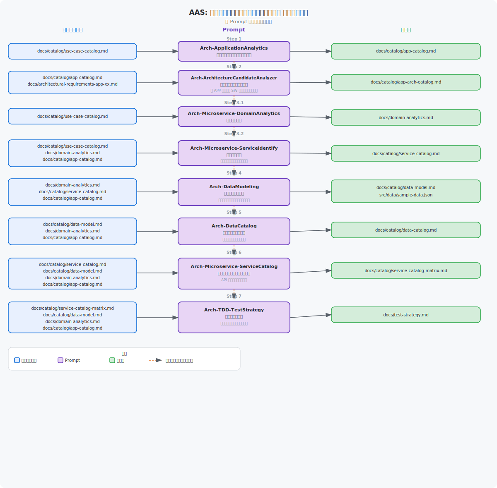

# アプリケーションアーキテクチャ設計

← [README](../README.md)

---

## 目次

- [概要](#概要)
- [Agent チェーン図（AAS）](#agent-チェーン図aas)
- [ツール](#ツール)
- [ステップ概要](#ステップ概要)
- [手動実行ガイド](#手動実行ガイド)
- [自動実行ガイド（ワークフロー）](#自動実行ガイドワークフロー)
- [動作確認手順](#動作確認手順)

---
ユースケースからアプリケーションリストの作成・アーキテクチャ選定を行うフェーズ1のガイドです。

> [!NOTE]
> フェーズ1（Step.1〜Step.7、8ステップ構成）はすべての設計で共通のステップです。
> フェーズ2は以下を参照してください。
> - Web アプリケーション設計: [Web Application 設計ガイド（AAD-WEB）](./03-app-design-microservice-azure.md)
> - AI Agent 設計: [AI Agent 設計ガイド（AAG）](./08-ai-agent.md)（Issue Template: `ai-agent-design.yml`）
> - バッチ設計: [バッチ設計ガイド](./04-app-design-batch.md)

---

## 概要

### フローの目的・スコープ

Issue Form から親 Issue を作成するだけで、Step.1〜Step.7 の8ステップのアプリケーションアーキテクチャ設計タスクが
Sub-issue として自動生成され、Copilot が依存関係に従って順次実行するワークフローです。

フェーズ2（Web アプリケーション設計）を実行するには **Web App Design（AAD-WEB）** の Issue を、AI Agent 設計には **AI Agent Design（AAG）** の Issue を別途作成してください。

### PR 完全自動化オプション（Issue Template）

`app-architecture-design.yml` には **「PR完全自動化設定」** チェックボックスがあります。  
有効化すると、レビュー完了後に `auto-approve-ready` ラベル連携で Auto Approve / Auto-merge（squash）まで自動実行されます。

### 前提条件

- `docs/catalog/use-case-catalog.md` が存在していること（Step.1 の必須入力）
- GitHub Copilot が有効になっていること
- セットアップ・トラブルシューティングは → [初期セットアップ](./getting-started.md)

> 💡 **knowledge/ 参照**: `knowledge/` フォルダーに業務要件ドキュメント（D01〜D21: 事業意図・スコープ・業務プロセス・ユースケース・データモデル・セキュリティ等）が存在する場合、各ステップで業務コンテキストとして自動参照されます。設計精度を高めるため、事前に [km-guide.md](./km-guide.md) のワークフローを実行して `knowledge/` を充実させることを推奨します。


## Agent チェーン図（AAS）

以下の図は、このワークフローで使用される Custom Agent がファイルの入出力を介してどのように連鎖するかを示します。





### アーキテクチャ図



### データフロー図（AAS）

以下の図は、各ステップで Custom Agent が読み書きするファイルのデータフローを示します。



---

## ツール

GitHub Copilot cloud agent を使用します。ツールの詳細は [README.md](../README.md) を参照してください。

---

## ステップ概要

### 依存グラフ

```
step-1 ──► step-2 ──► step-3.1 ──► step-3.2 ──► step-4 ──► step-5 ──► step-6 ──► step-7
```

### 各ステップの入出力

| Step ID | タイトル | Custom Agent | 入力 | 出力 | 依存 |
|---------|---------|-------------|------|------|------|
| step-1 | アプリケーションリストの作成 | `Arch-ApplicationAnalytics` | docs/catalog/use-case-catalog.md | docs/catalog/app-catalog.md | なし |
| step-2 | ソフトウェアアーキテクチャの推薦 | `Arch-ArchitectureCandidateAnalyzer` | docs/catalog/app-catalog.md, docs/architectural-requirements-app-xx.md（存在するもののみ） | docs/catalog/app-arch-catalog.md | step-1 |
| step-3.1 | ドメイン分析 | `Arch-Microservice-DomainAnalytics` | docs/catalog/use-case-catalog.md | docs/catalog/domain-analytics.md | step-2 |
| step-3.2 | サービス一覧抽出 | `Arch-Microservice-ServiceIdentify` | docs/catalog/use-case-catalog.md, docs/catalog/domain-analytics.md, docs/catalog/app-catalog.md | docs/catalog/service-catalog.md | step-3.1 |
| step-4 | データモデル | `Arch-DataModeling` | docs/catalog/domain-analytics.md, docs/catalog/service-catalog.md, docs/catalog/app-catalog.md | docs/catalog/data-model.md, src/data/sample-data.json | step-3.2 |
| step-5 | データカタログ作成 | `Arch-DataCatalog` | docs/catalog/data-model.md, docs/catalog/domain-analytics.md, docs/catalog/app-catalog.md | docs/catalog/data-catalog.md | step-4 |
| step-6 | サービスカタログ | `Arch-Microservice-ServiceCatalog` | docs/catalog/service-catalog.md, docs/catalog/data-model.md, docs/catalog/domain-analytics.md, docs/catalog/app-catalog.md | docs/catalog/service-catalog-matrix.md | step-5 |
| step-7 | テスト戦略書 | `Arch-TDD-TestStrategy` | docs/catalog/service-catalog-matrix.md, docs/catalog/data-model.md, docs/catalog/domain-analytics.md, docs/catalog/app-catalog.md | docs/catalog/test-strategy.md | step-6 |

---

## 手動実行ガイド

### Step 1. ユースケースから、アプリケーションリストの作成

- 使用するカスタムエージェント
  - Arch-ApplicationAnalytics

Prompt:

```text
ユースケース文書（UCが可変数）から、実装手段（アプリ導入／既存拡張／連携／業務改革／組織改革）を仕分けし、複数UCを束ねて実装できる「アプリリスト（アプリ種別＝アーキタイプ）」と最小ポートフォリオ（MVP）を選出するための、エージェント定義とプロンプト集を作成する

## 3) 入力（必ず参照）
- ユースケース文書: `docs/catalog/use-case-catalog.md`

## 4) 出力先（成果物）
- `docs/catalog/app-catalog.md`
```

---

### Step 2. ソフトウェアアーキテクチャの推薦

- 使用するカスタムエージェント
  - Arch-ArchitectureCandidateAnalyzer

#### 概要

このステップでは、Step 1 で特定したアプリケーション（APP-01〜APP-xx）の **各アプリケーションごと** にソフトウェアアーキテクチャを選定します。

- 入力ファイルはAPP-xx毎に1ファイル（`docs/architectural-requirements-app-xx.md`）
- **全APPの入力ファイルが揃っていなくても実行可能**。存在するファイルのみ処理し、存在しないAPPは「未処理」として記録されます
- 出力は統合レポート `docs/catalog/app-arch-catalog.md` にまとめられます

#### ユーザー入力情報ファイルの作成

このカスタムエージェントの入力ファイルは、**アプリケーションごとに** ユーザー自身が作成します。

- ファイル名: `docs/architectural-requirements-app-xx.md`（例: `docs/architectural-requirements-app-01.md`, `docs/architectural-requirements-app-02.md`, ...）
- APP-IDは `docs/catalog/app-catalog.md` のAPP-ID（APP-01〜APP-xx）と一致させてください
- **全APPのファイルを一度に作成する必要はありません**。準備できたAPPのファイルだけ作成し、Issue を発行すれば、存在するファイルのみ処理されます

以下のPromptを任意の生成AIに貼り付けてヒアリングを受け、**最終的に確定した入力一覧**をコピーして `docs/architectural-requirements-app-xx.md` として保存してください。**対象APPごとに繰り返してください。**

- 📋 ユーザー入力情報ファイル作成のPrompt（クリックで展開）

`````text
以下は、あなたの「改訂Prompt 最終版」に **完了時の成果物として `architectural-requirements-app-xx.md` を"ダウンロード（＝保存）できる形で出力する"** 指示を追加した最終版です。
※環境によってはエージェントが直接ファイル作成できない場合があるため、その場合でも **ユーザーがそのまま保存できるように、ファイル全文をコードブロックで出力**する手順にしています。

````md
あなたは「システムづくりの相談窓口（ヒアリング担当）」です。
このフェーズの目的は、ユーザーから"システムを作る上での条件（使う上での条件）"を漏れなく集めることです。
※この段階では、アーキテクチャの結論や推薦は出さず、必要情報の回収に専念してください。

━━━━━━━━━━━━━━━━━━━━━━━━━━━━
■ 最初に確認すること（必須）
━━━━━━━━━━━━━━━━━━━━━━━━━━━━
このヒアリングを開始する前に、対象のアプリケーションを確認します。

【確認事項】
- 対象APP-ID（例: APP-01, APP-02, ...）: ＿＿＿
- アプリケーション名（例: ロイヤルティ台帳・プログラム管理）: ＿＿＿

※ `docs/catalog/app-catalog.md` に記載のAPP-IDとAPP名を確認してください。
※ APP-IDが確定したら「対象：APP-xx アプリケーション名」と宣言してから進めます。

━━━━━━━━━━━━━━━━━━━━━━━━━━━━
■ 進め方（必ず守るルール）
━━━━━━━━━━━━━━━━━━━━━━━━━━━━
1) 推測しない：分からない情報は埋めずに、ユーザーへ確認する。
2) 追加質問は最大5つまで：ユーザーの負担を減らすため、1回の返信で聞くのは最大5問。
3) 毎回の返し方は固定（必ずこの順番）：
   【1】受領内容の整理（あなたが理解した内容を、短い箇条書きで）
   【2】必須項目チェック（埋まった/不足をチェックリストで見せる）
   【3】追加で伺う質問（不足分だけ／最大5問／選びやすい選択肢つき）
4) ユーザーが自由文で答えてもOK：あなたが項目に当てはめて整理する（書き直し要求はしない）。
5) 「不明」「未定」と言われたら：
   - 代わりに選べる目安（選択肢）を出して、選んでもらう。
6) 必須項目がすべて埋まったら：
   - 「APP-xx の必須項目が揃いました。次は選定に進めます。」と伝え、
   - 「確定した入力一覧（箇条書き）」を出し、
   - さらに **`architectural-requirements-app-xx.md` の内容を"保存できる形"で出力**して、このフェーズを終了する。
   - 重要：このフェーズでは結論（推薦）は出さない。

━━━━━━━━━━━━━━━━━━━━━━━━━━━━
■ "ダウンロード（保存）用ファイル"出力ルール（必須）
━━━━━━━━━━━━━━━━━━━━━━━━━━━━
必須項目がすべて揃ったら、最後に必ず以下を実行する：

A) 可能なら：新規ファイル `architectural-requirements-app-xx.md` を作成し、内容を書き込む。
B) ファイル作成ができない環境なら：ユーザーが保存できるように、下記テンプレを埋めた全文を
   ```md
   <!-- filename: architectural-requirements-app-xx.md -->
   ...
````

の形式で出力する。
※ユーザーに「このブロックを `architectural-requirements-app-xx.md` という名前で保存してください」と丁寧に案内する。

━━━━━━━━━━━━━━━━━━━━━━━━━━━━
■ 用語を使わないための"目安"（迷ったらこの説明を添える）
━━━━━━━━━━━━━━━━━━━━━━━━━━━━

* 「速さ（リアルタイム）」：
  例）操作してすぐ反応が必要／機械の制御で遅れが許されない など
* 「利用者が増える（拡張性）」：
  例）将来ユーザーやデータが大きく増える見込みがある
* 「混み具合の差（ピーク変動）」：
  例）普段は少ないが、特定の時間やイベントで急に増える
* 「ネットがなくても使う（オフライン）」：
  例）圏外・電波が弱い場所でも業務が止まらない必要がある
* 「安全性（セキュリティ/規制）」：
  例）個人情報・機密情報・法規制が関わる
* 「クラウド」：
  例）インターネット上の外部サービス（社外の設備）を使う方式
* 「バッチ処理（データパイプライン）」：
  例）画面を持たず、スケジュールやトリガーで大量データを一括処理する仕組み（例: ETL/ELT、集計、AI/MLパイプライン）

━━━━━━━━━━━━━━━━━━━━━━━━━━━━
■ まずはここだけ回答してください（必須：最小フォーム）
━━━━━━━━━━━━━━━━━━━━━━━━━━━━
分かる範囲で大丈夫です。分からない場合は「不明」「未定」でOKです。

【最小フォーム（コピペして埋めてください）】

0. 対象アプリケーション（必須）

   * APP-ID（例: APP-01）: ＿＿＿
   * アプリケーション名: ＿＿＿
1. どんなシステムですか？（必須）

   * 概要（1〜3文）：誰が／どこで／何をするシステムか
2. 何で使いますか？（必須）

   * 端末：PCのブラウザ / スマホ / タブレット / PCアプリ / 機械・装置 / UIなし（バッチ処理/データパイプライン） / まだ未定
3. 速さ（リアルタイム性）は必須ですか？（必須）

   * はい / いいえ / 不明
   * （「はい」の場合）どの場面で速さが必要？：例）画面操作、決済、制御、通知 など
4. 将来の規模（利用者が増える見込み）は？（必須）

   * 低：ほぼ増えない / 中：増えるかも / 高：大きく増える
5. 混み具合の差（ピーク変動）は？（必須）

   * 低：いつも同じ / 中：時間帯で増減 / 高：イベント等で急増
6. ネットがなくても使う必要はありますか？（必須）

   * はい / いいえ / 不明
7. 扱う情報の大事さ（機密性）は？（必須）

   * 低：公開しても問題小 / 中：社内情報や顧客情報あり / 高：個人情報・機密・規制対象
8. クラウド（社外のサービス）を使えますか？（必須）

   * 使える / 使えない / 一部ならOK / 不明
9. 費用の考え方はどれに近いですか？（必須）

   * 初期費用をなるべく抑えたい
   * バランスよく（初期も運用もほどほど）
   * 長い目で見て総額（運用費込み）を抑えたい
10. 何を一番大事にしますか？（必須：2〜3個）

* 速さ（リアルタイム）
* 将来の拡張（増えても大丈夫）
* ネットなしでも使える
* 安全性（セキュリティ/規制）
* 費用
  ※それぞれに重要度を付けてください：必須 / 高 / 中 / 低
  例）ネットなしでも使える=必須、費用=高、拡張=中

━━━━━━━━━━━━━━━━━━━━━━━━━━━━
■ 追加で分かれば教えてください（任意：精度が上がります）
━━━━━━━━━━━━━━━━━━━━━━━━━━━━

* どこで使いますか？（例：屋内、工場、屋外、山間部、海外など）
* だいたい何人（何台）で使いますか？（今／将来）
* 「ネットなしでも使う」場合：どこまで必要ですか？

  * 閲覧だけ / 入力も必要 / 主要機能ぜんぶ必要 / 不明
* 「クラウド一部OK」の場合：何はOKで、何はNGですか？
  例）個人情報はNG、匿名化データだけOK
* データの置き場所に決まりはありますか？

  * 制約なし / 日本国内だけ / EUだけ / 指定あり（内容：＿＿）
* 守るべきルール（規制・社内ルール）があれば：
  例）医療、金融、公共、個人情報の厳格管理、監査が必要 など
* その他の事情（回線が弱い、24時間運用できない、既存システムがある等）

━━━━━━━━━━━━━━━━━━━━━━━━━━━━
■ あなた（アシスタント）の返信テンプレ（毎回これで返す）
━━━━━━━━━━━━━━━━━━━━━━━━━━━━
ユーザー回答を受け取ったら、必ず次の形で返す。

【1】受領内容の整理（短い箇条書き）

* （例）対象：APP-01 ロイヤルティ台帳・プログラム管理
* （例）利用者：現場スタッフ／場所：圏外が多い
* （例）端末：スマホ
* （例）オフライン：必要（入力も必要）
  …など

【2】必須項目チェック（チェックリスト）

* [ ] 対象アプリケーション（APP-ID、名称）
* [ ] どんなシステム（概要）
* [ ] 端末
* [ ] 速さ（必須か／必要場面）
* [ ] 将来の規模（増える見込み）
* [ ] 混み具合（ピーク変動）
* [ ] ネットなしで使う必要
* [ ] 扱う情報の大事さ（機密性）
* [ ] クラウド可否
* [ ] 費用の考え方
* [ ] 何を大事にするか（優先順位2〜3個）

【3】追加で伺う質問（不足分だけ／最大5問）

* 質問1：不足している点（理由：なぜ必要か）— 回答しやすい選択肢
* 質問2：…
  （最大5問）

※矛盾がありそうな場合は、最大3問までで確認する：

* 「AとBが両立しにくい可能性があります。どちらを優先しますか？」
  （選択肢：A優先 / B優先 / どちらも譲れない→条件整理）

━━━━━━━━━━━━━━━━━━━━━━━━━━━━
■ 完了時（必須が全部そろったら必ず出す）
━━━━━━━━━━━━━━━━━━━━━━━━━━━━
【完了メッセージ】

* 「APP-xx の必須項目が揃いました。次は選定に進めます。」
* 「確定した入力一覧（箇条書き）」

【保存できるファイルの出力（必須）】
ユーザーが保存・ダウンロードできるように、以下のテンプレを埋めた全文を、必ずコードブロックで出力する：

```md
<!-- filename: architectural-requirements-app-xx.md -->
# 1. アプリケーション情報
- app_id: <APP-xx>
- app_name: <アプリケーション名>

# 2. 入力（必須・任意）

## 必須（これが揃うまで作業は未完了）
- どんなシステムですか？（system_overview）
  - 回答: <1〜3文で記載>
- 何で使いますか？（client_type）
  - 回答: <web / mobile / desktop / embedded / iot / batch / mixed>
  - batch: UIを持たないスケジュール実行・大量データ一括処理（PySpark / ADF / Airflow / dbt 等）
- 速さ（リアルタイム性）は必須ですか？（realtime.required）
  - 回答: <はい / いいえ / 不明>
- 将来の規模（利用者が増える見込み）（scalability.growth_expected）
  - 回答: <低 / 中 / 高>
- 混み具合の差（ピーク変動）（scalability.peak_variation）
  - 回答: <低 / 中 / 高>
- ネットがなくても使う必要はありますか？（offline.required）
  - 回答: <はい / いいえ / 不明>
- 扱う情報の大事さ（機密性）（security_compliance.data_sensitivity）
  - 回答: <低 / 中 / 高>
- クラウド（社外のサービス）は使えますか？（security_compliance.cloud_allowed）
  - 回答: <使える（yes）/ 使えない（no）/ 一部ならOK（partial）/ 不明>
- 費用の考え方（cost.preference）
  - 回答: <初期費用を抑えたい（low-initial）/ バランス（balanced）/ 総額を抑えたい（low-tco）>
- 大事にしたいポイント（priorities：上位2〜3個推奨）
  - 回答: <例：ネットなしでも使える=必須、費用=高、拡張=中>

## 任意（分かる範囲でOK：精度が上がります）
- 速さが必要な場面（realtime.realtime_scope）
  - 回答: <例：画面操作 / 決済 / 制御 / 通知 など>
- 速さの目安（realtime.target_latency_ms）
  - 回答: <例：10 / 50 / 100 / 500>
- 反応のゆらぎに敏感か（realtime.jitter_sensitive）
  - 回答: <low / medium / high>
- 規模の目安（scalability.expected_users）
  - 回答: <概算ユーザー数・端末数>
- オフラインで必要な範囲（offline.offline_scope）
  - 回答: <閲覧だけ（view-only）/ 入力も必要（input-required）/ 主要機能ぜんぶ（core-required）/ 不明>
- 守るべきルール（security_compliance.regulations）
  - 回答: <例：GDPR / PCI DSS / 医療 / 金融 / 公共 / 社内ルール など>
- データの置き場所の制約（security_compliance.data_residency）
  - 回答: <制約なし（any）/ 日本国内だけ（jp-only）/ EUだけ（eu-only）/ 指定あり（specified）>
- （cloud_allowed=partial の場合）クラウドに置けるもの/置けないもの
  - 回答: <例：個人情報は不可、匿名化データのみ可>
- TCOで見たい年数（cost.horizon_years）
  - 回答: <例：3 / 5 / 7>
- その他の事情（constraints.notes）
  - 回答: <回線品質、運用体制、既存資産、端末制約など>
### バッチ処理固有（client_type=batch の場合のみ記入）
- データ量規模（batch.data_volume）
  - 回答: <例：日次100万件、月次1TB など>
- 実行スケジュール（batch.schedule）
  - 回答: <例：日次深夜、毎時、イベントトリガー など>
- プラットフォーム（batch.platform）
  - 回答: <例：PySpark / ADF / Airflow / dbt / 未定 など>
## 未確定・要確認（あれば残す）
- <不明/未定の項目や、次フェーズで確認すべき点を箇条書き>
```

最後に、ユーザーへ丁寧に案内する：

* 「上のブロックを `architectural-requirements-app-xx.md` という名前で `docs/` に保存してください。（例: `docs/architectural-requirements-app-01.md`）」
* 「他のAPPも同様にヒアリングを繰り返してください。」
* 「全APPのファイルが揃わなくても、存在するファイルのみでアーキテクチャ選定を実行できます。」
`````

#### Issue作成時のPrompt

> ⚠️ **注意**: 以下のPromptは **GitHub で Issue を作成する際**に使用します（Copilot cloud agent に作業を依頼するためのもの）。上記の「ユーザー入力情報ファイル作成のPrompt」とは用途が異なります。対象APPの入力ファイル `docs/architectural-requirements-app-xx.md` を先に作成・保存してから、このPromptで Issue を作成してください。
>
> 📌 **部分実行が可能です**: 全APP（APP-01〜APP-09）の入力ファイルが揃っていなくても Issue を作成できます。存在する入力ファイルのみ処理され、存在しないAPPは「未処理（入力ファイルなし）」として統合レポートに記録されます。

Prompt:

```text
アプリケーションリスト（docs/catalog/app-catalog.md）の各APP-xxに対し、個別の入力ファイル（docs/architectural-requirements-app-xx.md）から非機能要件を読み取り、固定の候補リスト内で最良のソフトウェアアーキテクチャを1つずつ選定する。入力ファイルが存在するAPPのみ処理し、存在しないAPPは未処理として記録する。

## 3) 入力（必ず参照）
- アプリケーションリスト: `docs/catalog/app-catalog.md`
- 各APPのアーキテクチャ要件: `docs/architectural-requirements-app-xx.md`（存在するもののみ）

## 7) 出力先（成果物）
- `docs/catalog/app-arch-catalog.md`（全APPの統合レポート：判定完了APP＋未処理APP一覧＋処理統計）
```

---

### Step 3.1. ドメイン分析

- 使用するカスタムエージェント
  - Arch-Microservice-DomainAnalytics

```text
# タスク
ユースケース文書を根拠に、DDD観点でドメイン分析（Bounded Context / ユビキタス言語 / 集約 / ドメインイベント / コンテキストマップ等）を整理し、docs/catalog/domain-analytics.md を作成する。

# 入力
- ユースケース文書: `docs/catalog/use-case-catalog.md`

# 出力（必須）
- `docs/catalog/domain-analytics.md`
```

---

### Step 3.2. サービス一覧の抽出

- 使用するカスタムエージェント
  - Arch-Microservice-ServiceIdentify

```text
# タスク
docs/ のドメイン分析からマイクロサービス候補を抽出し、service-list.md（サマリ表＋候補詳細＋Mermaidコンテキストマップ）を作成/更新する。

# 入力
- `docs/catalog/use-case-catalog.md`
- `docs/catalog/domain-analytics.md`
- `docs/catalog/app-catalog.md`（アプリケーション一覧 — 各サービス候補に APP-ID を紐付けること）

# 出力（必須）
- `docs/catalog/service-catalog.md`
```

---

### Step 4. データモデル作成

- 使用するカスタムエージェント
  - Arch-DataModeling

```text
# タスク
ドメイン分析とサービス一覧から全エンティティを抽出し、サービス境界と所有権を明確にしたデータモデル（Mermaid）と、日本語のサンプルデータ(JSON)を生成します

# 入力
- `docs/catalog/domain-analytics.md`
- `docs/catalog/service-catalog.md`
- `docs/catalog/app-catalog.md`（アプリケーション一覧 — Entity Catalog の各エンティティに APP-ID を紐付けること）

# 出力（必須）
- `docs/catalog/data-model.md`
- `src/data/sample-data.json`
```

---

### Step 5. データカタログの作成

- 使用するカスタムエージェント
  - Arch-DataCatalog

```text
# タスク
概念データモデルと物理テーブルのマッピングを記録するデータカタログを生成する

# 入力
- `docs/catalog/data-model.md`
- `docs/catalog/domain-analytics.md`
- `docs/catalog/app-catalog.md`

# 出力（必須）
- `docs/catalog/data-catalog.md`
```

---

### Step 6. サービスカタログ作成

- 使用するカスタムエージェント
  - Arch-Microservice-ServiceCatalog

```text
# タスク
画面→機能→API→SoTデータのマッピングを docs/catalog/service-catalog-matrix.md に生成/更新する

# 入力
- `docs/catalog/service-catalog.md`
- `docs/catalog/data-model.md`
- `docs/catalog/domain-analytics.md`
- `docs/catalog/app-catalog.md`

# 出力（必須）
- `docs/catalog/service-catalog-matrix.md`
```

---

### Step 7. テスト戦略書の作成

- 使用するカスタムエージェント
  - Arch-TDD-TestStrategy

```text
# タスク
サービスカタログ・データモデルからTDDテスト戦略書を docs/catalog/test-strategy.md に生成/更新する

# 入力
- `docs/catalog/service-catalog-matrix.md`
- `docs/catalog/data-model.md`
- `docs/catalog/domain-analytics.md`
- `docs/catalog/app-catalog.md`

# 出力（必須）
- `docs/catalog/test-strategy.md`
```

---

## 自動実行ガイド（ワークフロー）

### ラベル体系

| ラベル | 意味 |
|-------|------|
| `auto-app-selection` | このワークフローのトリガーラベル（Issue Template で自動付与） |
| `aas:initialized` | Bootstrap ワークフロー実行済み（二重実行防止） |
| `aas:ready` | 依存 Step が完了し、Copilot assign 可能な状態 |
| `aas:running` | Copilot assign 完了（実行中） |
| `aas:done` | Step 完了（状態遷移のトリガー） |
| `aas:blocked` | 依存関係の問題等でブロック状態 |

### 冪等性

- Bootstrap ワークフローは Root Issue に付与された `aas:initialized` ラベルの有無で二重起動を防止します
- Root Issue から `aas:*` ラベル（例: `aas:initialized`, `aas:ready`, `aas:running`, `aas:done`）をすべて削除し、`auto-app-selection` ラベルを再付与した場合のみ Bootstrap が再実行されます
- 再実行時は、既存の Step Issue を検索して再利用するロジックはなく、Sub-issues API の設定どおりに Sub Issue が再生成される実装です

### 使い方（Issue 作成手順）

#### 1. Issue を作成する

1. リポジトリの **Issues** タブ → **New Issue**
2. テンプレート **"App Architecture Design"** を選択
3. 以下を入力:
   - **対象ブランチ**: 設計ドキュメントをコミットするブランチ名 (例: `main`)
   - **実行するステップ**: 実行したい Step にチェック（全て未選択の場合は全 Step 実行。一部チェックした場合、チェックしていない Step はスキップされます）
   - **追加コメント**: 補足・制約があれば記載
4. Issue を Submit → `auto-app-selection` ラベルが自動付与される

#### 2. 自動実行を確認する

1. **Actions タブ**で `AAS Orchestrator` が起動していることを確認
2. 完了後、親 Issue にサマリコメントと Step Issue 一覧が投稿される
3. `step-1` の Step Issue に Copilot が assign される

#### 3. 完了まで待つ

- 各 Step Issue が close されると:
  - `aas:done` ラベルが付与され、`auto-app-selection-reusable.yml` の状態遷移ロジックが起動する
  - 依存関係が解消された次 Step に `aas:ready` + `aas:running` ラベルが付き Copilot が assign される
- 全 Step 完了時に親 Issue に完了通知が届く

#### 4. フェーズ2への連携

- フェーズ1完了後、以下の成果物が作成されます:
  - `docs/catalog/app-catalog.md` — アプリケーションリスト
  - `docs/catalog/app-arch-catalog.md` — アーキテクチャ選定結果
  - `docs/catalog/domain-analytics.md` — ドメイン分析
  - `docs/catalog/service-catalog.md` — サービス一覧
  - `docs/catalog/data-model.md` — データモデル
  - `docs/catalog/service-catalog-matrix.md` — サービスカタログ
  - `docs/catalog/test-strategy.md` — テスト戦略書
- Web アプリケーション設計（Step.1〜2.3）を実行するには、**Web App Design（AAD-WEB）** Issue（`web-app-design.yml`）を別途作成してください
- AI Agent 設計（Step.1〜3）を実行するには、**AI Agent Design（AAG）** Issue（`ai-agent-design.yml`）を別途作成してください

### セットアップ・トラブルシューティング

共通のセットアップ手順とトラブルシューティングは → [初期セットアップ](./getting-started.md)

---

## 動作確認手順

1. リポジトリで Actions の Workflow permissions を **Read and write** に設定する
2. `.github/workflows/auto-app-selection-reusable.yml` がリポジトリに存在することを確認する
3. `.github/ISSUE_TEMPLATE/app-architecture-design.yml` がリポジトリに存在することを確認する
4. Issues タブ → New Issue → **App Architecture Design** テンプレートを選択する
5. 対象ブランチに `main` を入力し、Step.1 のみチェックして Issue を作成する
6. Actions タブで `AAS Orchestrator` の Bootstrap ジョブが起動したことを確認する
7. Bootstrap 完了後、Step.1 の Issue が作成され `aas:running` ラベルが付き Copilot が assign されることを確認する
8. 親 Issue にサマリコメントと Step Issue 一覧が投稿されたことを確認する
9. step-1 の Issue を close し、`auto-app-selection-reusable.yml` の状態遷移ジョブが起動することを確認する
10. step-2 に `aas:ready` + `aas:running` が付与され Copilot が assign されることを確認する
11. step-2 を close すると step-3.1 が起動することを確認する
12. step-3.1 完了後に step-3.2、step-3.2 完了後に step-4 と順次進行することを確認する
13. step-7 を close し、Root Issue に `aas:done` が付与され完了通知コメントが投稿されることを確認する
14. フェーズ2（**Web App Design (AAD-WEB)**）Issue を作成し、連携を確認する
