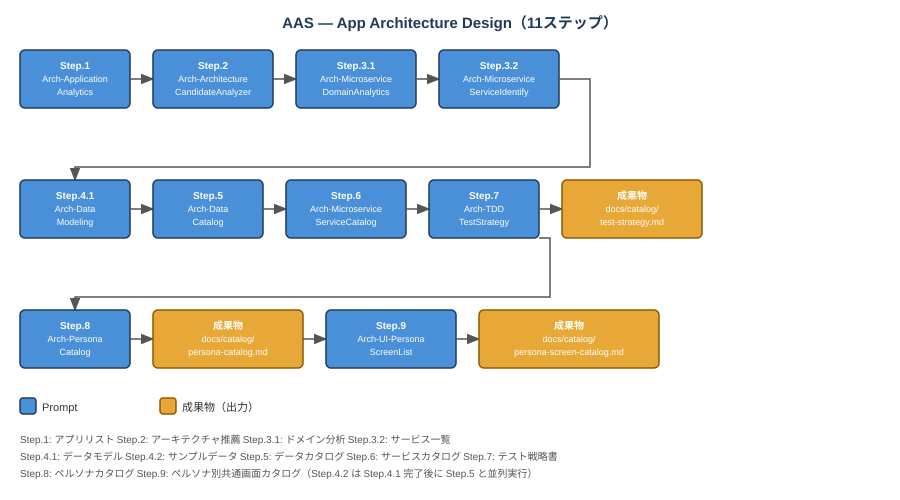
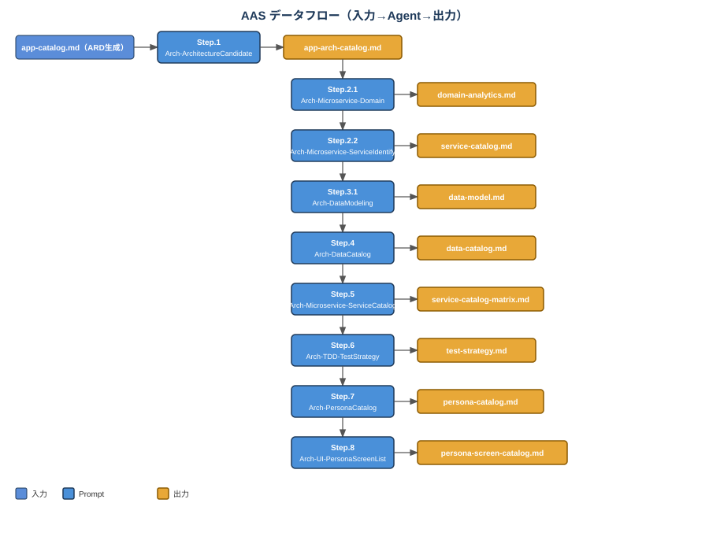
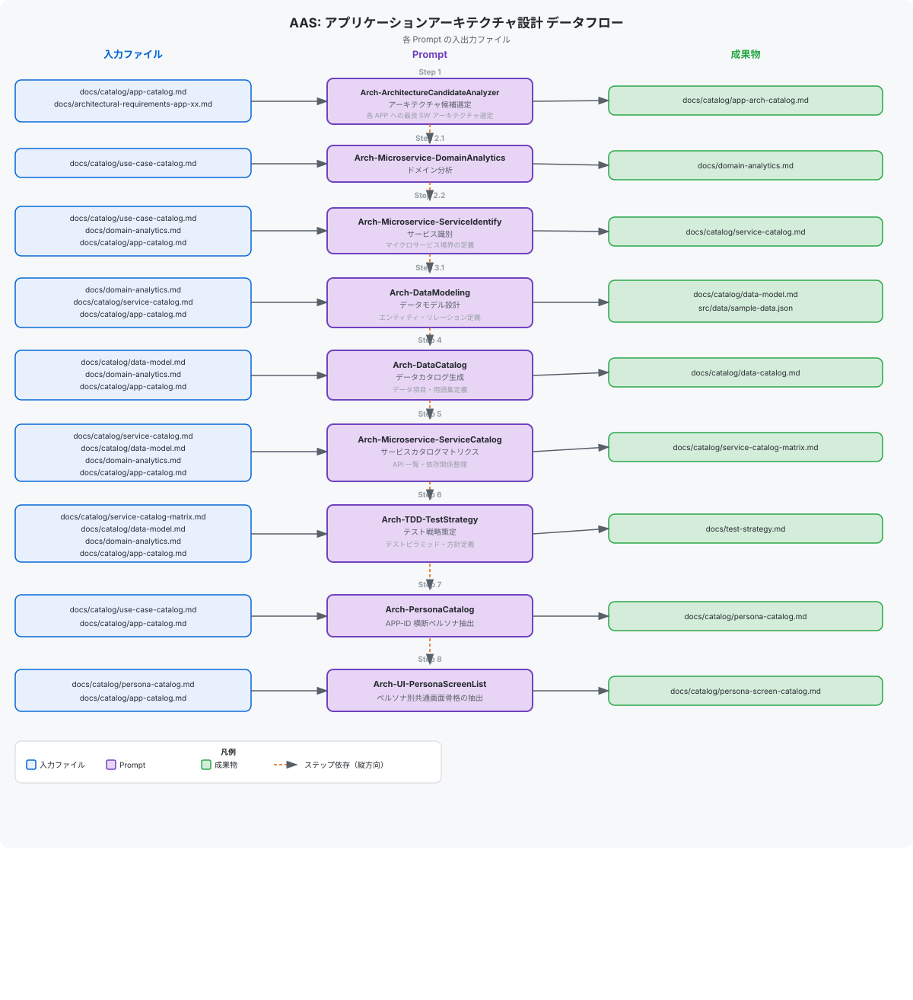

# アプリケーションアーキテクチャ設計

← [README](../README.md)

---

## 目次

- [概要](#概要)
- [対象読者・前提・次のステップ](#audience-prereq-next-aas)
- [実行経路を選ぶ](#execution-routes-aas)
- [Agent チェーン図（AAS）](#agent-チェーン図aas)
- [ツール](#ツール)
- [ステップ概要](#ステップ概要)
- [手動実行ガイド](#手動実行ガイド)
- [Cloud 実行ガイド](#cloud-aas)
- [CLI 実行ガイド](#cli-aas)
- [GUI 実行ガイド](#gui-aas)
- [失敗時の確認](#failure-aas)
- [完了確認と後続ワークフロー](#completion-next-aas)
- [HVE の AAS を拡張する](#extend-aas)
- [動作確認手順](#動作確認手順)
- [実装根拠](#sources-aas)

---
ユースケースからアプリケーションリストの作成・アーキテクチャ選定を行うフェーズ1のガイドです。

> [!NOTE]
> フェーズ1は Step.1〜Step.9 の **11 Step ID**
> （`1`, `2`, `3.1`, `3.2`, `4.1`, `4.2`, `5`, `6`, `7`, `8`, `9`）で構成されます。
> フェーズ2は以下を参照してください。
> - Web アプリケーション設計: [Web Application 設計ガイド（AAD-WEB）](./03-app-design-microservice-azure.md)
> - AI Agent 設計: [AI Agent 設計ガイド（AAG）](./08-ai-agent.md)（Issue Template: `ai-agent-design.yml`）
> - データフロー設計: [データフロー設計ガイド](./04-app-design-dataflow.md)

---

## 概要

### フローの目的・スコープ

ユースケースカタログから、アプリケーション、推薦アーキテクチャ、ドメイン、サービス、データ、テスト、ペルソナの共通カタログを生成します。
Cloud では Issue Form から Sub-Issue を生成し、CLI / GUI では同じ Python レジストリから DAG を組み立てて実行します。

後続の AAD-WEB / ADFD / AAG は別ワークフローです。必要な AAS 成果物と、AAG では AAD-WEB 等の追加成果物が揃ってから起動します。

> [!NOTE]
> **ADI を先に実行している場合**、`docs/catalog/app-catalog.md` / `domain-analytics.md` / `data-model.md` に `## 設計書由来の候補（ADI）` セクションがあります。既存設計書から抽出された候補で、**`APP-` は未採番**です。AAS Step `1` / `3.1` / `4.1` がこのセクションを読んで正式な ID を採番し、本表へ統合します。詳細は [00-design-doc-ingestion.md](./00-design-doc-ingestion.md#adi-と設計ワークフローard--aas--adfdの関係) を参照してください。

### PR 完全自動化オプション（Issue Template）

`app-architecture-design.yml` には **「PR完全自動化設定」** ドロップダウンがあります。
有効化すると、レビュー完了後に `auto-approve-ready` ラベル連携で Auto Approve / Auto-merge（squash）まで自動実行されます。

### 前提条件

- `docs/catalog/use-case-catalog.md` が存在していること（Step.1 の必須入力）
- Step.2 の判定精度を上げる場合は、APP ごとに `docs/architectural-requirements-app-xx.md` を用意すること（未作成でもデフォルト推薦で続行可能）
- GitHub Copilot が有効になっていること
- セットアップ・トラブルシューティングは → [Cloud](./hve-cloud-getting-started.md) / [CLI](./hve-cli-getting-started.md) / [GUI](./hve-gui-getting-started.md)

<a id="audience-prereq-next-aas"></a>
## 対象読者・前提・次のステップ

- 対象読者: `docs/catalog/use-case-catalog.md` をもとに共通アーキテクチャ（AAS）を設計する方
- 前提: 利用する経路に応じて Cloud Issue を起票できるか、HVE CLI / GUI を起動できること
- 次のステップ: フェーズ2として Web は [03-app-design-microservice-azure.md](./03-app-design-microservice-azure.md)、AI Agent は [08-ai-agent.md](./08-ai-agent.md)、バッチは [04-app-design-dataflow.md](./04-app-design-dataflow.md)

### このガイドで扱わないこと

- AAS が生成した設計を実装・デプロイする手順（後続ワークフローのガイドを参照）
- Azure リソースの作成や、個別 APP の推薦結果そのもの
- HVE のセットアップ詳細（[Cloud](./hve-cloud-getting-started.md) / [CLI](./hve-cli-getting-started.md) / [GUI](./hve-gui-getting-started.md) を参照）

> 💡 `knowledge/` 連携の詳細は [km-guide.md](./km-guide.md) を参照してください。

<a id="execution-routes-aas"></a>
## 実行経路を選ぶ

| 経路 | 入口 | DAG / 実行単位 | 入力欠損時 | 完了の確認先 |
|---|---|---|---|---|
| Cloud | `.github/ISSUE_TEMPLATE/app-architecture-design.yml` | `auto-orchestrator-dispatcher.yml` が `auto-app-selection-reusable.yml` を呼び、Step ごとに Sub-Issue を作成 | 後続 Step の必須ファイルが対象ブランチで HTTP 404 の場合は `aas:blocked`。API・権限・通信等の非 404 エラーは欠損とみなさず状態遷移を中断 | Root Issue の `aas:done` と完了コメント |
| CLI | `python -m hve orchestrate --workflow aas` | `hve/workflow_registry.py` から `DAGPlan` を作り、CLI が Step を制御。SDK セッションの実行先は `--cloud-session` 等の設定によりローカル / Cloud Session を選択 | 一括の全入力 precheck は行わず、各 Prompt が停止 / 質問 / `TBD` を判断。主成果物が未生成なら Step は失敗 | 終了コード、サマリー、成果物 |
| GUI | `python -m hve gui` | GUI が `OrchestrateArgs` を CLI 引数へ変換し、CLI と同じ DAG エンジンを起動 | Step.1 選択時は `use-case-catalog.md` を事前確認。その後は CLI と同じ | Workbench の結果、終了状態、成果物 |
| 手動 Prompt | `.github/prompts/<Agent>.prompt.md` を順に実行 | オーケストレーターなし。利用者が依存順を管理 | Prompt ごとの入力契約に従い、利用者が不足を解消 | 各出力ファイルを利用者が確認 |

> [!IMPORTANT]
> Cloud の部分実行と CLI / GUI の部分実行は同じではありません。Cloud はチェックした Step の前段も明示選択する必要があります。
> CLI / GUI は非選択 Step を `skipped`（依存解決済み）として扱うため、入力成果物が既にあれば `--steps 5,6,7` のような再実行ができます。


## Agent チェーン図（AAS）

以下の図は、このワークフローで使用される Prompt がファイルの入出力を介してどのように連鎖するかを示します。
実際の DAG では Step.4.2 と Step.5 が並列です。





### アーキテクチャ図



### データフロー図（AAS）

以下の図は、各ステップで Prompt が読み書きするファイルのデータフローを示します。



---

## ツール

Cloud は GitHub Copilot cloud agent、CLI / GUI は GitHub Copilot SDK を使用します。
手動経路では利用中の Copilot Chat から対象 Prompt を実行します。共通セットアップは [README.md](../README.md) を参照してください。

---

## ステップ概要

### 依存グラフ

```
step-1 ──► step-2 ──► step-3.1 ──► step-3.2 ──► step-4.1 ─┬─► step-4.2
                                                        └─► step-5 ──► step-6 ──► step-7 ──► step-8 ──► step-9
```

### 各ステップの入出力

| Step ID | タイトル | Prompt | 主入力 | 主出力 | 依存 |
|---|---|---|---|---|---|
| `1` | アプリケーションリストの作成 | `Arch-ApplicationAnalytics` | `docs/catalog/use-case-catalog.md` | `docs/catalog/app-catalog.md` | なし |
| `2` | ソフトウェアアーキテクチャの推薦 | `Arch-ArchitectureCandidateAnalyzer` | `docs/catalog/app-catalog.md`、任意の `docs/architectural-requirements-app-{appId}.md` | `docs/catalog/app-arch-catalog.md` | `1` |
| `3.1` | ドメイン分析 | `Arch-Microservice-DomainAnalytics` | `docs/catalog/app-arch-catalog.md`、`docs/catalog/app-catalog.md`、`docs/catalog/use-case-catalog.md` | `docs/catalog/domain-analytics.md` | `2` |
| `3.2` | サービス一覧抽出 | `Arch-Microservice-ServiceIdentify` | `docs/catalog/use-case-catalog.md`、`docs/catalog/domain-analytics.md`、`docs/catalog/app-catalog.md` | `docs/catalog/service-catalog.md` | `3.1` |
| `4.1` | データモデル設計 | `Arch-DataModeling` | `docs/catalog/domain-analytics.md`、`docs/catalog/service-catalog.md`、`docs/catalog/app-catalog.md` | `docs/catalog/data-model.md` | `3.2` |
| `4.2` | サンプルデータ生成 | `Arch-DataModeling` | `docs/catalog/data-model.md`、`docs/catalog/domain-analytics.md`、`docs/catalog/service-catalog.md`、`docs/catalog/app-catalog.md` | `src/data/sample-data.json` | `4.1` |
| `5` | データカタログ作成 | `Arch-DataCatalog` | 必須: `docs/catalog/data-model.md`、`docs/catalog/domain-analytics.md`、`docs/catalog/app-catalog.md`。任意: `docs/catalog/service-catalog.md`、`docs/catalog/service-catalog-matrix.md` | `docs/catalog/data-catalog.md` | `4.1` |
| `6` | サービスカタログ | `Arch-Microservice-ServiceCatalog` | `docs/catalog/service-catalog.md`、`docs/catalog/data-model.md`、`docs/catalog/domain-analytics.md`、`docs/catalog/app-catalog.md`、`docs/catalog/data-catalog.md`。画面カタログは任意 | `docs/catalog/service-catalog-matrix.md` | `5` |
| `7` | テスト戦略書 | `Arch-TDD-TestStrategy` | 必須: `docs/catalog/service-catalog-matrix.md`、`docs/catalog/data-model.md`、`docs/catalog/domain-analytics.md`。`docs/catalog/app-catalog.md`、`docs/catalog/service-catalog.md`、`docs/catalog/data-catalog.md` は補強入力 | `docs/catalog/test-strategy.md` | `6` |
| `8` | ペルソナカタログ | `Arch-PersonaCatalog` | `docs/catalog/use-case-catalog.md`、`docs/catalog/app-catalog.md` | `docs/catalog/persona-catalog.md` | `7` |
| `9` | ペルソナ別共通画面カタログ | `Arch-UI-PersonaScreenList` | `docs/catalog/persona-catalog.md`、`docs/catalog/app-catalog.md`。ドメイン / サービスカタログは補助 | `docs/catalog/persona-screen-catalog.md` | `8` |

> [!NOTE]
> `hve/workflow_registry.py` の `required_input_paths` は実行計画・Fleet 用の宣言であり、CLI / GUI 標準経路で全行を一括 precheck する機構ではありません。
> また Step.5 は Python レジストリ / scoped I/O contract が `service-catalog.md` と、後続 Step.6 が生成する `service-catalog-matrix.md` も required と宣言する一方、
> Cloud テンプレートと `Arch-DataCatalog.prompt.md` は両方を任意入力としています。新規フル実行では DAG と Prompt に従い、Step.5 を Step.4.1 後に起動します。

### Step.2 のローカル fan-out

- CLI / GUI では `fanout_parser="app_catalog"` により Step.2 を `2/APP-*` へ展開します。
- 各子 Step には `hve/prompt/fanout/aas/_common.md` が追加され、対象 APP だけを処理します。
- Step.3.1 の依存は全子 Step へ置換されるため、すべての対象 APP の Step.2 が完了してから進みます。
- Cloud reusable workflow はこの Python fan-out を使わず、単一の Step.2 Sub-Issue で統合レポートを生成します。

---

## 手動実行ガイド

以下の短縮 Prompt は操作説明用です。実行時の正本は `.github/prompts/<Custom Agent>.prompt.md` です。
手動経路には DAG、ラベル遷移、入力 precheck、`output_paths` ゲートがないため、各 Step の前後で入力と出力を自分で確認してください。

### Step 1. ユースケースから、アプリケーションリストの作成

- 使用するカスタムエージェント
  - Arch-ApplicationAnalytics

Prompt:

```text
ユースケース文書（UCが可変数）から、実装手段（アプリ導入／既存拡張／連携／業務改革／組織改革）を仕分けし、複数UCを束ねて実装できる「アプリリスト（アプリ種別＝アーキタイプ）」と最小ポートフォリオ（MVP）を選出するための、エージェント定義とプロンプト集を作成する

## 3) 入力（必ず参照）
- ユースケース文書: `docs/catalog/use-case-catalog.md`

## 4) 出力先（成果物）
- `docs/catalog/app-catalog.md`
```

---

### Step 2. ソフトウェアアーキテクチャの推薦

- 使用するカスタムエージェント
  - Arch-ArchitectureCandidateAnalyzer

#### 概要

このステップでは、Step 1 で特定したアプリケーション（APP-01〜APP-xx）の **各アプリケーションごと** にソフトウェアアーキテクチャを選定します。

- APP 別の任意入力は `docs/architectural-requirements-app-xx.md`
- 入力ファイルがない APP は、`app-catalog.md` の `client_type` / 概要 / APP 名を根拠にデフォルト推薦を適用し、`⚠️デフォルト適用（入力ファイルなし）` と記録します
- ファイルが存在しても核心入力が不足する APP は、当該 APP の判定を中断して質問し、他 APP の処理を続けます
- 出力は統合レポート `docs/catalog/app-arch-catalog.md` にまとめられます

#### ユーザー入力情報ファイルの作成

このカスタムエージェントの入力ファイルは、**アプリケーションごとに** ユーザー自身が作成します。

- ファイル名: `docs/architectural-requirements-app-xx.md`（例: `docs/architectural-requirements-app-01.md`, `docs/architectural-requirements-app-02.md`, ...）
- APP-IDは `docs/catalog/app-catalog.md` のAPP-ID（APP-01〜APP-xx）と一致させてください
- **全APPのファイルを一度に作成する必要はありません**。未作成 APP はデフォルト推薦、作成済み APP は入力に基づく判定になります

以下のPromptを任意の生成AIに貼り付けてヒアリングを受け、**最終的に確定した入力一覧**をコピーして `docs/architectural-requirements-app-xx.md` として保存してください。**対象APPごとに繰り返してください。**

<details>
<summary>📋 ユーザー入力情報ファイル作成のPrompt（クリックで展開）</summary>

````text
あなたは「システムづくりの相談窓口（ヒアリング担当）」です。
このフェーズの目的は、ユーザーから"システムを作る上での条件（使う上での条件）"を漏れなく集めることです。
※この段階では、アーキテクチャの結論や推薦は出さず、必要情報の回収に専念してください。

━━━━━━━━━━━━━━━━━━━━━━━━━━━━
■ 最初に確認すること（必須）
━━━━━━━━━━━━━━━━━━━━━━━━━━━━
このヒアリングを開始する前に、対象のアプリケーションを確認します。

【確認事項】
- 対象APP-ID（例: APP-01, APP-02, ...）: ＿＿＿
- アプリケーション名（例: ロイヤルティ台帳・プログラム管理）: ＿＿＿

※ `docs/catalog/app-catalog.md` に記載のAPP-IDとAPP名を確認してください。
※ APP-IDが確定したら「対象：APP-xx アプリケーション名」と宣言してから進めます。

━━━━━━━━━━━━━━━━━━━━━━━━━━━━
■ 進め方（必ず守るルール）
━━━━━━━━━━━━━━━━━━━━━━━━━━━━
1) 推測しない：分からない情報は埋めずに、ユーザーへ確認する。
2) 追加質問は最大5つまで：ユーザーの負担を減らすため、1回の返信で聞くのは最大5問。
3) 毎回の返し方は固定（必ずこの順番）：
   【1】受領内容の整理（あなたが理解した内容を、短い箇条書きで）
   【2】必須項目チェック（埋まった/不足をチェックリストで見せる）
   【3】追加で伺う質問（不足分だけ／最大5問／選びやすい選択肢つき）
4) ユーザーが自由文で答えてもOK：あなたが項目に当てはめて整理する（書き直し要求はしない）。
5) 「不明」「未定」と言われたら：
   - 代わりに選べる目安（選択肢）を出して、選んでもらう。
6) 必須項目がすべて埋まったら：
   - 「APP-xx の必須項目が揃いました。次は選定に進めます。」と伝え、
   - 「確定した入力一覧（箇条書き）」を出し、
   - さらに **`architectural-requirements-app-xx.md` の内容を"保存できる形"で出力**して、このフェーズを終了する。
   - 重要：このフェーズでは結論（推薦）は出さない。

━━━━━━━━━━━━━━━━━━━━━━━━━━━━
■ "ダウンロード（保存）用ファイル"出力ルール（必須）
━━━━━━━━━━━━━━━━━━━━━━━━━━━━
必須項目がすべて揃ったら、最後に必ず以下を実行する：

A) 可能なら：新規ファイル `architectural-requirements-app-xx.md` を作成し、内容を書き込む。
B) ファイル作成ができない環境なら：ユーザーが保存できるように、下記テンプレを埋めた全文を
   ```md
   <!-- filename: architectural-requirements-app-xx.md -->
   ...

の形式で出力する。
※ユーザーに「このブロックを `architectural-requirements-app-xx.md` という名前で保存してください」と丁寧に案内する。

━━━━━━━━━━━━━━━━━━━━━━━━━━━━
■ 用語を使わないための"目安"（迷ったらこの説明を添える）
━━━━━━━━━━━━━━━━━━━━━━━━━━━━

* 「速さ（リアルタイム）」：
  例）操作してすぐ反応が必要／機械の制御で遅れが許されない など
* 「利用者が増える（拡張性）」：
  例）将来ユーザーやデータが大きく増える見込みがある
* 「混み具合の差（ピーク変動）」：
  例）普段は少ないが、特定の時間やイベントで急に増える
* 「ネットがなくても使う（オフライン）」：
  例）圏外・電波が弱い場所でも業務が止まらない必要がある
* 「安全性（セキュリティ/規制）」：
  例）個人情報・機密情報・法規制が関わる
* 「クラウド」：
  例）インターネット上の外部サービス（社外の設備）を使う方式
* 「データフロー処理（データパイプライン）」：
  例）画面を持たず、スケジュールやトリガーで大量データを一括処理する仕組み（例: ETL/ELT、集計、AI/MLパイプライン）

━━━━━━━━━━━━━━━━━━━━━━━━━━━━
■ まずはここだけ回答してください（必須：最小フォーム）
━━━━━━━━━━━━━━━━━━━━━━━━━━━━
分かる範囲で大丈夫です。分からない場合は「不明」「未定」でOKです。

【最小フォーム（コピペして埋めてください）】

0. 対象アプリケーション（必須）

   * APP-ID（例: APP-01）: ＿＿＿
   * アプリケーション名: ＿＿＿
1. どんなシステムですか？（必須）

   * 概要（1〜3文）：誰が／どこで／何をするシステムか
2. 何で使いますか？（必須）

   * 端末：PCのブラウザ / スマホ / タブレット / PCアプリ / 機械・装置 / UIなし（データフロー処理/データパイプライン） / まだ未定
3. 速さ（リアルタイム性）は必須ですか？（必須）

   * はい / いいえ / 不明
   * （「はい」の場合）どの場面で速さが必要？：例）画面操作、決済、制御、通知 など
4. 将来の規模（利用者が増える見込み）は？（必須）

   * 低：ほぼ増えない / 中：増えるかも / 高：大きく増える
5. 混み具合の差（ピーク変動）は？（必須）

   * 低：いつも同じ / 中：時間帯で増減 / 高：イベント等で急増
6. ネットがなくても使う必要はありますか？（必須）

   * はい / いいえ / 不明
7. 扱う情報の大事さ（機密性）は？（必須）

   * 低：公開しても問題小 / 中：社内情報や顧客情報あり / 高：個人情報・機密・規制対象
8. クラウド（社外のサービス）を使えますか？（必須）

   * 使える / 使えない / 一部ならOK / 不明
9. 費用の考え方はどれに近いですか？（必須）

   * 初期費用をなるべく抑えたい
   * バランスよく（初期も運用もほどほど）
   * 長い目で見て総額（運用費込み）を抑えたい
10. 何を一番大事にしますか？（必須：2〜3個）

* 速さ（リアルタイム）
* 将来の拡張（増えても大丈夫）
* ネットなしでも使える
* 安全性（セキュリティ/規制）
* 費用
  ※それぞれに重要度を付けてください：必須 / 高 / 中 / 低
  例）ネットなしでも使える=必須、費用=高、拡張=中

━━━━━━━━━━━━━━━━━━━━━━━━━━━━
■ 追加で分かれば教えてください（任意：精度が上がります）
━━━━━━━━━━━━━━━━━━━━━━━━━━━━

* どこで使いますか？（例：屋内、工場、屋外、山間部、海外など）
* だいたい何人（何台）で使いますか？（今／将来）
* 「ネットなしでも使う」場合：どこまで必要ですか？

  * 閲覧だけ / 入力も必要 / 主要機能ぜんぶ必要 / 不明
* 「クラウド一部OK」の場合：何はOKで、何はNGですか？
  例）個人情報はNG、匿名化データだけOK
* データの置き場所に決まりはありますか？

  * 制約なし / 日本国内だけ / EUだけ / 指定あり（内容：＿＿）
* 守るべきルール（規制・社内ルール）があれば：
  例）医療、金融、公共、個人情報の厳格管理、監査が必要 など
* その他の事情（回線が弱い、24時間運用できない、既存システムがある等）

━━━━━━━━━━━━━━━━━━━━━━━━━━━━
■ あなた（アシスタント）の返信テンプレ（毎回これで返す）
━━━━━━━━━━━━━━━━━━━━━━━━━━━━
ユーザー回答を受け取ったら、必ず次の形で返す。

【1】受領内容の整理（短い箇条書き）

* （例）対象：APP-01 ロイヤルティ台帳・プログラム管理
* （例）利用者：現場スタッフ／場所：圏外が多い
* （例）端末：スマホ
* （例）オフライン：必要（入力も必要）
  …など

【2】必須項目チェック（チェックリスト）

* [ ] 対象アプリケーション（APP-ID、名称）
* [ ] どんなシステム（概要）
* [ ] 端末
* [ ] 速さ（必須か／必要場面）
* [ ] 将来の規模（増える見込み）
* [ ] 混み具合（ピーク変動）
* [ ] ネットなしで使う必要
* [ ] 扱う情報の大事さ（機密性）
* [ ] クラウド可否
* [ ] 費用の考え方
* [ ] 何を大事にするか（優先順位2〜3個）

【3】追加で伺う質問（不足分だけ／最大5問）

* 質問1：不足している点（理由：なぜ必要か）— 回答しやすい選択肢
* 質問2：…
  （最大5問）

※矛盾がありそうな場合は、最大3問までで確認する：

* 「AとBが両立しにくい可能性があります。どちらを優先しますか？」
  （選択肢：A優先 / B優先 / どちらも譲れない→条件整理）

━━━━━━━━━━━━━━━━━━━━━━━━━━━━
■ 完了時（必須が全部そろったら必ず出す）
━━━━━━━━━━━━━━━━━━━━━━━━━━━━
【完了メッセージ】

* 「APP-xx の必須項目が揃いました。次は選定に進めます。」
* 「確定した入力一覧（箇条書き）」

【保存できるファイルの出力（必須）】
ユーザーが保存・ダウンロードできるように、以下のテンプレを埋めた全文を、必ずコードブロックで出力する：

```md
<!-- filename: architectural-requirements-app-xx.md -->
# 1. アプリケーション情報
- app_id: <APP-xx>
- app_name: <アプリケーション名>

# 2. 入力（必須・任意）

## 必須（これが揃うまで作業は未完了）
- どんなシステムですか？（system_overview）
  - 回答: <1〜3文で記載>
- 何で使いますか？（client_type）
  - 回答: <web / mobile / desktop / embedded / iot / batch / mixed>
  - batch: UIを持たないスケジュール実行・大量データ一括処理（PySpark / ADF / Airflow / dbt 等）
- 速さ（リアルタイム性）は必須ですか？（realtime.required）
  - 回答: <はい / いいえ / 不明>
- 将来の規模（利用者が増える見込み）（scalability.growth_expected）
  - 回答: <低 / 中 / 高>
- 混み具合の差（ピーク変動）（scalability.peak_variation）
  - 回答: <低 / 中 / 高>
- ネットがなくても使う必要はありますか？（offline.required）
  - 回答: <はい / いいえ / 不明>
- 扱う情報の大事さ（機密性）（security_compliance.data_sensitivity）
  - 回答: <低 / 中 / 高>
- クラウド（社外のサービス）は使えますか？（security_compliance.cloud_allowed）
  - 回答: <使える（yes）/ 使えない（no）/ 一部ならOK（partial）/ 不明>
- 費用の考え方（cost.preference）
  - 回答: <初期費用を抑えたい（low-initial）/ バランス（balanced）/ 総額を抑えたい（low-tco）>
- 大事にしたいポイント（priorities：上位2〜3個推奨）
  - 回答: <例：ネットなしでも使える=必須、費用=高、拡張=中>

## 任意（分かる範囲でOK：精度が上がります）
- 速さが必要な場面（realtime.realtime_scope）
  - 回答: <例：画面操作 / 決済 / 制御 / 通知 など>
- 速さの目安（realtime.target_latency_ms）
  - 回答: <例：10 / 50 / 100 / 500>
- 反応のゆらぎに敏感か（realtime.jitter_sensitive）
  - 回答: <low / medium / high>
- 規模の目安（scalability.expected_users）
  - 回答: <概算ユーザー数・端末数>
- オフラインで必要な範囲（offline.offline_scope）
  - 回答: <閲覧だけ（view-only）/ 入力も必要（input-required）/ 主要機能ぜんぶ（core-required）/ 不明>
- 守るべきルール（security_compliance.regulations）
  - 回答: <例：GDPR / PCI DSS / 医療 / 金融 / 公共 / 社内ルール など>
- データの置き場所の制約（security_compliance.data_residency）
  - 回答: <制約なし（any）/ 日本国内だけ（jp-only）/ EUだけ（eu-only）/ 指定あり（specified）>
- （cloud_allowed=partial の場合）クラウドに置けるもの/置けないもの
  - 回答: <例：個人情報は不可、匿名化データのみ可>
- TCOで見たい年数（cost.horizon_years）
  - 回答: <例：3 / 5 / 7>
- その他の事情（constraints.notes）
  - 回答: <回線品質、運用体制、既存資産、端末制約など>
### データフロー処理固有（client_type=batch の場合のみ記入）
- データ量規模（batch.data_volume）
  - 回答: <例：日次100万件、月次1TB など>
- 実行スケジュール（batch.schedule）
  - 回答: <例：日次深夜、毎時、イベントトリガー など>
- プラットフォーム（batch.platform）
  - 回答: <例：PySpark / ADF / Airflow / dbt / 未定 など>
## 未確定・要確認（あれば残す）
- <不明/未定の項目や、次フェーズで確認すべき点を箇条書き>

最後に、ユーザーへ丁寧に案内する：

* 「上のブロックを `architectural-requirements-app-xx.md` という名前で `docs/` に保存してください。（例: `docs/architectural-requirements-app-01.md`）」
* 「他のAPPも同様にヒアリングを繰り返してください。」
* 「全APPのファイルが揃わなくても実行できます。未作成 APP には入力ステータスを明記してデフォルト推薦が適用されます。」
````
</details>


#### Issue作成時のPrompt

> ⚠️ **注意**: 以下のPromptは **GitHub で Issue を作成する際**に使用します（Copilot cloud agent に作業を依頼するためのもの）。上記の「ユーザー入力情報ファイル作成のPrompt」とは用途が異なります。対象APPの入力ファイル `docs/architectural-requirements-app-xx.md` を先に作成・保存してから、このPromptで Issue を作成してください。
>
> 📌 **部分入力が可能です**: APP 別入力ファイルが揃っていなくても実行できます。存在しない APP はデフォルト推薦を適用し、入力ステータスと根拠を統合レポートに記録します。

Prompt:

```text
アプリケーションリスト（docs/catalog/app-catalog.md）の各APP-xxに対し、個別の入力ファイル（docs/architectural-requirements-app-xx.md）から非機能要件を読み取り、固定候補から推薦アーキテクチャを1つずつ選定する。入力ファイルが存在しないAPPには、app-catalog.md の client_type / system_overview / app_name を根拠に Prompt 規定のデフォルト推薦を適用する。

## 3) 入力（必ず参照）
- アプリケーションリスト: `docs/catalog/app-catalog.md`
- 各APPのアーキテクチャ要件: `docs/architectural-requirements-app-xx.md`（存在するもののみ）

## 7) 出力先（成果物）
- `docs/catalog/app-arch-catalog.md`（全APPの統合レポート：判定完了・デフォルト適用・未処理一覧・処理統計）
```

---

### Step 3.1. ドメイン分析

- 使用するカスタムエージェント
  - Arch-Microservice-DomainAnalytics

```text
# タスク
ユースケース文書を根拠に、DDD観点でドメイン分析（Bounded Context / ユビキタス言語 / 集約 / ドメインイベント / コンテキストマップ等）を整理し、docs/catalog/domain-analytics.md を作成する。

# 入力
- ユースケース文書: `docs/catalog/use-case-catalog.md`
- アプリケーション一覧: `docs/catalog/app-catalog.md`
- 推薦アーキテクチャ: `docs/catalog/app-arch-catalog.md`

# 出力（必須）
- `docs/catalog/domain-analytics.md`
```

---

### Step 3.2. サービス一覧の抽出

- 使用するカスタムエージェント
  - Arch-Microservice-ServiceIdentify

```text
# タスク
docs/ のドメイン分析からマイクロサービス候補を抽出し、service-list.md（サマリ表＋候補詳細＋Mermaidコンテキストマップ）を作成/更新する。

# 入力
- `docs/catalog/use-case-catalog.md`
- `docs/catalog/domain-analytics.md`
- `docs/catalog/app-catalog.md`（アプリケーション一覧 — 各サービス候補に APP-ID を紐付けること）

# 出力（必須）
- `docs/catalog/service-catalog.md`
```

---

### Step 4.1. データモデル作成

- 使用するカスタムエージェント
  - Arch-DataModeling

```text
# タスク
ドメイン分析とサービス一覧から全エンティティを抽出し、サービス境界と所有権を明確にしたデータモデル（Mermaid）を生成します

# 入力
- `docs/catalog/domain-analytics.md`
- `docs/catalog/service-catalog.md`
- `docs/catalog/app-catalog.md`（アプリケーション一覧 — Entity Catalog の各エンティティに APP-ID を紐付けること）

# 出力（必須）
- `docs/catalog/data-model.md`
```

---

### Step 4.2. サンプルデータ生成

- 使用するカスタムエージェント
  - Arch-DataModeling

```text
# タスク
Step 4.1 のデータモデルに対応する架空のサンプルデータを生成する

# 入力
- `docs/catalog/data-model.md`
- `docs/catalog/domain-analytics.md`
- `docs/catalog/service-catalog.md`
- `docs/catalog/app-catalog.md`

# 出力（必須）
- `src/data/sample-data.json`
```

---

### Step 5. データカタログの作成

- 使用するカスタムエージェント
  - Arch-DataCatalog

```text
# タスク
概念データモデルと物理テーブルのマッピングを記録するデータカタログを生成する

# 入力
- `docs/catalog/data-model.md`
- `docs/catalog/domain-analytics.md`
- `docs/catalog/app-catalog.md`

# 出力（必須）
- `docs/catalog/data-catalog.md`
```

---

### Step 6. サービスカタログ作成

- 使用するカスタムエージェント
  - Arch-Microservice-ServiceCatalog

```text
# タスク
画面→機能→API→SoTデータのマッピングを docs/catalog/service-catalog-matrix.md に生成/更新する

# 入力
- `docs/catalog/service-catalog.md`
- `docs/catalog/data-model.md`
- `docs/catalog/domain-analytics.md`
- `docs/catalog/app-catalog.md`

# 出力（必須）
- `docs/catalog/service-catalog-matrix.md`
```

---

### Step 7. テスト戦略書の作成

- 使用するカスタムエージェント
  - Arch-TDD-TestStrategy

```text
# タスク
サービスカタログ・データモデルからTDDテスト戦略書を docs/catalog/test-strategy.md に生成/更新する

# 入力
- `docs/catalog/service-catalog-matrix.md`
- `docs/catalog/data-model.md`
- `docs/catalog/domain-analytics.md`
- `docs/catalog/app-catalog.md`

# 出力（必須）
- `docs/catalog/test-strategy.md`
```

---

### Step 8. ペルソナカタログの作成

- 使用するカスタムエージェント
  - Arch-PersonaCatalog

```text
# タスク
ユースケース文書のアクター記述から APP-ID 横断のペルソナ一覧を抽出する

# 入力
- `docs/catalog/use-case-catalog.md`
- `docs/catalog/app-catalog.md`

# 出力（必須）
- `docs/catalog/persona-catalog.md`
```

---

### Step 9. ペルソナ別共通画面カタログの作成

- 使用するカスタムエージェント
  - Arch-UI-PersonaScreenList

```text
# タスク
Step 8 のペルソナ一覧を前提に、複数 APP-ID で共通化できる画面骨格を抽出する

# 入力
- `docs/catalog/persona-catalog.md`（Step 8 の出力）
- `docs/catalog/app-catalog.md`

# 出力（必須）
- `docs/catalog/persona-screen-catalog.md`
```

---

<a id="cloud-aas"></a>
## Cloud 実行ガイド

### 実行経路

1. Issue Form が Root Issue に `auto-app-selection` を付与します。
2. `.github/workflows/auto-orchestrator-dispatcher.yml` が AAS を判定します。
3. `.github/workflows/auto-app-selection-reusable.yml` が選択 Step の Sub-Issue を作成し、Prompt 本文を付加します。
4. `aas:done` または Sub-Issue close を契機に次 Step を起動します。

### ラベル体系

| ラベル | 意味 |
|-------|------|
| `auto-app-selection` | このワークフローのトリガーラベル（Issue Template で自動付与） |
| `aas:initialized` | Bootstrap ワークフロー実行済み（二重実行防止） |
| `aas:qa-ready` | 実行前 QA の回答待ち（Copilot assign 保留） |
| `aas:ready` | 依存 Step が完了し、Copilot assign 可能な状態 |
| `aas:running` | Copilot assign 完了（実行中） |
| `aas:done` | Step 完了（状態遷移のトリガー） |
| `aas:blocked` | 依存関係の問題等でブロック状態 |

### 冪等性

- Bootstrap ワークフローは Root Issue に付与された `aas:initialized` ラベルの有無で二重起動を防止します
- Root Issue から `aas:*` ラベル（例: `aas:initialized`, `aas:ready`, `aas:running`, `aas:done`）をすべて削除し、`auto-app-selection` ラベルを再付与した場合のみ Bootstrap が再実行されます
- 再実行時は、既存の Step Issue を検索して再利用するロジックはなく、Sub-issues API の設定どおりに Sub Issue が再生成される実装です

### 部分実行と入力欠損

- Step チェックが全て未選択なら全 Step を生成します。一部選択時は依存する前段も選択してください。
- Step.1 を作らず Step.2 だけ作ると Step.2 は `aas:blocked` になります。Step.1 / Step.2 の両方がない場合、後続だけを選択しても初期起動されません。
- Step.8 をスキップすると、`persona-catalog.md` に依存する Step.9 も強制スキップされます。
- Step.1 は状態遷移時のファイル precheck より前に起動されます。`docs/catalog/use-case-catalog.md` は Issue 作成前に配置してください。
- Step.2 以降は、状態遷移時に Cloud workflow が対象ブランチ上の必須ファイルを GitHub Contents API で確認します。HTTP 404 のみを欠損と確定し、`aas:blocked` と不足一覧コメントを付けます。
- API / 通信 / 権限 / レート制限など非 404 の確認失敗は「ファイルなし」と誤判定せず、状態遷移ジョブを失敗させます。

### 使い方（Issue 作成手順）

#### 1. Issue を作成する

1. リポジトリの **Issues** タブ → **New Issue**
2. テンプレート **"Architecture Design（アーキテクチャ設計）"** を選択
3. 以下を入力:
   - **対象ブランチ**: 設計ドキュメントをコミットするブランチ名 (例: `main`)
  - **実行 Runner**: GitHub Hosted または Self-hosted (ACA)
   - **実行するステップ**: 実行したい Step にチェック（全て未選択の場合は全 Step 実行。一部チェックした場合、チェックしていない Step はスキップされます）
  - **モデル / QA / レビュー / 自己改善 / PR 完全自動化**: 必要な項目だけ設定
   - **追加コメント**: 補足・制約があれば記載
4. Issue を Submit → `auto-app-selection` ラベルが自動付与される

#### 2. 自動実行を確認する

1. **Actions タブ**で `AAS Orchestrator` が起動していることを確認
2. 完了後、親 Issue にサマリコメントと Step Issue 一覧が投稿される
3. `step-1` の Step Issue に Copilot が assign される

#### 3. 完了まで待つ

- 各 Step Issue が close されると:
  - `aas:done` ラベルが付与され、`auto-app-selection-reusable.yml` の状態遷移ロジックが起動する
  - 依存関係が解消された次 Step に `aas:ready` + `aas:running` ラベルが付き Copilot が assign される
- close または `aas:done` 付与の前に、当該 Step の成果物を Root Issue の「対象ブランチ」へ反映してください。次 Step の precheck はそのブランチを GitHub Contents API で確認します
- 全 Step 完了時に親 Issue に完了通知が届く

### セットアップ・トラブルシューティング

共通のセットアップ手順とトラブルシューティングは → [Cloud](./hve-cloud-getting-started.md) / [CLI](./hve-cli-getting-started.md) / [GUI](./hve-gui-getting-started.md)

<a id="cli-aas"></a>
## CLI 実行ガイド

リポジトリルートで実行します。仮想環境を有効化済みなら、OS を問わず次のコマンドを使用できます。

```shell
# 全 Step
python -m hve orchestrate --workflow aas

# DAG の確認だけ
python -m hve orchestrate --workflow aas --dry-run

# 既存成果物を使った部分再実行
python -m hve orchestrate --workflow aas --steps 5,6,7
```

Windows で仮想環境の Python を直接指定する場合は次のとおりです。

```powershell
# 全 Step
.\.venv\Scripts\python.exe -m hve orchestrate --workflow aas

# DAG の確認だけ
.\.venv\Scripts\python.exe -m hve orchestrate --workflow aas --dry-run

# 既存成果物を使った部分再実行
.\.venv\Scripts\python.exe -m hve orchestrate --workflow aas --steps 5,6,7
```

- `--steps` 省略時は全 Step が active です。
- 非選択の依存 Step は `skipped` として解決済みになるため、部分再実行前に対象 Step の入力ファイルを配置してください。
- Step.2 は APP カタログのキーごとに fan-out し、全子完了後に Step.3.1 へ進みます。
- 各 Prompt が致命的入力の停止条件を持ちます。Prompt が成功応答を返しても、`hve/runner.py` が Step の `output_paths` を確認し、主成果物がなければ `output-missing` で失敗にします。
- 失敗した Step の後続は起動せず、最終結果の `failed` / `blocked` と終了コードで確認できます。

<a id="gui-aas"></a>
## GUI 実行ガイド

1. `hve.cmd gui` または `python -m hve gui` で起動します。
2. GUI 画面の Step 1 で `Architecture Design (AAS)` と実行する AAS Step ID を選びます。
3. Step.1 を含む場合、実行前 precheck で `docs/catalog/use-case-catalog.md` の存在を確認します。
4. GUI 画面の Step 2（Workbench）で実行します。

GUI は `hve/gui/orchestrate_args.py` で選択内容を `python -m hve orchestrate --workflow aas ... --workbench off` 相当へ変換します。
したがって DAG、Step.2 fan-out、非選択依存の skip、Prompt の欠損処理、`output_paths` 完了ゲートは CLI と同じです。
詳しい画面操作は [HVE GUI Orchestrator ガイド](./hve-gui-orchestrator-guide.md) を参照してください。

<a id="failure-aas"></a>
## 失敗時の確認

| 症状 | 確認先 | 対応 |
|---|---|---|
| Cloud で Sub-Issue が作成されない | Actions の `HVE Cloud Agent Orchestrator Dispatcher` → `AAS Orchestrator`、Root Issue の `auto-app-selection` / `aas:initialized` | Workflow permissions、ラベル、対象ブランチを確認する。初期化をやり直す場合だけ [冪等性](#冪等性)の手順を使う |
| Cloud の Step が `aas:blocked` | Step の不足ファイルコメントと reusable workflow の該当ジョブ | 不足成果物を対象ブランチへ反映する。HTTP 404 以外で確認に失敗した場合は、欠損と決めつけず Actions の API・権限・通信エラーを解消して再実行する |
| Cloud で Copilot が assign されない | `AAS Orchestrator` の警告、`COPILOT_PAT`、`aas:qa-ready` | PAT と権限を [Cloud セットアップ](./hve-cloud-getting-started.md#step4-認証設定copilot_pat)で確認する。事前 QA 有効時は回答完了まで assign されない |
| CLI / GUI の Step が `failed` / `blocked` | 終了サマリーの最初の失敗 Step、`output-missing`、当該 Prompt の必須入力 | [各ステップの入出力](#各ステップの入出力)と実ファイルを突合する。後続だけを再実行する場合は、非選択の前段成果物も事前に配置する |
| Step.2 の一部 APP だけ未完了 | `docs/catalog/app-arch-catalog.md` の入力ステータス / 未処理一覧 | APP 入力ファイルなしはデフォルト推薦、ファイルありで核心入力不足は当該 APP の質問待ちになる。質問へ回答し、利用中の経路で Step.2 を再実行する |

上表で解消しない場合は、経路別セットアップのトラブルシューティング（[Cloud](./hve-cloud-getting-started.md) / [CLI](./hve-cli-getting-started.md) / [GUI](./hve-gui-getting-started.md)）を確認してください。

<a id="completion-next-aas"></a>
## 完了確認と後続ワークフロー

### フル AAS の成果物チェックリスト

- [ ] `docs/catalog/app-catalog.md`
- [ ] `docs/catalog/app-arch-catalog.md`
- [ ] `docs/catalog/domain-analytics.md`
- [ ] `docs/catalog/service-catalog.md`
- [ ] `docs/catalog/data-model.md`
- [ ] `src/data/sample-data.json`
- [ ] `docs/catalog/data-catalog.md`
- [ ] `docs/catalog/service-catalog-matrix.md`
- [ ] `docs/catalog/test-strategy.md`
- [ ] `docs/catalog/persona-catalog.md`
- [ ] `docs/catalog/persona-screen-catalog.md`

Cloud は Root Issue の `aas:done` と Step.9 完了コメント、CLI / GUI は終了コード 0、`failed=[]` / `blocked=[]`、上記ファイルの実在を確認します。
手動 Prompt は自動ゲートがないため、表の依存順と上記チェックリストを利用します。部分実行の成功はフル AAS 完了を意味しません。

### 次のワークフロー

| 後続 | Cloud の入口 | CLI | AAS 以外も含む開始条件 |
|---|---|---|---|
| AAD-WEB | `.github/ISSUE_TEMPLATE/web-app-design.yml` | `python -m hve orchestrate --workflow aad-web` | `FULL_PIPELINE` は `app-catalog.md`、`domain-analytics.md`、`service-catalog.md`、`data-model.md`、`service-catalog-matrix.md`、`test-strategy.md` を required とする。Step.9 成果物は AAD-WEB の Prompt が共通画面骨格として再利用する |
| ADFD | `.github/ISSUE_TEMPLATE/dataflow-design.yml` | `python -m hve orchestrate --workflow adfd` | `FULL_PIPELINE` の AAS 依存は `app-catalog.md` と `domain-analytics.md` の soft 依存。ただし ADFD Step.0.1 / 0.2 は `data-model.md` と `service-catalog-matrix.md` も入力にするため、通常はフル AAS 後に開始する |
| AAG | `.github/ISSUE_TEMPLATE/ai-agent-design.yml` | `python -m hve orchestrate --workflow aag` | AAS、AAD-WEB、Azure サービス設計の成果物が必要。下記の Step.1 入力一覧を確認し、AAS の `aas:done` だけで開始しない |

GUI では同じ workflow ID を選択します。Cloud dispatcher は AAS 完了時に AAD-WEB / ADFD / AAG を候補として案内しますが、案内は入力充足を保証しません。

AAG Step.1 の宣言済み入力は次のとおりです。

- Azure: `docs/azure/azure-services-additional.md`、`docs/azure/azure-services-data.md`
- AAS: `docs/catalog/app-catalog.md`、`docs/catalog/data-model.md`、`docs/catalog/domain-analytics.md`、`docs/catalog/service-catalog-matrix.md`、`docs/catalog/service-catalog.md`、`docs/catalog/use-case-catalog.md`、`src/data/sample-data.json`
- AAD-WEB: `docs/catalog/screen-catalog-APP-*.md`、`docs/screen/{screenId}-*.md`、`docs/services/SVC-*.md`
- `FULL_PIPELINE` の workflow 間ゲートは、さらに AAD-WEB の `docs/test-specs/*-test-spec.md` を required とします

<a id="extend-aas"></a>
## HVE の AAS を拡張する

### 正本の役割

- **CLI / GUI の DAG 正本**: `hve/workflow_registry.py` の `AAS`。`id`、`depends_on`、`custom_agent`、`output_paths`、`required_input_paths`、fan-out を定義します。
- **Agent の行動正本**: `.github/prompts/<Agent>.prompt.md`。`hve/prompt_loader.py` が CLI / GUI で読み、Cloud workflow は Sub-Issue 作成時に同じ本文を付加します。
- **Cloud の状態遷移正本**: `.github/workflows/auto-app-selection-reusable.yml`。Sub-Issue 作成、部分実行、必須ファイル確認、次 Step 起動、完了コメントを実装します。
- **Cloud の Issue 本文**: `.github/scripts/templates/aas/step-<id>.md`。目的、入出力、Custom Agent、依存、完了条件を定義します。
- **機械可読 I/O**: `.github/io-contracts/<Agent>--aas--<id>.yaml`。producer、required、出力 mode を定義します。

### Step を追加・再採番する手順

1. `hve/workflow_registry.py` の `AAS` を更新し、DAG wave と成果物パスを確定します。
2. 対応 Prompt、Cloud Step template、scoped I/O contract を同じ Step ID で作成 / 更新します。
3. fan-out が必要なら `fanout_parser`、`hve/prompt/fanout/aas/` の追加指示、下流 AND join を定義します。
4. `auto-app-selection-reusable.yml` の Sub-Issue 作成、skip 伝播、`activate_with_prereq_check`、最終 `aas:done` と成果物一覧を更新します。
5. `app-architecture-design.yml` の表、チェックボックス、依存チェーンを更新します。
6. Bash / PowerShell 利用面の `.github/scripts/bash/lib/workflow-registry.sh` と `.github/scripts/powershell/lib/workflow-registry.ps1` を同期します。
7. 本ガイドと必要な図を更新します。
8. `hve/tests/test_workflow_registry.py` で DAG、`hve/tests/test_template_engine.py` で Step template の列挙・展開、横断契約テストで Prompt / Template / I/O / Cloud / Issue Form / shell registry / guide の同期を固定します。

Step.8 / Step.9 の実例は `hve/tests/test_aas_persona_step_numbering_contract.py` です。片方の面だけを変更するとこのテストが失敗するため、拡張時のチェックリストとして利用できます。

---

## 動作確認手順

1. リポジトリで Actions の Workflow permissions を **Read and write** に設定する
2. `.github/workflows/auto-app-selection-reusable.yml` がリポジトリに存在することを確認する
3. `.github/ISSUE_TEMPLATE/app-architecture-design.yml` がリポジトリに存在することを確認する
4. Issues タブ → New Issue → **Architecture Design（アーキテクチャ設計）** テンプレートを選択する
5. 対象ブランチに `main` を入力し、全チェックを外したまま Issue を作成して全 Step を選択する
6. Actions タブで `AAS Orchestrator` の Bootstrap ジョブが起動したことを確認する
7. Bootstrap 完了後、Step.1 の Issue が作成され `aas:running` ラベルが付き Copilot が assign されることを確認する
8. 親 Issue にサマリコメントと Step Issue 一覧が投稿されたことを確認する
9. Step.1 の成果物をマージ / 対象ブランチへ反映して Sub-Issue を close し、状態遷移ジョブが起動することを確認する
10. Step.2 に `aas:ready` + `aas:running` が付与され Copilot が assign されることを確認する
11. Step.2 完了後に Step.3.1、Step.3.1 完了後に Step.3.2 が起動することを確認する
12. Step.4.1 完了後、Step.4.2 と Step.5 が並列に起動することを確認する
13. Step.7 → Step.8 → Step.9 の順に進み、Step.9 完了後に Root Issue の `aas:done` と全成果物一覧コメントを確認する
14. [フル AAS の成果物チェックリスト](#completion-next-aas)を確認する
15. 必要な入力が揃った後、AAD-WEB / ADFD / AAG のいずれかを起動する

<a id="sources-aas"></a>
## 実装根拠

### リポジトリ内の正本

- AAS DAG / 入出力 / fan-out: `hve/workflow_registry.py`、`hve/dag_planner.py`、`hve/fanout_expander.py`
- CLI / GUI 完了ゲート: `hve/runner.py`、`hve/dag_executor.py`、`hve/gui/orchestrate_args.py`、`hve/gui/workflow_step_requirements.py`
- Cloud 入口 / 状態遷移: `.github/workflows/auto-orchestrator-dispatcher.yml`、`.github/workflows/auto-app-selection-reusable.yml`
- Cloud 入力フォーム: `.github/ISSUE_TEMPLATE/app-architecture-design.yml`
- Prompt / Cloud Step body / I/O: `.github/prompts/`、`.github/scripts/templates/aas/`、`.github/io-contracts/*--aas--*.yaml`
- Step.8 / Step.9 横断契約: `hve/tests/test_aas_persona_step_numbering_contract.py`
- AAS DAG 回帰: `hve/tests/test_workflow_registry.py`

### 外部仕様の公式出典

- **Syntax for issue forms** — <https://docs.github.com/en/communities/using-templates-to-encourage-useful-issues-and-pull-requests/syntax-for-issue-forms>（`.github/ISSUE_TEMPLATE/*.yml` の配置と YAML 入力形式）
- **Reuse workflows** — <https://docs.github.com/en/actions/how-tos/reuse-automations/reuse-workflows>（`workflow_call` と同一リポジトリの reusable workflow 呼び出し）
- **Adding sub-issues** — <https://docs.github.com/en/issues/tracking-your-work-with-issues/using-issues/adding-sub-issues>（Root Issue と Sub-Issue の関係）
- **Starting GitHub Copilot sessions** — <https://docs.github.com/en/copilot/how-tos/use-copilot-agents/cloud-agent/start-copilot-sessions>（Issue を含む Copilot cloud agent の開始経路）
- **Automatically merging a pull request** — <https://docs.github.com/en/pull-requests/how-tos/merge-and-close-pull-requests/automatically-merging-a-pull-request>（必要なレビューと status checks 通過後の auto-merge）
- **GitHub Copilot SDK** — <https://github.com/github/copilot-sdk>（CLI / GUI が利用する SDK の公式リポジトリ）
