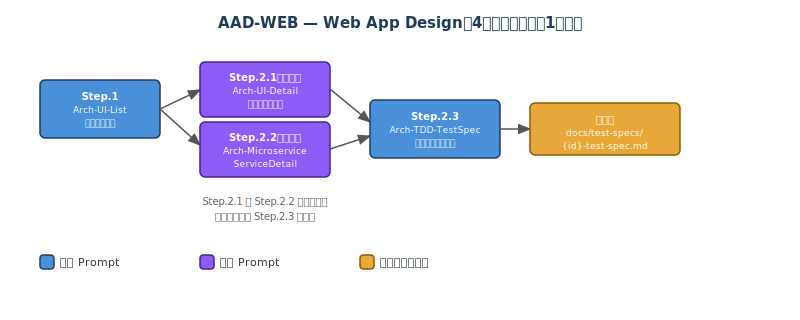
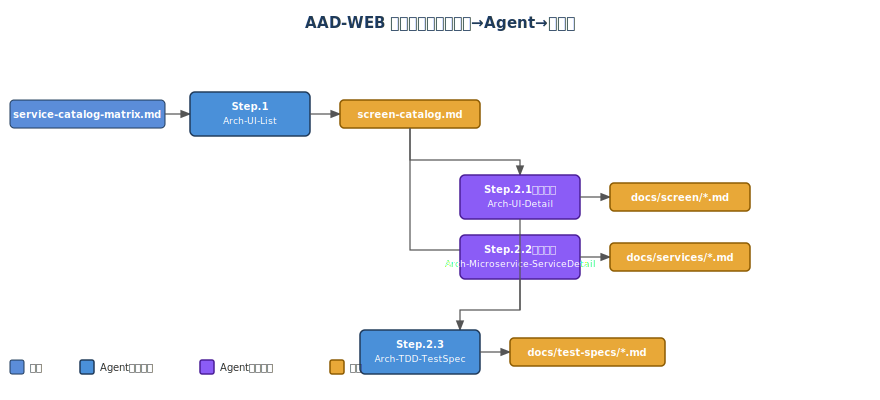
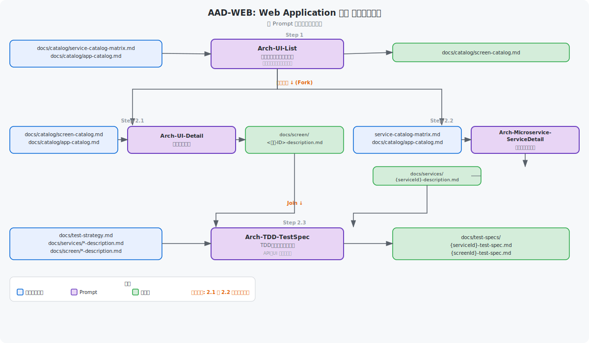

# Web Application 設計（AAD-WEB）

← [README](../README.md)

---

## 目次

- [概要](#概要)
- [Agent チェーン図（AAD-WEB）](#agent-チェーン図aad-web)
- [ツール](#ツール)
- [ステップ概要](#ステップ概要)
- [手動実行ガイド](#手動実行ガイド)
- [自動実行ガイド（ワークフロー）](#自動実行ガイドワークフロー)
- [動作確認手順](#動作確認手順)

---
Web アプリケーション（Microservice + Polyglot Persistence）の設計を行う4ステップのガイドです。

> [!NOTE]
> **移行説明**: 旧 AAD の Step.1.1〜6（ドメイン分析・サービス一覧・データモデル・データカタログ・サービスカタログ・テスト戦略書）は **AAS（8ステップ）に統合**されました。旧 Step.8.1〜8.3（AI Agent 設計）は **AAG**（`ai-agent-design.yml`）に分離されました。
>
> フェーズ1（アプリケーションアーキテクチャ設計: Step.1〜Step.7）は [02-app-architecture-design.md](./02-app-architecture-design.md) を参照してください。

---

## 概要

### フローの目的・スコープ

Issue Form から親 Issue を作成するだけで、Step.1〜Step.2.3 の4ステップ設計タスクが
Sub-issue として自動生成され、Copilot が依存関係に従って順次・並列実行するワークフローです。

> ⚠️ **前提条件**: このワークフローを実行する前に、AAS（App Architecture Design）の成果物が存在することを確認してください。
> - `docs/catalog/app-catalog.md` — AAS Step.1 の成果物
> - `docs/catalog/service-catalog-matrix.md` — AAS Step.6 の成果物
> - `docs/catalog/test-strategy.md` — AAS Step.7 の成果物

フェーズ1（アプリケーションアーキテクチャ設計）は **App Architecture Design（AAS）** を使用してください。

### 前提条件

- `docs/catalog/app-catalog.md` が存在すること（AAS Step.1 の成果物）
- `docs/catalog/service-catalog-matrix.md` が存在すること（AAS Step.6 の成果物）
- セットアップ・トラブルシューティングは → [初期セットアップ](./getting-started.md)

> 💡 **knowledge/ 参照**: `knowledge/` フォルダーに業務要件ドキュメント（D01〜D21: 事業意図・スコープ・業務プロセス・ユースケース・データモデル・セキュリティ等）が存在する場合、各ステップで業務コンテキストとして自動参照されます。設計精度を高めるため、事前に [km-guide.md](./km-guide.md) のワークフローを実行して `knowledge/` を充実させることを推奨します。


## Agent チェーン図（AAD-WEB）

以下の図は、このワークフローで使用される Custom Agent がファイルの入出力を介してどのように連鎖するかを示します。





### アーキテクチャ図



### データフロー図（AAD-WEB）

以下の図は、各ステップで Custom Agent が読み書きするファイルのデータフローを示します。



> 💡 **複数回実行**: AAS の成果物（`docs/catalog/service-catalog-matrix.md`）が存在していれば、AAD-WEB は何度でも実行できます。別ブランチを指定することで、異なる設計方針を並行比較することも可能です。

---

## ツール

GitHub Copilot cloud agent を使用します。ツールの詳細は [README.md](../README.md) を参照してください。

---

## ステップ概要

### 依存グラフ

```
step-1 ──┬──► step-2.1 ──┐
         └──► step-2.2 ──┴──► step-2.3
```

### 各ステップの入出力

| Step ID | タイトル | Custom Agent | 入力 | 出力 | 依存 |
|---------|---------|-------------|------|------|------|
| step-1 | 画面一覧と遷移図 | `Arch-UI-List` | docs/catalog/service-catalog-matrix.md, docs/catalog/app-catalog.md | docs/catalog/screen-catalog.md | フェーズ1（AAS）完了後 |
| step-2.1 | 画面定義書 | `Arch-UI-Detail` | docs/catalog/screen-catalog.md, docs/catalog/app-catalog.md, docs/catalog/test-strategy.md（存在する場合） | docs/screen/<画面-ID>-<画面名>-description.md | step-1 |
| step-2.2 | マイクロサービス定義書 | `Arch-Microservice-ServiceDetail` | docs/catalog/service-catalog-matrix.md, docs/catalog/app-catalog.md, docs/catalog/test-strategy.md（存在する場合） | docs/services/{serviceId}-{serviceNameSlug}-description.md | step-1 |
| step-2.3 | TDDテスト仕様書 | `Arch-TDD-TestSpec` | docs/catalog/test-strategy.md（存在する場合）, docs/catalog/service-catalog-matrix.md, docs/catalog/app-catalog.md, 画面定義書, サービス定義書 | `docs/test-specs/{serviceId}-test-spec.md`, `docs/test-specs/{screenId}-test-spec.md`（ASDW-WEB Step.2.3TC / Step.3.0TC の前提条件） | step-2.1, step-2.2 |

---

## 手動実行ガイド

### Step 1. 画面一覧と遷移図の作成

- 使用するカスタムエージェント
  - Arch-UI-List

```text
# タスク
docs/ の資料から、ユースケースと画面の関係性のベストプラクティスを示したうえで、アクターの中の「人」毎の画面一覧（表）と画面遷移図（Mermaid）を設計し、screen-list.md を作成・更新する。

# 入力
- `docs/catalog/service-catalog-matrix.md`
- `docs/catalog/app-catalog.md`（アプリケーション一覧 — 各画面に所属 APP-ID を紐付けること。1画面:1APP）
- `docs/catalog/test-strategy.md`（存在すれば参照）

# 出力（必須）
- `docs/catalog/screen-catalog.md`
```

---

### Step 2.1. 画面定義書の作成

- 使用するカスタムエージェント
  - Arch-UI-Detail

```text
# タスク
docs/catalog/screen-catalog.md の全画面について、実装に使える画面定義書（UX/A11y/セキュリティ含む）を docs/screen/ に生成・更新する。

# 入力（必読）
必須:
- `docs/catalog/screen-catalog.md`

推奨（存在すれば読む）:
- `docs/catalog/app-catalog.md`（アプリケーション一覧 — 各画面定義書の「§1 概要」に所属 APP-ID を記載すること）
- `docs/catalog/service-catalog-matrix.md`
- `docs/catalog/test-strategy.md`

# 出力（必須）
- `docs/screen/<画面-ID>-<画面名>-description.md`
```

---

### Step 2.2. マイクロサービス定義書の作成

- 使用するカスタムエージェント
  - Arch-Microservice-ServiceDetail

```text
# タスク
ユースケース配下の全サービスについて、マイクロサービス詳細仕様（API/イベント/データ所有/セキュリティ/運用）をテンプレに沿って作成する

# 入力（必読）
1. サービス定義（必ず最初に読む）:
   - `docs/catalog/service-catalog-matrix.md`
   - `docs/catalog/app-catalog.md`
2. テスト戦略（存在すれば読む）:
   - `docs/catalog/test-strategy.md`
3. サンプルデータ（値の転記は禁止。要約のみ）:
   - `src/data/sample-data.json`

# 成果物
- `docs/services/{serviceId}-{serviceNameSlug}-description.md`
```

---

### Step 2.3. TDDテスト仕様書の作成

- 使用するカスタムエージェント
  - Arch-TDD-TestSpec

> ⚠️ **Dev ワークフローとの連携**: このステップの成果物（`docs/test-specs/{serviceId}-test-spec.md` と `docs/test-specs/{screenId}-test-spec.md`）は ASDW-WEB（Step.2.3TC / Step.3.0TC）の前提条件です。Dev ワークフローを実行する前に、このステップが完了していることを確認してください。

```text
# タスク
テスト戦略書の方針に基づき、対象サービスおよび画面のTDD用テスト仕様書をサービス定義書・画面定義書から導出して作成する（推測禁止、出典必須）。

# 入力（必読）
- `docs/catalog/test-strategy.md`（存在すれば参照）
- `docs/services/{serviceId}-{serviceNameSlug}-description.md`
- `docs/screen/{screenId}-{screenNameSlug}-description.md`
- `docs/catalog/service-catalog-matrix.md`
- `docs/catalog/app-catalog.md`

# 出力（必須）
- `docs/test-specs/{serviceId}-test-spec.md`（サービスごとに1ファイル）
- `docs/test-specs/{screenId}-test-spec.md`（画面ごとに1ファイル）
```

---

> 💡 **AI Agent 設計**: Web アプリに AI Agent（チャット等）を組み込む場合は、このワークフロー完了後に **AI Agent Design（AAG）**（`ai-agent-design.yml`）を実行してください。

---

## 自動実行ガイド（ワークフロー）

### ラベル体系

| ラベル | 意味 |
|-------|------|
| `auto-app-detail-design` | このワークフローのトリガーラベル（Issue Template で自動付与） |
| `aad-web:initialized` | Bootstrap ワークフロー実行済み（二重実行防止） |
| `aad-web:ready` | 依存 Step が完了し、Copilot assign 可能な状態 |
| `aad-web:running` | Copilot assign 完了（実行中） |
| `aad-web:done` | Step 完了（状態遷移のトリガー） |
| `aad-web:blocked` | 依存関係の問題等でブロック状態 |

### 冪等性

- Bootstrap ワークフローは `aad-web:initialized` ラベルの有無で二重起動を防止します
- 既に存在する Step Issue は再作成されません

### 使い方（Issue 作成手順）

1. リポジトリの **Issues** タブ → **New Issue**
2. テンプレート **"Web App Design"** を選択
3. 以下を入力:
   - **対象ブランチ**: 設計ドキュメントをコミットするブランチ名 (例: `main`)
   - **実行するステップ**: 実行したい Step にチェック（全て未選択の場合は全 Step 実行）
   - **追加コメント**: 補足・制約があれば記載
4. Issue を Submit → `auto-app-detail-design` ラベルが自動付与される

完了後、親 Issue にサマリコメントと Step Issue 一覧が投稿され、`step-1` の Step Issue に Copilot が assign されます。

### セットアップ・トラブルシューティング

共通のセットアップ手順とトラブルシューティングは → [初期セットアップ](./getting-started.md)

**AAD-WEB 固有:**

- **前提条件ファイルが不足している場合**: `docs/catalog/service-catalog-matrix.md` が存在しない → **AAS（App Architecture Design）** を先に実行してください
- **COPILOT_PAT シークレットの設定**:
  - リポジトリの Settings → Secrets and variables → Actions → `COPILOT_PAT` に PAT を設定
  - 必要な権限: Fine-grained PAT → Issues: Read and write、または Classic PAT → `repo`

---

## 動作確認手順

1. リポジトリで Actions の Workflow permissions を **Read and write** に設定する
2. AAS（App Architecture Design）が完了し、`docs/catalog/service-catalog-matrix.md` が存在することを確認する
3. `.github/workflows/auto-app-detail-design-web-reusable.yml` がリポジトリに存在することを確認する
4. `.github/ISSUE_TEMPLATE/web-app-design.yml` がリポジトリに存在することを確認する
5. Issues タブ → New Issue → **Web App Design** テンプレートを選択する
6. 対象ブランチに `main` を入力し、Step.1 のみチェックして Issue を作成する
7. Actions タブで `AAD-WEB Orchestrator` の Bootstrap ジョブが起動したことを確認する
8. Bootstrap 完了後、Step.1 の Issue が作成され `aad-web:running` ラベルが付き Copilot が assign されることを確認する
9. step-1 の Issue を close し、状態遷移ジョブが起動することを確認する
10. step-2.1 と step-2.2 に並列で `aad-web:ready` + `aad-web:running` が付与されることを確認する
11. step-2.1 と step-2.2 が両方 close された後に step-2.3 が起動することを確認する
12. 最終的に Root Issue に `aad-web:done` が付与され完了通知コメントが投稿されることを確認する
