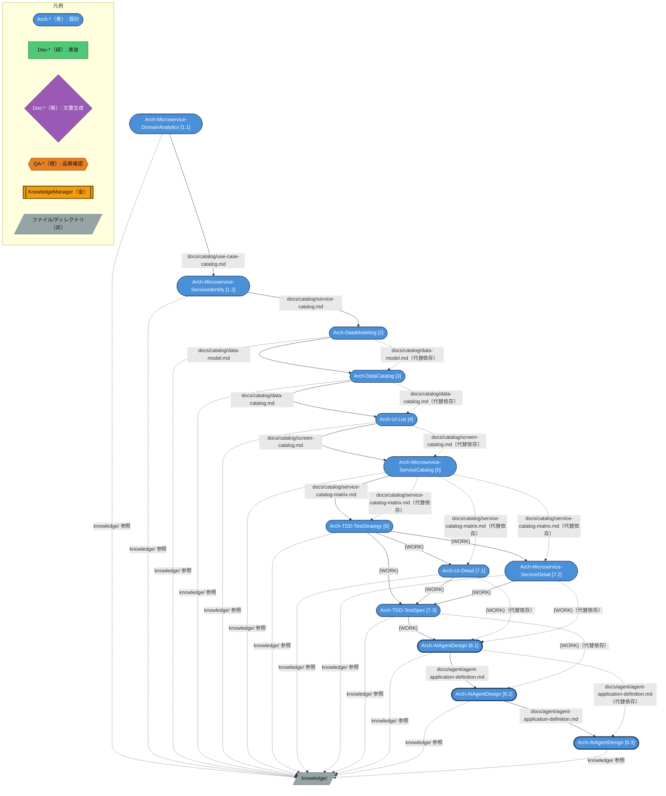

# アプリケーション設計 - Microservice

Microservice + Polyglot Persistence アーキテクチャを前提としたアプリケーション設計ガイドです（Step.1〜Step.8）。

> [!NOTE]
> フェーズ1（アプリケーションアーキテクチャ設計: Step.1〜Step.2）は [02-app-architecture-design.md](./02-app-architecture-design.md) を参照してください。
> **Step.1 以降** は **Microservice + Polyglot Persistence アーキテクチャ** を前提としたステップです。将来的に他のアーキテクチャ（Batch 等）向けの設計 Step が追加される予定です。

---

## 概要

### フローの目的・スコープ

Issue Form から親 Issue を作成するだけで、Step.1〜Step.8 の設計タスクが
Sub-issue として自動生成され、Copilot が依存関係に従って順次・並列実行するワークフローです。

> ⚠️ **前提条件**: このワークフローを実行する前に、以下のファイルが存在することを確認してください。
> - `docs/catalog/app-catalog.md` — App Architecture Design (Step.1) の成果物
> - `docs/catalog/use-case-catalog.md` — ユースケース定義（Step.1.1/1.2 の必須入力）

フェーズ1（アプリケーションアーキテクチャ設計: Step.1〜Step.2）は **App Architecture Design** を使用してください。

### 前提条件

- `docs/catalog/app-catalog.md` が存在すること（App Architecture Design の成果物）
- `docs/catalog/use-case-catalog.md` が存在すること
- セットアップ・トラブルシューティングは → [README.md 共通セットアップ手順](../README.md#共通セットアップ手順)

> 💡 **knowledge/ 参照**: `knowledge/` フォルダーに業務要件ドキュメント（D01〜D21: 事業意図・スコープ・業務プロセス・ユースケース・データモデル・セキュリティ等）が存在する場合、各ステップで業務コンテキストとして自動参照されます。設計精度を高めるため、事前に [km-guide.md](./km-guide.md) のワークフローを実行して `knowledge/` を充実させることを推奨します。


## Agent チェーン図（AAD）

以下の図は、このワークフローで使用される Custom Agent がファイルの入出力を介してどのように連鎖するかを示します。






### アーキテクチャ図

```
[Issue作成]
    │ label: auto-app-detail-design
    ▼
[Bootstrap Workflow]
    ├─ ラベル自動作成
    ├─ Step.1〜Step.8 の Sub-issue 一括生成
    ├─ step-1.1: aad:ready + aad:running + Copilot assign
    └─ 以下のステップはラベルなし（依存Step完了待ち）:
         step-1.2, step-2, step-3, step-4, step-5, step-6,
         step-7, step-7.1, step-7.2, step-7.3,
         step-8, step-8.1, step-8.2, step-8.3

[Step Issue aad:done ラベル付与または close]
    └─ [auto-app-detail-design.yml 状態遷移] → 依存関係チェック → 次 Step を aad:ready + aad:running + Copilot assign

[全 Step 完了] → 親 Issue に aad:done + 完了通知コメント（成果物リスト付き）
```

> 💡 **複数回実行**: App Architecture Design の成果物（`docs/catalog/app-catalog.md`）が存在していれば、App Detail Design は何度でも実行できます。別ブランチを指定することで、異なる設計方針を並行比較することも可能です。

---

## ツール

GitHub Copilot cloud agent を使用して、コードの作成や、Azure のリソースの作成などを行います。

---

## ステップ概要

### 依存グラフ

```
step-1.1 ──► step-1.2 ──► step-2 ──► step-3 ──► step-4 ──► step-5 ──► step-6
                                                                              │
                                                              ┌───────────────┤
                                                              ▼               ▼
                                                          step-7.1        step-7.2
                                                              │               │
                                                              └───────┬───────┘
                                                                      ▼
                                                                  step-7.3
                                                                      │
                                                                      ▼
                                                               step-8 (コンテナ)
                                                                      │
                                                                      ▼
                                                                  step-8.1
                                                                      │
                                                                      ▼
                                                                  step-8.2
                                                                      │
                                                                      ▼
                                                                  step-8.3
```

**step-1 / step-7 / step-8 はコンテナ Issue**（Sub Task の完了を待つ役割のみ）

> 📝 **step-8 の直列設計について**: step-8.1（アプリケーション定義）→ step-8.2（粒度設計）→ step-8.3（詳細設計）は **直列実行** です。各ステップの成果物が次のステップの入力になるため、並列実行はできません。

> ⚠️ **Step スキップ時の動作**: step-6（テスト戦略書）をスキップすると、step-7.1/7.2 が step-5 完了後に直接起動します。step-7.3 は step-7.1/7.2 が両方完了すれば（step-6 がスキップされていても）正常に起動します。step-8 は step-7.3 完了後に起動します（step-8 をスキップした場合は step-7.3 完了で全完了となります）。

### 各ステップの入出力

| Step ID | タイトル | Custom Agent | 入力 | 出力 | 依存 |
|---------|---------|-------------|------|------|------|
| step-1 | Step.1 コンテナ | — | — | — | フェーズ1（AAS）完了後 |
| step-1.1 | Step.1.1 ドメイン分析 | `Arch-Microservice-DomainAnalytics` | docs/catalog/use-case-catalog.md | docs/catalog/domain-analytics.md | フェーズ1（AAS）完了後 |
| step-1.2 | Step.1.2 サービス一覧抽出 | `Arch-Microservice-ServiceIdentify` | docs/catalog/use-case-catalog.md, docs/catalog/domain-analytics.md, docs/catalog/app-catalog.md | docs/catalog/service-catalog.md | step-1.1 |
| step-2 | Step.2 データモデル | `Arch-DataModeling` | docs/catalog/domain-analytics.md, docs/catalog/service-catalog.md, docs/catalog/app-catalog.md | docs/catalog/data-model.md, src/data/sample-data.json | step-1.2 |
| step-3 | Step.3 データカタログ | `Arch-DataCatalog` | docs/catalog/data-model.md, docs/catalog/domain-analytics.md, docs/catalog/app-catalog.md | docs/catalog/data-catalog.md | step-2 |
| step-4 | Step.4 画面一覧 | `Arch-UI-List` | docs/catalog/domain-analytics.md, docs/catalog/service-catalog.md, docs/catalog/data-model.md, docs/catalog/app-catalog.md | docs/catalog/screen-catalog.md | step-3 |
| step-5 | Step.5 サービスカタログ | `Arch-Microservice-ServiceCatalog` | docs/catalog/service-catalog.md, docs/catalog/data-model.md, docs/catalog/screen-catalog.md, docs/catalog/domain-analytics.md, docs/catalog/app-catalog.md | docs/catalog/service-catalog-matrix.md | step-4 |
| step-6 | Step.6 テスト戦略書 | `Arch-TDD-TestStrategy` | docs/catalog/service-catalog-matrix.md, docs/catalog/data-model.md, docs/catalog/domain-analytics.md, docs/catalog/service-catalog.md, docs/catalog/app-catalog.md, docs/catalog/screen-catalog.md, docs/catalog/data-catalog.md | docs/catalog/test-strategy.md | step-5 |
| step-7 | Step.7 コンテナ | — | — | — | step-6（またはスキップ時は step-5） |
| step-7.1 | Step.7.1 画面定義書 | `Arch-UI-Detail` | docs/catalog/screen-catalog.md, docs/catalog/app-catalog.md, docs/catalog/test-strategy.md（存在する場合） | docs/screen/<画面-ID>-<画面名>-description.md | step-6（またはスキップ時は step-5） |
| step-7.2 | Step.7.2 マイクロサービス定義書 | `Arch-Microservice-ServiceDetail` | docs/catalog/service-catalog-matrix.md, docs/catalog/app-catalog.md, docs/catalog/test-strategy.md（存在する場合） | docs/services/{serviceId}-{serviceNameSlug}-description.md | step-6（またはスキップ時は step-5） |
| step-7.3 | Step.7.3 TDDテスト仕様書 | `Arch-TDD-TestSpec` | docs/catalog/test-strategy.md（存在する場合）, docs/catalog/service-catalog-matrix.md, docs/catalog/data-model.md, docs/catalog/domain-analytics.md, docs/catalog/app-catalog.md, 画面定義書, サービス定義書 | `docs/test-specs/{serviceId}-test-spec.md`（サービスごとに1ファイル）+ `docs/test-specs/{screenId}-test-spec.md`（画面ごとに1ファイル）。Dev ワークフロー ASDW Step.2.3TC / Step.3.0TC の前提条件 | step-6（またはスキップ時は step-5）+ step-7.1 + step-7.2 |
| step-8 | Step.8 AI Agent 設計コンテナ | — | — | — | step-7.3 |
| step-8.1 | Step.8.1 AI Agent アプリケーション定義 | `Arch-AIAgentDesign` | docs/catalog/use-case-catalog.md, docs/catalog/service-catalog-matrix.md, docs/catalog/domain-analytics.md, docs/catalog/data-model.md, docs/catalog/service-catalog.md, docs/services/SVC-*.md, docs/catalog/app-catalog.md, users-guide/08-ai-agent.md | docs/agent/agent-application-definition.md | step-7.3 |
| step-8.2 | Step.8.2 AI Agent 粒度設計 | `Arch-AIAgentDesign` | Step.8.1 の成果物 + 上記入力 | docs/agent/agent-architecture.md | step-8.1 |
| step-8.3 | Step.8.3 AI Agent 詳細設計 | `Arch-AIAgentDesign` | Step.8.2 の成果物 + Agent Catalog | docs/agent/agent-detail-<Agent-ID>-<Agent名>.md, docs/ai-agent-catalog.md | step-8.2 |

---

## 手動実行ガイド

### Step 1. マイクロサービスアプリケーション定義書の作成

ユースケースの情報があれば、画面やサービス、データなど各種のモデリングが可能です。
ここからはマイクロサービスでの設計の進め方をある程度踏襲して、具体的な関連情報を文章化していきます。

#### Step 1.1. ドメイン分析の実施

ここでは作成されたユースケースから、業務上のドメイン分析を行います。

- 使用するカスタムエージェント
  - Arch-Microservice-DomainAnalytics

```text
# タスク
ユースケース文書を根拠に、DDD観点でドメイン分析（Bounded Context / ユビキタス言語 / 集約 / ドメインイベント / コンテキストマップ等）を整理し、docs/catalog/domain-analytics.md を作成する。

# 入力
- ユースケース文書: `docs/catalog/use-case-catalog.md`

# 出力（必須）
- `docs/catalog/domain-analytics.md`
```

#### Step 1.2. マイクロサービスの一覧の抽出

- 使用するカスタムエージェント
  - Arch-Microservice-ServiceIdentify

```text
# タスク
docs/ のドメイン分析からマイクロサービス候補を抽出し、service-list.md（サマリ表＋候補詳細＋Mermaidコンテキストマップ）を作成/更新する。

# 入力
- `docs/catalog/use-case-catalog.md`
- `docs/catalog/domain-analytics.md`
- `docs/catalog/app-catalog.md`（アプリケーション一覧 — 各サービス候補に APP-ID を紐付けること）

# 出力（必須）
- `docs/catalog/service-catalog.md`
  - 構成は必ず以下の順：
    - **A. サマリ（表）**
    - **B. サービス候補詳細（候補ごと）**
    - **C. Mermaid コンテキストマップ（末尾）**
```

---

### Step 2. データモデル作成

- 使用するカスタムエージェント
  - Arch-DataModeling

```text
# タスク
ドメイン分析とサービス一覧から全エンティティを抽出し、サービス境界と所有権を明確にしたデータモデル（Mermaid）と、日本語のサンプルデータ(JSON)を生成します

# 入力
- `docs/catalog/domain-analytics.md`
- `docs/catalog/service-catalog.md`
- `docs/catalog/app-catalog.md`（アプリケーション一覧 — Entity Catalog の各エンティティに APP-ID を紐付けること）

# 出力（必須）
## A) モデリングドキュメント
- `docs/catalog/data-model.md`

### B) サンプルデータ
- 原則：`src/data/sample-data.json`
```

---

### Step 3. データカタログの作成

概念設計（エンティティモデル）と物理テーブル/列名のマッピングを記録します。
このドキュメントはDevOpsの全てのプロセス（開発・テスト・デプロイ・運用）から参照・更新される横断的な成果物です。

- 使用するカスタムエージェント
  - Arch-DataCatalog

```text
# タスク
データモデル（docs/catalog/data-model.md）とドメイン分析（docs/catalog/domain-analytics.md）を根拠に、概念エンティティ × 物理テーブル/列のマッピングを記録するデータカタログを作成する（推測禁止、出典明記）。

# 入力
- `docs/catalog/data-model.md`（必須）
- `docs/catalog/domain-analytics.md`（必須）
- `docs/catalog/app-catalog.md`（アプリケーション一覧 — Entity-Table Mapping と Ownership Matrix に APP-ID を紐付けること）
- `docs/catalog/service-catalog.md`（存在すれば読む）
- `docs/catalog/service-catalog-matrix.md`（存在すれば読む）

# 出力（必須）
- `docs/catalog/data-catalog.md`
```

---

### Step 4. 画面一覧と遷移図の作成

- 使用するカスタムエージェント
  - Arch-UI-List

```text
# タスク
docs/ の資料から、ユースケースと画面の関係性のベストプラクティスを示したうえで、アクターの中の「人」毎の画面一覧（表）と画面遷移図（Mermaid）を設計し、screen-list.md と進捗ログを作成・更新する。

# 入力
- 最優先：
  - `docs/catalog/domain-analytics.md`
  - `docs/catalog/service-catalog.md`（機能/責務の補助）
  - `docs/catalog/data-model.md`（表示/入力項目の補助）
  - `docs/catalog/app-catalog.md`（アプリケーション一覧 — 各画面に所属 APP-ID を紐付けること。1画面:1APP）

# 出力（必須）
- 主要成果物：`docs/catalog/screen-catalog.md`
```

---

### Step 5. サービスカタログ表の作成

- カスタムエージェント
  - Arch-Microservice-ServiceCatalog

```text
# タスク
既存ドキュメントを根拠に、画面→機能→処理/API→SoTデータをマッピングしたサービスカタログを docs/catalog/service-catalog-matrix.md に生成/更新する（推測禁止、出典必須）。

# 入力（優先順位順）
原則として次の5ファイルを読む。無い場合は `search` で同等の資料を特定し、差分（不足・代替）を明記する。
- `docs/catalog/service-catalog.md`
- `docs/catalog/data-model.md`
- `docs/catalog/screen-catalog.md`
- `docs/catalog/domain-analytics.md`
- `docs/catalog/app-catalog.md`（アプリケーション一覧 — Table A に所属APP、Table C に利用APP を記載すること）

# 出力（必須）
- `docs/catalog/service-catalog-matrix.md`
```

---

### Step 6. テスト戦略書の作成

- カスタムエージェント
  - Arch-TDD-TestStrategy

```text
# タスク
サービスカタログの API 一覧・依存関係マトリクス・データモデルを根拠に、TDDのためのプロジェクト全体テスト戦略書を作成する（推測禁止、出典必須）。

# 入力（必読）
- `docs/catalog/service-catalog-matrix.md`
- `docs/catalog/data-model.md`
- `docs/catalog/domain-analytics.md`
- `docs/catalog/service-catalog.md`
- `docs/catalog/app-catalog.md`（アプリケーション一覧 — テスト戦略書でアプリ単位のサービス分類に参照）
- `docs/catalog/data-catalog.md`（存在すれば参照）
- `docs/catalog/screen-catalog.md`（存在すれば参照）

# 出力（必須）
- `docs/catalog/test-strategy.md`
```

---

### Step 7. 生成AIに最適化した各コンポーネントプロンプトの作成

Step 1〜Step 6 で作成した各設計成果物をもとに、生成AIに最適化したプロンプトを作成します。

#### Step 7.1. 画面定義書の作成

- カスタムエージェント
  - Arch-UI-Detail

```text
# タスク
docs/catalog/screen-catalog.md の全画面について、実装に使える画面定義書（UX/A11y/セキュリティ含む）を docs/screen/ に生成・更新する。

# 入力（必読）
必須:
- `docs/catalog/screen-catalog.md`

推奨（存在すれば読む）:
- `docs/catalog/app-catalog.md`（アプリケーション一覧 — 各画面定義書の「§1 概要」に所属 APP-ID を記載すること）
- `docs/catalog/domain-analytics.md`
- `docs/catalog/service-catalog.md`
- `docs/catalog/data-model.md`
- `docs/catalog/service-catalog-matrix.md`
- `docs/catalog/test-strategy.md`
- `data/sample-data.json`

# 出力（必須）
- `docs/screen/<画面-ID>-<画面名>-description.md`
```

#### Step 7.2. マイクロサービス定義書の作成

- カスタムエージェント
  - Arch-Microservice-ServiceDetail

```text
# タスク
ユースケース配下の全サービスについて、マイクロサービス詳細仕様（API/イベント/データ所有/セキュリティ/運用）をテンプレに沿って作成する

# 入力（必読）
1. 仕様テンプレ（本文構造の正）：`docs/templates/microservice-definition.md`
2. サービス定義（必ず最初に読む）:
   - `docs/catalog/domain-analytics.md`
   - `docs/catalog/service-catalog.md`
   - `docs/catalog/service-catalog-matrix.md`
   - `docs/catalog/data-model.md`
   - `docs/catalog/app-catalog.md`
3. テスト戦略（存在すれば読む）:
   - `docs/catalog/test-strategy.md`
4. サンプルデータ（値の転記は禁止。要約のみ）:
   - `src/data/sample-data.json`

# 成果物
- `docs/services/{serviceId}-{serviceNameSlug}-description.md`
```

#### Step 7.3. テスト仕様書の作成

- カスタムエージェント
  - Arch-TDD-TestSpec

> ⚠️ **Dev ワークフローとの連携**: このステップの成果物（`docs/test-specs/{serviceId}-test-spec.md` と `docs/test-specs/{screenId}-test-spec.md`）は Dev ワークフロー（ASDW Step.2.3TC / Step.3.0TC）の前提条件です。Dev ワークフローを実行する前に、このステップが完了していることを確認してください。

```text
# タスク
テスト戦略書の方針に基づき、対象サービスおよび画面のTDD用テスト仕様書をサービス定義書・画面定義書から導出して作成する（推測禁止、出典必須）。

# 入力（必読）
- `docs/catalog/test-strategy.md`
- `docs/services/{serviceId}-{serviceNameSlug}-description.md`
- `docs/screen/{screenId}-{screenNameSlug}-description.md`
- `docs/catalog/service-catalog-matrix.md`
- `docs/catalog/data-model.md`
- `docs/catalog/domain-analytics.md`
- `docs/catalog/app-catalog.md`

# 出力（必須）
- `docs/test-specs/{serviceId}-test-spec.md`（サービスごとに1ファイル）
- `docs/test-specs/{screenId}-test-spec.md`（画面ごとに1ファイル）
```

---

### Step 8. AI Agent 設計

ユースケースに AI Agent（チャット等）の適用が有効な場合に実施します。Step 7.3 の成果物を入力として、AI Agent の設計（アプリケーション定義・粒度設計・詳細設計）を一貫して実施します。

> ⚠️ **前提条件**: Step 7.3 が完了していること（`docs/services/`, `docs/catalog/service-catalog-matrix.md`, `docs/catalog/domain-analytics.md` 等が存在すること）

#### Step 8.1. AI Agent アプリケーション定義

- 使用するカスタムエージェント
  - Arch-AIAgentDesign

```text
# タスク
ユースケース記述を入力として、AI Agent のアプリケーション定義書（目的・スコープ・要求）を作成する。

# 入力（必読）
- `docs/catalog/use-case-catalog.md`（ユースケース記述）
- `docs/catalog/service-catalog-matrix.md`
- `docs/catalog/domain-analytics.md`
- `docs/catalog/data-model.md`
- `docs/catalog/service-catalog.md`
- `docs/services/SVC-*.md`（関連サービスのみ）
- `docs/catalog/app-catalog.md`
- `users-guide/08-ai-agent.md`（設計ガイドライン Step 1）

# 出力（必須）
- `docs/agent/agent-application-definition.md`
```

#### Step 8.2. AI Agent 粒度設計とアーキテクチャ骨格

- 使用するカスタムエージェント
  - Arch-AIAgentDesign

```text
# タスク
Step 8.1 のアプリケーション定義を入力として、AI Agent の粒度設計（Single/Multi 判断）と
アーキテクチャ骨格（Agent Catalog、Mermaid 図）を設計する。

# 入力（必読）
- `docs/agent/agent-application-definition.md`（Step 8.1 の成果物）
- `docs/catalog/service-catalog-matrix.md`, `docs/catalog/domain-analytics.md`, `docs/catalog/data-model.md`
- `docs/catalog/app-catalog.md`
- `users-guide/08-ai-agent.md`（設計ガイドライン Step 2）

# 出力（必須）
- `docs/agent/agent-architecture.md`
```

#### Step 8.3. AI Agent 詳細設計

- 使用するカスタムエージェント
  - Arch-AIAgentDesign

```text
# タスク
Step 8.2 の Agent Catalog の各 Agent について、詳細設計書（System Prompt・Tool Catalog・
I/O Contract・Guardrails 等）を作成し、Agent 一覧を更新する。

# 入力（必読）
- `docs/agent/agent-architecture.md`（Step 8.2 の成果物）
- `docs/agent/agent-application-definition.md`（Step 8.1 の成果物）
- `docs/catalog/service-catalog-matrix.md`, `docs/services/SVC-*.md`
- `docs/catalog/app-catalog.md`
- `users-guide/08-ai-agent.md`（設計ガイドライン Step 3）

# 出力（必須）
- `docs/agent/agent-detail-<Agent-ID>-<Agent名>.md`（Agent ごとに1ファイル）
- `docs/ai-agent-catalog.md`（Agent 一覧）
```

---

## 自動実行ガイド（ワークフロー）

### ラベル体系

| ラベル | 意味 |
|-------|------|
| `auto-app-detail-design` | このワークフローのトリガーラベル（Issue Template で自動付与） |
| `aad:initialized` | Bootstrap ワークフロー実行済み（二重実行防止） |
| `aad:ready` | 依存 Step が完了し、Copilot assign 可能な状態 |
| `aad:running` | Copilot assign 完了（実行中） |
| `aad:done` | Step 完了（状態遷移のトリガー） |
| `aad:blocked` | 依存関係の問題等でブロック状態 |

### 冪等性

- Bootstrap ワークフローは `aad:initialized` ラベルの有無で二重起動を防止します
- 既に存在する Step Issue は再作成されません

### 使い方（Issue 作成手順）

1. リポジトリの **Issues** タブ → **New Issue**
2. テンプレート **"App Detail Design"** を選択
3. 以下を入力:
   - **対象ブランチ**: 設計ドキュメントをコミットするブランチ名 (例: `main`)
   - **実行するステップ**: 実行したい Step にチェック（全て未選択の場合は全 Step 実行）
   - **追加コメント**: 補足・制約があれば記載
4. Issue を Submit → `auto-app-detail-design` ラベルが自動付与される

完了後、親 Issue にサマリコメントと Step Issue 一覧が投稿され、`step-1.1` の Step Issue に Copilot が assign されます。

### セットアップ・トラブルシューティング

共通のセットアップ手順とトラブルシューティングは → [README.md 共通セットアップ手順](../README.md#共通セットアップ手順)

**AAD 固有:**

- **前提条件ファイルが不足している場合**: `docs/catalog/app-catalog.md` が存在しない → **App Architecture Design** の Step.1 を先に実行してください
- **COPILOT_PAT シークレットの設定**:
  - リポジトリの Settings → Secrets and variables → Actions → `COPILOT_PAT` に PAT を設定
  - 必要な権限: Fine-grained PAT → Issues: Read and write、または Classic PAT → `repo`

---

## 動作確認手順

1. リポジトリで Actions の Workflow permissions を **Read and write** に設定する
2. `docs/catalog/app-catalog.md` が存在することを確認する（App Architecture Design の成果物）
3. `docs/catalog/use-case-catalog.md` が存在することを確認する
4. `.github/workflows/auto-app-detail-design.yml` がリポジトリに存在することを確認する
5. `.github/ISSUE_TEMPLATE/app-detail-design.yml` がリポジトリに存在することを確認する
6. Issues タブ → New Issue → **App Detail Design** テンプレートを選択する
7. 対象ブランチに `main` を入力し、Step.1 のみチェックして Issue を作成する
8. Actions タブで `AAD Orchestrator` の Bootstrap ジョブが起動したことを確認する
9. Bootstrap 完了後、Step.1.1 の Issue が作成され `aad:running` ラベルが付き Copilot が assign されることを確認する
10. step-1.1 の Issue を close し、状態遷移ジョブが起動することを確認する
11. step-1.2 に `aad:ready` + `aad:running` が付与され Copilot が assign されることを確認する
12. 同様に連鎖が継続し、step-7.3 → step-8.1 → step-8.2 → step-8.3 まで全 Step が順次・並列で完了することを確認する
13. 最終的に Root Issue に `aad:done` が付与され完了通知コメントが投稿されることを確認する
