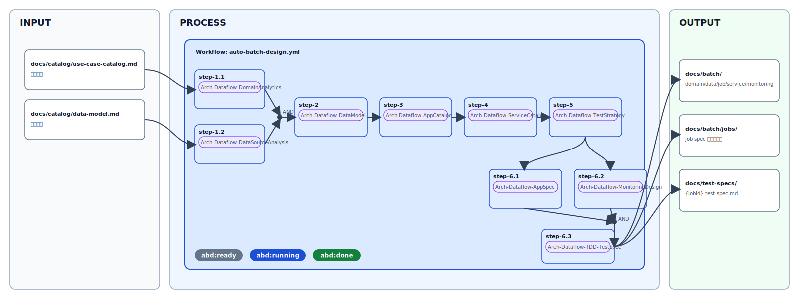
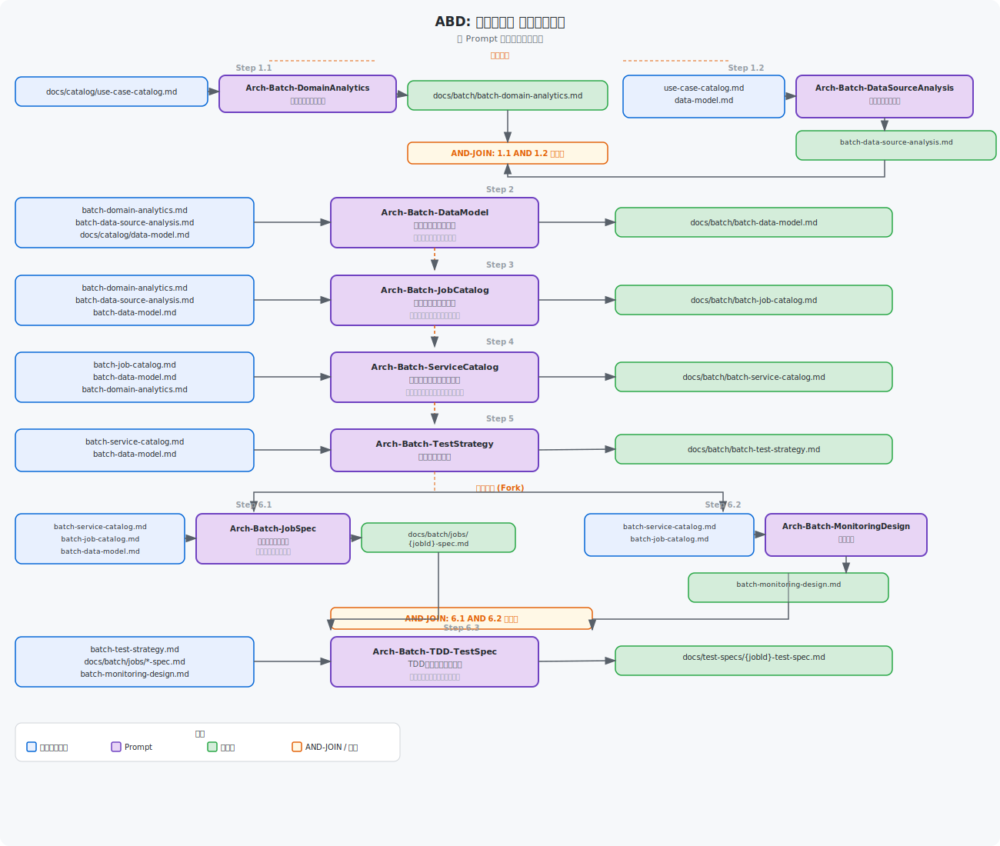

# アプリケーション設計 - Batch Data Processing

← [README](../README.md)

---

## 目次

- [概要](#概要)
- [Agent チェーン図（ADFD）](#agent-チェーン図abd)
- [ツール](#ツール)
- [ステップ概要](#ステップ概要)
- [手動実行ガイド](#手動実行ガイド)
- [自動実行ガイド（ワークフロー）](#自動実行ガイドワークフロー)
- [データフロー処理固有の設計ポイント](#データフロー処理固有の設計ポイント)
- [動作確認手順](#動作確認手順)

---
バッチデータ処理設計に必要なドキュメント群を、カスタムエージェントを使って順番に作成します。
ユースケースを入力として、ドメイン分析・データモデル・ジョブ設計・監視設計・TDDテスト仕様書まで
一貫して生成できます。

---

## 概要

### フローの目的・スコープ

Issue Form から親 Issue を作成するだけで、Step.1.1〜Step.6.3 のデータフロー処理設計タスクが
Sub-issue として自動生成され、Copilot が依存関係に従って順次・並列実行するワークフローです。

本ワークフローはバッチデータ処理に特化しており、以下の設計成果物を自動生成します:
- バッチドメイン分析（冪等性・トランザクション境界・最終的一貫性）
- データソース/デスティネーション分析
- バッチデータモデル（冪等性キー・パーティション戦略）
- ジョブ設計書（DAG・リトライ・チェックポイント/リスタート）
- サービスカタログ（Azureサービスマッピング）
- テスト戦略書（冪等性テスト・データ品質テスト・障害注入テスト）
- ジョブ詳細仕様書・監視運用設計書・TDDテスト仕様書

### 前提条件

- `docs/catalog/use-case-catalog.md` が存在すること（Step.1.1/1.2 の主入力）
- `docs/catalog/app-arch-catalog.md` が存在すること（APP-ID フィルタリングの正本）
- Architecture Design（AAS）ワークフローが完了していること
- セットアップ・トラブルシューティングは → [Cloud](./hve-cloud-getting-started.md) / [CLI](./hve-cli-getting-started.md) / [GUI](./hve-gui-getting-started.md)

> 💡 **knowledge/ 参照**: `knowledge/` フォルダーに業務要件ドキュメント（D01〜D21: 事業意図・スコープ・業務プロセス・ユースケース・データモデル・セキュリティ等）が存在する場合、各ステップで業務コンテキストとして自動参照されます。設計精度を高めるため、事前に [km-guide.md](./km-guide.md) のワークフローを実行して `knowledge/` を充実させることを推奨します。


## Agent チェーン図（ADFD）

以下の図は、このワークフローで使用される Custom Agent がファイルの入出力を介してどのように連鎖するかを示します。





### アーキテクチャ図



### データフロー図（ADFD）

以下の図は、各ステップで Custom Agent が読み書きするファイルのデータフローを示します。



---

## ツール

GitHub Copilot cloud agent を使用します。ツールの詳細は [README.md](../README.md) を参照してください。

---

## ステップ概要

### 依存グラフ

```
step-1.1 ──┐
            ├──► step-2 ──► step-3 ──► step-4 ──► step-5 ──► step-6.1 ──┐
step-1.2 ──┘                                                    └──► step-6.2 ──┤
                                                                                ▼
                                                                            step-6.3
```

**重要な依存関係:**
- `step-1.1` と `step-1.2` は**並列開始**されます
- `step-2` は `step-1.1` **AND** `step-1.2` の**両方が完了した後**に開始されます（AND依存）
- `step-6.1` と `step-6.2` は `step-5` 完了後に**並列開始**されます
- `step-6.3` は `step-6.1` **AND** `step-6.2` の**両方が完了した後**に開始されます（AND依存）

### 各ステップの入出力

| Step ID   | タイトル                                    | Custom Agent                   | 入力                                                                                         | 出力                                                    | 依存                      |
|-----------|---------------------------------------------|-------------------------------|----------------------------------------------------------------------------------------------|---------------------------------------------------------|---------------------------|
| step-1.1  | Step.1.1 バッチドメイン分析                 | Arch-Dataflow-DomainAnalytics     | docs/catalog/use-case-catalog.md                                                                         | docs/dataflow/dataflow-domain-analytics.md                    | なし                      |
| step-1.2  | Step.1.2 データソース/デスティネーション分析 | Arch-Dataflow-DataSourceAnalysis  | docs/catalog/use-case-catalog.md, docs/catalog/data-model.md（任意）                                             | docs/dataflow/dataflow-data-source-analysis.md                | なし                      |
| step-2    | Step.2 バッチデータモデル                   | Arch-Dataflow-DataModel           | docs/dataflow/dataflow-domain-analytics.md, docs/dataflow/dataflow-data-source-analysis.md, docs/catalog/data-model.md | docs/dataflow/dataflow-data-model.md                   | step-1.1 AND step-1.2     |
| step-3    | Step.3 ジョブ設計書                         | Arch-Dataflow-AppCatalog          | docs/dataflow/dataflow-domain-analytics.md, docs/dataflow/dataflow-data-source-analysis.md, docs/dataflow/dataflow-data-model.md | docs/dataflow/dataflow-app-catalog.md          | step-2                    |
| step-4    | Step.4 サービスカタログ（データフローアプリ版）   | Arch-Dataflow-ServiceCatalog      | docs/dataflow/dataflow-app-catalog.md, docs/dataflow/dataflow-data-model.md, docs/dataflow/dataflow-domain-analytics.md | docs/dataflow/dataflow-service-catalog.md             | step-3                    |
| step-5    | Step.5 テスト戦略書（バッチ固有）           | Arch-Dataflow-TestStrategy        | docs/dataflow/dataflow-service-catalog.md, docs/dataflow/dataflow-data-model.md                         | docs/dataflow/dataflow-test-strategy.md                       | step-4                    |
| step-6.1  | Step.6.1 データフローアプリ詳細仕様書             | Arch-Dataflow-AppSpec             | docs/dataflow/dataflow-service-catalog.md, docs/dataflow/dataflow-app-catalog.md, docs/dataflow/dataflow-data-model.md | docs/dataflow/apps/{jobId}-{jobNameSlug}-spec.md     | step-5                    |
| step-6.2  | Step.6.2 監視・運用設計書                   | Arch-Dataflow-MonitoringDesign    | docs/dataflow/dataflow-service-catalog.md, docs/dataflow/dataflow-app-catalog.md                        | docs/dataflow/dataflow-monitoring-design.md                   | step-5                    |
| step-6.3  | Step.6.3 TDDテスト仕様書                    | Arch-Dataflow-TDD-TestSpec        | docs/dataflow/dataflow-test-strategy.md, docs/dataflow/dataflow-service-catalog.md, docs/dataflow/apps/*-spec.md, docs/dataflow/dataflow-monitoring-design.md | docs/test-specs/{jobId}-test-spec.md           | step-6.1 AND step-6.2     |

---

## 手動実行ガイド

> [!TIP]
> Step.1.1 と Step.1.2 は並列で実行できます。いずれも主な入力は `docs/catalog/use-case-catalog.md` であり、Step.1.2 では必要に応じて `docs/catalog/data-model.md` も併用できるため、同時に依頼しても構いません。
> Step.2 以降は前段ステップの成果物を入力とするため、順番通りに進めてください。

### Step.1. データフロー処理ドメイン分析とデータソース分析

ユースケースの情報をもとに、データフロー処理に特化したドメイン分析とデータソース/デスティネーション分析を行います。
これらは独立しているため、**並列**で実行できます。

#### Step.1.1. ドメイン分析

- 使用するカスタムエージェント
  - Arch-Dataflow-DomainAnalytics

```text
# タスク
ユースケース文書を根拠に、データフロー処理の DDD 観点でのドメイン分析（Bounded Context / 冪等性 / チェックポイント / ジョブライフサイクルイベント / トランザクション境界）を整理し、docs/dataflow/dataflow-domain-analytics.md を作成する。

# 入力
- ユースケース文書: `docs/catalog/use-case-catalog.md`

# 出力（必須）
- `docs/dataflow/dataflow-domain-analytics.md`
```

#### Step.1.2. データソース/デスティネーション分析

- 使用するカスタムエージェント
  - Arch-Dataflow-DataSourceAnalysis

```text
# タスク
ユースケース文書を根拠に、データソースとデスティネーションの分析（スキーマ概要・データ量見積・変換ルール・SLA/SLO）を行い、docs/dataflow/dataflow-data-source-analysis.md を作成する。

# 入力
- `docs/catalog/use-case-catalog.md`
- `docs/catalog/data-model.md`（存在する場合のみ。任意）

# 出力（必須）
- `docs/dataflow/dataflow-data-source-analysis.md`
```

---

### Step.2. バッチデータモデル作成

- 使用するカスタムエージェント
  - Arch-Dataflow-DataModel

```text
# タスク
ドメイン分析結果とデータソース分析結果を根拠に、データフロー処理用の4層データモデル（入力/ステージング/中間/出力）・冪等性キー・パーティション戦略・ER 図（Mermaid）を設計し、docs/dataflow/dataflow-data-model.md を作成する。

# 入力
- `docs/dataflow/dataflow-domain-analytics.md`
- `docs/dataflow/dataflow-data-source-analysis.md`
- `docs/catalog/data-model.md`

# 出力（必須）
- `docs/dataflow/dataflow-data-model.md`
```

---

### Step.3. ジョブ設計書の作成

- 使用するカスタムエージェント
  - Arch-Dataflow-AppCatalog

```text
# タスク
ドメイン分析・データソース分析・データモデルを根拠に、データフローアプリの設計（ジョブ一覧・依存DAG・スケジュール・リトライ戦略）を行い、docs/dataflow/dataflow-app-catalog.md を作成する。

# 入力
- `docs/dataflow/dataflow-domain-analytics.md`
- `docs/dataflow/dataflow-data-source-analysis.md`
- `docs/dataflow/dataflow-data-model.md`

# 出力（必須）
- `docs/dataflow/dataflow-app-catalog.md`
```

---

### Step.4. サービスカタログ表の作成

- 使用するカスタムエージェント
  - Arch-Dataflow-ServiceCatalog

```text
# タスク
ジョブ設計カタログ・データモデル・ドメイン分析を統合してデータフローアプリ版のサービスカタログを作成し、docs/dataflow/dataflow-service-catalog.md を出力する（推測禁止、出典必須）。

# 入力（優先順位順）
- `docs/dataflow/dataflow-app-catalog.md`
- `docs/dataflow/dataflow-data-model.md`
- `docs/dataflow/dataflow-domain-analytics.md`

# 出力（必須）
- `docs/dataflow/dataflow-service-catalog.md`
```

---

### Step.5. テスト戦略書の作成

- 使用するカスタムエージェント
  - Arch-Dataflow-TestStrategy

```text
# タスク
バッチサービスカタログとデータモデルを根拠に、データフロー処理固有のテスト戦略書（冪等性テスト・データ品質テスト・大量データテスト・障害注入テスト・パフォーマンステスト）を策定し、docs/dataflow/dataflow-test-strategy.md を作成する。

# 入力（必読）
- `docs/dataflow/dataflow-service-catalog.md`
- `docs/dataflow/dataflow-data-model.md`

# 出力（必須）
- `docs/dataflow/dataflow-test-strategy.md`
```

---

### Step.6. ジョブ詳細仕様書・監視運用設計書の作成

Step.5 完了後、Step.6.1 と Step.6.2 は**並列**で実行できます。
Step.6.3 は Step.6.1 と Step.6.2 の**両方が完了してから**実行してください。

#### Step.6.1. ジョブ詳細仕様書

- 使用するカスタムエージェント
  - Arch-Dataflow-AppSpec

```text
# タスク
サービスカタログとジョブ設計に基づき、ジョブ毎の詳細仕様書を作成し、docs/dataflow/apps/{jobId}-{jobNameSlug}-spec.md を出力する。

# 入力
- `docs/dataflow/dataflow-service-catalog.md`
- `docs/dataflow/dataflow-app-catalog.md`
- `docs/dataflow/dataflow-data-model.md`

# 出力（必須）
- `docs/dataflow/apps/{jobId}-{jobNameSlug}-spec.md`（ジョブごとに1ファイル）
```

#### Step.6.2. 監視・運用設計書

- 使用するカスタムエージェント
  - Arch-Dataflow-MonitoringDesign

```text
# タスク
サービスカタログとジョブ設計に基づき、監視・運用設計書を作成し、docs/dataflow/dataflow-monitoring-design.md を出力する。

# 入力
- `docs/dataflow/dataflow-service-catalog.md`
- `docs/dataflow/dataflow-app-catalog.md`

# 出力（必須）
- `docs/dataflow/dataflow-monitoring-design.md`
```

#### Step.6.3. TDDテスト仕様書

- 使用するカスタムエージェント
  - Arch-Dataflow-TDD-TestSpec

```text
# タスク
テスト戦略書の方針に基づき、対象データフローアプリのTDD用テスト仕様書をジョブ詳細仕様書・監視運用設計書から導出して作成する（推測禁止、出典必須）。

# 入力（必読）
- `docs/dataflow/dataflow-test-strategy.md`
- `docs/dataflow/apps/*-spec.md`（全ジョブ分）
- `docs/dataflow/dataflow-monitoring-design.md`

# 出力（必須）
- `docs/test-specs/{jobId}-test-spec.md`（ジョブごとに1ファイル）
```

---

## 自動実行ガイド（ワークフロー）

### ラベル体系

| ラベル | 意味 |
|-------|------|
| `auto-dataflow-design` | このワークフローのトリガーラベル（Issue Template で自動付与） |
| `adfd:initialized` | Bootstrap ワークフロー実行済み（二重実行防止） |
| `adfd:ready` | 依存 Step が完了し、Copilot assign 可能な状態 |
| `adfd:running` | Copilot assign 完了（実行中） |
| `adfd:done` | Step 完了（状態遷移のトリガー） |
| `adfd:blocked` | 依存関係の問題等でブロック状態 |

### 冪等性

- Bootstrap ワークフローは `<!-- root-issue: #N -->` と `<!-- branch: ... -->` の HTML コメントタグで既存 Step Issue を検索します（既存 Orchestrator と同形式）
- 既に存在する Step Issue は再作成されません
- `auto-dataflow-design` ラベルを再付与しても安全に再実行できます

### 使い方（Issue 作成手順）

1. リポジトリの **Issues** タブ → **New Issue**
2. テンプレート **"Dataflow Design"** を選択
3. 以下を入力:

| フィールド | 入力内容 | 例 |
|---|---|---|
| 対象アプリケーション (APP-ID) | 対象 APP-ID をカンマ区切り（任意） | `APP-02, APP-03` |
| 対象ブランチ | 設計ドキュメントをコミットするブランチ | `main` |
| 実行 Runner | GitHub Hosted または Self-hosted (ACA) | `GitHub Hosted` |
| 実行するステップ | 実行したい Step にチェック（全未選択 = 全実行） | （全選択推奨） |
| 使用するモデル | Copilot が使用する LLM モデル（任意） | `Auto` |
| レビュー用モデル | セルフレビュー用モデル（任意） | `Auto` |
| QA 用モデル | 実行前 QA 用モデル（任意） | `Auto` |
| レビュー設定 | セルフレビュー（auto-context-review）有効化（任意） | チェックなし（デフォルト） |
| 質問票設定 | 実行前 QA 質問票の有効化（任意） | チェックなし（デフォルト） |
| 自己改善ループ設定 | 全 Step 完了後の自動改善有効化（任意） | チェックなし（デフォルト） |
| 自己改善 最大イテレーション数 | 自己改善ループの最大繰り返し回数（任意） | `3` |
| 自己改善 品質スコア目標値 | 改善完了とみなす品質スコア（任意） | `80（標準）` |
| PR 完全自動化設定 | Approve & Auto-merge 有効化（任意・注意要） | チェックなし（デフォルト） |
| 追加コメント | 補足・制約・注意事項（任意） | データソース・スケジュール等 |

4. Issue を Submit → `auto-dataflow-design` ラベルが自動付与される

### 方式設定

**方式A: 一括作成 + 状態遷移管理（デフォルト）**

Bootstrap ワークフローが全 Step Issue を一括作成し、最初に実行可能な Step（`step-1.1` と `step-1.2`）にのみ `adfd:ready` + `adfd:running` を付与します。Step close / `adfd:done` ラベル付与時に状態遷移ワークフローが依存関係を確認して次 Step を起動します。

**メリット**: 全 Step が親 Issue の Sub-issue として最初から見える  
**デメリット**: 開始前から多数の Issue が表示される

### セットアップ・トラブルシューティング

共通のセットアップ手順とトラブルシューティングは → [Cloud](./hve-cloud-getting-started.md) / [CLI](./hve-cli-getting-started.md) / [GUI](./hve-gui-getting-started.md)

**ADFD 固有のトラブルシューティング:**

- **step-2 が step-1.1 または step-1.2 完了後に起動しない**: `step-2` は `step-1.1` **AND** `step-1.2` の**両方が完了**するまで起動しません（AND依存の仕様）

---

## データフロー処理固有の設計ポイント

### 冪等性設計

ジョブの再実行が安全であることを保証するための設計方針です。

- **冪等性キー**: 各レコードに一意のキー（バッチID + レコードID など）を付与し、重複処理を防ぐ
- **冪等チェック**: 処理前に出力先の存在確認を行い、既処理済みレコードをスキップする
- **再実行戦略**: 全件再処理（フルリロード）か差分処理（増分）かを設計段階で明確にする
- **マーカーテーブル**: 処理済みバッチのIDや処理日時を記録するマーカーテーブルを設ける

### チェックポイント/リスタート

障害発生時に途中から再開できる仕組みを設計します。

- **チェックポイント間隔**: 処理レコード数やパーティション単位でチェックポイントを設ける
- **ステート管理**: Azure Blob Storage や Cosmos DB にチェックポイント状態を永続化する
- **リスタートロジック**: 前回のチェックポイントから処理を再開する仕組みを実装する
- **Durable Functions**: Azure Functions Durable Functions のオーケストレーション機能を活用し、チェックポイント/リスタートを実現する

### データ品質

入力データのバリデーションと変換後のデータ品質チェックを行います。

- **入力バリデーション**: スキーマチェック・NULL チェック・範囲チェックを処理前に実施する
- **変換品質**: 変換後のレコード数・集計値の正確性を確認する
- **データ品質ルール**: 業務固有のデータ品質ルール（重複排除・参照整合性など）を定義する
- **品質メトリクス**: 処理件数・スキップ件数・エラー件数を計測・記録する

### 監視・アラート

ジョブの実行状態を継続的に監視し、異常を早期検知します。

- **実行時間監視**: ジョブの実行時間が SLA を超過した場合にアラートを発報する
- **処理レコード数監視**: 想定範囲外のレコード数が処理された場合にアラートを発報する
- **エラー率監視**: エラー率が閾値を超えた場合にアラートを発報する
- **Azure Monitor**: Application Insights + Azure Monitor Alerts を活用して監視基盤を構築する

### スケジューリング

cron 式によるスケジュール定義とジョブ間の時間的依存を管理します。

- **cron 式**: Azure Functions Timer Trigger の cron 式（例: `0 0 2 * * *` = 毎日 2:00 AM）でスケジュールを定義する
- **ジョブ間依存**: 前段ジョブの完了を確認してから後段ジョブを起動する（Durable Functions のオーケストレーションを推奨）
- **タイムゾーン**: UTC/JST の混在に注意し、スケジュール設計時に明示する
- **遅延実行**: 前段ジョブの遅延が後段ジョブに影響しないよう、十分なバッファ時間を設ける

---

## 動作確認手順

### フォーム表示の確認

1. `.github/ISSUE_TEMPLATE/batch-design.yml` がリポジトリに存在することを確認する
2. Issues タブ → New Issue → **Dataflow Design** テンプレートが表示されることを確認する
3. テンプレートのフォームフィールド（APP-ID・ブランチ・Runner・ステップ選択・モデル設定・レビュー設定・質問票設定・自己改善設定・自己改善 最大イテレーション数・自己改善 品質スコア目標値・PR 自動化設定・追加コメント）が正しく表示されることを確認する

### 自動実行の確認チェックリスト

1. リポジトリで Actions の Workflow permissions を **Read and write** に設定する
2. `.github/workflows/auto-orchestrator-dispatcher.yml` がリポジトリに存在することを確認する
3. 対象ブランチに `main` を入力し、Step.1.1 と Step.1.2 のみチェックして Issue を作成する
4. Actions タブで `auto-orchestrator-dispatcher.yml` の Bootstrap ジョブが起動したことを確認する
5. Bootstrap 完了後、Step.1.1 と Step.1.2 の Issue が**両方とも** `adfd:running` ラベル付きで作成されたことを確認する（並列開始）
6. 親 Issue にサマリコメントと Step Issue 一覧が投稿されたことを確認する
7. step-1.1 の Issue を close し、`auto-orchestrator-dispatcher.yml` の状態遷移ジョブが起動することを確認する
8. step-1.2 がまだ完了していないため、step-2 が起動しないことを確認する（AND依存の確認）
9. step-1.2 の Issue を close し、step-2 に `adfd:ready` + `adfd:running` が付与され Copilot が assign されることを確認する（AND依存解消）
10. Step.1.1/1.2/2〜6 すべてを選択して Issue を作成し直し、全 Step Issue が生成されることを確認する
11. Step.4 を close して step-5 が起動することを確認する
12. Step.5 を close して step-6.1 と step-6.2 が**並列で**開始されることを確認する
13. step-6.1 を close して step-6.3 がまだ起動しないことを確認する（step-6.2 が未完了のため）
14. step-6.2 を close して step-6.3 が自動起動することを確認する（AND依存）
15. step-6.3 を close して Root Issue に完了通知コメントが投稿されることを確認する
