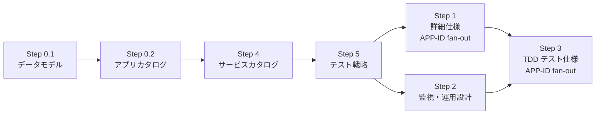

# アプリケーション設計 - Dataflow Design（ADFD）

← [README](../README.md)

> **確認日: 2026-08-07**
> 現行 ADFD の実行契約は
> [`hve/workflow_registry.py`](../hve/workflow_registry.py) の `ADFD` 定義です。
> 完全な 7 Step を実行する場合は **HVE CLI / GUI のローカル実行経路**を使用してください。
> GitHub Issue Form から始まる Cloud 経路は、現時点では 3 Step のままです。

## 目次

- [概要](#概要)
- [前提条件](#前提条件)
- [現行 7 Step](#現行-7-step)
- [開始方法](#開始方法)
- [完了確認](#完了確認)
- [後続 ADFDV への引き渡し](#後続-adfdv-への引き渡し)
- [カスタマイズ](#カスタマイズ)
- [検証](#検証)
- [既知の制約](#既知の制約)
- [非現行仕様](#非現行仕様)
- [正本と関連テスト](#正本と関連テスト)

## 概要

ADFD は、AAS（Application Architecture Selection）が生成した共通カタログを入力に、
データフロー処理のデータモデル、ジョブカタログ、サービスカタログ、テスト戦略、
APP-ID 単位の詳細仕様、監視・運用設計、TDD テスト仕様を作成するワークフローです。

現行構成は次の **7 Step** です。


```mermaid
flowchart LR
    S01["Step 0.1<br>データモデル"] --> S02["Step 0.2<br>アプリカタログ"]
    S02 --> S4["Step 4<br>サービスカタログ"]
    S4 --> S5["Step 5<br>テスト戦略"]
    S5 --> S1["Step 1<br>詳細仕様<br>APP-ID fan-out"]
    S5 --> S2["Step 2<br>監視・運用設計"]
    S1 --> S3["Step 3<br>TDD テスト仕様<br>APP-ID fan-out"]
    S2 --> S3
```

Step ID が数値順でないのは、既存の Step 1 / 2 / 3 と下流契約を維持しながら、
不足していた producer Step を上流へ追加したためです。表示順ではなく、
`depends_on` で定義された DAG を参照してください。

## 前提条件

### 必須成果物

先に AAS（[02-app-architecture-design.md](./02-app-architecture-design.md)）を完了し、次の共通カタログを用意します。

- `docs/catalog/app-arch-catalog.md`
  - 対象 APP-ID の自動選択とアーキテクチャ種別フィルタに使用します。
- `docs/catalog/app-catalog.md`
- `docs/catalog/data-model.md`
- `docs/catalog/service-catalog-matrix.md`
- `docs/catalog/test-strategy.md`

不足ファイルがある場合は ADFD で補完せず、AAS を完了または再実行してください。

### 実行環境

- CLI の準備: [HVE CLI Orchestrator はじめかた](./hve-cli-getting-started.md)
- GUI の準備: [HVE GUI Orchestrator はじめかた](./hve-gui-getting-started.md)
- 詳細な CLI オプション: [HVE CLI Orchestrator ユーザーガイド](./hve-cli-orchestrator-guide.md)
- 詳細な GUI 操作: [HVE GUI Orchestrator ガイド](./hve-gui-orchestrator-guide.md)

`knowledge/` に確定済みの業務要件がある場合、各 Prompt は関連する D01〜D21 を
任意入力として参照します。整備方法は [Knowledge Management ガイド](./km-guide.md) を参照してください。

## 現行 7 Step

### Step 一覧

| Step | Prompt | 必須入力 | 主成果物 | 依存 |
|---|---|---|---|---|
| `0.1` | [`Arch-Dataflow-DataModel`](../.github/prompts/Arch-Dataflow-DataModel.prompt.md) | `docs/catalog/app-catalog.md`<br>`docs/catalog/data-model.md` | `docs/dataflow/dataflow-data-model.md` | なし（DAG root） |
| `0.2` | [`Arch-Dataflow-AppCatalog`](../.github/prompts/Arch-Dataflow-AppCatalog.prompt.md) | `docs/catalog/app-catalog.md`<br>`docs/catalog/service-catalog-matrix.md`<br>`docs/dataflow/dataflow-data-model.md` | `docs/dataflow/dataflow-app-catalog.md` | `0.1` |
| `4` | [`Arch-Dataflow-ServiceCatalog`](../.github/prompts/Arch-Dataflow-ServiceCatalog.prompt.md) | `docs/catalog/service-catalog-matrix.md`<br>`docs/dataflow/dataflow-app-catalog.md` | `docs/dataflow/dataflow-service-catalog.md` | `0.2` |
| `5` | [`Arch-Dataflow-TestStrategy`](../.github/prompts/Arch-Dataflow-TestStrategy.prompt.md) | `docs/catalog/test-strategy.md`<br>`docs/dataflow/dataflow-app-catalog.md`<br>`docs/dataflow/dataflow-service-catalog.md` | `docs/dataflow/dataflow-test-strategy.md` | `4` |
| `1` | [`Arch-Dataflow-AppSpec`](../.github/prompts/Arch-Dataflow-AppSpec.prompt.md) | `docs/catalog/app-catalog.md`<br>`docs/catalog/data-model.md`<br>`docs/catalog/service-catalog-matrix.md` | `docs/dataflow/apps/{APP-ID}-spec.md` | `5`、APP-ID fan-out |
| `2` | [`Arch-Dataflow-MonitoringDesign`](../.github/prompts/Arch-Dataflow-MonitoringDesign.prompt.md) | `docs/catalog/app-catalog.md`<br>`docs/catalog/service-catalog-matrix.md` | `docs/dataflow/dataflow-monitoring-design.md` | `5` |
| `3` | [`Arch-Dataflow-TDD-TestSpec`](../.github/prompts/Arch-Dataflow-TDD-TestSpec.prompt.md) | `docs/catalog/test-strategy.md`<br>`docs/catalog/service-catalog-matrix.md`<br>`docs/dataflow/apps/{APP-ID}-spec.md`<br>`docs/dataflow/dataflow-monitoring-design.md` | `docs/test-specs/{APP-ID}-test-spec.md` | `1` **AND** `2`、APP-ID fan-out |

> [!NOTE]
> **ADI を先に実行している場合**、`docs/dataflow/dataflow-app-catalog.md` に `## 設計書由来の候補（ADI）` セクションがあります。既存設計書（`batch-job-spec`）から抽出されたジョブ候補で、原本に記載されていた Job-ID は `根拠` 列に記録されています。Step `0.2` がこのセクションを読んでジョブ一覧表へ統合します。詳細は [00-design-doc-ingestion.md](./00-design-doc-ingestion.md#adi-と設計ワークフローard--aas--adfdの関係) を参照してください。

### 依存関係

- `0.1 → 0.2 → 4 → 5` は直列です。
- Step `5` の完了後、Step `1` と Step `2` を並列実行できます。
- Step `3` は Step `1` と Step `2` の両方が成功した後に実行されます。
- Step `1` と Step `3` の fan-out キーは、現行 `dataflow_catalog` parser が返す APP-ID です。
- 実行順と成果物パスは registry、成果物の章立て・品質条件は各 Prompt、
  Step 本文は [ADFD Step Prompt](../.github/prompts/steps/adfd/) が担当します。

## 開始方法

### CLI（完全な 7 Step を実行可能）

リポジトリルートで実行します。初回は `--steps` を省略し、全 Step を実行してください。

```powershell
$appId = Read-Host "対象 APP-ID"
python -m hve orchestrate --workflow adfd --strict --app-ids $appId
```

- `--app-ids` はカンマ区切りで複数指定できます。
- `--app-ids` を省略すると、`docs/catalog/app-arch-catalog.md` から ADFD 対象が選択されます。
- `--strict` は必須入力や Skill の pre-check 失敗時に停止させる推奨指定です。
- 全 Agent に追加制約を渡す場合は `--additional-prompt "..."` を使用できます。
- `--steps` による部分実行は、選択 Step の全上流成果物がすでに有効な場合だけ使用してください。

### GUI（CLI と同じ 7 Step registry を使用）

1. Windows は `hve.cmd gui`、macOS / Linux は `./hve.sh gui` で起動します。
2. Step 1 で **Dataflow Design (`adfd`)** を選択します。
3. 対象 APP-ID を選択し、初回は全 Step を選択します。
4. Step 2 で実行を開始します。

GUI は選択内容を `python -m hve orchestrate --workflow adfd ...` の引数へ変換して
子プロセスを起動するため、DAG・Prompt・成果物ゲートは CLI と共通です。

### Cloud（現時点では完全な 7 Step を実行不可）

Cloud の経路は次のファイルで構成されます。

1. [`dataflow-design.yml`](../.github/ISSUE_TEMPLATE/dataflow-design.yml) から Root Issue を作成
2. [`auto-orchestrator-dispatcher.yml`](../.github/workflows/auto-orchestrator-dispatcher.yml) が ADFD を判定
3. [`auto-dataflow-design-reusable.yml`](../.github/workflows/auto-dataflow-design-reusable.yml) が Step Issue を生成・状態遷移

ただし、Issue Form と reusable workflow は現在も Step `1` / `2` / `3` のみを生成します。
Step `0.1` / `0.2` / `4` / `5` を生成しないため、**Cloud の `adfd:done` は
現行 registry の 7 Step 完了を意味しません**。完全な ADFD の開始・完了判定には
CLI または GUI を使用してください。

## 完了確認

### 機械的な完了条件

CLI は次の場合に終了コード `1` を返します。

- `blocked`、`error`、`failed` のいずれかが記録された
- Code Review Agent が失敗した
- CLI / GUI の output-path gate で宣言済み成果物の欠落を検出した

したがって、まず **プロセスの終了コード `0`** を確認します。そのうえで、選択した APP-ID ごとに
次の成果物が存在し、空でないことを確認してください。

- [ ] `docs/dataflow/dataflow-data-model.md`
- [ ] `docs/dataflow/dataflow-app-catalog.md`
- [ ] `docs/dataflow/dataflow-service-catalog.md`
- [ ] `docs/dataflow/dataflow-test-strategy.md`
- [ ] `docs/dataflow/apps/{APP-ID}-spec.md`
- [ ] `docs/dataflow/dataflow-monitoring-design.md`
- [ ] `docs/test-specs/{APP-ID}-test-spec.md`

### 内容契約の確認

output-path gate はファイルの存在を確認しますが、内容の完全性までは保証しません。
最低限、次を確認します。

- `dataflow-app-catalog.md` に `## 1. ジョブ一覧表` がある
- `dataflow-service-catalog.md` に `## 2. ジョブ → Azure サービスマッピング表` がある
- `dataflow-test-strategy.md` に `## 4. テストダブル戦略` があり、
  Azurite / Testcontainers の利用有無が明記されている
- Step `1` の対象 APP-ID と仕様書の件数が一致する
- Step `3` の対象 APP-ID とテスト仕様書の件数が一致する
- 各成果物の未確定事項が推測で補完されず、`TBD` または `不明（要確認）` として残されている

> Cloud の Root Issue に `adfd:done` が付いていても、この 7 成果物を満たさない限り、
> 本ガイドでは現行 ADFD 完了と判定しません。

## 後続 ADFDV への引き渡し

現行 ADFD の Step `0.1` / `0.2` / `4` / `5` は、ADFDV が必要とする producer 不在を
解消するために追加されています。ADFDV が使用する主な対応は次のとおりです。

| ADFD 成果物 | 主な ADFDV 利用 Step |
|---|---|
| `dataflow-data-model.md` | `2.1`、`2.2` |
| `dataflow-app-catalog.md` | `1.1`、`1.2`、`2.2`、`3` |
| `dataflow-service-catalog.md` | `1.1`、`1.2`、`2.1`、`2.2`、`3` |
| `dataflow-test-strategy.md` | `2.1` |
| `apps/{APP-ID}-spec.md` | `1.1`、`1.2`、`2.1`、`2.2`、`3` |
| `dataflow-monitoring-design.md` | `1.1`、`1.2`、`2.2`、`3` |
| `{APP-ID}-test-spec.md` | `2.1`、`2.2` |

7 Step の完了確認後、同じ APP-ID を指定して ADFDV を開始します。

```powershell
$appId = Read-Host "対象 APP-ID"
$resourceGroup = Read-Host "Azure リソースグループ名"
python -m hve orchestrate --workflow adfdv --strict --app-ids $appId --resource-group $resourceGroup
```

詳細は [Dataflow Dev（ADFDV）ガイド](./06-app-dev-dataflow-azure.md) を参照してください。

> **参照時の注意**: 上記 ADFDV ガイドの冒頭移行ノートと必須ドキュメント表は、
> producer 4 Step 復活前の記述です。ADFD の前提・成果物は本ガイドと
> [`hve/workflow_registry.py`](../hve/workflow_registry.py) を優先し、ADFDV ガイドは
> 下流 7 Step の操作概要として参照してください。

旧 `docs/dataflow/dataflow-domain-analytics.md` と
`docs/dataflow/dataflow-data-source-analysis.md` は、現行 ADFDV の `required_input_paths` ではありません。
ADFDV の準備として新規作成しないでください。

## カスタマイズ

### 実行時だけ追加指示を与える

永続契約を変更せず、全 ADFD Agent に制約を追加する場合は CLI の
`--additional-prompt` を使用します。成果物パスや依存関係は上書きせず、業務上の補足だけを渡してください。

### 永続契約を変更する

変更箇所は責務別に分かれています。

| 変更対象 | 正本 |
|---|---|
| Step ID、依存、Agent、fan-out、成果物パス | [`hve/workflow_registry.py`](../hve/workflow_registry.py) |
| Step Issue / 実行本文 | [`.github/prompts/steps/adfd/`](../.github/prompts/steps/adfd/) |
| 成果物の内容・章立て・品質条件 | [`.github/prompts/Arch-Dataflow-*.prompt.md`](../.github/prompts/) |
| 入出力 producer / consumer 契約 | [`.github/io-contracts/`](../.github/io-contracts/) の `Arch-Dataflow-*--adfd--*.yaml` |
| データフロー設計テンプレート | [`dataflow-design-guide`](../.github/skills/dataflow-design-guide/SKILL.md) |
| APP-ID fan-out の追加指示 | [`.github/prompts/fanout/adfd/_common.prompt.md`](../.github/prompts/fanout/adfd/_common.prompt.md) |
| Cloud のフォームと状態遷移 | [`dataflow-design.yml`](../.github/ISSUE_TEMPLATE/dataflow-design.yml) と [`auto-dataflow-design-reusable.yml`](../.github/workflows/auto-dataflow-design-reusable.yml) |

registry の変更は Cloud reusable workflow へ自動同期されません。Cloud 対応を変更する場合は、
Issue Form、reusable workflow、Step template、Prompt、io-contract、関連テストを同じ変更で同期してください。

## 検証

ADFD 契約を変更した場合は、少なくとも次を実行します。

```powershell
python -m pytest hve/tests/test_adfd_dataflow_design_agents.py hve/tests/test_workflow_registry.py hve/tests/test_runner_split_required_guard.py -q
python -m pytest hve/tests/test_fanout.py -q
```

確認対象は次のとおりです。

- registry の Step 数・Agent・依存・出力が 7 Step 契約と一致する
- 追加された 4 producer Step の Prompt、Step template、io-contract が存在し、
  その出力契約が registry と一致する
- Step `0.1` が唯一の DAG root である
- Step `1` / `2` が Step `5` に依存し、Step `3` が Step `1` **AND** Step `2` に依存する
- CLI / GUI の output-path gate が欠落成果物を失敗として扱う
- `dataflow_catalog` fan-out が APP-ID を使用する
- 変更した YAML が parse できる
- Markdown のローカルリンクが実在し、Markdown lint と `git diff --check` が通る

`test_fanout.py` には旧 Step `6.1` / `6.3` のコメントと条件付き assertion が残るため、
現行 Step 数・依存・Prompt 契約の正本テストには
`test_adfd_dataflow_design_agents.py` と `test_workflow_registry.py` を使用してください。

## 既知の制約

### Cloud とローカル registry の非同期

- [`dataflow-design.yml`](../.github/ISSUE_TEMPLATE/dataflow-design.yml) は 3 Step のみを表示します。
- [`auto-dataflow-design-reusable.yml`](../.github/workflows/auto-dataflow-design-reusable.yml) は
  Step `1` / `2` / `3` のみを生成し、Step `0.1` / `0.2` / `4` / `5` を生成しません。
- Cloud の `adfd:done` は 3 Step の状態遷移完了であり、ローカル registry の 7 Step 完了ではありません。

### APP-ID / Job-ID と Prompt 表記のドリフト

- registry と fan-out parser の実行キーは APP-ID です。
- Step `1` template には `{jobId}-{jobNameSlug}` 表記、Step `3` template には
  `{jobId}` 表記が残りますが、対応する Prompt と registry の実行時成果物は
  APP-ID キーの `{APP-ID}-spec.md` / `{APP-ID}-test-spec.md` です。
- `Arch-Dataflow-TDD-TestSpec` Prompt と fan-out 共通指示には旧 Step `4.5` / `5.1` / `5.2` /
  `6.1` / `6.2` / `6.3` 表記が残ります。実行順は registry の `1` / `2` / `3` を正とします。
- ADFDV Step `2.1` / `2.2` の `{jobId}-{jobNameSlug}` を含む出力宣言は、
  APP-ID しか返さない parser では解決できず、output-path gate から fail-closed で除外されます。
  ADFDV 実行時は該当するテスト／実装ディレクトリを別途確認してください。

### 3 Step 画像

次の既存 SVG は 3 Step 構成を表すため、現行 DAG の説明には使用していません。

- `users-guide/images/chain-adfd.svg`
- `users-guide/images/infographic-adfd.svg`
- `users-guide/images/orchestration-task-data-flow-adfd.svg`

## 非現行仕様

[`CHANGELOG.md`](../CHANGELOG.md) に記録された経緯として、ADFD は一度、
独立カタログを生成する旧 9 Step から AAS 共通カタログを直接参照する
3 Step へ縮小されました。その後、ADFDV に必要な producer 不在を解消するため、
Step `0.1` / `0.2` / `4` / `5` が追加され、現在の 7 Step になっています。

次は非現行であり、実行手順として使用しません。

- `Arch-Dataflow-DomainAnalytics` / 旧 Step `1.1`
- `Arch-Dataflow-DataSourceAnalysis` / 旧 Step `1.2`
- `docs/dataflow/dataflow-domain-analytics.md`
- `docs/dataflow/dataflow-data-source-analysis.md`
- 3 Step だけを「現行 ADFD 全体」とする説明
- 旧 Step `6.1` / `6.2` / `6.3` の番号

一方、次の4成果物は一度廃止された後に producer が復活した **現行の必須成果物**です。
旧成果物として削除・省略しないでください。

- `docs/dataflow/dataflow-data-model.md`
- `docs/dataflow/dataflow-app-catalog.md`
- `docs/dataflow/dataflow-service-catalog.md`
- `docs/dataflow/dataflow-test-strategy.md`

## 正本と関連テスト

### 実装正本

- Step / DAG / 成果物: [`hve/workflow_registry.py`](../hve/workflow_registry.py)
- CLI 入口と終了コード: [`hve/__main__.py`](../hve/__main__.py)
- ローカル成果物ゲート: [`hve/runner.py`](../hve/runner.py)
- GUI の引数生成と起動: [`hve/gui/main_window.py`](../hve/gui/main_window.py)、
  [`hve/gui/state_bridge.py`](../hve/gui/state_bridge.py)
- Step template: [`.github/prompts/steps/adfd/`](../.github/prompts/steps/adfd/)
- Prompt: [`.github/prompts/`](../.github/prompts/)
- io-contract: [`.github/io-contracts/`](../.github/io-contracts/)
- Cloud dispatcher: [`auto-orchestrator-dispatcher.yml`](../.github/workflows/auto-orchestrator-dispatcher.yml)
- Cloud reusable workflow: [`auto-dataflow-design-reusable.yml`](../.github/workflows/auto-dataflow-design-reusable.yml)
- 変更履歴: [`CHANGELOG.md`](../CHANGELOG.md)

### 回帰テスト

- 追加 4 producer Step の Prompt / template / io-contract と ADFD 7 Step registry:
  [`hve/tests/test_adfd_dataflow_design_agents.py`](../hve/tests/test_adfd_dataflow_design_agents.py)
- workflow Step 数・registry 基本契約:
  [`hve/tests/test_workflow_registry.py`](../hve/tests/test_workflow_registry.py)
- APP-ID fan-out:
  [`hve/tests/test_fanout.py`](../hve/tests/test_fanout.py)
- output-path gate:
  [`hve/tests/test_runner_split_required_guard.py`](../hve/tests/test_runner_split_required_guard.py)
