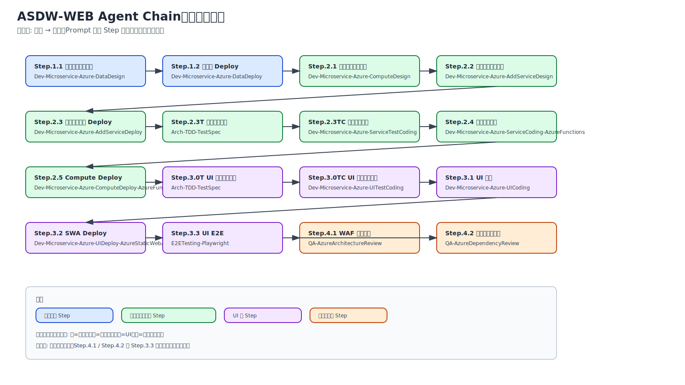
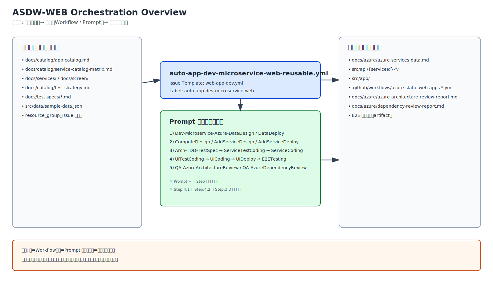
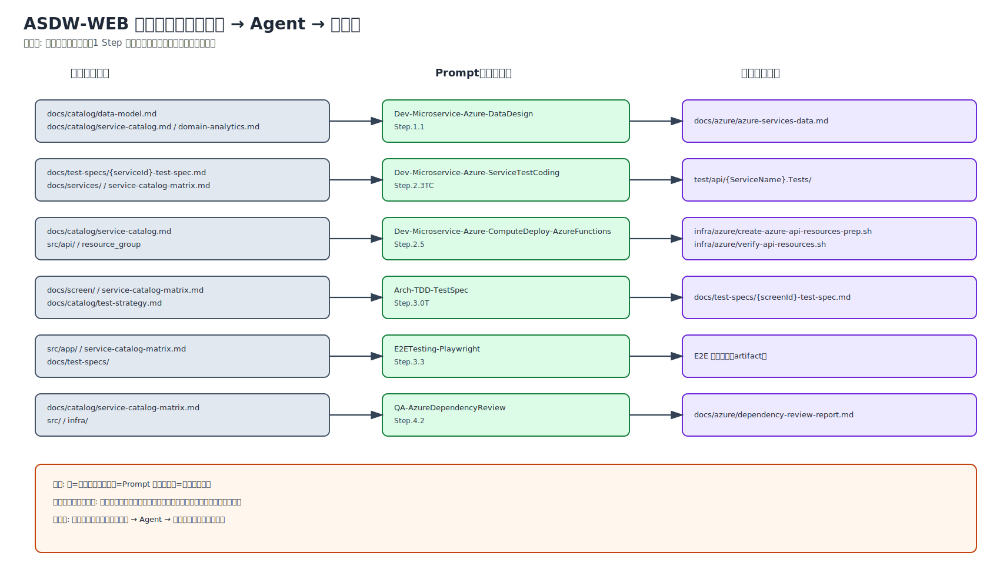

# Web Application の作成

← [README](../README.md)

---

## 目次

- [概要](#概要)
- [Agent チェーン図（ASDW）](#agent-チェーン図asdw)
- [ツール](#ツール)
- [ステップ概要](#ステップ概要)
- [TDD 原則](#tdd-原則)
- [手動実行ガイド](#手動実行ガイド)
- [自動実行ガイド（ワークフロー）](#自動実行ガイドワークフロー)
- [Tips](#tips)
- [動作確認手順](#動作確認手順)

---
典型的なHTMLベースのWebアプリケーションの作成と、AzureへのDeployを行います。
参考となる設計書などのファイルはGitHubのRepositoryにUploadして、そのURLを参照させる形で、GitHub Copilot cloud agentに作業をしてもらいます。
MCP Server経由で、ベストプラクティスや仕様の確認をしたり。Azure上のリソースの読み取りや、作成なども行います。

---

## 概要

### フローの目的・スコープ

ASDW-WEB（Web App Dev & Deploy）は、AAS + AAD-WEB ワークフローで完成した設計ドキュメントをもとに、
Issue Form から親 Issue を作成するだけで、Step.1〜Step.4 の Web アプリ実装タスクが
Sub-issue として自動生成され、Copilot が依存関係に従って順次・並列実行するワークフローです。

**本ワークフローは 1 度の実行で複数のアプリケーション (APP-ID) を対象とできます（カンマ区切り）。**
アプリケーションは `docs/catalog/app-catalog.md`（App Selection の成果物）に定義されています。

本ワークフローは Azure 上の Web アプリ開発に特化しており、以下の成果物を自動生成します:
- Azure データストア選定・デプロイ（Polyglot Persistence）
- Azure コンピュート選定・追加サービス選定・デプロイ
- TDD RED/GREEN フェーズによるサービスコード実装（Azure Functions）
- TDD RED/GREEN フェーズによる UI 実装（HTML5/CSS/JavaScript）
- Azure Static Web Apps へのデプロイと CI/CD 構築
- アーキテクチャレビュー（WAF 5本柱 + Azure Security Benchmark v3）

> 💡 **AI Agent 設計・実装**: AI Agent を含むアプリの場合は、このワークフロー完了後に **AI Agent Dev & Deploy（AAGD）**（`ai-agent-dev.yml`）を実行してください。

### アプリケーション粒度

| 関係 | カーディナリティ | 備考 |
|------|:---:|------|
| APP × サービス | N:N | 1つのサービスが複数 APP で利用可。共有サービスは対象 APP の実装時にも含む |
| APP × エンティティ | N:N | 1つのエンティティが複数 APP で利用可。共有エンティティは対象 APP の実装時にも含む |
| APP × 画面 | 1:1 | 1つの画面は1つの APP にのみ所属 |

### 前提条件

以下のドキュメントが存在していることを確認してください（設計ワークフロー AAS + AAD-WEB で作成済みであること）:

| ファイル | 説明 |
|--------|------|
| `docs/catalog/domain-analytics.md` | ドメイン分析書（AAS Step.3.1 の成果物） |
| `docs/catalog/service-catalog.md` | マイクロサービス一覧（AAS Step.3.2 の成果物） |
| `docs/catalog/data-model.md` | データモデル（AAS Step.4 の成果物） |
| `docs/catalog/screen-catalog.md` | 画面一覧（AAD-WEB Step.1 の成果物） |
| `docs/catalog/service-catalog-matrix.md` | サービスカタログ（AAS Step.6 の成果物） |
| `docs/catalog/use-case-catalog.md` | ユースケース一覧 |
| `docs/screen/` | 画面定義書（AAD-WEB Step.2.1 の成果物） |
| `docs/services/` | マイクロサービス定義書（AAD-WEB Step.2.2 の成果物） |
| `docs/catalog/test-strategy.md` | テスト戦略書（必須） |
| `docs/test-specs/{serviceId}-test-spec.md` | サービス別テスト仕様書（AAD-WEB Step.2.3 の成果物） |
| `docs/test-specs/{screenId}-test-spec.md` | 画面別テスト仕様書（AAD-WEB Step.2.3 の成果物） |
| `src/data/sample-data.json` | サンプルデータ（AAS Step.4 の成果物） |
| `docs/catalog/app-catalog.md` | アプリケーション一覧（存在しない場合はアプリケーション名を直接入力可） |

> 💡 **knowledge/ 参照**: `knowledge/` フォルダーに業務要件ドキュメント（D01〜D21: 事業意図・スコープ・業務プロセス・ユースケース・データモデル・セキュリティ等）が存在する場合、各ステップで業務コンテキストとして自動参照されます。設計精度を高めるため、事前に [km-guide.md](./km-guide.md) のワークフローを実行して `knowledge/` を充実させることを推奨します。


### 必須シークレット

- `COPILOT_PAT` — Copilot cloud agent のアサインに使用
- `AZURE_CLIENT_ID`, `AZURE_TENANT_ID`, `AZURE_SUBSCRIPTION_ID` — Step.3.2 の SWA デプロイ（OIDC 認証）で使用
  - Step.3.2 では `AZURE_STATIC_WEB_APPS_API_TOKEN` は不要（OIDC + `shibayan/swa-deploy@v1` app-name モードで ARM API 経由で自動取得）

セットアップ・トラブルシューティングは → [初期セットアップ](./getting-started.md)

## Agent チェーン図（ASDW）

以下の図は、このワークフローで使用される Custom Agent がファイルの入出力を介してどのように連鎖するかを示します。





### アーキテクチャ図



### データフロー図（ASDW-WEB）

以下の図は、各ステップで Custom Agent が読み書きするファイルのデータフローを示します。



---

## ツール

- GitHub Copilot cloud agent / GitHub Copilot for Azure
- MCP Server（Microsoft Learn, Azure）

---

## ステップ概要

### 依存グラフ

```
[Step.1]
Step.1.1 ──► Step.1.2 ──► [Step.1 完了]
                                │
                                ▼
[Step.2]
Step.2.1 ──► Step.2.2 ──► Step.2.3
                                │
                           Step.2.3TC ──────────────────────────────────── Step.2.4
                           (前提: AAD Step.7.3 生成済み                          │
                            テスト仕様書を参照)                            Step.2.5 ──► Step.2.6
                                                                                           │
                                                                                      Step.2.7T ──► Step.2.7TC ──► Step.2.7 ──► Step.2.8 ──► [Step.2 完了]
                                                                                                                                                   │
                                                                                                                                                   ▼
[Step.3]                                                                                                                                      Step.3.0TC
                                                                                                                                  (前提: AAD Step.7.3 生成済みテスト仕様書を参照)
                                                                                                                                                   │
                                                                                                                   Step.3.1 ──► Step.3.2 ──► [Step.3 完了]
                                                                                                                                                   │
                                                                                                               ┌───────────────────────────────────┘
                                                                                                               │
[Step.4]                                                                                       Step.4.1 ──────┤（並列）
                                                                                               Step.4.2 ──────┘
                                                                                                               │
                                                                                                       [全完了] → Root 完了
```

### 各ステップの入出力

#### Step.1: データ

| Step ID   | タイトル | Custom Agent | 入力 | 出力 | 依存 |
|-----------|---------|--------------|------|------|------|
| step-1.1  | Azure データストア選定 | `Dev-Microservice-Azure-DataDesign` | `docs/catalog/data-model.md`, `docs/catalog/service-catalog.md`, `docs/catalog/domain-analytics.md` | `docs/azure/azure-services-data.md` | なし |
| step-1.2  | Azure データサービス Deploy | `Dev-Microservice-Azure-DataDeploy` | `docs/azure/azure-services-data.md`, `docs/catalog/service-catalog-matrix.md`, `src/data/sample-data.json` | `infra/azure/create-azure-data-resources*.sh`, `src/data/azure/data-registration-script.sh`, `infra/azure/verify-data-resources.sh`, `docs/test-specs/deploy-step1-data-test-spec.md` | step-1.1 |

#### Step.2: マイクロサービス作成

| Step ID   | タイトル | Custom Agent | 入力 | 出力 | 依存 |
|-----------|---------|--------------|------|------|------|
| step-2.1  | Azure コンピュート選定 | `Dev-Microservice-Azure-ComputeDesign` | `docs/catalog/service-catalog.md`, `docs/catalog/use-case-catalog.md`, `docs/catalog/data-model.md`, `docs/catalog/service-catalog-matrix.md` | `docs/azure/azure-services-compute.md` | Step.1 完了 |
| step-2.2  | 追加 Azure サービス選定 | `Dev-Microservice-Azure-AddServiceDesign` | `docs/catalog/use-case-catalog.md`, `docs/catalog/service-catalog.md`, `docs/services/`, `docs/azure/azure-services-compute.md` | `docs/azure/azure-services-additional.md` | step-2.1 |
| step-2.3  | 追加 Azure サービス Deploy | `Dev-Microservice-Azure-AddServiceDeploy` | `docs/azure/azure-services-additional.md` | `infra/azure/create-azure-additional-resources*`, `infra/azure/verify-additional-resources.sh`, `docs/test-specs/deploy-step2-additional-test-spec.md` | step-2.2 |
| step-2.3TC| サービス テストコード生成 (TDD RED) | `Dev-Microservice-Azure-ServiceTestCoding` | `docs/test-specs/{serviceId}-test-spec.md`（AAD Step.7.3 で生成済み）, `docs/services/` | `test/api/{サービス名}.Tests/` | step-2.3 |
| step-2.4  | サービスコード実装 (TDD GREEN) | `Dev-Microservice-Azure-ServiceCoding-AzureFunctions` | `docs/services/`, `test/api/{サービス名}.Tests/`, `docs/test-specs/{serviceId}-test-spec.md` | `src/api/{サービスID}-{サービス名}/` | step-2.3TC |
| step-2.5  | Azure Compute Deploy | `Dev-Microservice-Azure-ComputeDeploy-AzureFunctions` | `docs/catalog/service-catalog.md`, `docs/catalog/service-catalog-matrix.md`, `src/api/` | `.github/workflows/`, `infra/azure/create-azure-api-resources-prep.sh`, `infra/azure/verify-api-resources.sh`, `docs/test-specs/deploy-step2-compute-test-spec.md` | step-2.4 |
| step-2.6  | AI Agent 構成設計 | `Arch-AIAgentDesign` | ユースケース記述, `docs/catalog/service-catalog-matrix.md`, `docs/azure/` | `docs/ai-agent-catalog.md`, `docs/agent/` | step-2.5 |
| step-2.7T | AI Agent テスト仕様書 (TDD RED) | `Arch-TDD-TestSpec` | `docs/catalog/test-strategy.md`, `docs/ai-agent-catalog.md`, `docs/agent/agent-detail-*.md`, `docs/catalog/service-catalog-matrix.md`, `docs/catalog/data-model.md` | `docs/test-specs/{agentId}-test-spec.md` | step-2.6 |
| step-2.7TC| AI Agent テストコード生成 (TDD RED) | `Dev-Microservice-Azure-AgentTestCoding` | `docs/test-specs/{agentId}-test-spec.md`, `docs/agent/agent-detail-*.md`, `docs/catalog/service-catalog-matrix.md` | `test/agent/{AgentName}.Tests/` | step-2.7T |
| step-2.7  | AI Agent 実装 (TDD GREEN) | `Dev-Microservice-Azure-AgentCoding` | `docs/agent/agent-detail-*.md`, `docs/ai-agent-catalog.md`, `test/agent/{AgentName}.Tests/`, `docs/test-specs/{agentId}-test-spec.md`, `docs/catalog/service-catalog-matrix.md`, `docs/azure/azure-services-additional.md` | `src/agent/{AgentID}-{AgentName}/` | step-2.7TC |
| step-2.8  | AI Agent Deploy | `Dev-Microservice-Azure-AgentDeploy` | `src/agent/{AgentID}-{AgentName}/`, `docs/ai-agent-catalog.md`, `docs/azure/azure-services-additional.md`, リソースグループ名 | `infra/azure/create-azure-agent-resources-prep.sh`, `infra/azure/create-azure-agent-resources.sh`, `infra/azure/verify-agent-resources.sh`, `.github/workflows/deploy-agent-*.yml`, `docs/test-specs/deploy-step2-agent-test-spec.md`, `docs/azure/service-catalog.md`（Agent エンドポイント追記） | step-2.7 |

#### Step.3: UI 作成

| Step ID   | タイトル | Custom Agent | 入力 | 出力 | 依存 |
|-----------|---------|--------------|------|------|------|
| step-3.0TC| UI テストコード生成 (TDD RED) | `Dev-Microservice-Azure-UITestCoding` | `docs/test-specs/{screenId}-test-spec.md`（AAD Step.7.3 で生成済み）, `docs/screen/` | `test/ui/` | Step.2 完了 |
| step-3.1  | UI 実装 (TDD GREEN) | `Dev-Microservice-Azure-UICoding` | `docs/screen/`, `docs/catalog/screen-catalog.md`, `docs/catalog/service-catalog-matrix.md`, `test/ui/` | `src/app/` | step-3.0TC |
| step-3.2  | Web アプリ Deploy (SWA) | `Dev-Microservice-Azure-UIDeploy-AzureStaticWebApps` | `src/app/`, リソースグループ名 | `.github/workflows/`, `infra/azure/create-azure-webui-resources.sh`, `infra/azure/verify-webui-resources.sh`, `docs/test-specs/deploy-step3-swa-test-spec.md` | step-3.1 |

#### Step.4: アーキテクチャレビュー（並列実行）

| Step ID   | タイトル | Custom Agent | 入力 | 出力 | 依存 |
|-----------|---------|--------------|------|------|------|
| step-4.1  | WAF アーキテクチャレビュー | `QA-AzureArchitectureReview` | `docs/catalog/service-catalog-matrix.md`, `docs/azure/`, リソースグループ名 | `docs/azure/azure-architecture-review-report.md` | Step.3 完了（step-4.2 と並列） |
| step-4.2  | 整合性チェック | `QA-AzureDependencyReview` | `docs/catalog/service-catalog-matrix.md`, `docs/azure/`, `src/`, `infra/`, `.github/workflows/` | `docs/azure/dependency-review-report.md` | Step.3 完了（step-4.1 と並列） |

### 成果物一覧

| Step | 成果物 |
|------|--------|
| Step.1.1 | `docs/azure/azure-services-data.md` |
| Step.1.2 | `infra/azure/create-azure-data-resources-prep.sh`, `infra/azure/create-azure-data-resources.sh`, `infra/azure/verify-data-resources.sh`, `src/data/azure/data-registration-script.sh`, `docs/test-specs/deploy-step1-data-test-spec.md` |
| Step.2.1 | `docs/azure/azure-services-compute.md` |
| Step.2.2 | `docs/azure/azure-services-additional.md` |
| Step.2.3 | `infra/azure/create-azure-additional-resources*`, `infra/azure/verify-additional-resources.sh`, `docs/test-specs/deploy-step2-additional-test-spec.md` |
| Step.2.3TC | `test/api/{サービス名}.Tests/` |
| Step.2.4 | `src/api/{サービスID}-{サービス名}/` |
| Step.2.5 | `.github/workflows/`（CI/CD）, `infra/azure/create-azure-api-resources-prep.sh`, `infra/azure/verify-api-resources.sh`, `docs/test-specs/deploy-step2-compute-test-spec.md` |
| Step.2.6 | `docs/ai-agent-catalog.md`, `docs/agent/` |
| Step.2.7T | `docs/test-specs/{agentId}-test-spec.md` |
| Step.2.7TC | `test/agent/{AgentName}.Tests/` |
| Step.2.7 | `src/agent/{AgentID}-{AgentName}/` |
| Step.2.8 | `infra/azure/create-azure-agent-resources-prep.sh`, `infra/azure/create-azure-agent-resources.sh`, `infra/azure/verify-agent-resources.sh`, `.github/workflows/deploy-agent-*.yml`, `docs/test-specs/deploy-step2-agent-test-spec.md`, `docs/azure/service-catalog.md`（Agent エンドポイント追記） |
| Step.3.0TC | `test/ui/` |
| Step.3.1 | `src/app/` |
| Step.3.2 | `.github/workflows/`（SWA デプロイ）, `infra/azure/create-azure-webui-resources.sh`, `infra/azure/verify-webui-resources.sh`, `docs/test-specs/deploy-step3-swa-test-spec.md` |
| Step.4.1 | `docs/azure/azure-architecture-review-report.md` |
| Step.4.2 | `docs/azure/dependency-review-report.md` |

---

## TDD 原則

このワークフローは **テスト駆動開発（TDD）の 4 ステップ** を全てのコード実装・デプロイステップで完全実施します。

### TDD 4 ステップ

1. **要件だけ伝える** — ステップ定義（入力・成果物・完了条件）
2. **テストを先に書かせる** — テスト仕様書（設計ワークフロー AAD Step.7.3 で生成済み）を参照し、テストコード（*TC ステップ）を生成する
3. **実行 → 失敗確認（RED）** — テストコード実行で全テスト FAIL を確認してから実装へ進む
4. **テスト通るまで反復（GREEN → REFACTOR）** — 全テスト PASS まで実装を修正

### 反復ループの制約

- **コード実装（GREEN フェーズ）**: 最大 **5 回**反復
- **デプロイ検証（GREEN フェーズ）**: 最大 **3 回**反復
- 上限超過時: `asdw:blocked` ラベルを付与し、未 PASS テスト一覧を Issue コメントで報告

---

## 手動実行ガイド

### Step.1. データ

#### Step.1.1. Azure のデータ保存先の選択

- 使用するカスタムエージェント
  - Dev-Microservice-Azure-DataDesign

```text
# タスク
Polyglot Persistenceに基づき、全エンティティの最適Azureデータストア選定と根拠/整合性方針を文書化する

## 入力（必読）
- 必読ファイル
  - `docs/catalog/data-model.md`
  - `docs/catalog/service-catalog.md`
  - `docs/catalog/domain-analytics.md`
- 対象アプリケーション: `{APP-ID}`（`docs/catalog/app-catalog.md` を参照し、対象 APP-ID に紐づくエンティティのみを処理対象とする）

## 成果物（必須）
- `docs/azure/azure-services-data.md`
```

#### Step.1.2. データサービスのAzure へのデプロイと、サンプルデータの登録

- 使用するカスタムエージェント
  - Dev-Microservice-Azure-DataDeploy

```text
# タスク
Azure CLIでデータ系サービスを最小構成で作成し、サンプルデータを変換・一括登録する（冪等・検証付き）

# 入力
- リソースグループ名: `{リソースグループ名}`
- データストア定義: `docs/azure/azure-services-data.md`
- サービスカタログ: `docs/catalog/service-catalog-matrix.md`
- サンプルデータ: `src/data/sample-data.json`
- 対象アプリケーション: `{APP-ID}`

# 出力（必須）
- `infra/azure/create-azure-data-resources-prep.sh`
- `infra/azure/create-azure-data-resources.sh`
- `src/data/azure/data-registration-script.sh`
- `docs/azure/service-catalog.md`：重複行を作らず追記
```

---

### Step.2. マイクロサービス 作成

#### Step.2.1. Azureのサービスのホスト先の選択

- 使用するカスタムエージェント
  - Dev-Microservice-Azure-ComputeDesign

```text
# タスク
ユースケース内の全マイクロサービスについて、最適な Azure コンピュート（ホスティング）を選定し、根拠・代替案・前提・未決事項を設計書に記録する（ドキュメント作成特化）

### 入力（必読）
- リソースグループ名: `{リソースグループ名}`
- `docs/catalog/service-catalog.md`
- `docs/catalog/use-case-catalog.md`
- `docs/catalog/data-model.md`
- `docs/catalog/service-catalog-matrix.md`
- 対象アプリケーション: `{APP-ID}`

### 成果物（必須）
- `docs/azure/azure-services-compute.md`
```

#### Step.2.2. 各サービスが利用する追加のAzureのサービスの選定

- 使用するカスタムエージェント
  - Dev-Microservice-Azure-AddServiceDesign

```text
# タスク
サービス定義書の「外部依存・統合」から、追加で必要な Azure サービス（AI/認証/統合/運用等）を選定し、Microsoft Learn 根拠付きで設計書に記録する

# 入力（必読）
- `docs/catalog/use-case-catalog.md`
- `docs/catalog/service-catalog.md`
- `docs/services/`
- `docs/azure/azure-services-compute.md`
- 対象アプリケーション: `{APP-ID}`

# 出力（必須）
- `docs/azure/azure-services-additional.md`
```

#### Step.2.3. 各サービスが利用する追加のAzureのサービスのデプロイ

- 使用するカスタムエージェント
  - Dev-Microservice-Azure-AddServiceDeploy

```text
# タスク
追加Azureサービスを Azure CLIで冪等作成し、service-catalogを更新、AC検証で完了判定する

# 入力
- `docs/azure/azure-services-additional.md`
- `docs/catalog/data-model.md`
- `docs/catalog/service-catalog-matrix.md`
- 対象アプリケーション: `{APP-ID}`

# 出力（必須）
- `infra/azure/create-azure-additional-resources-prep.sh`
- `infra/azure/create-azure-additional-resources/`
- `infra/azure/create-azure-additional-resources/create.sh`
- `infra/azure/verify-additional-resources.sh`
- `docs/test-specs/deploy-step2-additional-test-spec.md`
```

#### Step.2.3TC. サービス テストコード生成 (TDD RED コード)

> [!NOTE]
> サービス別テスト仕様書（`docs/test-specs/{serviceId}-test-spec.md`）は設計ワークフロー AAD Step.7.3 で生成済みであることを前提とします。Dev ワークフローを実行する前に AAD Step.7.3 が完了していることを確認してください。

- 使用するカスタムエージェント
  - Dev-Microservice-Azure-ServiceTestCoding

```text
# タスク
テスト仕様書からテストコードのみを生成する（実装コードは作成しない）。全テストが FAIL（TDD RED 状態）であることを確認する。

## 入力
- `docs/test-specs/{serviceId}-test-spec.md`（設計ワークフロー AAD Step.7.3 で生成済み）
- `docs/services/{serviceId}-*.md`
- `docs/catalog/service-catalog-matrix.md`
- 対象アプリケーション: `{APP-ID}`

## 成果物（必須）
- `test/api/{サービス名}.Tests/` 配下に xUnit テストプロジェクト（テストコードのみ）
```

#### Step.2.4. 各サービスのコードの作成 (TDD GREEN フェーズ)

- 使用するカスタムエージェント
  - Dev-Microservice-Azure-ServiceCoding-AzureFunctions

```text
# タスク
マイクロサービス定義書から全てのサービスの Azure Functions を実装し、テスト/最小ドキュメント/設定雛形まで揃える

# 入力
- `docs/services/SVC-xx-*.md`
- TDD テストコード（RED状態）: `test/api/{サービス名}.Tests/`
- TDD テスト仕様書: `docs/test-specs/{serviceId}-test-spec.md`
- 対象アプリケーション: `{APP-ID}`

# 成果物（必須）
- `src/api/{サービスID}-{サービス名}/`
```

#### Step.2.5. Azure Compute の作成

- 使用するカスタムエージェント
  - Dev-Microservice-Azure-ComputeDeploy-AzureFunctions

```text
# タスク
サービスリストの全てのサービスを、Azure Functions用に作成/更新→デプロイ、GitHub Actions で CI/CD 構築、API スモークテスト（+手動UI）追加まで行う。

# Inputs
- サービスリスト: `docs/catalog/service-catalog.md`
- サービスカタログ: `docs/catalog/service-catalog-matrix.md`
- リソースグループ名: `{リソースグループ名}`
- デプロイ対象コード: `src/api/{サービスID}-{サービス名}/`
- 対象アプリケーション: `{APP-ID}`
```

#### Step.2.6. AI Agent 構成設計

- 使用するカスタムエージェント
  - Arch-AIAgentDesign

> [!NOTE]
> AI Agent 設計の詳細ガイドは [08-ai-agent.md](./08-ai-agent.md) を参照してください。

```text
# タスク
ユースケース記述を入力として、AI Agent のアプリケーション定義・粒度設計・詳細設計を一貫して実施し、docs/ai-agent-catalog.md に Agent 一覧を出力する。

# 入力
- ユースケース記述: `docs/catalog/use-case-catalog.md` または `docs/usecase/{USECASE_ID}/`
- `docs/catalog/service-catalog-matrix.md`
- `docs/azure/`

# 出力（必須）
- `docs/ai-agent-catalog.md`
- `docs/agent/`
```

---

#### Step.2.7T. AI Agent テスト仕様書の生成 (TDD RED フェーズ)

- 使用するカスタムエージェント
  - Arch-TDD-TestSpec

```text
# タスク
テスト戦略書・Agent 詳細設計書を根拠に、Agent 用 TDD テスト仕様書を生成する

## 入力
- `docs/catalog/test-strategy.md`
- `docs/ai-agent-catalog.md`
- `docs/agent/agent-detail-*.md`
- `docs/catalog/service-catalog-matrix.md`
- `docs/catalog/data-model.md`
- 対象アプリケーション: `{APP-ID}`

## 成果物（必須）
- `docs/test-specs/{agentId}-test-spec.md`
```

#### Step.2.7TC. AI Agent テストコード生成 (TDD RED コード)

- 使用するカスタムエージェント
  - Dev-Microservice-Azure-AgentTestCoding

```text
# タスク
Agent テスト仕様書からテストコードのみを生成する（実装コードは作成しない）。全テストが FAIL（TDD RED 状態）であることを確認する。

## 入力
- `docs/test-specs/{agentId}-test-spec.md`
- `docs/agent/agent-detail-*.md`
- `docs/catalog/service-catalog-matrix.md`
- 対象アプリケーション: `{APP-ID}`

## 成果物（必須）
- `test/agent/{AgentName}.Tests/` 配下にテストプロジェクト（全テストが FAIL の RED 状態）
```

#### Step.2.7. AI Agent 実装 (TDD GREEN フェーズ)

- 使用するカスタムエージェント
  - Dev-Microservice-Azure-AgentCoding

> [!IMPORTANT]
> Azure AI Foundry Agent Service を使用して Agent を実装します。
> チュートリアル: https://learn.microsoft.com/ja-jp/azure/foundry/quickstarts/get-started-code?tabs=python
> チュートリアルのコードをそのままコピーせず、**ユーザーが指定したプログラミング言語で最新の SDK** を使用してください。
> Python: `azure-ai-projects`（最新版）/ C#: `Azure.AI.Projects`（最新版）

```text
# タスク
Agent 詳細設計書から AI Agent を実装し、全テストを PASS させる（TDD GREEN フェーズ）

# 入力
- `docs/agent/agent-detail-*.md`
- `docs/ai-agent-catalog.md`
- TDD テストコード（RED状態）: `test/agent/{AgentName}.Tests/`
- TDD テスト仕様書: `docs/test-specs/{agentId}-test-spec.md`
- `docs/catalog/service-catalog-matrix.md`
- `docs/azure/azure-services-additional.md`
- 対象アプリケーション: `{APP-ID}`

# 成果物（必須）
- `src/agent/{AgentID}-{AgentName}/`
```

#### Step.2.8. AI Agent Deploy

- 使用するカスタムエージェント
  - Dev-Microservice-Azure-AgentDeploy

```text
# タスク
AI Agent を Azure AI Foundry Agent Service へデプロイし、GitHub Actions で CI/CD を構築する

# 入力
- `src/agent/{AgentID}-{AgentName}/`
- `docs/ai-agent-catalog.md`
- `docs/azure/azure-services-additional.md`
- リソースグループ名: `{リソースグループ名}`
- 対象アプリケーション: `{APP-ID}`

# 成果物（必須）
- `infra/azure/create-azure-agent-resources-prep.sh`
- `infra/azure/create-azure-agent-resources.sh`
- `infra/azure/verify-agent-resources.sh`
- `.github/workflows/deploy-agent-*.yml`
- `docs/test-specs/deploy-step2-agent-test-spec.md`
- `docs/azure/service-catalog.md`（Agent エンドポイント追記）
```

---

### Step.3. UI 作成

#### Step.3.0TC. UI テストコード生成 (TDD RED コード)

> [!NOTE]
> 画面別テスト仕様書（`docs/test-specs/{screenId}-test-spec.md`）は設計ワークフロー AAD Step.7.3 で生成済みであることを前提とします。Dev ワークフローを実行する前に AAD Step.7.3 が完了していることを確認してください。

- 使用するカスタムエージェント
  - Dev-Microservice-Azure-UITestCoding

```text
# タスク
画面別テスト仕様書からUIテストコード（失敗するテスト）のみを生成する（実装コードは作成しない）。

## 入力
- `docs/test-specs/{screenId}-test-spec.md`（設計ワークフロー AAD Step.7.3 で生成済み）
- `docs/screen/{screenId}-*.md`
- `docs/catalog/service-catalog-matrix.md`
- 対象アプリケーション: `{APP-ID}`

## 成果物（必須）
- `test/ui/` 配下に Jest + jsdom テストファイル
```

#### Step.3.1. UIのコードの作成 (TDD GREEN フェーズ)

- 使用するカスタムエージェント
  - Dev-Microservice-Azure-UICoding

```text
# タスク
画面定義書に基づき、全ての画面のUIを実装し、サービスカタログに基づくAPIクライアント層を整備する。

# 入力
1. 画面定義書: `docs/screen/SCR-xx-*.md`
2. 画面一覧・遷移: `docs/catalog/screen-catalog.md`
3. サービスカタログ: `docs/catalog/service-catalog-matrix.md`
4. TDD テストコード: `test/ui/`
5. TDD テスト仕様書: `docs/test-specs/{screenId}-test-spec.md`
6. 対象アプリケーション: `{APP-ID}`

# 出力
- `src/app/` 配下
```

#### Step.3.2. Webアプリケーションのデプロイ

- 使用するカスタムエージェント
  - Dev-Microservice-Azure-UIDeploy-AzureStaticWebApps

```text
# タスク
Azure Static Web Apps へのWebデプロイと、GitHub Actionsによる継続的デリバリー（CD）構築を実施する。
認証方式: OIDC（`azure/login@v2`）+ `shibayan/swa-deploy@v1` app-name モード。`AZURE_STATIC_WEB_APPS_API_TOKEN` は不要。

# Inputs
- リソースグループ名: `{リソースグループ名}`
- 対象アプリケーション: `{APP-ID}`

# 前提条件
- `AZURE_CLIENT_ID` / `AZURE_TENANT_ID` / `AZURE_SUBSCRIPTION_ID` が GitHub Secrets に設定済み（Functions deploy と共有）
- `AZURE_STATIC_WEB_APPS_API_TOKEN` / `GITHUB_PAT` の設定は不要

# 成果物
1. `infra/azure/create-azure-webui-resources.sh`（リソース作成のみ・PAT 不要）
2. `src/app/staticwebapp.config.json`
3. `docs/catalog/service-catalog-matrix.md`（WebアプリURL追記）
4. `.github/workflows/azure-static-web-apps-*.yml`（OIDC + `shibayan/swa-deploy@v1` app-name モード）
```

---

### Step.4. アーキテクチャレビュー

#### Step.4.1. WAFなどに沿ったアーキテクチャレビュー

- 使用するカスタムエージェント
  - QA-AzureArchitectureReview

```text
# タスク
デプロイ済みAzureリソースを棚卸しし、Azure Well-Architected Framework（5本柱）と Azure Security Benchmark v3 を根拠にアーキテクチャ/セキュリティをレビューして、日本語のMermaid図付きレポートを生成する

- リソースグループ名: `{resourceGroupName}`
- 対象アプリケーション: `{APP-ID}`

- 出力先: `docs/azure/azure-architecture-review-report.md`
```

#### Step.4.2. 整合性チェック

- 使用するカスタムエージェント
  - QA-AzureDependencyReview

```text
# タスク
サービスカタログ準拠で Azure 依存（参照・設定・IaC）を証跡付きで点検し、必要なら最小差分で修正する

## 入力（必須）
- リソースグループ名：`<resource-group>`
- `docs/catalog/service-catalog-matrix.md`
- 対象アプリケーション: `{APP-ID}`

## 出力
- `docs/azure/dependency-review-report.md`
```

---

## 自動実行ガイド（ワークフロー）

### 状態ラベル

| ラベル | 説明 |
|-------|------|
| `asdw:initialized` | 親 Issue に付与。Bootstrap 完了を示す |
| `asdw:ready` | 依存前段 Step が完了済みの状態 |
| `asdw:running` | Copilot が assign され実行中 |
| `asdw:done` | 作業完了。このラベル付与で状態遷移ロジックが起動する |
| `asdw:blocked` | TDD フロー最大試行回数超過等でブロック状態 |

### 冪等性

- Bootstrap ワークフローは、親 Issue に `asdw:*` 系ラベル（`initialized`/`ready`/`running`/`done`/`blocked` のいずれか）が 1 つでも付与されている場合は初期化処理をスキップします（再実行ガード）
- 同じ親 Issue で `auto-app-dev-microservice` ラベルを付け直しても Step Issue が二重に作成されることはありません
- Bootstrap を最初からやり直したい場合は、新しい親 Issue を作成し、その Issue に `auto-app-dev-microservice` ラベルを付与してください

### 実行方式（デフォルト）

Bootstrap ワークフローが全 Step Issue を一括作成し、最初に実行可能な Step（`Step.1.1`）にのみ `asdw:ready` + `asdw:running` を付与します。Step close / `asdw:done` ラベル付与時に状態遷移ワークフローが依存関係を確認して次 Step を起動します。

**メリット**: 全 Step が親 Issue の Sub-issue として最初から見える  
**デメリット**: 開始前から多数の Issue が表示される

### 使い方（Issue 作成手順）

1. リポジトリの **Issues** タブ → **New Issue**
2. テンプレート **"Web App Dev"** を選択
3. 以下を入力:
   - **対象アプリケーション (APP-ID)**: `docs/catalog/app-catalog.md` からアプリケーション ID を入力。カンマ区切りで複数指定可（例: `APP-01, APP-02, APP-03`）。`docs/catalog/app-catalog.md` が存在しない場合はアプリケーション名を入力 (例: `royalty-service`)
   - **対象ブランチ**: コード/ドキュメントをコミットするブランチ名 (例: `main`)
   - **リソースグループ名**: Azure のリソースグループ名 (例: `rg-royalty-service-dev`)
   - **実行するステップ**: 実行したい Step にチェック（全て未選択の場合は全 Step 実行）
   - **追加コメント**: 補足・制約があれば記載
4. Issue を Submit → `auto-app-dev-microservice` ラベルが自動付与される

### セットアップ・トラブルシューティング

共通のセットアップ手順とトラブルシューティングは → [初期セットアップ](./getting-started.md)

**ASDW 固有のトラブルシューティング:**

- **Step Issue に `asdw:blocked` が付与された**: TDD フローで最大試行回数を超過。Step Issue のコメントに未 PASS テスト一覧が記録されています。手動で問題を修正後、`asdw:blocked` を削除し `asdw:done` を付与することで次 Step を継続できます
- **Step.4.1 または Step.4.2 完了後にワークフローが終了しない**: Step.4.1 **AND** Step.4.2 の**両方が完了**するまで Root Issue への完了通知は届きません（AND依存の仕様）

---

## Azure データストア

dryrun 環境（リソースグループ: `dahatake-dryrun` / リージョン: `japaneast`）に以下のデータストアが作成済みです。

| ServiceID | 種別 | 接続 URL / FQDN |
|-----------|------|----------------|
| DS-01 | Azure SQL Server | `loyalty-sql-dahatakedryr.database.windows.net` |
| DS-02 | Azure SQL Database (LoyaltyDB) | `loyalty-sql-dahatakedryr.database.windows.net` |
| DS-03 | Azure Cosmos DB | `https://loyalty-cosmos-dahatakedryr.documents.azure.com:443/` |
| DS-04 | Azure Storage (Blob) | `https://loyaltystdahatakedryr.blob.core.windows.net/` |

詳細（Azure Resource ID、コンテナ一覧、SKU）は [`docs/catalog/service-catalog.md`](../docs/catalog/service-catalog.md) を参照。

### 検証手順

```bash
# 前提確認（Azure 認証・ツールチェック）
bash infra/azure/create-azure-data-resources-prep.sh

# リソース作成（冪等 — 既存の場合はスキップ）
bash infra/azure/create-azure-data-resources.sh

# サンプルデータ登録（冪等 — 再実行時は upsert/skip）
bash src/data/azure/data-registration-script.sh
```

---

## Tips

### 分割されたタスクを実行する

大きなジョブの場合は途中でエラーになった際のリカバリーや、結果が期待と大きく異なるといったリスクが考えられます。
`work` フォルダーに作成されたPromptファイルを GitHub Copilot cloud agent の Sub Issue として実行します。

```text
以下のファイルの内容をPromptとして読み込んで、タスクとして実行してください。
- `work/future-scenario-detail-sub-1.md`
```

### うまくいかなかった時の対応例

#### タスクが途中で終了する

> [!WARNING]
> 指示したタスクがすべて完了していないのに、GitHub Copilotがタスクを終了することがあります。その場合は、コメントでCopilotに指示を出して、再度Copilotにコードを生成してもらってください。

```text
@copilot
以下の作業の進捗状況のドキュメントも参考にして、残作業を実行してください。
- `work/{ユースケースID}/api-azure-deploy-work-status.md`
```

#### 結果の妥当性チェック

```text
@copilot

あなたの回答は、私があなたに依頼した「目的」を達成できているのかを、3回、異なる観点でレビューをして、問題点を15～100個リストアップをしてください。
私の目的を再確認して、リストアップした問題点に対する解決策を立案し、その解決策を実行して、目的の達成のできる成果物を最終の成果物として作成してください。
```

#### CI/CDのジョブがエラーになる

```text
@copilot 
reviewのチェックで、github actionsのジョブがエラーになりました。原因をリストアップして、解決策を考えて、修正をしてください。
```

---

## 動作確認手順

### フォーム表示の確認

1. `.github/ISSUE_TEMPLATE/web-app-dev.yml` がリポジトリに存在することを確認する
2. Issues タブ → New Issue → **Web App Dev** テンプレートが表示されることを確認する
3. テンプレートのフォームフィールド（ブランチ入力・リソースグループ名・ステップ選択・追加コメント）が正しく表示されることを確認する

### 自動実行の確認チェックリスト

1. リポジトリで Actions の Workflow permissions を **Read and write** に設定する
2. `.github/workflows/auto-app-dev-microservice-web-reusable.yml` がリポジトリに存在することを確認する
3. AAS + AAD-WEB ワークフロー完了後の前提ドキュメント（`docs/catalog/domain-analytics.md` 等）が存在することを確認する
4. Issues タブ → New Issue → **Web App Dev** テンプレートを選択する
5. ブランチ `main`、リソースグループ名、Step.1 のみチェックして Issue を作成する
6. Actions タブで `ASDW-WEB Orchestrator` の Bootstrap ジョブが起動したことを確認する
7. Bootstrap 完了後、Step.1.1 の Issue が `asdw:running` ラベル付きで作成されたことを確認する（他の Step はラベルなし）
8. 親 Issue にサマリコメントと Step Issue 一覧が投稿されたことを確認する
9. Step.1.1 の Issue を close し、`auto-app-dev-microservice-web-reusable.yml` の状態遷移ジョブが起動することを確認する
10. Step.1.2 に `asdw:ready` + `asdw:running` が付与され Copilot が assign されることを確認する
11. Step.1.2 を close し、Step.2.1 が起動することを確認する
12. Step.2.3T → Step.2.3TC の順で TDD フローが進むことを確認する
13. Step.3.0T → Step.3.0TC → Step.3.1 → Step.3.2 の順で進むことを確認する
14. Step.3.2 を close して Step.4.1 と Step.4.2 が**並列で**開始されることを確認する
15. Step.4.1 を close して Root Issue への完了通知がまだ届かないことを確認する（Step.4.2 が未完了のため）
16. Step.4.2 を close して Root Issue に完了通知コメントが投稿されることを確認する（AND依存解消）
