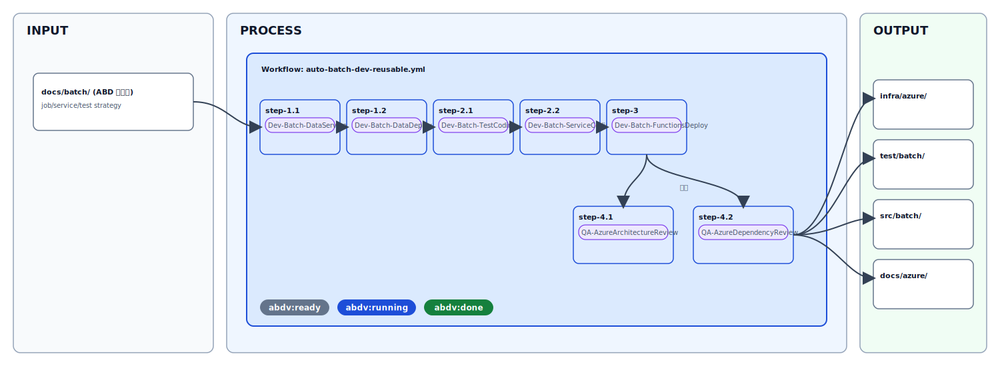
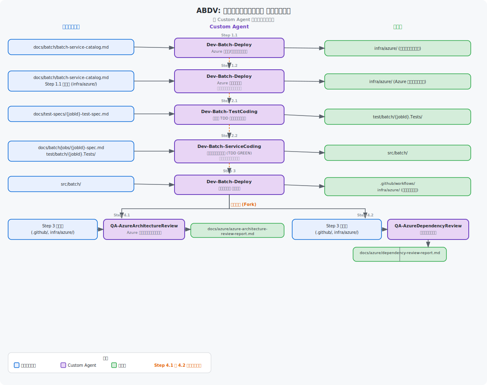

# バッチ処理実装フェーズ チュートリアル

← [README](../README.md)

---

## 目次

- [対象読者](#対象読者)
- [前提条件](#前提条件)
- [Agent チェーン図（ABDV）](#agent-チェーン図abdv)
- [全体フロー概観](#全体フロー概観)
- [Step 1: Issue を作成する](#step-1-issue-を作成する)
- [Step 2: Sub Issue の自動生成を確認する](#step-2-sub-issue-の自動生成を確認する)
- [Step 3: Custom Agent の実行を待つ](#step-3-custom-agent-の実行を待つ)
- [Step 4: PR をレビューしてマージする](#step-4-pr-をレビューしてマージする)
- [ABDV ワークフローステップ（step-1.1〜step-4.*）の完了を確認する](#abdv-ワークフローステップstep-11step-4の完了を確認する)
- [実装・デプロイへの移行（ABDV 完了後）](#実装デプロイへの移行abdv-完了後)
- [よくある失敗例と対処法](#よくある失敗例と対処法)
- [参照ファイル一覧](#参照ファイル一覧)

---
> 初見ユーザーが、**Issue 作成 → Sub Issue 自動生成 → Custom Agent 実行 → PR マージ** の流れを起点に、ABDV ワークフローステップ（`step-1.1`〜`step-4.*`）の完了確認から実装・デプロイ移行まで迷わず進められるよう整理したガイドです。

---

## 対象読者

| 対象 | 前提スキル |
|---|---|
| バッチ処理設計・実装を担当するエンジニア | GitHub Issues / Actions の基本操作 |
| このリポジトリで初めて Copilot cloud agent を使う開発者 | Markdown / YAML の読み書き |

---

## 前提条件

本チュートリアルを開始する前に、以下の条件が満たされていることを確認してください。

> 💡 **knowledge/ 参照**: `knowledge/` フォルダーに業務要件ドキュメント（D01〜D21: 事業意図・スコープ・業務プロセス・ユースケース・データモデル・セキュリティ等）が存在する場合、各ステップで業務コンテキストとして自動参照されます。設計精度を高めるため、事前に [km-guide.md](./km-guide.md) のワークフローを実行して `knowledge/` を充実させることを推奨します。


### リポジトリ設定

| 項目 | 確認方法 | 設定値 |
|---|---|---|
| Workflow permissions | Settings → Actions → General → Workflow permissions | **Read and write permissions** |
| GitHub Copilot | Settings → GitHub Copilot（Organization or Repository level） | **有効** |
| GITHUB_TOKEN 権限 | `.github/workflows/*.yml` の `permissions` ブロック | `issues: write`, `contents: write` |

### 必須ドキュメント（設計フェーズの成果物）

バッチ実装フェーズを開始するには、**設計フェーズ**（ABD ワークフロー）の成果物が事前に必要です。

| ファイル | 作成元ワークフロー | 用途 |
|---|---|---|
| `docs/catalog/use-case-catalog.md` | 手動作成（PM / 要件定義） | Step.1.1 / Step.1.2 の入力 |
| `docs/batch/batch-domain-analytics.md` | Step.1.1: `Arch-Batch-DomainAnalytics` | Step.2 以降の入力 |
| `docs/batch/batch-data-source-analysis.md` | Step.1.2: `Arch-Batch-DataSourceAnalysis` | Step.2 以降の入力 |
| `docs/batch/batch-data-model.md` | Step.2: `Arch-Batch-DataModel` | Step.3 以降の入力 |
| `docs/batch/batch-job-catalog.md` | Step.3: `Arch-Batch-JobCatalog` | Step.4 以降の入力 |
| `docs/batch/batch-service-catalog.md` | Step.4: `Arch-Batch-ServiceCatalog` | Step.4.5・Step.5.1/5.2 の入力 |
| `docs/batch/batch-test-strategy.md` | Step.4.5: `Arch-Batch-TestStrategy` | Step.5.3 の入力 |

> ❗ 上記ファイルがまだ存在しない場合は、先に「設計フェーズ」チュートリアルを完了してください。  
> → 参照: [`users-guide/04-app-design-batch.md`](./04-app-design-batch.md)

セットアップ・トラブルシューティングは → [初期セットアップ](./getting-started.md)

---

## Agent チェーン図（ABDV）

以下の図は、このワークフローで使用される Custom Agent がファイルの入出力を介してどのように連鎖するかを示します。





## 全体フロー概観



### データフロー図（ABDV）

以下の図は、各ステップで Custom Agent が読み書きするファイルのデータフローを示します。



### 依存グラフ（ABDV ワークフロー）

```
step-1.1 ──► step-1.2 ──► step-2.1 ──► step-2.2 ──► step-3 ──┬──► step-4.1
                                                              └──► step-4.2
```

| 重要な依存関係 | 説明 |
|---|---|
| step-1.1 → step-1.2 → step-2.1 → step-2.2 → step-3 | 実装準備からデプロイ前までを直列で実行 |
| step-4.1 と step-4.2 は **step-3 完了後に並列開始** | QA レビュー系の 2 ステップは同時進行 |

---

## Step 1: Issue を作成する

### 1-1. Issue テンプレートを開く

1. リポジトリの **Issues** タブ → **New issue** をクリック
2. テンプレート一覧から **"Batch Dev"** を選択して **"Get started"** をクリック

> 📄 テンプレートファイル: [`.github/ISSUE_TEMPLATE/batch-dev.yml`](../.github/ISSUE_TEMPLATE/batch-dev.yml)

### 1-2. フォームを入力する

| フィールド | 入力内容 | 例 |
|---|---|---|
| 対象アプリケーション (APP-ID) | 対象 APP-ID をカンマ区切り（任意） | `APP-02, APP-03` |
| 対象ブランチ | 実装成果物をコミットするブランチ | `main` |
| 実行 Runner | GitHub Hosted または Self-hosted (ACA) | `GitHub Hosted` |
| リソースグループ名 | Azure のリソースグループ名（**必須**） | `rg-royalty-service-dev` |
| 対象バッチジョブ ID | 実装対象のジョブ ID（カンマ区切り・任意） | `BJ-001, BJ-002` |
| 実行するステップ | 実行したい Step にチェック（未選択 = 全 Step） | （全選択推奨） |
| 使用するモデル | Copilot が使用する LLM モデル（任意） | `Auto` |
| レビュー用モデル | セルフレビュー用モデル（任意） | `Auto` |
| QA 用モデル | 実行前 QA 用モデル（任意） | `Auto` |
| レビュー設定 | セルフレビュー（auto-context-review）有効化（任意） | チェックなし（デフォルト） |
| 質問票設定 | 実行前 QA 質問票の有効化（任意） | チェックなし（デフォルト） |
| 自己改善ループ設定 | 全 Step 完了後の自動改善有効化（任意） | チェックなし（デフォルト） |
| 自己改善 最大イテレーション数 | 自己改善ループの最大繰り返し回数（任意） | `3` |
| 自己改善 品質スコア目標値 | 改善完了とみなす品質スコア（任意） | `80（標準）` |
| TDD GREEN リトライ最大回数 | TDD GREEN フェーズの再試行上限（任意） | `5` |
| PR 完全自動化設定 | Approve & Auto-merge 有効化（任意・注意要） | チェックなし（デフォルト） |
| 追加コメント | データソース・スケジュール・Azure サービス等の補足（任意） | `S3互換ストレージから日次バッチ` |

### 1-3. Issue を Submit する

- Issue を Submit すると、`auto-batch-dev` ラベルが自動付与されます
- Actions タブで `auto-orchestrator-dispatcher.yml`（dispatcher）と `auto-batch-dev-reusable.yml` が起動したことを確認してください

> ✅ 確認ポイント: `auto-batch-dev-reusable.yml` が表示されて実行中になること

---

## Step 2: Sub Issue の自動生成を確認する

Bootstrap ジョブが完了すると、以下が自動で行われます。

1. **Sub Issue が一括生成される** — 各 Step ごとに Issue が作成される
2. **最初の実行対象 Step に `abdv:ready` + `abdv:running` ラベルが付与される**
3. **Copilot が実行対象 Step に自動アサインされる**
4. **親 Issue にサマリコメントと Sub Issue 一覧が投稿される**

### 確認する内容

```
親 Issue のコメント:
  ✅ Sub Issue 一覧 (step-1.1 〜 step-4.2)
  ✅ step-1.1 に Copilot アサイン済み

Sub Issue の状態:
  step-1.1: abdv:running ラベル付き / Copilot アサイン済み
  step-1.2〜step-4.2: ラベルなし（依存先の完了待ち）
```

> 💡 Sub Issue が作成されない場合は [よくある失敗例と対処法](#よくある失敗例と対処法) を参照してください。

---

## Step 3: Custom Agent の実行を待つ

各 Sub Issue にアサインされた Copilot は、対応する **Custom Agent** を使用して設計ドキュメントを生成します。

### 各 Step の Custom Agent と成果物

| Step | Custom Agent | 入力ファイル | 成果物 |
|---|---|---|---|
| step-1.1 | [`Dev-Batch-DataServiceSelect`](../.github/agents/Dev-Batch-DataServiceSelect.agent.md) | `docs/batch/batch-service-catalog.md`, `docs/batch/batch-job-catalog.md` | `infra/azure/batch/create-batch-resources.sh`, `infra/azure/batch/verify-batch-resources.sh` |
| step-1.2 | [`Dev-Batch-DataDeploy`](../.github/agents/Dev-Batch-DataDeploy.agent.md) | `docs/batch/batch-service-catalog.md`, `docs/batch/batch-job-catalog.md`, `infra/azure/batch/create-batch-resources.sh`, `infra/azure/batch/verify-batch-resources.sh` | Azure データリソース実行ログ・検証結果（`work/` 配下） |
| step-2.1 | [`Dev-Batch-TestCoding`](../.github/agents/Dev-Batch-TestCoding.agent.md) | `docs/test-specs/{jobId}-test-spec.md` | `test/batch/{jobId}-{jobNameSlug}.Tests/` |
| step-2.2 | [`Dev-Batch-ServiceCoding`](../.github/agents/Dev-Batch-ServiceCoding.agent.md) | `docs/batch/jobs/{jobId}-{jobNameSlug}-spec.md`, step-2.1 成果物 | `src/batch/` 実装コード |
| step-3 | [`Dev-Batch-FunctionsDeploy`](../.github/agents/Dev-Batch-FunctionsDeploy.agent.md) | `src/batch/`, `docs/batch/batch-service-catalog.md`, `docs/batch/batch-job-catalog.md` | `.github/workflows/deploy-batch-functions.yml`, `infra/azure/batch/README.md` |
| step-4.1 | [`QA-AzureArchitectureReview`](../.github/agents/QA-AzureArchitectureReview.agent.md) | step-3 成果物, `docs/batch/batch-service-catalog.md` | `docs/azure/azure-architecture-review-report.md` |
| step-4.2 | [`QA-AzureDependencyReview`](../.github/agents/QA-AzureDependencyReview.agent.md) | step-3 成果物, `docs/batch/batch-service-catalog.md` | `docs/azure/dependency-review-report.md` |

### Custom Agent を手動でアサインする場合

Bootstrap が Copilot アサインに失敗した場合は、手動で以下の手順を実施してください。

1. 対象の Sub Issue を開く
2. 右サイドバーの **Assignees** → 歯車アイコン → `copilot` を選択
3. サイドバーの **Copilot** セクション → **Select agent** から対応する Agent を選択
4. Issue を Save/Update

---

## Step 4: PR をレビューしてマージする

Custom Agent が成果物を生成すると、リポジトリに **PR（Pull Request）** が自動作成されます。

### 4-1. PR の確認事項

各 PR をマージする前に以下を確認してください。

```
□ 成果物ファイルが正しいパスに生成されているか
  例: infra/azure/, test/batch/{jobId}-{jobNameSlug}.Tests/, src/batch/, docs/azure/

□ ドキュメントの内容がユースケース仕様と整合しているか

□ 前段の設計ドキュメントを正しく参照しているか

□ work/ 配下の plan.md に split_decision が記載されているか
  → SPLIT_REQUIRED の場合、実装ファイルが混入していないか確認
```

### 4-2. PR の自動チェック

PR 作成時に以下のワークフローが自動実行されます。

| Workflow | 確認内容 |
|---|---|
| [`plan-validation-and-labeling.yml`](../.github/workflows/plan-validation-and-labeling.yml) | `plan.md` の検証（split判定/実装ファイル混入チェック）と split-mode ラベル付与を実行 |

> ⚠️ これらの自動チェックが失敗している PR はマージしないでください。

### 4-3. PR をマージする

PR の確認が完了したら **"Squash and merge"** または **"Merge pull request"** でマージします。

PR がマージされると：

- 対応する Sub Issue が **close** される（または手動 close が必要な場合あり）
- ABDV Orchestrator が次の Step の依存関係を確認する
- 依存が解消された次の Step Issue に `abdv:ready` + `abdv:running` が付与される
- Copilot が次の Step に自動アサインされる

---

## ABDV ワークフローステップ（step-1.1〜step-4.*）の完了を確認する

全 Step（step-1.1 〜 step-4.2）が完了すると：

1. 親 Issue に **完了通知コメント** が投稿される
2. 実行した Sub Issue が `abdv:done` になっていることを確認する
3. 以下の成果物が PR に反映されていることを確認する
   - step-1.1: `infra/azure/batch/create-batch-resources.sh`, `infra/azure/batch/verify-batch-resources.sh`（リソース作成・検証スクリプト）
   - step-1.2: Azure データリソースのデプロイ・検証結果（`work/` 配下ログ）
   - step-2.1: `test/batch/{jobId}-{jobNameSlug}.Tests/`
   - step-2.2: `src/batch/` 実装コード
   - step-3: `.github/workflows/deploy-batch-functions.yml`, `infra/azure/batch/README.md`
   - step-4.1 / step-4.2: `docs/azure/` 配下のレビュー結果

> 💡 実行ステップを限定していた場合は、未実行ステップを再度 Batch Dev Issue で起動して補完できます。

---

## 実装・デプロイへの移行（ABDV 完了後）

ABDV 完了後は、必要に応じて運用改善・追加ジョブ実装・監視強化のタスクへ進みます。継続タスクは `create-subissues` フローで分割し、実装は `Dev-Batch-*`、レビューは `QA-*` Agent を使って進めてください（下記「利用可能な Custom Agent（ABDV）」参照）。

### Sub Issue を使った実装フェーズの運営

実装フェーズも設計フェーズと同様に、**Sub Issue → Custom Agent → PR → マージ** のサイクルで進めます。

#### 実装フェーズの新規 Issue 作成

1. **Issues** タブ → **New issue**（またはテンプレートが存在する場合はテンプレートを使用）
2. Issue 本文に実装タスクの仕様・参照ドキュメントを記載
3. `work/Issue-{識別子}/subissues.md` を PR に含めて `create-subissues` ラベルを付与する

#### Sub Issue の自動作成

`create-subissues` ラベルを PR に付与すると、[`create-subissues-from-pr.yml`](../.github/workflows/create-subissues-from-pr.yml) が `subissues.md` を解析して GitHub Issue を自動作成します。

> 📄 参照: [`create-subissues-from-pr.yml`](../.github/workflows/create-subissues-from-pr.yml)

#### Sub Issue の自動アドバンス

親 Sub Issue の PR がマージ（close）されると、[`advance-subissues.yml`](../.github/workflows/advance-subissues.yml) が依存関係を確認して、次の Sub Issue に Copilot を自動アサインします。

> 📄 参照: [`advance-subissues.yml`](../.github/workflows/advance-subissues.yml)

### 利用可能な Custom Agent（ABDV）

| Agent 名 | ファイル | 主な用途 |
|---|---|---|
| `Dev-Batch-DataServiceSelect` | [`.github/agents/Dev-Batch-DataServiceSelect.agent.md`](../.github/agents/Dev-Batch-DataServiceSelect.agent.md) | Azure データサービス選定・リソース作成スクリプト生成（step-1.1） |
| `Dev-Batch-DataDeploy` | [`.github/agents/Dev-Batch-DataDeploy.agent.md`](../.github/agents/Dev-Batch-DataDeploy.agent.md) | Azure データリソースの実行デプロイ・検証（step-1.2） |
| `Dev-Batch-TestCoding` | [`.github/agents/Dev-Batch-TestCoding.agent.md`](../.github/agents/Dev-Batch-TestCoding.agent.md) | バッチ TDD RED フェーズ（テストコード生成）（step-2.1） |
| `Dev-Batch-ServiceCoding` | [`.github/agents/Dev-Batch-ServiceCoding.agent.md`](../.github/agents/Dev-Batch-ServiceCoding.agent.md) | バッチ TDD GREEN フェーズ（実装）（step-2.2） |
| `Dev-Batch-FunctionsDeploy` | [`.github/agents/Dev-Batch-FunctionsDeploy.agent.md`](../.github/agents/Dev-Batch-FunctionsDeploy.agent.md) | GitHub Actions CI/CD・Azure Functions デプロイ（step-3） |
| `QA-AzureArchitectureReview` | [`.github/agents/QA-AzureArchitectureReview.agent.md`](../.github/agents/QA-AzureArchitectureReview.agent.md) | WAF/ASB 観点のアーキテクチャレビュー（step-4.1） |
| `QA-AzureDependencyReview` | [`.github/agents/QA-AzureDependencyReview.agent.md`](../.github/agents/QA-AzureDependencyReview.agent.md) | Azure 依存関係・設定整合レビュー（step-4.2） |

### デプロイ

| Workflow | トリガー | 用途 |
|---|---|---|
| [`auto-batch-dev-reusable.yml`](../.github/workflows/auto-batch-dev-reusable.yml) | `workflow_call`（dispatcher 経由） | バッチ実装（ABDV）オーケストレーション本体 |

---

## よくある失敗例と対処法

### ❌ Bootstrap ワークフローが起動しない

**原因の確認**:
1. `auto-batch-dev` ラベルが Issue に付与されているか確認
2. Actions タブで当該ワークフローが **enabled** になっているか確認
3. Repository settings → Actions → General → Workflow permissions が **Read and write** になっているか確認

**対処**:
- ラベルが未付与の場合: Issue の右サイドバーから手動でラベルを付与する
- ワークフローが disabled の場合: Actions タブ → 対象ワークフロー → "Enable workflow"

---

### ❌ Sub Issue が作成されない

**原因の確認**:
1. Actions タブで Bootstrap ジョブのログを確認（Sub Issues API エラーが出ていないか）
2. `GITHUB_TOKEN` に `issues: write` 権限があるか確認
3. Sub-issues API が Organization/Repository プランで利用可能か確認

**対処**:
- Sub-issues API が使用できない場合: Actions ログを確認し、Bootstrap が親 Issue にチェックリストコメントとして Step 一覧を投稿しているか確認する（フォールバック動作）
- ログにエラーが出ている場合: `GITHUB_TOKEN` の権限を確認する

---

### ❌ Copilot が Sub Issue に自動アサインされない

**原因の確認**:
1. Actions ログで GraphQL `addAssigneesToAssignable` mutation がエラーになっていないか確認
2. `COPILOT_PAT` シークレットが設定されているか確認（または失効していないか）
3. リポジトリで GitHub Copilot が有効になっているか確認

**対処**:
- 手動でアサインする: Issue 右サイドバー → Assignees → `copilot` を選択し、Copilot セクションで適切な Custom Agent を選択

---

### ❌ step-2.1 が step-1.2 完了後に起動しない

**原因**: `step-2.1` は `step-1.2` 完了後に起動します。前段 Step が完了していないと起動しません。

**対処**:
1. `step-1.2` の Sub Issue が close されているか確認
2. `abdv:done` ラベルが `step-1.2` に付与されているか確認
3. Actions タブで `auto-batch-dev-reusable.yml` の状態遷移ジョブが起動しているか確認

---

### ❌ Custom Agent が「依存ファイルが見つからない」と報告する

**原因**: 前段の PR がマージされておらず、入力ファイルが `docs/batch/` に存在しない。

**対処**:
1. 前段の PR がマージ済みか確認する
2. `docs/batch/` 配下に対象ファイルが存在するか確認する
3. 存在しない場合は前段の Sub Issue を再確認して PR を作成・マージする

---

### ❌ plan.md の split-mode チェックが失敗する

**原因**: `plan.md` の `split_decision: SPLIT_REQUIRED` と判定されたにもかかわらず、実装ファイルが PR に混入している。

**対処**:
1. PR の差分を確認し、`work/` 配下以外の実装ファイルをコミットから除去する
2. `plan.md` の見積合計が 15 分以内か確認する（Skill: task-dag-planning 参照）
3. 必要であれば作業を Sub Issue に分割して再 PR する

---

### ❌ 状態遷移後も次の Step が起動しない

**原因の確認**:
1. Actions タブで `auto-batch-dev-reusable.yml` の状態遷移ジョブがエラーで終了していないか確認
2. 前段 Sub Issue が正しく close されているか確認
3. 依存関係がある場合、**すべての依存 Step** が close されているか確認

**対処**:
- Actions のジョブログを確認し、エラーメッセージに従い対処する
- 状態遷移が失敗した場合: Issue に `abdv:done` ラベルを手動で付与して再トリガーする

---

## 参照ファイル一覧

### Issue テンプレート

| ファイル | 用途 |
|---|---|
| [`.github/ISSUE_TEMPLATE/batch-dev.yml`](../.github/ISSUE_TEMPLATE/batch-dev.yml) | ABDV ワークフロー起動用テンプレート |

### Workflows

| ファイル | 用途 |
|---|---|
| [`.github/workflows/auto-orchestrator-dispatcher.yml`](../.github/workflows/auto-orchestrator-dispatcher.yml) | Issueディスパッチャー（ABDV 含む各オーケストレーターへ振り分け） |
| [`.github/workflows/create-subissues-from-pr.yml`](../.github/workflows/create-subissues-from-pr.yml) | `subissues.md` から GitHub Issue を自動作成 |
| [`.github/workflows/advance-subissues.yml`](../.github/workflows/advance-subissues.yml) | Sub Issue 完了後に次 Sub Issue を自動アドバンス |
| [`.github/workflows/plan-validation-and-labeling.yml`](../.github/workflows/plan-validation-and-labeling.yml) | `plan.md` 分割判定の検証・違反検知・ラベル付与 |
| [`.github/workflows/auto-batch-dev-reusable.yml`](../.github/workflows/auto-batch-dev-reusable.yml) | バッチ実装（ABDV）reusable オーケストレーター本体 |

### Custom Agents（ABDV 実装系）

| ファイル | Step | 成果物 |
|---|---|---|
| [`.github/agents/Dev-Batch-DataServiceSelect.agent.md`](../.github/agents/Dev-Batch-DataServiceSelect.agent.md) | step-1.1 | `infra/azure/batch/create-batch-resources.sh`, `infra/azure/batch/verify-batch-resources.sh` |
| [`.github/agents/Dev-Batch-DataDeploy.agent.md`](../.github/agents/Dev-Batch-DataDeploy.agent.md) | step-1.2 | Azure データリソース実行ログ・検証結果（`work/` 配下） |
| [`.github/agents/Dev-Batch-TestCoding.agent.md`](../.github/agents/Dev-Batch-TestCoding.agent.md) | step-2.1 | `test/batch/{jobId}-{jobNameSlug}.Tests/` |
| [`.github/agents/Dev-Batch-ServiceCoding.agent.md`](../.github/agents/Dev-Batch-ServiceCoding.agent.md) | step-2.2 | `src/batch/` 実装コード |
| [`.github/agents/Dev-Batch-FunctionsDeploy.agent.md`](../.github/agents/Dev-Batch-FunctionsDeploy.agent.md) | step-3 | `.github/workflows/deploy-batch-functions.yml`, `infra/azure/batch/README.md` |

### Custom Agents（QA）

| ファイル | 用途 |
|---|---|
| [`.github/agents/QA-AzureArchitectureReview.agent.md`](../.github/agents/QA-AzureArchitectureReview.agent.md) | WAF/ASB 観点のレビュー |
| [`.github/agents/QA-AzureDependencyReview.agent.md`](../.github/agents/QA-AzureDependencyReview.agent.md) | 依存関係・設定整合レビュー |

### ドキュメント

| ファイル | 説明 |
|---|---|
| [`users-guide/04-app-design-batch.md`](./04-app-design-batch.md) | ABD ワークフロー（ABDV の前提成果物） |
| [`users-guide/workflow-reference.md`](./workflow-reference.md) | Batch Agent を含む全 Agent 一覧・最新ワークフロー定義 |
| [`.github/copilot-instructions.md`](../.github/copilot-instructions.md) | リポジトリ全体の Copilot Agent 運用ルール |
| [`docs/hitl/escalation-sla.md`](../docs/hitl/escalation-sla.md) | 事後 HITL エスカレーション SLA（`:blocked` 超過後の人間介入フロー） |

---

## 事後 HITL フロー（リトライ上限超過後）

Copilot がリトライ上限を超過して `abd:blocked` または `abdv:blocked` が付与された場合、以下の自動エスカレーションフローが起動します:

1. **自動エスカレーション（SLA: 24 時間）**: `abd:blocked` / `abdv:blocked` 付与後、Issue の最終更新時刻から 24 時間経過すると
   `auto-blocked-to-human-required.yml` が `abd:human-required` / `abdv:human-required` を自動付与し、エスカレーションコメントを投稿します。
2. **人間が調査**: `abd:human-investigating` / `abdv:human-investigating` ラベルを手動付与して調査中を明示してください。
3. **解決後に自動復帰**: `abd:human-resolved` / `abdv:human-resolved` を手動付与すると `auto-human-resolved-to-ready.yml` が起動し、
   `:blocked` / `:human-required` / `:human-resolved` を削除して `abd:ready` / `abdv:ready` を自動付与します。

詳細: [`docs/hitl/escalation-sla.md`](../docs/hitl/escalation-sla.md)
