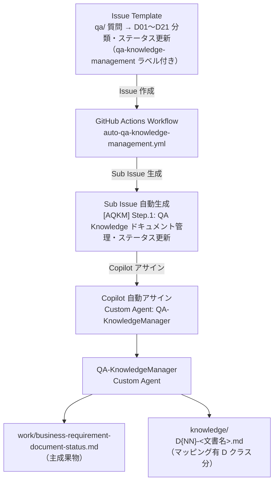
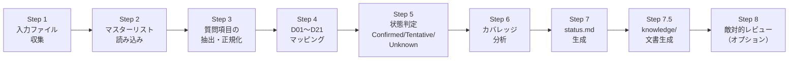

# QA Knowledge ドキュメント管理（QA Knowledge Management）

← [README](../README.md)

---

## 目次

- [概要](#概要)
  - [フローの目的・スコープ](#フローの目的スコープ)
  - [前提条件](#前提条件)
  - [処理フロー図](#処理フロー図)
  - [Agent 内部 9 ステップのフロー図](#agent-内部-9-ステップのフロー図)
- [入出力ファイル一覧](#入出力ファイル一覧)
- [ステップ概要](#ステップ概要)
- [方法 1: Web UI 方式（GitHub Copilot cloud agent）](#方法-1-web-ui-方式github-copilot-cloud-agent)
  - [Issue テンプレートからの実行手順](#issue-テンプレートからの実行手順)
  - [Issue テンプレートのオプション説明](#issue-テンプレートのオプション説明)
  - [実行結果の確認](#実行結果の確認)
- [方法 2: GitHub Copilot CLI SDK 版（ローカル実行）](#方法-2-github-copilot-cli-sdk-版ローカル実行)
  - [ウィザードモードでの実行手順](#ウィザードモードでの実行手順)
  - [CLI モードでの実行コマンド例](#cli-モードでの実行コマンド例)
- [QA Knowledge ドキュメント管理の詳細](#qa-分類の詳細)
  - [D01〜D21 文書クラスの概要](#d01d21-文書クラスの概要)
  - [状態判定ルール](#状態判定ルール)
  - [カバレッジ分析](#カバレッジ分析)
- [受け入れ条件（AC）](#受け入れ条件ac)
- [トラブルシューティング](#トラブルシューティング)

---

## 概要

### フローの目的・スコープ

`qa/` フォルダーに蓄積された質問ファイル（コンテキスト確認・品質チェックリスト等）を
`template/business-requirement-document-master-list.md` で定義された **D01〜D21 の文書クラス**に分類し、
各文書クラスの充足状況を `knowledge/business-requirement-document-status.md` としてまとめるタスクです。

処理全体は `QA-KnowledgeManager` Custom Agent が担当します。
**このワークフローはステップが 1 つのみ**（Agent 内部で Step 1〜Step 8 を順次処理）のシンプルな構成です。

### 前提条件

- `qa/` 配下に `.md` ファイルが 1 つ以上存在すること
- `template/business-requirement-document-master-list.md` が存在すること（D01〜D21 の文書クラス定義）
- セットアップ・共通設定は → [README.md 共通セットアップ手順](../README.md#共通セットアップ手順)

> 💡 **knowledge/ ファイルの活用**: 生成された `knowledge/D{NN}-<文書名>.md` ファイルは、設計・開発の各 Custom Agent に自動参照されます（`Arch-*`, `Dev-*`, `QA-*` の全 Custom Agent が対象）。設計精度向上のため、アプリケーション設計ワークフロー（App Design / App Dev）実行前に本ワークフローを実行しておくことを推奨します。


### 処理フロー図

Issue Template から自動実行されるフロー（方法 1）と、ローカル SDK から直接実行するフロー（方法 2）の全体像です。



### Agent 内部 9 ステップのフロー図

`QA-KnowledgeManager` Agent が 1 つのステップ内で順次実行する 9 つの処理フローです。



| ステップ | 処理内容 |
|---------|---------|
| Step 1 | `qa/` 配下の全 `.md` ファイルをリストアップし、状態・推論許可・日付等のメタデータを抽出 |
| Step 2 | `template/business-requirement-document-master-list.md` から D01〜D21 の文書クラス定義を読み込む |
| Step 3 | 各 `qa/` ファイルの質問テーブルを行単位でパースし、質問 ID・テキスト・採用回答・状態を抽出・正規化する |
| Step 4 | 分類ルール（`.github/instructions/knowledge-management.instructions.md` §2）に従い、各質問を Primary D / Contributing D にマッピング |
| Step 5 | 状態判定ルール（同 §3）に従い、各質問と D クラスの総合状態（Confirmed/Tentative/Unknown/NotStarted）を算出 |
| Step 6 | カバレッジギャップ（未着手 D クラス・不足項目）を特定し、推奨アクションを生成 |
| Step 7 | `knowledge/business-requirement-document-status.md` を status.md テンプレート（同 §4）の形式で生成 |
| Step 7.5 | QA マッピングが存在する各 D クラスについて `knowledge/D{NN}-<文書名>.md` を §7 テンプレートに従い個別生成（マッピング 0 件の D クラスはスキップ） |
| Step 8 | `adversarial-review` ラベルまたは `<!-- adversarial-review: true -->` が指定された場合のみ、5 軸で敵対的レビューを実施（省略可） |

---

## 入出力ファイル一覧

| 種別 | ファイル | 方向 | 説明 |
|------|---------|------|------|
| 必須入力 | `qa/*.md` | 読み取り専用 | 質問票・チェックリスト・コンテキスト確認ファイル群 |
| 必須入力 | `template/business-requirement-document-master-list.md` | 読み取り専用 | D01〜D21 の文書クラス定義 |
| 任意入力 | `knowledge/business-requirement-document-status.md`（既存） | 読み取り専用 | 差分更新の参考として使用（`force-refresh` が OFF の場合） |
| 主成果物 | `knowledge/business-requirement-document-status.md` | 新規生成 | D クラス別ステータス・カバレッジギャップ・詳細マッピングを含むレポート |
| 主成果物 | `knowledge/D{NN}-<文書名>.md` | 新規生成（可変数） | QA マッピングが存在する D クラスごとの個別文書ファイル（例: `D01-事業意図-成功条件.md`）。マッピングがない D クラスはファイルを生成しない |
| 中間成果物 | `work/QA-KnowledgeManager/Issue-xxx/plan.md` | 新規生成 | 実行計画（DAG + 見積） |
| 中間成果物 | `work/QA-KnowledgeManager/Issue-xxx/artifacts/mapping-log.md` | 新規生成 | 質問 → D クラスの詳細マッピングログ |

> [!NOTE]
> `qa/`、`docs/`、`template/` のファイルは**読み取り専用**です。Agent は変更・削除・追記を行いません。

> [!NOTE]
> `knowledge/` フォルダーへの出力ファイル数は、QA マッピングが存在する D クラス数によって変わります（0〜21 個）。マッピングがない D クラスのファイルは生成されません。

---

## ステップ概要

AQKM のワークフローは**ステップが 1 つのみ**です。

| Step ID | タイトル | Custom Agent | 入力 | 出力 | 依存 |
|---------|---------|-------------|------|------|------|
| 1 | QA Knowledge ドキュメント管理・ステータス更新 | `QA-KnowledgeManager` | `qa/*.md`、`template/business-requirement-document-master-list.md` | `knowledge/business-requirement-document-status.md`、`knowledge/D{NN}-<文書名>.md`（マッピング有 D クラス分）、`work/QA-KnowledgeManager/Issue-xxx/` | なし |

---

## 方法 1: Web UI 方式（GitHub Copilot cloud agent）

### Issue テンプレートからの実行手順

**Step.1. Issue を作成する**

1. リポジトリの **Issues** タブを開く
2. **New issue** をクリック
3. Issue テンプレートの一覧から **「qa/ 質問 → D01〜D21 分類・ステータス更新」** を選択

**Step.2. Issue フォームに入力する**

表示されるフォームに必要事項を入力します（詳細は下記「Issue テンプレートのオプション説明」を参照）。

**Step.3. Issue を Submit する**

「Submit new issue」をクリックすると、Issue テンプレートに設定されている `qa-knowledge-management` ラベルが自動付与されます。

> [!IMPORTANT]
> `qa-knowledge-management` ラベルは、**事前にリポジトリの Settings → Labels で手動作成**してください。ラベルが存在しない場合、Issue テンプレートの `labels:` 設定はサイレントにスキップされ、Sub Issue 自動生成などの処理は実行されません（skip されます）。
> ラベル作成は最初の 1 回のみ必要です。作成後は Issue 作成時に自動付与されます。
>
> **ラベル作成手順:**
> 1. リポジトリの **Settings → Labels** を開く
> 2. **New label** をクリック
> 3. Label name: `qa-knowledge-management`、Color: `#0E8A16`、Description: `run QA requirement classification workflow` を入力
> 4. **Create label** をクリックして完了
>
> 詳細は [getting-started.md のラベル設定セクション](./getting-started.md#step5-ラベル設定) を参照してください。

**Step.4. GitHub Actions ワークフローが自動起動する**

Issue 作成後、`qa-knowledge-management` ラベルを検知した `auto-qa-knowledge-management.yml` ワークフローが自動起動します。

ワークフローは以下を自動で実行します:

1. `aqkm:initialized` ラベルを Issue に付与（二重実行防止）
2. Sub Issue `[AQKM] Step.1: QA Knowledge ドキュメント管理・ステータス更新` を自動生成
3. Root Issue の Sub Issue として紐付け
4. `QA-KnowledgeManager` Custom Agent で Copilot への自動アサインを試行（成功した場合）
5. 自動アサインに成功した場合、Sub Issue に `aqkm:running` ラベルを付与（処理中を表示）

**Step.5. Copilot が処理を実行し、完了すると自動で完了通知が届く**

`QA-KnowledgeManager` Agent がタスクを完了し `aqkm:done` ラベルを付与すると、Root Issue に自動で完了コメントが投稿されます。

> **ワークフローが失敗した場合のフォールバック（手動アサイン）**
>
> ワークフローの自動アサインに失敗した場合は、以下の手順で手動でアサインしてください:
> 1. 生成された `[AQKM] Step.1: QA Knowledge ドキュメント管理・ステータス更新` Sub Issue を開く
> 2. 右サイドバーの **Assignees** から `@copilot` を選択
> 3. Copilot がコメントを返したら、Custom Agent 選択メニューから `QA-KnowledgeManager` を選択
>
> 詳細な操作方法は → [web-ui-guide.md](web-ui-guide.md) を参照してください。

### Issue テンプレートのオプション説明

| フィールド | 説明 | 省略 |
|-----------|------|------|
| **対象スコープ** | 「全ファイル」: `qa/` 配下の全 `.md` を対象。「指定ファイルのみ」: 下の「対象ファイル」欄で指定したファイルのみ対象 | 必須（選択式） |
| **対象ファイル** | スコープが「指定ファイルのみ」の場合に 1 行 1 ファイルで記載（例: `qa/AAS-Step1-context-review.md`） | 任意 |
| **再生成オプション** | チェックを入れると、既存の `knowledge/business-requirement-document-status.md` を完全に再生成（`force-refresh`）。チェックなしの場合は差分更新を試みる | 任意 |
| **追加コメント** | 補足・制約・注意事項（例: 新しく追加した `qa/XXX.md` のみ差分分類してほしい） | 任意 |

### 実行結果の確認

Agent が完了すると、以下のファイルが生成・更新されます:

- **`knowledge/business-requirement-document-status.md`** — D01〜D21 クラス別ステータス・カバレッジギャップ・詳細マッピングを含むメインレポート
- **`knowledge/D{NN}-<文書名>.md`** — QA マッピングが存在する D クラスごとの個別文書ファイル（例: `knowledge/D01-事業意図-成功条件.md`）。マッピングがない D クラスはファイルが生成されません
- **`work/QA-KnowledgeManager/Issue-xxx/plan.md`** — 実行計画
- **`work/QA-KnowledgeManager/Issue-xxx/artifacts/mapping-log.md`** — 詳細マッピングログ

---

## 方法 2: GitHub Copilot CLI SDK 版（ローカル実行）

### ウィザードモードでの実行手順

`python -m hve` を引数なしで実行すると対話型 wizard が起動します。
AQKM ワークフローの場合、wizard は以下のように進行します。

**ステップ 1: wizard 起動**

```bash
python -m hve
```

ウェルカムバナーが表示されます。

```text
╭──────────────────────────────────────────────────────────╮
│  HVE — GitHub Copilot SDK Workflow Orchestrator          │
│  ワークフローをインタラクティブに実行します                    │
╰──────────────────────────────────────────────────────────╯
```

**ステップ 2: ワークフロー選択**

番号付きメニューから `7` を入力して AQKM を選択します。

```text
? ワークフローを選択してください
  1) App Architecture Design (aas — 2 steps)
  2) App Design (aad — 16 steps)
  3) App Dev Microservice Azure (asdw — 24 steps)
  4) Batch Design (abd — 9 steps)
  5) Batch Dev (abdv — 7 steps)
  6) QA Knowledge Management (aqkm — 1 step)
> 6
```

**ステップ 3: ステップ選択（スキップ）**

AQKM はステップが 1 つのみのため、ステップ選択はスキップされ自動で全選択されます。

**ステップ 4: モデル選択**

使用する AI モデルを選択します（`Auto` = デフォルト: `claude-opus-4.6`）。

```text
? 使用するモデルを選択
  1) Auto
  2) claude-opus-4.6
  3) claude-sonnet-4.6
  ...
> 1
```

**ステップ 4.5: 実行モード選択**

実行モードを選択します。AQKM は短時間で完了するため「手動」または「クイック全自動」が推奨です。

```text
? 実行モードを選択
  1) クイック全自動  — デフォルト値で即実行（確認あり）
  2) カスタム全自動  — 全設定を手動入力後に自動実行
  3) 手動           — 従来どおり（実行中も対話あり）
> 3
```

> **クイック全自動を選択した場合**: オプション設定（ステップ 5）はスキップされ、デフォルト値が自動適用されます。タイムアウトは 86400 秒（24時間）になります。

**ステップ 5: オプション設定**

ブランチ・コンソール出力レベル（verbosity）・セッション idle タイムアウト・Issue/PR 作成の可否などを設定します。

```text
? ベースブランチ [main]: main
? コンソール出力レベルを選択: normal
? セッション idle タイムアウト（秒。デフォルト: 7200 = 2時間） [7200]: 7200
? GitHub Issue を作成する？ [y/N]: N
? ドライラン？ [y/N]: N
```

> [!NOTE]
> AQKM では並列実行数（1 ステップのため固定）、QA 自動投入、Review 自動投入のプロンプトはスキップされます。

**ステップ 6: ワークフロー固有パラメータ（スキップ）**

AQKM の固有パラメータ（`scope=all`、`target_files=qa/*.md`、`force_refresh=true`）はデフォルト値で自動設定され、プロンプトはスキップされます。

**ステップ 7: 設定サマリーと実行確認**

設定内容が一覧表示されます。確認後 `Y` を入力して実行します。

```text
┌─ 実行設定 ────────────────────────────────────────┐
│  ワークフロー : QA Knowledge Management (aqkm) │
│  ステップ     : 全ステップ（1 step）                  │
│  モデル       : claude-opus-4.6                    │
│  ブランチ     : main                               │
│  scope        : all                               │
│  target_files : qa/*.md                           │
│  force_refresh: true                              │
└───────────────────────────────────────────────────┘

? この設定で実行しますか？ [Y/n]: Y
```

**ステップ 8: ワークフロー実行**

確認後、スピナー付きでワークフローが実行されます。

### CLI モードでの実行コマンド例

wizard を使わずに直接コマンドを実行することもできます。

```bash
# 全 qa/ ファイルを対象に分類（デフォルト設定）
python -m hve orchestrate --workflow aqkm --branch main

# ドライランで確認（実際の SDK 呼び出しをしない）
python -m hve orchestrate --workflow aqkm --branch main --dry-run

# 指定ファイルのみ分類
python -m hve orchestrate --workflow aqkm --branch main \
  --scope specified \
  --target-files qa/AAS-Step1-context-review.md qa/AAD-Step1-2-service-list-context-review.md

# 差分更新（force-refresh を無効化）
python -m hve orchestrate --workflow aqkm --branch main --no-force-refresh

# Issue と PR を同時に作成
python -m hve orchestrate --workflow aqkm --branch main \
  --create-issues --create-pr --repo owner/repo
```

> [!NOTE]
> `--create-pr` を使用する場合、デフォルトの `ignore_paths` には `docs` / `images` / `infra` / `qa` / `src` / `test` / `work` が含まれます。
> `--ignore-paths` は既定の ignore_paths を部分的に変更するのではなく、**指定したパスリストで全体を上書き**するオプションです。
> そのため、`work` もスキャン対象に含めつつ他の既定無視パスを維持したい場合は、`work` を除いた残りのパスをすべて列挙して指定してください（例: `--ignore-paths docs images infra qa src test`）。
> 詳細は → [sdk-guide.md](sdk-guide.md) を参照してください。

---

## QA Knowledge ドキュメント管理の詳細

### D01〜D21 文書クラスの概要

| D クラス | 文書名 | 主なトピック |
|---------|--------|------------|
| D01 | 事業意図・成功条件 | KPI、成功条件、ROI、事業課題 |
| D02 | スコープ・対象境界 | MVP 範囲、対象外、フェーズ分割、P0/P1/P2 優先度 |
| D03 | ステークホルダー・責任分担 | 決定者、承認者、RACI、オーナー |
| D04 | 業務プロセス | 業務フロー、承認ワークフロー、清算サイクル、締め時刻 |
| D05 | ユースケース・シナリオ | UC 分類、粒度、カバレッジ、正常系/異常系 |
| D06 | 業務ルール・判定表 | ポイント付与ルール、ランク制度、有効期限、計算式 |
| D07 | 用語集・ドメインモデル | サービス名称、用語統一、集約境界、状態遷移 |
| D08 | データモデル・SoR/SoT | データストア選定、Event Sourcing、データ保持期間、PII 分類 |
| D09 | システムコンテキスト・責任境界 | APP 分離、サービス分割、責務境界、コンテキスト図 |
| D10 | API/Event/File 連携契約 | REST/gRPC、イベントスキーマ管理、API 設計スタイル |
| D11 | 画面・UX | ポータル BFF、チャネル（Web/ネイティブ）、画面遷移 |
| D12 | 権限・認可・職務分掌 | RBAC/ABAC、アクセス制御、ロール、テナント分離 |
| D13 | セキュリティ・プライバシー・監査 | 同意管理、監査ログ、個人情報マスキング、不正検知 |
| D14 | 国際化・地域差分 | 法域、通貨、タイムゾーン、多言語、税制 |
| D15 | 非機能・運用・監視・DR | SLA、可用性、レイテンシ、RPO/RTO、障害レベル |
| D16 | 移行・導入・ロールアウト | ロードマップ、フェーズ計画、移行、ロールバック |
| D17 | 品質保証・UAT | 契約テスト、QA チェックリスト、受入基準 |
| D18 | Prompt ガバナンス | 推論許可、推論補完ログ、SoT 一覧、投入可否 |
| D19 | ソフトウェアアーキテクチャ・ADR | ホスティング方式、インフラ構成、ADR、技術選定 |
| D20 | セキュア設計・実装ガードレール | サービス間認証（Managed Identity/mTLS）、脅威モデル |
| D21 | CI/CD・ビルド・リリース | 契約テスト（Pact 等）、デプロイ先選定、CI 品質ゲート |

> 詳細なマッピングルール・キーワード辞書は `.github/instructions/knowledge-management.instructions.md` §2・§6 を参照してください。

### 状態判定ルール

#### 質問単位の状態判定

| 条件 | 状態 |
|------|------|
| ユーザーが明示的に回答し、回答に「TBD（推論:」が含まれない | **Confirmed** |
| 回答に「TBD（推論:」を含む（Copilot が推論で補完） | **Tentative** |
| デフォルト回答案がそのまま採用された（ユーザー未回答） | **Tentative** |
| TBD / 未回答 / 回答欄が空 | **Unknown** |
| ブロッカー依存（「ブロッカー#N に依存」等の記述あり） | **Unknown** |
| ファイルの `**状態**:` が「回答待ち」の場合の全質問 | **Unknown** |

#### D クラス単位の総合状態

| 条件 | 総合状態 |
|------|---------|
| マッピングされた質問が 0 件 | **NotStarted** |
| マッピングされた全質問が Confirmed | **Confirmed** |
| Unknown が 1 件以上含まれる | **Unknown** |
| Confirmed と Tentative のみ（Unknown なし） | **Tentative** |

### カバレッジ分析

各 D クラスのカバレッジ分析は以下のルールで行われます。

**カバー率の算出:**

```
カバー率 = （Confirmed + Tentative の Primary 質問数）÷（Primary でマッピングされた総質問数）× 100%
```

- Contributing マッピングはカバー率の計算に含まれません（参考情報として記録のみ）
- マッピング質問が 0 件の D クラスはカバー率 0%（NotStarted）として扱われます

**カバレッジギャップ:**

`knowledge/business-requirement-document-status.md` の「カバレッジギャップ」セクションに、
NotStarted または不足と判定された D クラスと推奨アクションが記録されます。

---

## 受け入れ条件（AC）

Issue テンプレートに記載された受け入れ条件を以下に整理します。

- [ ] `qa/` 配下の全 `.md` ファイルが処理対象に含まれている
- [ ] 各質問が D01〜D21 のいずれかに Primary マッピングされている
- [ ] マッピング根拠が全質問に記載されている（捏造なし）
- [ ] `knowledge/business-requirement-document-status.md` が正しいフォーマットで生成されている
- [ ] サマリーの集計値と詳細マッピングの行数が一致している
- [ ] QA マッピングがある D クラスについて `knowledge/D{NN}-<文書名>.md` が生成されている
- [ ] QA マッピングがない D クラスの `knowledge/` ファイルは生成されていない
- [ ] `qa/`、`docs/`、`template/` のファイルが変更されていない

---

## トラブルシューティング

| 症状 | 原因 | 対処 |
|------|------|------|
| Agent が「`qa/` 配下にファイルが存在しない」として停止した | `qa/` フォルダーに `.md` ファイルがない | `qa/` に質問票ファイルを追加してから再実行する |
| `template/business-requirement-document-master-list.md` が見つからないエラー | テンプレートファイルが存在しない | リポジトリの `template/` フォルダーにファイルが存在するか確認する |
| `knowledge/business-requirement-document-status.md` が更新されない | `force-refresh` が OFF かつ差分なし | Issue の「再生成オプション」にチェックを入れて `force-refresh` を有効にする |
| D クラスのほとんどが `NotStarted` になっている | `qa/` ファイルの質問数が少ない、または質問の内容が偏っている | 各フェーズの質問票が `qa/` に揃っているか確認する |
| Agent が Plan-Only モードで停止した（`subissues.md` が生成された） | 処理量が 15 分超と判定された | `work/` 配下の `plan.md` と `subissues.md` を確認し、内容を確認した上でタスクを再アサインする |
| 敵対的レビューが実行されてほしくない | `adversarial-review` ラベルが付与されている | ラベルを外してから再実行する（ラベルも `<!-- adversarial-review: true -->` がなければ Step 8 はスキップされる） |

> 共通のトラブルシューティングは → [troubleshooting.md](troubleshooting.md) を参照してください。
