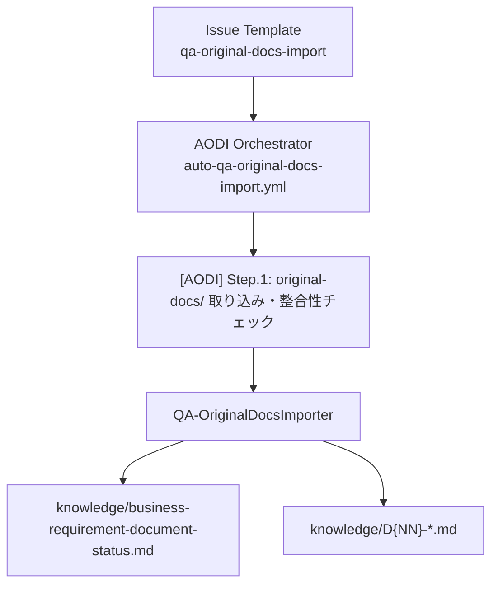
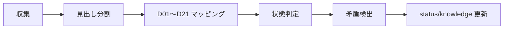

# Original Docs Import（AODI）

← [README](../README.md)

---

## 概要

`original-docs/` に配置した原本ドキュメントを D01〜D21 にマッピングし、`knowledge/` を生成・更新するワークフローです。  
`qa/` 起点の AQKM と組み合わせることで、原本 + QA 回答の統合 SoT を維持します。

### 前提条件

- `original-docs/` 配下にテキスト形式（`.md`, `.txt`, `.csv`）の入力がある
- `template/business-requirement-document-master-list.md` が存在する
- `qa-original-docs-import` ラベルが作成済み

### AQKM との関係

| 観点 | AQKM (`aqkm`) | AODI (`aodi`) |
|---|---|---|
| 入力 | `qa/*.md` | `original-docs/*` |
| 主担当 Agent | `QA-KnowledgeManager` | `QA-OriginalDocsImporter` |
| 主目的 | QA 回答の分類・反映 | 原本取り込み・矛盾検出 |
| 推奨実行順 | 先/後どちらでも可（差分更新） | AQKM の前後どちらでも可 |

---

## フロー図





---

## 入出力ファイル一覧

| 種別 | パス | 備考 |
|---|---|---|
| 入力 | `original-docs/*` | 読み取り専用 |
| 入力 | `template/business-requirement-document-master-list.md` | D01〜D21 定義 |
| 出力 | `knowledge/business-requirement-document-status.md` | ステータス + 矛盾一覧 + 横断未決一覧 |
| 出力 | `knowledge/D{NN}-<文書名>.md` | マッピングがある D クラスのみ |
| 中間 | `work/QA-OriginalDocsImporter/Issue-xxx/*` | plan/artifacts |

---

## ステップ概要

| Step | タイトル | Agent |
|---|---|---|
| 1 | original-docs/ 取り込み・整合性チェック | `QA-OriginalDocsImporter` |

---

## 方法1: Web UI（Issue Template）

1. Issues → New issue  
2. `original-docs/ → knowledge/ 取り込み・整合性チェック` を選択  
3. `対象スコープ` を選択（全ファイル / 指定ファイルのみ）  
4. 必要に応じて `force-refresh` / `auto-merge` を設定して Submit

---

## 方法2: CLI SDK（hve）

### Wizard

```bash
python -m hve
```

`aodi` を選択して実行。

### 直接実行例

```bash
# 全 original-docs を対象
python -m hve orchestrate --workflow aodi --branch main

# 指定ファイルのみ
python -m hve orchestrate --workflow aodi --branch main \
  --scope specified \
  --target-files original-docs/requirements.md original-docs/design.md

# 差分更新
python -m hve orchestrate --workflow aodi --branch main --no-force-refresh
```

---

## original-docs 準備ガイド

- 配置可能: `.md`, `.txt`, `.csv`
- バイナリ（Word/Excel/PDF）は Markdown へ変換して配置
- 変換前ファイルを保管する場合は `original-docs/binary-originals/` を使用
- 変換後ファイル先頭に以下を付与:

```html
<!-- source: binary-originals/{filename}, converted: {YYYY-MM-DD} -->
```

### 例ディレクトリ

```text
original-docs/
  requirements.md
  architecture.md
  binary-originals/
    requirements.docx
```

---

## AQKM 実行順の推奨

1. 原本更新直後は AODI 実行
2. QA 回答反映後は AQKM 実行
3. どちらか更新後にもう一方を再実行して `knowledge/` を同期

---

## 矛盾検出と STALENESS CHECK

- 矛盾タイプ: 同一D内矛盾 / D間矛盾 / qa との矛盾 / 用語矛盾
- 検出時: `⚠️ CONFLICT` マーカー + status.md の「矛盾一覧」に記録
- STALENESS: knowledge 冒頭メタブロックの `sources[].blob_sha` と各ソースの現行 blob SHA を比較し、差分があれば再生成
- stale 検出時の動作: AODI は stale を警告で終わらせず、対象 knowledge ファイルを再生成して SHA を更新する

---

## 受け入れ条件（AC）

- [ ] `original-docs/` 対象ファイルが処理対象に含まれる
- [ ] セクション単位で D01〜D21 の Primary マッピングがある
- [ ] status.md に矛盾一覧 / 横断未決一覧が反映される
- [ ] `original-docs/` 配下の変更が発生しない（読み取り専用）

---

## トラブルシューティング

| 症状 | 原因 | 対処 |
|---|---|---|
| ワークフローが起動しない | ラベル未作成 | `qa-original-docs-import` を作成 |
| 取り込み対象が 0 件 | scope/target_files 指定ミス | Issue 入力を見直し再実行 |
| 多数の Conflict | 原本間で定義不一致 | SoT 優先順位で暫定採用し、未解決として整理 |
| stale 判定が続く | ソース更新後に再生成未実施 | AODI を再実行 |
