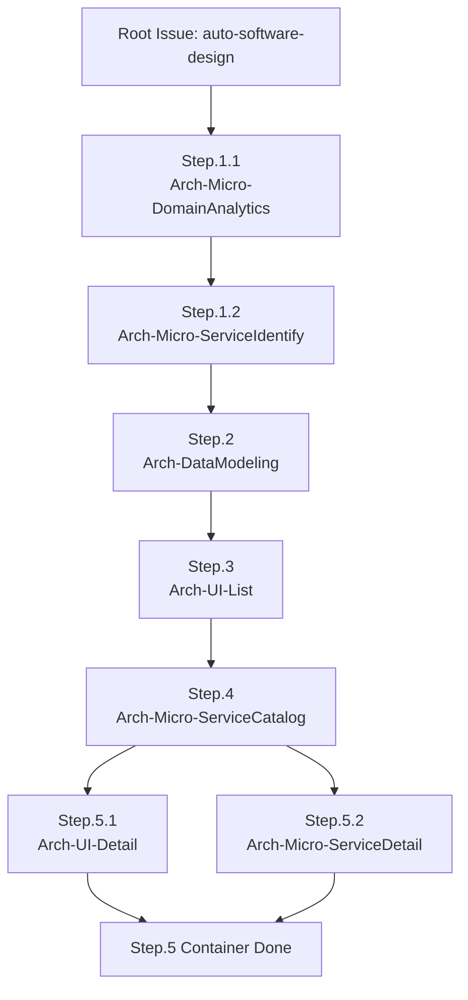
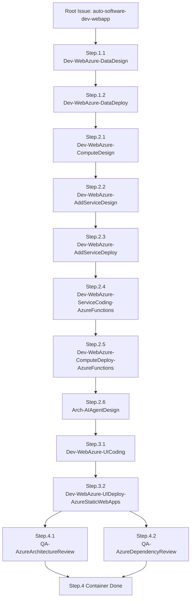

# アプリケーションのプロトタイプ開発 (GitHub Copilot Coding Agent / GitHub Copilot for Azure)


# はじめに

Copilot を使用してタスクに取り組むためのベスト プラクティス

https://docs.github.com/ja/copilot/using-github-copilot/coding-agent/best-practices-for-using-copilot-to-work-on-tasks


- プロダクション環境での利用には十二分に注意をしてください。Pull Requestをマージするかどうかは、**人**の判断ですので!

# ツール

- GitHub Copilot Coding Agent

  GitHub Copilot の **Coding Agent**のIssueからCoding Agentに作業をしてもらう前提です。

  https://github.blog/news-insights/product-news/github-copilot-meet-the-new-coding-agent/


  - Firewallの設定
    - いくつかのAzureリソースにアクセスするために、Firewallの設定が必要です。GitHubのリポジトリーの [Settings] - [Copilot] - [Coding agent] - [Internet access] - [Custom allowlist] で、以下のドメインを追加してください。
      - https://management.azure.com
      - https://login.microsoftonline.com
      - https://aka.ms
      - https://app.aladdin.microsoft.com
      - 他にも必要なドメインがあれば、エラーメッセージを確認して追加してください。
  - 判断はお任せしますが。多様なMCP Serverを使うために、一時的に、Firewallの設定を[Enable Firewall]を`Off`にしても良いかもしれません。
  　　
- GitHub Spark
  Reactでの画面作成とGitHubのRepositryとの同期による、プレビューが秀逸です。リポジトリーにクローンすることで、リポジトリー側での作業結果のプレビューとしても利用できます。

  https://github.com/features/spark?locale=ja

- Visual Studio Code + GitHub Copilot Agent Mode

  **Visual Studio Code**の利用もおススメします。
  - Markdownのプレビュー機能を活用して、ドキュメントの確認や編集
  - Azure MCP Serverを利用した、各種Azure上のリソース一覧の文字列作成
  - GitHubリポジトリへ人が作成するファイルの追加
  - GitHub Copilotが作成したコードのテストや修正
  - GitHub Copilot Agentモードによるコーディング支援

  - Microsoft Azure のSDKを使う場合は、GitHub Copilot for Azure を使います。

    https://learn.microsoft.com/ja-jp/azure/developer/github-copilot-azure/introduction


# Sample

**会員サービス**を題材にしたサンプルの要求定義や設計書などのサンプルです。

[サンプル](../sample/)

# 準備

- GitHubのRepositoryの作成
- MCP Serverの設定
- GitHub CopilotにIssueを自動的にアサインする認証設定

## Step.1. GitHubのRepositoryの作成

GitHubのRepositoryを作成します。GitHub Sparkや、GitHub Copilot Coding Agentが作業をするためのリポジトリーです。

### Step.1.1. 自分のRepositoryへ、このRepositoryの内容をコピー

以下のいずれかの方法で、ファイルを取得してください:

**方法1: Git Clone でリポジトリ全体を取得**

```bash
git clone https://github.com/dahatake/HypervelocityEngineering-Japanese.git
```

**方法2: 特定のフォルダーのみダウンロード（推奨）**

GitHub の Web インターフェースから:
- 画面右上の「Download ZIP」または各ファイルを個別にダウンロード

## Step.2. 自分のリポジトリへのコピー

ダウンロードしたファイルを、あなたのプロジェクトのリポジトリに全てコピーします。

フォルダー構造は以下のようになります:

```
your-project/
├── .github/
│   ├── agents/
│   │   ├── ArchitectureDesign-microservice-Step1-1.md
│   │   ├── ArchitectureDesign-microservice-Step1-2.md
│   │   ├── ArchitectureDesign-microservice-Step2.md
│   │   ├── Business-Documentation-Step2-1.md
│   │   ├── Business-Documentation-Step2-2.md
│   │   ├── Implementation-WebAppOnAzure-Step1-1.md
│   │   ├── Implementation-WebAppOnAzure-Step2-1.md
│   │   └── ... (その他の Custom Agent ファイル)
│   └── copilot-instructions.md
├── README.md
└── ... (その他のプロジェクトファイル)
```

Copilot を使用してタスクに取り組むためのベスト プラクティス:

https://docs.github.com/ja/copilot/using-github-copilot/coding-agent/best-practices-for-using-copilot-to-work-on-tasks#adding-custom-instructions-to-your-repository

### Custom Agent ファイルの編集（オプション）

各 Custom Agent ファイルは、プロジェクトの要件に応じてカスタマイズしてください。

例えば、`ArchitectureDesign-microservice.md` の中で、ユースケース ID やファイルパスを変更できます:

```markdown
## ユースケースID
- UC-xxx  ← あなたのユースケース ID に変更

## ユースケース
  - docs/usecase/{ユースケースID}/usecase-description.md  ← パスを変更
```

**編集する際の注意点:**
- ファイル先頭の YAML フロントマター（`---` で囲まれた部分）の `name` と `description` は Custom Agent の識別に使用されるため、わかりやすい名前に変更することをおすすめします
- `tools: ["*"]` は全てのツールへのアクセスを許可する設定です。必要に応じて制限できます
- プロンプトの内容は、プロジェクトの具体的な要件に合わせて調整してください


## Step.3. MCP Server 設定
GitHubのRepositoryに、GitHub Copilot Coding AgentがMCP Serverを利用できるように設定します。

以下の両方のBlog Postを参考にしてください。Microsoft Learnと、AzureのMCP Serverの両方を設定します。

- GitHub Copilot Coding agent に Azure MCP Server の設定をする:

  Microsoft 公式:

  https://learn.microsoft.com/ja-jp/azure/developer/azure-mcp-server/how-to/github-copilot-coding-agent

  私のBlog:

  https://qiita.com/dahatake/items/3230a92532c35fec7599

- GitHub Copilot Coding agent に Microsoft Learn Docs MCP Server の設定をする

  https://qiita.com/dahatake/items/4f6f0deb53333c0200ef

GitHub Copilot の Coding AgentのMCP Serverの設定文字列::

```text
{
  "mcpServers": {
    "Azure": {
      "type": "local",
      "command": "npx",
      "args": [
        "-y",
        "@azure/mcp@latest",
        "server",
        "start"
      ],
      "tools": ["*"]
    },
    "MicrosoftDocs": {
      "type": "http",
      "url": "https://learn.microsoft.com/api/mcp",
      "tools": ["*"]
    }
  }
}
```

## Step.4. GitHub CopilotにIssueを自動的にアサインする認証設定

PAT（Personal Access Token）をシークレットに設定し使用します。

1. **Personal Access Token (PAT) を作成**

 - GitHub Settings → Developer settings → Personal access tokens (fine-grained)
 - 権限: `metadata: read`, `actions: read/write`, `contents: read/write`, `issues: read/write`, `pull_requests: read/write`
 - シークレット名: `COPILOT_PAT`
 
 **トークン文字列**が作成されるので、保存をする。


2. **リポジトリのシークレットに登録**
   - **Settings → Secrets and variables → Actions → New repository secret**
   - Name: `COPILOT_PAT`
   - Value: 作成した PAT を貼り付け


MCPとPATの設定が完了すると、Repositoryには以下の様にsecretが設定されます。


## Step.5. labelの設定

以下のlabelをGitHubのRepositoryに作成してください。
- create-subissues
  PR作成後に、Coding Agentがsub Issueを作成するためのlabelです。PRのタスクが完了した後で`[create-subissues]`を入れると、Coding Agentがsub Issueを作成します。
  ラベルの設定自体は自動ではなく、費用負担や妥当性チェックの判断を人が行った方が良いため、**手動**で行う必要があります。


  

  設定後は、PRのコメントで以下の様に指示を出すと、Coding Agentがsub Issueを作成します。

  

# 利用手順  

## Issue Template を使った Custom Agent ワークフロー運用（推奨）

Issue Template を使うと、Issue起票だけで「どのステップを実行するか」「どの Custom Agent を使うか」「依存順序」を自動化できます。
このリポジトリでは、**Issue Template → Orchestrator Workflow → Sub-issue + Copilotアサイン**の流れが実装されており、
複数Custom Agentをワークフローのように段階実行しやすく、管理（進捗追跡・再実行・監査）もしやすくなっています。

### 対象ファイル（このリポジトリに実在する定義）

#### Issue Template
- `.github/ISSUE_TEMPLATE/auto-software-design.yml`
- `.github/ISSUE_TEMPLATE/auto-software-dev-webapp.yml`

#### Orchestrator Workflow（Issueイベントで自動実行）
- `.github/workflows/auto-software-design.yml`（ASD Orchestrator）
- `.github/workflows/auto-software-dev-webapp.yml`（ASDW Orchestrator）

#### Sub Issue 生成 Workflow（PRラベルで実行）
- `.github/workflows/create-subissues-from-pr.yml`

#### Custom Agent 定義ファイル（ASD/ASDWで使用）
- `.github/agents/Arch-Micro-DomainAnalytics.agent.md`
- `.github/agents/Arch-Micro-ServiceIdentify.agent.md`
- `.github/agents/Arch-DataModeling.agent.md`
- `.github/agents/Arch-UI-List.agent.md`
- `.github/agents/Arch-Micro-ServiceCatalog.agent.md`
- `.github/agents/Arch-UI-Detail.agent.md`
- `.github/agents/Arch-Micro-ServiceDetail.agent.md`
- `.github/agents/Dev-WebAzure-DataDesign.agent.md`
- `.github/agents/Dev-WebAzure-DataDeploy.agent.md`
- `.github/agents/Dev-WebAzure-ComputeDesign.agent.md`
- `.github/agents/Dev-WebAzure-AddServiceDesign.agent.md`
- `.github/agents/Dev-WebAzure-AddServiceDeploy.agent.md`
- `.github/agents/Dev-WebAzure-ServiceCoding-AzureFunctions.agent.md`
- `.github/agents/Dev-WebAzure-ComputeDeploy-AzureFunctions.agent.md`
- `.github/agents/Arch-AIAgentDesign.agent.md`
- `.github/agents/Dev-WebAzure-UICoding.agent.md`
- `.github/agents/Dev-WebAzure-UIDeploy-AzureStaticWebApps.agent.md`
- `.github/agents/QA-AzureArchitectureReview.agent.md`
- `.github/agents/QA-AzureDependencyReview.agent.md`

### 何が自動化されるか

- 起票時にラベル（`auto-software-design` / `auto-software-dev-webapp`）でパイプライン種別を確定
- OrchestratorがStep Issue / Sub-issueを生成し、親子リンクを自動作成
- 各StepのIssue本文に書かれた `## Custom Agent` からAgent名を抽出し、`copilot-swe-agent` へ自動アサイン
- `asd:ready` → `asd:running` → `asd:done` のラベル遷移で次ステップを自動起動
- 依存を満たしたら次のStepへ進み、並列可能なStepは並列起動

### Auto Software Design Pipeline（ASD）

#### Step と Custom Agent の対応

| Step | 内容 | Custom Agent | 依存 |
|---|---|---|---|
| Step.1.1 | ドメイン分析 | `Arch-Micro-DomainAnalytics` | 起点 |
| Step.1.2 | サービス一覧抽出 | `Arch-Micro-ServiceIdentify` | Step.1.1 |
| Step.2 | データモデル | `Arch-DataModeling` | Step.1.2 |
| Step.3 | 画面一覧/構造 | `Arch-UI-List` | Step.2 |
| Step.4 | サービスカタログ | `Arch-Micro-ServiceCatalog` | Step.3 |
| Step.5.1 | 画面定義書 | `Arch-UI-Detail` | Step.4 |
| Step.5.2 | マイクロサービス定義書 | `Arch-Micro-ServiceDetail` | Step.4 |

#### 実行フロー（Mermaid）



### Auto Software Dev WebApp Pipeline（ASDW）

#### Step と Custom Agent の対応

| Step | 内容 | Custom Agent | 依存 |
|---|---|---|---|
| Step.1.1 | Azure データストア選定 | `Dev-WebAzure-DataDesign` | 起点 |
| Step.1.2 | Azure データサービス Deploy | `Dev-WebAzure-DataDeploy` | Step.1.1 |
| Step.2.1 | Azure コンピュート選定 | `Dev-WebAzure-ComputeDesign` | Step.1完了 |
| Step.2.2 | 追加 Azure サービス選定 | `Dev-WebAzure-AddServiceDesign` | Step.2.1 |
| Step.2.3 | 追加 Azure サービス Deploy | `Dev-WebAzure-AddServiceDeploy` | Step.2.2 |
| Step.2.4 | サービスコード実装 | `Dev-WebAzure-ServiceCoding-AzureFunctions` | Step.2.3 |
| Step.2.5 | Azure Compute Deploy | `Dev-WebAzure-ComputeDeploy-AzureFunctions` | Step.2.4 |
| Step.2.6 | AI Agent 構成 | `Arch-AIAgentDesign` | Step.2.5 |
| Step.3.1 | UI 実装 | `Dev-WebAzure-UICoding` | Step.2完了 |
| Step.3.2 | Webアプリ Deploy (SWA) | `Dev-WebAzure-UIDeploy-AzureStaticWebApps` | Step.3.1 |
| Step.4.1 | WAF アーキテクチャレビュー | `QA-AzureArchitectureReview` | Step.3完了 |
| Step.4.2 | 整合性チェック | `QA-AzureDependencyReview` | Step.3完了（Step.4.1と並列） |

#### 実行フロー（Mermaid）



### 運用上の強調ポイント

- **Issue Templateが実行計画のUI**: 実行Step選択・ブランチ・リソースグループ等をフォーム入力で固定
- **Custom Agentの呼び出しが機械化**: Step本文の `## Custom Agent` をWorkflowが読み取り、Copilotに自動アサイン
- **依存制御が明確**: 先行Stepの `asd:done` を条件に次Stepが起動するため、順序ミスを減らせる
- **監査しやすい**: Issue/PR/ラベル遷移で、誰が何をいつ実行したかを追跡しやすい
- **大規模タスクに強い**: `create-subissues` ラベル運用と組み合わせることで、分割実行・再実行が容易

## Issue 作成時に Custom Agent を選択

1. **GitHub リポジトリで Issue を作成**
   - リポジトリの「Issues」タブから「New issue」をクリック

2. **Copilot にアサイン**
   - Issue の右側サイドバーで「Assignees」から `@copilot` を選択
   - または、Issue のコメント欄で `@copilot` をメンションして作業を依頼

3. **Custom Agent を選択（重要）**
   - Issue 作成時または Copilot へのアサイン時に、右側サイドバーに「Copilot」セクションが表示されます
   - 「Select agent」または「エージェントを選択」ドロップダウンから、使用したい Custom Agent を選択
   - 例: 「Architecture-Design-Step1-1-ドメイン分析」を選択

4. **タスクの詳細を Issue に記述**
   - Custom Agent が適切に動作するために、タスクの詳細、要件、参照すべきファイルパス、ユースケースID、Azureのリソースグループ名などを明確に記述してください
   - 例:
     ```markdown
     ## タスク
     要求定義ドキュメント（docs/requirements.md）を基に、ドメインモデリングを実施してください。
     
     ## 参照ファイル
     - docs/requirements.md
     - docs/usecase/UC-001/usecase-description.md
     ```

5. **Copilot が作業を実行**
   - 選択した Custom Agent が、専門知識を活用してタスクを実行します
   - 進捗状況は Pull Request として確認できます

### 利用可能な Custom Agent 一覧

このリポジトリには以下のような Custom Agent が用意されています:

#### ビジネスドキュメント関連
- **PM-UseCaseDetail**: ユースケースの詳細定義書を作成

#### アーキテクチャ設計関連
- **Arch-micro-DomainAnalytics**: DDDの観点でドメインモデリングを実施
- **Arch-micro-ServiceIdentify**: マイクロサービス候補をリストアップ
- **Arch-DataModeling**: データモデル設計
- **Arch-micro-ServiceDetail**: 各サービスの詳細仕様作成
- **Arch-UI-List**: 画面一覧と画面遷移図の作成
- **Arch-UI-Detail**: 全画面の詳細定義書作成
- **Arch-micro-ServiceCatalog**: 画面・機能・API・データのマッピング表作成

#### 実装関連（Azure Web App）
- **Impl-WebAzure-DataDesign**: Polyglot Persistenceアーキテクチャに基づくデータストア選定
- **Impl-WebAzure-DataDeploy**: Azure CLIスクリプトでデータストア作成とサンプルデータ登録
- **Impl-WebAzure-ComputeDesign**: 各マイクロサービスに最適なAzureホスティング環境の選定
- **Impl-WebAzure-AddServiceDesign**: 追加で必要なAzureサービスの選定
- **Impl-WebAzure-AddServiceDeploy**: Azure CLIスクリプトで追加サービスを作成
- **Impl-WebAzure-ServiceCoding**: サービスのコード実装と単体テスト作成
- **Impl-WebAzure-UICoding**: WebアプリケーションのUIコード実装

#### レビュー
- **QA-AzureDependencyReview**: Azureリソースの依存関係とコスト最適化のレビュー
- **QA-AzureArchitectureReview**: アーキテクチャとセキュリティのレビュー

### ヒント

- **適切な Custom Agent を選択**: タスクの内容に応じて、最も適した Custom Agent を選択することで、より高品質な結果が得られます
- **段階的に進める**: 大きなプロジェクトは、複数の Custom Agent を順番に使用して段階的に進めることをおすすめします
- **カスタマイズ**: Custom Agent ファイルはテンプレートです。プロジェクトの要件に応じて自由に編集・追加してください
- **フィードバック**: Custom Agent の実行結果を確認し、必要に応じて Issue のコメントで追加指示を出すことができます


# 実行

## Step.1. 要求定義などプロダクトマネジメントのドキュメントの整備

こちらのドキュメントを参考にしてください。

**Step 2.1. のユースケースの一覧まで**を行います。

なおMicrosoft 365 Copilotのリサーチツールの出力結果を、そのままMarkdownとして使用すると、根拠となった情報ソースへのURLや、サマリーのインフォグラフィックスのHTML文字列などが含まれています。
そのため、以下の様なPromptを使って、精緻なMarkdownのドキュメントを作成してください。その成型後の文字列をコピーしてMarkdownファイルとして保存します。

```text
{ドラフト文字}の中から、URLや、インフォグラフィックスや、HTML上での画像用の文字列などを削除して、精緻なMarkdownの文字列を作成してください。

# ドラフト文字列
(Microsoft 365 Copilotのリサーチツールの出力結果をここに貼り付け)
```

[要求定義の作成](./BusinessReqreuiment.md)

## Step.2. アプリケーション設計

こちらのドキュメントを参考にしてください。

- microservicesアーキテクチャ と Polyglot Persistancyのアプリケーション設計

  主にWeb/スマホのアプリケーション

  [microservies](./ApplicationDesign-microservice-polyglotpersistence.md)

- AI Agentのアプリケーション設計

  [AI-Agent version](./ApplicationDesign-AIAgent.md)

  [AI-Agent-Simple version (まずはこちらをお勧め)](./ApplicationDesign-AIAgent-Simple.md)


## Step.3. アプリケーションのコードの実装と、Azureへのデプロイ

こちらのドキュメントを参考にしてください。

- Webアプリケーション

  [Webアプリ](./Development-WebAppOnAzure.md)

- AI Agent

  TBD

# Azure データストア

dryrun 環境（リソースグループ: `dahatake-dryrun` / リージョン: `japaneast`）に以下のデータストアが作成済みです。

| ServiceID | 種別 | 接続 URL / FQDN |
|-----------|------|----------------|
| DS-01 | Azure SQL Server | `loyalty-sql-dahatakedryr.database.windows.net` |
| DS-02 | Azure SQL Database (LoyaltyDB) | `loyalty-sql-dahatakedryr.database.windows.net` |
| DS-03 | Azure Cosmos DB | `https://loyalty-cosmos-dahatakedryr.documents.azure.com:443/` |
| DS-04 | Azure Storage (Blob) | `https://loyaltystdahatakedryr.blob.core.windows.net/` |

詳細（Azure Resource ID、コンテナ一覧、SKU）は `TBD（service catalog 未格納・要確認）`。

## 検証手順

```bash
# 前提確認（Azure 認証・ツールチェック）
bash infra/azure/create-azure-data-resources-prep.sh

# リソース作成（冪等 — 既存の場合はスキップ）
bash infra/azure/create-azure-data-resources.sh

# サンプルデータ登録（冪等 — 再実行時は upsert/skip）
bash data/azure/data-registration-script.sh
```

実行ログ・件数検証結果は `TBD（work-status 未格納・要確認）`。

---

# Tips

## 分割されたタスクを実行する

大きなジョブの場合は、途中でエラーになった際のリカバリーや、60分も待っていたのに結果が期待と大きく異なる事がある、といったリスクが考えられます。
そのため、このCustom Agentでは不正確ですが概算の作業時間を見積もって、10分程度でタスクが完了しそうな、つまり30-45分以内には終わるであろうタスクに分割をするように指示しています。
その際には `work`フォルダーにPromptが作成されています。

GitHub Copilot Coding agentで**sub Issue**として、既存のIssueの情報も参照できる状態にして、Taskを実行します。
その際のPromptの例です。

```text
以下のファイルの内容をPromptとして読み込んで、タスクとして実行してください。
- `work/future-scenario-detail-sub-1.md`
```


## うまくいかなかった時の対応例

以下は、作成する**量**や**タスクの複雑さ**に応じて。

### タスクが途中で終了する

> [!WARNING]
> 指示したタスクがすべて完了していないのに、GitHub Copilotがタスクを終了することがあります。その場合は、コメントでCopilotに指示を出して、再度Copilotにコードを生成してもらってください。あるいは、自分で作業を継続してください。

> 作業継続のPromptの例:

```text
@copilot
以下の作業の進捗状況のドキュメントも参考にして、残作業を実行してください。
- `work/{ユースケースID}/api-azure-deploy-work-status.md`
```

### 結果の妥当性チェック

結果の精度が低い場合もあります。各Promptの実行後のPull Requestの中で、`@copilot`で指定して、別タスクとしてチェックを行ってもらうのがおススメです。

```text
@copilot
あなたの回答は、私があなたに依頼した「目的」を達成できているのかを、毎回、異なる観点でレビューをして、問題点を15～100個リストアップをしてください。
リストアップした問題点に対する解決策を立案し、その解決策を実行して、目的の達成のできる成果物を最終の成果物として作成してください。
このレビューは異なる観点で、3度行ってください。
```

### CI/CDのジョブがエラーになる

- Azureと連携した後は、CopilotがPRを実行している際にGitHub Actionsでのジョブ実行を行います。その際に私たち人によるApprovalが必要です。ただ、そのGitHub Actionsのジョブがエラーになることがあります。


- その際には、PRのコメントに以下の様な指示をして、GitHub Copilotに修正をさせるのも手です。

```text
@copilot 
reviewのチェックで、github actionsのジョブがエラーになりました。原因をリストアップして、解決策を考えて、修正をしてください。
```


### Coding Agentのタスクの実行エラーの対応策

> [!IMPORTANT]
> この状況になったら、即座にジョブを停止させてください。GitHub Actionsの課金に影響が考えられます。

Coding AgentのGitHub Actionsでのタスクが失敗することがあります。
Pull Requestの`Session`の中で、`Run Back command`が繰り返されて、何も処理が行われていません。以下の様なPromptをPull Requestのコメントとして投入して、GitHub Copilot君に修正させてください。

- エラーメッセージ

```cmd
  Run Bash command
  $ undefined
  No command provided. Please supply a valid command to execute.
```

Prompt:

```promot
@copilot ジョブの途中でコマンド文字列を生成できずに、ジョブを実行しようとして{エラーメッセージ}が表示されています。原因を究明して、対応策を検討して、問題を修正してください。
対応策が、うまくいかない場合は、`段階的アプローチ - 各セクションを個別のコミットで追加`を試してみてください。

### エラーメッセージ
Run Bash command
$ undefined
No command provided. Please supply a valid command to execute.
```