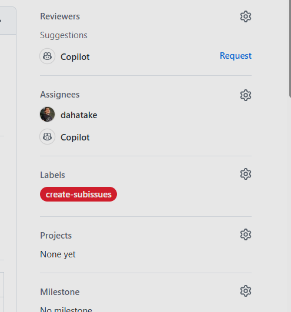

# HVE Cloud Agent Orchestrator はじめかた

← [README](../README.md)

> **対象読者**: GitHub.com 上で Issue Template からワークフローを実行したい初めてのユーザー  
> **前提**: GitHub リポジトリへのアクセス権と、初期セットアップを実施できる権限があること  
> **次のステップ**: セットアップ完了後はこのガイドの「[クイックスタート（サンプルで動かしてみる）](#クイックスタートサンプルで動かしてみる)」に進み、その後 [web-ui-guide.md](./web-ui-guide.md) の利用手順へ進んでください
>
> **別の方式を試したい場合**: [hve-cli-getting-started.md](./hve-cli-getting-started.md)（CLI）/ [hve-gui-getting-started.md](./hve-gui-getting-started.md)（GUI）

---

## 目次

- [前提条件](#前提条件)
- [セットアップフロー](#セットアップフロー)
- [HVE Cloud Agent Orchestrator 初回セットアップ チェックリスト](#hve-cloud-agent-orchestrator-初回セットアップ-チェックリスト)
- [Step.1. リポジトリの作成](#step1-リポジトリの作成)
- [Step.2. ファイルのコピー](#step2-ファイルのコピー)
- [Step.3. MCP Server 設定](#step3-mcp-server-設定)
  - [ローカル VS Code / Visual Studio に Microsoft Learn MCP を追加（任意）](#ローカル-vs-code--visual-studio-に-microsoft-learn-mcp-を追加任意)
- [Step.3.1. GitHub Copilot Skills 設定（推奨）](#step31-github-copilot-skills-設定推奨)
  - [Microsoft Docs プラグイン（Copilot CLI / Claude Code、任意）](#microsoft-docs-プラグインcopilot-cli--claude-code任意)
- [Step.4. 認証設定（COPILOT_PAT）](#step4-認証設定copilot_pat)
- [Step.4.1. 認証・認可の用途一覧（Cloud / Local / Azure）](#step41-認証認可の用途一覧cloud--local--azure)
- [Step.4.2. ワークフロー権限設定](#step42-ワークフロー権限設定)
- [Step.4.5. Self-hosted Runner 設定（オプション）](#step45-self-hosted-runner-設定オプション)
- [Step.5. ラベル設定](#step5-ラベル設定)
- [Step.6. Copilot 有効化](#step6-copilot-有効化)
- [Step.7. 初回疎通確認（HVE Cloud Agent Orchestrator）](#step7-初回疎通確認hve-cloud-agent-orchestrator)
- [クイックスタート（サンプルで動かしてみる）](#クイックスタートサンプルで動かしてみる)
- [参考: knowledge/ ディレクトリについて](#参考-knowledge-ディレクトリについて)
- [次のステップ](#次のステップ)

> **HVE Cloud Agent Orchestrator 初回チェックリスト**: セットアップ手順を進める前に、[HVE Cloud Agent Orchestrator 初回セットアップ チェックリスト](#hve-cloud-agent-orchestrator-初回セットアップ-チェックリスト) で必要な手順の全体像を確認しておくことを推奨します。

---

## 前提条件

| ツール | 必須 / オプション | 用途 |
|--------|-----------------|------|
| GitHub アカウント | **必須** | リポジトリ操作・Copilot 利用 |
| GitHub Copilot ライセンス | **必須** | Copilot cloud agent 利用 |
| Git | **必須** | リポジトリのクローン |
| Web ブラウザ | **必須** | GitHub.com の操作（Web UI 方式） |
| Python 3.11+ | HVE CLI / GUI Orchestrator のみ | HVE ローカル実行 |
| PySide6>=6.6 | HVE GUI Orchestrator のみ | GUI ウィザード起動（`pip install -e ".[gui]"` で自動インストール） |
| GitHub Copilot CLI（外部 `copilot` コマンド） | オプション | SDK 同梱ではなく外部 CLI を明示利用する場合 |
| Node.js（npm/npx） | オプション | MCP Server（filesystem 等）/ Work IQ / npm 方式の外部 Copilot CLI 使用時 |
| Microsoft Work IQ（`@microsoft/workiq`） | オプション | HVE CLI Orchestrator で M365 補助情報を参照する場合（[詳細](./hve-cli-orchestrator-guide.md#work-iq-mcp-連携オプション)） |

> Issue Template から実行する場合は、フォーム内の **「使用するモデル」** で `Auto`（既定: GitHub が最適モデルを動的選択。0.9x 計上）または任意モデルを選択できます。公式: https://docs.github.com/en/copilot/concepts/auto-model-selection

> Work IQ のセットアップ手順は [hve-cli-orchestrator-guide.md — Work IQ MCP 連携](./hve-cli-orchestrator-guide.md#work-iq-mcp-連携オプション) を参照してください。

---

## セットアップフロー


---

## HVE Cloud Agent Orchestrator 初回セットアップ チェックリスト

HVE Cloud Agent Orchestrator（GitHub Actions + Issue Template）を初めて使う場合、以下のチェックリストで抜け漏れを確認してください。各項目はこのガイドの対応ステップで設定します。

| # | チェック項目 | 参照ステップ | 必須 / オプション |
|---|---|---|---|
| 1 | リポジトリを作成した（テンプレートから `Use this template` または Clone） | [Step.1](#step1-リポジトリの作成) | **必須** |
| 2 | GitHub Copilot Cloud agent を有効化した（Settings → Copilot → Cloud agent） | [Step.6](#step6-copilot-有効化) | **必須** |
| 3 | MCP Server を設定した（Settings → Copilot → Cloud agent → MCP Servers） | [Step.3](#step3-mcp-server-設定) | **必須** |
| 4 | GitHub Copilot Skills を設定した（推奨） | [Step.3.1](#step31-github-copilot-skills-設定推奨) | 推奨 |
| 5 | `COPILOT_PAT`（Fine-grained, Issues Read/Write）をリポジトリ Secret に登録した | [Step.4](#step4-認証設定copilot_pat) | **必須**（未設定時はアサインがスキップされ警告） |
| 6 | Actions Workflow permissions を **Read and write permissions** に設定した | [Step.4.2](#step42-ワークフロー権限設定) | **必須** |
| 7 | Azure OIDC Secrets（`AZURE_CLIENT_ID` / `AZURE_TENANT_ID` / `AZURE_SUBSCRIPTION_ID`）を登録した（Azure デプロイ時） | [Step.4 - Azure Secrets](#3-azure-static-web-apps-デプロイ用-secretsswa-デプロイ時) | Azure 利用時必須 |
| 8 | Self-hosted Runner を設定した（GitHub-hosted runner を使う場合はスキップ可） | [Step.4.5](#step45-self-hosted-runner-設定オプション) | オプション |
| 9 | Setup Labels workflow を Actions タブから**手動実行**した（初回必須） | [Step.5](#step5-ラベル設定) | **必須** |
| 10 | 必要なラベル（`auto-app-selection`, `setup-labels` 等）が作成されたことを確認した | [Step.5 - 実行後の確認](#実行後の確認手順) | **必須** |
| 11 | 初回疎通確認を実施した | [Step.7](#step7-初回疎通確認hve-cloud-agent-orchestrator) | 推奨 |
| 12 | HVE Cloud Agent Orchestrator の利用手順（web-ui-guide.md）へ進む | [web-ui-guide.md](./web-ui-guide.md) | — |

### （任意）Cloud setup preflight を実行する

初回セットアップの抜け漏れをローカルから確認したい場合は、以下を実行してください。

```bash
bash .github/scripts/preflight-cloud-setup.sh OWNER/REPO
```

Self-hosted runner の label も確認する場合:

```bash
bash .github/scripts/preflight-cloud-setup.sh OWNER/REPO --self-hosted-runner-label <runner-label>
```

- 実行タイミングは **Setup Labels 実行前 / 実行後のどちらでも可** です。
- `setup-labels` や `auto-app-selection` が未作成でも、初回セットアップ前なら正常な場合があります。`WARN` が出たら [Step.5. ラベル設定](#step5-ラベル設定) の手順で Setup Labels workflow を手動実行してください。
- API 権限不足で取得できない項目は、未設定と断定せず手動確認に回してください。

---

## Step.1. リポジトリの作成

GitHub リポジトリを作成します。GitHub Copilot cloud agent が作業をするためのリポジトリです。

### Step.1.1. テンプレートリポジトリを使う（推奨）

本リポジトリ（`dahatake/RoyalytyService2ndGen`）はテンプレートリポジトリです。GitHub の「Use this template」ボタンから自分のリポジトリを作成できます。

1. [dahatake/RoyalytyService2ndGen](https://github.com/dahatake/RoyalytyService2ndGen) を開く
2. 右上の **「Use this template」** ボタンをクリック
3. **「Create a new repository」** を選択
4. リポジトリ名・可視性を設定して作成

> **注意**: このリポジトリは `HypervelocityEngineering-Japanese` テンプレートから作成されたインスタンスです。テンプレートから直接作成する場合は [dahatake/HypervelocityEngineering-Japanese](https://github.com/dahatake/HypervelocityEngineering-Japanese) も参照してください。

### Step.1.2. Git Clone で取得する場合

```bash
git clone https://github.com/dahatake/RoyalytyService2ndGen.git
```

---

## Step.2. ファイルのコピー

「Use this template」を使った場合は、このステップは不要です。

Git Clone でファイルを取得した場合は、ダウンロードしたファイルを**あなたのプロジェクトのリポジトリ**に全てコピーします。

フォルダー構造は以下のようになります:

```
your-project/
├── .github/
│   ├── prompts/
│   │   ├── Arch-Microservice-DomainAnalytics.prompt.md
│   │   ├── Arch-Microservice-ServiceIdentify.prompt.md
│   │   └── ... (その他の Prompt ファイル)
│   ├── ISSUE_TEMPLATE/
│   ├── workflows/
│   ├── scripts/
│   └── copilot-instructions.md
├── README.md
├── users-guide/
└── ... (その他のプロジェクトファイル)
```

### Prompt ファイルの編集（オプション）

各 Prompt ファイルは、プロジェクトの要件に応じてカスタマイズできます。

```markdown
## ユースケースID
- UC-xxx  ← あなたのユースケース ID に変更

## ユースケース
  - docs/usecase/{ユースケースID}/usecase-description.md  ← パスを変更
```

**編集する際の注意点:**
- ファイル先頭の YAML フロントマター（`---` で囲まれた部分）の `name` / `description` は Prompt の識別に使用されます
- `tools: ["*"]` は全てのツールへのアクセスを許可する設定です

詳細: [Copilot ベストプラクティス](https://docs.github.com/ja/copilot/using-github-copilot/coding-agent/best-practices-for-using-copilot-to-work-on-tasks#adding-custom-instructions-to-your-repository)

### Windows 初心者向けクイックセットアップ（`.cmd` ダブルクリック）

HVE CLI Orchestrator または HVE GUI Orchestrator を **Windows で初めて使う方向け** のショートカットです。PowerShell の実行ポリシー操作は不要で、`.cmd` をダブルクリックするだけでセットアップが完了します。

1. エクスプローラーで **`hve\setup-hve.cmd`** をダブルクリック
2. 既定で次が一括導入されます:
   - Python 3.11+ の検出（`py -3.11` → `python` → `python3` の順）
   - `.venv` 作成
   - `github-copilot-sdk`
   - mdq extras（`[mdq-watch,mdq-ja]`）
   - **GUI extras（`[gui,gui-docconvert]`、PySide6 + markitdown）** — `.cmd` は既定で GUI extras を含めます
3. 完了後の動線:
   - GUI を使う場合 → `hve-gui.bat` をダブルクリック（[hve-gui-orchestrator-guide.md](./hve-gui-orchestrator-guide.md)）
   - CLI を使う場合 → `python -m hve --help`（[hve-cli-orchestrator-guide.md](./hve-cli-orchestrator-guide.md)）

`.cmd` がサポートする引数（`.ps1` のフラグを verbatim 転送）:

| 引数 | 動作 |
|---|---|
| なし（既定） | venv 作成 + SDK + 全 extras（mdq-watch / mdq-ja / semantic / gui / gui-pty / gui-docconvert）を導入 |
| `-CheckOnly` | 状態確認のみ（変更なし） |
| `-NoGui` | GUI extras をスキップ（CLI のみ） |
| `-Minimal` | base のみインストール（extras 全スキップ） |
| `-Force` | `.venv` を削除して再作成 |
| `-SkipNltkDownload` | `nltk punkt_tab` の事前 DL をスキップ |
| `-WithSkills` | `microsoft/skills` を npx で導入（Node.js 20+ 必須） |
| `-Help` | 使い方表示 |

> **`.cmd` は `.ps1` を呼び出す薄ラッパ**です（v0.1.x 以降）。Windows PowerShell 5.1 と PowerShell 7+ のどちらでも動作します。

---

## Step.3. MCP Server 設定

GitHub リポジトリに GitHub Copilot cloud agent が MCP Server を利用できるように設定します。

GitHub リポジトリの **Settings → Copilot → Cloud agent → MCP Servers** で以下の設定を追加してください。

### 設定文字列

```json
{
  "mcpServers": {
    "Azure": {
      "type": "local",
      "command": "npx",
      "args": [
        "-y",
        "@azure/mcp@latest",
        "server",
        "start"
      ],
      "tools": ["*"]
    },
    "MicrosoftDocs": {
      "type": "http",
      "url": "https://learn.microsoft.com/api/mcp",
      "tools": ["*"]
    }
  }
}
```

### 参考リンク

- Azure MCP Server 設定: [Microsoft Learn](https://learn.microsoft.com/ja-jp/azure/developer/azure-mcp-server/how-to/github-copilot-coding-agent)
- Microsoft Learn Docs MCP Server: [Qiita 解説記事](https://qiita.com/dahatake/items/4f6f0deb53333c0200ef)

> HVE CLI Orchestrator の MCP Server 設定については [HVE CLI Orchestrator ユーザーガイド 付録A](./hve-cli-orchestrator-guide.md#付録a-mcp-server-設定ガイド) を参照してください。

### ローカル VS Code / Visual Studio に Microsoft Learn MCP を追加（任意）

上記 JSON は **GitHub Copilot cloud agent 向け** の設定です。手元の VS Code / Visual Studio から Microsoft Learn MCP サーバーを直接呼び出したい場合は、以下の手順で追加できます。

#### 1-click インストール

- VS Code: [Install Microsoft Learn MCP in VS Code](https://vscode.dev/redirect/mcp/install?name=microsoft-learn&config=%7B%22type%22%3A%22http%22%2C%22url%22%3A%22https%3A%2F%2Flearn.microsoft.com%2Fapi%2Fmcp%22%7D)
- Visual Studio: [Install Microsoft Learn MCP in Visual Studio](https://vs-open.link/mcp-install?%7B%22name%22%3A%22microsoft-learn%22%2C%22type%22%3A%22http%22%2C%22url%22%3A%22https%3A%2F%2Flearn.microsoft.com%2Fapi%2Fmcp%22%7D)

#### 手動設定（最小構成）

```json
{
  "servers": {
    "microsoft-learn": {
      "type": "http",
      "url": "https://learn.microsoft.com/api/mcp"
    }
  }
}
```

MCP サーバーはユーザー設定（全 VS Code セッションに適用）／ワークスペース設定のいずれにも構成可能です。詳細な手順・instructions の設定（推奨）は公式ドキュメントを参照してください。

- 公式手順: [Microsoft Learn MCP サーバーを使い始める](https://learn.microsoft.com/ja-jp/training/support/mcp-get-started)

---

## Step.3.1. GitHub Copilot Skills 設定（推奨）

Azure 関連の作業を効率化するため、**Azure Skills** のインストールを推奨します。本リポジトリでは外部由来の Azure Skills は `.gitignore` で除外しており、リポジトリには含まれていません。各自のローカル環境にセットアップ時に展開します。

- **Azure Skills**: https://github.com/microsoft/azure-skills
- **Skills CLI**: https://github.com/microsoft/skills
- **展開先**: `.github/skills/azure-skills/`（gitignore 済み・コミット対象外）

### 推奨: セットアップスクリプトに `--with-skills` フラグを付けて自動インストール

Node.js 20+（`npx` 利用可能）が PATH 上にあれば、`hve/setup-hve.*` 実行時に `--with-skills` / `-WithSkills` を付与するだけで自動的に `microsoft/skills` をインストールできます。

```powershell
# Windows (PowerShell)
powershell -ExecutionPolicy Bypass -File hve\setup-hve.ps1 -WithSkills
```

```cmd
REM Windows (cmd / batch)
hve\setup-hve.cmd --with-skills
```

```bash
# Linux / macOS
./hve/setup-hve.sh --with-skills
```

GUI extras は既定で同時にインストールされます。`--with-skills` とは独立して使えます。

```powershell
powershell -ExecutionPolicy Bypass -File hve\setup-hve.ps1 -WithSkills
```

> **注意**: `npx` が見つからない場合はインストールはスキップされ、警告が出力されます。Node.js を後からインストールした場合は下記の手動コマンドで導入してください。

### 手動インストール（セットアップスクリプトを使わない場合）

対話モード（スキルを選択してインストール）:

```bash
npx -y skills add microsoft/skills
```

全スキルを一括インストール（非対話モード）:

```bash
npx skills add microsoft/skills --skill '*' --agent copilot --yes --copy
```

インストール後、`.github/skills/azure-skills/` 配下に SKILL.md ファイルが配置され、GitHub Copilot cloud agent / Copilot CLI が Azure 関連タスクで自動的に Skills を活用します（`.github/copilot-instructions.md` §1「ワークフロー概要」および §2「Skills ルーティングテーブル」参照）。

### Microsoft Docs プラグイン（Copilot CLI / Claude Code、任意）

Copilot CLI または Claude Code を使う場合、Microsoft Learn MCP サーバーと 3 つのエージェントスキル（`microsoft-docs` / `microsoft-code-reference` / `microsoft-skill-creator`）を含む `microsoftdocs/mcp` プラグインを導入できます。

#### Copilot CLI

```text
/plugin install microsoftdocs/mcp
```

#### Claude Code

```text
/plugin marketplace add microsoftdocs/mcp
/plugin install microsoft-docs@microsoft-docs-marketplace
```

> **注意**: 本プラグインは **Copilot CLI / Claude Code 用** です。HVE Cloud Agent Orchestrator（GitHub Actions 上の Copilot cloud agent）は Step.3 の JSON 設定（`MicrosoftDocs` HTTP MCP）でカバーされており、本プラグインのインストールは不要です。

- 公式手順（プラグイン / instructions 設定）: [Microsoft Learn MCP サーバーを使い始める](https://learn.microsoft.com/ja-jp/training/support/mcp-get-started)

### 自動同期（任意）

このリポジトリには Azure Skills の手動同期ワークフロー（`.github/workflows/sync-azure-skills.yml`）が含まれています。

- **トリガー**: GitHub Actions タブからの手動実行（`workflow_dispatch`）のみ。**cron による自動実行は無効化済み**
- **動作**: 実行時のみ microsoft/skills の最新版を取得し、差分がある場合は PR を作成（ただし `.github/skills/azure-skills/` は `.gitignore` で除外されているため、通常は PR が作成されません。明示的にコミット運用へ切り戻す場合の保険用途）
- **カスタムスキル保護**: `large-output-chunking`, `repo-onboarding-fast`, `task-dag-planning`, `work-artifacts-layout` は同期対象外

### markdown-query Skill（ローカル完結 Markdown 横断クエリ）

Copilot / Prompt が `docs/` `knowledge/` `qa/` `original-docs/` `work/` 等の Markdown を横断参照する際の Context Window を最小化する、**100% ローカル**で動作する Skill です。クラウド埋め込み・外部 API 呼び出しは行いません。

- Skill 本体: `.github/skills/markdown-query/SKILL.md`
- 実装: `mdq`（SQLite + BM25）
- 索引対象（既定 11 フォルダ）: `docs/`, `docs-generated/`, `users-guide/`, `template/`, `knowledge/`, `qa/`, `original-docs/`, `work/`, `sample/`, `session-state/`, `hve-dev/`

#### 任意依存の導入（推奨）

`hve/setup-hve.ps1` / `hve/setup-hve.sh` を `-Minimal` / `--minimal` 無しで実行している場合、`[mdq]` extras は既定で導入されています。以下はセットアップスクリプトを使わない場合や手動再導入用の手順です。

```bash
pip install -e ".[mdq]"   # rank_bm25 + tiktoken を同時導入
```

未導入時は内蔵の MiniBM25（純 stdlib）と char/4 トークン推定でフォールバック動作します。

#### GUI Orchestrator + 添付ファイル Markdown 変換（任意）

HVE GUI Orchestrator の ARD ワークフローで `.docx` / `.pdf` / `.xlsx` / `.xls` / `.pptx` / `.html` をドラッグ&ドロップで Markdown 化するには、`gui` + `gui-docconvert` extras（変換エンジンは [microsoft/markitdown](https://github.com/microsoft/markitdown)）が必要です。セットアップスクリプトをオプション無しで実行すれば既定で導入されます。

```powershell
# Windows
powershell -ExecutionPolicy Bypass -File hve\setup-hve.ps1
```

```bash
# Linux / macOS
./hve/setup-hve.sh
```

手動インストールする場合: `pip install -e ".[gui,gui-docconvert]"`

#### 初回索引と動作確認

```bash
python -m mdq index
python -m mdq stats
python -m mdq search --q "業務要件" --top-k 3 --format compact
```

`stats` で `files > 0 && chunks > 0` を確認できれば成功です。索引ファイルは `.mdq/index.sqlite` に作成され、リポジトリの `.gitignore` で除外済みです（コミット不可）。

#### HVE Cloud Agent Orchestrator での挙動

- Skill 発見は `.github/skills/_routing/SKILL.md` の planning 共通テーブル経由で行われます（登録済）。
- Cloud runner 上では作業ツリーが揮発するため、索引は **その実行内で都度 `python -m mdq index` を実行** する必要があります。CLI Orchestrator 側のオペレーション詳細は [HVE CLI Orchestrator ガイド 付録F](./hve-cli-orchestrator-guide.md#付録f-markdown-横断クエリmarkdown-query-skill) を参照してください。
- 効果計測（撤去判断用）の手順は [HVE CLI Orchestrator ガイド 付録F.7](./hve-cli-orchestrator-guide.md#f7-パフォーマンス確認手順撤去判断用) を参照してください。

---

## Step.4. 認証設定（COPILOT_PAT）

PAT（Personal Access Token）をリポジトリのシークレットに設定します。Copilot が Issue に自動アサインされるために必要です。

### 1. Personal Access Token（PAT）を作成

1. GitHub.com → プロフィールアイコン → **Settings** → **Developer settings**
2. **Personal access tokens** → **Fine-grained tokens** → **Generate new token**
3. 基本情報を入力:
   - **Token name**: 任意（例: `copilot-pat`）
   - **Expiration**: 90日以内を推奨
4. **Repository access**: 対象リポジトリを選択
5. **Permissions（Repository permissions）**:
   - `Issues`: Read and write
   - `Metadata`: Read-only（自動付与）
6. **Generate token** をクリックし、表示されたトークン文字列を**必ずこの時点でコピー**

> ⚠️ トークンはこの画面を離れると二度と表示されません。

### 2. リポジトリのシークレットに登録

1. リポジトリの **Settings** → **Secrets and variables** → **Actions**
2. **New repository secret** をクリック
3. Name: `COPILOT_PAT`
4. Value: 作成した PAT を貼り付け

MCP と PAT の設定が完了すると、Repository には以下のように secret が設定されます。


### 3. Azure Static Web Apps デプロイ用 Secrets（SWA デプロイ時）

> [!NOTE]
> このステップは **Web App デプロイ** を実行する場合の確認です。

SWA デプロイは OIDC 認証（`azure/login@v2`）+ `shibayan/swa-deploy@v1` の `app-name` モードを使用するため、**`AZURE_STATIC_WEB_APPS_API_TOKEN` や `GITHUB_PAT` の設定は不要**です。

以下の 3 つの Secrets は Functions deploy でも使用するものと共通です。すでに設定済みであれば追加作業は不要です。

| Secret 名 | 説明 |
|-----------|------|
| `AZURE_CLIENT_ID` | OIDC サービスプリンシパルのクライアント ID |
| `AZURE_TENANT_ID` | Azure AD テナント ID |
| `AZURE_SUBSCRIPTION_ID` | Azure サブスクリプション ID |

#### スクリプト実行（PAT 不要）

```bash
# GITHUB_PAT は不要。Azure リソース作成のみ実行する。
bash src/infra/azure/create-azure-webui-resources.sh
```

スクリプトが Azure Static Web Apps リソースを作成します。CI/CD ワークフローが OIDC 経由でデプロイトークンを自動取得します。

---

<a id="認証認可の用途一覧cloud--local--azure"></a>

## Step.4.1. 認証・認可の用途一覧（Cloud / Local / Azure）

初回セットアップ時に使う主な認証情報と設定の役割を整理します。  
**`COPILOT_PAT`（Cloud の Copilot 自動アサイン用）と `GH_TOKEN`（HVE CLI Orchestrator の Issue/PR 作成用）は用途が異なります。**

| 認証情報 / 設定 | 主な使用場所 | 用途 |
|---|---|---|
| GitHub Copilot ライセンス | Cloud / Local | Copilot cloud agent / Copilot SDK の利用 |
| Repository の Copilot Cloud agent 有効化 | Cloud | GitHub Issues から Copilot agent を動かす |
| `COPILOT_PAT` | Cloud Orchestrator | `assign-copilot.sh` が Copilot を Issue にアサインするため |
| `GITHUB_TOKEN` | GitHub Actions | ワークフロー内でラベル、Issue、コメント等を操作する自動付与トークン |
| Actions Workflow permissions: Read and write | Cloud | `setup-labels.yml` などがラベル作成 API を呼ぶため |
| `gh auth login` | HVE CLI Orchestrator | GitHub CLI の認証状態を利用する基本認証 |
| `GH_TOKEN` | HVE CLI Orchestrator | `--create-issues` / `--create-pr` 等で Issue / PR を作成する場合に必要 |
| `AZURE_CLIENT_ID` / `AZURE_TENANT_ID` / `AZURE_SUBSCRIPTION_ID` | Azure deploy | OIDC で Azure にログインするため |
| MCP Servers 設定 | Cloud / Local | Azure Docs / Microsoft Learn / Work IQ 等の外部情報参照 |

### Cloud Orchestrator 側の認証前提（初回推奨）

- GitHub Copilot ライセンスが有効であること
- Repository の **Settings → Copilot → Cloud agent** で有効化されていること
- MCP Servers は **Settings → Copilot → Cloud agent → MCP Servers** で設定すること
- `COPILOT_PAT` は Copilot 自動アサインに利用（未設定時は既存スクリプト設計で警告してスキップされる場合あり）
- 初回セットアップでは `COPILOT_PAT` の設定を推奨（実運用では実質必須）
- Workflow permissions は **Read and write permissions** が必要
- `GITHUB_TOKEN` は GitHub Actions の自動付与トークン（`GH_TOKEN` / `COPILOT_PAT` とは別物）

### Static Web Apps / Azure 認証方針（正本）

- Azure Static Web Apps デプロイは **OIDC 認証を基本方針** とします
- 通常は `AZURE_STATIC_WEB_APPS_API_TOKEN` / `GITHUB_PAT` は不要です
- 必要な Secrets は `AZURE_CLIENT_ID` / `AZURE_TENANT_ID` / `AZURE_SUBSCRIPTION_ID` です
- 一部の Issue Template / reusable workflow 本文に旧トークン記述が残る場合がありますが、初期セットアップは本セクションの OIDC 方針を正本としてください（文言統一は後続 PR で対応予定）

---

## Step.4.2. ワークフロー権限設定

> [!IMPORTANT]
> **Step.5（ラベル設定）より前に、この権限設定を完了してください。**
> `setup-labels.yml` ワークフローはラベル作成 API を呼び出すため、**Read and write permissions** でないとラベル作成が 403 エラーで失敗します。

リポジトリの **Settings → Actions → General → Workflow permissions** を **Read and write permissions** に設定してください。

---

## Step.4.5. Self-hosted Runner 設定（オプション）

> [!NOTE]
> **このステップは省略可能です。** GitHub-hosted runner（`ubuntu-latest` 等）を使う場合はスキップして [Step.5. ラベル設定](#step5-ラベル設定) に進んでください。

組織のセキュリティ要件、閉域ネットワーク、固定 IP、専用ツール利用などの理由で、自前の実行環境でワークフローを動かしたい場合に設定します。**ラベル初期化（Step.5）や Orchestrator 実行前**に設定しておくことを推奨します。

**設定が必要なケース（例）:**

- 組織のネットワークポリシーで GitHub-hosted runner からのアクセスが制限されている
- ワークフロー内で固定 IP が必要（Azure Firewall の IP 制限等）
- Python や Azure CLI など特定ツールをイメージにプリインストールしておきたい

**設定手順:** [setup-self-hosted-runner.md](./setup-self-hosted-runner.md) を参照してください。

> [!IMPORTANT]
> **runner label の整合性に注意してください。** Issue Template や workflow ファイルで `runs-on:` に指定する runner label（例: `[self-hosted, linux, x64, aca]`）は、Self-hosted Runner 側に設定したラベルと**一致している必要があります**。不一致の場合、ジョブが `Waiting for a runner...` のまま進まなくなります。

---

## Step.5. ラベル設定

ワークフローのトリガーに使用するラベルを GitHub リポジトリに作成します。

> [!WARNING]
> **このステップは、他のワークフローを使い始める前に必ず完了してください。**
>
> ラベルが未設定の状態では、**すべての Issue テンプレート経由のワークフロー起動が動作しません**。これは `setup-labels` だけでなく、`auto-app-selection`・`auto-app-detail-design`・`knowledge-management` など**全ワークフロートリガー系ラベル**に影響します。
>
> GitHub の Issue Template の `labels:` フィールドは、リポジトリに**既に存在するラベルのみ**を Issue に自動付与します。ラベルが存在しない場合は Issue 作成時にラベルの付与がサイレントにスキップされ、**ラベル付与を前提とした対象ジョブや処理は実行されません（ジョブがスキップされます）**。

### 初回セットアップの全体フロー

```
新規リポジトリ作成
  → Step.4. COPILOT_PAT 設定
  → ワークフロー権限設定（Read and write permissions）
  → Step.5. Actions タブから Setup Labels を手動実行  ← ★ ここが最重要
  → ラベル作成完了
  → 以降は Issue テンプレートからワークフローを起動可能
```

### 推奨方法: Setup Labels ワークフローを実行する

> [!NOTE]
> リポジトリ作成後に **1度だけ** 実行する想定です。ラベル定義（`.github/labels.json`）が更新された場合は再実行できます（冪等設計のため、複数回実行しても安全です）。

#### 初回実行（Actions タブから手動実行）

##### なぜ手動実行が必要か（鶏と卵問題）
`setup-labels` ワークフロー自体は Issue の `opened` でも起動しますが、実際のラベル作成ジョブは `setup-labels` ラベルの有無を `if:` 条件で判定しています。新規リポジトリの初回は `setup-labels` ラベル自体がまだ存在しないため、Issue テンプレートから起動しても処理がスキップされます。このため、初回は Issue テンプレートからではなく、Actions タブから直接手動実行する必要があります。

> [!IMPORTANT]
> 手動実行の前提条件: **ワークフロー権限が「Read and write permissions」** になっていることを確認してください（上記「ワークフロー権限設定」セクション参照）。権限が「Read-only」のままでは、ラベル作成 API が 403 エラーで失敗します。

`setup-labels` ラベルがまだリポジトリに存在しない場合は、以下の手順で手動実行してください:

1. GitHub リポジトリの **Actions** タブを開く
2. 左サイドバーから **Setup Labels** ワークフローを選択
3. **Run workflow** ボタンをクリック
4. **Run workflow** で実行する

#### 実行後の確認手順

1. Actions タブでワークフローの実行結果が **✅ 成功**（緑チェック）になっていることを確認する
2. **Settings → Labels** を開き、`auto-app-selection`・`auto-app-detail-design`・`setup-labels` などのラベルが作成されていることを目視確認する
3. （オプション）Issues タブ → **New issue** → **Setup Labels: ラベル初期セットアップ** テンプレートを選択し、Issue を作成したときに `setup-labels` ラベルが自動付与されることを確認する（2回目以降の動作確認）

#### 2回目以降（Issue テンプレートから実行）

`setup-labels` ラベルが作成済みの場合は、Issue テンプレートから実行できます:

1. GitHub リポジトリの **Issues** タブを開く
2. **New issue** をクリック
3. **Setup Labels: ラベル初期セットアップ** テンプレートを選択
4. 確認チェックボックスにチェックを入れて Issue を作成する

### トラブルシューティング

<details>
<summary>Issue テンプレートから Issue を作成したが、ワークフローが起動しない</summary>

**原因:** ラベルがリポジトリに存在しないため、Issue 作成時にラベルが付与されませんでした。

**対処法:** Actions タブから **Setup Labels** ワークフローを手動実行してください（上記「初回実行」手順参照）。

</details>

<details>
<summary>Setup Labels ワークフローが失敗する（ラベル作成 API が 403 を返す）</summary>

**原因:** ワークフロー権限が「Read-only」になっています。

**対処法:** **Settings → Actions → General → Workflow permissions** を **「Read and write permissions」** に変更してから、再度 Actions タブから Setup Labels ワークフローを手動実行してください。

</details>

### 管理対象ラベル

Setup Labels ワークフローが作成・更新するラベル一覧です:

**ワークフロートリガー系（13 個）**

| ラベル名 | 色 | 用途 |
|---------|-----|------|
| `auto-app-selection` | `#0E8A16` | AAS ワークフロートリガー |
| `auto-app-detail-design` | `#0E8A16` | AAD ワークフロートリガー |
| `auto-app-detail-design-web` | `#1D76DB` | AAD-WEB ワークフロートリガー |
| `auto-ai-agent-design` | `#7B68EE` | AAG ワークフロートリガー |
| `auto-app-dev-microservice` | `#1D76DB` | ASDW ワークフロートリガー |
| `auto-app-dev-microservice-web` | `#0E8A16` | ASDW-WEB ワークフロートリガー |
| `auto-ai-agent-dev` | `#6A5ACD` | AAGD ワークフロートリガー |
| `auto-dataflow-design` | `#0E8A16` | ADFD ワークフロートリガー |
| `auto-dataflow-dev` | `#0E8A16` | ADFDV ワークフロートリガー |
| `auto-app-documentation` | `#0E8A16` | ADOC ワークフロートリガー |
| `knowledge-management` | `#0E8A16` | AKM ワークフロートリガー |
| `self-improve` | `#0E8A16` | 自己改善ループトリガー |
| `original-docs-review` | `#0E8A16` | AQOD ワークフロートリガー |

**PR 制御系（6 個）**

| ラベル名 | 色 | 用途 |
|---------|-----|------|
| `auto-context-review` | `#1D76DB` | Copilot 敵対的レビュートリガー |
| `auto-qa` | `#BFD4F2` | Copilot 質問票作成トリガー |
| `create-subissues` | `#E4E669` | Sub Issue 自動作成トリガー |
| `split-mode` | `#D93F0B` | 分割モード PR 識別 |
| `plan-only` | `#D93F0B` | plan.md のみの PR 識別 |
| `auto-approve-ready` | `#1D76DB` | PR 自動 Approve & Auto-merge トリガー |

**モデル選択系（15 個 = main 5 + review 5 + qa 5）**

| ラベル名 | 色 | 用途 |
|---------|-----|------|
| `model/Auto` | `#6f42c1` | Copilot cloud agent モデル指定: Auto（GitHub が最適モデルを動的選択。0.9x 計上、1x 超モデルは対象外） |
| `model/claude-opus-4.7` | `#6f42c1` | Copilot cloud agent モデル指定: claude-opus-4.7 |
| `model/claude-opus-4.6` | `#6f42c1` | Copilot cloud agent モデル指定: claude-opus-4.6 |
| `model/gpt-5.5` | `#6f42c1` | Copilot cloud agent モデル指定: gpt-5.5 |
| `model/gpt-5.4` | `#6f42c1` | Copilot cloud agent モデル指定: gpt-5.4 |
| `review-model/Auto` | `#6f42c1` | Copilot cloud agent レビュー用モデル指定: Auto |
| `review-model/claude-opus-4.7` | `#6f42c1` | Copilot cloud agent レビュー用モデル指定: claude-opus-4.7 |
| `review-model/claude-opus-4.6` | `#6f42c1` | Copilot cloud agent レビュー用モデル指定: claude-opus-4.6 |
| `review-model/gpt-5.5` | `#6f42c1` | Copilot cloud agent レビュー用モデル指定: gpt-5.5 |
| `review-model/gpt-5.4` | `#6f42c1` | Copilot cloud agent レビュー用モデル指定: gpt-5.4 |
| `qa-model/Auto` | `#6f42c1` | Copilot cloud agent QA 用モデル指定: Auto |
| `qa-model/claude-opus-4.7` | `#6f42c1` | Copilot cloud agent QA 用モデル指定: claude-opus-4.7 |
| `qa-model/claude-opus-4.6` | `#6f42c1` | Copilot cloud agent QA 用モデル指定: claude-opus-4.6 |
| `qa-model/gpt-5.5` | `#6f42c1` | Copilot cloud agent QA 用モデル指定: gpt-5.5 |
| `qa-model/gpt-5.4` | `#6f42c1` | Copilot cloud agent QA 用モデル指定: gpt-5.4 |

**セットアップ系（1 個）**

| ラベル名 | 色 | 用途 |
|---------|-----|------|
| `setup-labels` | `#C5DEF5` | Setup Labels ワークフロートリガー |

> [!IMPORTANT]
> **ステートラベル**（`aas:initialized`, `aas:ready`, `aas:running`, `aas:done`, `aas:blocked` など）は、各オーケストレーターワークフローが自動作成します。手動作成は不要です。
>
> `auto-app-documentation` / `knowledge-management` / `auto-approve-ready` は `.github/labels.json` の管理対象です。ラベル定義を更新した場合は Setup Labels ワークフローを再実行してください。

ラベルの詳細一覧は [workflow-reference.md](./workflow-reference.md#ワークフロートリガー系ラベル) を参照してください。

ラベル設定後の画面例:



設定後は PR のコメントで以下のように指示を出すと、Copilot cloud agent が Sub Issue を作成します。


### レガシー方式（過去互換）: 手動でラベルを作成する

> [!NOTE]
> 現在は Setup Labels ワークフローで自動管理されています。このセクションは過去バージョンとの互換運用や緊急時の手動作成が必要な場合のために残しています。

過去互換や緊急時に手動作成する場合は、以下を **Settings → Labels** から作成してください:

| ラベル名 | 色 | 用途 |
|---------|-----|------|
| `auto-app-documentation` | `#0E8A16` | ADOC ワークフロートリガー |
| `knowledge-management` | `#0E8A16` | AKM ワークフロートリガー |
| `auto-approve-ready` | `#1D76DB` | PR 自動 Approve & Auto-merge トリガー |

GitHub リポジトリの **Settings → Labels** から上記を手動作成してください。  
それ以外のラベルは Setup Labels ワークフロー（`.github/labels.json`）で管理されます。

---

## Step.6. Copilot 有効化

リポジトリで GitHub Copilot cloud agent が有効になっていることを確認してください。

**Settings → Copilot → Cloud agent** から有効化できます。

---

## Step.7. 初回疎通確認（HVE Cloud Agent Orchestrator）

Step.5 のラベル設定完了後、以下の確認を順に実施してください。すべてパスすれば HVE Cloud Agent Orchestrator が正常に動作しています。

### 1. Setup Labels ワークフローの確認

- [ ] Actions タブで `Setup Labels` ワークフローの最新実行が **✅ 成功**（緑チェック）になっている

### 2. 必要なラベルの存在確認

- [ ] **Settings → Labels** を開き、以下のラベルが存在する
  - `auto-app-selection`
  - `setup-labels`
  - `auto-app-detail-design-web`（その他のワークフロートリガー系ラベル）

### 3. Issue Template からのテスト起動

- [ ] **Issues → New issue** を開いて Issue Template の一覧が表示される
- [ ] `Setup Labels: ラベル初期セットアップ` テンプレートを選択すると、Issue 作成時に `setup-labels` ラベルが自動付与される（2 回目以降の確認）
- [ ] いずれかのワークフロー用テンプレート（例: `app-architecture-design.yml`）を選択すると、フォームが表示される

### 4. Dispatcher ワークフローの起動確認

- [ ] テスト Issue を作成後、Actions タブで `HVE Cloud Agent Orchestrator Dispatcher` ワークフローが起動している（数秒〜数十秒で表示されます）

### 5. Reusable Workflow の呼び出し確認

- [ ] Dispatcher が正常完了し、対応する reusable workflow（例: `AAS Orchestrator`）が起動している

### 6. Copilot アサイン確認

- [ ] Sub Issue に `@copilot` がアサインされている
- [ ] `COPILOT_PAT` 未設定の場合は、ワークフローログに警告メッセージが表示されてアサインがスキップされる（既存設計どおりの動作）

> トラブルが発生した場合は [troubleshooting.md](./troubleshooting.md) を参照してください。初期セットアップ中は特に [Setup Labels / ラベル初期化](./troubleshooting.md#2-setup-labels--ラベル初期化) と [Copilot 自動アサイン](./troubleshooting.md#3-copilot-自動アサイン) を優先して確認してください。

---

## クイックスタート（サンプルで動かしてみる）

Step.1〜Step.7 が完了したら、リポジトリ同梱の `sample/business-requirement.md` を入力にして、最も基本的な Issue Template である **Architecture Design**（`aas` ワークフロー）を 1 件動かしてみましょう。

### 1. サンプル業務要件を `docs/` にコピー

`sample/business-requirement.md`（ロイヤルティプログラムの分析サンプル）を `docs/business-requirement.md` にコピーします。`aas` ワークフローはこのファイルを入力として参照します。

#### Windows (PowerShell)

```powershell
Copy-Item sample\business-requirement.md docs\business-requirement.md
```

#### Windows (cmd)

```cmd
copy sample\business-requirement.md docs\business-requirement.md
```

#### macOS / Linux

```bash
cp sample/business-requirement.md docs/business-requirement.md
```

コピー後、`git add docs/business-requirement.md && git commit -m "chore: add sample business requirement" && git push` で `main` ブランチに反映してください（ワークフローは push されたブランチを参照します）。

### 2. Issue Template から `Architecture Design` を起動

1. GitHub リポジトリの **Issues** タブを開く
2. **New issue** をクリック
3. **Architecture Design（アーキテクチャ設計）** テンプレートを選択
4. フォームを以下の最小値で入力:
   - `branch`: `main`
   - `runner_type`: GitHub-hosted runner を使う場合は既定値のまま
   - `steps`: 既定値（全 Step）
   - `model` / `review_model` / `qa_model`: 既定の `Auto`
5. **Submit new issue** をクリック

### 3. 実行を確認

- Actions タブで **HVE Cloud Agent Orchestrator Dispatcher** → **AAS Orchestrator** が起動する
- 親 Issue から Sub Issue が自動生成され、`@copilot` がアサインされる
- 各 Sub Issue で PR が作成され、`docs/catalog/app-catalog.md` などの成果物が PR diff として確認できる

### 4. 動作のしくみと次の入力

`aas` は `docs/business-requirement.md` を読んでアプリケーションカタログ等を生成します。生成物の場所と意味は [02-app-architecture-design.md](./02-app-architecture-design.md) を参照してください。

> **補足**: 本格運用では `ARD`（要求定義の自動化）から始める方法もありますが、ARD は CLI/GUI 専用ワークフローのため Cloud 版のクイックスタートには含めていません。CLI / GUI からの ARD は [hve-cli-getting-started.md](./hve-cli-getting-started.md) / [hve-gui-getting-started.md](./hve-gui-getting-started.md) を参照してください。

---

## 参考: knowledge/ ディレクトリについて

`knowledge/` フォルダーには業務要件ドキュメント（D01〜D21）が格納されます。詳細は [km-guide.md](./km-guide.md) を参照してください。

`knowledge/` ファイルが存在すると、設計・開発の各 Prompt が業務要件・制約のコンテキストとして自動参照します。アプリケーション設計・開発ワークフローを開始する前に、`knowledge-management` ワークフローを実行しておくことを推奨します。

## 次のステップ

- **Cloud Orchestrator の本格利用**: [web-ui-guide.md](./web-ui-guide.md)
- **ローカルから動かしたい**: [hve-cli-getting-started.md](./hve-cli-getting-started.md) / [hve-gui-getting-started.md](./hve-gui-getting-started.md)
- **全体像の把握**: [README.md](../README.md)
- **フェーズ別ガイド**: [README.md の users-guide への導線](../README.md#users-guide-への導線)
- **トラブルシューティング**: [troubleshooting.md](./troubleshooting.md)
