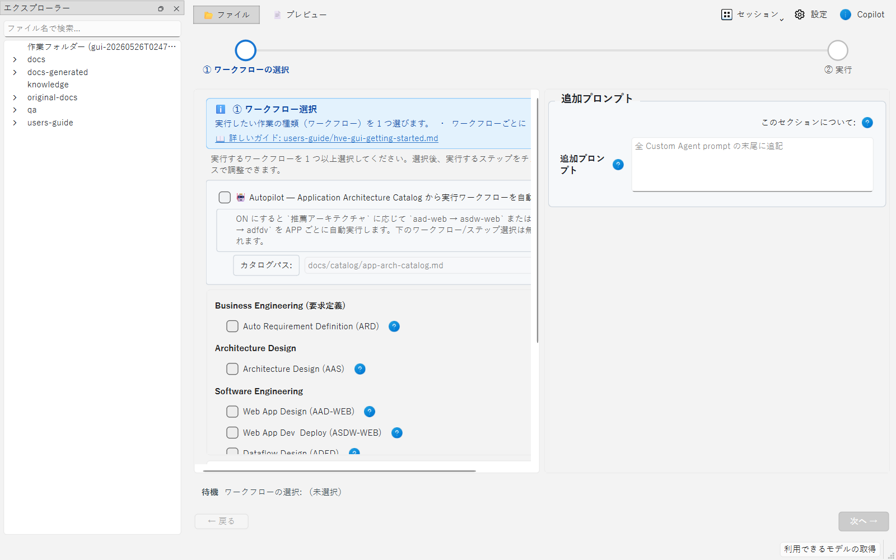
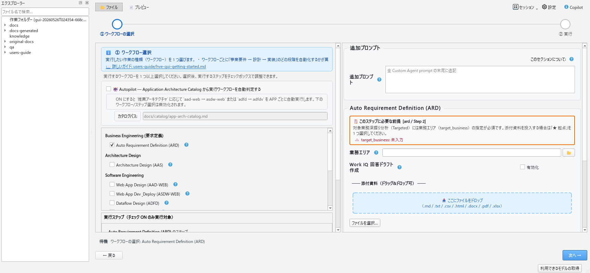
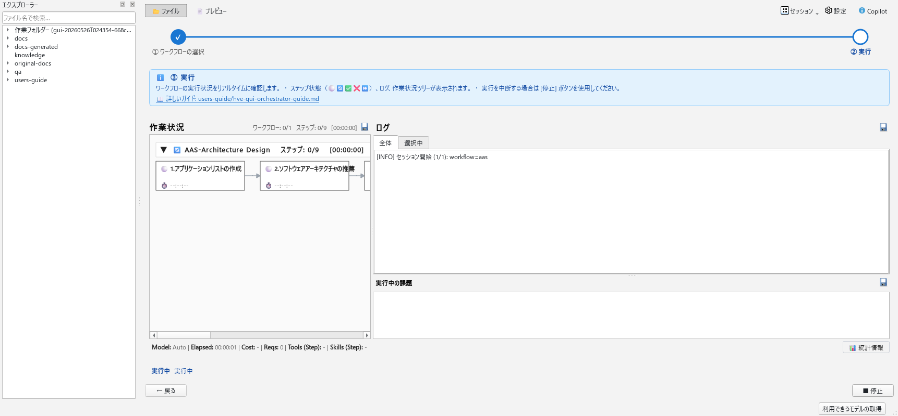

# HVE GUI Orchestrator はじめかた

← [README](../README.md)

> **対象読者**: ローカル PC（Windows / macOS / Linux）から GUI ウィザードでワークフローを実行したい初めての方
> **前提**: Python 3.11+ / Git / GitHub Copilot ライセンス
> **別の方式**: [hve-cloud-getting-started.md](./hve-cloud-getting-started.md)（Cloud）/ [hve-cli-getting-started.md](./hve-cli-getting-started.md)（CLI）

このガイドは、GUI Orchestrator を「動かしてみる」までの最小手順をまとめたチュートリアルです。GUI の各画面・全オプションの詳細は [hve-gui-orchestrator-guide.md](./hve-gui-orchestrator-guide.md) を参照してください。

---

## 目次

- [前提条件](#前提条件)
- [セットアップ手順](#セットアップ手順)
- [クイックスタート（サンプルで動かしてみる）](#クイックスタートサンプルで動かしてみる)
- [完了確認と失敗時対応](#完了確認と失敗時対応)
- [次のステップ](#次のステップ)

---

## 前提条件

| ツール | 必須 / 任意 | メモ |
|---|---|---|
| Python 3.11+ | 必須 | `py -3.11 --version` または `python3 --version` で確認 |
| PySide6 >= 6.6 | 必須 | セットアップスクリプトで自動インストール |
| Git | 必須 | リポジトリ取得 |
| GitHub CLI (`gh`) | 必須 | セットアップスクリプトが自動導入。認証は `gh auth login` または GUI の「GitHub CLI でログイン」 |
| PTY バックエンド（`pywinpty` / `ptyprocess`） | 必須 | GUI の「GitHub CLI でログイン」の埋め込み端末用。セットアップスクリプトが導入し、完了前に利用可否を検証 |
| GitHub Copilot ライセンス | 必須 | Copilot SDK の利用に必要 |

詳細は [hve-gui-orchestrator-guide.md の「前提条件」](./hve-gui-orchestrator-guide.md#前提条件) を参照してください。

---

## セットアップ手順

### 1. リポジトリを取得（クローン済みの場合はスキップ）

```bash
git clone https://github.com/<owner>/<repo>.git
cd <repo>
```

### 2. GitHub CLI で認証

```bash
gh auth login
```

Copilot ライセンスが付与されているアカウントでログインしてください。

### 2.1 GitHub Copilot SDK で認証

HVE の Step 実行は GitHub Copilot SDK を使います。初回または認証切れ時は次を実行してください。

```bash
python -m hve login
```

GitHub Copilot SDK へのログインは、上記のとおり CLI（`python -m hve login`）から行います。ログイン完了後は、GUI ステータスバーの **「利用できるモデルの取得」** ボタン（または「HVE 設定」→「基本設定」の一番上にある同名ボタン）を押すと、利用可能なモデル一覧を取得できます。ステータスバーには **「使用するモデル」** / **「Effort」** の選択コンボがあり、その場で直接選択を変更できます（変更は即座に反映され、「HVE 設定」の表示にも反映されます）。

> **GUI 設定画面からのログイン（任意）**
>
> 端末で `gh auth login` を実行する代わりに、GUI の **設定 → 各サービス連携 → GitHub** にある
> **「GitHub CLI でログイン」** ボタンからも認証できます。押下すると埋め込み端末で
> `gh auth login` を実行し、完了後に `gh auth token` で取得したトークンを
> **このセッション限り** `GH_TOKEN` 環境変数へ設定します。これにより「ブランチ取得」や
> Issue / PR 作成（GitHub REST を使う機能）が有効化されます。
>
> - 前提: `gh` がインストール済みで、PTY バックエンド（`pywinpty` / `ptyprocess`）が利用可能なこと。
>   いずれかが無い場合はボタン押下時に案内文が表示されます。復旧は **Windows: `hve\setup-hve.cmd` /
>   macOS ・ Linux: `./hve/setup-hve.sh`** の再実行です（既存の `.venv` が正常なら `-Force` / `--force` は不要）。
>   復旧するまでは端末で `gh auth login` を実行してください。
> - トークンはディスクに保存されません（GUI 終了で破棄）。次回起動時は再度ログインするか、
>   `gh auth token` を環境変数へ橋渡しして GUI を起動してください。
> - `gh auth token` のスコープが不足する場合、Issue / PR 作成等が失敗することがあります。

### 3. `.venv` 作成 + GUI 依存をインストール

オプションなしでセットアップスクリプトを実行すれば、GUI に必要な依存が全て入ります。

#### Windows

```cmd
hve\setup-hve.cmd
```

> `hve\setup-hve.cmd` は test extra（pytest）と GUI extras（PySide6 等）を**既定で導入**します。ダブルクリックでも実行できます。

#### macOS / Linux

```bash
./hve/setup-hve.sh
```

> `./hve/setup-hve.sh` も GUI extras（PySide6, markitdown, pywinpty/ptyprocess 等）を**既定で導入**します。CLI のみで良い場合は `--no-gui` を付けてください。

**成功確認**: 通常構成では、セットアップが終端する前に GUI の「GitHub CLI でログイン」が必要とする前提を検証します。

- 出力に `[OK] PTY backend for the embedded GitHub CLI terminal` が出て、終了コードが 0 であれば成功です。
- `gh` を解決できない場合、または PTY バックエンドが利用できない場合は、エラーを表示して非ゼロで終了します。
- 現状確認だけしたい場合は `-CheckOnly` / `--check-only` を付けます。このモードは何も変更せず、不足している `gh` / PTY バックエンドを警告として報告します（非ゼロ終了はしません）。

**`-Force` / `--force` は通常不要**: 既存の `.venv` が Python 3.11+ でグローバル site-packages を継承していなければ、再実行で不足依存だけが追加・修復されます。`.venv` を作り直したいときだけ `-Force` / `--force` を使ってください。

スクリプトの詳細・オプションは [hve-gui-orchestrator-guide.md の「インストール」](./hve-gui-orchestrator-guide.md#インストール) を参照してください。

> **Python 自動インストールと管理者権限について**
>
> Python 3.11+ が見つからない場合、セットアップスクリプトは最新の Python 3.14 を自動インストールしようとします。OS ごとに必要な権限が異なります（Windows: winget で UAC を要求する場合あり / macOS: Homebrew のため通常 sudo 不要 / Linux: `sudo apt`・`sudo dnf` 等で **sudo 必要**）。詳細は [hve-cli-getting-started.md](./hve-cli-getting-started.md#3-venv-作成と依存パッケージのインストール) の補足表を参照してください。確認プロンプトをスキップするには `-Yes`/`--yes`、自動インストールを無効化するには `-NoInstallPython`/`--no-install-python` を指定します。

### 4. GUI を起動して動作確認

```cmd
REM Windows
hve.cmd gui
```

```bash
# macOS / Linux
./hve.sh gui
```

`hve.cmd` / `hve.sh` は `.venv` の Python で `python -m hve` を実行するランチャーです（activate 不要）。引数なしでも GUI が起動します。ウィンドウが開けばセットアップ完了です。

---

## クイックスタート（サンプルで動かしてみる）

リポジトリ同梱の `sample/business-requirement.md`（ロイヤルティプログラムの業務要件サンプル）を入力にして、**ARD（要求定義の自動化）ワークフロー**を GUI から実行します。

### 1. サンプル業務要件を `docs/` にコピー

> **注意**: ARD ワークフローは `docs/business-requirement.md` を出力するため、コピーしたサンプルは **ARD 実行時にワークフロー成果物で上書きされます**。サンプルを保持したい場合は別名で残してください。

#### Windows (PowerShell)

```powershell
Copy-Item sample\business-requirement.md docs\business-requirement.md
```

#### Windows (cmd)

```cmd
copy sample\business-requirement.md docs\business-requirement.md
```

#### macOS / Linux

```bash
cp sample/business-requirement.md docs/business-requirement.md
```

### 2. GUI を起動

```cmd
REM Windows
hve.cmd gui
```

```bash
# macOS / Linux
./hve.sh gui
```

### 3. ウィザードで ARD を選択して実行

GUI は 2 ステップ構成です（詳細は [hve-gui-orchestrator-guide.md の「2 ステップ操作ガイド」](./hve-gui-orchestrator-guide.md#2-ステップ操作ガイド)）。

#### ステップ 1: ワークフロー選択とオプション設定

起動直後の画面は左ペイン（ワークフロー選択）と右ペイン（オプション設定）で構成されます。左ペインの一覧から **ARD（Auto Requirement Definition）** を選択します。



ARD のチェックボックスを ON にすると、選択状態が反映されます。



続いて右ペインのオプションで以下を設定します（同じ画面内です）。

   - `company-name`: `ロイヤルティサンプル` を入力
   - その他のオプションは既定値のままで OK

#### ステップ 2: 実行確認と実行

「次へ」を押すと実行画面（Step 2）に遷移し、`Step 0/9` から進行が始まります。ログ・作業状況ツリー・実行中の課題などがリアルタイムで表示されます。



実行が完了すると、以下のような成果物が生成・更新されます（詳細は [01-business-requirement.md](./01-business-requirement.md) 参照）。

- `docs/company-business-requirement.md`（企業・業務分析）
- `docs/business-requirement.md`（業務要件）
- `docs/catalog/use-case-catalog.md`（ユースケース一覧）

---

## 完了確認と失敗時対応

### 完了確認

| 段階 | 確認方法 | 期待結果 |
|---|---|---|
| 環境構築 | セットアップスクリプトの終了コード | `0`、かつ `[OK] PTY backend for the embedded GitHub CLI terminal` が出力される |
| GUI 起動 | `hve.cmd gui` / `./hve.sh gui` | ウィンドウが開く |
| SDK 認証 | ステータスバーの「利用できるモデルの取得」 | モデル一覧が取得できる |
| 実行 | Step 2 の進行表示と作業状況ツリー | 全 Step が完了として表示される |
| 成果物 | ファイルツリーパネル、または `docs/` を直接確認 | 上記 3 つの成果物が生成・更新されている |

Step 1 で [次へ] を押した時点のパラメータは `work/run/<session_run_id>/step1-precheck/` に保存されます。実行内容を後から確認する場合はこのスナップショットを参照してください（詳細は [hve-gui-orchestrator-guide.md](./hve-gui-orchestrator-guide.md#step-1-事前チェックスナップショットargsパラメータ保存)）。

### 失敗時対応

| 症状 | 最初に確認すること | 対応 |
|---|---|---|
| GUI が起動しない | PySide6 の導入状況 | GUI extras をスキップせずにセットアップスクリプトを再実行する（`setup-hve.ps1 -NoGui` / `setup-hve.sh --no-gui` / `-Minimal` を付けない） |
| 「GitHub CLI でログイン」が使えない | `gh` と PTY バックエンドの有無 | セットアップスクリプトを再実行する。復旧するまでは端末で `gh auth login` を実行する |
| モデル一覧が取得できない | Copilot SDK の認証状態 | 端末で `python -m hve login` を実行する。状態確認は `python -m hve login --status` |
| Issue / PR 作成が失敗する | `gh auth token` のスコープ | 必要な権限を持つアカウントで再ログインする |
| ツリーの更新が反映されない | ファイル監視の取りこぼし | 「既知の制約」を参照。フォルダーを開き直すか GUI を再起動する |
| プレビューが真っ白 / 図が出ない | Mermaid・KaTeX アセットの配置 | 未配置でも通常の Markdown は表示される。配置手順は下記の注記を参照 |

その他の事例は [troubleshooting.md](./troubleshooting.md) と [hve-gui-orchestrator-guide.md のトラブルシューティング](./hve-gui-orchestrator-guide.md#トラブルシューティング) を参照してください。

---

## ファイルツリー / Markdown プレビュー（左右パネル）

ステップ 2（実行画面）には、VS Code エクスプローラー風の **ファイルツリーパネル**（左）と **Markdown プレビューパネル**（右）が組み込まれています。Orchestrator 実行中に成果物の作成・更新を確認したいときに使います。

### パネルの開閉

ウィンドウ左端に縦に並んだ **アクティビティバー** から、トグルボタンで表示/非表示を切り替えます。

- 📁 ボタン: ファイルツリーパネル
- 📄 ボタン: Markdown プレビューパネル

ファイルツリーパネルは既定で**表示**され、Markdown プレビューパネルは既定で**非表示**です。Markdown プレビューはファイルツリーでファイルを選択した時点で自動的に開き、閉じるまで表示を保ちます。中央のワークベンチを広く使いたいときはボタンで閉じてください。表示状態はセッション間で保持されます（`hve/.settings.txt`）。

### ファイルツリーパネル

以下のフォルダーがルートとして並びます。

- `work/run/<セッションID>/` — このセッションが生成する全成果物（GUI が自動で先頭に追加）
- `docs/` / `docs-generated/` / `knowledge/` / `docs-original/` / `qa/` / `users-guide/` — 設定 `explorer_roots` の既定値（正本: `hve/gui/settings_store.py`）

監視ルートは「HVE 設定」の `explorer_roots`（`;` 区切り）で変更できます。未存在のディレクトリは解決時に自動作成されます（正本: `hve/gui/explorer_roots.py`）。

**リアルタイム更新マーカー**: Orchestrator がファイルを新規作成・更新すると、ツリーの該当行の右端に小さな丸が約 5 秒間表示されます。
- 緑 ●: 新規作成
- 橙 ●: 内容更新

**操作**:
- 検索ボックスでファイル名フィルタ
- ファイルをクリック → 右のプレビューに表示
- 右クリック → 「パスをコピー」「エクスプローラで開く」

### Markdown プレビューパネル

選択したファイルをレンダリングして表示します。

- **対応形式**:
  - `.md` / `.markdown` 等 → Markdown レンダリング（見出し / 表 / リスト / コードブロック / 数式 / Mermaid 図）
  - `.py` / `.json` / `.yaml` 等 → Pygments によるシンタックスハイライト
  - その他テキスト → プレーン表示
  - バイナリ・2 MB 超 → 警告メッセージ
- **ライブ更新**: 表示中ファイルが書き換わると自動で再レンダリングされ、スクロール位置も維持されます。
- **外部リンク**: `http(s)://` リンクはクリックで OS 既定ブラウザに開きます。

> **Mermaid 図と数式（KaTeX）について**:
> 初期インストールではプレースホルダのみで、Mermaid / KaTeX アセット (`mermaid.min.js` / `katex.min.js` 等) は同梱されていません。配置手順は `hve/gui/markdown_preview/assets/LICENSE-third-party.md` を参照してください。未配置でも通常の Markdown はレンダリングされます。

### 既知の制約

- ファイル変更検出は `QFileSystemWatcher`（OS イベント）のみで実装しています。Windows / WSL / ネットワークドライブでは検知の取りこぼしが報告されているため、表示更新が遅れた場合は対象フォルダーを一度別ペインから開き直す（または GUI を再起動する）と最新状態を反映できます。
- プレビュー機能（`QWebEngineView`）の初回起動には数秒かかります（Chromium 初期化）。プレビューパネルを最初に開いたタイミングで初期化が走ります。

---

## 次のステップ

- **GUI Orchestrator の本格利用**: [hve-gui-orchestrator-guide.md](./hve-gui-orchestrator-guide.md)
- **ローカルから CI/CD を有効化する**: [local-cicd-enablement.md](./local-cicd-enablement.md)
- **要求定義ワークフローの詳細**: [01-business-requirement.md](./01-business-requirement.md)
- **別の方式を試す**: [hve-cloud-getting-started.md](./hve-cloud-getting-started.md) / [hve-cli-getting-started.md](./hve-cli-getting-started.md)
- **全体像の把握**: [README.md](../README.md)
- **トラブルシューティング**: [troubleshooting.md](./troubleshooting.md)
