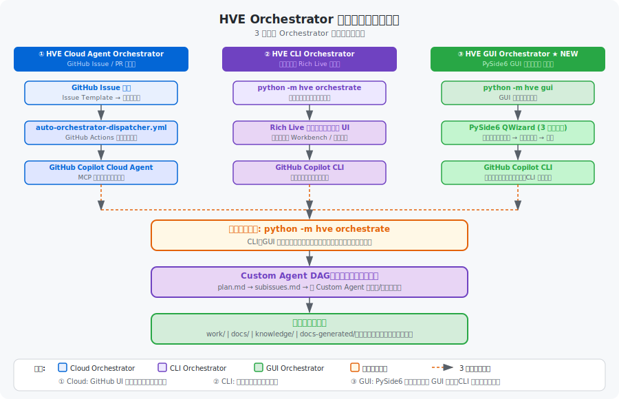
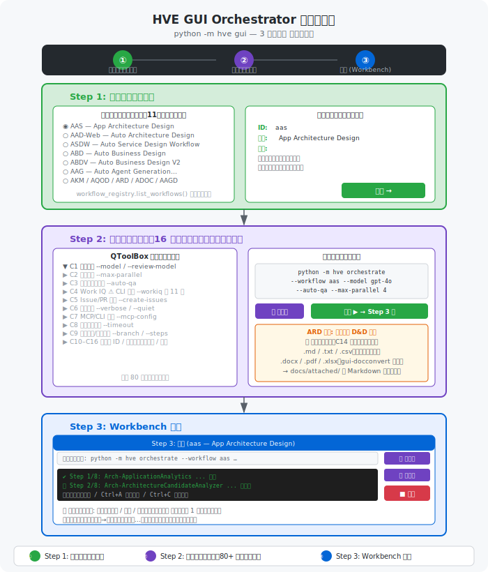

# HVE GUI Orchestrator ガイド

← [README](../README.md)

> **対象読者**: PySide6 GUI ウィンドウで HVE ワークフローを実行したい方。コマンドライン操作が不要です。  
> **前提**: Python 3.11+、GitHub CLI（`gh`）、対象リポジトリのローカルクローンがあること  
> **次のステップ**: まず「[クイックスタート](#クイックスタート)」を実行し、必要に応じて「[インストール](#インストール)」「[3 ステップ操作ガイド](#3-ステップ操作ガイド)」を確認してください。

---

## 目次

- [概要](#概要)
- [対象読者](#対象読者)
- [クイックスタート](#クイックスタート)
- [前提条件](#前提条件)
- [インストール](#インストール)
- [起動](#起動)
- [3 ステップ操作ガイド](#3-ステップ操作ガイド)
- [Plugin / MCP Server 認証](#plugin-mcp-server-認証)
- [データフロー](#データフロー)
- [複数セッションの同時起動](#複数セッションの同時起動)
- [中断と再開（Resume）](#中断と再開resume)
- [コマンドリファレンス](#コマンドリファレンス)
- [ワークフロー一覧](#ワークフロー一覧)
- [CLI との違い・使い分け](#cli-との違い使い分け)
- [Fork-on-Retry / DAG 並列実行・Post-step 自動プロンプト](#fork-on-retry-dag-並列実行post-step-自動プロンプト)
- [セキュリティ・SSO・関連リンク](#セキュリティsso関連リンク)
- [トラブルシューティング](#トラブルシューティング)
- [多言語表示（日本語 / English）](#多言語表示日本語-english)
- [関連ドキュメント](#関連ドキュメント)

---

## 概要

**HVE GUI Orchestrator** は、HVE の 3 つ目の Orchestrator（HVE Cloud Agent Orchestrator / HVE CLI Orchestrator に続く位置づけ）です。`python -m hve`（引数なし、既定）または `python -m hve gui` で起動する PySide6 製 GUI アプリケーションで、単一ウィンドウの 3 ステップ ウィザードからワークフローを選択・設定・実行できます。内部で `hve orchestrate` エンジンを呼び出すため、CLI Orchestrator と同じ DAG 実行エンジンを共有しています。



### 3 つの Orchestrator 比較

| 正式名称 | 入口 | 実行場所 | 追加依存 | 主な特徴 |
|---|---|---|---|---|
| **HVE Cloud Agent Orchestrator** | GitHub Issue Template | GitHub Actions | なし | リモート実行・Sub Issue 自動生成 |
| **HVE CLI Orchestrator** | `python -m hve orchestrate` / `python -m hve cli` | ローカル端末 | なし | ターミナル Rich Live Workbench |
| **HVE GUI Orchestrator** | `python -m hve`（既定）/ `python -m hve gui` | ローカル端末 | `PySide6>=6.6` | GUI ウィザード・マウス操作・複数セッション |

HVE GUI Orchestrator は CLI Orchestrator と同じ `hve orchestrate` エンジンを呼び出します。内部動作・オプション仕様・ワークフロー定義は共通です。UI の操作方法のみが異なります。

---

## 対象読者

- **初めてのユーザー**: コマンドライン操作なしで HVE を試したい方。GUI のラジオボタン・チェックボックス・ドラッグ&ドロップで全操作を完結できます。
- **複数セッション運用者**: 異なるワークフローを並行で起動・モニターしたい方（ターミナル UI は単一セッション）。
- **ARD 利用者**: 添付資料（`.docx` / `.pdf` / `.xlsx` / `.pptx` / `.html` 等）を D&D で取り込みたい方。
- **オプション理解の補助が欲しい方**: 多数の `orchestrate` オプションをカテゴリ別アコーディオンで参照したい方。

CLI 互換のスクリプト実行・CI 連携・Workbench 操作詳細が必要な場合は [hve-cli-orchestrator-guide.md](./hve-cli-orchestrator-guide.md) を参照してください。

---

## クイックスタート

3 ステップで実行を開始できます。

```bash
# 1. 依存パッケージをインストール（GUI extras 込み）
pip install -e ".[gui]"

# 2. GitHub CLI で認証（初回のみ）
gh auth login

# 3. GUI を起動
python -m hve
```

**Windows 初心者向け（ダブルクリックで完結）**:

```text
hve\setup-hve.cmd   ← 初回 1 回だけダブルクリック（.venv + GUI extras + markitdown 一括）
hve-gui.bat          ← 以降はこれをダブルクリックで GUI 起動
```

**macOS / Linux**: `./hve/setup-hve.sh` で一括セットアップ後、`./hve-gui.sh` で起動。

ウィザードが開いたら **Step 1（ワークフロー選択）→ Step 2（オプション設定）→ Step 3（実行）** の順に進めます。詳細は [3 ステップ操作ガイド](#3-ステップ操作ガイド) を参照してください。

---

## 前提条件

| 要件 | 必須 / オプション | 備考 |
|---|---|---|
| Python 3.11+ | **必須** | HVE 基本要件 |
| `pip install -e ".[gui]"` | **必須** | PySide6 を含む GUI 依存 |
| `pip install -e ".[gui,gui-docconvert]"`（`hve/setup-hve.ps1` / `hve/setup-hve.sh` をオプション無しで実行すれば既定で導入） | オプション | ARD ワークフローで `.docx` / `.pdf` / `.xlsx` / `.xls` / `.pptx` / `.html` をドラッグ&ドロップする場合（変換エンジンは [microsoft/markitdown](https://github.com/microsoft/markitdown)） |
| GitHub Copilot CLI（外部 `copilot` コマンド） | HVE CLI 共通 | Custom Agent 実行に必要 |

> その他の前提条件（Git / GitHub アカウント / Copilot ライセンス等）は [hve-gui-getting-started.md](./hve-gui-getting-started.md) を参照してください。

---

## インストール

**Windows 初心者向け（最短）**: エクスプローラーから **`hve\setup-hve.cmd`** をダブルクリックすると、`.venv` 作成 + `github-copilot-sdk` + 全 extras（mdq-watch / mdq-ja / semantic / **gui** / gui-pty / gui-docconvert）を一括インストールします。PowerShell の実行ポリシー設定は不要です。完了後は後述の **`hve-gui.bat`** をダブルクリックで GUI を起動できます。

```bash
# リポジトリをクローン後、セットアップスクリプトで GUI + 添付変換（markitdown）を一括インストールするのが推奨（v0.1.x 以降、GUI extras は既定 ON）:
# Windows (初心者向け、cmd ダブルクリック対応):
hve\setup-hve.cmd
# Windows (PowerShell):
powershell -ExecutionPolicy Bypass -File hve\setup-hve.ps1
# Linux / macOS:
./hve/setup-hve.sh

# CLI 専用にしたい場合は --no-gui / -NoGui を付与。
# 手動インストールだけで進める場合:
pip install -e ".[gui]"
# ARD 添付ファイル D&D で PDF / DOCX / XLSX / XLS / PPTX / HTML を変換する場合は追加で
pip install -e ".[gui,gui-docconvert]"   # 内部依存は markitdown[all] のみ
```

> **`.cmd` vs `.ps1`**: `.cmd` は `.ps1` を呼ぶ薄ラッパとなり、同一のオプション（`-CheckOnly` / `-NoGui` / `-Minimal` / `-Force` / `-SkipNltkDownload` / `-WithSkills`）をサポートします。詳細は [hve-cli-orchestrator-guide.md - セットアップスクリプト](./hve-cli-orchestrator-guide.md#セットアップスクリプトを使った環境構築windows--macos--linux) を参照。

---

## 起動

起動方法は OS ごとのランチャスクリプトを使う方法（方法 A）と、ターミナルから直接実行する方法（方法 B）があります。普段使いは **方法 A** を推奨します。

### 方法 A: ランチャスクリプト起動（推奨）

#### Windows — `hve-gui.bat`

リポジトリ直下の **`hve-gui.bat`** をエクスプローラからダブルクリックするだけで起動します。コマンドを覚える必要はありません。

> **役割の違い**: `hve\setup-hve.cmd` は **初回セットアップ専用**（venv + 依存関係の導入、通常 1 度だけ実行）。`hve-gui.bat` は **GUI 起動専用**（セットアップ完了後、毎回これをダブルクリック）。

```text
RoyalytyService2ndGen\
├── hve\setup-hve.cmd   ← 初回 1 回だけダブルクリック（セットアップ）
└── hve-gui.bat          ← 毎回ダブルクリック（GUI 起動）
```

内部で `.venv\Scripts\python.exe -m hve gui` を実行します。

| 状況 | 動作 |
|---|---|
| `.venv` が未作成 | エラー表示 → `hve\setup-hve.cmd` または `hve\setup-hve.ps1` の実行を案内 → 停止 |
| PySide6 未インストール（exit code 2） | エラー表示 → `pip install -e ".[gui]"` を案内 → 停止 |
| 正常起動 | GUI ウィンドウが開く（裏でコマンドプロンプトが残ります） |

> **デスクトップから起動したい場合**: `hve-gui.bat` を右クリック → 「ショートカットの作成」 → `.lnk` をデスクトップに移動。

#### macOS / Linux — `hve-gui.sh`

リポジトリ直下の **`hve-gui.sh`** を使います。

```text
RoyalytyService2ndGen/
└── hve-gui.sh   ← ターミナルから実行 or macOS Finder でダブルクリック
```

**ターミナルから実行**（初回のみ実行権限を付与）:

```bash
chmod +x hve-gui.sh
./hve-gui.sh
```

**macOS Finder からダブルクリック**（`.command` 方式）:

```bash
# 初回セットアップ（1回だけ）
cp hve-gui.sh hve-gui.command
chmod +x hve-gui.command
# → Finder で hve-gui.command をダブルクリック
# 初回は右クリック → 「開く」でセキュリティ警告を回避
```

内部で `.venv/bin/python -m hve gui` を実行します。

| 状況 | 動作 |
|---|---|
| `.venv` が未作成 | エラー表示 → `python3 -m venv .venv` コマンドを案内 → 停止 |
| PySide6 未インストール（exit code 2） | エラー表示 → `pip install -e ".[gui]"` を案内 → 停止 |
| ターミナルから実行時にエラー | 端末が開いているため `Press Enter to exit...` で停止 |

### 方法 B: コマンドライン起動（クロスプラットフォーム）

仮想環境を有効化してから実行するか、フルパスで指定します。

```bash
# Unix 系（macOS / Linux）
.venv/bin/python -m hve gui
```

```powershell
# Windows PowerShell
.\.venv\Scripts\python.exe -m hve gui
```

### 共通: 起動後の動作

いずれの方法でも **単一ウィンドウ** が開き、ヘッダーの進捗バーに沿って 3 ステップを進めます。

---

## 3 ステップ操作ガイド



### Step 1: ワークフロー選択

`workflow_registry.list_workflows()` から取得した全ワークフローをラジオボタンで提示します。

| ワークフロー ID | 正式名称 |
|---|---|
| `aas` | Application Architecture Selection |
| `aad-web` | Architecture Design – Web App |
| `asdw-web` | Web App Design |
| `adfd` | Dataflow Design |
| `adfdv` | Dataflow Dev |
| `aag` | AI Agent Design |
| `aagd` | AI Agent Dev & Deploy |
| `akm` | Knowledge Management |
| `aqod` | Original Docs Review |
| `adoc` | Source Code → Documentation |
| `ard` | Auto Requirement Definition |

- 選択中ワークフローの ID・正式名称・短い説明を下部に表示。
- 「次へ →」で Step 2 へ。

---

### Step 2: オプション選択

`orchestrate` サブコマンドの **80 以上のオプション** を `QToolBox` アコーディオン形式で 16 カテゴリに分類します（Cloud 版 Issue Template と類似の UI）。

| カテゴリ | 主な内容 |
|---|---|
| C1 基本設定 | `--model` / `--review-model` / `--qa-model` |
| C2 並列実行 | `--max-parallel` |
| C3 自動プロンプト | `--auto-qa` / `--auto-contents-review` / `--auto-coding-agent-review` / **QA 回答モード**（下記参照） |
| C4 **Work IQ**（GUI / CLI 両対応） | `--workiq` 系 10 オプション（M365 メール・チャット・会議・ファイル参照。`@microsoft/workiq` プラグインのインストールが必要）。<br>**Sub-002 / Phase 1**: 起動ウィザード (`hve.gui.LaunchWizard`) にも独立した **Work IQ ページ** を追加 (`hve/gui/page_workiq.py` の `WorkIQWizardPage`)。設定値は `OrchestrateArgs` へ書き戻され `--workiq*` 引数として CLI に渡る。 |
| C5 Issue / PR 作成 | `--create-issues` / `--create-pr` / `--repo` |
| C6 出力制御 | `--verbose` / `--quiet` / `--verbosity` / `--log-level` 他 |
| C7 MCP / CLI 接続 | `--mcp-config` / `--cli-path` / `--cli-url` |
| C8 タイムアウト | `--timeout` / `--review-timeout` |
| C9 ブランチ / ステップ | `--branch` / `--steps` |
| C10 アプリ ID 系 | `--app-id` / `--app-ids` / `--resource-group` / `--app-id` / `--usecase-id` |
| C11 AKM 固有 | `--sources` / `--target-files` / `--force-refresh` 他 |
| C12 AQOD 固有 | `--target-scope` / `--depth` / `--focus-areas` |
| C13 ADOC 固有 | `--target-dirs` / `--exclude-patterns` / `--doc-purpose` 他 |
| C14 ARD 固有 | `--company-name` / `--target-business` / 添付資料 D&D（下記参照） |
| C15 追加プロンプト | `--additional-prompt` / `--additional-comment` |
| C16 実行制御 / 拡張機能 | `--dry-run` / `--self-improve` 他（mdq 系は [skills] → [Markdown-Query] へ移設） |

選択ワークフローに応じて C10〜C14 の表示/有効化が自動制御されます。

#### C10 対象アプリケーション (APP-ID) の絞り込み

- `aad-web` / `asdw-web` / `adfd` / `adfdv` のいずれかを選択すると、C10 に **APP-ID チェックリスト** が表示されます。チェックリストは `docs/catalog/app-arch-catalog.md` から読み込まれます。
- 選択中の workflow に対応するアーキテクチャ kind（`web-cloud` / `batch`）の APP-ID のみを表示し、複数 workflow を同時選択すると両 kind の和集合を表示します。
- チェック状態は内部の `--app-ids` CSV と同期し、**Autopilot ON / OFF いずれの経路でも実行対象 APP がチェック済み APP-ID のみに絞り込まれます**。未指定（空）の場合は catalog 全件が対象です。
- catalog に存在しない APP-ID を手動入力した場合は、Autopilot 計画ログ（GUI ログペイン / CLI dry-run 出力）の `skipped` セクションに `reason=unknown app_id (not in catalog)` として記録され、実行対象からは除外されます。アーキテクチャ不一致の指定 APP も同様に skip 扱いとなります（`reason=unmapped architecture or filtered by selection`）。

- `argparse.BooleanOptionalAction`（例: `--banner` / `--no-banner`）は「継承（未指定）/ 明示 ON / 明示 OFF」の 3 状態を `QComboBox` で表現します。
- 「プレビュー更新」をクリックすると、生成される `python -m hve orchestrate ...` コマンドを確認・コピーできます。
- 「実行 ▶」で Step 3 に移行します。

> **GUI 強制制約**: GUI モードでは内部で `--workbench off` が自動注入され、ターミナル UI 系オプション（`--workbench` / `--workbench-body-lines` / `--workbench-history`）は Step 2 C16 から除外されます。

#### ARD のみ: 添付ファイル D&D

ワークフローが `ard` の場合、C14 セクションの末尾に **添付資料ドラッグ&ドロップ領域** が表示されます。

```
── 添付資料（ドラッグ&ドロップ可） ──
┌──────────────────────────────────────┐
│ 📥 ここにファイルをドロップ           │
│   （.md / .txt / .csv / .html /      │
│    .docx / .pdf / .xlsx）            │
└──────────────────────────────────────┘
```

| 対応形式 | 必要なインストール |
|---|---|
| `.md` / `.markdown` / `.txt` / `.csv` | `pip install -e ".[gui]"` のみ |
| `.html` / `.htm` / `.docx` / `.pdf` / `.xlsx` / `.xls` / `.pptx` | `pip install -e ".[gui,gui-docconvert]"` が必要（`hve/setup-hve.ps1` / `hve/setup-hve.sh` をオプション無しで実行すれば既定で導入。変換エンジンは [microsoft/markitdown](https://github.com/microsoft/markitdown)） |

- **保存先**: `<repo>/docs/attached/` 配下に Markdown として保存されます。ファイル名は ASCII 安全化されます。
- **起点ファイル選択**: 複数ファイルを D&D した場合、`business_requirement-input.md` として採用する起点ファイルをダイアログで選択します。1 ファイルのみの場合は確認なしで自動採用。
- **生成される引数**: 変換結果を `--attached-docs` カンマ区切りで自動付与し、起点ファイルは `--target-business <起点ファイルパス>` として渡されます。

> **設計上の注意**: 起点ファイルは `docs/business-requirement.md` ではなく `docs/attached/business-requirement-input.md` という別名で保存されます。ARD ワークフロー Step 2 が `docs/business-requirement.md` を自動上書きする可能性があるためです。詳細は [hve-technical-architecture.md §5](./hve-technical-architecture.md#5-hve-gui-orchestrator) を参照してください。

#### C3 自動プロンプト: QA 回答モード

「QA 自動投入」を有効化したとき、回答収集の挙動を 2 つから選択できます（既定: Autopilot）。

| モード | 動作 |
|---|---|
| **Autopilot (全自動)** | AI が質問と既定回答を作成し、既定回答を全て自動採用してメインタスクへ適用します。ユーザー操作は不要です。 |
| **ユーザー回答** | AI が質問と既定回答を作成した後、GUI に **QA 回答ダイアログ** が表示されます。全質問への回答を入力して [Submit] を押すとメインタスクへ適用されます。[全て既定値で進める] / [キャンセル] も選択可能です。 |

- 「QA 自動投入」が無効のときは本設定は無視されます（既定挙動）。
- ユーザー回答モードは、GUI ↔ CLI 間で `.hve/qa-ipc/<uuid>/` 配下のファイルベース IPC を用います（タイムアウト: 既定 1 時間）。タイムアウト時は既定値を全採用してメインタスクを継続します。
- [キャンセル] を押すと、subprocess を停止して orchestrate 全体を中断します（途中状態を破棄）。
- 自由記述質問（選択肢がない質問）は現行 CLI の仕様により既定値が採用されます（GUI 上では入力欄が無効化されます）。

---

### Step 3: Workbench（実行）

```
┌─────────────────────────────────────────────────────┐
│ Step 3: 実行 (ard — Auto Requirement Definition)    │
│ 実行コマンド: python -m hve orchestrate ...  [📋]   │
├─────────────────────────────────────────────────────┤
│  ログ出力                                     [📋]  │
│  （QPlainTextEdit — マウスホイールスクロール・     │
│   テキスト選択・右クリックコピーが利用可能）       │
├─────────────────────────────────────────────────────┤
│  ユーザーアクション                           [📋]  │
└─────────────────────────────────────────────────────┘
                                              [■ 停止]
```

- **📋 コピーアイコン**: 実行コマンド・ログ・ユーザーアクション各ペインのテキストをクリップボードに 1 クリックでコピー。
- **スクロール**: OS ネイティブのマウスホイール / スクロールバーが利用可能。
- **テキスト選択**: `Ctrl+A`（全選択）・ドラッグ選択・`Ctrl+C` で部分コピー可能。
- **停止**: 「■ 停止」ボタンで `subprocess.Popen.terminate()` を送信（Windows ではハードキル相当）。

---

## Plugin / MCP Server 認証

GUI Orchestrator は実行前に **GitHub Copilot** およびオプション接続先（**Work IQ MCP** / 任意の **MCP Server** / **外部 Copilot CLI サーバー**）の認証状態を一元管理します。

### 認証ボタンの場所

ウィンドウ最上段の左に「**HVE Workbench**」タイトルが表示されている行の右側に「🔐 **PluginやMCP Serverへの認証**」ボタンがあります（[セッション] / [設定] / [Copilot] の左隣）。未認証の対象が 1 つでもあるとオレンジ色で強調表示されます。

### 対象とする認証先

GUI は **GitHub Copilot CLI を唯一の信頼ソース** とし、以下の方法で検出します:

| 対象 | 検出方法 | 認証方式 |
|---|---|---|
| GitHub Copilot | 常時必須 | `copilot login` (Device Flow) |
| Microsoft Work IQ | `copilot plugin list` に `workiq@work-iq` が表示されているとき | `npx @microsoft/workiq accept-eula` + `ask -q ping` |
| 任意の MCP Server | `copilot mcp list --json` に登録されている全サーバ | サーバ毎の疎通テスト（個別認証は manifest または事前ログインに委譲） |
| 外部 Copilot SDK サーバー | 「設定」→「CLI 接続」で `cli_url`（例: `localhost:4321`）を指定 | TCP 疎通テスト |

> **Breaking Change (Wave 3 以降)**: GUI 設定の `mcp_config`（MCP Server 設定 JSON
> ファイルパス）と `workiq_tenant_id` は **廃止** されました。
> 代わりに `copilot mcp add` / `copilot plugin install` で Copilot CLI 側に登録してください。
> 既存設定ファイルに残存していた場合、初回起動時に自動削除されます。

### インタラクティブ認証フロー（PTY 統合）

Azure CLI のサブスクリプション選択、`gh auth login` のブラウザ承認、Device Flow
のコード入力など、**対話的な認証**を必要とする MCP サーバについては、GUI 内に
xterm.js ベースのターミナルが埋め込まれた専用ダイアログが開き、ユーザーは矢印キーや
Enter で通常の CLI と同じ手順で認証を完走できます。

対応プロバイダと操作手順の詳細は次のガイドを参照してください:

- **[Plugin / MCP Server インタラクティブ認証ガイド](./plugin-mcp-auth.md)**
  - Azure MCP / GitHub MCP の操作手順
  - 自前 MCP サーバ向けのカスタム manifest 追加方法
  - トラブルシューティング

### 操作フロー

1. 「🔐 PluginやMCP Serverへの認証」を押下
2. 開いたダイアログのテーブルに、設定済みの全プロバイダが列挙される
3. 各行の [認証] ボタンで個別実行、または [全て認証] ですべてを順次実行
4. 進捗ログが下部に表示される。長時間動作する Device Flow も非同期実行のため UI はブロックされない
5. [キャンセル] で実行中のタイムアウトを早めに打ち切れる（プロバイダによってはタイムアウト経過まで完了を待つことがある）

### トークン失効への対策

- **5 分ごとの heartbeat**: バックグラウンドで全プロバイダの状態を定期確認します（`AuthMonitor`）
- **ワークフロー実行直前の再確認**: [実行 ▶] 押下時に必須プロバイダの状態を改めて確認し、未認証ならダイアログを再表示
- **実行中の失効検知**: 認証失効を検知した時点でワークフローを自動停止し、再認証ダイアログを開きます

### 「利用できるモデルの取得」ボタンとの関係

ステータスバー右端の「**利用できるモデルの取得**」ボタンは:

- 常に表示されますが、**GitHub 認証が成功するまで無効（グレーアウト）** です
- 認証成功で有効化され、押下時は **モデル一覧の取得とキャッシュ更新のみ** を実行します（認証フローは含みません）

---

## データフロー

> **GUI → サブプロセス → DAG → 成果物** のアーキテクチャ詳細は [hve-technical-architecture.md §5 / §6](./hve-technical-architecture.md#5-hve-gui-orchestrator) を参照してください。

GUI の操作（ワークフロー選択・オプション設定）は `python -m hve orchestrate ...` コマンドに変換され、`hve orchestrate` エンジンを経て Custom Agent DAG が実行されます。Custom Agent は `work/` / `docs/` / `knowledge/` / `docs-generated/` といった成果物ファイルを生成・更新します。

---

## 複数セッションの同時起動

メニュー「セッション」→「新規セッション...」を選択すると、別の HVE GUI Orchestrator ウィンドウが追加で起動します。各ウィンドウは独立した `python -m hve orchestrate ...` サブプロセスを持つため、セッション間の干渉はありません。詳細な状態管理・終了時挙動は [hve-technical-architecture.md §5.8](./hve-technical-architecture.md#58-複数セッションの同時起動) を参照。

```bash
# ターミナルから複数起動することもできます（各プロセス独立）
python -m hve &
python -m hve &
```

ウィンドウタイトルに `HVE GUI Orchestrator - Session #N (ワークフロー ID)` の形で番号が表示されます。

---

## CLI との違い・使い分け

| 機能 | HVE CLI Orchestrator<br>（ターミナル Workbench） | HVE GUI Orchestrator |
|---|---|---|
| ログスクロール | キーバインド（`↑↓` / `PgUp/Dn`） | マウスホイール・スクロールバー |
| テキストコピー | ターミナルバッファ依存 | 📋 アイコン / `Ctrl+C` |
| 複数セッション | 非対応 | メニューから複数ウィンドウ起動 |
| 起動ウィザード | 逐次プロンプト | 単一ウィンドウ 3 ステップ |
| ARD 添付資料 | 手動でファイル配置 + `--attached-docs` | ドラッグ&ドロップ自動変換 |
| 追加依存 | なし | `PySide6>=6.6` |
| Work IQ C4 オプション | 利用可 | 利用可（GUI 固有制約なし） |

---

## 中断と再開（Resume）

GUI Orchestrator は CLI Orchestrator と同じ Resume 機構を共有しています。中断方法のみが異なります（GUI: 「■ 停止」ボタン / CLI: ターミナルで `Ctrl+R`）。

- **概要・state.json 仕様・再開コマンド（`resume list` / `show` / `rename` / `delete` / `continue`）**: [hve-cli-orchestrator-guide.md — 中断と再開（Resume）](./hve-cli-orchestrator-guide.md#中断と再開resume) を参照。
- **GUI 固有の振る舞い**: 「■ 停止」ボタンは `subprocess.terminate()`（Windows ではハードキル相当）を送信します。Resume 可能な graceful pause（CLI の `Ctrl+R` 相当）は GUI からは提供されていないため、その用途では CLI Orchestrator を使用してください。

---

## コマンドリファレンス

GUI Orchestrator は最終的に `python -m hve orchestrate ...` コマンドを生成・実行します。生成されたコマンドは Step 3 のヘッダーで確認・コピー可能です。

- **全オプションの一覧・既定値・型**: [hve-cli-orchestrator-guide.md — コマンドリファレンス（CLI モード）](./hve-cli-orchestrator-guide.md#コマンドリファレンスcli-モード) を参照。
- **GUI 固有の制約**: `--workbench off` が自動注入され、ターミナル Workbench 系オプション（`--workbench` / `--workbench-body-lines` / `--workbench-history`）は GUI から指定不可です。

---

## ワークフロー一覧

選択可能な 11 ワークフロー（`aas` / `aad-web` / `asdw-web` / `adfd` / `adfdv` / `aag` / `aagd` / `akm` / `aqod` / `adoc` / `ard`）の正式名称は [Step 1: ワークフロー選択](#step-1-ワークフロー選択) に記載しています。

- **各ワークフローの DAG・成果物・依存関係**: [workflow-reference.md](./workflow-reference.md) を参照。
- **フェーズ別ガイド**: [README — フェーズ別ガイド](../README.md#フェーズ別ガイド) を参照。

---

## Fork-on-Retry / DAG 並列実行・Post-step 自動プロンプト

DAG 並列実行（`--max-parallel`）と Post-step 自動プロンプト（`--auto-qa` / `--auto-contents-review` / `--auto-coding-agent-review`）は GUI の Step 2 C2・C3 から設定可能で、Fork-on-Retry も CLI と共通の挙動です。詳細は次を参照してください。

- [hve-cli-orchestrator-guide.md — 付録C: DAG 並列実行と Post-step 自動プロンプト](./hve-cli-orchestrator-guide.md#付録c-dag-並列実行と-post-step-自動プロンプト)
- [hve-cli-orchestrator-guide.md — フォーク機能 Fork-on-Retry](./hve-cli-orchestrator-guide.md#フォーク機能-fork-on-retry)

---

## セキュリティ・SSO・関連リンク

セキュリティ・SSO・トークン管理・関連リンクは CLI Orchestrator と共通です。

- [hve-cli-orchestrator-guide.md — 付録E: セキュリティ・SSO・関連リンク](./hve-cli-orchestrator-guide.md#付録e-セキュリティsso関連リンク)

---

## トラブルシューティング

| 症状 | 原因 | 対処 |
|---|---|---|
| `hve-gui.bat` をダブルクリックすると `.venv が見つかりません` と表示される | 仮想環境未作成 | バッチが案内する通り `powershell -ExecutionPolicy Bypass -File hve\setup-hve.ps1` を実行 |
| `hve-gui.bat` 実行中に exit code 2 で `pause` | PySide6 未インストール | バッチが案内する通り `.venv\Scripts\python.exe -m pip install -e ".[gui]"` を実行 |
| GUI 終了後もコマンドプロンプトが残る（Windows） | エラー時のメッセージ保持のための仕様 | 正常終了時は黒画面を任意で閉じて OK |
| `hve-gui.sh` が `Permission denied` | 実行権限なし | `chmod +x hve-gui.sh` を実行してから再試行 |
| `hve-gui.sh` `.venv が見つかりません` と表示される | 仮想環境未作成 | スクリプトが案内する通り `python3 -m venv .venv && .venv/bin/pip install -e ".[gui]"` を実行 |
| macOS Finder で `hve-gui.command` が「開発元を確認できない」 | Gatekeeper のブロック | 右クリック → 「開く」で初回警告を回避。以後ダブルクリックで起動可能 |
| `python -m hve` / `python -m hve gui` でエラー | `PySide6` 未インストール | `pip install -e ".[gui]"` を実行（引数なし起動は CLI に自動フォールバック） |
| D&D で `.docx` / `.pdf` / `.xlsx` / `.pptx` / `.html` が変換されない | `gui-docconvert`（markitdown）未インストール | `hve/setup-hve.ps1` / `hve/setup-hve.sh` をオプション無しで再実行、または `pip install -e ".[gui,gui-docconvert]"` |
| GUI が起動しない（X11 / Wayland エラー） | ディスプレイサーバー未接続 | SSH ポートフォワードや X11 転送を設定するか、CLI Orchestrator を使用 |
| ウィンドウが複数起動しない | PySide6 バージョン不足 | `PySide6>=6.6` を確認 |

その他のトラブルは [troubleshooting.md](./troubleshooting.md) を参照してください。

---

## 多言語表示（日本語 / English）

GUI は日本語（既定）と英語の 2 言語に対応しています。

### 言語の切替

[設定] メニュー → **一般 → 言語 / Language** から選択できます。

| 選択肢 | 動作 |
|---|---|
| 自動 / Auto（既定） | OS のロケールから判定（`ja*` → 日本語、それ以外 → English） |
| 日本語 | 強制的に日本語表示 |
| English | 強制的に英語表示 |

**変更後はアプリの再起動が必要です。** 設定変更時に再起動を促すダイアログが表示されます。

### 環境変数による上書き

設定値より優先されます（CI / トラブルシュート用途）:

```pwsh
# Windows PowerShell
$env:HVE_GUI_LANG = "en_US"; python -m hve gui
```

```bash
# macOS / Linux
HVE_GUI_LANG=en_US python -m hve gui
```

有効値: `ja_JP` / `en_US` / `auto`。

### 翻訳ファイルの更新（開発者向け）

ソース言語は日本語（`ja_JP`）。英訳は `hve/gui/i18n/hve_gui_en_US.ts` を編集し、`pyside6-lrelease` で `.qm` をコンパイルします。詳細は [hve/gui/i18n/README.md](../hve/gui/i18n/README.md) を参照。

`setup-hve.ps1` / `setup-hve.sh` 実行時（オプション無し既定）に `.ts` が `.qm` より新しい場合は自動コンパイルされます。

---

## 関連ドキュメント

| ドキュメント | 内容 |
|---|---|
| [hve-gui-getting-started.md](./hve-gui-getting-started.md) | 初期セットアップ全体（GUI） |
| [hve-cli-orchestrator-guide.md](./hve-cli-orchestrator-guide.md) | CLI Orchestrator ガイド・詳細オプション |
| [web-ui-guide.md](./web-ui-guide.md) | Cloud Agent Orchestrator（GitHub Issue/PR） |
| [workflow-reference.md](./workflow-reference.md) | ワークフロー一覧・Custom Agent 一覧 |
| [hve-technical-architecture.md](./hve-technical-architecture.md) | GUI / CLI / Cloud の技術アーキテクチャ詳細（開発者向け） |
| [hve/gui/i18n/README.md](../hve/gui/i18n/README.md) | GUI 翻訳ファイル管理（開発者向け） |


---

## Step 1 事前チェックスナップショット（args/パラメータ保存）

Step 1「ワークフロー選択」画面で [次へ] を押し、事前チェック（FILE / WIZARD_INPUT / SETTING / AUTH 4 カテゴリ統合 precheck）とプランレビューが完了するたびに、その時点の args/パラメータ一式が JSON スナップショットとして自動保存されます。後追いデバッグ・監査・サポート問い合わせ時の再現用です。

### 保存先

```
<repo>/work/gui-runs/<session_run_id>/step1-precheck/
├── <UTC timestamp>__iter1/        # 1 回目の precheck 通過時
├── <UTC timestamp>__iter2/        # ギャップ適用→再 precheck 通過時
├── ...
└── latest-accepted/               # 「このプランで実行」承認時のコピー
```

- `session_run_id` は GUI 1 セッション = 1 ID（`gui-<timestamp>-<random>`）。
- 反復ごとに `<UTC timestamp>__iter<n>/` ディレクトリが新規作成される（同名ディレクトリは削除→新規作成）。
- 最終承認時のみ `latest-accepted/` へコピーされる（毎回上書き）。

### 含まれる情報（1 ディレクトリあたり）

| ファイル | 内容 |
|---|---|
| `metadata.json` | session_run_id / iteration / is_final_accepted / autopilot_mode / timestamp / repo_root / workflow_ids / schema_version |
| `selection.json` | 選択中の workflow_ids、Autopilot ON/OFF |
| `orchestrate-args.json` | workflow_id → `OrchestrateArgs` 全フィールド（dict 化、マスク済み） |
| `orchestrate-argv.json` | workflow_id → `python -m hve orchestrate ...` に渡される argv 配列（マスク済み） |
| `precheck-result.json` | precheck の生結果（カテゴリ別不足項目など） |
| `plan-review.json` | プランレビュー（実行順序・ギャップ提案など） |
| `attachments.json` | additional_prompts / extra_provided / ARD 添付パス一覧 |
| `auth-snapshot.json` | provider → AuthState 名（トークン本体は含めない） |
| `env-overrides.json` | 子プロセスへ注入される env（HVE_WORK_ROOT / HVE_GUI_SESSION_ID 等、マスク済み） |

### マスキング方針

機密情報の漏洩防止のため、以下のキー名／argv フラグ名を含む値はすべて `***` に置換されます（大文字小文字無視・部分一致）:

- `token` / `secret` / `password` / `passwd`
- `api_key` / `api-key` / `access_key` / `access-key`
- `private_key` / `private-key` / `client_secret` / `client-secret`
- `bearer` / `credential`

例: `GITHUB_TOKEN` / `--github-token` / `workiq_client_secret` などは値が `***` に置換されます。
`auth-snapshot.json` は AuthState 名（`AUTHENTICATED` 等）のみ記録し、トークン本体は一切含めません。

### 動作・運用

- スナップショット保存の失敗は GUI 主処理を止めません（WARNING ログのみ出力）。
- `work/gui-runs/` は `.gitignore` で除外されています（コミット対象外）。
- セッション終了時の挙動は `GuiSessionWorkdir.cleanup_policy`（既定 `keep`）に従い、`archive` / `purge` を指定するとスナップショットも対象になります。
- スキーマは `metadata.json.schema_version` でバージョニング（現行 `1`）。

### 用途

- 「Step 1 を通ったのに Step 2 で挙動が違う」等の問い合わせ時、`latest-accepted/orchestrate-argv.json` を CLI で再実行すれば再現可能。
- ギャップ適用ループの各回の差分比較（`iter1` ↔ `iter2`）でユーザー操作の影響を確認可能。
