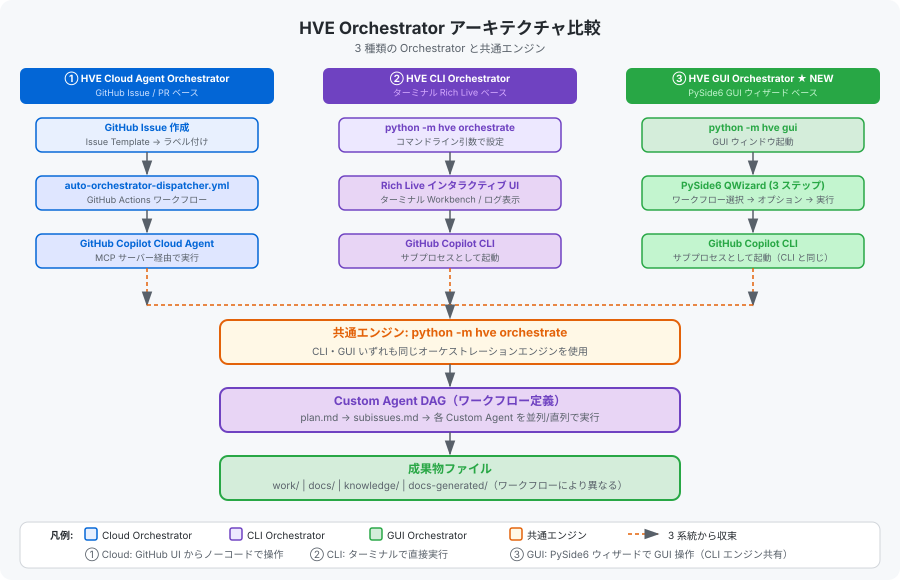
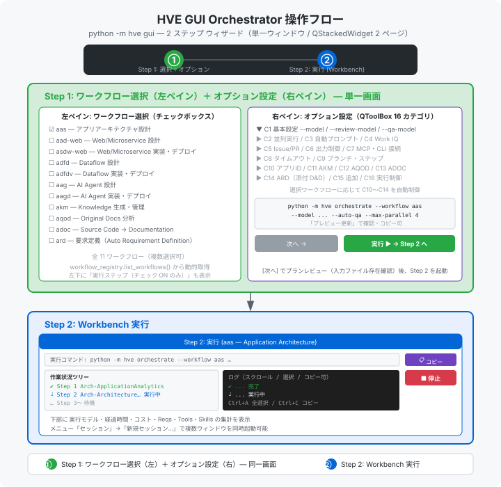
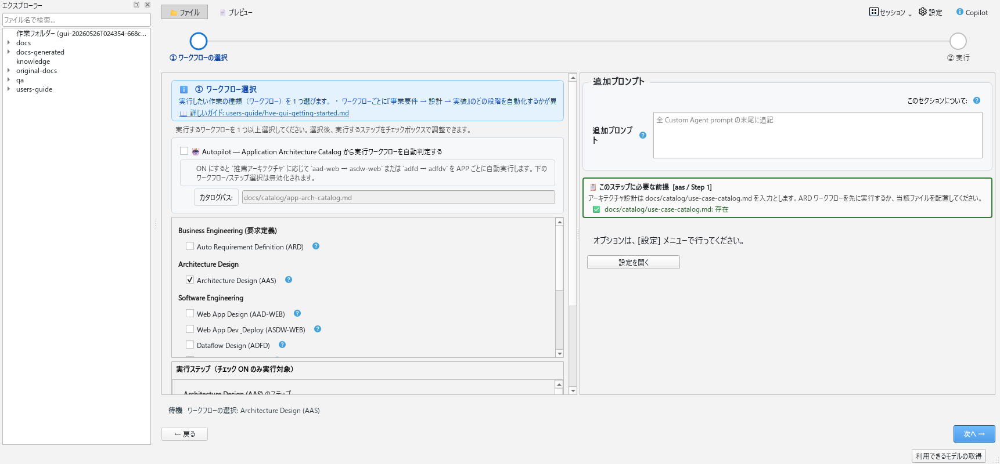

# HVE GUI Orchestrator ガイド

← [README](../README.md)

> **対象読者**: PySide6 GUI ウィンドウで HVE ワークフローを実行したい方。コマンドライン操作が不要です。  
> **前提**: Python 3.11+、GitHub CLI（`gh`）、対象リポジトリのローカルクローンがあること  
> **次のステップ**: まず「[クイックスタート](#クイックスタート)」を実行し、必要に応じて「[インストール](#インストール)」「[2 ステップ操作ガイド](#2-ステップ操作ガイド)」を確認してください。

---

## 目次

- [概要](#概要)
- [対象読者](#対象読者)
- [クイックスタート](#クイックスタート)
- [前提条件](#前提条件)
- [インストール](#インストール)
- [起動](#起動)
- [2 ステップ操作ガイド](#2-ステップ操作ガイド)
- [Copilot パネル（対話と実行ジョブ連携）](#copilot-パネル対話と実行ジョブ連携)
- [Plugin / MCP Server 認証](#plugin-mcp-server-認証)
- [データフロー](#データフロー)
- [複数セッションの同時起動](#複数セッションの同時起動)
- [中断と再開（Resume）— 廃止（v1.1）](#中断と再開resume-廃止v11)
- [コマンドリファレンス](#コマンドリファレンス)
- [ワークフロー一覧](#ワークフロー一覧)
- [CLI との違い・使い分け](#cli-との違い使い分け)
- [Fork-on-Retry / DAG 並列実行・Post-step 自動プロンプト](#fork-on-retry-dag-並列実行post-step-自動プロンプト)
- [セキュリティ・SSO・関連リンク](#セキュリティsso関連リンク)
- [トラブルシューティング](#トラブルシューティング)
- [多言語表示（日本語 / English）](#多言語表示日本語-english)
- [GUI を拡張する（開発者向け）](#gui-を拡張する開発者向け)
- [関連ドキュメント](#関連ドキュメント)

---

## 概要

**HVE GUI Orchestrator** は、HVE の 3 つ目の Orchestrator（HVE Cloud Agent Orchestrator / HVE CLI Orchestrator に続く位置づけ）です。`python -m hve`（引数なし、既定）または `python -m hve gui` で起動する PySide6 製 GUI アプリケーションで、単一ウィンドウの 2 ステップ ウィザード（Step 1: ワークフロー選択＋オプション設定 / Step 2: 実行）からワークフローを選択・設定・実行できます。内部で `hve orchestrate` エンジンを呼び出すため、CLI Orchestrator と同じ DAG 実行エンジンを共有しています。



### 3 つの Orchestrator 比較

| 正式名称 | 入口 | 実行場所 | 追加依存 | 主な特徴 |
|---|---|---|---|---|
| **HVE Cloud Agent Orchestrator** | GitHub Issue Template | GitHub Actions | なし | リモート実行・Sub Issue 自動生成 |
| **HVE CLI Orchestrator** | `python -m hve orchestrate` / `python -m hve cli` | ローカル端末 | なし | ターミナル Rich Live Workbench |
| **HVE GUI Orchestrator** | `python -m hve`（既定）/ `python -m hve gui` | ローカル端末 | `PySide6>=6.6` | GUI ウィザード・マウス操作・複数セッション |

HVE GUI Orchestrator は CLI Orchestrator と同じ `hve orchestrate` エンジンを呼び出します。内部動作・オプション仕様・ワークフロー定義は共通です。UI の操作方法のみが異なります。

---

## 対象読者

- **初めてのユーザー**: コマンドライン操作なしで HVE を試したい方。GUI のラジオボタン・チェックボックス・ドラッグ&ドロップで全操作を完結できます。
- **複数セッション運用者**: 異なるワークフローを並行で起動・モニターしたい方（ターミナル UI は単一セッション）。
- **ARD 利用者**: 添付資料（`.docx` / `.pdf` / `.xlsx` / `.pptx` / `.html` 等）を D&D で取り込みたい方。
- **オプション理解の補助が欲しい方**: 多数の `orchestrate` オプションをカテゴリ別アコーディオンで参照したい方。

CLI 互換のスクリプト実行・CI 連携・Workbench 操作詳細が必要な場合は [hve-cli-orchestrator-guide.md](./hve-cli-orchestrator-guide.md) を参照してください。

---

## クイックスタート

3 ステップで実行を開始できます。

```bash
# 1. 依存パッケージをインストール（GUI extras 込み）
#    Windows: hve\setup-hve.cmd   /   macOS ・ Linux: ./hve/setup-hve.sh
./hve/setup-hve.sh

# 2. GitHub CLI で認証（初回のみ）
gh auth login

# 3. GUI を起動
./hve.sh gui
```

**Windows 初心者向け（ダブルクリックで完結）**:

```text
hve\setup-hve.cmd   ← 初回 1 回だけダブルクリック（.venv + GUI extras + markitdown 一括）
hve.cmd gui         ← 以降はこれで GUI 起動
```

**macOS / Linux**: `./hve/setup-hve.sh` で一括セットアップ後、`./hve.sh gui` で起動。

ウィザードが開いたら **Step 1（ワークフロー選択＋オプション設定）→ Step 2（実行）** の順に進めます（Step 1 は左ペインで選択、右ペインでオプション設定）。詳細は [2 ステップ操作ガイド](#2-ステップ操作ガイド) を参照してください。

---

## 前提条件

| 要件 | 必須 / オプション | 備考 |
|---|---|---|
| Python 3.11+ | **必須** | HVE 基本要件 |
| `hve\setup-hve.cmd`（Windows）/ `./hve/setup-hve.sh`（macOS ・ Linux） | **必須** | PySide6 を含む GUI 依存、埋め込み端末用 PTY backend（`pywinpty` / `ptyprocess`）、`gh` を一括で導入・検証する |
| 添付変換（markitdown） | オプション | ARD ワークフローで `.docx` / `.pdf` / `.xlsx` / `.xls` / `.pptx` / `.html` をドラッグ&ドロップする場合（変換エンジンは [microsoft/markitdown](https://github.com/microsoft/markitdown)。上記 setup をオプション無しで実行すれば既定で導入） |
| GitHub Copilot CLI（外部 `copilot` コマンド） | HVE CLI 共通 | Prompt 実行に必要 |

> その他の前提条件（Git / GitHub アカウント / Copilot ライセンス等）は [hve-gui-getting-started.md](./hve-gui-getting-started.md) を参照してください。

---

## インストール

**Windows 初心者向け（最短）**: エクスプローラーから **`hve\setup-hve.cmd`** をダブルクリックすると、`.venv` 作成 + `github-copilot-sdk` + 全 extras（test / mdq-watch / mdq-ja / semantic / **gui** / gui-pty / gui-docconvert）を一括インストールします。PowerShell の実行ポリシー設定は不要です。完了後は **`hve.cmd gui`** で GUI を起動できます。

```bash
# リポジトリをクローン後、セットアップスクリプトで GUI + 添付変換（markitdown）を一括インストールするのが推奨（v0.1.x 以降、GUI extras は既定 ON）:
# Windows (初心者向け、cmd ダブルクリック対応):
hve\setup-hve.cmd
# Windows (PowerShell 7+):
pwsh -NoProfile -File hve\setup-hve.ps1
# Linux / macOS:
./hve/setup-hve.sh

# CLI 専用にしたい場合は --no-gui / -NoGui を付与。
```

> **手動インストールは補助手段**: `pip install -e ".[gui,gui-pty,gui-docconvert]"` でも Python 依存は入りますが、`gh` の導入と PTY backend の利用可否検証は行われません。GUI の「GitHub CLI でログイン」を含む完全構成の復旧には、OS 別の通常 setup を使ってください。

> **`.cmd` vs `.ps1`**: `.cmd` は `.ps1` を呼ぶ薄ラッパとなり、同一のオプション（`-CheckOnly` / `-NoGui` / `-Minimal` / `-Force` / `-SkipNltkDownload` / `-WithSkills` / `-Yes` / `-NoInstallPython` / `-NoInstallTools`）をサポートします。既定では不足している OS ツール（Git / gh / Node.js / Azure CLI / ShellCheck / 外部 Copilot CLI、Linux では Qt system lib）も自動導入します。詳細は [hve-cli-orchestrator-guide.md - セットアップスクリプト](./hve-cli-orchestrator-guide.md#セットアップスクリプトを使った環境構築windows--macos--linux) を参照。

---

## 起動

起動方法は OS ごとのランチャスクリプトを使う方法（方法 A）と、ターミナルから直接実行する方法（方法 B）があります。普段使いは **方法 A** を推奨します。

### 方法 A: ランチャスクリプト起動（推奨）

#### Windows — `hve.cmd`

リポジトリ直下の **`hve.cmd`** を使います。エクスプローラからダブルクリックすると引数なしで実行され、GUI が起動します（コマンドプロンプトから明示する場合は `hve.cmd gui`）。

> **役割の違い**: `hve\setup-hve.cmd` は **初回セットアップ専用**（venv + 依存関係の導入、通常 1 度だけ実行）。`hve.cmd` は **起動専用**（セットアップ完了後、毎回これを使う）。

```text
RoyalytyService2ndGen\
├── hve\setup-hve.cmd   ← 初回 1 回だけダブルクリック（セットアップ）
└── hve.cmd             ← 毎回ダブルクリック（GUI 起動）
```

内部で `.venv\Scripts\python.exe -m hve` を実行します。

| 状況 | 動作 |
|---|---|
| `.venv` が未作成 | エラー表示 → `hve\setup-hve.cmd` または `hve\setup-hve.ps1` の実行を案内 → 停止 |
| GUI 依存が未導入（exit code 2） | エラー表示 → `hve\setup-hve.cmd` の実行と `hve.cmd gui` での再起動を案内 → 停止 |
| 正常起動 | GUI ウィンドウが開く（裏でコマンドプロンプトが残ります） |

> **デスクトップから起動したい場合**: `hve.cmd` を右クリック → 「ショートカットの作成」 → `.lnk` をデスクトップに移動。

#### macOS / Linux — `hve.sh`

リポジトリ直下の **`hve.sh`** を使います。

```text
RoyalytyService2ndGen/
└── hve.sh   ← ターミナルから実行（引数なしで GUI 起動）
```

```bash
./hve.sh gui
```

内部で `.venv/bin/python -m hve` を実行します。

| 状況 | 動作 |
|---|---|
| `.venv` が未作成 | エラー表示 → `./hve/setup-hve.sh` の実行を案内 → 停止 |
| GUI 依存が未導入（exit code 2） | エラー表示 → `./hve/setup-hve.sh` の実行と `./hve.sh gui` での再起動を案内 → 停止 |
| 正常起動 | GUI ウィンドウが開く |

### 方法 B: コマンドライン起動（クロスプラットフォーム）

仮想環境を有効化してから実行するか、フルパスで指定します。

```bash
# Unix 系（macOS / Linux）
.venv/bin/python -m hve gui
```

```powershell
# Windows PowerShell
.\.venv\Scripts\python.exe -m hve gui
```

### 共通: 起動後の動作

いずれの方法でも **単一ウィンドウ** が開き、2 つの画面（ワークフロー選択 → 実行）を順に進めます。

---

## 2 ステップ操作ガイド



> GUI ウィザードは **2 ステップ** です。**Step 1** の画面は左ペイン（ワークフロー選択）と右ペイン（オプション設定）で構成され、**Step 2** が Workbench（実行）です。以下では Step 1 を「ワークフロー選択（左ペイン）」「オプション選択（右ペイン）」の 2 パートに分けて説明します。

### Step 1: ワークフロー選択

`workflow_registry.list_workflows()` から取得した全ワークフローをラジオボタンで提示します。

起動直後のメインウィンドウは以下のとおりで、左に エクスプローラー、中央にウィザード本体、右に Copilot Chat / 追加プロンプト等の補助パネルが並びます。


複数のワークフローを同時選択することも可能です。下記は `Architecture Design (AAS)` を選択した状態の例です。



| ワークフロー ID | 正式名称 |
|---|---|
| `aas` | Application Architecture Selection |
| `aad-web` | Architecture Design – Web App |
| `asdw-web` | Web App Design |
| `adfd` | Dataflow Design |
| `adfdv` | Dataflow Dev |
| `aag` | AI Agent Design |
| `aagd` | AI Agent Dev & Deploy |
| `aar` | Agentic Retrieval Add-on |
| `adi` | Auto Design-doc Ingestion |
| `akm` | Knowledge Management |
| `adoc` | Source Code → Documentation |
| `ard` | Auto Requirement Definition |

- 選択中ワークフローの ID・正式名称・短い説明を下部に表示。
- 画面左下の **「実行ステップ（チェック ON のみ実行対象）」** では、実行したいステップだけを個別に ON/OFF できます。各チェックは**単独で切り替わり、前後のステップへ自動連動しません**（依存伝播なし）。前段ステップの成果物が既に存在していれば、途中のステップ（例: `Step 2.1` の追加サービスから）だけを選んで実行できます。
- 選択したステップが必要とする入力ファイルは、[次へ] 押下時のプランレビューで存在確認されます（未配置のファイルは提案として一覧表示されます）。
- 左ペインで選択後、同じ画面右ペインの「オプション選択」（下記）でオプションを設定します。

---

### Step 1（右ペイン）: オプション選択

`orchestrate` サブコマンドの **80 以上のオプション** を `QToolBox` アコーディオン形式で 16 カテゴリに分類します（Cloud 版 Issue Template と類似の UI）。

| カテゴリ | 主な内容 |
|---|---|
| C1 基本設定 | `--model` / `--review-model` / `--qa-model` |
| C2 並列実行 | `--max-parallel` |
| C3 共通設定 | `--auto-qa`（**必須選択** / 下記参照）/ `--qa-akm-background-merge`（下記参照）/ `--auto-contents-review` / `--auto-coding-agent-review` / **QA (質問票) 回答モード**（下記参照）。設定画面では `QA (質問票)` / `レビュー` / `Knowledge Management` / `自己改善 (Self Improve)` の 4 ノードへ分かれています |
| C4 **Work IQ**（GUI / CLI 両対応） | `--workiq` 系 10 オプション（M365 メール・チャット・会議・ファイル参照。`@microsoft/workiq` プラグインのインストールが必要）。GUI では本カテゴリ（`hve/gui/page_workiq.py` の Work IQ 設定 UI）で設定し、値は `OrchestrateArgs` 経由で `--workiq*` 引数として CLI に渡る。 |
| C5 Issue / PR 作成 | `--create-issues` / `--create-pr` / `--repo` |
| C6 出力制御 | `--verbose` / `--quiet` / `--verbosity` / `--log-level` 他 |
| C7 MCP / CLI 接続 | `--mcp-config` / `--cli-path` / `--cli-url` |
| C8 タイムアウト | `--timeout` / `--review-timeout` |
| C9 ブランチ / ステップ | `--branch` / `--steps` |
| C10 アプリ ID 系 | `--app-id` / `--app-ids` / `--resource-group` / `--app-id` / `--usecase-id` |
| C11 Knowledge Management 固有 | `--sources` / `--target-files` / `--force-refresh` 他 |
| C13 ADOC 固有 | `--target-dirs` / `--exclude-patterns` / `--doc-purpose` 他 |
| C14 ARD 固有 | `--company-name` / `--target-business` / 添付資料 D&D（下記参照） |
| C15 追加プロンプト | `--additional-prompt` / `--additional-comment` |
| C16 実行制御 / 拡張機能 | `--dry-run` / `--self-improve` 他（mdq 系は [skills] → [Markdown-Query] へ移設） |
| C17 ADI 固有 | `--purpose` / `--target-scope` / `--depth` / `--focus-areas` |

選択ワークフローに応じて C10 / C11 / C13 / C14 / C17 の表示・有効化が自動制御されます。

> C12は廃止済みカテゴリの番号で、設定互換性のため欠番のままです。ADOCはC13、ADIはC17であり、番号を繰り上げません。

#### C10 対象アプリケーション (APP-ID) の絞り込み

- `aad-web` / `asdw-web` / `adfd` / `adfdv` のいずれかを選択すると、C10 に **APP-ID チェックリスト** が表示されます。チェックリストは `docs/catalog/app-arch-catalog.md` から読み込まれます。
- 選択中の workflow に対応するアーキテクチャ kind（`web-cloud` / `batch`）の APP-ID のみを表示し、複数 workflow を同時選択すると両 kind の和集合を表示します。
- チェック状態は内部の `--app-ids` CSV と同期し、**Autopilot ON / OFF いずれの経路でも実行対象 APP がチェック済み APP-ID のみに絞り込まれます**。未指定（空）の場合は catalog 全件が対象です。
- catalog に存在しない APP-ID を手動入力した場合は、Autopilot 計画ログ（GUI ログペイン / CLI dry-run 出力）の `skipped` セクションに `reason=unknown app_id (not in catalog)` として記録され、実行対象からは除外されます。アーキテクチャ不一致の指定 APP も同様に skip 扱いとなります（`reason=unmapped architecture or filtered by selection`）。

- `argparse.BooleanOptionalAction`（例: `--banner` / `--no-banner`）は「継承（未指定）/ 明示 ON / 明示 OFF」の 3 状態を `QComboBox` で表現します。
- 「プレビュー更新」をクリックすると、生成される `python -m hve orchestrate ...` コマンドを確認・コピーできます。
- 「実行 ▶」で Step 2（Workbench 実行）に移行します。

> **GUI 強制制約**: GUI モードでは内部で `--workbench off` が自動注入され、ターミナル UI 系オプション（`--workbench` / `--workbench-body-lines` / `--workbench-history`）はオプション設定（右ペイン）C16 から除外されます。

#### ARD のみ: 添付ファイル D&D

ワークフローが `ard` の場合、C14 セクションの末尾に **添付資料ドラッグ&ドロップ領域** が表示されます。

```
── 添付資料（ドラッグ&ドロップ可） ──
┌──────────────────────────────────────┐
│ 📥 ここにファイルをドロップ           │
│   （.md / .txt / .csv / .html /      │
│    .docx / .pdf / .xlsx）            │
└──────────────────────────────────────┘
```

| 対応形式 | 必要なインストール |
|---|---|
| `.md` / `.markdown` / `.txt` / `.csv` | `pip install -e ".[gui]"` のみ |
| `.html` / `.htm` / `.docx` / `.pdf` / `.xlsx` / `.xls` / `.pptx` | `pip install -e ".[gui,gui-docconvert]"` が必要（`hve/setup-hve.ps1` / `hve/setup-hve.sh` をオプション無しで実行すれば既定で導入。変換エンジンは [microsoft/markitdown](https://github.com/microsoft/markitdown)） |

- **保存先**: `<repo>/docs/attached/` 配下に Markdown として保存されます。ファイル名は ASCII 安全化されます。
- **起点ファイル選択**: 複数ファイルを D&D した場合、`business_requirement-input.md` として採用する起点ファイルをダイアログで選択します。1 ファイルのみの場合は確認なしで自動採用。
- **生成される引数**: 変換結果を `--attached-docs` カンマ区切りで自動付与し、起点ファイルは `--target-business <起点ファイルパス>` として渡されます。

> **設計上の注意**: 起点ファイルは `docs/business-requirement.md` ではなく `docs/attached/business-requirement-input.md` という別名で保存されます。ARD ワークフロー Step 2 が `docs/business-requirement.md` を自動上書きする可能性があるためです。詳細は [hve-technical-architecture.md §5](./hve-technical-architecture.md#5-hve-gui-orchestrator) を参照してください。

#### 共通設定: QA (質問票) 自動投入（必須選択）

ワークフローを選択すると、右ペイン最上部の「共通設定  *必須」枠に「QA (質問票) 自動投入」が常時表示されます。全ワークフロー共通で、実行前に必ず選択してください。

| 選択肢 | 動作 |
|---|---|
| **未選択**（既定） | 実行できません。「実行 ▶」を押すと入力エラーとして選択を促されます |
| **有効にする** | 実行前 QA 質問票を自動投入し、回答済み QA を保存・検証してからメインタスクを開始します |
| **無効にする** | 実行前 QA を行いません |

> 既定値による暗黙の決定を避けるため、未選択は `False` として保存されません。
> 回答を `knowledge/` へ取り込むかどうかは、次の「Knowledge Management へのバックグラウンドマージ」で別途選択します。

#### 共通設定: Knowledge Management へのバックグラウンドマージ

「QA (質問票) を Knowledge Management へバックグラウンドでマージする」にチェックを入れると、回答済み QA を `knowledge/` へ取り込む Knowledge Management がバックグラウンドで起動します（メインタスクは完了を待ちません）。

| 項目 | 既定 | 内容 |
|---|---|---|
| **QA (質問票) を Knowledge Management へバックグラウンドでマージする** | 無効（チェックなし） | 有効にすると、検証済み QA ファイル 1 件ごとに Knowledge Management の差分更新を起動します |

- 「QA (質問票) 自動投入」が「有効にする」のときだけ選択できます。
- 右ペインの「共通設定」枠と、設定画面の「一般 > Knowledge Management」の双方から編集できます。
- ワークフローとして **Knowledge Management を直接選んだ実行には適用されません**。

> **以前の挙動からの変更**: 従来は「QA 自動投入」を有効にするだけで Knowledge Management が常に起動していました。共有資産である `knowledge/` への自動書込みを利用者が選べるようにするため、本チェックボックス（既定無効）で制御する方式へ変更しました。従来と同じ挙動にするには本チェックボックスを有効にしてください。

#### 共通設定: QA (質問票) 回答モード

「QA (質問票) 自動投入」を「有効にする」にしたとき、回答収集の挙動を 2 つから選択できます（既定: Autopilot）。

| モード | 動作 |
|---|---|
| **Autopilot (全自動)** | AI が質問と既定回答を作成し、既定回答を全て自動採用してメインタスクへ適用します。ユーザー操作は不要です。 |
| **ユーザー回答** | AI が質問と既定回答を作成した後、GUI に **QA 回答ダイアログ** が表示されます。全質問への回答を入力して [Submit] を押すとメインタスクへ適用されます。[全て既定値で進める] / [キャンセル] も選択可能です。 |

- 「QA (質問票) 自動投入」が「無効にする」または未選択のときは本設定は無視されます（入力欄も無効化されます）。
- ユーザー回答モードは、GUI ↔ CLI 間で `.hve/qa-ipc/<uuid>/` 配下のファイルベース IPC を用います（タイムアウト: 既定 1 時間）。タイムアウト時は既定値を全採用してメインタスクを継続します。
- [キャンセル] を押すと、subprocess を停止して orchestrate 全体を中断します（途中状態を破棄）。
- 自由記述質問（選択肢がない質問）は現行 CLI の仕様により既定値が採用されます（GUI 上では入力欄が無効化されます）。

#### 共通設定: Knowledge Management 用モデル / コンテキスト階層

上記のバックグラウンドマージを有効にすると、その Knowledge Management 子実行だけにメインタスクとは別の実行品質を指定できます。

| 項目 | 既定 | 内容 |
|---|---|---|
| **Knowledge Management 用モデル** | （「使用するモデル」を継承） | 子実行だけに使うモデル。同じ行の **Effort** で reasoning effort も選べます（モデルが対応する場合のみ有効） |
| **Knowledge Management 用コンテキスト階層** | （「コンテキスト階層」を継承） | `default` / `long_context` |

- 3 項目とも右ペインの「共通設定」枠と、設定画面の「一般 > Knowledge Management」の双方から編集できます。
- 未指定（継承）の項目は、設定画面の「基本設定」で選んだメインの値をそのまま使います（従来と同じ振る舞い）。
- バックグラウンドマージが無効のときは 3 項目とも無効化され、実行時にも使われません。
- ワークフローとして **Knowledge Management を直接選んだ実行には適用されません**（従来どおり「使用するモデル」に従います）。

> **使いどころ**: メインの設計タスクは高品質モデルで実行しつつ、定型作業に近い差分同期だけを安価なモデルへ逃がすことで、品質を下げずにコストを押さえられます。

---

### Step 2: Workbench（実行）

実行画面は左に「作業状況」ツリー（各 Step がノードとして表示）、右に「ログ」ペインを並べた構成です。下部には実行モデル・経過時間・コスト・Reqs・Tools・Skills の集計が表示されます。


```
┌─────────────────────────────────────────────────────┐
│ Step 2: 実行 (ard — Auto Requirement Definition)    │
│ 実行コマンド: python -m hve orchestrate ...  [📋]   │
├─────────────────────────────────────────────────────┤
│  ログ出力                                     [📋]  │
│  （QPlainTextEdit — マウスホイールスクロール・     │
│   テキスト選択・右クリックコピーが利用可能）       │
├─────────────────────────────────────────────────────┤
│  ユーザーアクション                           [📋]  │
└─────────────────────────────────────────────────────┘
                                              [■ 停止]
```

- **📋 コピーアイコン**: 実行コマンド・ログ・ユーザーアクション各ペインのテキストをクリップボードに 1 クリックでコピー。
- **スクロール**: OS ネイティブのマウスホイール / スクロールバーが利用可能。
- **テキスト選択**: `Ctrl+A`（全選択）・ドラッグ選択・`Ctrl+C` で部分コピー可能。
- **停止**: 「■ 停止」ボタンで `subprocess.Popen.terminate()` を送信（Windows ではハードキル相当）。

---

<a id="copilot-パネル対話と実行ジョブ連携"></a>

## Copilot パネル（対話と実行ジョブ連携）

ヘッダー右上の **[Copilot]** ボタンで右側のドックを開閉します。ドックは 2 つのタブを持ちます。

| タブ | 用途 |
|---|---|
| **Copilot CLI** | GitHub Copilot CLI の対話セッションをそのまま埋め込んで表示・操作する |
| **実行ジョブ** | 実行中ワークフローへのメッセージ送信と、実行ログ・完了結果の参照 |

### Copilot CLI タブ

[セッション開始] を押すと、リポジトリルートを作業ディレクトリとして `copilot` の対話セッションを
1 プロセス起動します。以降のやり取りは同じセッションで継続するため、会話の文脈が失われません。

- **利用できる機能は Copilot CLI が提供するものそのものです。** `/model`・`/agent`・`/plan`・
  `/autopilot`・`/context`・`/compact`・`/fork`・`/resume`・`/diff`・`/review`・`/mcp`・`/plugin`・
  `/skills`・`/permissions` などのコマンドは、CLI と同じように入力できます。利用可能な一覧は
  `/help` で確認してください。
- **権限は CLI の確認プロンプトに従います。** HVE は `--allow-all-tools` や `--yolo` を
  自動付与しません。ツール実行の可否はセッション内で都度確認され、方針を変えたい場合は
  `/permissions` を使います。
- **セッションと履歴の保存先は Copilot CLI 側です。** HVE はチャット内容を別途保存しません。

> `copilot` コマンドまたは OS 別 PTY backend が見つからない場合は、セッションを開始せずに
> セットアップ手順を案内します（Windows は `hve\setup-hve.cmd`、macOS / Linux は `./hve/setup-hve.sh`）。

### 実行ジョブタブ

画面の並びは Visual Studio Code の [チャット] と同じです。

| 位置 | 要素 | 役割 |
|---|---|---|
| 上段 | **[対象ジョブ]** / **[更新]** / **[⋯]** | 宛先の選択と補助操作 || 上段下 | **ターンナビゲーション** | 送信メッセージの現在位置と前後移動（送信が 1 件以上のときだけ表示） || 中央 | **会話ビュー** | 送信したメッセージ・受理結果・実行ログを時系列で表示 |
| 中央下 | **送信待ちキュー** | 未処理のメッセージがあるときだけ表示 |
| 下段 | **入力ボックス** | 添付チップ・複数行入力・送信方法・送信ボタン |
| 最下段 | **状態行** | 宛先の状態・対話チャネルの可否・送信待ち件数 |

**[対象ジョブ]** で、実行中のワークフロー／ステップを明示的に選びます。並列実行中でも
一覧にはすべての実行中ステップが並ぶため、宛先を取り違えずに送信できます。

送信方法は 3 種類です。

| 送信方法 | 動作 | 使いどころ |
|---|---|---|
| **キューに追加** | 現在の応答が終わってから順に処理される | 進行を止めずに次の指示を積む |
| **いま割り込む** | 現在の応答へ即時に割り込む | 方向がずれてきたので軌道修正する |
| **中断して送信** | 実行中のターンを中断し、送った指示を新しいターンとして実行する | 現在の作業をやめて別の指示に切り替える |

- 「中断して送信」で送った指示の応答が、そのステップの結果として扱われます。
- 送信結果は送信メッセージの右側に **受理 / 失敗** として表示されます。送信内容そのものはログや統計へ複製されません。
- 選択したジョブの実行ログは同じ会話ビューに表示され、実行の進行に合わせて追記されます。
  実行ログは **加工せずそのまま** 表示します。HVE がログ行を解析して発話者やターンの区切りを推測することはありません。

#### 入力のしかた

- `Enter` で送信し、`Shift+Enter` で改行します。入力量に応じて入力欄が広がり、一定の高さで止まってスクロールします。
- **[+]** でファイルを選ぶと、入力欄の上に添付チップが並びます。チップの `×` で個別に外せます。
- 添付されるのは **パスだけ** です。ファイルの中身は送信されないため、Copilot 側が必要な範囲を読み取ります。
- 添付を含めた本文が送信上限（8 KiB）を超える場合は送信されず、会話ビューに理由が表示されます。

#### 送信したメッセージを行き来する

送信メッセージが 1 件以上あるとき、会話ビューの上に現在位置が出ます。

- 表示は `現在番号/総数` です（例: `3/3`）。左側には現在のメッセージ本文が 1 行で出ます。長い本文や複数行の本文は末尾を省略します。
- **[▲] / [▼]** で前後のメッセージへ移動します。移動先が会話ビューの先頭へ来るようスクロールします。
- 先頭では [▲]、末尾では [▼] が選べなくなります。端から反対側へは回り込みません。
- 会話ビューを直接スクロールすると、いま見ている位置に合わせて番号が変わります。
- 新しく送信すると、そのメッセージが現在位置になります。

#### 送信待ちのメッセージを操作する

未処理の送信要求があるときだけ、会話ビューの下に送信待ちキューが現れます。

- **[↑] / [↓]**: 処理される順番を入れ替えます。
- **[×]**: まだ処理されていない要求を取り消します。
- 実行側が処理を始めた要求は一覧から消え、取り消し・並べ替えの対象になりません。

#### [⋯] メニュー

| 項目 | 動作 |
|---|---|
| **会話をクリア** | 画面の表示だけを消します。送信済みの要求・実行中のジョブには影響しません |
| **会話をコピー** | 会話ビューの全文をクリップボードへコピーします |
| **結果を Copilot で開く** | 下記「完了したジョブの結果を相談する」を実行します |

### 完了したジョブの結果を相談する

ジョブが完了したあとも、対象ジョブを選んだまま **[⋯] → [結果を Copilot で開く]** を選ぶと、
そのジョブの実行ディレクトリ・コンソールログ・完了レポート・生成ファイルの **パスだけ** を
初期メッセージに含めた新しい Copilot CLI セッションを開始します。

- ファイルの中身はプロンプトへ埋め込まれません。必要な範囲を Copilot 自身が読み取ります。
- 対話セッションが実行中の場合は、終了してよいか確認してから切り替えます。
- **セッション作業フォルダーのクリーンアップ設定が `purge` の場合、GUI 終了後は参照先が残りません。**
  実行後に相談する運用では `keep`（既定）または `archive` を選んでください。

### この機能で提供しないもの

HVE GUI は Visual Studio Code 自体の再実装ではありません。エディタのインライン補完・
インラインチャット・ソース管理／デバッガ／テスト UI・拡張機能ホスト・統合ブラウザーなど、
VS Code 固有の実行面は対象外です。Copilot CLI が提供する範囲の機能を、HVE の実行ジョブと
結び付けて使えるようにすることが本パネルの役割です。

実行ジョブタブでは、次の VS Code チャットの要素も提供しません。

| 提供しない要素 | 理由 |
|---|---|
| モデル / reasoning effort の切り替え | 実行中ジョブのモデルは `hve orchestrate` の起動時に決まり、途中で変更する経路がありません |
| 応答の停止ボタン | 「実行中の応答だけを取り消す」送信方法はありません。ジョブ全体の停止は [作業状況] 画面の停止操作です |
| 音声入力 | Copilot CLI / HVE のどちらもこの経路を持ちません |

---

<a id="plugin-mcp-server-認証"></a>

## Plugin / MCP Server 認証

GUI Orchestrator は、GitHub Copilot / GitHub CLI / Work IQ の認証導線を GUI から起動できます。一方、任意の MCP Server の登録・OAuth 再認証は GitHub Copilot CLI 側で管理します。GUI は登録済み MCP Server / Plugin の一覧表示と手順案内を行います。

### 認証ボタンの場所

- CLI: `python -m hve login` — GitHub Copilot SDK へのログインを行います（GUI に専用ボタンはありません）。
- ステータスバー / 設定 → 基本設定: **「利用できるモデルの取得」** — ログイン済みの GitHub Copilot SDK からモデル一覧を取得しキャッシュを更新します（ログイン自体は行いません）。取得結果は隣接する **「使用するモデル」** 表示にも反映されます。
- 設定 → 各サービス連携 → GitHub: **「GitHub CLI でログイン」** — `gh auth login` を埋め込み端末で実行し、この GUI セッションの `GH_TOKEN` に橋渡しします。Issue / PR 作成やブランチ取得向けです。
- Work IQ 設定: **「Work IQ 認証確認」** — `@microsoft/workiq` の EULA / Microsoft 365 認証を確認します。

### 対象とする認証先

GUI は **GitHub Copilot CLI を唯一の信頼ソース** とし、以下の方法で検出します:

| 対象 | 検出方法 | 認証方式 |
|---|---|---|
| GitHub Copilot | 常時必須 | `copilot login` (Device Flow)。CLI (`python -m hve login`) から実行（GUI に専用ボタンはなし） |
| Microsoft Work IQ | Work IQ オプションを有効にするとき | `npx @microsoft/workiq accept-eula` + `ask -q ping`。GUI の「Work IQ 認証確認」から実行可能 |
| 任意の MCP Server | `copilot mcp list --json` に登録されている全サーバ | GitHub Copilot CLI 側で登録・認証。GUI は一覧表示と認証手順表示のみ |
| 外部 Copilot SDK サーバー | 「設定」→「CLI 接続」で `cli_url`（例: `localhost:4321`）を指定 | TCP 疎通テスト |

> **Breaking Change (Wave 3 以降)**: GUI 設定の `mcp_config`（MCP Server 設定 JSON
> ファイルパス）と `workiq_tenant_id` は **廃止** されました。
> 代わりに `copilot mcp add` / `copilot plugin install` で Copilot CLI 側に登録してください。
> 既存設定ファイルに残存していた場合、初回起動時に自動削除されます。

### MCP Server の扱い

GUI の MCP セクションは **登録済み一覧** です。実行時に MCP Server を Copilot SDK セッションへ渡す場合は、CLI と同じく `--mcp-config` を使います。`--mcp-config` は直接 map 形式と `.github/.mcp.json` の `mcpServers` wrapper 形式の両方を受け付けます。

MCP Server の登録・OAuth 再認証は GitHub Copilot CLI の対話 UI で実施してください。GUI の「認証手順...」ボタンは、対象サーバーの再認証手順を表示する案内機能です。

### 操作フロー

1. GitHub Copilot SDK を使う前に、必要なら CLI で **`python -m hve login`** を実行
2. Issue / PR 作成やブランチ取得を使う場合は、必要なら **「GitHub CLI でログイン」** を押下
3. Work IQ を使う場合は、必要なら **「Work IQ 認証確認」** を押下
4. 任意 MCP Server は、GUI の一覧で登録状況を確認し、必要なら **「認証手順...」** で Copilot CLI 側の手順を確認

### トークン失効への対策

- **5 分ごとの heartbeat**: バックグラウンドで全プロバイダの状態を定期確認します（`AuthMonitor`）
- **ワークフロー実行直前の再確認**: [実行 ▶] 押下時に必須プロバイダの状態を改めて確認し、未認証ならダイアログを再表示
- **実行中の失効検知**: 認証失効を検知した時点でワークフローを自動停止し、再認証ダイアログを開きます

### 「利用できるモデルの取得」ボタンと「使用するモデル」表示

ステータスバー右端の「**利用できるモデルの取得**」ボタンは:

- 常に表示されます
- 押下時は **モデル一覧の取得とキャッシュ更新のみ** を実行します（GitHub Copilot SDK へのログイン自体は行いません。未ログインの場合は事前に CLI で `python -m hve login` を実行してください）
- 同じボタンは「HVE 設定」→「基本設定」の一番上にも配置されており、機能・挙動は全く同じです（どちらから押しても同じ処理が実行され、両方の画面の表示に反映されます）

「利用できるモデルの取得」ボタンの右側には **「使用するモデル」** / **「Effort」** の選択コンボがあり、「HVE 設定」→「基本設定」の「使用するモデル *必須」および「Effort」と**同一のウィジェット**（同じ選択内容）です。ここで直接選択を変更でき、変更内容は即座に `settings_store` へ保存され、「HVE 設定」ダイアログを開いている場合はそちらの表示にも反映されます。

---

## データフロー

> **GUI → サブプロセス → DAG → 成果物** のアーキテクチャ詳細は [hve-technical-architecture.md §5 / §6](./hve-technical-architecture.md#5-hve-gui-orchestrator) を参照してください。

GUI の操作（ワークフロー選択・オプション設定）は `python -m hve orchestrate ...` コマンドに変換され、`hve orchestrate` エンジンを経て Prompt DAG が実行されます。Prompt は `work/` / `docs/` / `knowledge/` / `docs-generated/` といった成果物ファイルを生成・更新します。

---

## 複数セッションの同時起動

メニュー「セッション」→「新規セッション...」を選択すると、別の HVE GUI Orchestrator ウィンドウが追加で起動します。各ウィンドウは独立した `python -m hve orchestrate ...` サブプロセスを持つため、セッション間の干渉はありません。詳細な状態管理・終了時挙動は [hve-technical-architecture.md §5.8](./hve-technical-architecture.md#58-複数セッションの同時起動) を参照。

```bash
# ターミナルから複数起動することもできます（各プロセス独立）
python -m hve &
python -m hve &
```

ウィンドウタイトルに `HVE GUI Orchestrator - Session #N (ワークフロー ID)` の形で番号が表示されます。

---

## CLI との違い・使い分け

| 機能 | HVE CLI Orchestrator<br>（ターミナル Workbench） | HVE GUI Orchestrator |
|---|---|---|
| ログスクロール | キーバインド（`↑↓` / `PgUp/Dn`） | マウスホイール・スクロールバー |
| テキストコピー | ターミナルバッファ依存 | 📋 アイコン / `Ctrl+C` |
| 複数セッション | 非対応 | メニューから複数ウィンドウ起動 |
| 起動ウィザード | 逐次プロンプト | 単一ウィンドウ 2 ステップ |
| ARD 添付資料 | 手動でファイル配置 + `--attached-docs` | ドラッグ&ドロップ自動変換 |
| 追加依存 | なし | `PySide6>=6.6` |
| Work IQ C4 オプション | 利用可 | 利用可（GUI 固有制約なし） |

---

## 中断と再開（Resume）— 廃止（v1.1）

GitHub Copilot CLI SDK の複数デバイス間セッション管理が不十分なため、CLI / GUI の Session State（Resume）機能は **v1.1 で全廃** しました。GUI の「■ 停止」ボタンは `subprocess.terminate()`（Windows ではハードキル相当）を送信してワークフローを停止しますが、保存付き中断・再開（Resume）は提供されません。

> **Copilot CLI の `/resume` とは別概念です。** Copilot パネルの対話タブで使える `/resume` は
> **Copilot CLI 自身のチャットセッション**を選び直す機能です。HVE のワークフロー（DAG 実行）を
> 途中から再開するものではありません。ワークフローを分割実行したい場合は `--steps` で範囲を絞ってください。

---

## コマンドリファレンス

GUI Orchestrator は最終的に `python -m hve orchestrate ...` コマンドを生成・実行します。生成されたコマンドは Step 3 のヘッダーで確認・コピー可能です。

- **全オプションの一覧・既定値・型**: [hve-cli-orchestrator-guide.md — コマンドリファレンス（CLI モード）](./hve-cli-orchestrator-guide.md#コマンドリファレンスcli-モード) を参照。
- **GUI 固有の制約**: `--workbench off` が自動注入され、ターミナル Workbench 系オプション（`--workbench` / `--workbench-body-lines` / `--workbench-history`）は GUI から指定不可です。

---

## ワークフロー一覧

選択可能な12ワークフロー（`ard` / `aas` / `aad-web` / `asdw-web` / `adfd` / `adfdv` / `aag` / `aagd` / `aar` / `akm` / `adi` / `adoc`）の正式名称は [Step 1: ワークフロー選択](#step-1-ワークフロー選択) に記載しています。

- **各ワークフローの DAG・成果物・依存関係**: [workflow-reference.md](./workflow-reference.md) を参照。
- **フェーズ別ガイド**: [README — フェーズ別ガイド](../README.md#フェーズ別ガイド) を参照。

---

<a id="fork-on-retry-dag-並列実行post-step-自動プロンプト"></a>

## Fork-on-Retry / DAG 並列実行・Post-step 自動プロンプト

DAG 並列実行（`--max-parallel`）と Post-step 自動プロンプト（`--auto-qa` / `--auto-contents-review` / `--auto-coding-agent-review`）は、GUI では Step 1 右ペインの「共通設定」枠と設定画面の「基本設定」/「QA (質問票)」/「レビュー」から設定でき、Fork-on-Retry も CLI と共通の挙動です。詳細は次を参照してください。

- [hve-cli-orchestrator-guide.md — 付録C: DAG 並列実行と Post-step 自動プロンプト](./hve-cli-orchestrator-guide.md#付録c-dag-並列実行と-post-step-自動プロンプト)
- [hve-cli-orchestrator-guide.md — フォーク機能 Fork-on-Retry](./hve-cli-orchestrator-guide.md#フォーク機能-fork-on-retry)

---

## セキュリティ・SSO・関連リンク

セキュリティ・SSO・トークン管理・関連リンクは CLI Orchestrator と共通です。

- [hve-cli-orchestrator-guide.md — 付録E: セキュリティ・SSO・関連リンク](./hve-cli-orchestrator-guide.md#付録e-セキュリティsso関連リンク)

---

## トラブルシューティング

| 症状 | 原因 | 対処 |
|---|---|---|
| `hve.cmd` をダブルクリックすると `.venv Python not found` と表示される | 仮想環境未作成 | ランチャが案内する通り `hve\setup-hve.cmd` または `pwsh -NoProfile -File hve\setup-hve.ps1` を実行 |
| `hve.cmd` / `hve.sh` が exit code 2 で停止する | GUI 依存（PySide6 等）未インストール | 表示される通り `hve\setup-hve.cmd` / `./hve/setup-hve.sh` を実行してから `hve.cmd gui` / `./hve.sh gui` で再起動 |
| GUI 終了後もコマンドプロンプトが残る（Windows） | エラー時のメッセージ保持のための仕様 | 正常終了時は黒画面を任意で閉じて OK |
| `./hve.sh` が `Permission denied` | 実行権限なし | `chmod +x hve.sh` を実行してから再試行 |
| `./hve.sh` で `.venv の Python が見つからない` と表示される | 仮想環境未作成 | スクリプトが案内する通り `./hve/setup-hve.sh` を実行 |
| GUI の「GitHub CLI でログイン」で案内文が出て端末が開かない | `gh` 不在、または PTY backend（`pywinpty` / `ptyprocess`）不在 | `hve\setup-hve.cmd` / `./hve/setup-hve.sh` を実行して再セットアップ。詳細は [troubleshooting.md](./troubleshooting.md) |
| `python -m hve` / `python -m hve gui` でエラー | GUI 依存未インストール | `hve\setup-hve.cmd` / `./hve/setup-hve.sh` を実行（引数なし起動は CLI に自動フォールバック） |
| D&D で `.docx` / `.pdf` / `.xlsx` / `.pptx` / `.html` が変換されない | `gui-docconvert`（markitdown）未インストール | `hve\setup-hve.cmd` / `./hve/setup-hve.sh` をオプション無しで再実行 |
| GUI が起動しない（X11 / Wayland エラー） | ディスプレイサーバー未接続 | SSH ポートフォワードや X11 転送を設定するか、CLI Orchestrator を使用 |
| ウィンドウが複数起動しない | PySide6 バージョン不足 | `PySide6>=6.6` を確認 |

その他のトラブルは [troubleshooting.md](./troubleshooting.md) を参照してください。

---

<a id="多言語表示日本語-english"></a>

## 多言語表示（日本語 / English）

GUI は日本語（既定）と英語の 2 言語に対応しています。

### 言語の切替

[設定] メニュー → **一般 → 言語 / Language** から選択できます。

| 選択肢 | 動作 |
|---|---|
| 自動 / Auto（既定） | OS のロケールから判定（`ja*` → 日本語、それ以外 → English） |
| 日本語 | 強制的に日本語表示 |
| English | 強制的に英語表示 |

**変更後はアプリの再起動が必要です。** 設定変更時に再起動を促すダイアログが表示されます。

### 環境変数による上書き

設定値より優先されます（CI / トラブルシュート用途）:

```pwsh
# Windows PowerShell
$env:HVE_GUI_LANG = "en_US"; python -m hve gui
```

```bash
# macOS / Linux
HVE_GUI_LANG=en_US python -m hve gui
```

有効値: `ja_JP` / `en_US` / `auto`。

### 翻訳ファイルの更新（開発者向け）

ソース言語は日本語（`ja_JP`）。英訳は `hve/gui/i18n/hve_gui_en_US.ts` を編集し、`pyside6-lrelease` で `.qm` をコンパイルします。詳細は [hve/gui/i18n/README.md](../hve/gui/i18n/README.md) を参照。

`setup-hve.ps1` / `setup-hve.sh` 実行時（オプション無し既定）に `.ts` が `.qm` より新しい場合は自動コンパイルされます。

---

## GUI を拡張する（開発者向け）

GUI 自体を変更する場合の正本、変更手順、回帰検証、互換性の観点をまとめます。

### 設定・実装の正本

| 変更したいもの | 正本 |
|---|---|
| ウィンドウ構成・Dock・監視ルートの適用 | `hve/gui/main_window.py` |
| Step 1 / Step 2 のページ | `hve/gui/page_workflow_select.py` / `hve/gui/page_options.py` / `hve/gui/page_workbench.py` |
| 設定項目と既定値・永続化（`hve/.settings.txt`） | `hve/gui/settings_store.py` |
| 設定ウィンドウの UI | `hve/gui/settings_window.py` |
| ヘルプ本文 | `hve/gui/help_content.py` |
| CLI 引数への変換 | `hve/gui/orchestrate_args.py` |
| セッション作業ディレクトリと env 伝播 | `hve/gui/session_workdir.py` |
| Step 1 スナップショットとマスキング | `hve/gui/step1_args_snapshot.py` |
| エクスプローラー監視ルートの解決 | `hve/gui/explorer_roots.py` |
| 翻訳 | `hve/gui/i18n/`（[README](../hve/gui/i18n/README.md)） |
| GUI 依存パッケージ（extras） | `pyproject.toml` の `gui` / `gui-pty` / `gui-docconvert` |

### 変更手順

1. **設定項目を追加する**: `hve/gui/settings_store.py` の既定値に追加し、`hve/gui/settings_window.py` に UI を追加する。CLI へ渡す必要がある項目は `hve/gui/orchestrate_args.py` の変換も更新する。
2. **ページを追加・変更する**: `hve/gui/page_*.py` を変更する。Step 構成を変える場合は Step 1 → Step 2 の受け渡し（`OrchestrateArgs`）を壊さないことを確認する。
3. **ヘルプ文言を変更する**: `hve/gui/help_content.py` を変更する。本ガイドと文言が対応するため、同じ変更でドキュメント側も更新する。
4. **翻訳を追加する**: 日本語をソースとし、`hve/gui/i18n/hve_gui_en_US.ts` を更新して `.qm` をコンパイルする。

### 回帰検証

```bash
# GUI ヘルプ本文の契約
python -m pytest hve/tests/test_gui_help_content.py

# ページ・設定・インポート
python -m pytest hve/tests/test_gui_pages.py hve/tests/test_gui_settings_store.py hve/tests/test_gui_imports.py

# 作業ディレクトリ（work/run/<run-id>）の契約
python -m pytest hve/tests/test_run_unified_workdir.py
```

GUI テストはヘッドレス環境では実行環境（Qt プラットフォームプラグイン）に依存します。実行できない場合は理由を記録し、CLI 側の契約テストで代替してください。

### 互換性・安全性

- `hve/.settings.txt` は既存ユーザーの設定ファイルです。キー名の変更・削除は互換性を壊すため、既定値の追加を優先してください。
- Step 1 スナップショットはマスキング済みですが、`work/run/<session_run_id>/` は使い捨ての作業領域です。コミット対象に含めないでください。
- GUI が子プロセスへ注入する `GH_TOKEN` のコピーはセッション限りで、GUI 終了で破棄されます。一方で `gh auth login` 自体はトークンをシステム資格情報ストアへ保存し、利用できない場合は平文ファイルへフォールバックするため、保存先の取り扱いを変更する場合は影響を評価してください。

---

## 関連ドキュメント

| ドキュメント | 内容 |
|---|---|
| [hve-gui-getting-started.md](./hve-gui-getting-started.md) | 初期セットアップ全体（GUI） |
| [hve-cli-orchestrator-guide.md](./hve-cli-orchestrator-guide.md) | CLI Orchestrator ガイド・詳細オプション |
| [cloud-session.md](./cloud-session.md) | Copilot SDK Cloud Sessions（Step 実行先の振り分け） |
| [web-ui-guide.md](./web-ui-guide.md) | Cloud Agent Orchestrator（GitHub Issue/PR） |
| [workflow-reference.md](./workflow-reference.md) | ワークフロー一覧・Prompt 一覧 |
| [hve-technical-architecture.md](./hve-technical-architecture.md) | GUI / CLI / Cloud の技術アーキテクチャ詳細（開発者向け） |
| [hve/gui/i18n/README.md](../hve/gui/i18n/README.md) | GUI 翻訳ファイル管理（開発者向け） |

---

## 公式出典

- Qt for Python（PySide6）— <https://doc.qt.io/qtforpython-6/>
- MarkItDown（microsoft/markitdown） — <https://github.com/microsoft/markitdown>
- GitHub CLI マニュアル（`gh auth login`） — <https://cli.github.com/manual/gh_auth_login>


---

## Step 1 事前チェックスナップショット（args/パラメータ保存）

Step 1「ワークフロー選択」画面で [次へ] を押し、事前チェック（FILE / WIZARD_INPUT / SETTING / AUTH 4 カテゴリ統合 precheck）とプランレビューが完了するたびに、その時点の args/パラメータ一式が JSON スナップショットとして自動保存されます。後追いデバッグ・監査・サポート問い合わせ時の再現用です。

### 保存先

```
<repo>/work/run/<session_run_id>/step1-precheck/
├── <UTC timestamp>__iter1/        # 1 回目の precheck 通過時
├── <UTC timestamp>__iter2/        # ギャップ適用→再 precheck 通過時
├── ...
└── latest-accepted/               # 「このプランで実行」承認時のコピー
```

- `session_run_id` は GUI 1 セッション = 1 ID。`hve/config.py` の `generate_run_id()` が採番し、`20260413T143022-a1b2c3` 形式（既定タイムゾーンは `Asia/Tokyo`、`HVE_RUN_ID_TZ` で変更可）になります。GUI 起源であることは環境変数 `HVE_GUI_SESSION_ID` で識別します（正本: `hve/gui/session_workdir.py`）。
- 反復ごとに `<UTC timestamp>__iter<n>/` ディレクトリが新規作成される（同名ディレクトリは削除→新規作成）。
- 最終承認時のみ `latest-accepted/` へコピーされる（毎回上書き）。

### 含まれる情報（1 ディレクトリあたり）

| ファイル | 内容 |
|---|---|
| `metadata.json` | session_run_id / iteration / is_final_accepted / autopilot_mode / timestamp / repo_root / workflow_ids / schema_version |
| `selection.json` | 選択中の workflow_ids、Autopilot ON/OFF |
| `orchestrate-args.json` | workflow_id → `OrchestrateArgs` 全フィールド（dict 化、マスク済み） |
| `orchestrate-argv.json` | workflow_id → `python -m hve orchestrate ...` に渡される argv 配列（マスク済み） |
| `precheck-result.json` | precheck の生結果（カテゴリ別不足項目など） |
| `plan-review.json` | プランレビュー（実行順序・ギャップ提案など） |
| `attachments.json` | additional_prompts / extra_provided / ARD 添付パス一覧 |
| `auth-snapshot.json` | provider → AuthState 名（トークン本体は含めない） |
| `env-overrides.json` | 子プロセスへ注入される env（HVE_WORK_ROOT / HVE_GUI_SESSION_ID 等、マスク済み） |

### マスキング方針

機密情報の漏洩防止のため、以下のキー名／argv フラグ名を含む値はすべて `***` に置換されます（大文字小文字無視・部分一致）:

- `token` / `secret` / `password` / `passwd`
- `api_key` / `api-key` / `access_key` / `access-key`
- `private_key` / `private-key` / `client_secret` / `client-secret`
- `bearer` / `credential`

例: `GITHUB_TOKEN` / `--github-token` / `workiq_client_secret` などは値が `***` に置換されます。
`auth-snapshot.json` は AuthState 名（`AUTHENTICATED` 等）のみ記録し、トークン本体は一切含めません。

### 動作・運用

- スナップショット保存の失敗は GUI 主処理を止めません（WARNING ログのみ出力）。
- `work/run/<session_run_id>/` は使い捨ての作業成果物です。`.gitignore` による一括除外はされていないため、コミット対象に含めないよう `git status` で確認してください（`.gitignore` が除外するのは `work/**/artifacts/` 配下の `*.env` / `*.log` / `*.key` / `*.pem` 等の秘密になり得るファイルです）。
- セッション終了時の挙動は `GuiSessionWorkdir.cleanup_policy`（既定 `keep`）に従い、`archive`（`work/archive/<session_run_id>.zip` へ zip 化して元ディレクトリを削除）/ `purge`（削除）を指定するとスナップショットも対象になります。`archive` で作成した ZIP は `.gitignore` の秘密ファイル除外規則の対象外で、元ディレクトリ内の `*.env` / `*.key` などが含まれる場合があるため、コミット前に ZIP も必ず確認・除外してください。
- スキーマは `metadata.json.schema_version` でバージョニング（現行 `1`）。

### 用途

- 「Step 1 を通ったのに Step 2 で挙動が違う」等の問い合わせ時、`latest-accepted/orchestrate-argv.json` を CLI で再実行すれば再現可能。
- ギャップ適用ループの各回の差分比較（`iter1` ↔ `iter2`）でユーザー操作の影響を確認可能。
