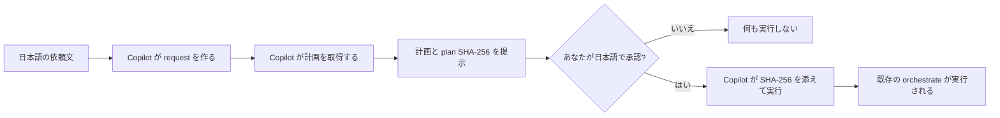

# HVE Prompt 版 はじめかた

← [README](../README.md)

---

## 目次

- [前提・次のステップ](#前提次のステップ)
- [Prompt 版とは](#prompt-版とは)
- [Step 1.（任意）GUI で設定を保存する](#step-1任意gui-で設定を保存する)
- [Step 2. 日本語の依頼文を貼り付ける](#step-2-日本語の依頼文を貼り付ける)
- [Step 3. 提示された計画を読む（書き込みなし）](#step-3-提示された計画を読む書き込みなし)
- [Step 4.「実行してください」と伝える](#step-4実行してくださいと伝える)
- [承認後の完全実行範囲](#承認後の完全実行範囲)
- [参考: 内部で実行されるコマンド](#参考-内部で実行されるコマンド)
- [うまくいかないとき](#うまくいかないとき)
- [対象外](#対象外)

---

## 前提・次のステップ

- 前提:
  - リポジトリを clone 済みで、`python -m hve` が起動できる
  - GitHub Copilot にログイン済み（HVE GUI 内の Copilot CLI タブ / GitHub Copilot CLI / VS Code Copilot Chat のいずれか）
- 次のステップ: [prompts/README.md](prompts/README.md) から目的に合った貼り付け用 Prompt を選ぶ

---

## Prompt 版とは

HVE には Cloud / GUI / CLI に加えて **Prompt 版** という利用面があります。

日本語で書いた依頼文を Copilot が **request（JSON）** に変換し、HVE が
その内容を検証して **実行計画** を提示します。あなたが計画を承認して初めて、
既存のワークフローが実行されます。



重要な性質:

- **あなたがコマンドを打つ必要はありません。** 依頼も承認も日本語だけで完結します。コマンドの実行と SHA-256 の取り扱いは Copilot が代行します。
- **Prompt 版は新しい実行エンジンではありません。** 既存の `hve orchestrate` を呼ぶだけです。
- **GUI 側に新しい画面やタブは追加していません。** 既存の Copilot CLI タブをそのまま使います。
- **計画の提示段階では成果物を作りません。** `docs/` / `src/` / `knowledge/` / `qa/` への生成・変更や Azure 操作は行いません（run ディレクトリ `work/run/<run-id>/` の作成と検索索引の更新は発生します）。
- **承認していない計画は実行できません。** 計画が変わると SHA-256 が変わり、実行は止まります。

---

## Step 1.（任意）GUI で設定を保存する

Prompt 版は、GUI で保存済みの設定（モデル、reasoning effort、並列度、タイムアウトなど）を
そのまま再利用します。

**この Step は任意です。** 設定を保存していない場合は既定値が使われます
（正本は [hve/gui/settings_store.py](../hve/gui/settings_store.py) の `defaults()`）。
モデルを固定したい場合だけ、最初に 1 回 GUI で設定してください。

1. `python -m hve` で GUI を起動する
2. オプション画面でモデルなどを選ぶ
3. GUI を通常どおり終了する（設定は `hve/.settings.txt` に自動保存されます）

GUI の操作手順は [hve-gui-getting-started.md](hve-gui-getting-started.md) を参照してください。

> 設定を変えたくなったら、また GUI で変更するだけです。依頼文の中で
> モデルなど一部の項目だけを一時的に上書きすることもできます（上書きできる項目は
> [hve/prompt_request.py](../hve/prompt_request.py) の `ALLOWED_SETTINGS_OVERRIDES` が正本）。

> **どこまで GUI と同じことができるか**: Prompt 版は、GUI が保存する 3 面共有設定
> （モデル・並列度・タイムアウトのほか、`strict`、Foundry Toolbox の tool search、
> Agentic Retrieval の 6 項目、Cloud Session の branch など）をそのまま引き継ぎます。
> ワークフロー固有の値（対象 APP-ID、Azure リソースグループ名、Remote MCP Server の公開、
> TDD 最大再試行回数など）は、依頼文の中でそのまま日本語で伝えれば指定できます。
> 一時的な設定上書き・実行 Step・追加目標・入力別名・GUI セッションだけで使う値を
> 指定しない場合、同じ保存設定から生成される CLI 実行引数は GUI 版と一致します。

---

## Step 2. 日本語の依頼文を貼り付ける

HVE GUI 内の **Copilot CLI** タブ、または GitHub Copilot CLI / VS Code Copilot Chat で、
[prompts/README.md](prompts/README.md) から選んだ Prompt を貼り付けます。

例（Web 画面設計）:

```text
HVE の Prompt 版で作業してください。

- 目的: APP-009 の Web 画面と API の設計書を作りたい
- Workflow: aad-web
- Step: 1, 2.1
- パラメータ: app_ids=APP-009
- 制約: Azure へのデプロイはしない。設計書の生成まで

まず実行計画だけを見せてください。
私が「実行してください」と書くまで、実行はしないでください。
```

Copilot は `.github/skills/hve-prompt-edition/SKILL.md` に従って request を書き出し、
続けて計画を取得します。この間、**あなたがコマンドやファイルパスを入力する必要はありません。**
**Workflow / Step / 入力ファイルが一意に決まらない場合、Copilot は推測せずに質問します。**

---

## Step 3. 提示された計画を読む（書き込みなし）

Copilot が実行計画（plan）を提示します。**あなたは何も入力しません。**

提示には次が含まれます。

| 項目 | 意味 |
|---|---|
| HEAD | 計画を作ったときのコミット |
| 実行順 | 複数 Workflow を指定した場合の実行順（依存関係に基づく） |
| Step | 実行対象の Step |
| 入力別名 | canonical 入力を別のファイル名で読み替える場合の対応 |
| argv | 実際に実行される `hve orchestrate ...` の引数（確認用の表示。手で打つ必要はありません） |
| plan SHA-256 | この計画を一意に表す 64 桁の値。実行時に Copilot が使います |

**あなたが確認すべきは「Step の範囲」です。** 特に Azure へのデプロイを含む Step が
入っていないかを見てください。

計画の提示は各 Workflow を `--dry-run` で実行し、実行計画（DAG）を組み立てられるかを確かめています。

> **`--dry-run` は上流成果物の不足を検出しません。** 前提となるファイルが無くても計画は提示されます。
> 依存関係は [prompts/cross-workflow.md](prompts/cross-workflow.md) で確認し、上流の Workflow を先に実行してください。

---

## Step 4.「実行してください」と伝える

計画の内容に問題がなければ、日本語でそう伝えるだけです。

```text
この計画で実行してください。
```

- Copilot が plan SHA-256 を添えて実行します。**あなたが 64 桁の値を打つ必要はありません。**
- 「いいね」「たぶん大丈夫」のような曖昧な返事は承認として扱われず、Copilot が確認し直します
- 依頼文や設定、HEAD が変わって計画が変わった → 「stale」として実行されません。Copilot が計画を作り直して再提示します
- 複数 Workflow のうち 1 つが失敗した → 後続の Workflow は開始しません。成功済み Workflow は自動で取り消されません

---

## 承認後の完全実行範囲

- 承認前に見ている **Prompt 実行計画** と、承認後に各 Step の中で使われる `plan.md` は別です。前者は「何を走らせるか」の確認用、後者はその Step が内部で使う作業計画です。
- 明示的な承認後、Prompt Edition controller は提示済みの plan SHA-256 を HVE へ渡します。HVE が request・保存設定・現在の HEAD から plan を実行時に再計算し、SHA-256 の一致を確認したときだけ、**あなたが選んだ Workflow / Step** を依存関係に従って実行します。実行は最初の失敗で止まります。
- Prompt Edition controller は `docs/` / `src/` / `knowledge/` / `qa/` の対象成果物を直接編集せず、既存 Workflow / Step へ委譲します。
- 実行された Step は `plan.md` や `subissues.md` だけを置いて終わりません。各 Step が宣言している `output_paths` を実行完了時点で存在させます。この存在ゲートだけでは、実行前から存在した成果物が今回更新されたことまでは証明しません。
- 実行中に、選んでいない Workflow が暗黙に追加されることはありません。自動 rollback もしません。どこかで失敗したあとに、そのまま後続だけ続けることもありません。
- 既存の認証・権限・Azure・QA・デプロイ承認ゲートは、そのまま維持されます。Prompt 版だけ特別に緩くなることはありません。

---

## 参考: 内部で実行されるコマンド

Copilot が代行するため入力は不要ですが、何が起きているかを知りたい場合の対応です。

| あなたの言葉 | Copilot が実行するコマンド |
|---|---|
| 「～の設計を進めてください」 | request を書き出し、`python -m hve prompt plan --request <path>` |
| 「この計画で実行してください」 | `python -m hve prompt run --request <path> --expected-sha256 <plan の値>` |

`--expected-sha256` が一致しない場合、HVE は `orchestrate` 子プロセスを 1 つも起動せずに停止します。
自然言語の承認だけでは書き込みは始まりません。

---

## うまくいかないとき

| 症状 | 原因 | 対処 |
|---|---|---|
| `Prompt request を受理できません` | request のフィールド名 / Workflow ID / Step ID / パラメータ名が registry に無い | 正本は `hve/workflow_registry.py`。[workflow-reference.md](workflow-reference.md) も参照 |
| `別名の実ファイルが存在しません` | 入力別名の実ファイルパスが違う | リポジトリ内の相対パスで、実在する通常ファイルを依頼文で伝える |
| `計画が承認時と一致しません（stale）` | 依頼内容 / GUI 設定 / HEAD が変わった | Copilot が自動で計画を作り直して再提示するので、内容を確認して改めて承認する |
| `dry-run が失敗したため計画を提示しません` | 引数の組合せが不正など、`orchestrate` 自体が非 0 で終了した | 直前に表示された `orchestrate` のエラーを確認する |
| 計画は出たが実行が途中で失敗する | 上流成果物が無い（`--dry-run` では検出されない） | 上流の Workflow を先に実行する。依存は [prompts/cross-workflow.md](prompts/cross-workflow.md) を参照 |
| Copilot がコマンドの実行をあなたに依頼してくる | Skill の規約が適用されていない | 「コマンドはあなたが実行してください」と伝える。規約の正本は [.github/skills/hve-prompt-edition/SKILL.md](../.github/skills/hve-prompt-edition/SKILL.md) |

より一般的なトラブルは [troubleshooting.md](troubleshooting.md) を参照してください。

---

## 対象外

- **GitHub.com の HVE Cloud Agent Orchestrator からの Prompt 実行**。Prompt 版はローカル実行のプレビューです。Cloud を使う場合は [hve-cloud-getting-started.md](hve-cloud-getting-started.md) を参照してください。
- 任意の DAG の組み立て、未選択 Workflow の自動追加
- 入力ファイルのコピー、出力パス・I/O 契約の変更
- glob / ディレクトリ / placeholder を使った入力別名（v1 非対応）
- 既存の権限ゲート・承認ゲートの緩和
