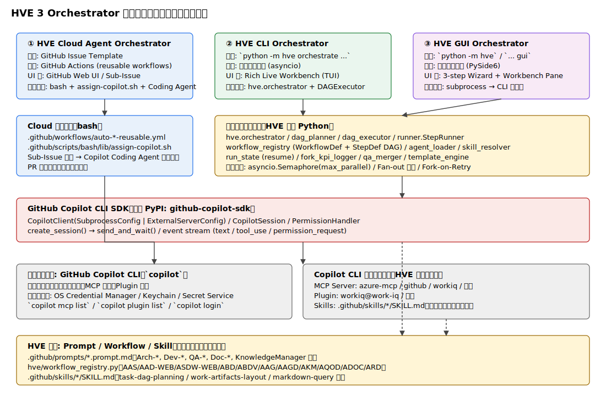
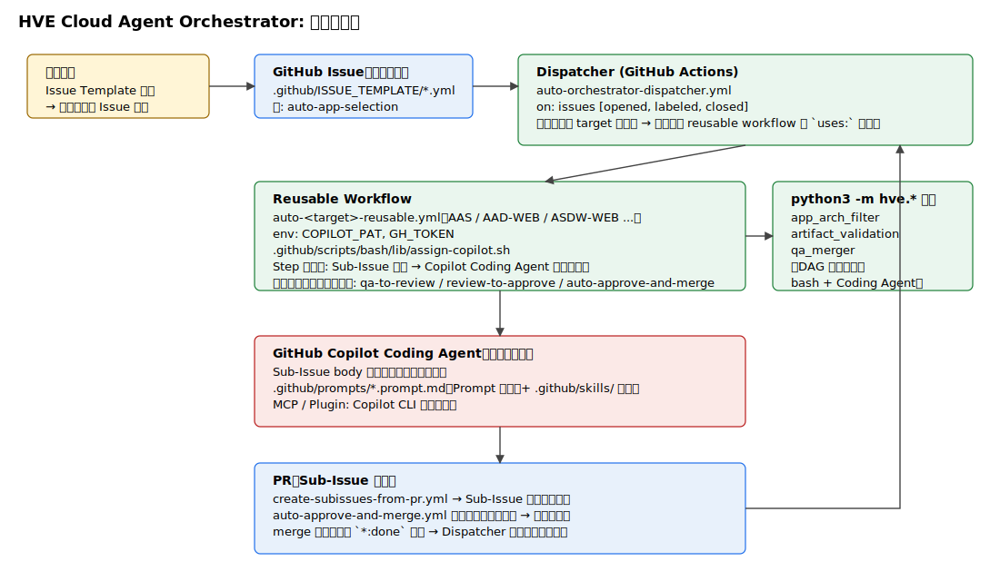
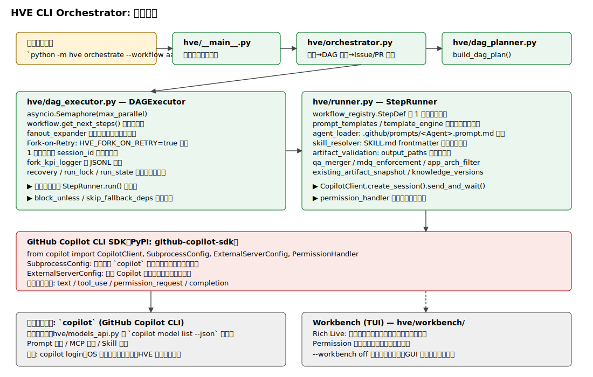
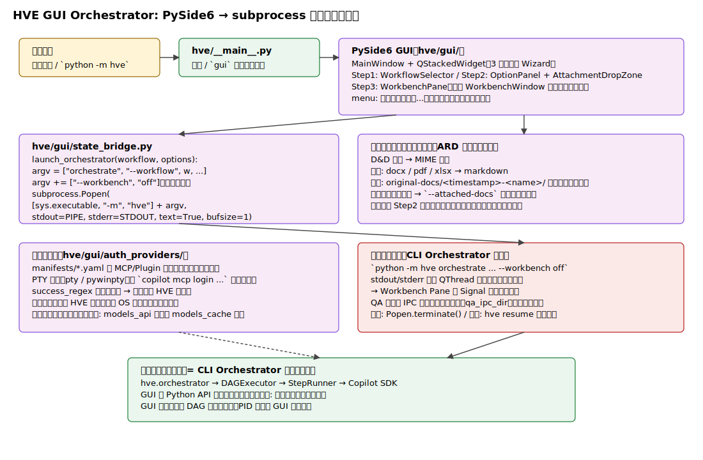
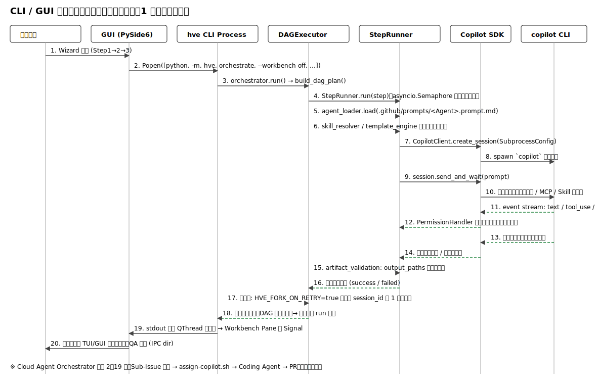
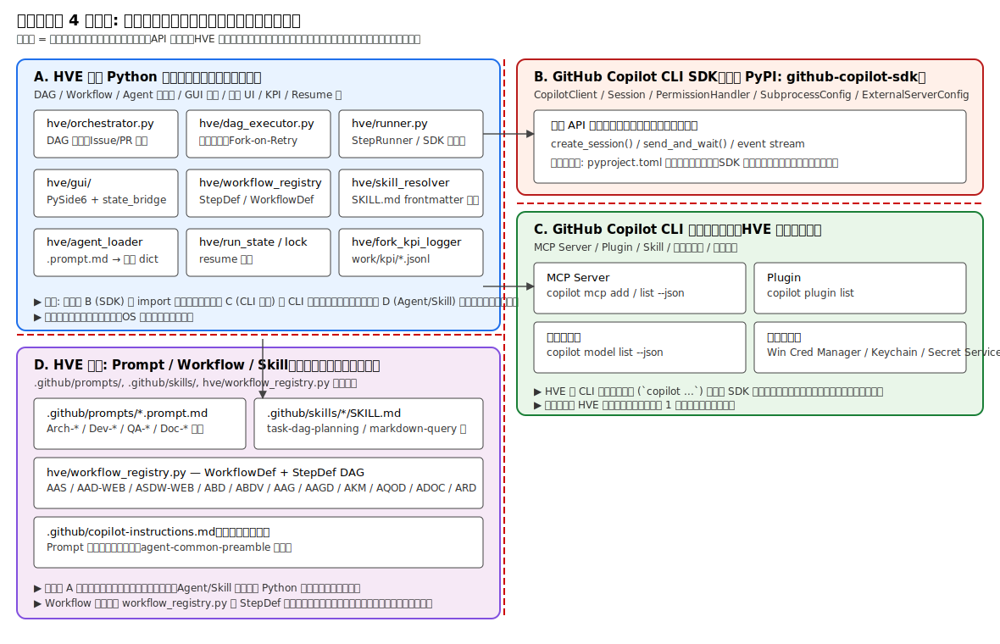
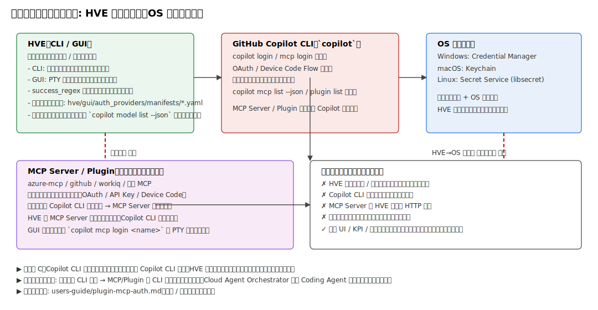

# HVE 技術アーキテクチャ詳細書

> **⚠️ Phase 8 付記 (2026-05-26)**: 本ドキュメントの §3〜§5 には Custom Agent 廃止前の旧構造（`hve/agent_loader.py`, `.github/agents/<Name>.agent.md`）を前提とした記述が残っている。Phase 8 でパス表記 (`.github/agents/` → `.github/prompts/`) の機械置換は完了したが、`agent_loader` モジュールは Phase 2 で廃止済みであり、后継 (そもそも同一責務を果たすモジュールがあるかも TBD) の実装は `hve/prompt_loader.py` + `.github/io-contracts/<Name>.yaml` 付近と推定される（**未検証**、本文改訂時に実装を読み込んで確定させること）。本文のフロー記述は次回改訂で書き直し予定。最新の仕様は `.github/copilot-instructions.md` §5 および `.github/prompts/README.md` を参照。

> **位置づけ**: HVE（Hypervelocity Engineering）の **3 つの Orchestrator**（Cloud Agent / CLI / GUI）について、最大限詳細な技術アーキテクチャ図・メッセージフロー・解説をまとめた一次資料。
> 利用者向けの操作手順は `users-guide/hve-cli-orchestrator-guide.md` および `users-guide/hve-gui-orchestrator-guide.md` を参照。
>
> **設計の中核思想**: **疎結合**。HVE は以下 4 ゾーンを厳密に分離して開発される。
>
> 1. **A. HVE 独自 Python 制御コード**（リポジトリ内: `hve/` 配下）
> 2. **B. GitHub Copilot CLI SDK**（外部 PyPI: `github-copilot-sdk`）
> 3. **C. GitHub Copilot CLI 管理リソース**（MCP Server / Plugin / Skill / 認証）— CLI が管理し、HVE は **透過的に利用** するのみ
> 4. **D. HVE 管理: Prompt / Workflow / Skill**（リポジトリ内ファイル: `.github/prompts/`, `.github/skills/`, `hve/workflow_registry.py`）
>
> **すべての構成要素・コード行・ファイルパスは実装ファイルに基づく**。推測箇所は明示する。

---

## 目次

- [1. はじめに](#1-はじめに)
- [2. 共通アーキテクチャ（3 Orchestrator 俯瞰）](#2-共通アーキテクチャ3-orchestrator-俯瞰)
- [3. HVE Cloud Agent Orchestrator](#3-hve-cloud-agent-orchestrator)
- [4. HVE CLI Orchestrator](#4-hve-cli-orchestrator)
- [5. HVE GUI Orchestrator](#5-hve-gui-orchestrator)
- [6. メッセージフロー（シーケンス図）](#6-メッセージフローシーケンス図)
- [7. 疎結合境界とゾーン責務分離](#7-疎結合境界とゾーン責務分離)
- [8. 認証と資格情報の取扱い](#8-認証と資格情報の取扱い)
- [9. カスタマイズ・拡張ポイント](#9-カスタマイズ拡張ポイント)
- [10. 用語集](#10-用語集)

---

## 1. はじめに

### 1.1 本書の目的

HVE は **GitHub Copilot CLI** を実行エンジンとして、**Workflow（DAG）** に従って **Prompt** に作業を委譲し、リポジトリの成果物（コード・ドキュメント・テスト・PR）を自動生成するオーケストレーション基盤である。  
本書は HVE の **内部構造** に焦点を当て、3 つの Orchestrator（Cloud Agent / CLI / GUI）が共通エンジンを共有しながら、入口（UI）と実行コンテキストの違いをどう吸収しているかを示す。

### 1.2 設計原則

| # | 原則 | 具体的な意味 |
|---|---|---|
| P1 | **疎結合** | 4 ゾーン（A〜D, §7）を相互にプロセス境界・API 境界・ファイル境界で分離。あるゾーンの変更が他ゾーンに波及しないことを最優先する。 |
| P2 | **既存資源の透過利用** | MCP Server / Plugin / Skill / 認証は GitHub Copilot CLI 側の管理機構を一切上書きしない。HVE は CLI コマンド経由でのみ操作する。 |
| P3 | **資格情報の非保持** | HVE プロセス（CLI / GUI）は資格情報を 1 バイトも保持しない。`copilot login` 等は OS 認証ストアへ完全に委譲する（§8）。 |
| P4 | **同一実行エンジン** | Cloud / CLI / GUI で UI 層は異なるが、ステップ単位の実行ロジックは可能な限り同一の Python モジュール群（`hve/runner.py`, `hve/dag_executor.py`）を経由する。 |
| P5 | **プロセス境界による分離** | GUI は CLI を Python API ではなく **子プロセス**（`python -m hve orchestrate ...`）として起動する。GUI が落ちても DAG は継続可能、CLI 側を単独で再開できる。 |

### 1.3 用語の前提

- **Orchestrator**: HVE のエントリポイント実装。Cloud / CLI / GUI の 3 種類。
- **Workflow**: DAG として定義された一連のステップ。`hve/workflow_registry.py` で `WorkflowDef` として宣言。
- **Step**: Workflow の最小実行単位。`StepDef`（id, title, custom_agent, depends_on, output_paths 等）で記述。
- **Prompt**: `.github/prompts/*.prompt.md`。Copilot Coding Agent / `copilot` CLI に渡される役割定義。
- **Skill**: `.github/skills/*/SKILL.md`。手順・コマンド・トラブルシュートを格納する技術リファレンス。
- **SDK**: `github-copilot-sdk`（PyPI）。Python から `copilot` プロセスを起動・制御するための公式 SDK。

---

## 2. 共通アーキテクチャ（3 Orchestrator 俯瞰）



### 2.1 全体構造の説明

3 つの Orchestrator は **入口（UI 層）が異なるだけ** で、内部実行ロジックは大部分を共有する。

| Orchestrator | 入口 | 実行コンテキスト | DAG 実行 | UI 出力 |
|---|---|---|---|---|
| **Cloud Agent** | GitHub Issue Template（ラベル付き Issue 作成） | GitHub Actions ランナー | bash + `assign-copilot.sh` で Sub-Issue を起こし、各 Sub-Issue を **GitHub Copilot Coding Agent** に委譲 | Sub-Issue / PR / ラベル遷移 |
| **CLI** | `python -m hve orchestrate ...` | ユーザー端末（ローカルプロセス） | `hve/dag_executor.py` の `DAGExecutor` が `asyncio.Semaphore` で並列実行、各ステップは `StepRunner` 経由で `copilot` SDK を呼ぶ | Rich Live Workbench（TUI） |
| **GUI** | `python -m hve`（既定）/ `python -m hve gui` | ユーザー端末（PySide6 プロセス + 子プロセス） | GUI から `python -m hve orchestrate ...` を **子プロセス** として起動。実行本体は CLI と完全同一 | PySide6 3-step Wizard + 埋め込み Workbench Pane |

### 2.2 共有実行エンジン（ゾーン A）

3 つの Orchestrator が共有する Python モジュール群：

| モジュール | 役割 |
|---|---|
| `hve/orchestrator.py` | エントリポイントから呼ばれる司令塔。DAG 構築 → Issue/PR 連携 → DAG 実行 → 後処理を担う。 |
| `hve/dag_planner.py` | `build_dag_plan()`：`WorkflowDef` を実行可能な DAG に展開（fanout・skip 条件評価）。 |
| `hve/dag_executor.py` | `DAGExecutor`：`asyncio.Semaphore(max_parallel)` 並列・Fork-on-Retry・依存解決。 |
| `hve/runner.py` | `StepRunner`：1 ステップを `CopilotClient.create_session()` → `send_and_wait()` で実行。 |
| `hve/workflow_registry.py` | `WorkflowDef` / `StepDef` 定義の集合体（11 ワークフロー）。 |
| `hve/prompt_loader.py` | `.github/prompts/*.prompt.md` を読み込み、Agent の Prompt 本文を提供する（旧 `hve/agent_loader.py` の後継、Phase 2 で SDK への custom_agents 伝搬は廃止）。 |
| `hve/skill_resolver.py` | `.github/skills/*/SKILL.md` の frontmatter から候補抽出（`skill_manifest.json` を活用）。 |
| `hve/run_state.py` / `run_lock.py` | resume 用の状態永続化と排他制御。 |
| `hve/fork_kpi_logger.py` | Fork-on-Retry の KPI を `work/kpi/fork-kpi-<run_id>.jsonl` に出力。 |

### 2.3 Cloud だけが異なる点

Cloud Agent Orchestrator は **DAG 実行を bash + GitHub Actions reusable workflow に展開** する点が CLI / GUI と本質的に異なる。`python -m hve` の補助呼び出し（`hve.app_arch_filter`, `hve.artifact_validation`, `hve.qa_merger` 等）は使うが、`DAGExecutor` を**直接は使わない**。代わりに各ステップを Sub-Issue として切り出し、ラベル遷移（`qa-to-review`, `review-to-approve`, `auto-approve-and-merge` 等）でフェーズ駆動する。詳細は §3。

---

## 3. HVE Cloud Agent Orchestrator



### 3.1 制御フロー

1. **Issue 作成**: ユーザーが `.github/ISSUE_TEMPLATE/*.yml` から Issue を起こす。フォーム送信時に対応するワークフローラベル（例: `auto-app-selection`, `auto-app-detail-design-web`）が自動付与される。
2. **Dispatcher 起動**: `.github/workflows/auto-orchestrator-dispatcher.yml` が `on: issues [opened, labeled, closed]` で発火。ラベルから `target` を判定し、対応する **reusable workflow** を `uses:` で呼び出す。
3. **Reusable Workflow 実行**: `auto-<target>-reusable.yml`（AAS / AAD-WEB / ASDW-WEB / ADFD / ADFDV / AAG / AAGD / AKM / AQOD ほか）が実行される。共通処理として:
   - `env: COPILOT_PAT` を設定（Coding Agent アサインに必要な PAT）。
   - `.github/scripts/bash/lib/assign-copilot.sh` を source して `assign_copilot` 関数を読み込む。
   - ワークフローごとに定義された **Step 群** を順次処理し、各ステップで以下を実施：
     - Sub-Issue を作成（タイトル・body はテンプレートから生成）
     - `assign_copilot` で当該 Sub-Issue を **GitHub Copilot Coding Agent** にアサイン
4. **Coding Agent 実行**: Coding Agent はクラウド側で Sub-Issue body をプロンプトとして読み、`.github/prompts/*.prompt.md`（Prompt 定義）と `.github/skills/`（Skills）を参照しながら作業し、PR を提出する。
5. **PR → Sub-Issue 連鎖**: `.github/workflows/create-subissues-from-pr.yml` が PR の本文を解析し、必要に応じて次の Sub-Issue を自動生成する。
6. **自動マージ**: `.github/workflows/auto-approve-and-merge.yml` が PR body の **検証マーカー**（`<!-- validation-confirmed -->`, `## 検証`, `**検証**:` 等）を判定し、マージ可能と判断すれば自動承認・マージする。マージ後は `*:done` ラベルが付与され、Dispatcher が次フェーズを起動する。

### 3.2 Cloud 専用の Python 補助呼び出し

bash 側からは以下の `python -m hve.*` を CLI として呼び出し、必要な計算・検証のみ行う：

| 呼び出し | 用途 |
|---|---|
| `python3 -m hve.app_arch_filter` | アプリカタログから APP-ID に紐付くサービス/エンティティを抽出（`auto-app-detail-design-web-reusable.yml` 597 行付近で利用）。 |
| `python3 -m hve.artifact_validation` | output_paths の存在確認・形式検証。 |
| `python3 -m hve.qa_merger` | 事前 QA 質問票のマージ・回答収集。 |

> 重要: **Cloud の DAG 実行は bash + GitHub Actions の `uses:` 連鎖が実体**である。`hve.orchestrator` Python API は Cloud 側からは呼ばない。これは「GitHub Actions のスケジューラ・ラベル遷移・PR レビュー機構」を最大限活用するため。

### 3.3 認証

- `COPILOT_PAT`: Coding Agent アサインに必要な GitHub Personal Access Token。GitHub Repository / Organization の Secrets に保存。
- 未設定時は reusable workflow が「WARNING: COPILOT_PAT が設定されていません。Copilot アサインは全てスキップされます。」を出力してアサイン処理だけスキップ（他処理は継続）。
- Coding Agent 側の認証（MCP / Plugin）は GitHub Copilot プラットフォーム側で管理され、HVE リポジトリは関知しない。

---

## 4. HVE CLI Orchestrator



### 4.1 起動シーケンス

1. ユーザーが端末で `python -m hve orchestrate --workflow <id> [options...]` を実行。
2. `hve/__main__.py` のサブコマンド分岐で `orchestrate` を選択 → `hve/orchestrator.py:run_orchestrate()` を呼ぶ。
3. `orchestrator.py` の処理：
   - 引数バリデーション
   - `hve/dag_planner.py:build_dag_plan(workflow, options)` で DAG を構築（fanout 展開・skip 条件評価）
   - 必要なら新規ブランチ作成・Issue 作成
   - `hve/dag_executor.py:DAGExecutor.run()` を呼ぶ
4. `DAGExecutor.run()` の動作：
   - `workflow.get_next_steps()` で実行可能なステップ集合を取得
   - `asyncio.Semaphore(max_parallel)` で並列実行を制御
   - 各ステップは `StepRunner.run(step)` を `asyncio.create_task` で起動
   - 失敗時：`HVE_FORK_ON_RETRY=true` なら **1 回限定** で新 session_id（フォーク）でリトライ。`fork_kpi_logger` に JSONL 出力。
   - 全完了後にコミット・push・PR 作成

### 4.2 StepRunner の内部

`hve/runner.py` の `StepRunner` は **1 ステップ = 1 Copilot セッション** という対応関係を維持する：

1. `workflow_registry.StepDef` から実行情報を取得（custom_agent, output_paths, depends_on 等）
2. `prompt_loader.load(.github/prompts/<custom_agent>.prompt.md)` で Agent の Prompt 本文を読み込み（旧 `agent_loader.load(...)` は Phase 2 で廃止）
3. `skill_resolver` で関連 Skill 候補を抽出（マニフェスト経由）
4. `template_engine` / `prompt_templates` でプロンプトを組み立て
5. `from copilot import CopilotClient, SubprocessConfig, ExternalServerConfig` および `from copilot.session import PermissionHandler`（`hve/runner.py` 2336 行付近）
6. `CopilotClient(SubprocessConfig(...))` または `CopilotClient(ExternalServerConfig(...))` を生成
7. `session = await client.create_session(...)` で Copilot セッション開始
8. `response = await session.send_and_wait(prompt)` で同期実行
9. ストリーム中の `permission_request` イベントは `PermissionHandler` でポリシー判定
10. 終了後 `artifact_validation` で `output_paths` の存在を確認
11. `mdq_enforcement` / `app_arch_filter` / `qa_merger` 等の後処理を必要に応じて実施
12. 成功/失敗を `DAGExecutor` に返す

### 4.3 並列実行・Fork-on-Retry の詳細

- **並列度**: `--max-parallel`（既定 15）で `asyncio.Semaphore` のサイズを指定。
- **DAG パターン**: sequential / fork / AND join / skip fallback（条件不一致時にスキップ）。
- **Fork-on-Retry**: 環境変数 `HVE_FORK_ON_RETRY=true` で有効化。非コンテナステップが失敗した時に **1 回だけ** 新 session_id を発行してフォーク再試行する。`tdd_max_retries`（TDD GREEN フェーズの再試行）とは独立。
- **KPI**: `work/kpi/fork-kpi-<run_id>.jsonl` に `timestamp / run_id / step_id / session_id / forked_session_id / success / retry_count / elapsed_seconds / tokens / fork_on_retry_enabled` を記録。

> CLI 利用者の操作手順は [hve-cli-orchestrator-guide.md](./hve-cli-orchestrator-guide.md) 参照。

### 4.4 SDK 連携の詳細

`github-copilot-sdk`（PyPI）が提供する公開 API のみを利用する：

| クラス | 役割 | HVE での用途 |
|---|---|---|
| `CopilotClient` | Copilot プロセスへの接続管理 | StepRunner の主たる窓口 |
| `SubprocessConfig` | ローカル `copilot` バイナリを子プロセス起動 | 既定 |
| `ExternalServerConfig` | 既存 Copilot サーバへ接続（再利用） | 共有モード（実験的） |
| `PermissionHandler` | ツール実行許可ポリシーの注入 | HVE の許可ポリシー（例: 安全ガード）を適用 |

イベント駆動：`text` / `tool_use` / `permission_request` / `completion` の 4 種類を `async for` で受け取り、StepRunner が分岐処理する。

### 4.5 Workbench（TUI）

- `hve/workbench/` 配下の Rich Live UI。
- ステップ状態（pending / running / done / failed）、トークン消費、経過時間をリアルタイム表示。
- `permission_request` イベント発生時はインタラクティブに承認待ち。
- `--workbench off` で非表示モード（GUI から子プロセス起動する際に自動付与）。

---

## 5. HVE GUI Orchestrator



> **実装現況メモ**: §5.2〜§5.13 は GUI の **設計仕様**（旧 `hve-gui-orchestrator-design.md` を統合）を記述する。現行 `hve/gui/` 配下には以下 2 系統の UI 実装が並存しており、本書の構造記述は設計意図を示すものとして読むこと。
>
> - `hve/gui/wizard.py`: `QWizard` ベースの 3 ページ（`_WorkflowSelectPage` → `_OptionsPage` → `_ConfirmPage`）。
> - `hve/gui/main_window.py`: `QMainWindow` + `QStackedWidget`（2 ステップ切替 + Workbench スタック）+ `page_intro.py` 等の追加ページ。
>
> 細部の差異（ページ構成・遷移ロジック）は実装ファイルを正とすること。

### 5.1 設計原則（GUI 固有）

| # | 原則 | 意味 |
|---|---|---|
| G1 | UI 層のみ追加・既存コードに干渉しない | `hve/__main__.py` の `orchestrate` パーサ・`hve/orchestrator.py` には一切変更を加えない。新規 `hve/gui/` パッケージ内で完結。 |
| G2 | 実行は別プロセス | GUI から `python -m hve orchestrate ...` を `subprocess.Popen` で fork。Python API レベルで `hve.orchestrator` を直接呼ばない。 |
| G3 | オプション網羅 | `orchestrate` が受け付ける **80 以上のオプション** を全てカテゴリ分けして GUI から指定可能にする。 |

### 5.2 3 ステップ Wizard

```
┌─────────────────────────────────────────────────────────────┐
│ HVE GUI Orchestrator — Session #1                       _□× │
├─────────────────────────────────────────────────────────────┤
│ ＜ヘッダー：ステップ進捗バー＞                              │
│ ① ワークフロー選択  →  ② オプション選択  →  ③ 実行（Workbench）│
├─────────────────────────────────────────────────────────────┤
│ ＜メイン：QStackedWidget（現在のステップに応じて切替）＞    │
│  Step 1: ワークフロー一覧 (RadioButton + 説明)              │
│  Step 2: カテゴリ別オプションフォーム (アコーディオン)      │
│  Step 3: Workbench (ログ + ユーザーアクション)              │
├─────────────────────────────────────────────────────────────┤
│ [戻る]                                       [次へ] / [実行] │
└─────────────────────────────────────────────────────────────┘
```

ウィジェット階層：

```
QMainWindow (MainWindow)
└── QWidget (central)
    └── QVBoxLayout
        ├── HeaderBar (QWidget) ··············· ステップ進捗
        ├── QStackedWidget (mainStack)
        │   ├── WorkflowSelectPage (Step 1)
        │   ├── OptionsPage (Step 2)
        │   │   └── ARD 選択時は C14 セクションに添付 D&D ウィジェットを動的追加
        │   └── WorkbenchPage (Step 3)
        └── NavigationBar (QWidget) ············ [戻る] / [次へ] / [実行] / [停止]
```

### 5.3 Step 1: ワークフロー選択

- `hve.workflow_registry.list_workflows()` から `WorkflowDef` を動的取得。
- ラジオボタンで 1 つ選択 → `ard` の場合は Step 2 (ARD) に、それ以外は Step 2 (汎用) に遷移。
- 説明文は `_WORKFLOW_DESCRIPTIONS` 辞書を `hve/gui/page_workflow_select.py` 内に定義（`hve/__main__.py` の `--workflow` add_argument の help テキストを参照）。
- 表示名は `WorkflowDef.name` を正とする（help テキストの表記とは異なる場合あり）。

### 5.4 Step 2: オプション選択（16 カテゴリ）

`orchestrate` のオプション群を **16 カテゴリ** にアコーディオン分類する。カテゴリの根拠は `hve/__main__.py` の `add_argument(...)` 呼び出しに付随するコメントセクション。

| # | カテゴリ | 主要オプション | 区分 |
|---|---|---|---|
| C1 | 基本設定 | `--workflow`, `--model`, `--review-model`, `--qa-model` | 共通 |
| C2 | 並列実行 | `--max-parallel` | 共通 |
| C3 | 自動プロンプト | `--auto-qa`, `--force-interactive`, `--auto-contents-review`, `--auto-coding-agent-review`, `--auto-coding-agent-review-auto-approval` | 共通 |
| C4 | Work IQ | `--workiq`, `--workiq-akm-review`, `--workiq-akm-ingest`, `--workiq-dxx`, `--workiq-draft`, `--workiq-draft-output-dir`, `--workiq-tenant-id`, `--workiq-prompt-qa`, `--workiq-prompt-km`, `--workiq-prompt-review`, `--workiq-per-question-timeout` | **CLI 固有**（Issue Template に存在しないことを確認済み: `grep -i workiq` で 0 件） |
| C5 | Issue / PR 作成 | `--create-issues`, `--create-pr`, `--ignore-paths`, `--repo`, `--issue-title` | 共通 |
| C6 | 出力制御 | `--verbose`, `--quiet`, `--verbosity`, `--show-stream`, `--log-level`, `--no-color`, `--banner`, `--screen-reader`, `--timestamp-style`, `--final-only` | CLI 固有（推定） |
| C7 | MCP / CLI 接続 | `--mcp-config`, `--cli-path`, `--cli-url` | CLI 固有（推定） |
| C8 | タイムアウト | `--timeout`, `--review-timeout` | 共通 |
| C9 | ブランチ / ステップ選択 | `--branch`, `--steps` | 共通 |
| C10 | アプリ ID | `--app-id`, `--app-ids`, `--resource-group`, `--app-id`, `--usecase-id` | 共通（aas / aad-web / asdw-web / adfd / adfdv 選択時のみ） |
| C11 | AKM 固有 | `--sources`, `--target-files`, `--force-refresh`, `--custom-source-dir`, `--enable-auto-merge` | akm 選択時のみ |
| C12 | AQOD 固有 | `--target-scope`, `--depth`, `--focus-areas` | aqod 選択時のみ |
| C13 | ADOC 固有 | `--target-dirs`, `--exclude-patterns`, `--doc-purpose`, `--max-file-lines` | adoc 選択時のみ |
| C14 | ARD 固有 | `--company-name`, `--target-business`, `--survey-base-date`, `--survey-period-years`, `--target-region`, `--analysis-purpose`, `--target-recommendation-id`, `--attached-docs` | ard 選択時のみ。`--attached-docs` は §5.5 で D&D 拡張 |
| C15 | 追加プロンプト / コメント | `--additional-prompt`, `--context-max-chars`, `--additional-comment` | 共通 |
| C16 | 実行制御 / 拡張機能 | `--dry-run`, `--self-improve`, `--no-self-improve` | `--dry-run` は共通、他は CLI 固有（推定） |

入力検証ルール：

- **必須項目（ARD）**: `--company-name` は Step 1 (Untargeted) 実行時に必須。`--target-business` 指定時は Step 1 をスキップ可能（`hve/__main__.py` の `--company-name` / `--target-business` add_argument 参照）。
- ファイルパス系はファイルダイアログから選択可。
- `--max-parallel` / `--timeout` は QSpinBox / QDoubleSpinBox。
- `--workiq-akm-review`, `--workiq-akm-ingest`, `--banner`, `--force-refresh` は `argparse.BooleanOptionalAction` で **ON / OFF / 未指定の 3 状態** → `QComboBox`（"継承（未指定）" / "明示 ON" / "明示 OFF"）で表現。

### 5.5 Step 2 (ARD): 添付ファイル D&D 取り込み

CLI の `--attached-docs` は既存ファイルパスのカンマ区切り指定（`hve/__main__.py` の `--attached-docs` add_argument 参照）。GUI ではユーザーが任意形式のファイルを D&D で取り込み、自動 Markdown 変換 → `docs/attached/` 配置 → `--attached-docs` 引数の自動生成までを行う。

**ファイル変換パイプライン**：

| 拡張子 | 変換方式 | 必要ライブラリ |
|---|---|---|
| `.md` / `.markdown` | そのままコピー | 標準ライブラリ |
| `.txt` | コードブロック付き Markdown 化 | 標準ライブラリ |
| `.csv` | Markdown 表へ変換 | 標準ライブラリ |
| `.pdf` / `.docx` / `.xlsx` / `.xls` / `.pptx` / `.html` / `.htm` | [microsoft/markitdown](https://github.com/microsoft/markitdown) で Markdown 化 | `markitdown[all]>=0.1.5`（`gui-docconvert` extras） |
| その他 | エラーダイアログ + スキップ | — |

**保存先**: `<repo>/docs/attached/<name>.md`。

**起点ファイル選択**:
- ARD ワークフローは Step 2 で `docs/business-requirement.md` を自動生成・上書きするため（`workflow_registry.py` の ARD Step 2 `output_paths` 参照）、ユーザー D&D の起点ファイルは別名 `docs/attached/business-requirement-input.md` で保存し、`--target-business` にパスを渡す。
- 2 個以上の D&D 時はダイアログで起点 1 つを選択させる。

**引数自動生成例**：

```
python -m hve orchestrate --workflow ard \
  --company-name "ACME" \
  --target-business "docs/attached/business-requirement-input.md" \
  --attached-docs "docs/attached/business-requirement-input.md,docs/attached/market-survey.md,docs/attached/memo.md"
```

**エラー処理**：

| エラー | 対応 |
|---|---|
| 変換ライブラリ未インストール | ダイアログで「`hve/setup-hve.ps1` または `hve/setup-hve.sh` をオプション無しで実行してください」表示。該当ファイルをスキップ。 |
| ファイル読み取り失敗 | エラーダイアログ + リスト上で赤マーク表示。続行可能。 |
| 100MB 超ファイル | 警告「変換に時間がかかる可能性があります。続行しますか?」 |
| `docs/` 書き込み失敗 | エラー表示 → Step 3 への遷移をブロック。 |

### 5.6 Step 3: Workbench（実行）

```
┌─────────────────────────────────────────────────────────────┐
│ Step 3: 実行 (ard, run_id=auto)                              │
│ 実行コマンド: python -m hve orchestrate --workflow ard ... [📋]│
│ ┌─ ログ出力 ──────────────────────────────────── [📋] ──┐    │
│ │ [2026-05-14 10:00:00] Step 1 started...               │    │
│ └────────────────────────────────────────────────────────┘    │
│ ┌─ ユーザーアクション ──────────────────────────── [📋] ──┐  │
│ │ - QA 質問が 3 件あります → docs/qa/ard-step1.md         │  │
│ └────────────────────────────────────────────────────────┘  │
│ [停止]                                                       │
└─────────────────────────────────────────────────────────────┘
```

- Step 2 で生成した `argv` を `launch_orchestrator(argv)` に渡す。
- **`--workbench off` を強制注入**（GUI 側で再描画するため、TUI Workbench を抑止）。
- `subprocess.Popen([sys.executable, "-m", "hve"] + argv, stdout=PIPE, stderr=STDOUT, text=True, bufsize=1)` で起動。
- `SubprocessReader(QThread)` で stdout を読み取り、`_LogPane.append_line()` に流す（Signal/Slot）。
- 「停止」: `SIGTERM` → 10 秒待っても終わらなければ `kill()`。Windows は `terminate()` がハードキル相当。

### 5.7 QA 回答モード（GUI 経由 IPC）

`--auto-qa` 有効時に Step 2 で「ユーザー回答」モードを選択すると、CLI と GUI 間でファイルベース IPC を行う。

| ファイル | 方向 | 内容 |
|---|---|---|
| `<step_id>.questionnaire.md` | CLI → GUI | 質問票本体（`QAMerger.render_merged` 出力） |
| `<step_id>.request.json` | CLI → GUI | `{schema_version, step_id, pid, created_at, questionnaire_path, qa_input_timeout_seconds}` |
| `<step_id>.answers.md` | GUI → CLI | "番号: ラベル" 形式（`QAMerger.parse_answers` 入力。空文字 = 既定値全採用） |
| `<step_id>.cancel` | GUI → CLI | 空ファイル（生成されると CLI 側で `RuntimeError`） |

- **IPC ディレクトリ**: `<repo_root>/.hve/qa-ipc/gui-<uuid>/`（GUI 起動時に `tempfile.mkdtemp`、終了時に削除）
- **CLI フラグ**: `--qa-answer-mode={autopilot|gui-file}` / `--qa-ipc-dir=PATH`
- **原子性**: 全て `tmp + os.replace()` でアトミック書き込み
- **監視（GUI 側）**: `QFileSystemWatcher` + `QTimer`（1 秒間隔）で取りこぼし対策
- **タイムアウト**: 既定 `qa_gui_input_timeout_seconds = 3600.0` 秒。到達時は既定値全採用 + WARNING

### 5.8 複数セッションの同時起動

- メニュー「セッション」→「新規セッション」で別 `MainWindow` を生成。
- 各ウィンドウは独立した `subprocess.Popen` を持つため、セッション間の干渉はなし。
- タイトル: `HVE GUI Orchestrator — Session #N (ワークフロー ID)`
- 実行中サブプロセスが残っているウィンドウを閉じる際は確認ダイアログ「実行中のセッションを終了しますか?」を表示。
- 全ウィンドウを閉じると `QApplication` が終了。

### 5.9 主要 dataclass

```python
@dataclass
class OrchestrateArgs:
    """Step 2 で確定したオプション群。orchestrate サブコマンドの引数に変換可能。"""
    workflow: str
    model: Optional[str] = None
    review_model: Optional[str] = None
    qa_model: Optional[str] = None
    max_parallel: int = 15
    auto_qa: bool = False
    auto_contents_review: bool = False
    workiq: bool = False
    # ... C5〜C16 同様に網羅
    repo_root: Path = field(default_factory=Path.cwd)

    def to_argv(self) -> List[str]:
        """orchestrate コマンドラインに変換。"""
        ...

@dataclass
class AttachedFile:
    src_path: Path
    converted_path: Path
    is_business_req: bool
    conversion_error: Optional[str] = None
```

### 5.10 状態遷移

```
[INIT] → [STEP1_WORKFLOW] → [STEP2_OPTIONS] → [STEP3_RUNNING] → [STEP3_DONE]
            ↑                    │
            └──── (戻る) ────────┘
```

Step 3 移行後は戻り不可。新規セッション or ウィンドウクローズで終了。

### 5.11 GUI 既知の制約

| # | 制約 | 詳細 |
|---|---|---|
| L1 | GUI モード `--workbench` 強制 off | TUI Workbench を子プロセスで描画させると重複描画とエスケープシーケンス問題が発生するため。C16 カテゴリから `--workbench` 系を除外。 |
| L2 | `docs/attached/` 衝突 | 起動時に存在チェック → 空でなければ確認ダイアログ。 |
| L3 | `--target-business` ファイルパス指定の振る舞い | `hve/__main__.py` の `--target-business` add_argument help 文に基づく暗定実装。実 ARD ワークフロー内部の扱いは別途検証が必要。 |
| L4 | Windows OneDrive ロックファイル | D&D 時にロック中ファイルは読めない可能性あり。エラーハンドリングでメッセージ表示。 |
| L5 | Windows `Popen.terminate()` はハードキル相当 | graceful にしたい場合は `creationflags=CREATE_NEW_PROCESS_GROUP` + `CTRL_BREAK_EVENT` を要検討。 |
| L6 | `full-pipeline`（メタワークフロー）の表示 | `_META_REGISTRY`（`workflow_registry.py` 内に定義）に格納されており `list_workflows()` は返さない。表示要否は未確定。 |
| L7 | 国際化（i18n）・アクセシビリティ | 本設計は日本語 UI のみ。スクリーンリーダー対応は `--screen-reader` フラグのみ。 |

### 5.12 GUI ファイル構成

| ファイル | 役割 |
|---|---|
| `hve/gui/__init__.py` | `run_gui()` エントリポイント |
| `hve/gui/main_window.py` | `MainWindow`（QStackedWidget 単一ウィンドウ） |
| `hve/gui/header_bar.py` | ステップ進捗バー |
| `hve/gui/page_workflow_select.py` | Step 1 ページ |
| `hve/gui/page_options.py` | Step 2 ページ（共通カテゴリ） |
| `hve/gui/page_options_ard.py` | Step 2 ページ（ARD 拡張、D&D） |
| `hve/gui/page_workbench.py` | Step 3 ページ（既存 `WorkbenchWindow` を QWidget 化） |
| `hve/gui/state_bridge.py` | `SubprocessReader` + `launch_orchestrator()`（`--workbench off` 自動注入） |
| `hve/gui/orchestrate_args.py` | `OrchestrateArgs` dataclass |
| `hve/gui/doc_convert.py` | ファイル変換ユーティリティ（markitdown 一本化） |
| `hve/gui/copy_button.py` | 共通コピーアイコンウィジェット |
| `hve/gui/auth_providers/` | 認証マニフェスト + PTY ハンドラ（§8） |
| `hve/gui/app.py` | 複数ウィンドウ管理 |

### 5.13 orchestrate オプション コード位置

実装時に参照する `hve/__main__.py` のオプション宣言位置は頂点だけ以下に示す（実装を参照して見つけるのが確実）。

```powershell
# Windows PowerShell
Select-String -Path hve\__main__.py -Pattern '"--workflow"|"--max-parallel"|"--auto-qa"|"--workiq"|"--company-name"|"--target-business"|"--attached-docs"' | Select-Object LineNumber,Line
```

```bash
# POSIX
grep -nE '"--workflow"|"--max-parallel"|"--auto-qa"|"--workiq"|"--company-name"|"--target-business"|"--attached-docs"' hve/__main__.py
```

オプションは `hve/__main__.py` の `_build_orchestrate_parser()` 内でカテゴリコメントとともにグルーピングされているため、表 5.4 のカテゴリに合わせて検索して位置を確定させる。行番号はリファクタで連動して変化するため本書には離さない。

> GUI 利用者の操作手順は [hve-gui-orchestrator-guide.md](./hve-gui-orchestrator-guide.md) 参照。

---

## 6. メッセージフロー（シーケンス図）



### 6.1 GUI 経由 CLI 起動 → 1 ステップ実行 → 完了までの 20 ステップ

1. **GUI Step1→2→3**: ユーザーが Wizard を操作
2. **subprocess 起動**: `Popen([python, -m, hve, orchestrate, --workbench off, ...])`
3. **orchestrator.run()**: `build_dag_plan()` で DAG 構築
4. **StepRunner.run(step)**: `asyncio.Semaphore` で並列度制御
5. **prompt_loader.load**: `.github/prompts/<Agent>.prompt.md` を読み込み
6. **skill_resolver / template_engine**: プロンプトを組み立て
7. **CopilotClient.create_session**: `SubprocessConfig` で Copilot プロセスを起動
8. **spawn `copilot`**: 子プロセス起動
9. **session.send_and_wait**: プロンプト送信
10. **推論 / MCP / Skill 解決**: Copilot 内部処理
11. **event stream**: `text` / `tool_use` / `permission_request` イベントが返る
12. **PermissionHandler 評価**: 許可ポリシー適用
13. **完了イベント**: 最終応答
14. **応答 / 成果物パス**: SDK → StepRunner
15. **artifact_validation**: `output_paths` の存在確認
16. **ステップ完了**: success / failed を `DAGExecutor` に返す
17. **失敗時 Fork-on-Retry**: `HVE_FORK_ON_RETRY=true` なら新 session_id で 1 回再試行
18. **次ステップへ**: DAG 依存解決 → 全完了で run 終了
19. **stdout → GUI**: `QThread` が読取 → Workbench Pane へ Signal
20. **進捗確認・QA 応答**: ユーザーは TUI/GUI で確認、QA は IPC ディレクトリ経由

> Cloud Agent Orchestrator では 2〜19 が「Sub-Issue 作成 → `assign-copilot.sh` → Coding Agent → PR」に置換される。

### 6.2 タイムアウトとリトライ

| 種別 | 既定値 | 環境変数 / CLI |
|---|---|---|
| 全体タイムアウト | なし（無制限） | `--timeout` で個別に設定可能 |
| Review タイムアウト | 7200 秒（Code Review Agent フェーズ） | `--review-timeout` |
| QA 入力タイムアウト | 3600 秒 | `qa_gui_input_timeout_seconds` |
| Fork-on-Retry 回数 | 1 回（固定） | `HVE_FORK_ON_RETRY=true` で有効化 |
| TDD GREEN リトライ | ワークフロー依存 | `tdd_max_retries` |

---

## 7. 疎結合境界とゾーン責務分離



### 7.1 ゾーン定義

| ゾーン | 名称 | 場所 | 責務 |
|---|---|---|---|
| **A** | HVE 独自 Python 制御コード | `hve/` 配下 | DAG 構築・実行、Workflow/Agent ローダ、GUI 制御、認証 UI、KPI、Resume |
| **B** | GitHub Copilot CLI SDK | PyPI: `github-copilot-sdk` | `CopilotClient` / `CopilotSession` / `PermissionHandler` の Python API |
| **C** | GitHub Copilot CLI 管理リソース | `copilot` バイナリ + OS 認証ストア | MCP Server / Plugin / Skill / モデル選択 / 認証情報 |
| **D** | HVE 管理: Prompt / Workflow / Skill | `.github/prompts/`, `.github/skills/`, `hve/workflow_registry.py` | Prompt 定義、Workflow DAG 定義、Skill リファレンス |

### 7.2 境界の規定

| 境界 | 方向 | 許可される通信手段 | 禁止事項 |
|---|---|---|---|
| **A → B** | HVE → SDK | 公開 API のみ（`from copilot import ...`） | SDK 内部実装への依存、private 属性参照 |
| **A → C** | HVE → CLI 資源 | `copilot mcp list --json` / `copilot plugin list` / `copilot model list --json` 等の CLI コマンド | `~/.copilot/` の直接ファイル読み取り、OS 認証ストアへの直接アクセス |
| **A → D** | HVE → Agent/Skill | ファイル読み取り（`prompt_loader` / `skill_resolver` 経由） | Agent/Skill ファイルへの動的書き込み（実行時生成 Agent は禁止） |
| **B → C** | SDK → CLI | SDK が SubprocessConfig 経由で `copilot` を起動 | HVE は SDK 経由でしか CLI に触れない |
| **D ↔ Workflow** | Agent → Workflow | Agent は Workflow を知らない（疎結合） | Agent の文面にワークフロー ID を埋め込まない |

### 7.3 設計の利点

| # | 利点 |
|---|---|
| 1 | **SDK アップグレードが疎結合**: `github-copilot-sdk` の新バージョンは公開 API 互換性さえあれば HVE の他モジュールに影響しない。 |
| 2 | **MCP / Plugin の追加が疎結合**: `copilot mcp add` だけで HVE のコードは無変更で利用可能。HVE 側はマニフェスト追加程度。 |
| 3 | **Agent / Workflow の追加が疎結合**: `.github/prompts/*.prompt.md` を追加し `workflow_registry.py` に `StepDef` を追加するだけで新ワークフローを構成可能。 |
| 4 | **認証の安全性**: 資格情報を HVE プロセスから完全に隔離。HVE バグや malicious code injection の影響範囲を限定。 |
| 5 | **テスタビリティ**: 各ゾーンを独立にモック可能（SDK モック / CLI モック / Agent ファイルモック）。 |
| 6 | **クロス Orchestrator 共通化**: Cloud / CLI / GUI が同じゾーン D（Agent / Workflow / Skill）を共有することで、UI の違いに関わらず成果物が同質。 |

### 7.4 アンチパターン（してはいけないこと）

| アンチパターン | 理由 |
|---|---|
| HVE Python から `~/.copilot/auth.json` を直接読む | OS 認証ストア委譲モデル（§8）を破壊。資格情報が HVE プロセスに漏出。 |
| Prompt の文面に `import` 等の Python コードを実行可能な形で埋め込む | ゾーン D（宣言）とゾーン A（実行）の責務混在。 |
| `workflow_registry.py` から MCP Server に直接 HTTP 接続 | ゾーン C を bypass。Copilot CLI の権限管理を回避してしまう。 |
| GUI から `hve.orchestrator.run_orchestrate()` を直接 `import` して呼ぶ | プロセス境界を破壊。GUI 落ち時に DAG も道連れになる。 |
| SDK の internal モジュール（`copilot._internal.*`）を参照 | SDK アップグレードで容易に壊れる。 |

---

## 8. 認証と資格情報の取扱い



### 8.1 設計の根本原則

> **HVE は資格情報を 1 バイトも保持しない。すべて OS 認証ストアに委譲する。**

| プラットフォーム | 認証ストア |
|---|---|
| Windows | Credential Manager |
| macOS | Keychain |
| Linux | Secret Service (libsecret) |

`copilot login` および `copilot mcp login <name>` の実体は **GitHub Copilot CLI** 側にあり、OAuth / Device Code Flow 等の認証フロー、トークンの暗号化保管・更新を全て担当する。HVE はこれら CLI コマンドを起動し、**完了判定のみ** を行う。

### 8.2 GUI 認証パネルの仕組み

GUI には MCP Server / Plugin 単位の認証ボタンが用意される。実装は `hve/gui/auth_providers/`：

1. **マニフェスト宣言**: `hve/gui/auth_providers/manifests/*.yml` に MCP/Plugin 単位の認証ハンドラを宣言。
2. **PTY 統合**: `pty`（POSIX）/ `pywinpty`（Windows）で `copilot mcp login <name>` を埋込起動。
3. **success_regex で完了判定**: 出力ストリームを正規表現で監視し、成功パターンマッチで完了通知。
4. **資格情報は HVE に渡さない**: トークン本体は Copilot CLI が OS 認証ストアに保存。HVE は「成功した」という事実のみ受け取る。

### 8.3 マニフェストスキーマ

```yaml
id: github                          # ハンドラ識別子
match:
  mcp_server_name_regex: "^github$" # 対応する MCP Server 名のパターン
pre_auth_commands:                  # 認証前の準備コマンド（任意）
  - "copilot mcp ensure github"
main_command: "copilot mcp login github"
success_regex: "(?i)success|logged in|complete"
notes_md: |
  GitHub MCP Server の認証手順。
  Device Code が表示されたら表示の URL を開いて入力してください。
```

### 8.4 検出ソース（MCP Server / Plugin 一覧の取得）

| リソース | 取得コマンド | 用途 |
|---|---|---|
| MCP Server 一覧 | `copilot mcp list --json` | GUI 認証パネルの自動生成 |
| Plugin 一覧 | `copilot plugin list` | 同上 |
| モデル一覧 | `copilot model list --json` | Step 2 C1 のモデルドロップダウン（`hve/models_api.py` 経由、`hve/models_cache.py` でキャッシュ） |

> HVE 側のキャッシュ更新は GUI の「利用できるモデルの取得」ボタンで明示的にトリガできる。

### 8.5 認証フローの統一原則

| ケース | 原則 |
|---|---|
| 初回利用 | まず `copilot login`（Copilot CLI 本体の認証）→ 必要に応じて `copilot mcp login <name>`（MCP 個別認証） |
| トークン失効 | Copilot CLI が自動更新（refresh token）。失敗時に GUI に通知。HVE はリトライしない（CLI に委ねる）。 |
| Cloud Agent | GitHub Coding Agent 側が同等の権限を持つ。HVE リポジトリは関知しない。`COPILOT_PAT`（GitHub PAT）のみ Cloud で必要（§3.3）。 |
| 複数アカウント | Copilot CLI のプロファイル機能（実装次第）に依存。HVE は環境変数で切替できるよう設計（未実装）。 |

### 8.6 禁止事項（疎結合維持のため）

- ✗ HVE のディスク / プロセスメモリに資格情報を保存
- ✗ Copilot CLI の認証ファイル（`~/.copilot/auth.json` 等）を直接読む
- ✗ MCP Server へ HVE が直接 HTTP 接続（必ず Copilot CLI 経由）
- ✗ 認証マニフェストに平文クレデンシャルを記載
- ✓ 認証 UI / KPI / 再開機構の追加は自由（資格情報を扱わない範囲で）

### 8.7 関連ドキュメント

- 利用者向け操作手順・トラブルシュート: [users-guide/plugin-mcp-auth.md](./plugin-mcp-auth.md)
- GUI 認証パネル操作手順: [users-guide/hve-gui-orchestrator-guide.md#plugin--mcp-server-認証](./hve-gui-orchestrator-guide.md#plugin--mcp-server-認証)

---

## 9. カスタマイズ・拡張ポイント

### 9.1 新しい Prompt を追加する

1. `.github/prompts/<Agent-Name>.prompt.md` を作成
2. frontmatter に `name` / `description` / `argumentHint`（任意）を記述
3. 本文に Agent のジョブ定義・入出力・参照すべき Skills を記述
4. ジョブ定義は `.github/copilot-instructions.md` のルールを継承（agent-common-preamble Skill 経由）
5. `.github/io-contracts/<Agent-Name>.yaml` を作成し、入出力契約を記述（`.github/workflows/validate-io-contract.yml` で検証）

### 9.2 新しい Workflow を追加する

1. `hve/workflow_registry.py` に `WorkflowDef` を追加
2. `StepDef`（id, title, custom_agent, depends_on, output_paths, output_paths_template, consumed_artifacts, skip_fallback_deps, block_unless, is_container）の DAG を構築
3. `_WORKFLOW_REGISTRY` に登録
4. CLI: `python -m hve orchestrate --workflow <id>` で起動可能
5. GUI: Step 1 の選択肢に自動表示
6. Cloud: `.github/workflows/auto-<id>-reusable.yml` と `.github/ISSUE_TEMPLATE/auto-<id>.yml` を追加

### 9.3 新しい Skill を追加する

1. `.github/skills/<skill-name>/SKILL.md` を作成
2. frontmatter に `name` / `description`（trigger keyword を含む）/ `references`（任意）を記述
3. `hve/skill_resolver.py` が `skill_manifest.json` 経由で自動解決
4. `markdown-query` Skill で横断検索可能

### 9.4 新しい MCP Server を追加する

1. `copilot mcp add <name> <command>` で Copilot CLI に登録（HVE のコード変更不要）
2. GUI 認証パネルに追加したい場合は `hve/gui/auth_providers/manifests/<name>.yaml` を作成
3. Prompt が利用する場合は `description` 内に MCP Server 名を明示

### 9.5 SDK アップグレード

1. `pyproject.toml` の `github-copilot-sdk` バージョン指定を更新
2. `pip install -e .` で再インストール
3. 公開 API（`CopilotClient` / `CopilotSession` / `PermissionHandler` / `SubprocessConfig` / `ExternalServerConfig`）の互換性は SDK 側の CHANGELOG を参照
4. 互換性が壊れている場合のみ `hve/runner.py` のラッパー部を修正

---

## 10. 用語集

| 用語 | 意味 |
|---|---|
| **Orchestrator** | HVE のエントリポイント実装。Cloud Agent / CLI / GUI の 3 種類。 |
| **Workflow** | DAG として定義された一連のステップ。`hve/workflow_registry.py` 参照。 |
| **Step** | Workflow の最小実行単位。`StepDef` で記述。 |
| **Prompt** | `.github/prompts/*.prompt.md`。役割定義。 |
| **Skill** | `.github/skills/*/SKILL.md`。技術リファレンス。 |
| **SDK** | `github-copilot-sdk`（PyPI）。Python から Copilot プロセスを制御。 |
| **Copilot CLI** | `copilot` バイナリ。GitHub Copilot 公式 CLI。MCP / Plugin / 認証を管理。 |
| **MCP Server** | Model Context Protocol Server。Copilot から利用される外部ツール群。 |
| **Plugin** | Copilot プラットフォームのプラグイン（例: `workiq@work-iq`）。 |
| **Fork-on-Retry** | 失敗ステップを新 session_id で 1 回限定リトライする機能。`HVE_FORK_ON_RETRY=true` で有効化。 |
| **Fan-out** | 1 ステップから可変数の子ステップへ展開する DAG パターン。`fanout_expander` が担当。 |
| **PTY 統合** | `pty` / `pywinpty` で疑似端末を作り、対話的 CLI コマンドを GUI から起動する技法。認証ハンドラで使用。 |
| **IPC ディレクトリ** | GUI ⇔ CLI 間の QA 質問票送受信ファイル群を置くディレクトリ（`<repo_root>/.hve/qa-ipc/gui-<uuid>/`）。 |
| **検証マーカー** | PR body / completion-report.md に記載する検証完了の印（`<!-- validation-confirmed -->`, `## 検証`, `**検証**:` 等）。`auto-approve-and-merge.yml` が自動判定。 |

---

**本書の状態**: v1 初版。SVG 図 7 枚を含む。
**根拠**: すべての構造記述は実装ファイル（`hve/`, `.github/workflows/`, `.github/prompts/`, `.github/skills/`, `pyproject.toml`）に基づく。推定箇所は §5.4 / §5.11 等で明示。
