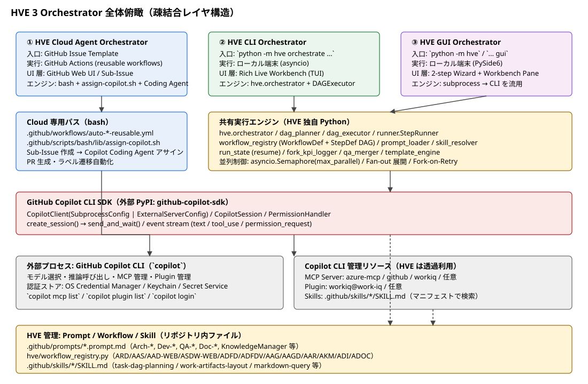
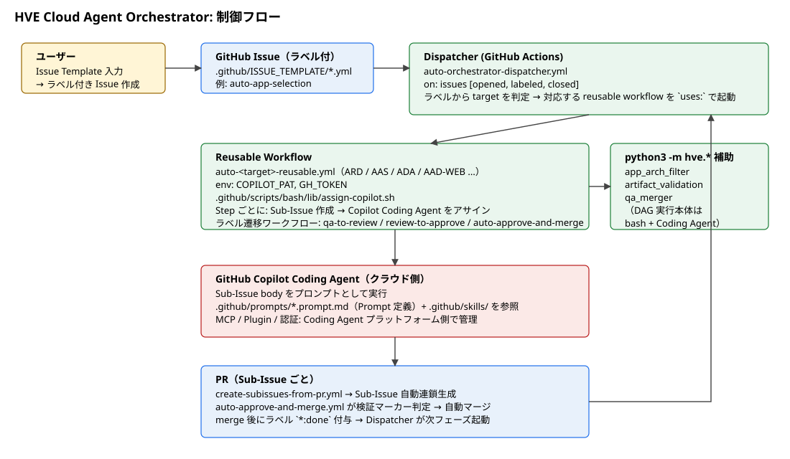
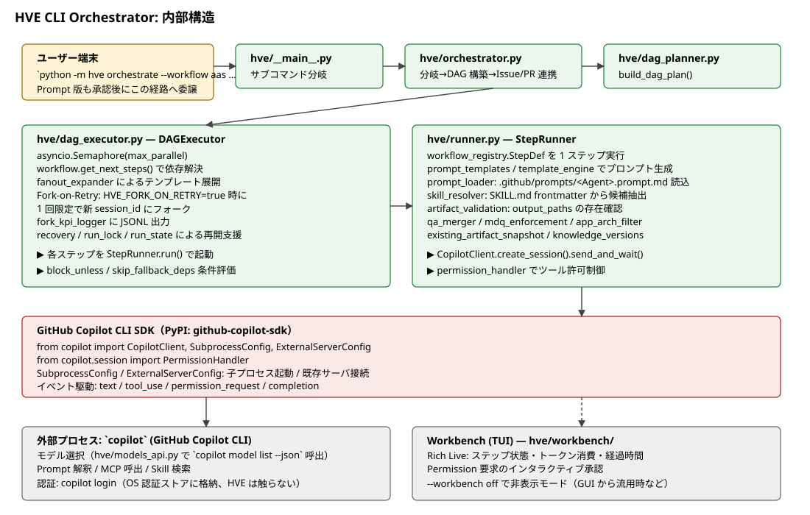
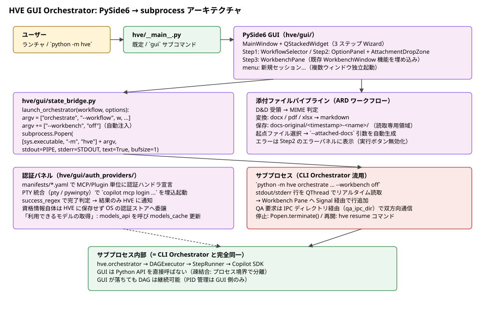
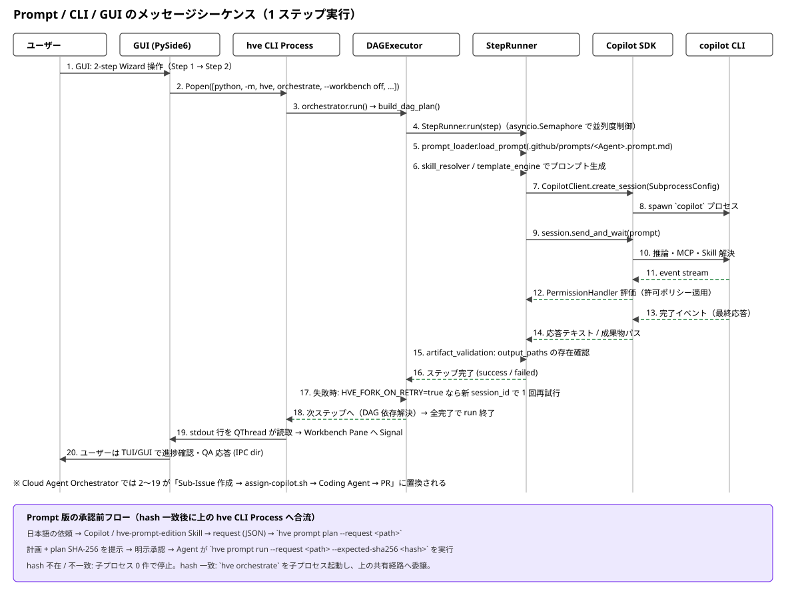
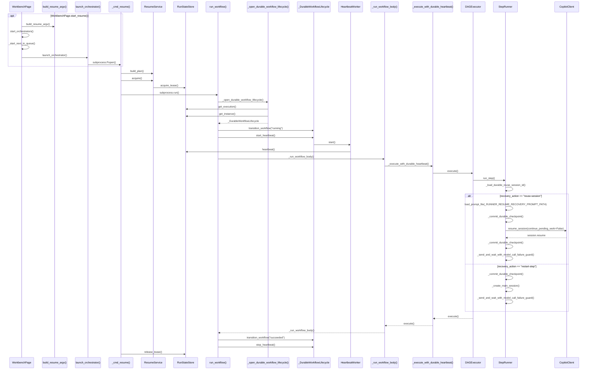
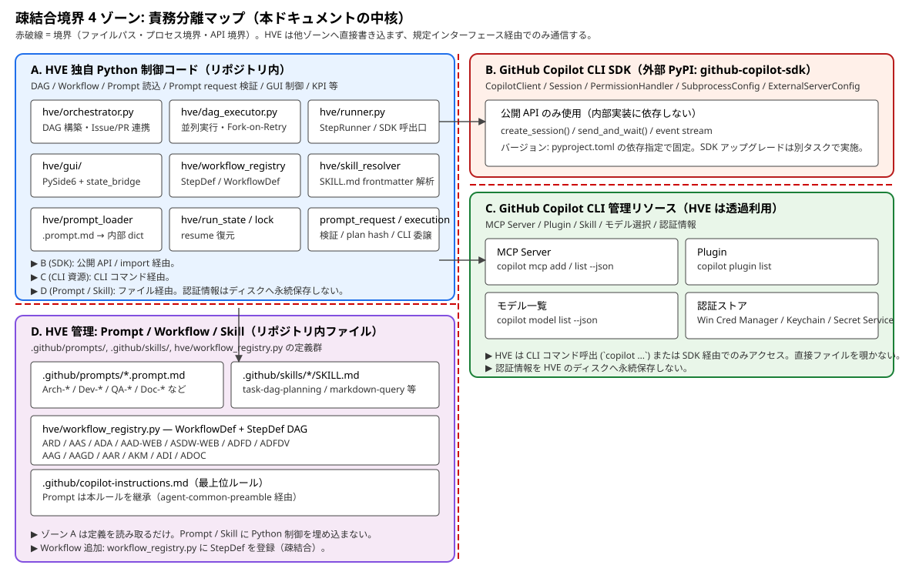
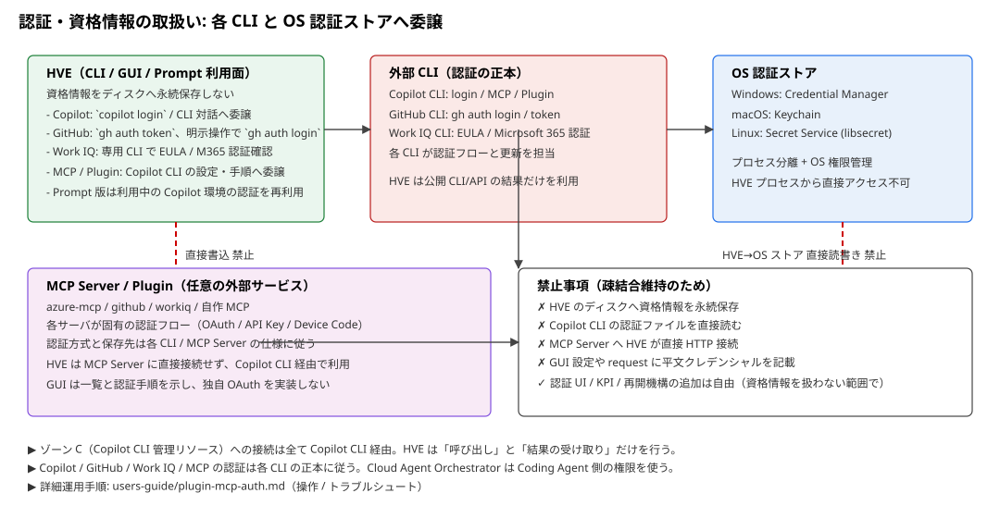

# HVE 技術アーキテクチャ詳細書

← [README](../README.md)

> **Phase 8 付記 (2026-08-07 改訂)**: Custom Agent（`.github/agents/<Name>.agent.md`）と `hve/agent_loader.py` は Phase 2 で廃止済みです。現行実装では、Agent 名は識別子として `StepDef.custom_agent` に残り、Prompt 本文は [`hve/prompt_loader.py`](../hve/prompt_loader.py) が `.github/prompts/<Name>.prompt.md` から読み込み、入出力契約は `.github/io-contracts/<Name>.yaml` が定義します（リポジトリ実体で確認済み。`hve/agent_loader.py` は存在しません）。本書 §3〜§5 のフロー記述はこの構成に更新済みです。最新の規範ルールは `.github/copilot-instructions.md` §5 および `.github/prompts/README.md` を参照してください。

> **位置づけ**: HVE（Hypervelocity Engineering）の **3 つの Orchestrator**（Cloud Agent / CLI / GUI）と、それらへ委譲する **Prompt 利用面**について、最大限詳細な技術アーキテクチャ図・メッセージフロー・解説をまとめた一次資料。
> 操作手順は `users-guide/hve-prompt-getting-started.md`、`users-guide/hve-cli-orchestrator-guide.md` および `users-guide/hve-gui-orchestrator-guide.md` を参照。
>
> **設計の中核思想**: **疎結合**。HVE は以下 4 ゾーンを厳密に分離して開発される。
>
> 1. **A. HVE 独自 Python 制御コード**（リポジトリ内: `hve/` 配下）
> 2. **B. GitHub Copilot CLI SDK**（外部 PyPI: `github-copilot-sdk`）
> 3. **C. GitHub Copilot CLI 管理リソース**（MCP Server / Plugin / Skill / Copilot 関連認証）— CLI が管理し、HVE は **透過的に利用** するのみ
> 4. **D. HVE 管理: Prompt / Workflow / Skill**（リポジトリ内ファイル: `.github/prompts/`, `.github/skills/`, `hve/workflow_registry.py`）
>
> **すべての構成要素・コード行・ファイルパスは実装ファイルに基づく**。推測箇所は明示する。

---

## 目次

- [1. はじめに](#1-はじめに)
- [2. 共通アーキテクチャ（3 Orchestrator + Prompt 利用面）](#2-共通アーキテクチャ3-orchestrator--prompt-利用面)
- [3. HVE Cloud Agent Orchestrator](#3-hve-cloud-agent-orchestrator)
- [4. HVE CLI Orchestrator](#4-hve-cli-orchestrator)
- [5. HVE GUI Orchestrator](#5-hve-gui-orchestrator)
- [6. メッセージフロー（シーケンス図）](#6-メッセージフローシーケンス図)
- [7. 疎結合境界とゾーン責務分離](#7-疎結合境界とゾーン責務分離)
- [8. 認証と資格情報の取扱い](#8-認証と資格情報の取扱い)
- [9. カスタマイズ・拡張ポイント](#9-カスタマイズ拡張ポイント)
- [10. 用語集](#10-用語集)

---

## 1. はじめに

### 1.1 本書の目的

HVE は **Workflow（DAG）** に従って **Prompt** に作業を委譲し、リポジトリの成果物（コード・ドキュメント・テスト・PR）を自動生成するオーケストレーション基盤である。ローカルの CLI / GUI は **GitHub Copilot CLI** を実行エンジンとし、Cloud Agent は GitHub Actions と **GitHub Copilot Coding Agent** の別経路を使う。
本書は HVE の **内部構造** に焦点を当て、3 つの Orchestrator（Cloud Agent / CLI / GUI）と Prompt 利用面が、共通の Workflow / Prompt / Skill 定義を利用しながら実行経路の違いをどう分離しているかを示す。

### 1.2 設計原則

| # | 原則 | 具体的な意味 |
|---|---|---|
| P1 | **疎結合** | 4 ゾーン（A〜D, §7）を相互にプロセス境界・API 境界・ファイル境界で分離。あるゾーンの変更が他ゾーンに波及しないことを最優先する。 |
| P2 | **既存資源の透過利用** | MCP Server / Plugin / Skill / Copilot 関連認証は GitHub Copilot CLI 側の管理機構を上書きしない。GitHub / Work IQ の認証も各 CLI へ委譲し、HVE は公開 CLI / API 経由でのみ操作する。 |
| P3 | **資格情報の非永続化** | 認証情報の本体は各 CLI / OS 認証ストアに委譲する。GitHub REST 用 `GH_TOKEN` は GUI セッションのプロセス環境だけへ橋渡しし、ディスクへ永続保存しない（§8）。 |
| P4 | **ローカル実行エンジンの共通化** | CLI / GUI は同じ Python モジュール群（`hve/runner.py`, `hve/dag_executor.py`）を経由する。Cloud は Actions / Coding Agent の別経路とし、Workflow / Prompt / Skill / I/O 契約を共有する。 |
| P5 | **プロセス境界による分離** | GUI は CLI を Python API ではなく **子プロセス**（`python -m hve orchestrate ...`）として起動する。GUI が落ちても DAG は継続可能、CLI 側を単独で再開できる。 |

### 1.3 用語の前提

- **Orchestrator**: HVE のエントリポイント実装。Cloud / CLI / GUI の 3 種類。
- **Workflow**: DAG として定義された一連のステップ。`hve/workflow_registry.py` で `WorkflowDef` として宣言。
- **Step**: Workflow の最小実行単位。`StepDef`（id, title, custom_agent, depends_on, output_paths 等）で記述。
- **Prompt**: `.github/prompts/**` の Markdown。Copilot Coding Agent / `copilot` CLI に渡される役割定義・実行指示の正本。Agent 本文は flat な `.github/prompts/<Name>.prompt.md`、Step 本文は `steps/`、fan-out 追加本文は `fanout/`、HVE 内部 Prompt は `runtime/`、Cloud 実行指示は `cloud/` に配置する。
- **Skill**: `.github/skills/*/SKILL.md`。手順・コマンド・トラブルシュートを格納する技術リファレンス。
- **SDK**: `github-copilot-sdk`（PyPI）。Python から `copilot` プロセスを起動・制御するための公式 SDK。

---

## 2. 共通アーキテクチャ（3 Orchestrator + Prompt 利用面）



### 2.1 全体構造の説明

CLI / GUI は入口（UI 層）だけが異なり、同じローカル実行エンジンを共有する。Cloud Agent は GitHub Actions / Coding Agent の別経路だが、Workflow / Prompt / Skill / I/O 契約を共通利用する。

| Orchestrator | 入口 | 実行コンテキスト | DAG 実行 | UI 出力 |
|---|---|---|---|---|
| **Cloud Agent** | GitHub Issue Template（ラベル付き Issue 作成） | GitHub Actions ランナー | bash + `assign-copilot.sh` で Sub-Issue を起こし、各 Sub-Issue を **GitHub Copilot Coding Agent** に委譲 | Sub-Issue / PR / ラベル遷移 |
| **CLI** | `python -m hve orchestrate ...` | ユーザー端末（ローカルプロセス） | `hve/dag_executor.py` の `DAGExecutor` が `asyncio.Semaphore` で並列実行、各ステップは `StepRunner` 経由で `copilot` SDK を呼ぶ | Rich Live Workbench（TUI） |
| **GUI** | `python -m hve`（既定）/ `python -m hve gui` | ユーザー端末（PySide6 プロセス + 子プロセス） | GUI から `python -m hve orchestrate ...` を **子プロセス** として起動。実行本体は CLI と完全同一 | PySide6 2-step Wizard + 埋め込み Workbench Pane |

### 2.2 Prompt 版 — Orchestrator へ委譲する利用面

**Orchestrator は 3 つのままである。** Prompt 版は 4 つ目の実行核ではなく、CLI Orchestrator へ委譲する
**利用面（surface）** である。

| 観点 | 内容 |
|---|---|
| 入口 | HVE GUI 内の既存 Copilot CLI タブ / standalone GitHub Copilot CLI / VS Code Copilot Chat |
| 自然言語の解釈 | repository Agent Skill（`.github/skills/hve-prompt-edition/SKILL.md`）。HVE Python 内に LLM parser を持たない |
| HVE Python 側の責務 | request の再検証（schema / registry / allowlist / path policy）、計画組み立て、plan hash、`orchestrate` への委譲のみ |
| 実行核 | 既存の `hve orchestrate`。`DAGExecutor` / `StepRunner` / 各種 gate はそのまま |
| 設定 | GUI が保存した `hve/.settings.txt` を Qt 非依存で読み、`OrchestrateArgs` を組み立てる |
| 承認 | `hve prompt plan` が提示した計画の SHA-256 と一致する場合だけ `hve prompt run` が子プロセスを起動する |
| Cloud | 対象外。GitHub.com からの Prompt request 実行は未対応 |

関連モジュール:

| モジュール | 役割 |
|---|---|
| `hve/prompt_request.py` | request v1 の型・JSON 読込・unknown field 拒否・registry / allowlist 検証 |
| `hve/prompt_execution.py` | 設定 merge、複数 Workflow の計画、canonical JSON と SHA-256、argv による `shell=False` 実行 |
| `hve/input_aliases.py` | canonical → actual の実行時入力別名。安全性検証と単一解決器（`AliasResolver`） |
| `hve/workflow_order.py` | `get_meta_dependencies()` を用いた Qt 非依存の安定ソート。GUI と Prompt 版が共有する |

操作手順は [hve-prompt-getting-started.md](./hve-prompt-getting-started.md) を参照。

### 2.3 共有実行エンジン（ゾーン A）

CLI / GUI が共有するローカル実行エンジンの Python モジュール群を次に示す。Cloud は `DAGExecutor` を使わず、必要な検証・変換モジュールだけを補助 CLI として利用する。

| モジュール | 役割 |
|---|---|
| `hve/orchestrator.py` | エントリポイントから呼ばれる司令塔。DAG 構築 → Issue/PR 連携 → DAG 実行 → 後処理を担う。 |
| `hve/dag_planner.py` | `build_dag_plan()`：`WorkflowDef` を実行可能な DAG に展開（fanout・skip 条件評価）。 |
| `hve/dag_executor.py` | `DAGExecutor`：`asyncio.Semaphore(max_parallel)` 並列・Fork-on-Retry・依存解決。 |
| `hve/runner.py` | `StepRunner`：1 ステップを `CopilotClient.create_session()` → `send_and_wait()` で実行。 |
| `hve/workflow_registry.py` | `WorkflowDef` / `StepDef` 定義の集合体。`_REGISTRY` は 13 ワークフロー（`ard` / `aas` / `ada` / `aad-web` / `asdw-web` / `adfd` / `adfdv` / `aag` / `aagd` / `aar` / `akm` / `adi` / `adoc`）を保持し、`list_workflows()` はその全値を返す。 |
| `hve/prompt_loader.py` | `.github/prompts/` を root として Prompt 本文を読み込む単一実装。`load_prompt_file(relative_path)` が安全な repository-relative path だけを受理し、必須 Prompt の欠損・空・ root 外への escape を model call / SDK session 作成前に fail-closed で拒否する。`load_prompt(agent_name)` は flat Agent 本文用の互換 facade（旧 `hve/agent_loader.py` の後継、Phase 2 で SDK への custom_agents 伝搬は廃止）。 |
| `hve/skill_resolver.py` | `.github/skills/*/SKILL.md` の frontmatter から候補抽出（`skill_manifest.json` を活用）。 |
| `hve/run_state.py` | SDK セッション ID の決定論的生成（`make_session_id`）。fork-on-retry のフォーク用 ID 再構成に使用。 |
| `hve/fork_kpi_logger.py` | Fork-on-Retry の KPI を `work/kpi/fork-kpi-<run_id>.jsonl` に出力。 |

### 2.4 Cloud だけが異なる点

Cloud Agent Orchestrator は **DAG 実行を bash + GitHub Actions reusable workflow に展開** する点が CLI / GUI と本質的に異なる。`python -m hve` の補助呼び出し（`hve.app_arch_filter`, `hve.artifact_validation`, `hve.qa_merger` 等）は使うが、`DAGExecutor` を**直接は使わない**。代わりに各ステップを Sub-Issue として切り出し、ラベル遷移（`qa-to-review`, `review-to-approve`, `auto-approve-and-merge` 等）でフェーズ駆動する。ADI は Issue Template / reusable workflowを持たないlocal専用Workflowであり、このCloud展開の対象外である。詳細は §3。

> **Deploy 検証に関する注意**: CLI / GUI 経路では `enable_auto_merge` 有効時に PR merge 後の check-run 状態を確認するが、Cloud Agent Orchestrator 経路は Sub-Issue / PR / ラベル遷移で駆動されるため、同じ `DAGExecutor` 内の post-merge check-run 待機は実行されない。Cloud 経路で Deploy step の妥当性を確認する場合は、各 Deploy Agent の `ac-verification.md`、PR body の検証マーカー、`auto-approve-and-merge.yml` の check-run / Deploy AC gate、および Sub-Issue の `*:blocked` ラベル有無を確認する。
>
> **Cloud parity**: ASDW-WEB と AAR は `hve/workflow_registry.py` の Step ID と Cloud reusable workflow の生成 Step を parity test で同期する。ADI は local 専用である。

### 2.5 Durable resume 制御面（local standard execution）

Durable resume は、ローカルの CLI / GUI / Prompt 利用面から開始した `standard` 実行について、プロセス終了後も Workflow / Step / Copilot Main session の制御状態を復元する仕組みである。Cloud Agent、Fleet mode、Cloud Session、dry-run、および legacy の `--resume-run` はこの制御面に含めない。`--resume-run` は同一 run の成功済み Step を進捗記録から除外する旧機能であり、SQLite の lease / fencing / SDK session 回復を行う durable resume とは別物である。

#### 2.5.1 実装境界

| 実装 | Durable resume での責務 |
|---|---|
| [`hve/run_state_store.py`](../hve/run_state_store.py) の `RunStateStore` | SQLite schema、状態遷移、`LeaseToken`、CAS、fencing、heartbeat を所有する。 |
| [`hve/resume_service.py`](../hve/resume_service.py) の `ResumeService` | repository scope、永続化可能な replay 引数、候補列挙、成果物 reconciliation、承認対象 `ResumePlan` を共有実装として提供する。 |
| [`hve/__main__.py`](../hve/__main__.py) の `_register_standard_execution()` / `_cmd_resume()` | CLI 実行の事前登録と、plan 提示・承認・再検証・lease 取得・再開子プロセス起動を行う。 |
| [`hve/prompt_execution.py`](../hve/prompt_execution.py) の `_register_durable_execution()` / `run_plan()` | `ExecutionPlan.sha256` 承認後、複数 Workflow を `ordinal` 順で最初の子プロセスより前に一括登録する。 |
| [`hve/orchestrator.py`](../hve/orchestrator.py) の `_open_durable_workflow_lifecycle()` / `_DurableWorkflowLifecycle` / `run_workflow()` | 新規実行の登録または親 lease の採用、Workflow / Step 遷移、heartbeat、終了時の `succeeded` / `failed` / `suspended` 確定を担う。 |
| [`hve/orchestrator_context.py`](../hve/orchestrator_context.py) の `OrchestratorContext` | `execution_id` / `instance_id` / `expected_state_version` / recovery action / lease fencing identity を Runner まで伝播する。 |
| [`hve/runner.py`](../hve/runner.py) の `StepRunner` | phase と SDK `session_id` を `_commit_durable_checkpoint()` で保存し、Main session の再利用または Step 再実行を行う。 |
| [`hve/gui/page_workbench.py`](../hve/gui/page_workbench.py) と [`hve/gui/state_bridge.py`](../hve/gui/state_bridge.py) | `WorkbenchPage.start_resume()` → `build_resume_argv()` → `launch_orchestrator()` で public `resume` CLI へ委譲し、GUI 内に復旧ポリシーを複製しない。 |

#### 2.5.2 永続状態と識別子

`default_state_path()` は `user_state_path("hve", appauthor=False) / "state.sqlite3"` を返す。DB は repository 配下ではなく OS のユーザー状態ディレクトリに置かれ、schema version 1 の次の 3 table だけを持つ。

| table | 主な内容 |
|---|---|
| `executions` | `execution_id`、raw path を保持しない `repo_key`、起動 surface、`launch_plan_hash`、sanitized plan |
| `workflow_instances` | `instance_id`、`workflow_id`、`ordinal`、status、`state_version`、`current_run_id`、`attempt_no`、lease / heartbeat |
| `step_instances` | `step_id`、record kind、status、phase / phase state、SDK `session_id`、最後の例外型 |

`RunStateStore` は `journal_mode=DELETE`、`synchronous=EXTRA`、`foreign_keys=ON`、`trusted_schema=OFF` を必須とし、table・column・foreign key の完全一致と `PRAGMA quick_check` を open 時に検証する。未知 schema、余分な object、破損 DB は移行・再作成で上書きせず `DurableStateError` で fail-closed に停止する。

| 識別子 | 意味 |
|---|---|
| `execution_id` | 1 回の論理的な起動計画。Prompt 版では順序付きの複数 Workflow をまとめる。 |
| `instance_id` / `ordinal` | execution 内の Workflow instance と実行順。最初の未完了 instance だけを再開対象にする。 |
| `run_id` / `attempt_no` | 今回の実行成果・観測を識別する ID と、lease 取得ごとに増える試行番号。resume しても `execution_id` と同一概念ではない。 |
| `state_version` | Workflow / Step checkpoint ごとに増える optimistic CAS version。承認後に状態が変わった plan を拒否する。 |
| `repo_key` | `compute_repo_key()` が canonical repository root を SHA-256 化した scope。raw repository path は保存しない。 |
| `LeaseToken.owner` / `LeaseToken.generation` | 現 owner と takeover 世代を表す fencing identity。古い process の状態更新を拒否する。 |

#### 2.5.3 登録・計画・承認

1. 通常 CLI は `_register_standard_execution()`、Prompt 版は `_register_durable_execution()` で、外部処理を開始する前に ordered descriptor を `ResumeService.register_execution()` へ渡す。直接 `run_workflow()` を呼ぶ対応経路も `_open_durable_workflow_lifecycle()` で同じ登録契約を使う。
2. `ResumeService.sanitize_argv()` は固定 allowlist の識別子・数値・enum・boolean だけを保存する。自由記述、任意 path、endpoint、credential、MCP/tool payload は値を保存せず `missing_replay_keys` の key 名だけを残し、1 回の resume 入力として再供給させる。
3. `ResumeService.list_candidates()` は現在の `repo_key` に属する未完了 execution だけを返す。`ResumeService.build_plan()` は最初の未完了 `ordinal` を選び、HEAD drift、active owner、失敗・非 terminal 状態、replay 値不足、成果物不足、SDK Main checkpoint 不足を risk として確定する。
4. `reconcile_succeeded_steps()` は保存済み `succeeded` を無条件に信用しない。宣言済み `output_paths` が欠けた Step と、その Step に依存する下流 Step を実行対象へ戻す。
5. `ResumePlan.resume_plan_hash` は execution / instance の state snapshot、action、現在 HEAD、risk、safe argv、再入力値の **hash** から canonical JSON で計算する。`_cmd_resume()` は plan を提示した後に再構築して hash を照合し、`ResumeService.acquire()` は `expected_state_version` を再照合する。どちらかが変われば stale plan として子プロセスを起動しない。
6. 親 `_cmd_resume()` は `ResumeService.acquire()` で lease を取得し、`execution_id` / `instance_id` / `expected_state_version` / `recovery_action` / lease owner・generation を hidden 引数で子 `orchestrate` へ渡す。子は lease を再取得せず `_open_durable_workflow_lifecycle()` で同じ fencing identity を採用する。子の終了コードが 0 でも DB status が `succeeded` でなければ成功扱いにしない。

Prompt 版の `ExecutionPlan.sha256` は「自然言語 request から組み立てた起動計画」の承認 hash、`ResumePlan.resume_plan_hash` は「その時点の durable state から組み立てた復旧計画」の承認 hash であり、用途を混同しない。

#### 2.5.4 Lease、CAS、heartbeat

- `RunStateStore` の書き込みは `BEGIN IMMEDIATE` を使い、状態遷移は `state_version`、lease 更新は owner / generation を条件にする。active lease の二重取得は禁止し、期限切れ lease の takeover にも明示的な recovery action が必要である。
- `HEARTBEAT_INTERVAL_SECONDS = 5.0`、`LEASE_TTL_SECONDS = 20.0` である。`HeartbeatWorker` は専用 thread・専用 `RunStateStore` connection から heartbeat と lease expiry を更新する。hard-kill acceptance で確認する 10 秒以内の heartbeat freshness は観測基準であり、takeover を許す 20 秒の lease TTL とは別である。
- `_execute_with_durable_heartbeat()` は `DAGExecutor.execute()` と heartbeat failure signal を race させる。heartbeat が fenced、DB が利用不能、または worker が失敗した場合は executor を停止し、`run_workflow()` は可能な限り Workflow を `suspended` に遷移させる。通常例外は `failed`、正常終了は結果に対応する terminal status へ遷移する。
- `_DurableWorkflowLifecycle.attach_runner()` は `StepRunner` が checkpoint ごとに受け取る新しい `state_version` を heartbeat 側の token にも同期する。これにより古い version の heartbeat が正しい実行を自己 fencing しない。

#### 2.5.5 Main session 回復

| action | Runner の動作 |
|---|---|
| `reuse-session` | `StepRunner._load_durable_reuse_session_id()` が選択 Step の `phase="main"` checkpoint だけを受理する。`_commit_durable_checkpoint()` 後に `client.resume_session(session_id, continue_pending_work=False)` を呼び、`session.resume` event を期限内に必須とする。`already_in_use` または `session_was_active` は競合として拒否する。 |
| `restart-step` | 保存済み SDK session ID を使わず、現在 attempt の決定論的な新規 ID で `_create_main_session()` を通る。成果物 reconciliation で戻された Step もこの実行対象に含まれる。 |

`reuse-session` は元の自由記述 Prompt を state DB から再構築しない。[`runtime/runner/resume-recovery.prompt.md`](../.github/prompts/runtime/runner/resume-recovery.prompt.md) を `_RUNNER_RESUME_RECOVERY_PROMPT_PATH` から読み、復旧専用の新しい turn として `_send_and_wait_with_model_call_failure_guard()` へ渡す。resume RPC の直前と送信直前に `_commit_durable_checkpoint()` を行う。`resume_session()`、`session.resume` event、active-session 検査のいずれかが失敗しても `create_session()` へ暗黙 fallback しない。

#### 2.5.6 Security と保証の境界

- 永続化境界は fixed allowlist であり、secret token / credential assignment、URL、absolute path、JSON-like payload、自由記述 Prompt を `reject_sensitive_persisted_text()` と `sanitize_argv()` で拒否または key-only 化する。再入力値は `ResumePlan` では hash のみを承認対象にし、DB へ保存しない。
- Lease / CAS / fencing が保証するのは **HVE control state の単一 owner と stale writer 排除**である。GitHub、Azure、MCP Server、ファイルシステム等で既に完了した外部副作用を exactly-once に変換するものではない。再開可能な Step は外部 resource の照合と冪等操作を自身の契約として持つ必要がある。
- GUI は `ResumeService` の判断を複製せず、`WorkbenchPage.start_resume()` から public `_cmd_resume()` を起動する。CLI / GUI / Prompt のどの入口でも、最終的な plan、reconciliation、lease、SDK 回復ポリシーは同じ実装を通る。

---

## 3. HVE Cloud Agent Orchestrator



### 3.1 制御フロー

1. **Issue 作成**: ユーザーが `.github/ISSUE_TEMPLATE/*.yml` から Issue を起こす。フォーム送信時に対応するワークフローラベル（例: `auto-app-selection`, `auto-app-detail-design-web`）が自動付与される。
2. **Dispatcher 起動**: `.github/workflows/auto-orchestrator-dispatcher.yml` が `on: issues [opened, labeled, closed]` で発火。ラベルから `target` を判定し、対応する **reusable workflow** を `uses:` で呼び出す。
3. **Reusable Workflow 実行**: `auto-<target>-reusable.yml`（ARD / AAS / ADA / AAD-WEB / ASDW-WEB / ADFD / ADFDV / AAG / AAGD / AAR / AKM / ADOC）が実行される。共通処理として:
   - `env: COPILOT_PAT` を設定（Coding Agent アサインに必要な PAT）。
   - `.github/scripts/bash/lib/assign-copilot.sh` を source して `assign_copilot` 関数を読み込む。
   - ワークフローごとに定義された **Step 群** を順次処理し、各ステップで以下を実施：
     - Sub-Issue を作成（タイトル・body はテンプレートから生成）
     - `assign_copilot` で当該 Sub-Issue を **GitHub Copilot Coding Agent** にアサイン
4. **Coding Agent 実行**: Coding Agent はクラウド側で Sub-Issue body をプロンプトとして読み、`.github/prompts/*.prompt.md`（Prompt 定義）と `.github/skills/`（Skills）を参照しながら作業し、PR を提出する。
5. **PR → Sub-Issue 連鎖**: `.github/workflows/create-subissues-from-pr.yml` が PR の本文を解析し、必要に応じて次の Sub-Issue を自動生成する。
6. **自動マージ**: `.github/workflows/auto-approve-and-merge.yml` が PR body の **検証マーカー**（`<!-- validation-confirmed -->`, `## 検証`, `**検証**:` 等）を判定し、マージ可能と判断すれば自動承認・マージする。マージ後は `*:done` ラベルが付与され、Dispatcher が次フェーズを起動する。

### 3.2 Cloud 専用の Python 補助呼び出し

bash 側からは以下の `python -m hve.*` を CLI として呼び出し、必要な計算・検証のみ行う：

| 呼び出し | 用途 |
|---|---|
| `python3 -m hve.app_arch_filter` | アプリカタログから APP-ID に紐付くサービス/エンティティを抽出（`auto-app-detail-design-web-reusable.yml` 597 行付近で利用）。 |
| `python3 -m hve.artifact_validation` | output_paths の存在確認・形式検証。 |
| `python3 -m hve.qa_merger` | 事前 QA 質問票のマージ・回答収集。 |

> 重要: **Cloud の DAG 実行は bash + GitHub Actions の `uses:` 連鎖が実体**である。`hve.orchestrator` Python API は Cloud 側からは呼ばない。これは「GitHub Actions のスケジューラ・ラベル遷移・PR レビュー機構」を最大限活用するため。

### 3.3 認証

- `COPILOT_PAT`: Coding Agent アサインに必要な GitHub Personal Access Token。GitHub Repository / Organization の Secrets に保存。
- 未設定時は reusable workflow が「WARNING: COPILOT_PAT が設定されていません。Copilot アサインは全てスキップされます。」を出力してアサイン処理だけスキップ（他処理は継続）。
- Coding Agent 側の認証（MCP / Plugin）は GitHub Copilot プラットフォーム側で管理され、HVE リポジトリは関知しない。

---

## 4. HVE CLI Orchestrator



### 4.1 起動シーケンス

1. ユーザーが端末で `python -m hve orchestrate --workflow <id> [options...]` を実行。
2. `hve/__main__.py` のサブコマンド分岐で `orchestrate` を選択 → `hve/orchestrator.py:run_orchestrate()` を呼ぶ。
3. `orchestrator.py` の処理：
   - 引数バリデーション
   - `hve/dag_planner.py:build_dag_plan(workflow, options)` で DAG を構築（fanout 展開・skip 条件評価）
   - 必要なら新規ブランチ作成・Issue 作成
   - `hve/dag_executor.py:DAGExecutor.run()` を呼ぶ
4. `DAGExecutor.run()` の動作：
   - `workflow.get_next_steps()` で実行可能なステップ集合を取得
   - `asyncio.Semaphore(max_parallel)` で並列実行を制御
   - 各ステップは `StepRunner.run(step)` を `asyncio.create_task` で起動
   - 失敗時：`HVE_FORK_ON_RETRY=true` なら **1 回限定** で新 session_id（フォーク）でリトライ。`fork_kpi_logger` に JSONL 出力。
   - 全完了後にコミット・push・PR 作成

### 4.2 StepRunner の内部

`hve/runner.py` の `StepRunner` は **1 ステップ = 1 Copilot セッション** という対応関係を維持する：

1. `workflow_registry.StepDef` から実行情報を取得（custom_agent, output_paths, depends_on 等）
2. `prompt_loader.load_prompt(custom_agent)` で `.github/prompts/<custom_agent>.prompt.md` から Agent の Prompt 本文を読み込み（`hve/runner.py` の `from .prompt_loader import load_prompt` 参照。旧 `agent_loader.load(...)` は Phase 2 で廃止）
3. `skill_resolver` で関連 Skill 候補を抽出（マニフェスト経由）
4. `template_engine`（`.github/prompts/steps/` の Step 本文と `.github/prompts/fanout/` の追加本文を `prompt_loader` 経由で読む）と `prompts` の PROMPT 定数（`.github/prompts/runtime/` を読む互換 facade）でプロンプトを組み立て
5. `from copilot import CopilotClient, SubprocessConfig, ExternalServerConfig` および `from copilot.session import PermissionHandler`（`hve/runner.py` 2336 行付近）
6. `CopilotClient(SubprocessConfig(...))` または `CopilotClient(ExternalServerConfig(...))` を生成
7. `session = await client.create_session(...)` で Copilot セッション開始
8. `response = await session.send_and_wait(prompt)` で同期実行
9. ストリーム中の `permission_request` イベントは `PermissionHandler` でポリシー判定
10. 終了後 `artifact_validation` で `output_paths` の存在を確認
11. `mdq_enforcement` / `app_arch_filter` / `qa_merger` 等の後処理を必要に応じて実施
12. 成功/失敗を `DAGExecutor` に返す

### 4.3 並列実行・Fork-on-Retry の詳細

- **並列度**: `--max-parallel`（既定 15）で `asyncio.Semaphore` のサイズを指定。
- **DAG パターン**: sequential / fork / AND join / skip fallback（条件不一致時にスキップ）。
- **Fork-on-Retry**: 環境変数 `HVE_FORK_ON_RETRY=true` で有効化。非コンテナステップが失敗した時に **1 回だけ** 新 session_id を発行してフォーク再試行する。`tdd_max_retries`（TDD GREEN フェーズの再試行）とは独立。
- **KPI**: `work/kpi/fork-kpi-<run_id>.jsonl` に `timestamp / run_id / step_id / session_id / forked_session_id / success / retry_count / elapsed_seconds / tokens / fork_on_retry_enabled` を記録。

> CLI 操作手順は [hve-cli-orchestrator-guide.md](./hve-cli-orchestrator-guide.md) 参照。

### 4.4 SDK 連携の詳細

`github-copilot-sdk`（PyPI）が提供する公開 API のみを利用する：

| クラス | 役割 | HVE での用途 |
|---|---|---|
| `CopilotClient` | Copilot プロセスへの接続管理 | StepRunner の主たる窓口 |
| `SubprocessConfig` | ローカル `copilot` バイナリを子プロセス起動 | 既定 |
| `ExternalServerConfig` | 既存 Copilot サーバへ接続（再利用） | 共有モード（実験的） |
| `PermissionHandler` | ツール実行許可ポリシーの注入 | HVE の許可ポリシー（例: 安全ガード）を適用 |

イベント駆動：`text` / `tool_use` / `permission_request` / `completion` の 4 種類を `async for` で受け取り、StepRunner が分岐処理する。

### 4.5 Workbench（TUI）

- `hve/workbench/` 配下の Rich Live UI。
- ステップ状態（pending / running / done / failed）、トークン消費、経過時間をリアルタイム表示。
- `permission_request` イベント発生時はインタラクティブに承認待ち。
- `--workbench off` で非表示モード（GUI から子プロセス起動する際に自動付与）。

---

## 5. HVE GUI Orchestrator



> **実装現況メモ**: §5.2〜§5.13 は GUI の **設計仕様**（旧 `hve-gui-orchestrator-design.md` を統合）を記述する。現行 `hve/gui/` 配下には以下 2 系統の UI 実装が並存しており、本書の構造記述は設計意図を示すものとして読むこと。
>
> - `hve/gui/wizard.py`: `QWizard` ベースの 3 ページ（`_WorkflowSelectPage` → `_OptionsPage` → `_ConfirmPage`）。
> - `hve/gui/main_window.py`: `QMainWindow` + `QStackedWidget`。main stack は Workflow と Workbench の 2 ページだけで、`_workbench_stack` は撤去済み。`page_intro.py` 等の追加ページは main stack へ登録されていない。
>
> 細部の差異（ページ構成・遷移ロジック）は実装ファイルを正とすること。

### 5.1 設計原則（GUI 固有）

| # | 原則 | 意味 |
|---|---|---|
| G1 | UI 層のみ追加・既存コードに干渉しない | `hve/__main__.py` の `orchestrate` パーサ・`hve/orchestrator.py` には一切変更を加えない。新規 `hve/gui/` パッケージ内で完結。 |
| G2 | 実行は別プロセス | GUI から `python -m hve orchestrate ...` を `subprocess.Popen` で fork。Python API レベルで `hve.orchestrator` を直接呼ばない。 |
| G3 | オプション網羅 | `orchestrate` が受け付ける **80 以上のオプション** を全てカテゴリ分けして GUI から指定可能にする。 |

### 5.2 2 ステップ Wizard

```
┌─────────────────────────────────────────────────────────────┐
│ HVE GUI Orchestrator — Session #1                       _□× │
├─────────────────────────────────────────────────────────────┤
│ ＜メイン：QStackedWidget（現在のステップに応じて切替）＞    │
│  Step 1: ワークフロー一覧 + オプション設定                  │
│           （RadioButton + 説明 + アコーディオン）           │
│  Step 2: Workbench (ログ + ユーザーアクション)              │
├─────────────────────────────────────────────────────────────┤
│ [戻る]                                       [次へ] / [実行] │
└─────────────────────────────────────────────────────────────┘
```

ウィジェット階層：

```
QMainWindow (MainWindow)
└── QWidget (central)
    └── QVBoxLayout
        ├── QStackedWidget (mainStack)
        │   ├── WorkflowSelectPage (Step 1: 左ペイン=ワークフロー選択 / 右ペイン=OptionsPage)
        │   │   └── ARD 選択時は C14 セクションに添付 D&D ウィジェットを動的追加
        │   └── WorkbenchPage (Step 2: 実行)
        └── NavigationBar (QWidget) ············ [戻る] / [次へ] / [実行] / [停止]
```

### 5.3 Step 1: ワークフロー選択

- `hve.workflow_registry.list_workflows()` から `WorkflowDef` を動的取得。
- ラジオボタンで選択 → 右ペインのオプションが `ard` の場合は ARD 用、それ以外は汎用に切り替わる（同一画面・Step 1 の右ペイン）。
- 説明文は `_WORKFLOW_DESCRIPTIONS` 辞書を `hve/gui/page_workflow_select.py` 内に定義（`hve/__main__.py` の `--workflow` add_argument の help テキストを参照）。
- 表示名は `WorkflowDef.name` を正とする（help テキストの表記とは異なる場合あり）。

### 5.4 オプションのカテゴリー ID（設定互換用の内部識別子）

下表は **設定の互換性とテスト識別子を安定させるためのカテゴリー ID 対応表** であり、現行 UI の画面構成を表す正本ではない。カテゴリーの根拠は `hve/__main__.py` の `add_argument(...)` 呼び出しに付随するコメントセクション。

現行 UI の実態は次のとおりで、本表とは別構成である。

- 設定画面（`SettingsWindow`）のツリーは固定 13 ノードと `skills` グループ 3 ノードの計 16 ノード。
- Step 1 右ペイン（`OptionsPage`）は非表示カテゴリーを直接並べず、選択ワークフローに応じて C3 の一部とワークフロー固有の入力欄を再配置する。

画面側の正確な構成は [hve-gui-orchestrator-guide.md](./hve-gui-orchestrator-guide.md) を参照すること。

`orchestrate` のオプション群とカテゴリー ID の対応は次のとおり。

| # | カテゴリ | 主要オプション | 区分 |
|---|---|---|---|
| C1 | 基本設定 | `--workflow`, `--model`, `--review-model`, `--qa-model` | 共通 |
| C2 | 並列実行 | `--max-parallel` | 共通 |
| C3 | 共通設定 | `--auto-qa`, `--qa-akm-background-merge`, `--force-interactive`, `--auto-contents-review`, `--auto-coding-agent-review`, `--auto-coding-agent-review-auto-approval` | 共通 |
| C4 | Work IQ | `--workiq`, `--workiq-akm-review`, `--workiq-akm-ingest`, `--workiq-dxx`, `--workiq-draft`, `--workiq-draft-output-dir`, `--workiq-tenant-id`, `--workiq-prompt-qa`, `--workiq-prompt-km`, `--workiq-prompt-review`, `--workiq-per-question-timeout`, `--workiq-request-timeout` | **CLI 固有**（Issue Template に存在しないことを確認済み: `grep -i workiq` で 0 件） |
| C5 | Issue / PR 作成 | `--create-issues`, `--create-pr`, `--ignore-paths`, `--repo`, `--issue-title` | 共通 |
| C6 | 出力制御 | `--verbose`, `--quiet`, `--verbosity`, `--show-stream`, `--log-level`, `--no-color`, `--banner`, `--screen-reader`, `--timestamp-style`, `--final-only` | **CLI 固有**（`hve/__main__.py` に定義あり／`.github/ISSUE_TEMPLATE/` に対応入力なしを確認済み） |
| C7 | MCP / CLI 接続 | `--mcp-config`, `--cli-path`, `--cli-url` | **CLI 固有**（同上の方法で確認済み） |
| C8 | タイムアウト | `--timeout`, `--review-timeout` | 共通 |
| C9 | ブランチ / ステップ選択 | `--branch`, `--steps` | 共通 |
| C10 | アプリ ID | `--app-id`, `--app-ids`, `--resource-group`, `--app-id`, `--usecase-id` | 共通（aas / aad-web / asdw-web / adfd / adfdv 選択時のみ） |
| C11 | Knowledge Management 固有 | `--sources`, `--target-files`, `--force-refresh`, `--custom-source-dir`, `--enable-auto-merge` | akm 選択時のみ |
| C13 | ADOC 固有 | `--target-dirs`, `--exclude-patterns`, `--doc-purpose`, `--max-file-lines` | adoc 選択時のみ |
| C14 | ARD 固有 | `--company-name`, `--target-business`, `--survey-base-date`, `--survey-period-years`, `--target-region`, `--analysis-purpose`, `--target-recommendation-id`, `--attached-docs` | ard 選択時のみ。`--attached-docs` は §5.5 で D&D 拡張 |
| C15 | 追加プロンプト / コメント | `--additional-prompt`, `--context-max-chars`, `--additional-comment` | 共通 |
| C16 | 実行制御 / 拡張機能 | `--dry-run`, `--self-improve`, `--no-self-improve` | `--dry-run` は **CLI 固有**（`.github/ISSUE_TEMPLATE/` に対応入力なし）。`--self-improve` / `--no-self-improve` は Issue Template の `enable_self_improve` と同等の設定を CLI から指定するもの（`app-architecture-design.yml` 等 8 テンプレートに対応入力あり） |
| C17 | ADI 固有 | `--purpose`, `--target-scope`, `--depth`, `--focus-areas` | adi 選択時のみ |

> C12は廃止済みカテゴリの番号であり、設定互換性とテスト識別子を安定させるため欠番のまま保持する。ADOCはC13、ADIはC17であり、繰り上げない。

入力検証ルール：

- **必須項目（ARD）**: `--company-name` は Step 1 (Untargeted) 実行時に必須。`--target-business` 指定時は Step 1 をスキップ可能（`hve/__main__.py` の `--company-name` / `--target-business` add_argument 参照）。
- ファイルパス系はファイルダイアログから選択可。
- `--max-parallel` / `--timeout` は QSpinBox / QDoubleSpinBox。
- `--workiq-akm-review`, `--workiq-akm-ingest`, `--banner`, `--force-refresh` は `argparse.BooleanOptionalAction` で **ON / OFF / 未指定の 3 状態** → `QComboBox`（"継承（未指定）" / "明示 ON" / "明示 OFF"）で表現。
- **GitHub startup preflight の単一実装**: `hve/startup_preflight.py` の `github_write_required()` と `validate_startup_configuration()` が、CLI 非対話 / CLI wizard / GUI Plan / GUI・CLI Autopilot に共通する FR-CLI-82 の責務を持つ。各起動面で GitHub 書き込み対象の判定や repo / token / branch / remote の検査を複製しない。
  - GitHub 書き込みを必要としない実行は検査対象外とし、token や remote 接続を要求しない。Prompt 自由記述欄も入力として渡さず、内容を検査しない。
  - GUI Step 1 は `hve/autopilot/precheck_runner.py` の `run_step1_precheck()` から共通実装を `check_remote=False` で呼び、repo の `owner/repo` 形式・token の有無・ベースブランチ名の Git branch 形式だけを UI thread で判定する。結果は `SETTING` / `AUTH` に写像し、起動引数の組み立てが `ValueError` なら入力エラーを表示して Step 1 に留まる。
  - GUI が起動する `hve orchestrate` 子プロセスは active step 解決後に同じ実装を `check_remote=True` で呼び、`origin` と完全一致する `refs/heads/<base_branch>` を、モデル呼び出し・ブランチ作成・DAG 構築より前に検査する。不在・検証不能は fail-closed とし、`main`、ローカルブランチ、GitHub の既定ブランチへ補正しない。

### 5.5 Step 1（ARD オプション）: 添付ファイル D&D 取り込み

CLI の `--attached-docs` は既存ファイルパスのカンマ区切り指定（`hve/__main__.py` の `--attached-docs` add_argument 参照）。GUI ではユーザーが任意形式のファイルを D&D で取り込み、自動 Markdown 変換 → `docs/attached/` 配置 → `--attached-docs` 引数の自動生成までを行う。

**ファイル変換パイプライン**：

| 拡張子 | 変換方式 | 必要ライブラリ |
|---|---|---|
| `.md` / `.markdown` | そのままコピー | 標準ライブラリ |
| `.txt` | コードブロック付き Markdown 化 | 標準ライブラリ |
| `.csv` | Markdown 表へ変換 | 標準ライブラリ |
| `.pdf` / `.docx` / `.xlsx` / `.xls` / `.pptx` / `.html` / `.htm` | [microsoft/markitdown](https://github.com/microsoft/markitdown) で Markdown 化 | `markitdown[all]>=0.1.5`（`gui-docconvert` extras） |
| その他 | エラーダイアログ + スキップ | — |

**保存先**: `<repo>/docs/attached/<name>.md`。

**起点ファイル選択**:
- ARD ワークフローは Step 2 で `docs/business-requirement.md` を自動生成・上書きするため（`workflow_registry.py` の ARD Step 2 `output_paths` 参照）、ユーザー D&D の起点ファイルは別名 `docs/attached/business-requirement-input.md` で保存し、`--target-business` にパスを渡す。
- 2 個以上の D&D 時はダイアログで起点 1 つを選択させる。

**引数自動生成例**：

```
python -m hve orchestrate --workflow ard \
  --company-name "ACME" \
  --target-business "docs/attached/business-requirement-input.md" \
  --attached-docs "docs/attached/business-requirement-input.md,docs/attached/market-survey.md,docs/attached/memo.md"
```

**エラー処理**：

| エラー | 対応 |
|---|---|
| 変換ライブラリ未インストール | ダイアログで「`hve/setup-hve.ps1` または `hve/setup-hve.sh` をオプション無しで実行してください」表示。該当ファイルをスキップ。 |
| ファイル読み取り失敗 | エラーダイアログ + リスト上で赤マーク表示。続行可能。 |
| 100MB 超ファイル | 警告「変換に時間がかかる可能性があります。続行しますか?」 |
| `docs/` 書き込み失敗 | エラー表示 → Step 2 (Workbench) への遷移をブロック。 |

### 5.6 Step 2: Workbench（実行）

```
┌──────────────────────────────────────────────┐
│ Step 2: 実行 (ard, run_id=auto)                              │

│ ┌─ ログ出力 ──────────────────────────────────── [📋] ──┐    │
│ │ [2026-05-14 10:00:00] Step 1 started...               │    │
│ └────────────────────────────────────────────────────────┘    │
│ ┌─ ユーザーアクション ──────────────────────────── [📋] ──┐  │
│ │ - QA 質問が 3 件あります → docs/qa/ard-step1.md         │  │
│ └────────────────────────────────────────────────────────┘  │
│ [停止]                                                       │
└─────────────────────────────────────────────────────────────┘
```

- Step 2 で生成した `argv` を `launch_orchestrator(argv)` に渡す。
- **`--workbench off` を強制注入**（GUI 側で再描画するため、TUI Workbench を抑止）。
- `subprocess.Popen([sys.executable, "-m", "hve"] + argv, stdin=DEVNULL, stdout=PIPE, stderr=STDOUT, text=True, bufsize=1)` で起動。
  - `stdin=DEVNULL` は FR-GUI-23 による。GUI には子プロセスへ入力を送る経路が無いため、端末の標準入力を継承させると CLI 側の対話プロンプト（認証 preflight 等）で応答不能のまま停止する。
- `SubprocessReader(QThread)` で stdout を読み取り、`_LogPane.append_line()` に流す（Signal/Slot）。
- 「停止」: `SIGTERM` → 10 秒待っても終わらなければ `kill()`。Windows は `terminate()` がハードキル相当。

### 5.7 QA 回答モード（GUI 経由 IPC）

`--auto-qa` 有効時に Step 2 で「ユーザー回答」モードを選択すると、CLI と GUI 間でファイルベース IPC を行う。

| ファイル | 方向 | 内容 |
|---|---|---|
| `<step_id>.questionnaire.md` | CLI → GUI | 質問票本体（`QAMerger.render_merged` 出力） |
| `<step_id>.request.json` | CLI → GUI | `{schema_version, step_id, pid, created_at, questionnaire_path, qa_input_timeout_seconds}` |
| `<step_id>.answers.md` | GUI → CLI | "番号: ラベル" 形式（`QAMerger.parse_answers` 入力。空文字 = 既定値全採用） |
| `<step_id>.cancel` | GUI → CLI | 空ファイル（生成されると CLI 側で `RuntimeError`） |

- **IPC ディレクトリ**: `<repo_root>/.hve/qa-ipc/gui-<uuid>/`（GUI 起動時に `tempfile.mkdtemp`、終了時に削除）
- **CLI フラグ**: `--qa-answer-mode={autopilot|gui-file}` / `--qa-ipc-dir=PATH`
- **原子性**: 全て `tmp + os.replace()` でアトミック書き込み
- **監視（GUI 側）**: `QFileSystemWatcher` + `QTimer`（1 秒間隔）で取りこぼし対策
- **タイムアウト**: 既定 `qa_gui_input_timeout_seconds = 3600.0` 秒。到達時は既定値全採用 + WARNING

### 5.8 複数セッションの同時起動

- メニュー「セッション」→「新規セッション」で別 `MainWindow` を生成。
- 各ウィンドウは独立した `subprocess.Popen` を持つため、セッション間の干渉はなし。
- タイトル: `HVE GUI Orchestrator — Session #N (ワークフロー ID)`
- 実行中サブプロセスが残っているウィンドウを閉じる際は確認ダイアログ「実行中のセッションを終了しますか?」を表示。
- 全ウィンドウを閉じると `QApplication` が終了。

### 5.9 主要 dataclass

```python
@dataclass
class OrchestrateArgs:
    """Step 2 で確定したオプション群。orchestrate サブコマンドの引数に変換可能。"""
    workflow: str
    model: Optional[str] = None
    review_model: Optional[str] = None
    qa_model: Optional[str] = None
    max_parallel: int = 15
    auto_qa: bool = False
    auto_contents_review: bool = False
    workiq: bool = False
    # ... 他のオプションも同様に網羅
    repo_root: Path = field(default_factory=Path.cwd)

    def to_argv(self) -> List[str]:
        """orchestrate コマンドラインに変換。"""
        ...

@dataclass
class AttachedFile:
    src_path: Path
    converted_path: Path
    is_business_req: bool
    conversion_error: Optional[str] = None
```

### 5.10 状態遷移

```
[INIT] → [STEP1: WORKFLOW + OPTIONS] → [STEP2_RUNNING] → [STEP2_DONE]
              ↑                              │
              └────── (戻る / 実行中は不可) ──┘
```

Step 2（Workbench）の実行中は戻り不可。新規セッション or ウィンドウクローズで終了。

### 5.11 GUI 既知の制約

| # | 制約 | 詳細 |
|---|---|---|
| L1 | GUI モード `--workbench` 強制 off | TUI Workbench を子プロセスで描画させると重複描画とエスケープシーケンス問題が発生するため。GUI は自前の Workbench 画面を持つので `--workbench` 系を利用者に選択させない。なおこれらを収めていた `C16` カテゴリーは現行の Step 1 右ペインにも設定画面にも存在せず、互換 ID の欠番としてのみ残っている。 |
| L2 | `docs/attached/` 衝突 | 起動時に存在チェック → 空でなければ確認ダイアログ。 |
| L3 | `--target-business` ファイルパス指定の振る舞い | `hve/__main__.py` の `--target-business` add_argument help 文に基づく暗定実装。実 ARD ワークフロー内部の扱いは別途検証が必要。 |
| L4 | Windows OneDrive ロックファイル | D&D 時にロック中ファイルは読めない可能性あり。エラーハンドリングでメッセージ表示。 |
| L5 | Windows `Popen.terminate()` はハードキル相当 | graceful にしたい場合は `creationflags=CREATE_NEW_PROCESS_GROUP` + `CTRL_BREAK_EVENT` を要検討。 |
| L6 | `full-pipeline`（メタワークフロー）の表示 | `_META_REGISTRY`（`workflow_registry.py` 内に定義）に格納されており `list_workflows()` は返さない。表示要否は未確定。 |
| L7 | アクセシビリティ | 国際化（i18n）は日本語 / English に対応（`hve/gui/i18n/`、`QTranslator`）。アクセシビリティはスクリーンリーダー対応が `--screen-reader` フラグのみで限定的。 |

### 5.12 GUI ファイル構成

| ファイル | 役割 |
|---|---|
| `hve/gui/__init__.py` | `run_gui()` エントリポイント |
| `hve/gui/main_window.py` | `MainWindow`（QStackedWidget 単一ウィンドウ） |
| `hve/gui/header_bar.py` | ステップ進捗バー |
| `hve/gui/page_workflow_select.py` | Step 1 ページ |
| `hve/gui/page_options.py` | Step 1 右ペイン（共通オプション） |
| `hve/gui/page_options_ard.py` | Step 1 右ペイン（ARD 拡張、D&D） |
| `hve/gui/page_workbench.py` | Step 2 ページ（既存 `WorkbenchWindow` を QWidget 化） |
| `hve/gui/state_bridge.py` | `SubprocessReader` + `launch_orchestrator()`（`--workbench off` 自動注入） |
| `hve/gui/orchestrate_args.py` | `OrchestrateArgs` dataclass |
| `hve/gui/doc_convert.py` | ファイル変換ユーティリティ（markitdown 一本化） |
| `hve/gui/copy_button.py` | 共通コピーアイコンウィジェット |
| `hve/gui/gh_login_dialog.py` / `hve/gui/gh_cli.py` | GitHub CLI ログインと `GH_TOKEN` セッション橋渡し |
| `hve/gui/startup_auth.py` | 起動時の GitHub 認証解決とログイン導線の提示（FR-GUI-24） |
| `hve/gui/github_service.py` | GUI 向け GitHub サービス層（境界検証 + `hve/github_api.py` への委譲 + エラー文言変換。FR-GUI-28） |
| `hve/gui/github_threads.py` | `GitHubWorker`（`QThread`。GitHub API / git 操作を GUI スレッド外で実行） |
| `hve/gui/github_comment_editor.py` | コメント入力欄の書式ツールバーと Write / Preview タブ（FR-GUI-30） |
| `hve/gui/github_comment_format.py` | コンソール出力を PR コメント本文へ整形する純関数（FR-GUI-33） |
| `hve/gui/git_ops.py` | GUI からの最小限の git 操作（現在ブランチの push。FR-GUI-34） |
| `hve/gui/github_issue_panel.py` | Issue の一覧・詳細・編集・コメント（FR-GUI-26 / FR-GUI-31） |
| `hve/gui/github_pr_panel.py` | Pull Request の一覧・詳細・変更ファイル・コメント・コンソール出力投稿・push / head ブランチ削除（FR-GUI-27 / 31 / 33 / 34） |
| `hve/gui/github_picker_dialog.py` | 実行タスクへ関連付ける Issue / PR の選択ダイアログ（FR-GUI-32） |
| `hve/gui/github_window.py` | 上記 2 パネルを束ねる非モーダルウィンドウ（ヘッダーの [GitHub] ボタンから起動） |
| `hve/gui/page_workiq.py` | Work IQ 設定ページ（認証確認導線を含む） |
| `hve/gui/app.py` | 複数ウィンドウ管理 |

### 5.13 orchestrate オプション コード位置

実装時に参照する `hve/__main__.py` のオプション宣言位置は頂点だけ以下に示す（実装を参照して見つけるのが確実）。

```powershell
# Windows PowerShell
Select-String -Path hve\__main__.py -Pattern '"--workflow"|"--max-parallel"|"--auto-qa"|"--workiq"|"--company-name"|"--target-business"|"--attached-docs"' | Select-Object LineNumber,Line
```

```bash
# POSIX
grep -nE '"--workflow"|"--max-parallel"|"--auto-qa"|"--workiq"|"--company-name"|"--target-business"|"--attached-docs"' hve/__main__.py
```

オプションは `hve/__main__.py` の `_build_orchestrate_parser()` 内でカテゴリコメントとともにグルーピングされているため、表 5.4 のカテゴリに合わせて検索して位置を確定させる。行番号はリファクタで連動して変化するため本書には離さない。

> GUI 操作手順は [hve-gui-orchestrator-guide.md](./hve-gui-orchestrator-guide.md) 参照。

---

## 6. メッセージフロー（シーケンス図）



### 6.1 GUI 経由 CLI 起動 → 1 ステップ実行 → 完了までの 20 ステップ

1. **GUI Step 1→Step 2**: 利用者が MainWindow の 2 画面（ワークフロー / オプション → Workbench）を操作
2. **subprocess 起動**: `Popen([python, -m, hve, orchestrate, --workbench off, ...])`
3. **orchestrator.run()**: `build_dag_plan()` で DAG 構築
4. **StepRunner.run(step)**: `asyncio.Semaphore` で並列度制御
5. **prompt_loader.load_prompt**: `.github/prompts/<Agent>.prompt.md` を読み込み
6. **skill_resolver / template_engine**: `.github/prompts/steps/` / `fanout/` / `runtime/` の Prompt を `prompt_loader` 経由で読み、プロンプトを組み立て
7. **CopilotClient.create_session**: `SubprocessConfig` で Copilot プロセスを起動
8. **spawn `copilot`**: 子プロセス起動
9. **session.send_and_wait**: プロンプト送信
10. **推論 / MCP / Skill 解決**: Copilot 内部処理
11. **event stream**: `text` / `tool_use` / `permission_request` イベントが返る
12. **PermissionHandler 評価**: 許可ポリシー適用
13. **完了イベント**: 最終応答
14. **応答 / 成果物パス**: SDK → StepRunner
15. **artifact_validation**: `output_paths` の存在確認
16. **ステップ完了**: success / failed を `DAGExecutor` に返す
17. **失敗時 Fork-on-Retry**: `HVE_FORK_ON_RETRY=true` なら新 session_id で 1 回再試行
18. **次ステップへ**: DAG 依存解決 → 全完了で run 終了
19. **stdout → GUI**: `QThread` が読取 → Workbench Pane へ Signal
20. **進捗確認・QA 応答**: ユーザーは TUI/GUI で確認、QA は IPC ディレクトリ経由

> Cloud Agent Orchestrator では 2〜19 が「Sub-Issue 作成 → `assign-copilot.sh` → Coding Agent → PR」に置換される。

### 6.2 Prompt 版から共有経路へ合流するまで

1. 利用者が日本語の依頼文を Copilot へ渡す。
2. `hve-prompt-edition` Skill に従って Agent が request（JSON）を作成する。
3. Agent が `hve prompt plan` を実行し、実行計画と plan SHA-256 を利用者へ提示する。この段階では成果物を書き込まない。
4. 利用者が計画を明示承認すると、Agent が提示済み SHA-256 を `--expected-sha256` に指定して `hve prompt run` を実行する。利用者へコマンドや hash の入力を求めない。
5. hash が無い、または現在の計画と一致しない場合は、子プロセスを起動せず停止する。一致した場合だけ `hve orchestrate` を子プロセスで起動し、§6.1 のローカル共有経路へ合流する。

Prompt 版は Cloud Agent Orchestrator へ委譲しない。GitHub.com 上の Issue / Actions から実行する場合は §3 の Cloud 経路を使う。

### 6.3 Durable resume シーケンス

GUI は `WorkbenchPage` の既存プロセスライフサイクルから public `resume` CLI を起動する。CLI から直接再開する場合は `_cmd_resume()` から始まる。次の図の participant、message、condition は実在する class・function・method・field・event・literal だけで構成している。


```mermaid
sequenceDiagram
  participant WP as WorkbenchPage
  participant BRA as build_resume_argv()
  participant LO as launch_orchestrator()
  participant CR as _cmd_resume()
  participant RS as ResumeService
  participant DB as RunStateStore
  participant RW as run_workflow()
  participant OD as _open_durable_workflow_lifecycle()
  participant DL as _DurableWorkflowLifecycle
  participant HW as HeartbeatWorker
  participant WB as _run_workflow_body()
  participant DH as _execute_with_durable_heartbeat()
  participant DE as DAGExecutor
  participant SR as StepRunner
  participant CC as CopilotClient

  opt WorkbenchPage.start_resume()
    WP->>BRA: build_resume_argv()
    WP->>WP: start_orchestrators()
    WP->>WP: _start_next_in_queue()
    WP->>LO: launch_orchestrator()
    LO->>CR: subprocess.Popen()
  end
  CR->>RS: build_plan()
  CR->>RS: acquire()
  RS->>DB: acquire_lease()
  CR->>RW: subprocess.run()
  RW->>OD: _open_durable_workflow_lifecycle()
  OD->>DB: get_execution()
  OD->>DB: get_instance()
  OD-->>RW: _DurableWorkflowLifecycle
  RW->>DL: transition_workflow("running")
  RW->>DL: start_heartbeat()
  DL->>HW: start()
  HW->>DB: heartbeat()
  RW->>WB: _run_workflow_body()
  WB->>DH: _execute_with_durable_heartbeat()
  DH->>DE: execute()
  DE->>SR: run_step()
  SR->>SR: _load_durable_reuse_session_id()
  alt recovery_action == "reuse-session"
    SR->>SR: load_prompt_file(_RUNNER_RESUME_RECOVERY_PROMPT_PATH)
    SR->>SR: _commit_durable_checkpoint()
    SR->>CC: resume_session(continue_pending_work=False)
    CC-->>SR: session.resume
    SR->>SR: _commit_durable_checkpoint()
    SR->>SR: _send_and_wait_with_model_call_failure_guard()
  else recovery_action == "restart-step"
    SR->>SR: _commit_durable_checkpoint()
    SR->>SR: _create_main_session()
    SR->>SR: _send_and_wait_with_model_call_failure_guard()
  end
  DE-->>DH: execute()
  DH-->>WB: execute()
  WB-->>RW: _run_workflow_body()
  RW->>DL: transition_workflow("succeeded")
  RW->>DL: stop_heartbeat()
  CR->>DB: release_lease()
```

`_cmd_resume()` が取得した lease は子 `run_workflow()` が同じ owner / generation で採用し、親が子終了後に `release_lease()` する。`reuse-session` 分岐には `_create_main_session()` への fallback が存在しないため、保存済み Main session を安全に再開できない場合は Step を新規 session で黙って続行せず失敗する。

### 6.4 タイムアウトとリトライ

| 種別 | 既定値 | 環境変数 / CLI |
|---|---|---|
| 全体タイムアウト | なし（無制限） | `--timeout` で個別に設定可能 |
| Review タイムアウト | 7200 秒（Code Review Agent フェーズ） | `--review-timeout` |
| QA 入力タイムアウト | 3600 秒 | `qa_gui_input_timeout_seconds` |
| Fork-on-Retry 回数 | 1 回（固定） | `HVE_FORK_ON_RETRY=true` で有効化 |
| TDD GREEN リトライ | ワークフロー依存 | `tdd_max_retries` |

---

## 7. 疎結合境界とゾーン責務分離



### 7.1 ゾーン定義

| ゾーン | 名称 | 場所 | 責務 |
|---|---|---|---|
| **A** | HVE 独自 Python 制御コード | `hve/` 配下 | DAG 構築・実行、Workflow/Agent ローダ、GUI 制御、認証 UI、KPI |
| **B** | GitHub Copilot CLI SDK | PyPI: `github-copilot-sdk` | `CopilotClient` / `CopilotSession` / `PermissionHandler` の Python API |
| **C** | GitHub Copilot CLI 管理リソース | `copilot` バイナリ + OS 認証ストア | MCP Server / Plugin / Skill / モデル選択 / 認証情報 |
| **D** | HVE 管理: Prompt / Workflow / Skill | `.github/prompts/`, `.github/skills/`, `hve/workflow_registry.py` | Prompt 定義、Workflow DAG 定義、Skill リファレンス |

### 7.2 境界の規定

| 境界 | 方向 | 許可される通信手段 | 禁止事項 |
|---|---|---|---|
| **A → B** | HVE → SDK | 公開 API のみ（`from copilot import ...`） | SDK 内部実装への依存、private 属性参照 |
| **A → C** | HVE → CLI 資源 | `copilot mcp list --json` / `copilot plugin list` / `copilot model list --json` 等の CLI コマンド | `~/.copilot/` の直接ファイル読み取り、OS 認証ストアへの直接アクセス |
| **A → D** | HVE → Agent/Skill | ファイル読み取り（`prompt_loader` / `skill_resolver` 経由） | Agent/Skill ファイルへの動的書き込み（実行時生成 Agent は禁止） |
| **B → C** | SDK → CLI | SDK が SubprocessConfig 経由で `copilot` を起動 | HVE は SDK 経由でしか CLI に触れない |
| **D ↔ Workflow** | Agent → Workflow | Agent は Workflow を知らない（疎結合） | Agent の文面にワークフロー ID を埋め込まない |

### 7.3 設計の利点

| # | 利点 |
|---|---|
| 1 | **SDK アップグレードが疎結合**: `github-copilot-sdk` の新バージョンは公開 API 互換性さえあれば HVE の他モジュールに影響しない。 |
| 2 | **MCP / Plugin の追加が疎結合**: `copilot mcp add` だけで HVE のコードは無変更で利用可能。HVE 側はマニフェスト追加程度。 |
| 3 | **Agent / Workflow の追加が疎結合**: `.github/prompts/*.prompt.md` を追加し `workflow_registry.py` に `StepDef` を追加するだけで新ワークフローを構成可能。 |
| 4 | **認証の安全性**: 認証情報の本体を各 CLI / OS 認証ストアへ委譲し、HVE の永続ストレージから隔離する。GUI セッションの `GH_TOKEN` 橋渡しはプロセス環境だけに限定する。 |
| 5 | **テスタビリティ**: 各ゾーンを独立にモック可能（SDK モック / CLI モック / Agent ファイルモック）。 |
| 6 | **クロス Orchestrator 共通化**: Cloud / CLI / GUI が同じゾーン D（Agent / Workflow / Skill）を共有することで、UI の違いに関わらず成果物が同質。 |

### 7.4 アンチパターン（してはいけないこと）

| アンチパターン | 理由 |
|---|---|
| HVE Python から `~/.copilot/auth.json` を直接読む | OS 認証ストア委譲モデル（§8）を破壊。資格情報が HVE プロセスに漏出。 |
| Prompt の文面に `import` 等の Python コードを実行可能な形で埋め込む | ゾーン D（宣言）とゾーン A（実行）の責務混在。 |
| `workflow_registry.py` から MCP Server に直接 HTTP 接続 | ゾーン C を bypass。Copilot CLI の権限管理を回避してしまう。 |
| GUI から `hve.orchestrator.run_orchestrate()` を直接 `import` して呼ぶ | プロセス境界を破壊。GUI 落ち時に DAG も道連れになる。 |
| SDK の internal モジュール（`copilot._internal.*`）を参照 | SDK アップグレードで容易に壊れる。 |

---

## 8. 認証と資格情報の取扱い



### 8.1 設計の根本原則

> **HVE は資格情報をディスクへ永続保存しない。** 認証情報の本体は各 CLI / OS 認証ストアに委譲し、GitHub REST 用 `GH_TOKEN` だけを GUI セッションのプロセス環境へ橋渡しする。

| プラットフォーム | 認証ストア |
|---|---|
| Windows | Credential Manager |
| macOS | Keychain |
| Linux | Secret Service (libsecret) |

`copilot login` および `copilot mcp login <name>` の実体は **GitHub Copilot CLI** 側にあり、OAuth / Device Code Flow 等の認証フロー、トークンの暗号化保管・更新を全て担当する。HVE はこれら CLI コマンドを起動し、**完了判定のみ** を行う。

### 8.2 GUI 認証導線の仕組み

現行 GUI は、任意 MCP Server の OAuth を独自に自動実行する認証パネルを持たない。認証の正本は GitHub Copilot CLI / GitHub CLI / Work IQ CLI 側にあり、GUI は以下の最小導線を提供する。

1. **GitHub Copilot**: CLI (`python -m hve login`) から `copilot login` を実行して認証する。GUI に専用の認証ボタンはない。認証後は GUI ステータスバー（または「HVE 設定」→「基本設定」）の「利用できるモデルの取得」でモデル一覧を取得する。
2. **GitHub REST / Issue / PR**: 設定画面の「GitHub CLI でログイン」から `gh auth login` を埋め込み端末で起動し、`gh auth token` の結果を当該 GUI セッションの `GH_TOKEN` に橋渡しする。
3. **Work IQ**: Work IQ 設定の「Work IQ 認証確認」から `@microsoft/workiq` の EULA / Microsoft 365 認証確認を実行する。
4. **任意 MCP Server**: `copilot mcp list --json` の一覧表示と「認証手順...」の案内のみを行う。登録・OAuth 再認証は Copilot CLI 側で行う。

資格情報の本体は各 CLI / OS 認証ストア側に保存され、HVE は永続保存しない。

### 8.3 廃止済み GUI MCP 認証 manifest

旧版の `hve/gui/auth_providers/` manifest 方式は現行リポジトリには存在しない。MCP Server の登録・再認証は GitHub Copilot CLI の対話 UI に委ねる。

### 8.3.1 GUI Copilot パネルと実行ジョブ連携

GUI の Copilot ドックは 2 タブ構成であり、いずれも「対話 UI の正本は GitHub Copilot CLI 側」という原則を崩さない。

**Copilot CLI タブ（対話）**

- `hve/gui/copilot_interactive_session.py` が、既存 PTY backend (`hve/gui/pty_backend.py`) と
  xterm ビュー (`hve/gui/widgets/xterm_terminal_view.py`) の上で `copilot` を **1 プロセス** として起動・維持する。
- 起動 argv は `[<copilot>, "-C", <repo_root>, "--no-auto-update"]`（結果相談時のみ `-i <初期プロンプト>` を追加）。
  権限緩和フラグ（`--allow-all-tools` / `--allow-all-paths` / `--yolo` / `--no-ask-user` / `-p`）は付与しない。
  ツール実行の可否判断は CLI の対話プロンプトに残り、方針変更は `/permissions` で行う。
- HVE は CLI の出力を解釈しない。スラッシュコマンド・会話履歴・セッション永続化はすべて Copilot CLI の責務であり、
  HVE 側にチャット内容を複製・保存しない。
- バイナリ解決は `hve/gui/copilot_cli_bridge.py` の `find_binary()` を共有する。CLI または PTY backend が
  不足する場合はセッションを起動せず、OS 別セットアップ導線を案内する（fail-closed）。

**実行ジョブタブ（ジョブ連携）**

- 画面構成は Visual Studio Code のチャットビューと同じ並びで、上から
  ヘッダー（対象ジョブ / 更新 / `⋯`）→ ターンナビゲーション → 会話ビュー → 送信待ちキュー → 入力ボックス → 状態行。
  会話ビューは `hve/gui/widgets/chat_transcript.py`、入力ボックスは
  `hve/gui/widgets/chat_input_box.py` に分離されている。
- ターンナビゲーションは利用者の送信メッセージだけをターンとして数え、`現在番号/総数` と前後移動を提供する。
  現在ターンは、移動操作時はその移動先を確定値とし、利用者のスクロール時は
  `ChatTranscriptView.current_user_turn_index()` がスクロール位置から決める。後者は
  各ターンの `y` をスクロール上限で clamp して比較するため、末尾ターンを上端へ
  寄せきれない場合でも番号が移動先と食い違わない。
- 会話ビューは 1 本の時系列列であり、バブル化するのは HVE 自身が発生源の要素
  （送信メッセージ・ACK・GUI 通知）だけで、宛先の実行ログは生ログのまま提示する。
  ログ行を解析して発話者・役割・ターン境界を推定しない（FR-GUI-13 / FR-GUI-18）。
- 入力ボックスは複数行入力（`Enter` 送信 / `Shift+Enter` 改行、伸長上限あり）と
  コンテキスト添付チップを持つ。添付は選んだファイルの**パスだけ**を本文へ列挙し、
  ファイル本文は読まない。送信上限（8 KiB）は添付を含めた本文で判定する。
- 送信経路は `hve/job_interaction_ipc.py`（schema v1）に一本化されている。GUI がリクエスト JSON を書き、
  Runner (`hve/runner.py`) が `claim_request()` で `.processing` へ原子的にリネームして取得する。
- action は 3 種で、Runner 側の SDK 呼び出しへ次のように写像される。

  | action | Runner の動作 |
  |---|---|
  | `queue` | `send(mode="enqueue")` — 現在のターン完了後に順次処理 |
  | `steer` | `send(mode="immediate")` — 実行中ターンへ即時割り込み |
  | `stop_and_send` | `abort()` 後に保留し、次ターンとして送信して**その応答をステップ結果とする** |

- 送信待ちキューは `list_pending_requests()` / `cancel_request()` / `reorder_pending()` を直接呼び出し、
  **未消費の要求だけ**を取り消し・並べ替えできる（claim 済みは一覧から消える）。
- ACK (`write_ack()`) は `request_id` / `action` / `status` / `detail` のみを含み、送信本文を決して含まない。
  GUI 側では対応する送信バブルのバッジとして反映される。
  `stop_and_send` の ACK は **実送信が成立した時点** まで遅延させ、送信前にステップが終了した場合は
  `failed` ACK を書く（無言の指示喪失を防ぐ）。
- GUI の各実行インスタンスには固有の IPC チャネルが割り当てられる（`hve/gui/main_window.py`）。
  並列実行時は `hve/gui/job_interaction_model.py` の `JobTarget` で宛先ステップを明示選択する。
- 旧 `hve/gui/steering_ipc_writer.py` は共通 IPC へ委譲する後方互換 wrapper であり、
  リクエストファイル名 `steering-<step_id>-<sequence>.request.json` も従来 glob と互換を保つ。

**完了ジョブの結果相談**

- `hve/gui/copilot_job_context.py` は、実在が確認できた成果物の **パスのみ** を初期プロンプトへ載せる。
  ファイル本文は埋め込まず、run ルート外は探索しない。
- 参照先はセッション作業フォルダーのクリーンアップ設定に従う。`purge` を選ぶと GUI 終了後に参照先が失われる。

### 8.4 検出ソース（MCP Server / Plugin 一覧の取得）

| リソース | 取得コマンド | 用途 |
|---|---|---|
| MCP Server 一覧 | `copilot mcp list --json` | GUI の登録済み MCP Server 一覧表示 |
| Plugin 一覧 | `copilot plugin list` | GUI の Plugin 一覧表示 |
| モデル一覧 | `copilot model list --json` | Step 2 C1 のモデルドロップダウン（`hve/models_api.py` 経由、`hve/models_cache.py` でキャッシュ） |

> HVE 側のキャッシュ更新は、GUI の「利用できるモデルの取得」ボタン（ステータスバー、または「HVE 設定」→「基本設定」の一番上にある同名ボタン。機能は同一）で明示的にトリガーできる。ステータスバーの「使用するモデル」/「Effort」はその場で選択変更可能なコンボであり、変更は即座に `settings_store` へ保存され「HVE 設定」の表示にも反映される。

### 8.5 認証フローの統一原則

| ケース | 原則 |
|---|---|
| 初回利用 | まず `copilot login`（Copilot CLI 本体の認証）→ 必要に応じて `copilot mcp login <name>`（MCP 個別認証） |
| トークン失効 | Copilot CLI が自動更新（refresh token）。失敗時に GUI に通知。HVE はリトライしない（CLI に委ねる）。 |
| Cloud Agent | GitHub Coding Agent 側が同等の権限を持つ。HVE リポジトリは関知しない。`COPILOT_PAT`（GitHub PAT）のみ Cloud で必要（§3.3）。 |
| 複数アカウント | Copilot CLI のプロファイル機能（実装次第）に依存。HVE は環境変数で切替できるよう設計（未実装）。 |

### 8.6 禁止事項（疎結合維持のため）

- ✗ HVE のディスクへ資格情報を永続保存
- ✗ Copilot CLI の認証ファイル（`~/.copilot/auth.json` 等）を直接読む
- ✗ MCP Server へ HVE が直接 HTTP 接続（必ず Copilot CLI 経由）
- ✗ 認証マニフェストに平文クレデンシャルを記載
- ✓ 認証 UI / KPI / 再開機構の追加は自由（資格情報を扱わない範囲で）

### 8.7 関連ドキュメント

- 操作手順・トラブルシュート: [users-guide/plugin-mcp-auth.md](./plugin-mcp-auth.md)
- GUI 認証導線の操作手順: [users-guide/hve-gui-orchestrator-guide.md#plugin--mcp-server-認証](./hve-gui-orchestrator-guide.md#plugin--mcp-server-認証)

---

## 9. カスタマイズ・拡張ポイント

### 9.1 新しい Prompt を追加する

1. `.github/prompts/<Agent-Name>.prompt.md` を作成（Agent 本文は `load_prompt(<Agent-Name>)` の呼び出し互換のため flat 配置のままとし、サブディレクトリ化しない）
2. frontmatter は不要。先頭に役割の一行要約と `WORK` ディレクトリ定義を記述する
3. 本文に Agent のジョブ定義・入出力・参照すべき Skills を記述
4. ジョブ定義は `.github/copilot-instructions.md` のルールを継承（agent-common-preamble Skill 経由）
5. `.github/io-contracts/<Agent-Name>.yaml` を作成し、入出力契約を記述（`.github/workflows/validate-io-contract.yml` で検証）

> Prompt 本文の正本は `.github/prompts/**` のファイルだけで、Python 定数・ Workflow 定義・ manifest へ本文を重複保持しない（FR-PROMPT-SRC-01）。読み込みは `hve/prompt_loader.py` の単一実装だけを使い、必須 Prompt の欠損は fail-closed で停止する（FR-PROMPT-SRC-02）。編集内容は次回の process / session から反映され、hot reload はない。

### 9.2 新しい Workflow を追加する

1. `hve/workflow_registry.py` に `WorkflowDef` を追加
2. `StepDef`（id, title, custom_agent, depends_on, output_paths, output_paths_template, consumed_artifacts, skip_fallback_deps, block_unless, is_container）の DAG を構築
3. `_WORKFLOW_REGISTRY` に登録
4. CLI: `python -m hve orchestrate --workflow <id>` で起動可能
5. GUI: Step 1 の選択肢に自動表示
6. Cloud: `.github/workflows/auto-<id>-reusable.yml` と `.github/ISSUE_TEMPLATE/auto-<id>.yml` を追加

### 9.3 新しい Skill を追加する

1. `.github/skills/<skill-name>/SKILL.md` を作成
2. frontmatter に `name` / `description`（trigger keyword を含む）/ `references`（任意）を記述
3. `hve/skill_resolver.py` が `skill_manifest.json` 経由で自動解決
4. `markdown-query` Skill で横断検索可能

### 9.4 新しい MCP Server を追加する

1. `copilot mcp add <name> <command>` で Copilot CLI に登録（HVE のコード変更不要）
2. GUI では登録済み MCP Server 一覧に表示される。OAuth 再認証は Copilot CLI 側で行う
3. Prompt が利用する場合は `description` 内に MCP Server 名を明示

### 9.5 SDK アップグレード

1. 既定経路は `hve/setup-hve.sh` / `hve/setup-hve.ps1` の通常実行が `github-copilot-sdk` を `--upgrade --no-deps` で最新版へ自動更新します（手動での `pyproject.toml` 更新は不要）。
2. 版を固定してチームで揃えたい場合だけ `--upgrade-sdk` / `-UpgradeSdk` を付けて実行し、`hve/copilot-sdk.lock` の pin 行と Copilot CLI ランタイム記録行を書き換えます。差分をレビューしてコミットしてください。
3. `pyproject.toml` の `github-copilot-sdk` 下限指定は API 互換の床であり、導入版の情報源ではありません。
4. 公開 API（`CopilotClient` / `CopilotSession` / `PermissionHandler` / `SubprocessConfig` / `ExternalServerConfig`）の互換性は SDK 側の CHANGELOG を参照してください。
5. 互換性が壊れている場合のみ `hve/runner.py` のラッパー部を修正します。

---

## 10. 用語集

| 用語 | 意味 |
|---|---|
| **Orchestrator** | HVE のエントリポイント実装。Cloud Agent / CLI / GUI の 3 種類。 |
| **Workflow** | DAG として定義された一連のステップ。`hve/workflow_registry.py` 参照。 |
| **Step** | Workflow の最小実行単位。`StepDef` で記述。 |
| **Prompt** | `.github/prompts/**`。役割定義・ Step 本文・ fan-out 追加本文・ HVE 内部 Prompt の正本。 |
| **Skill** | `.github/skills/*/SKILL.md`。技術リファレンス。 |
| **SDK** | `github-copilot-sdk`（PyPI）。Python から Copilot プロセスを制御。 |
| **Copilot CLI** | `copilot` バイナリ。GitHub Copilot 公式 CLI。MCP / Plugin / 認証を管理。 |
| **MCP Server** | Model Context Protocol Server。Copilot から利用される外部ツール群。 |
| **Plugin** | Copilot プラットフォームのプラグイン（例: `workiq@work-iq`）。 |
| **Fork-on-Retry** | 失敗ステップを新 session_id で 1 回限定リトライする機能。`HVE_FORK_ON_RETRY=true` で有効化。 |
| **Fan-out** | 1 ステップから可変数の子ステップへ展開する DAG パターン。`fanout_expander` が担当。 |
| **PTY 統合** | `pty` / `pywinpty` で疑似端末を作り、対話的 CLI コマンドを GUI から起動する技法。認証ハンドラで使用。 |
| **IPC ディレクトリ** | GUI ⇔ CLI 間の QA 質問票送受信ファイル群を置くディレクトリ（`<repo_root>/.hve/qa-ipc/gui-<uuid>/`）。 |
| **検証マーカー** | PR body / completion-report.md に記載する検証完了の印（`<!-- validation-confirmed -->`, `## 検証`, `**検証**:` 等）。`auto-approve-and-merge.yml` が自動判定。 |

---

**本書の状態**: v1 初版。SVG 図 7 枚を含む。
**根拠**: すべての構造記述は実装ファイル（`hve/`, `.github/workflows/`, `.github/prompts/`, `.github/skills/`, `pyproject.toml`）に基づく。未検証の推定を含む箇所には「要確認」と明示する（2026-08-07 改訂時点で §5.4 の CLI オプション区分は実装照合により確定済み）。
