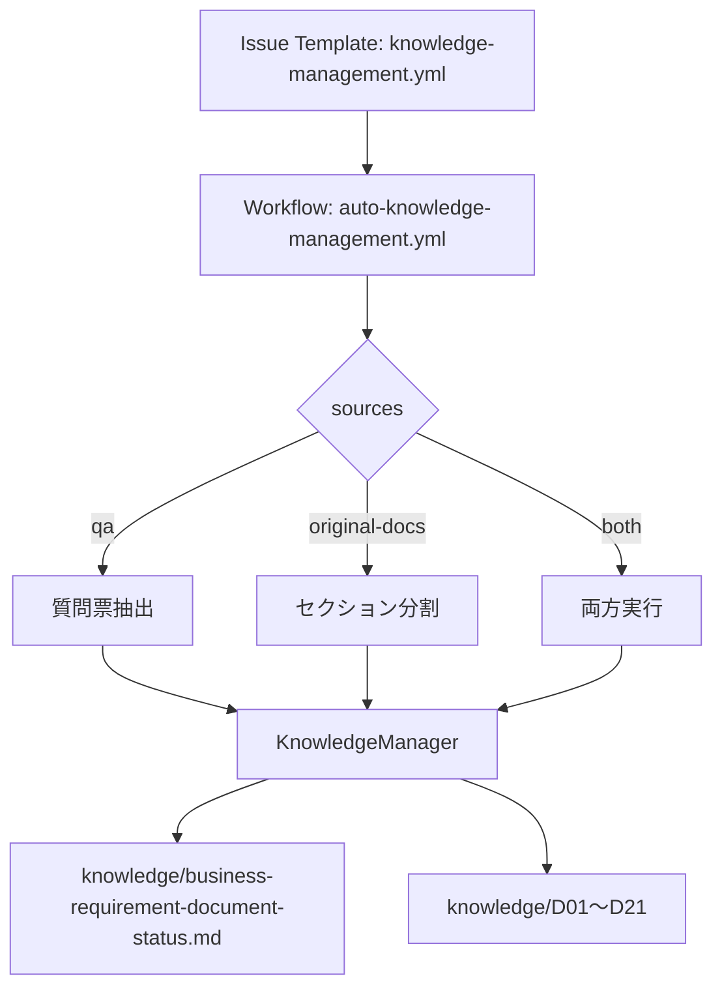

# Knowledge Management（AKM）ガイド

## 概要
AKM は `qa` / `original-docs` / `both` を選択して、`knowledge/` の D01〜D21 を生成・更新する統合フローです。



## Issue Template 入力
- `sources`: `qa のみ` / `original-docs のみ` / `両方`
- `target_files`: サブセット指定（任意）
- `additional_comment`: `custom_source_dir: <path>` を指定可
- `force_refresh`: 完全再生成

## CLI 例
```bash
python -m hve orchestrate --workflow akm --sources qa
python -m hve orchestrate --workflow akm --sources original-docs
python -m hve orchestrate --workflow akm --sources both
python -m hve orchestrate --workflow akm --sources qa --custom-source-dir docs/specs
```

## 状態判定
- `Confirmed` / `Tentative` / `Unknown` / `Conflict`
- `Conflict` は original-docs を含む場合に利用

## original-docs モード追加処理
- STALENESS CHECK
- 矛盾検出（同一 D / D 間 / qa vs original-docs / 用語）

## トラブルシューティング
- `custom_source_dir` は相対パスのみ（`/`, `..`, `~` を禁止）
- `knowledge/` / `.github/` / `src/` など禁止パス配下は拒否
