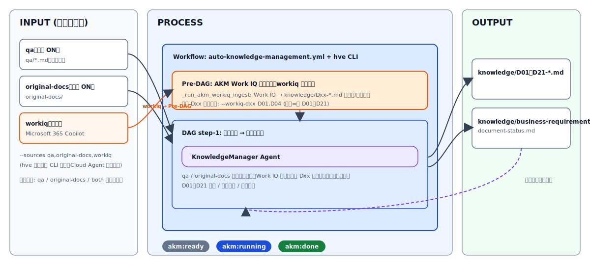
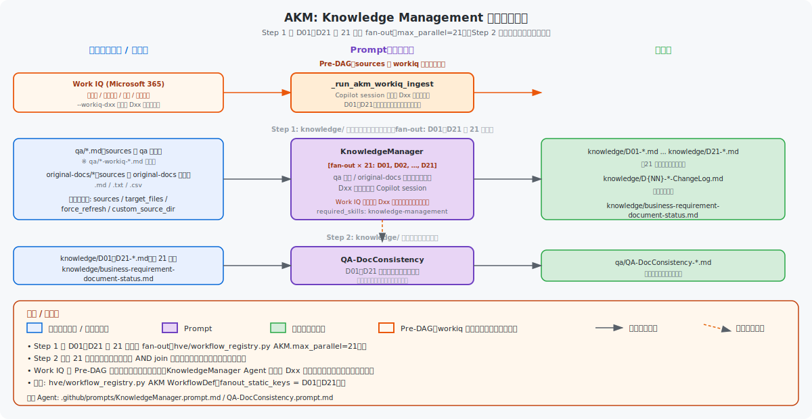

# Knowledge Management（AKM）ガイド

← [README](../README.md)

---

## 目次

- [対象読者](#対象読者)
- [前提](#前提)
- [次のステップ](#次のステップ)
- [概要](#概要)
- [Agent チェーン図（AKM）](#agent-チェーン図akm)
- [前提条件](#前提条件)
- [完了条件](#完了条件)
- [反復精緻化サイクル](#反復精緻化サイクル)
- [Issue Template 入力](#issue-template-入力)
- [CLI 例](#cli-例)
- [状態判定](#状態判定)
- [自動実行ガイド（ワークフロー）](#自動実行ガイドワークフロー)
- [セットアップ・トラブルシューティング](#セットアップトラブルシューティング)

---

## 対象読者

- `knowledge-management.yml`（AKM）を運用する担当者
- `qa/` / `original-docs/` / `knowledge/` の更新フローを管理する担当者

## 前提

- Issue Template: `.github/ISSUE_TEMPLATE/knowledge-management.yml`
- Workflow: `.github/workflows/auto-orchestrator-dispatcher.yml` → `.github/workflows/auto-knowledge-management-reusable.yml`
- Workflow ID / Custom Agent: `akm` / `KnowledgeManager`（`hve/workflow_registry.py`）

## 次のステップ

- `original-docs/` から質問票を生成する場合は [original-docs-review.md](./original-docs-review.md) を参照
- ソースコードから文書を段階生成する場合は [sourcecode-documentation.md](./sourcecode-documentation.md) を参照

## 概要
AKM は `qa` / `original-docs` / `workiq` をカンマ区切りでマルチ選択し、`knowledge/` の D01〜D21 を生成・更新する統合フローです。既定は `qa,original-docs` で、`workiq` は任意で追加できます。

- **入力ソース**: `qa` / `original-docs` / `workiq`（複数選択可、既定 `qa,original-docs`）
- **後方互換**: 旧値 `qa` / `original-docs` / `both` もそのまま受理される（`both` → `qa,original-docs` として正規化）
- **`workiq` 選択時**: AKM メイン DAG の **前段** で Work IQ 取り込みフェーズが走り、`knowledge/Dxx-*.md` を Work IQ 由来の情報で起票・差分更新した上で、後段で `qa` / `original-docs` が順次差分マージします。
- **HVE Cloud Agent は未対応**: 本機能は `hve` ローカル CLI のみで利用可能です。Issue Template 経由の Cloud 実行（`auto-knowledge-management-reusable.yml`）は従来通り `qa` / `original-docs` / `both` の単一選択となります。




AKM は 1 回実行して終わりではなく、`aqod` で生成した質問票を `qa/` に蓄積し、再度 `akm` で統合する反復精緻化ループを前提に運用します。

> [!NOTE]
> **Step.1.3（手動 Prompt）で作成した `knowledge/D{NN}-*.md` との関係**: [01-business-requirement.md](./01-business-requirement.md) の Step.1.3 で Microsoft 365 Copilot Researcher を使って手動作成した `knowledge/D01〜D21-*.md` がある場合、AKM はそのファイルを **完全上書き** ではなく **差分マージ** で更新します。変更履歴は `knowledge/D{NN}-*-ChangeLog.md` に記録されます。Step.1.3（手動）と AKM（自動）は同じ保存先 `knowledge/` を共有する補完関係です。

## Agent チェーン図（AKM）

以下の図は、このワークフローで使用される Custom Agent がファイルの入出力を介してどのように連鎖するかを示します。



### タスク／データフロー

Custom Agent の入出力ファイルを示します（`hve/workflow_registry.py` の AKM 定義に準拠）。



## 前提条件

- `qa/` または `original-docs/` に対象ファイルが存在すること
- GitHub Copilot が有効であること
- セットアップ手順は [getting-started.md](./getting-started.md) を参照

## 完了条件

- `knowledge/business-requirement-document-status.md` が生成または更新されていること
- 対象 D 分類のファイルが `knowledge/` に生成されていること

## 反復精緻化サイクル

AKM は一度きりではなく、初回作成 → 不足補完 → 開発中の気づき反映 → 既存資産取り込みを繰り返して `knowledge/` を継続的に精緻化します。全体像は [README.md](../README.md) を参照してください。

hve CLI の Work IQ 取り込みステージを使うと、Microsoft 365 側のメール / チャット / 会議 / ファイルを一次情報として `knowledge/Dxx` を起票できるため、初回セットアップ時の初回作成そのものを省力化できます。後段の `qa` / `original-docs` ステージが同一ファイルを差分マージします。

## Issue Template 入力

> **注記**: Issue Template 経由（HVE Cloud Agent）は `qa` / `original-docs` / `both` の単一選択のみ。Work IQ を入力ソースとして使うには `hve` ローカル CLI を使用してください。

- `branch`: 実行対象ブランチ
- `runner_type`: `GitHub Hosted` / `Self-hosted (ACA)`
- `sources`: `qa のみ` / `original-docs のみ` / `両方`
- `target_files`: サブセット指定（任意）
- `additional_comment`: `custom_source_dir: <path>` を 1 行ずつ指定可
- `force_refresh`: 完全再生成
- `enable_review` / `enable_qa` / `enable_self_improve` / `enable_auto_merge`
- `model` / `review_model` / `qa_model`

## CLI 例
```bash
# 従来互換
python -m hve orchestrate --workflow akm --sources qa
python -m hve orchestrate --workflow akm --sources original-docs
python -m hve orchestrate --workflow akm --sources both
python -m hve orchestrate --workflow akm --sources qa --custom-source-dir docs/specs

# Work IQ 入力を追加（hve ローカル CLI でのみ利用可能）
python -m hve orchestrate --workflow akm --sources qa,original-docs,workiq
python -m hve orchestrate --workflow akm --sources workiq                       # Work IQ 単独モード
python -m hve orchestrate --workflow akm --sources workiq --workiq-dxx D01,D04   # 対象 Dxx を絞り込み
# `--workiq-akm-ingest` で明示制御可（未指定時は --sources に workiq が含まれるかで自動判定）
python -m hve orchestrate --workflow akm --sources qa,original-docs --workiq-akm-ingest
```

## 状態判定
- `Confirmed` / `Tentative` / `Unknown` / `Conflict`
- `Conflict` は original-docs を含む場合に利用

## 自動実行ガイド（ワークフロー）

- 起点ラベル: `knowledge-management`
- オーケストレーション: `auto-orchestrator-dispatcher.yml` が `AKM` を判定し、`auto-knowledge-management-reusable.yml` を呼び出し

### ラベル体系
- `akm:initialized`
- `akm:ready`
- `akm:running`
- `akm:done`
- `akm:blocked`

### 冪等性
- 同一入力で再実行しても重複生成を避ける設計です
- `force_refresh` を有効化した場合のみ既存ファイルを再生成します

### 使い方（Issue 作成手順）
1. **Issues** → **New Issue** を開く
2. **Knowledge Management** テンプレートを選択
3. `sources`（`qa` / `original-docs` / `both`）を選択
4. **Submit** して実行

## セットアップ・トラブルシューティング

共通手順は [getting-started.md](./getting-started.md) を参照してください。問題切り分けは [troubleshooting.md](./troubleshooting.md) を参照してください。
