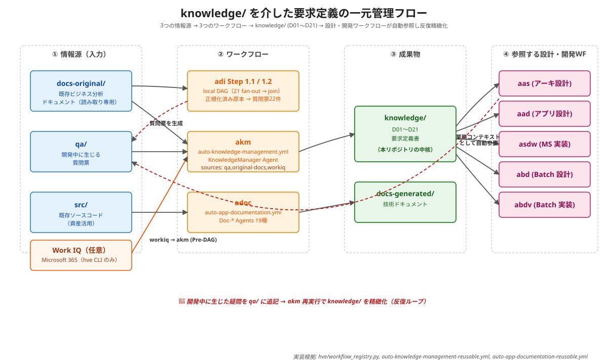
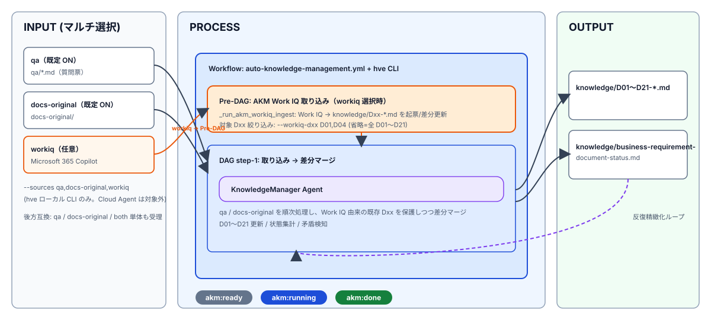
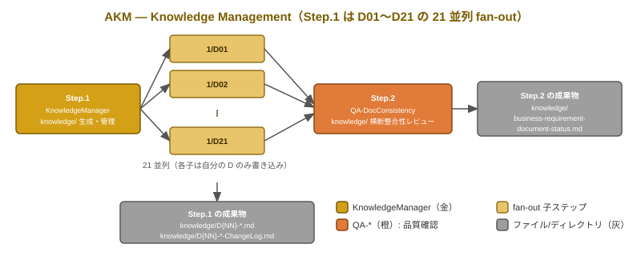
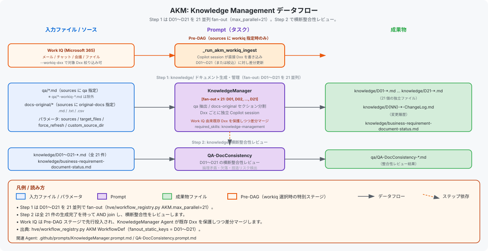

# Knowledge Management（AKM）ガイド

← [README](../README.md)

---

## 目次

- [対象読者](#対象読者)
- [前提](#前提)
- [次のステップ](#次のステップ)
- [概要](#概要)
- [Agent チェーン図（AKM）](#agent-チェーン図akm)
- [前提条件](#前提条件)
- [完了条件](#完了条件)
- [反復精緻化サイクル](#反復精緻化サイクル)
- [Issue Template 入力](#issue-template-入力)
- [CLI 例](#cli-例)
- [状態判定](#状態判定)
- [利用手順（前提・操作・入出力・完了確認・失敗時対応）](#利用手順前提操作入出力完了確認失敗時対応)
- [自動実行ガイド（ワークフロー）](#自動実行ガイドワークフロー)
- [カスタマイズ](#カスタマイズ)
- [セットアップ・トラブルシューティング](#セットアップトラブルシューティング)

---

## 対象読者

- `knowledge-management.yml`（AKM）を運用する担当者
- `qa/` / `docs-original/` / `knowledge/` の更新フローを管理する担当者

## 前提

- Issue Template: `.github/ISSUE_TEMPLATE/knowledge-management.yml`
- Workflow: `.github/workflows/auto-orchestrator-dispatcher.yml` → `.github/workflows/auto-knowledge-management-reusable.yml`
- Workflow ID / Prompt: `akm` / `KnowledgeManager`（`hve/workflow_registry.py`）

## 次のステップ

- `docs-original/` の目録化・正規化と質問票生成は [00-design-doc-ingestion.md](./00-design-doc-ingestion.md) を参照
- ソースコードから文書を段階生成する場合は [sourcecode-documentation.md](./sourcecode-documentation.md) を参照

## 概要
AKM は `qa` / `docs-original` / `workiq` をカンマ区切りでマルチ選択し、`knowledge/` の D01〜D21 を生成・更新する統合フローです。既定は `qa,docs-original` で、`workiq` は任意で追加できます。

- **入力ソース**: `qa` / `docs-original` / `workiq`（複数選択可、既定 `qa,docs-original`）
- **後方互換**: 旧値 `qa` / `docs-original` / `both` もそのまま受理される（`both` → `qa,docs-original` として正規化）
- **`workiq` 選択時**: AKM メイン DAG の **前段** で Work IQ 取り込みフェーズが走り、`knowledge/Dxx-*.md` を Work IQ 由来の情報で起票・差分更新した上で、後段で `qa` / `docs-original` が順次差分マージします。
- **HVE Cloud Agent は未対応**: 本機能は `hve` ローカル CLI のみで利用可能です。Issue Template 経由の Cloud 実行（`auto-knowledge-management-reusable.yml`）は従来通り `qa` / `docs-original` / `both` の単一選択となります。





AKM は 1 回実行して終わりではなく、ADI Step 1.1 / 1.2で生成した原本質問票を `qa/` に蓄積し、再度 `akm` で統合する反復精緻化ループを前提に運用します。

> [!NOTE]
> **Step.1.3（手動 Prompt）で作成した `knowledge/D{NN}-*.md` との関係**: [01-business-requirement.md](./01-business-requirement.md) の Step.1.3 で Microsoft 365 Copilot Researcher を使って手動作成した `knowledge/D01〜D21-*.md` がある場合、AKM はそのファイルを **完全上書き** ではなく **差分マージ** で更新します。変更履歴は `knowledge/D{NN}-*-ChangeLog.md` に記録されます。Step.1.3（手動）と AKM（自動）は同じ保存先 `knowledge/` を共有する補完関係です。

## Agent チェーン図（AKM）

以下の図は、このワークフローで使用される Prompt がファイルの入出力を介してどのように連鎖するかを示します。



> [!IMPORTANT]
> **図は Prompt の連鎖を描いており、CLI / GUI の Step 構成と一致する。**
> `hve/workflow_registry.py` の AKM 定義は次の 2 ステップで、
> Step 1 は D01〜D21 の **21 並列 fanout** を持つ。
>
> | Step | Prompt | 依存 | 出力 |
> |---|---|---|---|
> | 1 | `KnowledgeManager` | なし | `knowledge/business-requirement-document-status.md` / `knowledge/{key}-*.md` / `knowledge/{key}-*-ChangeLog.md`（`{key}` = D01〜D21） |
> | 2 | `QA-DocConsistency`（`knowledge/` 横断整合性レビュー） | Step 1 | `knowledge/business-requirement-document-status.md` |
>
> **Cloud（Issue Template）経路も同じ 2 ステップ構成。**
> `.github/workflows/auto-knowledge-management-reusable.yml` は `[AKM] Step.1` と `[AKM] Step.2` の
> Step Issue を作成し、Step.1 完了で Step.2 を起動、Step.2 完了で Root Issue へ `akm:done` を付与する。
> D01〜D21 の fanout は Step.1 の Agent 内部で処理し、Cloud では Step Issue へ展開しない
> （`knowledge/` への同時書込みを避けるため）。
> CLI / GUI と Cloud の Step 同期は
> `hve/tests/test_cloud_reusable_workflow_parity.py` の `TestAkmCloudParity` が固定している。

### タスク／データフロー

Prompt の入出力ファイルを示します（`hve/workflow_registry.py` の AKM 定義に準拠）。



## 前提条件

- `qa/` または `docs-original/` に対象ファイルが存在すること
- GitHub Copilot が有効であること
- セットアップ手順は [hve-cloud-getting-started.md](./hve-cloud-getting-started.md) / [hve-cli-getting-started.md](./hve-cli-getting-started.md) / [hve-gui-getting-started.md](./hve-gui-getting-started.md) を参照

## 完了条件

- `knowledge/business-requirement-document-status.md` が生成または更新されていること
- 対象 D 分類のファイルが `knowledge/` に生成されていること

## 反復精緻化サイクル

AKM は一度きりではなく、初回作成 → 不足補完 → 開発中の気づき反映 → 既存資産取り込みを繰り返して `knowledge/` を継続的に精緻化します。全体像は [README.md](../README.md) を参照してください。

hve CLI の Work IQ 取り込みステージを使うと、Microsoft 365 側のメール / チャット / 会議 / ファイルを一次情報として `knowledge/Dxx` を起票できるため、初回セットアップ時の初回作成そのものを省力化できます。後段の `qa` / `docs-original` ステージが同一ファイルを差分マージします。

## Issue Template 入力

> **注記**: Issue Template 経由（HVE Cloud Agent）は `qa` / `docs-original` / `both` の単一選択のみ。Work IQ を入力ソースとして使うには `hve` ローカル CLI を使用してください。

- `branch`: 実行対象ブランチ
- `runner_type`: `GitHub Hosted` / `Self-hosted (ACA)`
- `sources`: `qa のみ` / `docs-original のみ` / `両方`
- `target_files`: サブセット指定（任意）
- `additional_comment`: `custom_source_dir: <path>` を 1 行ずつ指定可
- `force_refresh`: 完全再生成
- `enable_review` / `enable_qa` / `enable_self_improve` / `enable_auto_merge`
- `model` / `review_model` / `qa_model`

## QA 回答から起動する Knowledge Management のマージ設定とモデル指定

`akm` 以外のワークフローで実行前 QA を有効にし、さらに **バックグラウンドマージを明示的に有効化** すると、回答済み QA を `knowledge/` へ取り込む Knowledge Management が**バックグラウンドで起動**されます（メインタスクは完了を待ちません）。

実行の並列度は次のとおりです。

- **`knowledge/` へ同時に書き込む子プロセスは常に 1 つ**です。Knowledge Management は `target_files` の指定によらず `knowledge/D01`〜`D21` 全体と `business-requirement-document-status.md` を出力対象にするため、子プロセスを多重起動すると同一ファイルへの同時書込みで差分が失われます。
- **実行中に滞留した回答済み QA は 1 回の子実行へまとめて渡されます**。まとめられた QA は Knowledge Management 内部の D01〜D21 の fan-out で同時に処理されるため、回答件数が増えても子実行の回数は増えません。
- **子実行の fan-out 並列度は Knowledge Management の宣言値（`21`）**になります。宣言値を持つワークフローは `--max-parallel` で上書きできないため（[workflow-reference.md](./workflow-reference.md) 参照）、メインタスクの並列実行数は子実行へ影響しません。

| 経路 | マージ可否の指定方法 |
|---|---|
| CLI | `--qa-akm-background-merge`。対話ウィザードでは「QA 自動投入」を有効にしたときに尋ねられます |
| GUI | 右ペインの「共通設定  *必須」枠、または設定画面の「一般 > Knowledge Management」の「QA (質問票) を Knowledge Management へバックグラウンドでマージする」 |
| Cloud | ワークフロー起動用の各 Issue Template にある `Knowledge Management マージ設定` チェックボックス（9 テンプレート） |

- **既定はいずれも無効**です。有効にしない限り QA 回答は `knowledge/` へ取り込まれません。
- 以前は「QA 自動投入」を有効にするだけで常に起動していました。共有資産である `knowledge/` への自動書込みを利用者が選べるようにするため、既定無効の明示選択へ変更しています。

マージを有効にした Knowledge Management 子実行だけに、メインタスクとは別の実行品質を指定できます。

| 経路 | 指定方法 | 指定できる項目 |
|---|---|---|
| CLI | `--akm-model` / `--akm-reasoning-effort` / `--akm-context-tier`。対話ウィザードではマージを有効にしたときに尋ねられます | モデル / reasoning effort / context tier |
| GUI | 右ペインの「共通設定  *必須」枠、または設定画面の「一般 > Knowledge Management」 | モデル / reasoning effort / context tier |
| Cloud | ワークフロー起動用の各 Issue Template にある `akm_model` ドロップダウン（9 テンプレート） | モデルのみ |

- いずれも既定は「継承」で、未指定の項目はメインタスクの設定（`--model` / `--reasoning-effort` / `--context-tier`）をそのまま使います。従来の挙動と同じです。
- **`--workflow akm` を明示指定した実行には適用されません**。その場合は従来どおり `--model` などに従います。
- Cloud にモデルしか無いのは、GitHub Actions 経路に reasoning effort / context tier に相当する設定が存在しないためです。
- Knowledge Management の Issue Template には `akm_model` がありません（AKM から AKM を再帰起動しないため）。ラベル初期化用の `setup-labels` など、ワークフローを起動しない Template にもありません。

### バックグラウンド子実行が失敗したとき

子実行の標準出力・標準エラーは `work/run/qa-akm-<id>/child-stdio.log` へ保存されます。親実行の警告には失敗件数に加えて `returncode` と当該ログのパスが出ます。

```text
QA 起点 AKM は 3 件失敗しました（source Workflow は継続、境界=DAG 完了後）。
  - returncode=1 対象 3 件 / ログ: work/run/qa-akm-<id>/child-stdio.log
```

- 子ログの本文は親のログへ展開しません。原因を見るときは表示されたパスを直接開いてください。
- 子が `status=blocked` で停止する最も多い原因は、HVE ソース（`hve/` / `mdq/` / `hve-dev/` / `.github/` 配下）の未コミット変更です。`git status --porcelain hve mdq hve-dev .github` で確認し、コミットまたは退避してから再実行してください。この検査を無効化するオプションはありません。
- **登録時点で既に dirty な場合は、子を起動せずに登録をスキップして即時に警告します**。無駄な子プロセス起動とセッション消費を避けるためです。この事前判定は最終ガードを置き換えません（登録時に clean でも実行時に dirty になる場合があるため）。スキップされた QA は、コミット後に `--workflow akm --sources qa --target-files <当該ファイル>` で手動取り込みできます。
- 切り分け手順は [troubleshooting.md](./troubleshooting.md) を参照してください。

> **使いどころ**: 設計・実装のメインタスクは高品質モデルで走らせつつ、定型作業に近い `knowledge/` の差分同期だけを安価なモデルへ逃がすと、品質を下げずにコストを抑えられます。

## CLI 例
```bash
# 従来互換
python -m hve orchestrate --workflow akm --sources qa
python -m hve orchestrate --workflow akm --sources docs-original
python -m hve orchestrate --workflow akm --sources both
python -m hve orchestrate --workflow akm --sources qa --custom-source-dir docs/specs

# Work IQ 入力を追加（hve ローカル CLI でのみ利用可能）
python -m hve orchestrate --workflow akm --sources qa,docs-original,workiq
python -m hve orchestrate --workflow akm --sources workiq                       # Work IQ 単独モード
python -m hve orchestrate --workflow akm --sources workiq --workiq-dxx D01,D04   # 対象 Dxx を絞り込み
# `--workiq-akm-ingest` で明示制御可（未指定時は --sources に workiq が含まれるかで自動判定）
python -m hve orchestrate --workflow akm --sources qa,docs-original --workiq-akm-ingest
```

## 状態判定
- `Confirmed` / `Tentative` / `Unknown` / `Conflict`
- `Conflict` は docs-original を含む場合に利用

## 利用手順（前提・操作・入出力・完了確認・失敗時対応）

| 軸 | 内容 |
|---|---|
| **前提** | `qa/` または `docs-original/` に対象ファイルがあること。GitHub Copilot が有効なこと。CLI で実行する場合は [hve-cli-getting-started.md](./hve-cli-getting-started.md) のセットアップが済んでいること |
| **操作** | Cloud: Issue Template **Knowledge Management** を起票 → ラベル `knowledge-management` で `auto-orchestrator-dispatcher.yml` が起動。CLI: 上の「CLI 例」のコマンドを実行 |
| **入力** | `sources`（CLI 既定 `qa,docs-original`）/ `target_files` / `custom_source_dir` / `force_refresh`。`workiq` は CLI のみ。**`target_files` の既定は `sources` に依存**する（`hve/orchestrator.py` の `_default_akm_target_files()`）: 非 Work IQ ソースが **1 種類**なら `workiq` 併用時もその glob になる（`qa` / `qa,workiq` → `qa/*.md`、`docs-original` / `docs-original,workiq` → `docs-original/*`）。**`workiq` 単独、または `qa` と `docs-original` を併用した場合（CLI 既定の `qa,docs-original` を含む）は既定パターンなし（空）**＝固定 glob で絞り込まない。Cloud の Issue Template は `target_files` を空欄のまま起票できる |
| **出力** | `knowledge/business-requirement-document-status.md` と `knowledge/D01〜D21-*.md`（および `-ChangeLog.md`） |
| **完了確認** | 上記「完了条件」を満たすこと。Cloud ではラベルが `akm:done` に遷移すること |
| **失敗時対応** | ラベルが `akm:blocked` の場合は Issue のコメントを確認。切り分けは [troubleshooting.md](./troubleshooting.md)。`knowledge/` が中途半端な場合は `force_refresh` で再生成 |

> `knowledge/` への書き込みは「削除 → 新規作成」が規約（Skill `work-artifacts-layout`）。
> 追記編集を前提にした運用をしないこと。

## 自動実行ガイド（ワークフロー）

- 起点ラベル: `knowledge-management`
- オーケストレーション: `auto-orchestrator-dispatcher.yml` が `AKM` を判定し、`auto-knowledge-management-reusable.yml` を呼び出し

### ラベル体系
- `akm:initialized`
- `akm:ready`
- `akm:running`
- `akm:done`
- `akm:blocked`

### 冪等性
- 同一入力で再実行しても重複生成を避ける設計です
- `force_refresh` を有効化した場合のみ既存ファイルを再生成します

### 使い方（Issue 作成手順）
1. **Issues** → **New Issue** を開く
2. **Knowledge Management** テンプレートを選択
3. `sources`（`qa` / `docs-original` / `both`）を選択
4. **Submit** して実行

## カスタマイズ

| 変えたいもの | 設定の正本（ここだけを編集する） | 拡張手順 | 回帰検証 |
|---|---|---|---|
| Step 構成・依存・出力パス・fanout キー（D01〜D21） | `hve/workflow_registry.py` の `akm` 定義 | `fanout_static_keys` を増減する場合は Prompt 側の共通テンプレートも合わせる | `python -m pytest hve/tests/test_workflow_registry.py hve/tests/test_fanout.py hve/tests/test_e2e_akm_fanout_dryrun.py -q` |
| Step 本文テンプレート | `.github/prompts/steps/akm/step-1.prompt.md` / `step-2.prompt.md`、fanout 共通は `.github/prompts/fanout/akm/_common.prompt.md` | 出力先パスの表記を変えるときは registry の `output_paths_template` と揃える | `python -m pytest hve/tests/test_e2e_akm_fanout_dryrun.py -q` |
| Agent の振る舞い | `.github/prompts/KnowledgeManager.prompt.md` / `.github/prompts/QA-DocConsistency.prompt.md` | 入出力契約は `.github/io-contracts/KnowledgeManager--akm--1.yaml` / `QA-DocConsistency--akm--2.yaml` と対で更新する | `python -m pytest hve/tests/test_knowledge_source_creation_contract.py -q` |
| `sources` の受理値と正規化 | `hve/` の AKM 入力正規化 | 旧値 `qa` / `docs-original` / `both` の後方互換を壊さない | `python -m pytest hve/tests/test_akm_sources_normalization.py -q` |
| Work IQ 取り込み | `hve/` の Work IQ 取り込みフェーズ | Cloud 実行では利用できない前提を維持する | `python -m pytest hve/tests/test_akm_workiq_ingest.py hve/tests/test_akm_workiq_phase.py -q` |
| Cloud の入力欄 | `.github/ISSUE_TEMPLATE/knowledge-management.yml` | 呼び出し先 `.github/workflows/auto-knowledge-management-reusable.yml` の `inputs` と対で更新する | Issue Template から 1 度実行して確認 |

**互換性・安全性で壊してはならない境界**

- `docs-original/` は**読み取り専用**。AKM は参照するだけで変更しない。
- `knowledge/` の更新は差分マージ。手動作成した `knowledge/D{NN}-*.md` を完全上書きしない（変更履歴は `-ChangeLog.md`）。
- `sources` の旧値 `both` は `qa,docs-original` へ正規化する後方互換を維持する。
- `workiq` は CLI 専用。Cloud の Issue Template に `workiq` を足すと実行時に解決できない。

## セットアップ・トラブルシューティング

共通手順は [hve-cloud-getting-started.md](./hve-cloud-getting-started.md) / [hve-cli-getting-started.md](./hve-cli-getting-started.md) / [hve-gui-getting-started.md](./hve-gui-getting-started.md) を参照してください。問題切り分けは [troubleshooting.md](./troubleshooting.md) を参照してください。
