# Original Docs Review（AQOD）ガイド

← [README](../README.md)

---

## 目次

- [対象読者](#対象読者)
- [前提](#前提)
- [次のステップ](#次のステップ)
- [概要](#概要)
- [Agent チェーン図（AQOD）](#agent-チェーン図aqod)
- [出力](#出力)
- [前提条件](#前提条件)
- [完了条件](#完了条件)
- [aqod と akm の連携フロー](#aqod-と-akm-の連携フロー)
- [Issue Template 入力](#issue-template-入力)
- [CLI 例](#cli-例)
- [自動実行ガイド（ワークフロー）](#自動実行ガイドワークフロー)
- [セットアップ・トラブルシューティング](#セットアップトラブルシューティング)

---
## 対象読者

- `original-docs-review.yml`（AQOD）で `original-docs/` の質問票を作成する担当者
- `qa/` を起点に `knowledge/` へ反映する運用担当者

## 前提

- Issue Template: `.github/ISSUE_TEMPLATE/original-docs-review.yml`
- Workflow: `.github/workflows/auto-orchestrator-dispatcher.yml` → `.github/workflows/auto-aqod.yml`
- Workflow ID / Custom Agent: `aqod` / `QA-DocConsistency`（`hve/workflow_registry.py`）

## 次のステップ

- 生成した質問票を `knowledge/` に統合する手順は [km-guide.md](./km-guide.md) を参照
- ソースコード由来のドキュメント整備が必要な場合は [sourcecode-documentation.md](./sourcecode-documentation.md) を参照

## 概要

AQOD は `original-docs/` 配下の Markdown を横断分析し、質問票を自動生成するワークフローです。`original-docs/` → `qa/` の変換を担い、後続の `akm` が `knowledge/` へ統合します。


- Web 実行: Issue Template `original-docs-review.yml`
- ローカル実行: `python -m hve orchestrate --workflow aqod`

## Agent チェーン図（AQOD）

以下の図は、このワークフローで使用される Custom Agent がファイルの入出力を介してどのように連鎖するかを示します。




## 出力

- Issue 起動時: `qa/QA-DocConsistency-Issue-<N>.md`
- ローカル実行時: `qa/QA-DocConsistency-<yyyymmdd-HHMMSS>.md`（JST）

## 前提条件

- `original-docs/` に Markdown ファイルが存在すること

## 完了条件

- `qa/` に質問票ファイルが生成されていること

## aqod と akm の連携フロー

`aqod` で `original-docs/` を分析して質問票を `qa/` に生成し、その後 `akm` が `qa/` と `original-docs/` を統合して `knowledge/` を更新します。

## Issue Template 入力

- `branch`: 実行対象ブランチ
- `runner_type`: `GitHub Hosted` / `Self-hosted (ACA)`
- `target_scope`: 対象スコープ（省略時: `original-docs/`）
- `depth`: `standard` / `lightweight`
- `focus_areas`: 重点観点（任意）
- `enable_review` / `enable_qa` / `enable_self_improve` / `enable_auto_merge`
- `model` / `review_model` / `qa_model`

## CLI 例

```bash
python -m hve orchestrate --workflow aqod
python -m hve orchestrate --workflow aqod --target-scope original-docs/ --depth lightweight
python -m hve orchestrate --workflow aqod --focus-areas "データ整合性、冪等性"
```


## 自動実行ガイド（ワークフロー）

- 起点ラベル: `original-docs-review`
- オーケストレーション: `auto-orchestrator-dispatcher.yml` が `AQOD` を判定し、`auto-aqod.yml` を呼び出し

### ラベル体系
- `aqod:initialized`
- `aqod:ready`
- `aqod:running`
- `aqod:done`
- `aqod:blocked`

### 使い方（Issue 作成手順）
1. **Issues** → **New Issue** を開く
2. **Original Docs Review** テンプレートを選択
3. 必要項目を入力して **Submit**

## セットアップ・トラブルシューティング

共通手順は [getting-started.md](./getting-started.md) を参照してください。
