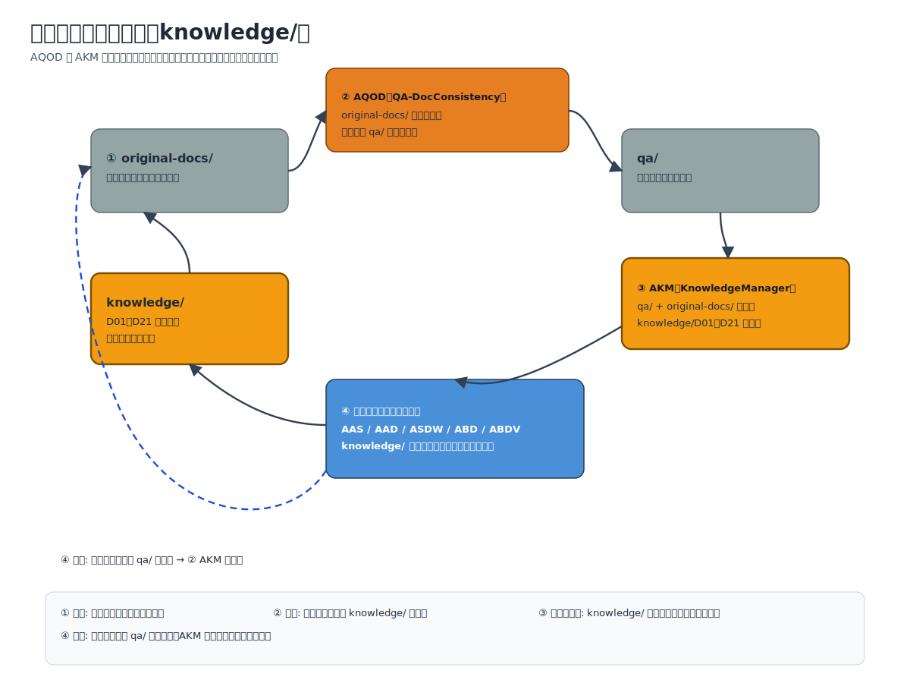
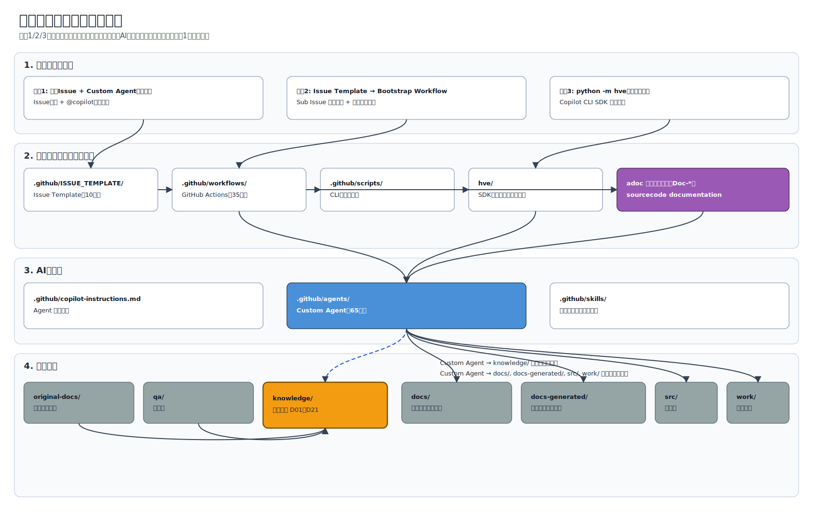
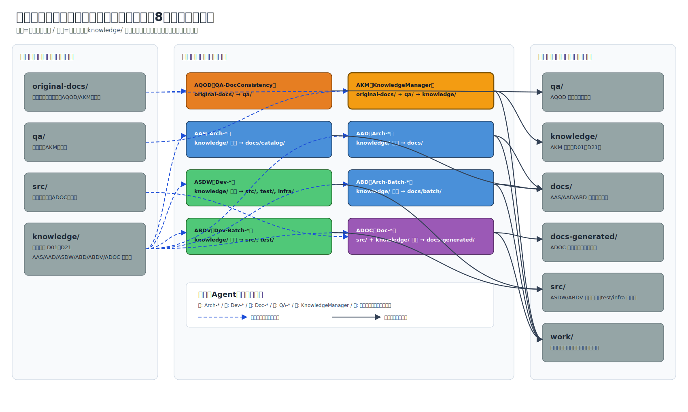
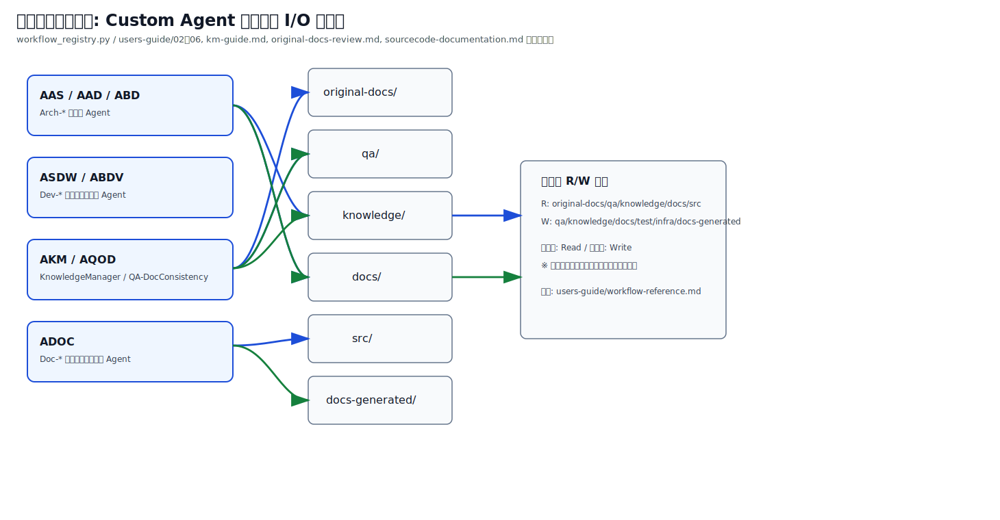
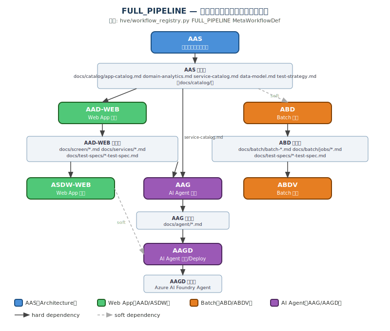
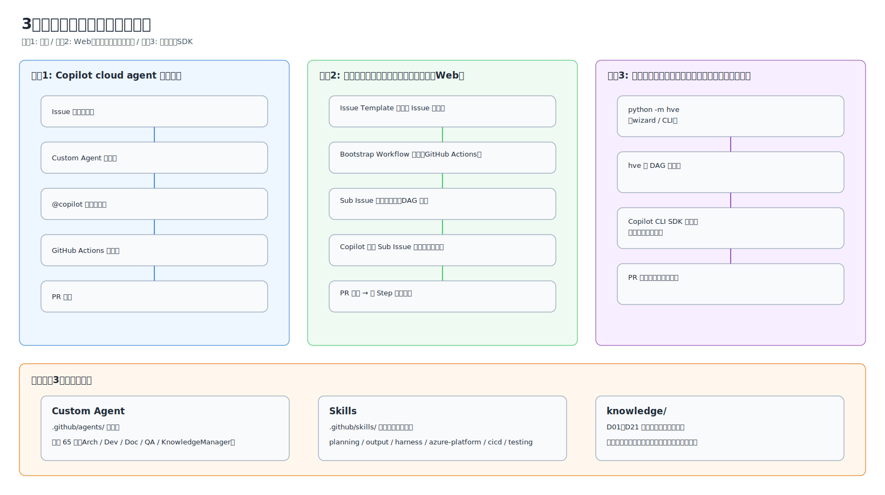

# 概要（Overview）

← [README](../README.md)

---

## 目次

- [このリポジトリは何か](#このリポジトリは何か)
- [本リポジトリの中核的特徴 — `knowledge/` を介した要求定義の一元管理](#本リポジトリの中核的特徴--knowledge-を介した要求定義の一元管理)
- [用語集](#用語集)
- [内部アーキテクチャ](#内部アーキテクチャ)
  - [全体コンポーネント関係図](#全体コンポーネント関係図)
  - [Agent の行動ルール](#agent-の行動ルール)
  - [hve/ パッケージの内部構造](#hve-パッケージの内部構造)
  - [Custom Agent のカテゴリ](#custom-agent-のカテゴリ)
  - [Skills の概要](#skills-の概要)
  - [knowledge/ と qa/ と original-docs/ の関係](#knowledge-と-qa-と-original-docs-の関係)
- [3 つの使い方](#3-つの使い方)
  - [共通点](#共通点)
  - [3 方式の実行フロー比較図](#3-方式の実行フロー比較図)
  - [方式比較表](#方式比較表)
  - [方式1: Copilot cloud agent 手動実行](#方式1-copilot-cloud-agent-手動実行)
  - [方式2: ワークフローオーケストレーション（Web）](#方式2-ワークフローオーケストレーションweb)
  - [方式3: ワークフローオーケストレーション（ローカル）](#方式3-ワークフローオーケストレーションローカル)
- [フェーズ別ガイドナビゲーション](#フェーズ別ガイドナビゲーション)
- [次のステップ](#次のステップ)

---

## このリポジトリは何か

本リポジトリは **Vibe Coding のベストプラクティスをワークフロー化** したテンプレートです。

人が「何を作るか」を定義し、GitHub Copilot cloud agent（Custom Agent）が要求定義・アーキテクチャ設計・実装・QA を **DAG（有向非巡回グラフ）の依存関係順** に自動実行します。各 Step は TDD 原則に基づいて設計成果物・テスト・実装コードを生成します。

ワークフローの実行には **3 通りの方法** があります（詳細は「[3 つの使い方](#3-つの使い方)」参照）。いずれの方法でも、同じ Custom Agent 定義・Skills・DAG を共有するため、生成される成果物は同一です。

> [!NOTE]
> 詳細な初期セットアップ手順は [getting-started.md](./getting-started.md) を参照してください。

---

## 本リポジトリの中核的特徴 — `knowledge/` を介した要求定義の一元管理

本リポジトリの最大の特徴は、**ビジネス分析結果とソフトウェア開発の間のインターフェースとなる要求定義書を、独自の `knowledge/` ディレクトリ（D01〜D21 の文書クラス）に集約する**ことです。これにより、要求定義が以下 3 つの情報源から段階的に拡充・精緻化されていきます。

### 3 つの情報源と対応ワークフロー

| # | 情報源 | 生成先 | ワークフロー ID | ワークフローファイル | Issue テンプレート |
|---|-------|--------|:---:|-------------------|-------------------|
| 1 | 既存のビジネス分析ドキュメント（`original-docs/`） | `knowledge/D01〜D21` | `akm` | [`auto-knowledge-management-reusable.yml`](../.github/workflows/auto-knowledge-management-reusable.yml) | [`knowledge-management.yml`](../.github/ISSUE_TEMPLATE/knowledge-management.yml) |
| 2-a | 開発中に生じる質問票（`qa/`） | `knowledge/D01〜D21` | `akm` | 同上 | 同上（モード: `qa` または `both`） |
| 2-b | 原本から自動生成する質問票 | `qa/` | `aqod` | [`auto-aqod.yml`](../.github/workflows/auto-aqod.yml) | [`original-docs-review.yml`](../.github/ISSUE_TEMPLATE/original-docs-review.yml) |
| 3 | 既存ソースコード（`src/` 等） | `docs-generated/`（技術文書群） | `adoc` | [`auto-app-documentation-reusable.yml`](../.github/workflows/auto-app-documentation-reusable.yml) | [`sourcecode-to-documentation.yml`](../.github/ISSUE_TEMPLATE/sourcecode-to-documentation.yml) |

### 担当 Custom Agent

- (1)(2-a): `KnowledgeManager` が `original-docs/` と `qa/` を D01〜D21 に分類
- (2-b): AQOD ワークフローが原本を分析し、選択式の質問票を `qa/` に生成
- (3): `Doc-*` 系 Custom Agent 19 個（`Doc-APISpec`, `Doc-ArchOverview`, `Doc-ComponentDesign` 等）がソースコードを解析

### 反復による精緻化（Iterative Refinement）

`knowledge/` は一度作って終わりではなく、以下のサイクルで回数を重ねるごとに精緻化されます。

1. **初回**: `original-docs/` の既存ビジネス分析ドキュメントを `akm` で D01〜D21 に分類し、初期 `knowledge/` を生成
2. **補完**: 原本で不足する情報を `aqod` で質問票として抽出 → 人が回答 → `akm` で再度 `knowledge/` に統合
3. **開発中の気づき**: 設計・実装フェーズで新たな疑問が発生したら `qa/` に追記 → `akm` で `knowledge/` を更新
4. **既存資産の取り込み**: 既存ソースコードがあれば `adoc` で技術文書（`docs-generated/`）を自動生成し、`knowledge/` との整合確認に活用

この反復により、設計・開発ワークフロー（`aas`, `aad`, `asdw`, `abd`, `abdv`）で参照される業務コンテキストが段階的に高精度化します。

> [!NOTE]
> 設計・開発の全 Custom Agent（`Arch-*`, `Dev-*`, `QA-*`）は、`knowledge/` ファイルが存在する場合に業務コンテキストとして自動参照します。参照マッピングは [workflow-reference.md §knowledge/ ディレクトリとの関係](./workflow-reference.md#knowledge-ディレクトリとの関係) を参照してください。




---

## 用語集

| 用語 | 定義 |
|------|------|
| **Custom Agent** | `.github/agents/` に定義された、各タスクに特化した Copilot の指示ファイル。設計・実装・QA・ドキュメント生成などのカテゴリで管理される |
| **Skills** | `.github/skills/` に配置された技術手順リファレンス。Custom Agent が参照する共通・ドメイン別の実行手順集 |
| **Workflow** | DAG 依存関係に従って複数の Custom Agent ステップを実行する自動化パイプライン。GitHub Actions または `hve` パッケージで実行 |
| **Sub Issue** | 親 Issue（Bootstrap Workflow）から自動生成されるステップ単位の子 Issue。Copilot が各 Sub Issue に自動アサインされる |
| **DAG** | 有向非巡回グラフ（Directed Acyclic Graph）。ステップ間の依存関係を表現し、並列実行可能なステップを同時に処理する |
| **knowledge/** | `qa/` / `original-docs/`（必要に応じて `custom_source_dir`）を入力として KnowledgeManager が自動生成する業務要件ドキュメント（D01〜D21 分類）。各 Custom Agent が業務コンテキストとして参照する |
| **MCP Server** | Model Context Protocol に基づく外部ツール連携。Copilot が GitHub・Azure・ファイルシステム等の外部ツールを呼び出す仕組み |
| **Bootstrap Workflow** | Issue Template から起動し、ワークフロー定義に従って Sub Issue を一括生成する GitHub Actions ワークフロー |

---

## 内部アーキテクチャ

### 全体コンポーネント関係図



> [!NOTE]
> `docs/` は設計ワークフロー（`aas`, `aad`, `abd`）が生成する設計ドキュメント。`docs-generated/` は `adoc` ワークフローがソースコードから生成する技術ドキュメント。両者は独立しています。

### Custom Agent エコシステム俯瞰図


### Agent の行動ルール

Agent の行動ルールは `.github/copilot-instructions.md` と `.github/skills/` に定義されています。

- **`.github/copilot-instructions.md`**: 全 Agent 共通の行動規約・ワークフロー概要・ルーティングテーブル
- **`.github/skills/`**: カテゴリ別の技術手順リファレンス（planning / output / harness / azure-platform / cicd / testing 等）

各 Custom Agent は `copilot-instructions.md` のルールを継承し、固有の追加ルールのみを `.github/agents/` のファイルに記載します。

### hve/ パッケージの内部構造

`hve/` は方式3（ローカル実行）のコアとなる Python パッケージです。`python -m hve` で起動します。

| ファイル | 役割 |
|---------|------|
| `__main__.py` | エントリポイント（CLI パーサー + インタラクティブ wizard） |
| `orchestrator.py` | ワークフロー実行のメインロジック |
| `dag_executor.py` | DAG 依存関係の解決 + asyncio 並列実行 |
| `runner.py` | Copilot CLI SDK セッション管理・Agent 実行 |
| `workflow_registry.py` | ワークフロー定義（ステップ・依存関係・Custom Agent 対応） |
| `config.py` | 設定値管理 |
| `console.py` | ターミナル UI（カラー・ボックス装飾・スピナー） |
| `github_api.py` | GitHub REST API クライアント（Issue / PR 作成） |
| `prompts.py` | Agent プロンプトテンプレート |
| `template_engine.py` | テンプレート変数展開エンジン |
| `qa_merger.py` | QA 結果の統合 |
| `self_improve.py` | 自己改善ループ実行 |
| `permission_handler.py` | 権限チェック・前提条件検証 |
| `__init__.py` | パッケージ初期化 |
| `pytest.ini` | hve テスト設定 |
| `tests/` | hve パッケージの単体テスト群 |

### Custom Agent のカテゴリ

リポジトリには計 **65 個** の Custom Agent が `.github/agents/` に定義されています。6 カテゴリに分類されます。

| カテゴリ | 接頭辞 | 主な役割 | 詳細参照 |
|---------|--------|----------|---------|
| **ビジネス分析・要求定義** | `Arch-Application*`, `Arch-Architecture*` | ユースケース分析・候補アーキテクチャ選定（`Arch-*` の一部） | [workflow-reference.md](./workflow-reference.md) |
| **アーキテクチャ設計** | `Arch-*`（23） | ユースケース分析・ドメイン設計・データモデル・テスト設計 | [workflow-reference.md](./workflow-reference.md) |
| **実装** | `Dev-*`（17） | Azure リソース作成・コード生成・デプロイ・CI/CD 構築 | [workflow-reference.md](./workflow-reference.md) |
| **ドキュメント生成** | `Doc-*`（19） | API/データモデル/依存関係/オンボーディング等の文書生成 | [workflow-reference.md](./workflow-reference.md) |
| **QA / レビュー** | `QA-*`（5） | コード品質・アーキテクチャレビュー・ドキュメント整合性検証 | [workflow-reference.md](./workflow-reference.md) |
| **Knowledge Management** | `KnowledgeManager`（1） | `qa/` / `original-docs/` を D01〜D21 に分類し `knowledge/` を管理 | [workflow-reference.md](./workflow-reference.md) |

Custom Agent の完全な一覧は [workflow-reference.md](./workflow-reference.md) および [web-ui-guide.md](./web-ui-guide.md) を参照してください。






### Skills の概要

Skills は `.github/skills/` 配下に、カテゴリ別ディレクトリで管理されています。

| カテゴリ | パス | 主な内容 |
|---------|------|---------|
| **planning** | `.github/skills/planning/` | タスク計画・DAG 設計・ワークフロー共通ルール |
| **output** | `.github/skills/output/` | 成果物フォーマット・大量出力の分割ルール |
| **harness** | `.github/skills/harness/` | 検証ループ・安全ガード・エラーリカバリ |
| **azure-platform** | `.github/skills/azure-platform/` | Azure リソース操作・デプロイ・認証・コスト最適化 |
| **cicd** | `.github/skills/cicd/` | GitHub Actions CI/CD 構築 |
| **testing** | `.github/skills/testing/` | テスト戦略・TDD テンプレート |
| **observability** | `.github/skills/observability/` | Application Insights 計装 |

詳細は [workflow-reference.md](./workflow-reference.md) を参照してください。

### knowledge/ と qa/ と original-docs/ の関係

`qa/` フォルダーには質問票、`original-docs/` フォルダーにはユーザー提供原本（Markdown 変換済み）が格納されます。`KnowledgeManager` がこれらを処理し、`knowledge/` フォルダーに D01〜D21 分類の業務要件ドキュメントを生成・更新します。

```
original-docs/ 原本 + qa/ 質問票
  → KnowledgeManager
    → knowledge/ D01〜D21 業務要件ドキュメント
      → 各 Custom Agent が業務コンテキストとして自動参照
```

> [!NOTE]
> 設計・開発ワークフローを開始する前に `knowledge-management` ワークフローを実行しておくことを推奨します。`knowledge/` が存在すると、各 Custom Agent が業務要件コンテキストを自動参照し、より精度の高い成果物を生成します。

さらに、`aqod`（`original-docs/` → `qa/`）と `akm`（`qa/` / `original-docs/` → `knowledge/`）を反復することで、設計・実装中に生じた疑問を継続的に業務要件へ還元できます。

詳細は [km-guide.md](./km-guide.md) および [original-docs-review.md](./original-docs-review.md) を参照してください。

---

## 3 つの使い方

### 共通点

3 方式はすべて以下を共有します。

- 同じ **Custom Agent 定義**（`.github/agents/`）を使用
- 同じ **Skills**（`.github/skills/`）を参照
- 同じ **ワークフロー DAG**（ステップ依存関係）に従う
- 生成される **成果物**（`docs/`, `src/`, `knowledge/`）は同一
- `knowledge/` の業務コンテキストを自動参照

方式の違いは「**どこで誰が実行するか**」と「**自動化レベル**」だけです。

### 3 方式の実行フロー比較図



### 方式比較表

| 項目 | 方式1: Copilot cloud agent 手動実行 | 方式2: ワークフローオーケストレーション（Web） | 方式3: ワークフローオーケストレーション（ローカル） |
|------|------|------|------|
| **実行場所** | GitHub Actions | GitHub Actions | ローカル PC |
| **Issue 作成** | 手動（1 Issue ずつ） | Issue Template から自動生成 | オプション（デフォルト: しない） |
| **自動化レベル** | 低（1 Issue = 1 Agent の手動操作） | 高（Sub Issue 一括生成・自動アサイン） | 高（DAG 解決・ステップ自動実行） |
| **GitHub Actions 依存** | あり | あり | なし |
| **Copilot アサイン** | 手動 | 自動（`COPILOT_PAT` 必要） | しない（ローカル直接実行） |
| **MCP Server** | GitHub 管理の MCP 設定 | GitHub 管理の MCP 設定 | `--mcp-config` で任意設定可 |
| **モデル選択** | Issue の「使用するモデル」で選択可（既定: Auto（GitHub が最適モデルを動的選択）） | Issue の「使用するモデル」で選択可（既定: Auto（GitHub が最適モデルを動的選択）） | `--model` / `--review-model` / `--qa-model` で指定可（既定: `Auto`） |
| **認証** | 不要（Copilot アサイン時のみ `COPILOT_PAT`） | `COPILOT_PAT`（自動アサイン時に必要） | `gh auth login`（Copilot CLI） |
| **課金** | GitHub Actions 分 | GitHub Actions 分 | Copilot ライセンスのみ |
| **並列実行** | なし（逐次手動） | GitHub Actions 並列ジョブ | asyncio 並列（デフォルト上限: 15） |
| **PR 完全自動化** | なし | Issue Template の設定で有効化可能（`auto-approve-ready` ラベル連携） | CLI では `--auto-coding-agent-review-auto-approval` で自動承認まで対応 |
| **推奨ユースケース** | 単一タスクの試行・デバッグ | フルワークフローの自動実行 | ローカル環境・GitHub Actions 不使用時 |

> [!NOTE]
> 方式1 は方式2 の「個々の Sub Issue を手動実行する」場合に相当します。方式2 で自動生成された Sub Issue を、手動で方式1 として実行することも可能です。

### 方式1: Copilot cloud agent 手動実行

GitHub.com 上で 1 つの Issue に 1 つの Custom Agent を手動でアサインする、最もシンプルな使い方です。特定のタスクのみを試したい場合や、ワークフローの個々のステップをデバッグしたい場合に適しています。

```
Issue を作成 → Custom Agent を選択 → @copilot をアサイン → GitHub Actions で実行 → PR を確認
```

> [!NOTE]
> 複数の Issue を手動で順序立てて実行することで、フルワークフローを段階的に進めることも可能です。

詳細な手順は [web-ui-guide.md — 方式1](./web-ui-guide.md#方式1-copilot-cloud-agent-手動実行) を参照してください。

### 方式2: ワークフローオーケストレーション（Web）

Issue Template から親 Issue を作成すると、Bootstrap Workflow が Sub Issue を自動生成し、Copilot が依存関係順（DAG 順）に自動実行するフル自動の使い方です。

```
Issue Template から親 Issue を作成
  → Bootstrap Workflow（GitHub Actions）起動
    → Sub Issue を一括生成（DAG 順）
      → Copilot が各 Sub Issue に自動アサイン
        → PR 作成 → マージ → 次 Step 自動起動
```

> [!IMPORTANT]
> 方式2 を使用するには、事前にラベルの設定と `COPILOT_PAT` シークレットの設定が必要です。詳細は [getting-started.md](./getting-started.md) を参照してください。

詳細な手順は [web-ui-guide.md — 方式2](./web-ui-guide.md#方式2-ワークフローオーケストレーションweb) を参照してください。

### 方式3: ワークフローオーケストレーション（ローカル）

ローカル PC から `hve` Python パッケージを使用し、GitHub Copilot CLI SDK 経由でワークフローを実行する方法です。GitHub Actions を使わずに実行できるため、CI/CD が不要な環境や、MCP Server を柔軟に設定したい場合に適しています。

```
python -m hve（wizard または CLI）
  → hve が DAG を解決・並列実行
    → Copilot CLI SDK 経由で各 Agent が実行
      → PR 作成（オプション）
```

詳細な手順は [hve-app-guide.md](./hve-app-guide.md) を参照してください。
> オプション機能の Work IQ 連携（M365 データ参照）については [hve-app-guide.md](./hve-app-guide.md#work-iq-mcp-連携オプション) を参照してください。

---

## フェーズ別ガイドナビゲーション

### 逆引き表 — やりたいことからガイドを探す

| やりたいこと | 参照ガイド | 対応ワークフロー ID |
|------------|-----------|:---:|
| ビジネス要件からユースケースを整理したい | [01-business-requirement.md](./01-business-requirement.md) | — |
| アプリのアーキテクチャを設計したい | [02-app-architecture-design.md](./02-app-architecture-design.md) | `aas` |
| マイクロサービスを設計したい | [03-app-design-microservice-azure.md](./03-app-design-microservice-azure.md) | `aad` |
| バッチ処理を設計したい | [04-app-design-batch.md](./04-app-design-batch.md) | `abd` |
| マイクロサービスを実装したい | [05-app-dev-microservice-azure.md](./05-app-dev-microservice-azure.md) | `asdw` |
| バッチ処理を実装したい | [06-app-dev-batch-azure.md](./06-app-dev-batch-azure.md) | `abdv` |
| AI Agent を簡易設計したい | [07-ai-agent-simple.md](./07-ai-agent-simple.md) | — |
| AI Agent を本格設計したい | [08-ai-agent.md](./08-ai-agent.md) | — |
| 業務知識を整理・管理したい（qa/original-docs） | [km-guide.md](./km-guide.md) | `akm` |
| original-docs から質問票を生成したい | [original-docs-review.md](./original-docs-review.md) | `aqod` |
| ソースコードから技術文書を自動生成したい | [sourcecode-documentation.md](./sourcecode-documentation.md) | `adoc` |
| コード品質を改善したい | [web-ui-guide.md](./web-ui-guide.md)（QA Agent セクション） | — |
| トラブルが発生した | [troubleshooting.md](./troubleshooting.md) | — |
| プロンプト例を参照したい | [prompt-examples.md](./prompt-examples.md) | — |

### フェーズ一覧

#### 要求定義

| フェーズ | ガイド | ワークフロー ID |
|---------|--------|:---:|
| **01 — 要求定義** | [01-business-requirement.md](./01-business-requirement.md) | — |

#### アプリケーション開発

| フェーズ | ガイド | ワークフロー ID |
|---------|--------|:---:|
| **02 — アプリケーションアーキテクチャ設計** | [02-app-architecture-design.md](./02-app-architecture-design.md) | `aas` |
| **03 — Microservice 設計** | [03-app-design-microservice-azure.md](./03-app-design-microservice-azure.md) | `aad-web` |
| **04 — Batch 設計** | [04-app-design-batch.md](./04-app-design-batch.md) | `abd` |
| **05 — Microservice 実装** | [05-app-dev-microservice-azure.md](./05-app-dev-microservice-azure.md) | `asdw-web` |
| **06 — Batch 実装** | [06-app-dev-batch-azure.md](./06-app-dev-batch-azure.md) | `abdv` |
| **07 — AI Agent（Quick）** | [07-ai-agent-simple.md](./07-ai-agent-simple.md) | `aag` |
| **08 — AI Agent（本格）** | [08-ai-agent.md](./08-ai-agent.md) | `aagd` |

#### Knowledge Management

| フェーズ | ガイド | ワークフロー ID |
|---------|--------|:---:|
| **AKM: Knowledge Management（qa/original-docs）** | [km-guide.md](./km-guide.md) | `akm` |
| **AQOD: Original Docs Review 質問票生成** | [original-docs-review.md](./original-docs-review.md) | `aqod` |

#### Source Codeからの Documentation

| フェーズ | ガイド | ワークフロー ID |
|---------|--------|:---:|
| **ADOC: Source Codeからのドキュメント作成** | [sourcecode-documentation.md](./sourcecode-documentation.md) | `adoc` |

> 01（要求定義）は手動実行です。02 以降はガイドによって手動実行とワークフロー実行が分かれるため、各ガイドの前提を確認してください。

---

## 次のステップ

- **初回セットアップ** → [getting-started.md](./getting-started.md)（リポジトリ作成・MCP 設定・PAT 設定・ラベル設定）
- **方式1 で開始** → [web-ui-guide.md — 方式1](./web-ui-guide.md#方式1-copilot-cloud-agent-手動実行)
- **方式2 で開始** → [web-ui-guide.md — 方式2](./web-ui-guide.md#方式2-ワークフローオーケストレーションweb)
- **方式3 で開始** → [hve-app-guide.md](./hve-app-guide.md)
- **ワークフロー・Agent 一覧を確認** → [workflow-reference.md](./workflow-reference.md)
