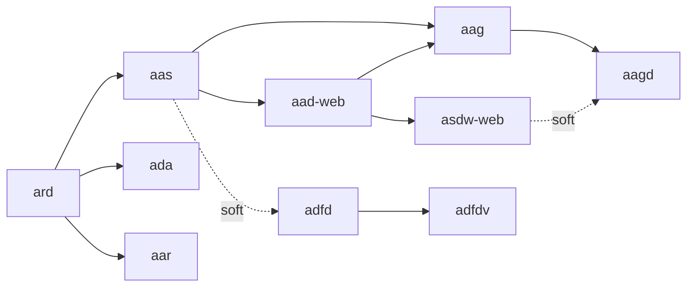

# 複数 Workflow をまとめて計画する Prompt 例

← [スニペット索引](README.md)

> どの例も実行計画（plan）を先に提示し、あなたが承認してから実行します。コマンドの実行は Copilot が代行するため、あなたが入力する必要はありません。

---

## 実行順の決まり方

複数 Workflow を 1 つの request に書くと、HVE は `hve/workflow_registry.py` の
メタ依存（`get_meta_dependencies()`）に基づいて **安定した順序** に並べ替えます。



`akm` / `adi` / `adoc` は他 Workflow への依存を持たないため、上図に現れません。

重要な制約:

- **依存 Workflow は自動で追加されません。** 上図で上流にある Workflow も、
  実行したいなら request に明示的に書く必要があります。
- **任意の DAG は組めません。** 順序は registry のメタ依存だけで決まります。
- **途中で失敗したら後続は開始しません。** 成功済みの Workflow の成果物は残ります
  （自動でロールバックはしません）。

---

## 例 1. アーキテクチャ設計から Web 画面設計まで

```text
HVE の Prompt 版で作業してください。

- 目的: APP-NNN のアプリ構成設計から Web 画面・API の設計書までを一続きで作りたい
- Workflow: aas, aad-web
- パラメータ:
  - aad-web: app_ids=APP-NNN
- 制約:
  - Azure リソースの作成・変更はしないこと
  - 私が挙げた Workflow 以外を勝手に追加しないこと
- 期待する成果物:
  - aas: docs/catalog/ 配下の設計カタログ
  - aad-web: docs/catalog/screen-catalog.md、docs/screen/、docs/services/、docs/test-specs/

まず実行計画だけを見せてください。
実行順が `aas` → `aad-web` になっていることを私が確認します。
私が「実行してください」と書くまで、実行はしないでください。
```

`aas` は Workflow 固有パラメータを持たないため、`app_ids` は `aad-web` にだけ指定します。

---

## 例 2. Web 設計から実装まで

```text
HVE の Prompt 版で作業してください。

- 目的: APP-NNN の Web 画面設計と実装をまとめて進めたい
- Workflow: aad-web, asdw-web
- パラメータ:
  - aad-web: app_ids=APP-NNN
  - asdw-web: app_ids=APP-NNN
- 制約:
  - Azure へのデプロイは含めないこと（実装とローカルテストまで）
  - 依存する上流 Workflow を勝手に追加しないこと
- 期待する成果物: docs/screen/、docs/services/、docs/test-specs/、src/、src/test/

まず実行計画だけを見せてください。
実行順が `aad-web` → `asdw-web` になっていることと、
デプロイ用の Step が含まれていないことを私が確認します。
私が「実行してください」と書くまで、実行はしないでください。
```

---

## 例 3. Dataflow 設計から実装まで

```text
HVE の Prompt 版で作業してください。

- 目的: APP-NNN のバッチ処理を設計から実装まで進めたい
- Workflow: adfd, adfdv
- パラメータ:
  - adfd: app_ids=APP-NNN
  - adfdv: app_ids=APP-NNN
- 制約: Azure へのデプロイは含めないこと
- 期待する成果物: docs/dataflow/ 配下の設計書、src/ と src/test/ 配下のコード

まず実行計画だけを見せてください。
私が「実行してください」と書くまで、実行はしないでください。
```

---

## 例 4. AI Agent の設計から実装まで

```text
HVE の Prompt 版で作業してください。

- 目的: APP-NNN の AI Agent を設計から実装まで進めたい
- Workflow: aag, aagd
- パラメータ:
  - aag: app_ids=APP-NNN, usecase_id=<UC-ID>
  - aagd: app_ids=APP-NNN, usecase_id=<UC-ID>
- 制約:
  - Azure へのデプロイと評価は含めないこと
  - モデル名やエンドポイントを推測で決めないこと
- 期待する成果物: docs/agent/ 配下の設計書、src/test/agent/ 配下のコード

まず実行計画だけを見せてください。
実行順が `aag` → `aagd` になっていることを私が確認します。
私が「実行してください」と書くまで、実行はしないでください。
```

---

## 計画だけでは前提不足を検出できない

実行計画（plan）の提示は各 Workflow を `--dry-run` で実行しますが、
**`--dry-run` は上流成果物の不足を検出しません**。依存先のファイルが無くても計画は提示されます。
承認する前に、上図の依存を自分で確認してください。

| 状況 | 対処 |
|---|---|
| `aad-web` を単独で計画したが、`aas` の成果物が無い | request に `aas` を追加するか、先に `aas` を実行する |
| `adfd` を計画したが `aas` の成果物が無い | `adfd` の依存は soft のため実行はできる。内容が不足するなら `aas` を先に実行する |
| `asdw-web` を計画したが `docs/screen/*.md` が無い | `aad-web` を先に実行する |

---

## 関連

- Workflow 別の単独例: [requirements-architecture.md](requirements-architecture.md) / [web-application.md](web-application.md) / [dataflow.md](dataflow.md) / [ai-agent.md](ai-agent.md)
- 依存関係の正本: `hve/workflow_registry.py` の `get_meta_dependencies()`
