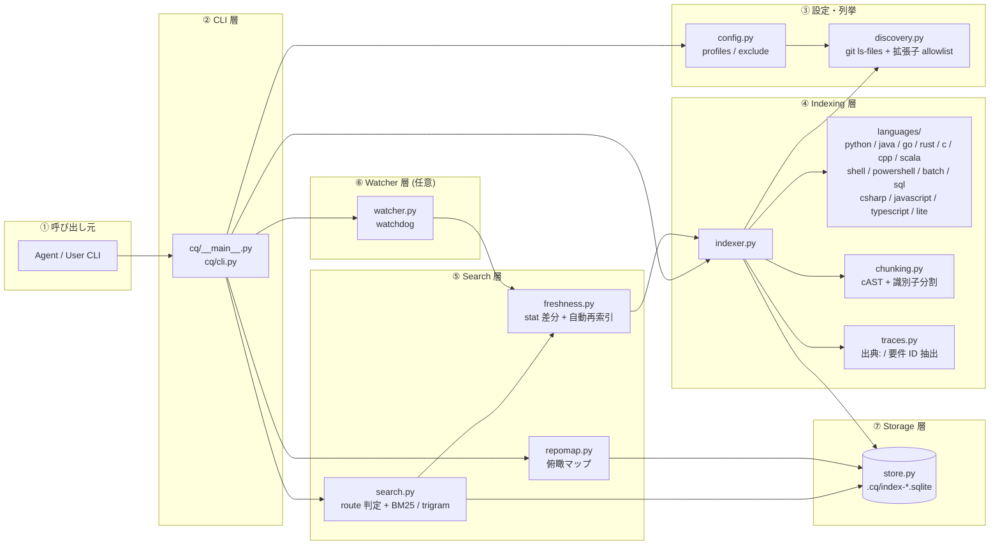
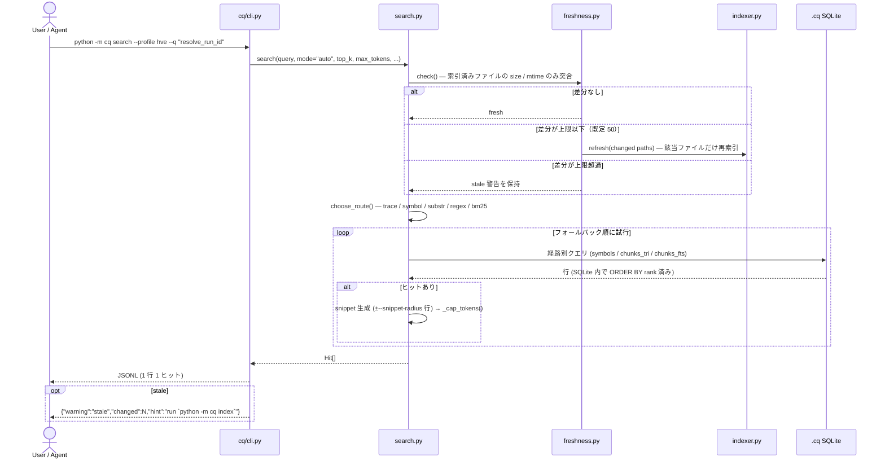
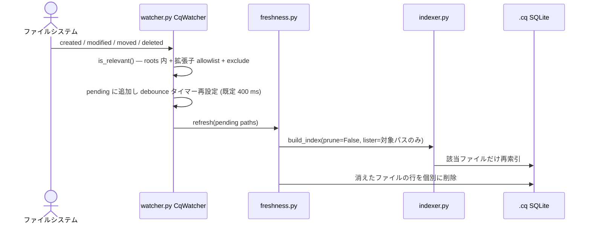

# skills: code-query 技術リファレンス & 運用ガイド

> **本ページは HVE リポジトリ固有の技術リファレンスです。汎用 Skill 仕様は [.github/skills/code-query/SKILL.md](../.github/skills/code-query/SKILL.md) を参照してください。**

`code-query`（`cq` パッケージ）は [markdown-query](skills-markdown-query.md) のソースコード版であり、**別パッケージ・別 DB**で動作する。`.md` と表形式インベントリは `mdq` の担当、ソースコードは `cq` の担当という排他分担になっている。

このページは以下 2 つの目的を持つ:

1. **`cq` の技術アーキテクチャ詳細** — Skill をフォーク／カスタマイズする開発者向けに、構成要素・メッセージフロー・チャンク分割・索引データファイルと更新頻度を解説する（§ 1〜§ 4）。
2. **日常利用と運用の手引き** — CLI の使い分け、検索モード、品質計測、トラブルシューティング（§ 5 以降）。

## 目次

| § | 章 | 主な対象読者 |
|---|---|---|
| 1 | [技術アーキテクチャ概要](#1-技術アーキテクチャ概要) | Skill カスタマイズ予定の開発者 |
| 2 | [メッセージフロー (3 シーケンス)](#2-メッセージフロー-3-シーケンス) | 同上 |
| 3 | [チャンク分割とシンボル抽出](#3-チャンク分割とシンボル抽出) | 同上 + 検索品質チューニング担当 |
| 4 | [索引データファイルと更新頻度](#4-索引データファイルと更新頻度) | 運用担当 |
| 5 | [CLI リファレンス](#5-cli-リファレンス) | 全利用者 |
| 6 | [検索モードとルーティング](#6-検索モードとルーティング) | 全利用者 |
| 7 | [対応言語とフィデリティ](#7-対応言語とフィデリティ) | 全利用者 |
| 8 | [mdq との棲み分けと連携](#8-mdq-との棲み分けと連携) | 全利用者 |
| 9 | [品質計測（ゴールデンクエリ / ベンチマーク）](#9-品質計測ゴールデンクエリ--ベンチマーク) | 品質管理 |
| 10 | [HVE 本体との統合ポイント](#10-hve-本体との統合ポイント) | HVE 保守担当 |
| 11 | [GUI 管理画面](#11-gui-管理画面) | 全利用者 |
| 12 | [トラブルシューティング](#12-トラブルシューティング) | 全利用者 |
| 13 | [他リポジトリへの導入](#13-他リポジトリへの導入) | 別リポジトリ移植担当 |
| 14 | [既知の制約と未確認事項](#14-既知の制約と未確認事項) | 全利用者 |

---

## 1. 技術アーキテクチャ概要

`cq` は HVE リポジトリ同梱の Python パッケージである。
**ローカル完結**（外部 API 呼び出しなし、文法ファイルのネットワーク取得なし、`.cq/` 配下に SQLite で永続化）であり、CLI からは `python -m cq` サブプロセスとして起動する。



### 1.1 構成要素サマリ

| グループ | モジュール | 役割 | 起動契機 |
|---|---|---|---|
| ① 呼び出し元 | Agent / User CLI | `python -m cq` サブプロセスを起動 | 検索・索引更新・監視 |
| ② CLI 層 | [cq/\_\_main\_\_.py](../cq/__main__.py), [cq/cli.py](../cq/cli.py) | argparse でサブコマンド振り分け、UTF-8 出力強制、例外→ exit 2 | `index` / `stats` / `search` / `def` / `get` / `refs` / `trace` / `map` / `watch` |
| ③ 設定・列挙 | [cq/config.py](../cq/config.py), [cq/discovery.py](../cq/discovery.py) | profile 解決（fail-closed）、`git ls-files` による対象列挙・除外 | 索引・鮮度確認 |
| ④ Indexing | [cq/indexer.py](../cq/indexer.py), [cq/languages/](../cq/languages/), [cq/chunking.py](../cq/chunking.py), [cq/traces.py](../cq/traces.py) | シンボル抽出・チャンク分割・参照/import/トレース抽出 | `cq index` / `cq watch` / 鮮度ガード |
| ⑤ Search | [cq/search.py](../cq/search.py), [cq/freshness.py](../cq/freshness.py), [cq/repomap.py](../cq/repomap.py) | 経路判定 → SQLite 内でランキング → snippet 生成、俯瞰マップ | `cq search` / `def` / `trace` / `map` |
| ⑥ Watcher | [cq/watcher.py](../cq/watcher.py) | 変更をデバウンスして増分索引（`watchdog` 任意依存） | `cq watch` |
| ⑧ Storage | [cq/store.py](../cq/store.py) + `.cq/index-<profile>.sqlite` | スキーマ管理（SCHEMA v3）+ FTS5 ミラー + CRUD | `open_store()` 経由 |
| ⑧ GUI (任意) | [cq/gui/](../cq/gui/) | 索引管理画面・索引操作サービス・バックグラウンド処理（`PySide6` 任意依存）。HVE 組み込みと独立ランチャーが共有する（§11） | `python -m cq.gui`、HVE GUI の設定画面 |
| 補助 | [cq/tokens.py](../cq/tokens.py), [cq/golden_eval.py](../cq/golden_eval.py), [cq/benchmark.py](../cq/benchmark.py), [cq/surface_export.py](../cq/surface_export.py) | トークン計数・正解率評価・ベンチマーク・面横断シンボル抽出 | 計測、`hve-dev` の inventory 生成 |

### 1.2 設計上の重要な前提

- **設定は fail-closed**: `mdq` と異なり **既定 roots が存在しない**。`cq.toml` または `.cq/config.toml` が無ければ推測せずエラー終了する（誤ったツリーを索引して自信のある誤答を返すのを防ぐため）。→ [cq/config.py](../cq/config.py)
- **profile ごとに DB を分離**: `.cq/index-<profile>.sqlite`。profile 名は `^[a-z][a-z0-9_-]*$` に限定される。
- **mdq と DB を共有しない**: 同一コーパスに Markdown とコードを混ぜると IDF が汚染される（`docs/catalog` の top-1 が 22.2% → 16.7% に低下したという実測が [references/indexing-internals.md](../.github/skills/code-query/references/indexing-internals.md) に記録されている）。
- **列挙は git 経由**: `git ls-files --cached --others --exclude-standard`。未追跡ファイルも索引するが `.gitignore` は尊重する。git が無い環境では `DiscoveryError` で停止する。
- **索引は検索のたびに自己修復**: `cq search` は応答前に `stat()` だけで差分を突合し、既定 50 件以下なら自動で再索引する。超過時は結果を返しつつ最終行に `{"warning":"stale","changed":N}` を出す。
- **必須の外部依存はゼロ**: 標準ライブラリ + SQLite + git だけで動く。`tiktoken`（正確なトークン計数）と `watchdog`（`cq watch`）は任意で、遅延 import される。GUI（§11）は `PySide6` を要するが、`cq.gui` は CLI から import されないため CLI の軽量性を損なわない。
- **Windows の文字化け対策済み**: [cq/cli.py](../cq/cli.py) の `_force_utf8_output()` が stdout/stderr を UTF-8 へ再構成するため、cp932 環境でも日本語 snippet や折り畳み記号 `⋮...` で落ちない。
- **tree-sitter は公式の言語別文法だけを採用**: Java / Go / Rust / C / C++ / Scala / shell / PowerShell / batch は `pip install -e ".[code]"` の任意依存で解析する。文法は wheel に同梱されており実行時にネットワーク取得しない。文法をダウンロードする `tree-sitter-language-pack` は不採用。未導入環境では当該言語だけが `lite` へ降格する。SQL は tree-sitter ではなく sqlglot（`code` extra）を主とし、本体を構造化できないときだけ sqlfluff（`code-sql` extra）へエスカレーションする。C# / JavaScript / TypeScript は標準ライブラリのみの brace 深度追跡で解析する。

### 1.3 SoT (Source of Truth) ファイル一覧

| 機能 | SoT ファイル | 主要シンボル |
|---|---|---|
| サブコマンド振り分け | [cq/cli.py](../cq/cli.py) | `build_parser`, `_dispatch`, `_stats`, `_force_utf8_output` |
| profile 解決 | [cq/config.py](../cq/config.py) | `Profile`, `resolve_profile`, `BUILTIN_EXCLUDES`, `DEFAULT_MAX_FILE_BYTES` |
| ファイル列挙・除外 | [cq/discovery.py](../cq/discovery.py) | `iter_files`, `git_lister`, `is_excluded`, `test_path_sql` |
| 索引ビルド | [cq/indexer.py](../cq/indexer.py) | `build_index`, `IndexReport`, `symbol_id`, `_extract` |
| 言語プラグイン契約 | [cq/languages/\_\_init\_\_.py](../cq/languages/__init__.py) | `LANGUAGE_BY_SUFFIX`, `LanguageSupport`, `RawSymbol`, `ChunkSpan`, `resolve_language`, `support_for`, `extractor_for`, `graph_extractor_for` |
| チャンク分割 | [cq/chunking.py](../cq/chunking.py) | `chunk_source`, `identifier_text`, `split_identifier`, `DEFAULT_MAX_CHARS` |
| 検索・経路判定 | [cq/search.py](../cq/search.py) | `ROUTES`, `choose_route`, `search`, `_guard_freshness`, `_fallback_order`, `Hit` |
| 鮮度確認 | [cq/freshness.py](../cq/freshness.py) | `check`, `refresh`, `DEFAULT_AUTO_REINDEX_LIMIT` |
| ストレージ | [cq/store.py](../cq/store.py) | `SCHEMA`, `FTS_SCHEMA`, `SCHEMA_VERSION`, `db_path_for`, `open_store` |
| 俯瞰マップ | [cq/repomap.py](../cq/repomap.py) | `build`, `render`, `_RANK_SQL`, `FOLD_MARKER` |
| トレース | [cq/traces.py](../cq/traces.py) | `FEATURE_ID_RE`, `TEST_ID_RE`, `SCOPE_ID_RE`, `extract`, `references`, `for_path` |
| 監視 | [cq/watcher.py](../cq/watcher.py) | `CqWatcher`, `DEFAULT_DEBOUNCE_MS` |
| GUI 管理画面 | [cq/gui/settings_section.py](../cq/gui/settings_section.py) | `CqIndexSection`, `SettingsBackend` |
| GUI 索引操作 | [cq/gui/index_service.py](../cq/gui/index_service.py), [cq/gui/threads.py](../cq/gui/threads.py) | `list_profiles`, `get_index_stats`, `build`, `delete_index_db`, `search_preview`, `CqIndexBuildThread` |
| GUI 独立起動 | [cq/gui/\_\_main\_\_.py](../cq/gui/__main__.py), [cq/gui/standalone_window.py](../cq/gui/standalone_window.py), [cq/gui/settings_store.py](../cq/gui/settings_store.py) | `main`, `StandaloneWindow`, `detect_settings_path` |
| 品質評価 | [cq/golden_eval.py](../cq/golden_eval.py), [cq/benchmark.py](../cq/benchmark.py) | `evaluate`, `load_golden`, `BASELINES`, `run_cq` |

---

## 2. メッセージフロー (3 シーケンス)

### 2.1 索引化シーケンス — `python -m cq index`

```mermaid
sequenceDiagram
    actor U as User / Agent
    participant CLI as cq/cli.py
    participant CFG as config.py
    participant DSC as discovery.py
    participant IDX as indexer.py
    participant LNG as languages/
    participant CHK as chunking.py
    participant DB as .cq SQLite

    U->>CLI: python -m cq index --profile hve
    CLI->>CFG: resolve_profile()
    CFG-->>CLI: Profile(roots, exclude, max_file_bytes)
    CLI->>IDX: build_index(rebuild?)
    IDX->>DSC: iter_files()
    DSC->>DSC: git ls-files → 拡張子 allowlist → exclude → サイズ判定
    DSC-->>IDX: DiscoveredFile[]
    loop ファイルごと
        IDX->>IDX: SHA-1 と size を索引と比較
        alt 一致
            IDX-->>IDX: skipped++
        else 変更あり
            IDX->>LNG: extract(source)
            alt 解析成功
                LNG-->>IDX: RawSymbol[] / parser="ast"
            else ExtractionError
                LNG-->>IDX: lite 抽出 / parser="lite" (degraded++)
            end
            IDX->>CHK: chunk_source(source, lang)
            CHK-->>IDX: Chunk[]
            IDX->>DB: files / symbols / chunks / refs / imports / traces を upsert
        end
    end
    IDX->>DB: ディスク上に無いファイル行を削除 (prune)
    IDX-->>CLI: IndexReport
    CLI-->>U: {"indexed":N,"skipped":N,"pruned":N,"degraded":N,"errors":N,"symbols":N,"chunks":N}
```



主要ポイント:

- **増分判定**: `sha1(raw_bytes)` と `size_bytes` の両方が一致したら `skipped`。BOM は `utf-8-sig` で剥がしてから解析するため、BOM 付き Python も `ast.parse` に通る。
- **`symbol_id` の安定性**: `sha1(path|qualname|kind|occurrence)`。行番号の移動で ID は変わらない。
- **`--rebuild`**: DB 本体と `-wal` / `-shm` を削除してから作り直す。
- **降格の記録**: 解析に失敗したファイルは `lite` に落として索引を継続し、`files.parser` に `lite` が残る。索引全体は失敗させない。

### 2.2 検索シーケンス — `python -m cq search`



主要ポイント:

- **ランキングは SQLite 内で完結**する。`mdq` のように全チャンクを Python 側へロードしない。BM25 の列重みは `name, signature, ident_text, text = 10.0, 5.0, 3.0, 1.0`。
- **テストコードは第 2 ソートキーで降格**する。判定は [cq/discovery.py](../cq/discovery.py) の `test_path_sql()` に単一定義され、検索と俯瞰マップが共有する。
- **トークン上限**: `--max-tokens`（既定 800）に収まる件数まででヒットを打ち切る（先頭 1 件は上限を超えても必ず返す）。見積りは snippet 長 ÷ 4 の概算で、`tiktoken` は使わない。
- **鮮度ガードは既定で「新規ファイル」を見ない**。`freshness.check()` は索引済みパスだけを `stat()` する（`include_new=False`）。新規追加ファイルを拾うには `cq index` か `cq watch` が必要（§12 参照）。

### 2.3 監視シーケンス — `python -m cq watch`



- `watchdog` が未導入なら `start()` が `False` を返し、CLI は `error: watching needs the optional 'watchdog' dependency` で exit 2。
- **必須ではない**。`cq search` の鮮度ガードが 50 件までの差分を吸収するので、大量編集が続く作業でだけ併走させる。
- `prune=False` で動くため、監視対象を絞っても索引の他の部分は消えない。

---

## 3. チャンク分割とシンボル抽出

`cq` では **シンボル抽出**（`symbols` テーブル、定義の直接引き）と **チャンク分割**（`chunks` テーブル、全文/部分一致検索の単位）が別処理である。両者のフィデリティが言語によって異なる点に注意する。

| 言語 | シンボル抽出 | チャンク境界 |
|---|---|---|
| Python | `ast`（完全） | **cAST**（構文木ベースの split-then-merge） |
| Java / Go / Rust / C / C++ / Scala | tree-sitter 公式文法（任意依存） | **cAST** |
| shell / PowerShell / batch | tree-sitter 公式文法（任意依存） | **cAST** |
| SQL | sqlglot（必要時のみ sqlfluff） | **文単位**（core が間の行を埋める） |
| C# | brace 深度追跡 | 行ウィンドウ（`_window_chunks`） |
| JavaScript / TypeScript | brace 深度追跡 | 行ウィンドウ |

### 3.1 cAST（構造チャンカを登録した言語）

arXiv:2506.15655 の split-then-merge を採用（[cq/chunking.py](../cq/chunking.py)）。

1. 構文木を辿り、`DEFAULT_MAX_CHARS = 1600` 字を超える定義はヘッダと本体に再帰分割する。
2. 上限内に収まる兄弟ノード（import・空行・モジュール定数）は直前のチャンクへ畳み込む。
3. **名前付き定義は必ず新しいチャンクを開始する**。マージすると「どの関数がヒットしたか」が曖昧になるため。
4. デコレータ / annotation 行は定義の開始行に含める。
5. 解析に失敗した場合（構文エラー、文法未導入等）は行ウィンドウへフォールバックする。

行ウィンドウ側は「累積 1,600 字を超えたら切る」だけの単純分割である。

### 3.2 識別子分割（`ident_text`）

`resolveUserProfile` を「user profile」というクエリから到達可能にするための列。

- camelCase / PascalCase / snake_case を小文字語へ分割する（`getUserProfile` → `get user profile`）。
- **複数語に割れる識別子だけ**を格納する。単語 1 個の識別子は `text` 列で既に到達可能で、重複格納は索引を膨らませるだけのため。
- BM25 では `text`（重み 1.0）より高い 3.0 の重みが与えられる。

### 3.3 4 層の索引構造

| 層 | テーブル | 索引方式 | 用途 |
|---|---|---|---|
| L0 | `symbols` | 通常索引（`idx_symbols_name` / `idx_symbols_path`） | 定義の直接引き（`cq def`、symbol 経路） |
| L1 | `chunks_tri` | FTS5 `tokenize='trigram' detail=none` | 部分一致・正規表現の前段絞り込み |
| L2 | `chunks_fts` | FTS5 `unicode61 tokenchars '_$'` `detail=column` | BM25 による自然文検索 |
| L3 | `refs` / `imports` / `traces` | 通常索引 | 呼び出し元・依存・設計文書との対応 |

`chunks_tri` / `chunks_fts` はいずれも `content='chunks'` の **external-content テーブル**で、本文を二重に持たない。同期は `chunks_ai` / `chunks_ad` / `chunks_au` トリガが行う。

### 3.4 正規表現検索の 2 段構え

Russ Cox の trigram 方式。

1. パターンから最長のリテラル部分列を取り出し、`chunks_tri` で候補チャンクを絞る。
2. 候補に対してのみ Python の `re` で確定する。
3. 候補が `--regex-max-candidates`（既定 500）を超えたら打ち切り、打ち切ったことを報告する。

リテラルを含まないパターン（`^\w+$` など）は前段が効かないため遅い。避けるか `--paths` で範囲を絞る。

### 3.5 言語を追加する手順

1. [cq/languages/](../cq/languages/) に `extract(source) -> tuple[RawSymbol, ...]` を持つモジュールを追加する。参照・import も取るなら `extract_graph` も実装する。
2. `LANGUAGE_BY_SUFFIX` に拡張子を追加し、`_extractors()` / `graph_extractor_for()` に登録する。
3. 構文パーサを用意しない場合は何も追加しなくてよい。`lite` へ自動降格し、`files.parser` に記録される。
4. `store.py` / `indexer.py` / `search.py` は**変更不要**（これが言語プラグイン契約の要件 FR-CQ-11）。
5. [cq/tests/test_languages.py](../cq/tests/test_languages.py) にケースを追加する。

---

## 4. 索引データファイルと更新頻度

`.cq/` は `.gitignore` 対象（`.cq/config.toml` のみ例外）。索引は再生成可能なのでコミットしない。

### 4.1 ファイル × 更新契機 マトリクス

| ファイル / テーブル | 役割 | 更新契機 | 典型的な更新頻度 |
|---|---|---|---|
| `.cq/index-<profile>.sqlite` の `files` | パス / 言語 / SHA-1 / mtime / size / parser | `cq index`、`cq watch` の flush、`cq search` の鮮度ガード | 中（編集量に応じて） |
| 同 `symbols` | 定義の qualname / kind / 行範囲 / シグネチャ / デコレータ / `is_test` | 同上 | 同上 |
| 同 `chunks` | チャンク本文 + `name` / `signature` / `ident_text` / `token_est` | 同上 | 同上 |
| 同 `chunks_tri`（FTS5 trigram） | 部分一致・正規表現の前段 | `chunks` への INSERT/DELETE と同一トランザクション（トリガ） | 同上 |
| 同 `chunks_fts`（FTS5 unicode61） | BM25 ランキング | 同上 | 同上 |
| 同 `refs` / `imports` | 参照箇所・依存モジュール | 同上 | 同上 |
| 同 `traces` | `出典:` コメントと要件 / テスト ID の位置 | 同上 | 同上 |
| `cq.toml`（コミット対象） | profile 定義・除外・`max_file_bytes` | 対象ツリーの構成変更時 | 低 |
| `.cq-gui-settings.txt`（コミットしない） | 独立 GUI の profile / 一括ビルド選択 / watch 設定。HVE ツリーでは `hve/.settings.txt` を使う（§11） | GUI での設定変更時 | 低 |

### 4.2 実測値（2026-08-03、本リポジトリ）

| 指標 | profile=hve | profile=app |
|---|---|---|
| files | 816 | 154 |
| symbols | 14,178 | 1,404 |
| chunks | 14,049 | 524 |
| refs | 77,263 | 6,090 |
| imports | 6,264 | 279 |
| parser 内訳 | `ast` 743 / `tree-sitter` 72 / `regex` 1 | `regex` 150 / `tree-sitter` 4 |

`tree-sitter` の内訳は hve が shell 40 / powershell 26 / batch 6、app が shell 4。
**両 profileとも `lite` は 0 件**（2026-07-30 時点は hve 64 / app 4）。

shell を `lite` から tree-sitter へ昇格しても **profile=app の symbols は 1,404 のまま変わらない**。
実コーパスでの比較（`.sh` 45 件）で両者のシンボル名集合が完全に一致したためで、定義数は増えない。
増えるのは **終了行（0 → 158 件が複数行範囲）・doc（0 → 76）・参照（app +279 / hve +6,718）・構造チャンク** である。

`by_parser` に `lite` が多い言語は定義行しか取れていない。C# / JS のチャンクが行ウィンドウである点（§3）と併せて、`profile=app` の chunks 数が files 数に対して少ない理由になる。

本リポジトリには Java / Go / Rust / C / C++ / Scala / SQL のソースが存在しないため、この表に実績は現れない。当該言語の索引経路は temp corpus を用いた統合テスト（[cq/tests/test_treesitter_languages.py](../cq/tests/test_treesitter_languages.py) と [cq/tests/test_language_registry_contract.py](../cq/tests/test_language_registry_contract.py) の `TestNewLanguageIndexIntegration`）で検証している。

### 4.3 索引整合性の前提と運用 Tips

- **増分判定の信頼境界**: SHA-1 と size の両方一致で skip するため、`git restore` のように mtime だけ変わるケースでは再索引されない。逆に **mtime も size も変わらず内容だけ書き換わる**ケース（極めて稀）は検知されない。完全性が要件なら `--rebuild` を使う。
- **profile 追加時**: 新 profile は別 DB ファイルに作られるため、既存 DB には触れない。並行運用できる。
- **DB 破損時の復旧**: `.cq/index-<profile>.sqlite` を削除して `python -m cq index --profile <name>` で再生成する。
- **スキーマ版差異**: 既存 DB が別スキーマ版なら `SchemaVersionError` で停止する。`--rebuild` で作り直す。
- **同一 profile の並行書き込み禁止**: Windows では SQLite ファイルロックで失敗する。`cq watch` 実行中に手動 `cq index` を流さない。
- **Cloud Agent 環境**: 短命プロセスのため watcher は使わない。Step 開始時に `python -m cq index` を 1 回流すか、鮮度ガードに任せる。

---

## 5. CLI リファレンス

全サブコマンド共通のオプション:

| オプション | 既定 | 説明 |
|---|---|---|
| `--profile` | `hve` | `cq.toml` の `[profiles.<name>]` を選ぶ。DB は `.cq/index-<profile>.sqlite` |
| `--repo-root` | `.` | リポジトリルート |
| `--db` | profile から導出 | 索引 DB のパスを直接指定する |

出力は原則 **JSONL**（1 行 1 レコード）。例外は `cq map --format text`（既定）と `cq get`（`# path:start-end` ヘッダ + 本文）。

### 5.1 profile 定義（[cq.toml](../cq.toml)）

```toml
[index]
max_file_bytes = 2097152          # 2 MiB。超過ファイルは生成物とみなして索引しない

[profiles.hve]                    # HVE アプリケーション自体
roots = ["hve", "mdq", "cq", "hve-dev", "tools", ".github/scripts"]
exclude = [
    "hve/gui/i18n/**",                        # 拡張子は .ts だが Qt Linguist の翻訳ソース
    "tools/skills/markdown_query/vendor/**",  # mdq の複製。原本は mdq/
]

[profiles.app]                    # HVE が生成したアプリケーション
roots = ["src"]
```

組み込み除外（`exclude` へ書かなくても常に適用）:
`**/vendor/**`, `**/node_modules/**`, `*.min.js`, `**/.env`, `**/.env.*`, `*.pem`, `*.key`, `*.pfx`, `*.p12`, `**/id_rsa*`

### 5.2 サブコマンド

#### `cq index`

```sh
python -m cq index --profile hve            # 増分
python -m cq index --profile hve --rebuild  # 全再構築
```

出力: `indexed` / `skipped` / `pruned` / `degraded` / `errors` / `symbols` / `chunks`。

#### `cq stats`

```sh
python -m cq stats --profile app
```

`files` / `symbols` / `chunks` / `refs` / `imports` / `traces` / `by_parser` / `schema_version` / `db` を返す。

#### `cq search`

```sh
python -m cq search --profile hve --q "resolve_run_id"
python -m cq search --profile hve --q "fan-out の親子関係" --mode bm25
python -m cq search --profile app --re "async\s+Task<\w+>" --paths "src/api/*"
```

| オプション | 既定 | 説明 |
|---|---|---|
| `--q` | — | 検索語 |
| `--re` | — | 正規表現（指定すると regex 経路に固定） |
| `--mode` | `auto` | `auto` / `trace` / `symbol` / `substr` / `regex` / `bm25` |
| `--top-k` | 5 | 返す件数 |
| `--max-tokens` | 800 | 応答全体のトークン上限 |
| `--snippet-radius` | 2 | ヒット行の前後何行を含めるか（`--return-unit line` のときのみ効く） |
| `--return-unit` | `line` | 抜粋の単位。`chunk` でヒットを含む構造チャンク（関数・クラス等）の本文全体を返す |
| `--regex-max-candidates` | 500 | trigram 前段で絞った候補の上限 |
| `--paths` | — | リポジトリパスへの GLOB フィルタ |
| `--auto-reindex-limit` | 50 | 応答前に再索引する差分ファイル数の上限。負値で鮮度チェック自体を無効化 |

出力例:

```json
{"path": "hve/split_fork.py", "lines": [68, 91], "route": "symbol", "score": 1.0, "snippet": "def resolve_run_id() -> str:\n    ...", "parser": "ast", "chunk_id": "54adf527...", "qualname": "resolve_run_id", "kind": "function", "signature": "def resolve_run_id() -> str", "match": "qualname"}
```

主なフィールド: `path` / `lines` / `route` / `score` / `snippet` / `parser` / `chunk_id` / `qualname` / `kind` / `signature`。
regex 経路で候補数が `--regex-max-candidates` を超えて打ち切られた場合のみ `truncated: true` が付く。

#### `cq def`

```sh
python -m cq def --profile hve --symbol "CqWatcher.is_relevant"
python -m cq def --profile hve --symbol "resolve_run_id"
```

`cq search --mode symbol` から `snippet` を落としたもの。定義位置とシグネチャだけを返す。

**`match` フィールドを必ず見ること。** ドット区切りの qualname が完全一致すれば `match="qualname"` / `score=1.0`。一致しない場合は末尾の名前だけで再探索し `match="name-fallback"` / `score=0.5` を返す。後者は**別ファイルの同名関数**の可能性があるので `qualname` を確認する。

#### `cq get`

```sh
python -m cq get --profile hve --chunk-id 54adf527921274a38cc32216442993f9b1b3b962
```

`cq search` が返した `chunk_id` のチャンク本文を全文で返す（JSON ではなくプレーンテキスト）。snippet で足りないときだけ使う。未知の ID は exit 2。

#### `cq refs`

```sh
python -m cq refs --profile hve --symbol "resolve_run_id" --top-k 20
```

```json
{"path": "hve/__main__.py", "line": 2431, "name": "resolve_run_id"}
```

定義行そのものは含まない。

#### `cq trace`

```sh
python -m cq trace --profile hve --id FR-CQ-09
python -m cq trace --profile app --by-path "src/test/integration/add-service/ServiceBus.Tests/ServiceBusTestSettings.cs"
```

- `--id`: 要件 ID / テスト ID / `APP-\d{3}` / `SVC-\d{2}` / `UC-\d+` からコード位置を引く。
- `--by-path`: コードから、そのファイルが参照している設計文書のパスとアンカーを引く。

```json
{"path": "src/.../ServiceBusTestSettings.cs", "line": 7, "trace_id": "2.", "doc_path": "docs/azure/azure-services-additional.md", "anchor": "#2."}
```

**設計文書の本文は返さない。** 本文が必要なら返ってきた `doc_path` / `anchor` を `python -m mdq search` / `python -m mdq get` へ渡す（§8）。

抽出パターンは [cq/traces.py](../cq/traces.py) に単一定義される:

| 種別 | パターン |
|---|---|
| 出典コメント | `出典: <path>.md#<anchor>` |
| 要件 ID | `FR-…` / `NFR-…` / `C-\d+` / `UC-\d+` |
| テスト ID | `TEST-…` / `UT-…` / `IT-…` / `E2E-…` |
| スコープ ID | `APP-\d{3}` / `SVC-\d{2}` |

#### `cq map`

```sh
python -m cq map --profile hve --paths "cq/*" --max-tokens 150
python -m cq map --profile app --max-tokens 400 --format json
```

出力例（`--paths "cq/*" --max-tokens 150` の抜粋）:

```text
cq/search.py:
⋮...
│def search(repo_root: Path, profile: str, *, query: str | None=None, ...) -> list[Hit]  # callers=310 L108
⋮...

# dropped 159 lower-ranked symbols to fit the token budget
```

- スコアは「**他ファイルからの被参照数 ÷ 同名の定義数**」。自ファイル内の参照は数えず、`get` / `run` のような汎用名が名前衝突で上位を占めるのを防ぐ。
- テストコードは参照側・定義側の双方から除外する。
- 予算（既定 1,200 tokens）を超えた分は下位から落とし、末尾に件数を報告する。

#### `cq watch`

```sh
python -m cq watch --profile hve --debounce-ms 300
```

`watchdog`（任意依存）でファイル変更を監視し、デバウンス後に増分索引する。既定 400 ms。Ctrl+C で停止。

### 5.3 終了コードとエラー

| 状況 | 挙動 |
|---|---|
| `cq.toml` / `.cq/config.toml` が無い | exit 2。設定例を案内（既定 roots で黙って走らない） |
| 未知の profile 名 | exit 2。宣言済み profile を列挙 |
| 索引が無い | exit 2。`cq index` を案内（**0 件を返さない**） |
| スキーマ版が古い | exit 2。`--rebuild` を案内 |
| git が無い / 列挙失敗 | exit 2（`DiscoveryError`） |
| `watchdog` 未導入で `cq watch` | exit 2 |
| 解析失敗ファイル | `lite` へ降格して継続。索引全体は失敗させない |

---

## 6. 検索モードとルーティング

既定は `--mode auto`。[cq/search.py](../cq/search.py) の `choose_route()` が以下の順で最初に該当した経路を選ぶ。

| 優先 | 条件 | 経路 |
|---|---|---|
| 1 | `--re` が指定された | `regex` |
| 2 | `^(?:FR\|NFR\|UT\|TEST)-…$` / `APP-\d{3}` / `SVC-\d{2}` / `UC-\d+` に完全一致 | `trace` |
| 3 | `識別子` または `Module.Class.method` 形式に完全一致 | `symbol` |
| 4 | 英数字・下線・空白以外の記号を含み 3 文字以上 | `substr` |
| 5 | 上記以外（自然文・複数語） | `bm25` |

0 件のときは以下の順で自動フォールバックする（`--mode` を明示した場合はフォールバックしない）。

| 初期経路 | フォールバック順 |
|---|---|
| `symbol` | symbol → substr → bm25 |
| `substr` | substr → bm25 → symbol |
| `bm25` | bm25 → substr → symbol |
| `trace` | trace → symbol → substr → bm25 |
| `regex` | regex のみ |

**日本語クエリの注意**: `cq` は日本語自然文から英語識別子への意味的な橋渡しを行わない。日本語で聞くときは、コード中に現れる英語の語（関数名・クラス名の一部）を必ず混ぜる。

**`IT-` / `E2E-` / `C-` 形式の ID** は `auto` の trace 判定パターンに含まれないため、`--mode trace` を明示する。

---

## 7. 対応言語とフィデリティ

索引対象は拡張子 allowlist（[cq/languages/\_\_init\_\_.py](../cq/languages/__init__.py) の `LANGUAGE_BY_SUFFIX`）で決まる。

| 言語 | 拡張子 | パーサ | 抽出できるもの |
|---|---|---|---|
| Python | `.py` | 標準ライブラリ `ast` | 定義・シグネチャ・デコレータ・docstring 先頭・参照・import |
| Java | `.java` | tree-sitter（任意依存） | class / interface / enum / メソッド / コンストラクタ・Javadoc・annotation・参照・import・構造チャンク |
| Go | `.go` | 同上 | function / method / struct / interface / type・レシーバの基底型解決・doc comment・参照・import・構造チャンク |
| Rust | `.rs` | 同上 | struct / union / enum / trait / type / mod / function / impl メソッド / macro・属性・参照・use・構造チャンク |
| C | `.c` （`.h` は内容判定） | 同上 | function / prototype / struct / union / enum / typedef / macro・include・構造チャンク |
| C++ | `.cc` / `.cpp` / `.cxx` / `.hpp` / `.hh`（`.h` は内容判定） | 同上 | C に加えて class / namespace / メソッド / コンストラクタ / デストラクタ / operator / using alias |
| C# | `.cs` | brace 深度追跡（標準ライブラリのみ） | 型（class / interface / struct / enum）・メソッド・コンストラクタ・参照・using |
| JavaScript | `.js` / `.mjs` / `.cjs` / `.jsx` | 同上 | class・function・メソッド・代入関数・参照・import |
| TypeScript | `.ts` / `.tsx` | 同上 | JavaScript に加えて interface / type / enum / abstract class / 戻り型付きメソッド |
| Scala | `.scala` | tree-sitter（任意依存） | object / class / trait / enum / type / def（Scala 2 と 3 の両方。`given` と `val` は対象外）・Scaladoc・呼び出し・import・構造チャンク |
| shell | `.sh` / `.bash` | 同上 | 関数定義の行範囲・シグネチャ・doc・コマンド呼び出し・構造チャンク（`source` は文法上ただの command なので import ではなく参照になる） |
| PowerShell | `.ps1` / `.psm1` | 同上（回復ノードが残ったファイルは `pwsh` 公式パーサへエスカレーション） | function / filter / class / enum / メソッド（`script:Name` のスコープ付き名を切らない）・doc・コマンド呼び出し・構造チャンク |
| Windows batch | `.cmd` / `.bat` | 同上 | ラベル定義と `call` / コマンドの参照のみ（この文法に関数の概念は無い） |
| SQL | `.sql` | sqlglot（`code` extra）主、必要時のみ sqlfluff（`code-sql` extra） | `CREATE` する table / view / procedure / function / schema と、参照するテーブル。文単位の構造チャンク |

**索引しないもの**: `.md`（→ `markdown-query`）、CSV / TSV（→ `markdown-query`）、および上表に無い拡張子すべて。

`.h` は拡張子だけでは C / C++ を判別できないため、内容を parse して C++ 固有ノード型の有無で振り分ける。

SQL の方言（T-SQL / Oracle / PostgreSQL / BigQuery / Spark）は固定順で試し、全文を構造化できた最初の方言を採用する。
`GO` は T-SQL のバッチ区切りとして扱う。**PostgreSQL の `$tag$ ... $tag$` 本体（PL/pgSQL）はどちらのエンジンでも 1 トークンになる**ため、tree-sitter の SQL 文法で本体だけを再パースしてテーブル参照を拾う。手続き構文（`IF` / `LOOP` / `PERFORM`）自体は依然として構造化されない。

PowerShell は文法が 5 / 27 ファイルで誤って ERROR ノードを作るため、回復ノードが残ったファイルに限り `pwsh` の公式パーサ（`Parser.ParseInput`）へエスカレーションする。ソースは stdin からデータとして渡すだけでスクリプトは実行しない。
**`pwsh` が無い環境では tree-sitter の結果をそのまま使うため、同じファイルでも環境によって定義数が変わる**。`parser` 値はどちらの経路でも `tree-sitter` のままで、エスカレーションの有無は区別されない。

tree-sitter 文法と SQL エンジンは **任意依存**（`pip install -e ".[code]"` / `".[code,code-sql]"`）で、未導入の環境では当該言語だけが `lite` へ降格する。他の言語の索引と検索は影響を受けない。

解析に失敗したファイルは `lite` へ自動降格し、索引からは落とさない。降格は応答の `parser` フィールドに必ず現れるので、**フィデリティが落ちた結果を全文解析済みと誤認しない**こと。

---

## 8. mdq との棲み分けと連携

| 観点 | `markdown-query` (`mdq`) | `code-query` (`cq`) |
|---|---|---|
| 索引対象 | `.md` + CSV / TSV 行 | ソースコード（§7 の拡張子） |
| DB | `.mdq/index-<lang>-<strategy>.sqlite` | `.cq/index-<profile>.sqlite` |
| 索引の切り口 | 言語 × Chunking Strategy | profile（対象ツリー） |
| 既定 roots | あり（`DEFAULT_ROOTS`） | **なし**（設定必須・fail-closed） |
| 索引未作成時 | 0 件を返す | **エラー終了**して `cq index` を案内 |
| 検索の自動選択 | `--strategy auto`（7 ルール） | `--mode auto`（5 経路 + フォールバック） |
| 鮮度維持 | watcher（任意） | 検索時の自動再索引 + watcher（任意） |
| 利用統計 | `.mdq/usage.jsonl` + 15 指標レポート | **なし** |
| 相互 import | しない | しない（独立パッケージ） |

**標準的な連携経路（コード → 設計文書）**:

```sh
# 1. コードから、参照している設計文書のパスとアンカーを引く
python -m cq trace --profile app --by-path src/api/Svc02Controller.cs
# → {"doc_path": "docs/services/SVC-02.md", "anchor": "#3.1"}

# 2. 本文は mdq から取る（cq は本文を返さない）
python -m mdq search --q "SVC-02 3.1" --paths "docs/services/*"
```

逆方向（要件 ID → コード）は `python -m cq trace --profile app --id FR-XXX-01`。

---

## 9. 品質計測（ゴールデンクエリ / ベンチマーク）

### 9.1 ゴールデンクエリ集

[cq/golden-queries.json](../cq/golden-queries.json) が正解集合、[cq/golden_eval.py](../cq/golden_eval.py) が唯一の正解判定器（オラクル）。`mdq` のオラクルとは**意図的に独立**させてある（コーパスが違うため共有すると劣化を見逃す）。

判定ルール:

- ヒットのパスが期待パスと一致し、**かつ**その行範囲が期待行を含む場合のみ正解。
- パス一致だけでは不正解。行範囲を持たないヒットは常に不正解。
- profile は `hve` / `app`、intent は `symbol` / `substr` / `regex` / `trace` / `natural`。
- 実在しないパス・行数超過・未知の profile / intent・ズレたアンカーを含む集合は **fail-closed で拒否**され、計測自体が走らない。

### 9.2 ベンチマークの実行

```sh
# 対照群（grep / 全文読み込み）と cq を同一 run で比較する
.\.venv\Scripts\python.exe -m cq.benchmark --profile hve --with-cq

# 対照群だけ、対象パスを絞って
.\.venv\Scripts\python.exe -m cq.benchmark --profile app --paths "^src/" --baseline grep
```

| オプション | 既定 | 説明 |
|---|---|---|
| `--golden` | `cq/golden-queries.json` | ゴールデンクエリ集 |
| `--profile` | — | `hve` / `app`。`--with-cq` には必須 |
| `--top-k` | 5 | top-k 正解率の k |
| `--baseline` | `grep,readfile` | 対照群。`grep` = 行単位走査、`readfile` = 先頭 3 ファイル全文 |
| `--paths` | — | 対照群が走査するパスの**正規表現**フィルタ |
| `--with-cq` | off | `cq` 索引自体も計測する |

出力は各群について top-1 / top-k 正解率、平均応答トークン、cold / warm 平均レイテンシ、`token_counter`。
`tiktoken` が無い環境では `token_counter` が `chars/4-approx` になり、**トークン数は近似値**になる。

### 9.3 参考実測値

[hve-dev/requirement-test-mapping.md](../hve-dev/requirement-test-mapping.md) の FR-CQ-02 / FR-CQ-12 節に記録された実測（ゴールデン 21 問、top-k=5）:

| profile | 手法 | top-1 | 平均トークン | 平均レイテンシ |
|---|---|---|---|---|
| hve | `grep` 対照群 | 9.5% | 1,083.0 | 2,196 ms |
| hve | 全文読み込み対照群 | 14.3% | 187,854.4 | 769 ms |
| hve | **`cq search`** | **95.2%** | **84.8** | **9.6 ms** |
| app | `grep` 対照群 | 71.4% | 148.8 | 出典に記録なし |
| app | 全文読み込み対照群 | 76.2% | 2,808.4 | 出典に記録なし |
| app | **`cq search`** | **95.2%** | **70.6** | **5.2 ms** |

数値はデータ規模とクエリ分布に強く依存する。**絶対値ではなく、同一ベンチを改善前後で 2 回実行した相対変化**で判断すること。実行時期の異なる別計測（同ファイルの FR-CQ-12 節）では絶対値が変動しており、環境やコーパスの状態で数倍の差が出る。

### 9.4 回帰テスト

```sh
.\.venv\Scripts\python.exe -m pytest cq/tests -q
```

`cq` 導入が `mdq` の検索品質を落としていないことは、FR-CQ-12 の A/B 計測で担保されている（詳細は [hve-dev/requirement-test-mapping.md](../hve-dev/requirement-test-mapping.md)）。

---

## 10. HVE 本体との統合ポイント

- **Skill ルーティング**: [.github/skills/\_routing/README.md](../.github/skills/_routing/README.md) に「ソースコード横断クエリ（ローカル）」として登録済み。
- **最上位ルール**: [.github/copilot-instructions.md](../.github/copilot-instructions.md) §0 に「ソースコード横断検索の既定手段」として明記されている。`.md` は `markdown-query`、それ以外のソースは `code-query` を先に試す。
  - ただし **fail-closed shell allowlist が `cq` CLI を許可しない Step では CLI を実行せず**、宣言済み入力を read/search tool で参照する。
- **抽出アルゴリズムの共有**: [hve-dev/generate_tdd_inventory.py](../hve-dev/generate_tdd_inventory.py) が `cq.surface_export` と `cq.traces.FEATURE_ID_RE` を import する。面横断シンボル抽出と規範 ID パターンは `cq` 側に単一実装され、inventory 生成側で再定義しない（FR-CQ-10）。
  - このため `cq/surface_export.py` を変更したら `hve-dev/hve-surface-inventory.csv` の再生成と差分確認が必要。
- **保守時の要件トレーサビリティ**: `cq/**` の変更は [.github/instructions/hve-maintenance.instructions.md](../.github/instructions/hve-maintenance.instructions.md) の適用対象。`hve-requirement-traceability` Skill に従う。

---

## 11. GUI 管理画面

CLI を打たずに索引を運用できる（FR-GUI-04）。画面の実体は [cq/gui/settings_section.py](../cq/gui/settings_section.py) の `CqIndexSection` で、下記 2 経路が同じクラスと同じ索引操作サービスを共有する（実装を二重化しない）。

| 起動経路 | 入口 | 操作対象 | GUI 設定の保存先 |
|---|---|---|---|
| HVE 組み込み | `python -m hve gui` → **[設定] → skills → Code-Query** | HVE を起動したリポジトリ | `hve/.settings.txt` |
| 独立ランチャー | `tools/skills/code_query/launch-gui.{ps1,cmd,sh}`（§13） | 引数で渡した**任意のリポジトリ**（省略時は起動時の CWD） | 対象リポジトリの `.cq-gui-settings.txt`（HVE ツリー上なら `hve/.settings.txt`） |

- 独立ランチャーはウィンドウタイトルに**操作対象の絶対パス**を表示するため、複数リポジトリを取り違えない。
- HVE 側の [hve/gui/cq_settings_section.py](../hve/gui/cq_settings_section.py) は共有クラスへ HVE の設定ストアを注入するアダプターであり、[hve/gui/cq_index_service.py](../hve/gui/cq_index_service.py) / [hve/gui/cq_threads.py](../hve/gui/cq_threads.py) は `cq.gui` への再エクスポートに過ぎない。
- GUI は `PySide6` を要する。未導入の場合は導入手順を示して exit 2 で停止する。

### 11.1 タブ構成

| タブ | 内容 |
|---|---|
| **基本** | profile 選択、索引ルート / 除外パターン / 最大ファイルサイズの**読み取り専用**表示、設定ファイルのパス表示 |
| **インデックス管理** | 統計情報、差分更新 / 完全再ビルド / DB 削除、一括ビルド（profile チェックリスト）、profile 別統計表、リアルタイム更新設定、試し検索 |
| **検索品質** | `python -m cq.benchmark` を子プロセスで実行し、結果 JSON をそのまま表示する。対象リポジトリに `cq/golden-queries.json` が無い場合や profile 名が `hve` / `app` 以外の場合は、実行ボタンを**無効化して理由を表示**する（§14） |

### 11.2 設定ファイルが単一の情報源

索引ルート・除外パターン・最大ファイルサイズは `cq.toml` / `.cq/config.toml` が唯一の情報源であり、**GUI からは変更できない**（読み取り専用表示）。変更は設定ファイルを直接編集する。

設定ファイルが見つからない場合、GUI は既定 profile を推測せず（FR-CQ-01 の fail-closed を迂回しない）、以下の挙動になる。

- 索引操作系のボタンとコンボをすべて無効化する
- 探索対象の設定ファイル候補（`cq.toml` / `.cq/config.toml`）を含む警告バナーを表示する
- 設定不在を理由に GUI が異常終了することはない

### 11.3 profile の扱い

- コンボの並び順は **設定ファイルの宣言順**（辞書順ではない）。先頭 profile を設定作者が意図した既定として扱う。
- 選択値は `[cq] profile` へ永続化される（保存先のファイルは §11 冒頭の表を参照）。
- 保存済み profile が設定ファイルに存在しない場合（改名・削除時）は、**先頭 profile へ自動フォールバック**する。
- 索引 DB のパスは `cq.store.db_path_for()` から解決する。GUI 独自のパス規則は持たない。
- **統計表示は索引ディレクトリや DB を新規作成しない**（未生成 profile は「未作成」と表示）。

### 11.4 リアルタイム更新（`cq_watch`）

| 設定 | 保存先 | CLI への伝播 |
|---|---|---|
| cq リアルタイム更新（継承 / 明示 ON / 明示 OFF） | `[options] cq_watch` | `--cq-watch` / `--no-cq-watch` |
| デバウンス間隔 (ms) | `[options] cq_watch_debounce_ms` | `--cq-watch-debounce-ms`（0 は未指定扱いで送らない） |

- 既定のデバウンス値は `cq.watcher.DEFAULT_DEBOUNCE_MS` を実行時に読み出して表示する（GUI 側に数値を持たない）。
- CLI orchestrator 側の優先順位は `--no-cq-watch` > `--cq-watch` > `HVE_CQ_WATCH` > 既定 ON。
- **CLI への伝播は HVE 組み込み経路だけ**。独立ランチャーは値を対象リポジトリの設定ファイルへ保存するが、`hve orchestrate` を起動しないため監視は自動で始まらない（`python -m cq watch` を併走させる）。
- **監視対象は設定ファイルで最初に宣言された profile のみ**。GUI で選択中の profile は CLI へ伝播しない（§14 参照）。

### 11.5 設定の保存経路

- **HVE 組み込み**: `[cq]` セクション（`profile` / `build_profiles`）はセクション自身が直接書き込み、`[options]` の watch 2 キーは設定ウィンドウの自動保存が書き込む。設定ウィンドウは保存直前に設定ファイルを再読込してマージするため、`[mdq]` と `[cq]` が相互に消し合うことはない。
- **独立ランチャー**: HVE の設定ウィンドウが無いため、`[cq]` と `[options]` の watch 2 キーをセクション自身が保存する。自分が所有しないセクション・キー（例: `[options] theme`）は保存時にそのまま保持する。
- `.cq-gui-settings.txt` は利用者ローカルの状態なので、対象リポジトリの `.gitignore` へ追加する。

---

## 12. トラブルシューティング

| 症状 | 原因 | 対処 |
|---|---|---|
| `error: no cq configuration found under …` | `cq.toml` / `.cq/config.toml` が無い | §5.1 の例を参考に profile を宣言する |
| `error: unknown profile '…'` | `--profile` の綴り違い | エラーメッセージが列挙する profile 名を使う |
| 索引が無い旨のエラーで停止する | 初回セットアップ | `python -m cq index --profile <name>` |
| `SchemaVersionError` | DB が別スキーマ版 | `python -m cq index --profile <name> --rebuild` |
| **新規追加したファイルが検索に出ない** | 検索時の鮮度ガードは索引済みパスしか `stat()` しない | `python -m cq index` を実行するか `cq watch` を併走させる |
| 最終行に `{"warning":"stale","changed":N}` | 差分が `--auto-reindex-limit`（既定 50）を超えた | `python -m cq index` を実行してから再検索する |
| 検索が 0 件 | クエリ語彙がコード上の識別子と一致しない | ① `--mode bm25` を明示して識別子寄りの語で再試行 ② `cq map --paths "<dir>/*"` で俯瞰 ③ それでも駄目なら grep へフォールバック |
| `cq def` の結果が別ファイルの同名関数 | `match="name-fallback"`（score 0.5） | `qualname` を確認し、必要なら完全な qualname で再実行 |
| 正規表現検索が遅い / 打ち切られる | リテラル部分列が無く trigram 前段が効かない | `--paths` で範囲を絞る、またはリテラルを含むパターンに書き換える |
| `parser` が `lite` ばかり | その言語に専用抽出器が無い、または解析失敗 | 定義行しか取れていない前提で読む（§7） |
| `error: watching needs the optional 'watchdog' dependency` | 任意依存が未導入 | `pip install -e .[mdq-watch]`（`watchdog` を含む）。`cq watch` は必須ではない |
| Windows で DB ロックエラー | `cq watch` と手動 `cq index` の並行実行 | watcher を止めてから索引する |
| GUI が `PySide6 is not installed` で exit 2 | GUI の任意依存が未導入 | 本リポジトリでは `pip install -e .[gui]`、導入キットでは `setup.ps1 --with-gui` / `setup.sh --with-gui` |
| GUI ランチャが `vendor/cq is missing or has no GUI` で exit 2 | GUI 追加前に作った古い `vendor/` を使っている | 上流で `sync-vendor` を再実行して `vendor/` を置き換える |
| トークン数が概算になる | `tiktoken` 未導入 | `pip install -e .[mdq]`。未導入時は `chars/4-approx` で近似される |

---

## 13. 他リポジトリへの導入

導入キットが [tools/skills/code_query/](../tools/skills/code_query/README.md) に用意されている。
手順・制約・トラブルシューティングは同ディレクトリの [README.md](../tools/skills/code_query/README.md)、
導入後の運用は [USAGE.md](../tools/skills/code_query/USAGE.md) を参照する。

### 最短手順

```powershell
# 1) 本リポジトリでエンジンを vendor/ へ展開
pwsh -NoLogo -NoProfile -File tools\skills\code_query\sync-vendor.ps1

# 2) ディレクトリごと対象リポジトリへコピー（例: tools/code-query/）
# 3) 対象リポジトリで初期設定 + 初回索引 + Skill 配置
pwsh -NoLogo -NoProfile -File setup.ps1 --repo-root <target> --profile main --build-index --install-skill
```

Linux / macOS は `sync-vendor.sh` / `setup.sh` が同等の役割を持つ。引数は全 OS で共通で、
判断ロジックは `kit/kit_setup.py` の単一実装にある（FR-KIT-03）。

### 独立管理画面を使う場合

HVE GUI を起動せず、導入先リポジトリを対象に索引を管理できる（画面仕様は §11）。
GUI は任意依存なので、`--with-gui` を付けたときだけ `.venv-cq` へ `PySide6` を導入する。

```powershell
pwsh.exe -NoLogo -NoProfile -File setup.ps1 --repo-root <target> --profile main --with-gui
pwsh.exe -NoLogo -NoProfile -File launch-gui.ps1 <target>
```

```bash
bash setup.sh --repo-root <target> --profile main --with-gui
bash launch-gui.sh <target>
```

- 対象を省略すると起動時のカレントディレクトリを使う。Windows では `launch-gui.cmd` も同等。
- ランチャは `.venv-cq` → `CQ_PYTHON` → `python` の順でインタプリタを選び、`vendor/` を import パスへ通してから起動する。上流 HVE リポジトリの import パスには依存しない。
- GUI 設定は対象リポジトリの `.cq-gui-settings.txt` に保存される。`.cq/` と合わせて `.gitignore` へ追加する。

### キットが解決する導入時の摩擦

| 摩擦 | キットの対応 |
|---|---|
| `cq` は既定 roots を持たず、設定が無いと必ずエラー | [init_config.py](../tools/skills/code_query/init_config.py) が `git ls-files` を走査して `cq.toml` を生成する。拡張子 allowlist は `cq.languages` を import するため索引側と乖離しない |
| `--profile` の既定値が `hve`（本リポジトリ固有） | CLI が環境変数 `CQ_PROFILE` を既定値として解決する（`cq/cli.py` の `default_profile()`）。ランチャ `cq.ps1` / `cq.sh` も同じ変数を補完する |
| エンジンが対象リポジトリに無い | `vendor/cq/` を同梱してコミットする。`sync-vendor` は上流での再生成用で、`tests/` と `golden-queries.json` は本リポジトリ専用のため除外される |
| GUI を使いたいが上流 HVE の import パスが無い | 同梱先に `cq/gui/` も含まれるため、[launch.py](../tools/skills/code_query/launch.py) が `vendor/` を import パスへ通すだけで起動できる。`vendor/cq/gui/` が無い旧い複製に対しては `sync-vendor` を案内して exit 2 |
| Skill 定義が無いと Agent が呼ばない | 正本 `.github/skills/code-query/` から生成された `skill/` を `--install-skill` で配置する（リポジトリ固有の付録は同梱しない） |
| 索引 DB をコミットしてしまう | 導入後に対象リポジトリの `.gitignore` へ `.cq/` を追加するよう出力で案内する |

### `markdown_query` キットとの設計共通化

両キットは同じ方式へ統一されている（FR-KIT-01〜05）。

- `vendor/<engine>/` を**コミット**し、上流との byte 一致を
  [hve/tests/test_cq_vendor_sync.py](../hve/tests/test_cq_vendor_sync.py) /
  [hve/tests/test_mdq_vendor_sync.py](../hve/tests/test_mdq_vendor_sync.py) で保証する。
- Skill 定義は `.github/skills/<name>/` を正本とし、`skill/` へ生成する。
- セットアップ・同期の判断ロジックは `tools/skills/_kit/` の単一 Python 実装で、
  OS 別スクリプトは委譲のみ。
- コピーだけで成立することを
  [hve/tests/test_portable_kit_e2e.py](../hve/tests/test_portable_kit_e2e.py) が
  一時リポジトリへの実配布物コピーで検証する。

### 導入後の検証手順

```sh
python -m cq index --profile <name>          # 1. 索引を作る
python -m cq stats --profile <name>          # 2. files / symbols が想定規模か確認
python -m cq map   --profile <name> --max-tokens 400   # 3. 俯瞰が意味を成すか確認
```

`by_parser` の `lite` 比率が高ければ、その言語は定義行しか取れていない。専用抽出器の追加（§3.5）を検討する。

---

## 14. 既知の制約と未確認事項

### 実装上の制約

- `chunks_fts` は `detail=column` のため **フレーズクエリ（引用符）が使えない**。`search.sanitize_match()` がクエリを bareword へ落として AND 結合する。
- 日本語の自然文から英語識別子への意味的な橋渡しは行わない（§6）。
- 2 MiB を超えるファイルは索引しない（`[index].max_file_bytes`）。
- 検索時の鮮度ガードは**新規ファイルを検知しない**。`git ls-files` サブプロセス（本リポジトリで約 250 ms）が毎クエリのレイテンシを支配するのを避けるため、作業ツリー全体の列挙を既定で行わない設計（[cq/freshness.py](../cq/freshness.py) の `include_new`）。
- C# / JavaScript / TypeScript のチャンク境界は行ウィンドウであり、構文単位ではない（§3）。シンボル表は brace 追跡で作られる。
- `cq` には `mdq` のような利用統計（`usage.jsonl` / レポート）機構が無い。採用率の確認は Agent のタスク完了報告や `.cq` の更新状況から間接的に行う。

### 他リポジトリ運用に影響する固有制約（2026-07-29 実測）

| 制約 | 実測した挙動 | 影響 |
|---|---|---|
| `--profile` の既定値が `hve` | profile `hve` を宣言していないリポジトリで `python -m cq stats` を実行すると `error: cq index not found: ...\.cq\index-hve.sqlite` | 毎回 `--profile` を指定するか、キットのランチャ + `CQ_PROFILE` を使う |
| ベンチマークの profile 名が固定 | `cq.benchmark` の `--profile` は argparse の `choices={hve,app}`。`cq/golden_eval.py` の `PROFILES` も同じ 2 値で、それ以外の profile を持つゴールデン集は `GoldenSetError` で拒否される | 他リポジトリで品質実測を行う場合のみ profile 名を `hve` / `app` にする必要がある。索引・検索の通常運用には影響しない |
| GUI の「検索品質」タブ | 対象リポジトリに `cq/golden-queries.json` が無い、または profile 名が `hve` / `app` 以外の場合は、上記 2 行の制約によりベンチマークを実行できない | GUI は実行ボタンを無効化して理由を表示する。索引管理と試し検索は影響を受けない |
| `cq/tests/` と `cq/golden-queries.json` | 本リポジトリのパス（`hve-dev/...`）と行番号に依存 | 可搬パッケージでは vendor 同期時に除外される |

### ドキュメントと実装の差分（2026-07-30 時点で解消済み）

以前は Skill 側ドキュメントに実装と食い違う記述が 4 件あったが、いずれも**実装を正として文書側を是正済み**。再発時は実装側の挙動を優先すること。

| 箇所 | 旧記述 | 現在（実装に一致） |
|---|---|---|
| [SKILL.md](../.github/skills/code-query/SKILL.md) frontmatter | 対象に `.sql` を含む | `.sql` を削除。`LANGUAGE_BY_SUFFIX` の 12 拡張子と一致 |
| [SKILL.md](../.github/skills/code-query/SKILL.md) / [cli-reference.md](../.github/skills/code-query/references/cli-reference.md) | 出力 1 行目に `router_decision` が入る | 経路は各ヒットの `route` フィールドで判別すると明記 |
| [cli-reference.md](../.github/skills/code-query/references/cli-reference.md) | `map --format text` 以外は JSONL | `cq get` が `# path:start-end` ヘッダ + 生の本文を出すことを併記 |
| [indexing-internals.md](../.github/skills/code-query/references/indexing-internals.md) | 「構文解析できない言語は行ウィンドウ」 | cAST は Python のみで、C# / JS / TS も行ウィンドウであると明記 |

### 未確認事項

- 上記の性能実測値（§9.3）は本リポジトリのゴールデン 21 問での観測であり、他リポジトリ・他クエリ分布での再現性は未検証。
- **CLI orchestrator の watcher は 1 profile のみを監視する**。`hve orchestrate` が起動する `CqWatcher` の対象は設定ファイルで最初に宣言された profile に固定されており、GUI で選択中の profile を CLI へ伝播する手段は現時点で無い。他 profile の索引は GUI の「差分更新」または `python -m cq index --profile <名前>` で更新する。
- 他 Agent ホスト（Claude Code / Codex CLI 等）での Skill 選択率は未計測。

---

## 関連ファイル

- Skill 定義: [.github/skills/code-query/SKILL.md](../.github/skills/code-query/SKILL.md)
- CLI 詳細: [.github/skills/code-query/references/cli-reference.md](../.github/skills/code-query/references/cli-reference.md)
- 索引内部構造: [.github/skills/code-query/references/indexing-internals.md](../.github/skills/code-query/references/indexing-internals.md)
- profile 設定: [cq.toml](../cq.toml)
- 索引 DB: `.cq/index-<profile>.sqlite`（`.gitignore` 対象）
- 要件・テスト対応: [hve-dev/requirement-test-mapping.md](../hve-dev/requirement-test-mapping.md) の FR-CQ-01〜12 / NFR-CQ-01
- Markdown 側の対応ガイド: [users-guide/skills-markdown-query.md](skills-markdown-query.md)
