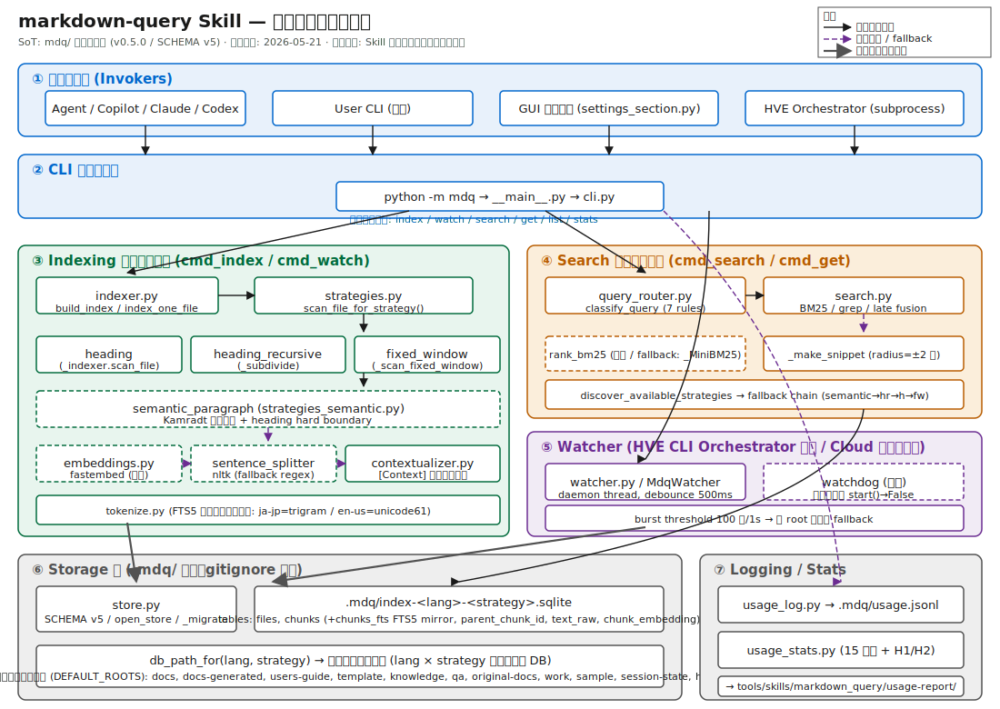
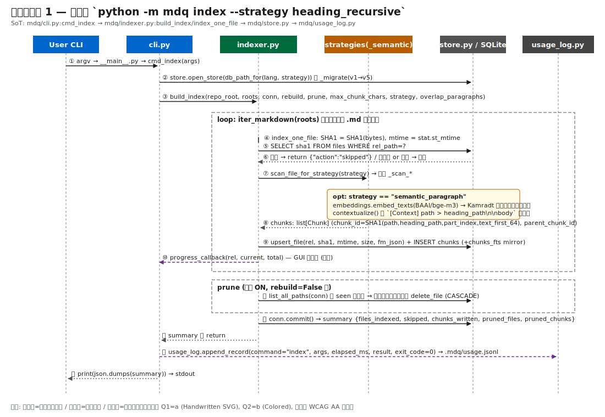
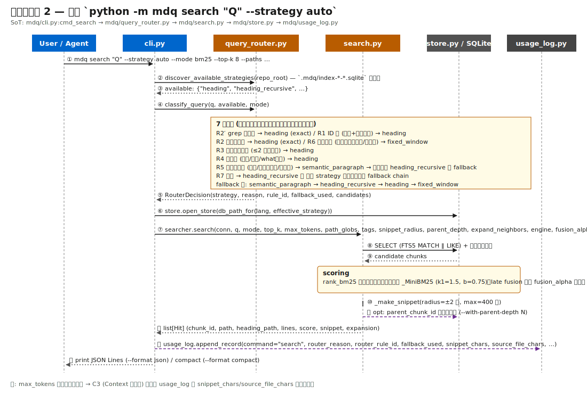
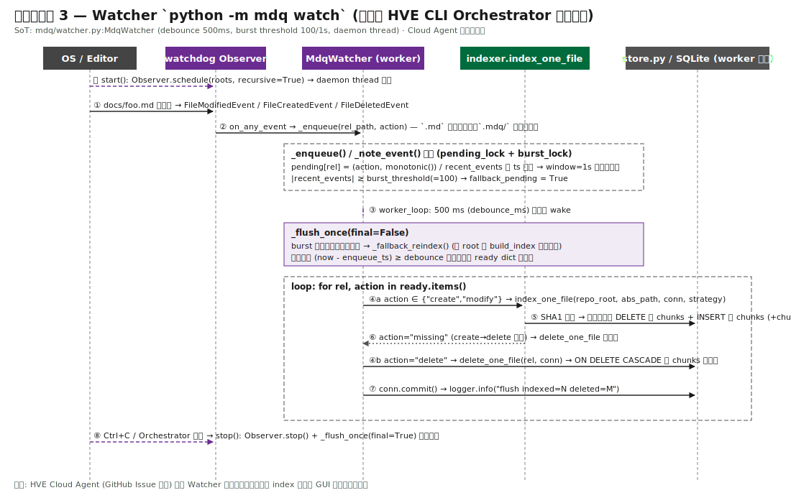
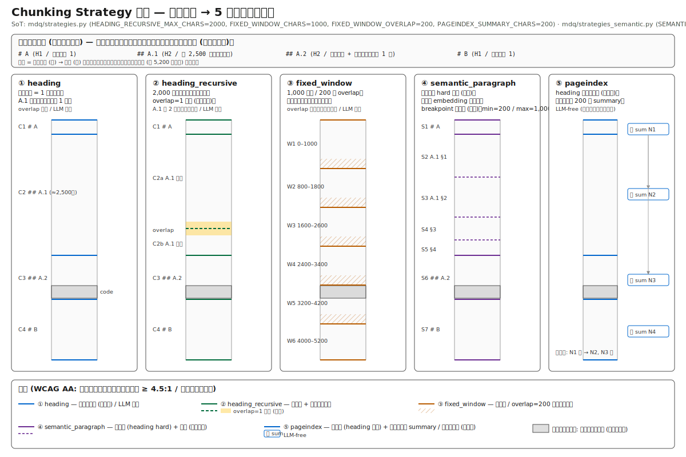

# skills: markdown-query 技術リファレンス & 利用統計ガイド

> **本ページは HVE リポジトリ固有の技術リファレンスです。汎用 Skill 仕様は [.github/skills/markdown-query/SKILL.md](../.github/skills/markdown-query/SKILL.md) を参照してください。**

このページは以下 2 つの目的を持つ:

1. **markdown-query Skill (mdq パッケージ) の技術アーキテクチャ詳細** — Skill をフォーク／カスタマイズする予定の開発者向けに、構成要素・メッセージフロー・Chunking Strategy・索引データファイルと更新頻度を SVG 図と共に解説する（§ 1〜§ 4）。
2. **利用統計 GUI / レポートの指標定義** — HVE GUI 設定画面 → `skills` → `Markdown-Query` セクションで表示される 15 指標の定義・算出式・解釈ガイド（§ 5 以降）。

## 目次

| § | 章 | 主な対象読者 |
|---|---|---|
| 1 | [技術アーキテクチャ概要](#1-技術アーキテクチャ概要) | Skill カスタマイズ予定の開発者 |
| 2 | [メッセージフロー (3 シーケンス)](#2-メッセージフロー-3-シーケンス) | 同上 |
| 3 | [Chunking Strategy 詳説](#3-chunking-strategy-詳説) | 同上 + 検索品質チューニング担当 |
| 4 | [索引データファイルと更新頻度](#4-索引データファイルと更新頻度) | 運用担当 |
| 5 | [独立 GUI ランチャー](#独立-gui-ランチャー他リポジトリでも利用可能) | 別リポジトリ移植担当 |
| 6 | [Tokenize 言語と Chunking Strategy (CLI)](#tokenize-言語と-chunking-strategy) | CLI 利用者 |
| 7 | [GUI: 複数 Strategy 一括ビルド](#gui-複数-strategy-の一括ビルドと-strategy-別統計) | GUI 利用者 |
| 8 | [対象フォルダ (target_folders)](#対象フォルダ-target_folders) | Orchestrator 連携担当 |
| 9 | [統計レポート構造と 15 指標](#統計レポートの構造) | 運用 / 品質管理 |

---

## 1. 技術アーキテクチャ概要

markdown-query Skill の実体は HVE リポジトリ同梱の `mdq/` Python パッケージである。
**ローカル完結**（外部 API 呼び出しなし、`.mdq/` 配下に SQLite で永続化）であり、CLI・GUI・HVE Orchestrator のいずれからも `python -m mdq` サブプロセスとして起動される。



> 図中の色分けは以下の WCAG AA 準拠パレット (背景白に対しコントラスト比 ≥ 4.5:1)。Microsoft Azure Well-Architected の design-diagrams ガイダンス (凡例・方向性矢印・color+pattern 併用) に従う。
>
> - 青系 `#0066CC` = 呼び出し元 / CLI 層
> - 緑系 `#006B3C` = Indexing 層
> - 橙系 `#B85C00` = Search 層
> - 紫系 `#6B2C91` = Watcher 層 (任意)
> - 灰系 `#525252` = Storage / Logging 層
> - 赤系 `#8B0000` (破線枠) = 任意外部依存

### 1.1 構成要素サマリ

| グループ | モジュール | 役割 | 起動契機 |
|---|---|---|---|
| ① 呼び出し元 | Agent / User CLI / GUI / HVE Orchestrator | `python -m mdq` サブプロセスを起動 | 検索リクエスト・索引更新要求・watcher 起動 |
| ② CLI 層 | `mdq/__main__.py`, `mdq/cli.py` | argparse でサブコマンド振り分け + usage_log 記録 | `index` / `search` / `get` / `list` / `stats` / `watch` |
| ③ Indexing | `indexer.py`, `strategies.py`, `strategies_semantic.py`, `strategies_pageindex.py`, `embeddings.py`, `sentence_splitter.py`, `contextualizer.py`, `tokenize.py` | Markdown を Chunking Strategy ごとに分割し、永続化用 row を生成 | `cmd_index` / `cmd_watch` |
| ④ Search | `query_router.py`, `search.py` | クエリを 7 ルールで分類して strategy 選定 → BM25 検索 → snippet 生成 | `cmd_search` / `cmd_get` |
| ⑤ Watcher | `watcher.py` (watchdog) | ファイル変更を daemon thread で監視し増分索引 | `cmd_watch` または HVE CLI Orchestrator から組み込み起動 |
| ⑦ Storage | `store.py` + `.mdq/index-<lang>-<strategy>.sqlite` | スキーマ管理 (SCHEMA v6) + マイグレーション + CRUD | `open_store()` 経由 |
| ⑦ Logging | `usage_log.py` + `usage_stats.py` + `.mdq/usage.jsonl` | 全 CLI 呼び出しを append-only JSONL に記録 → 15 指標集計 | 全サブコマンド完了時 |

### 1.2 設計上の重要な前提

- **物理ファイル分離**: 索引 DB は `(lang, strategy)` の組み合わせごとに独立した SQLite ファイル `.mdq/index-<lang>-<strategy>.sqlite` を持つ (`store.db_path_for`)。これにより、検索時に Strategy だけを切り替えれば適切な DB が選択される。
- **既定 11 ディレクトリ走査** (`mdq/cli.py:DEFAULT_ROOTS`): `docs, docs-generated, users-guide, template, knowledge, qa, original-docs, work, sample, session-state, hve-dev`。GUI `target_folders` 設定で上書き可能。
- **任意拡張**: `watchdog` (Watcher)、`rank_bm25` (検索スコア)、`fastembed + nltk + numpy` (semantic_paragraph) は任意依存。未導入時は `_MiniBM25` / regex sentence splitter / `heading_recursive` フォールバックで動作する。
- **Cloud Agent 制約**: HVE Cloud Agent Orchestrator (GitHub Issue 起点) では Watcher daemon thread は起動しない。手動 `mdq index` または GUI 索引化で索引を更新する。

### 1.3 SoT (Source of Truth) ファイル一覧

| 機能 | SoT ファイル | 主要シンボル |
|---|---|---|
| サブコマンド振り分け | `mdq/cli.py` | `cmd_index` (L90), `cmd_search` (L149), `cmd_get` (L276), `cmd_list` (L306), `cmd_stats` (L334), `cmd_watch` (L353) |
| 索引ビルド | `mdq/indexer.py` | `build_index` (L643), `index_one_file`, `delete_one_file`, `_sha1_bytes` |
| Strategy 分岐 | `mdq/strategies.py` | `ALL_STRATEGIES`, `scan_file_for_strategy`, `_scan_fixed_window` |
| Semantic 分割 | `mdq/strategies_semantic.py` | `SEMANTIC_*` 定数, `scan_file_semantic_paragraph`, `_RUNTIME_CONFIG` |
| PageIndex 分割 | `mdq/strategies_pageindex.py` | `PAGEINDEX_*` 定数, `scan_file_pageindex`, `_RUNTIME_CONFIG` |
| クエリ分類 | `mdq/query_router.py` | `classify_query` (L200), `discover_available_strategies` (L317), `_FALLBACK_ORDER` |
| 検索 | `mdq/search.py` | `Hit`, `_MiniBM25`, `_make_snippet` |
| ストレージ | `mdq/store.py` | `SCHEMA`, `_migrate` (v1→v5), `open_store`, `db_path_for` |
| Watcher | `mdq/watcher.py` | `MdqWatcher`, `_flush_once`, `_fallback_reindex`, `_note_event` |
| 利用ログ | `mdq/usage_log.py` | `append_record`, JSONL スキーマ |

---

## 2. メッセージフロー (3 シーケンス)

### 2.1 索引化シーケンス — `python -m mdq index`

`build_index` は roots 配下を走査し、ファイル単位で SHA1 比較 → 変更があれば Chunking Strategy で分割 → SQLite へ upsert する。`prune=True` 既定で、ストア上に残るが disk から消えたファイルを削除する。



主要ポイント:

- **増分判定**: `index_one_file` は `(stored_sha1, current_sha1)` 一致時に `{"action":"skipped"}` を返す (`mdq/indexer.py` L550)。SHA1 は `_sha1_bytes(raw_bytes)`、mtime は `Path.stat().st_mtime`。
- **chunk_id 安定性**: SHA1(path \0 heading_path \0 part_index \0 text_first_64) で生成 (L352)。行番号変動に強い。
- **semantic_paragraph 専用処理**: 埋め込み生成 → Kamradt 二分探索で意味境界決定 → `contextualizer.contextualize()` で `[Context] {path} > {heading_path}\n\n{body}` を本文に prepend。原文は `chunks.text_raw`、埋め込み (任意) は `chunks.chunk_embedding` 列に保存。
- **書き込み完了後**: `usage_log.append_record` が `.mdq/usage.jsonl` に 1 行 JSON を append (`command="index"`, args, elapsed_ms, result, exit_code)。

### 2.2 検索シーケンス — `python -m mdq search --strategy auto`

`--strategy auto` 時は `query_router.classify_query` がクエリを 7 ルールで分類し、選定 strategy の DB が存在しなければ fallback chain でフォールバックする。



7 ルールの優先順 (上から評価、最初に該当したものを採用):

| Rule | 条件 | 選択 strategy | reason ID |
|---|---|---|---|
| R2′ | `--mode grep` | heading | `exact_match` |
| R1 | ID 風 (英数+ハイフンの単語) | heading | `id_lookup` |
| R2 | 引用符付き完全一致 | heading | `exact_match` |
| R6 | コード片 (バッククォート / 記号密) | fixed_window | `code_fragment` |
| R3 | 短い固有名詞 (≤ 2 トークン) | heading | `short_proper_noun` |
| R4 | 概念語 (`概要` / `とは` / `what` 等) | pageindex (不在時はフォールバック) | `concept_overview` |
| R5 | 物語的質問 (`なぜ` / `どのように` / `?`) | semantic_paragraph (不在時 heading_recursive) | `narrative_query` |
| R7 | 既定 | heading_recursive | `default` |

**Fallback chain** (`mdq/query_router.py:_FALLBACK_ORDER`):
`pageindex → semantic_paragraph → heading_recursive → heading → fixed_window`
選定 strategy の DB が `.mdq/index-*-*.sqlite` に存在しなければ、この順で利用可能な最初のものへ切り替わる (`fallback_used=True` が usage_log に記録され、H1 指標で可視化される)。

その他の重要ポイント:

- **BM25 実装**: `rank_bm25` パッケージがあれば使用、無ければ `_MiniBM25` (k1=1.5, b=0.75) で stdlib のみで完結。
- **Snippet 生成**: 最もマッチ語トークンが多い行を中心に半径 2 行・最大 400 字を切り出し (`_make_snippet`)。
- **Parent expansion**: `--include-parent` (深さ 1) / `--with-parent-depth N` 指定時に `chunks.parent_chunk_id` を再帰取得して `expansion.parent` に含める。SCHEMA v4 で導入。
- **Late fusion (任意)**: semantic_paragraph + `--late-chunking` 索引時の `chunk_embedding` 列がある場合、`--fusion-alpha α` で BM25 と embedding 類似度を線形加重で統合する。

### 2.3 Watcher シーケンス — `python -m mdq watch`

`MdqWatcher` は watchdog の `Observer` を daemon thread で起動し、`.md` ファイル変更を `pending` dict に enqueue → debounce 500ms ごとに `_flush_once` で増分索引する。バースト時は全 root 再走査にフォールバックする。



主要パラメータ (CLI フラグ / GUI 設定で上書き可):

| 項目 | 既定値 | 役割 |
|---|---|---|
| `debounce_ms` | 500 ms | 連続変更を 1 回の flush にまとめる |
| `burst_threshold` | 100 件 | バースト判定の閾値 |
| `burst_window_s` | 1.0 s | バースト判定の時間窓 |
| `bursts → fallback` | 全 root 再走査 (`_fallback_reindex` = `build_index`) | git pull や一括 IDE フォーマット等の大量変更を効率処理 |

**競合処理**:

- create → 直後 delete の race は `index_one_file` が `{"action":"missing"}` を返した時点で `delete_one_file` で掃除 (`mdq/watcher.py` L266-272)。
- worker 専用 SQLite 接続を flush ごとに開き直す (Windows のロック競合回避)。

**Cloud Agent では起動しない**: HVE Cloud Agent (GitHub Issue 起点) は短命プロセスで I/O 完了次第終了するため Watcher daemon thread を立てない。CLI Orchestrator では起動する。

---

## 3. Chunking Strategy 詳説

`mdq.strategies.ALL_STRATEGIES` に 5 種の戦略が定義されている。同一 Markdown 入力に対する境界の違いは以下（図は `heading` / `heading_recursive` / `fixed_window` / `semantic_paragraph` の 4 種を表示。`pageindex` は `heading` と同じ境界で + ノードごとの `summary` カラムを付与するため、独立のレーンは割り当てていない。詳細は §3.1 を参照）:



### 3.1 戦略別パラメータ一覧 (コード定数)

| 戦略 | 主要定数 | 既定値 | overlap | 任意依存 |
|---|---|---|---|---|
| `heading` (既定 / legacy) | `max_chunk_chars` (CLI 引数) | 0 (無制限) | なし | なし |
| `heading_recursive` | `HEADING_RECURSIVE_MAX_CHARS` | 2,000 字 | `overlap_paragraphs=1` 段落 | なし |
| `fixed_window` | `FIXED_WINDOW_CHARS` / `FIXED_WINDOW_OVERLAP` | 1,000 / 200 字 | 200 字スライド | なし |
| `semantic_paragraph` | `SEMANTIC_MIN_CHARS` / `SEMANTIC_MAX_CHARS` / `SEMANTIC_PERCENTILE_LO` / `SEMANTIC_PERCENTILE_HI` | 200 / 1,000 / 50 / 99 | なし (意味境界自動) | `[semantic]` extra: fastembed + nltk + numpy |
| `pageindex` | `PAGEINDEX_SUMMARY_CHARS` / `PAGEINDEX_SUMMARY_MODE` | 200 / `head` | なし (見出し境界は `heading` と同じ) | なし (LLM 不要) |

### 3.2 戦略カスタマイズの勘所

Skill をフォークしてカスタム Strategy を追加する場合の手順:

1. **`mdq/strategies.py` に `_scan_<name>(path, repo_root, max_chunk_chars, **kwargs) -> list[Chunk]` を実装**。`Chunk` は `(rel_path, heading_path, start_line, end_line, body, part_index, parent_chunk_id)` のタプル風 dict。
2. `ALL_STRATEGIES` に `"<name>"` を追加し、`scan_file_for_strategy(strategy)` の dispatcher に分岐を追加。
3. `mdq/query_router.py:_FALLBACK_ORDER` の適切な位置に挿入。新ルールを追加する場合は `classify_query` 内に分岐を追加。
4. `mdq/store.py` のスキーマ拡張が必要なら `_migrate()` に `if current_version < N: ALTER TABLE …` を **ADD COLUMN ベース** で追加 (DROP / RENAME は破壊的なので避ける)。`SCHEMA_VERSION` をインクリメント。
5. `mdq/tests/` にユニットテストを追加。境界ケース (空ファイル / 巨大ファイル / 見出しのみ) を網羅。

### 3.3 contextualize テンプレート (semantic_paragraph)

`mdq/contextualizer.py:TEMPLATE`:

```text
[Context] {path} > {heading_path}

{body}
```

これを prepend した文字列を `chunks.body` に保存し、原文は `chunks.text_raw` に保存する。検索 hit の snippet には contextualize 済み body が使われるため、Agent が hit の意味的位置を即時把握できる。`--no-semantic-contextualize` で無効化可能 (その場合 `text_raw` は NULL)。

---

## 4. 索引データファイルと更新頻度

`.mdq/` 配下に永続化される全ファイルと、その更新トリガ・頻度の対応表。`.mdq/` は `.gitignore` 推奨。

### 4.1 ファイル × 更新契機 マトリクス

| ファイル / テーブル | 役割 | 更新契機 | 典型的な更新頻度 | サイズ目安 |
|---|---|---|---|---|
| `.mdq/index-<lang>-<strategy>.sqlite` の `files` テーブル | ファイル単位の SHA1 / mtime / size / frontmatter | `cmd_index` 実行時、Watcher の `_flush_once` (500 ms ごと) | 中 (編集量に応じて) | 〜数 MB |
| 同 `chunks` テーブル | 分割後のチャンク本文 + heading_path + part_index + parent_chunk_id | 同上 | 同上 | 数十〜数百 MB |
| 同 `chunks_fts` (FTS5 mirror) | 全文検索用トークン索引 (SCHEMA v3 以降) | `chunks` への INSERT/DELETE と同一トランザクション | 同上 | `chunks` の 0.5〜1.5 倍 |
| 同 `chunks.text_raw` 列 (v5 で追加) | contextualize ON 時の原文保存 | semantic_paragraph 索引時のみ | 索引再構築時 | `chunks.body` の 0.7 倍程度 |
| 同 `chunks.chunk_embedding` 列 (v5 で追加) | float32 埋め込みベクトル (1024 次元 intfloat/multilingual-e5-large) | semantic_paragraph + `--late-chunking` 索引時のみ | 索引再構築時 | チャンク数 × 4 KB |
| 同 `chunks.summary` 列 (v6 で追加) | pageindex のノードサマリ（先頭 N 文字抽出） | pageindex 索引時のみ | 索引再構築時 | チャンク数 × 最大 2 KB |
| `.mdq/usage.jsonl` | 全 mdq CLI 呼び出しの append-only ログ | 全サブコマンド完了時 (index / search / get / list / stats) | 高 (検索ごと 1 行) | 1 行 ~500 B、月数 MB 〜 |
| GUI 利用統計レポート (`tools/skills/markdown_query/usage-report/*.md`) | 15 指標の人間可読集計 | GUI 起動時に前回生成から 24h 超なら自動再生成、または「再生成」ボタン手動実行 | 1 日 1 回 〜 | 数 KB |
| HVE GUI 設定 (`hve/.settings.txt` の `[mdq]` セクション) | target_folders / build_strategies / semantic_* | GUI で「保存」または target_folders 変更 (即時保存) | 低 (運用変更時のみ) | 数 KB |

### 4.2 索引整合性の前提と運用 Tips

- **増分索引の信頼境界**: `index_one_file` は `(stored_sha1 == current_sha1)` で skip するため、`.git` の checkout や `git restore` のように **内容が同じだが mtime が変わる** ケースでも余計な再索引は走らない。逆に **mtime が変わらず内容だけ書き換わる** ケース (極めて稀) は検知されない。完全性が要件なら `--rebuild` を使用する。
- **Strategy 切り替え時の所要時間**: 新 Strategy の索引は同 lang・別 strategy として **別 DB ファイル** に生成されるため、既存 DB は触らない。並行運用可能。
- **DB 破損時の復旧**: `.mdq/index-<lang>-<strategy>.sqlite` を削除して `python -m mdq index --strategy <name>` で再生成すれば良い。`.mdq/usage.jsonl` は索引と独立なので削除不要。
- **Cloud Agent 環境での運用**: Watcher が無いため、Issue 処理開始時に `python -m mdq index` を 1 回流すか、または既存索引 (CI で生成しコミット) を使用する。HVE では `.mdq/` を gitignore しているため、Cloud Agent 起動時に Orchestrator から `mdq index` を実行する設計を推奨。
- **同一 (lang, strategy) の並行書き込み禁止**: SQLite ファイルロックで Windows では失敗する。Watcher 実行中に手動 `mdq index` を流す場合は Watcher を停止すること。

### 4.3 usage.jsonl のスキーマ

`mdq/usage_log.py:append_record` が以下のフィールドを持つ JSON Line を 1 行ずつ追記する:

```json
{
  "ts": "2026-05-21T12:34:56.789Z",
  "command": "search",
  "args": {"q": "…", "mode": "bm25", "strategy": "auto", "effective_strategy": "heading_recursive",
            "router_reason": "default", "router_rule_id": 7, "router_fallback_used": false, "…": "…"},
  "elapsed_ms": 42,
  "result": {"hit_count": 8, "snippet_chars": 1234, "source_file_chars": 56789,
              "score_top": 12.3, "score_2nd": 9.8, "parent_expanded": 2},
  "exit_code": 0,
  "context": {"repo_root": "/abs/path"}
}
```

C1〜C3 (Context 削減率)、H1 (Strategy 分布)、H2 (parent 展開率) などの指標はこの JSONL を `usage_stats.py` が集計して算出する。

---

## 独立 GUI ランチャー（他リポジトリでも利用可能）

`tools/skills/markdown_query/` を別リポジトリへフォルダごとコピーすると、HVE 本体に
依存せずに同じ設定画面を起動できる。詳細は以下を参照:

- セットアップ手順: `tools/skills/markdown_query/README.md`<!-- TBD: SETUP.md は不在、README.md にセットアップスクリプトと使い方が集約されている -->
- 画面の使い方: [tools/skills/markdown_query/USAGE.md](../tools/skills/markdown_query/USAGE.md)
- 画面の実体: [`MdqIndexSection`](../tools/skills/markdown_query/gui/settings_section.py)
  — HVE GUI と独立ランチャーの両方が同じクラスを参照する単一 SoT。

スクリーンショット（基本タブ）:


レポートはローカルで生成され、`tools/skills/markdown_query/usage-report/`
配下に保存される。GUI 起動時に最新生成が 24 時間以上前であれば自動再生成される（設定画面の
「利用統計レポートの再生成」ボタンでも手動再生成可能）。

## Tokenize 言語と Chunking Strategy

GUI 設定画面（および `hve-mdq` CLI の `--lang` / `--strategy`）で **言語** と
**Chunking Strategy** を選択できる。索引 DB は組み合わせごとに別ファイルとして
作成される。

- 言語: `ja-jp`（既定）/ `en-us`
  - `ja-jp`: FTS5 で `trigram` tokenizer を使用（SQLite 3.34+ で標準搭載）。
    未対応環境では `unicode61` にフォールバック。
  - `en-us`: FTS5 で `unicode61` tokenizer を使用。
- Chunking Strategy:
  - `heading`（既定）: Markdown 見出しごとに 1 chunk。Context 効率を最優先。
  - `heading_recursive`: 見出し chunk が 2,000 文字を超える場合に段落/行で再分割。
    **段落単位の overlap（既定 1 段落、`--overlap-paragraphs` で 0〜5 可変）** をサポートし、
    サブチャンク間の文脈断絶を緩和する。コードフェンスは overlap の対象外。
  - `fixed_window`: 見出し構造を無視し、1,000 文字 / overlap 200 文字の
    スライディングウィンドウで分割。RAG 用途で順序保証を重視する場合に有効。
  - `semantic_paragraph`: 見出しを **hard boundary** とし、各見出し chunk 内を
    文 embedding 類似度 (Kamradt-modified バイナリサーチ) でさらに分割。
    既定で `[Context] {path} > {heading_path}` テンプレートを prepend
    （原文は `text_raw` 列に保存）。`pip install -e .[semantic]` で
    fastembed + nltk + numpy を追加し、`intfloat/multilingual-e5-large` を既定 model として使用
    （初回 ~2GB DL）。`--late-chunking` で `chunk_embedding` 列に
    float32 ベクトルを保存し、`search --fusion-alpha` で線形加重統合する。
  - `pageindex`: 見出しベースのツリー索引を構築し、各ノードに
    サマリ（先頭 N 文字抽出）を `chunks.summary` 列に保存 (SCHEMA v6)。
    LLM 不要。`--pageindex-summary-chars N`（既定 200）、
    `--pageindex-summary-mode head|first_paragraph`（既定 `head`）で調整。
    検索時 `mdq search --pageindex-tree-depth N` でルート→ヒットの
    サマリ連鎖を `expansion.tree_path` に返す。
  - `auto`（`search` 既定）: クエリ内容から最適な戦略を自動選択。詳細は
    [.github/skills/markdown-query/references/query-routing.md](../.github/skills/markdown-query/references/query-routing.md)。
- 親チェーン取得: `--include-parent`（深さ 1）または `--with-parent-depth N`（N≥1）で
  ヒットチャンクの直近上位見出しチェーンを `expansion.parent` に含められる。
  実装は SCHEMA v4 で追加された `parent_chunk_id` 列を優先し、未設定時は heading_path
  rsplit にフォールバックする（後方互換）。
- DB ファイル命名: `.mdq/index-<lang>-<strategy>.sqlite`
  - 例: `.mdq/index-ja-jp-heading.sqlite`, `.mdq/index-en-us-fixed_window.sqlite`,
    `.mdq/index-ja-jp-pageindex.sqlite`
- SCHEMA v5: `text_raw`（原文。contextualize ON の場合のみ非 NULL）と
  `chunk_embedding`（float32 BLOB。`--late-chunking` 有効時のみ非 NULL）列が追加された。
- SCHEMA v6 (現行): `summary`（`pageindex` ストラテジ時のノードサマリ。
  それ以外のストラテジでは NULL）列が追加。
  いずれも ADD COLUMN マイグレーションで既存 DB は破壊されない。

CLI 利用例:

```sh
# 日本語・heading_recursive 戦略でインデックスを再構築（overlap=2 段落）
python -m mdq index --lang ja-jp --strategy heading_recursive --overlap-paragraphs 2

# semantic_paragraph 戦略でインデックスを構築（contextualize 既定 ON、late-chunking opt-in）
pip install -e .[semantic]
python -m mdq index --strategy semantic_paragraph --max-chunk-chars 1000 --late-chunking

# 英語・auto strategy で検索（クエリから戦略を自動選択）
python -m mdq search --lang en-us --q "design pattern overview" --with-parent-depth 2
```

`--db` を明示すると `--lang/--strategy` から導出されるパスを上書きできる。

## GUI: 複数 Strategy の一括ビルドと Strategy 別統計

設定画面の [基本] タブと [インデックス管理] タブで、複数の Chunking Strategy
を並行管理できる。検索時は `mdq search --strategy auto`（`search` サブコマンドの
既定）または `query_router` 経由でクエリごとに最適な Strategy のインデックスが
自動選択されるため、通常は **全 Strategy のインデックスをビルドしておくこと**
が推奨される。

- **基本タブ: 「一括ビルド対象 Strategy」**
  - `mdq.strategies.ALL_STRATEGIES` の全項目がチェックボックスとして表示される。
    既定では全選択（= 設定上は空文字列として保存）。
  - 「選択 Strategy を一括ビルド」ボタンで、選択中の全 Strategy の
    インデックスを直列にビルドする。各 Strategy は独立した DB ファイル
    `.mdq/index-<lang>-<strategy>.sqlite` に書き込まれる。
  - 実行中は「ビルドをキャンセル」ボタンが有効化される。キャンセル時は
    実行中の Strategy 完了後にキューが破棄され、残り Strategy はスキップされる。
- **基本タブ: 「semantic_paragraph 専用設定」**（Strategy 選択時のみ表示）
  - max_chunk_chars / min_chars / breakpoint percentile lo・hi / embed_provider /
    embed_model / contextualize（既定 ON） / late_chunking / fusion_alpha を編集できる。
  - `[semantic]` extra (`pip install -e .[semantic]`) が未インストールの場合は
    赤いバナーが表示され、フォームは無効化される。ビルド時は
    `heading_recursive` に自動フォールバックする旨が結果欄に表示される。
  - 各値は `[mdq] semantic_*` キーで設定ファイルに保存される。0 / 空文字列は
    `mdq.strategies_semantic` の SEMANTIC_* 既定値（コード側）を使う指示。
  - fusion_alpha スライダーは `late_chunking` ON のときのみ表示される。
- **基本タブ: 「pageindex 専用設定」**（Strategy 選択時のみ表示）
  - 情報バナー（青系）: 「pageindex は見出しベースのツリー索引を構築し、
    各ノードにサマリ（先頭抽出）を保存します。LLM 呼び出しは行いません
    (Index-only)。」
  - `ノードサマリ最大文字数` (`pageindex_summary_chars`): 0、2000、
    `setSpecialValueText("既定 (200)")`。0 でコード側既定 `PAGEINDEX_SUMMARY_CHARS=200`。
  - `サマリ抽出方式` (`pageindex_summary_mode`): 「先頭抽出 (head)」 /
    「最初の段落 (first_paragraph)」の 2 選択。既定 `head`。
  - `ツリー展開既定深さ` (`pageindex_default_tree_depth`): 0、10。
    0 = 明示指定時のみ展開。1 以上 = `mdq search` で常に親方向 N 段の
    summary 列を返す既定値（CLI `--pageindex-tree-depth N` と同義）。
  - プレビュー機能（折りたたみ・既定閉）: 任意の Markdown ファイルを選択し
    現在の設定で in-memory ビルドし、ツリー構造と各ノードのサマリを
    インデント付きで表示する。**索引 DB は変更されない**。
  - 依存追加不要のため `semantic_paragraph` と違い赤バナー（extras 未導入警告）
    は表示されない。
- **インデックス管理タブ: ボタン群**
  - 「インデックスの手動更新」: 増分ビルド（SHA-1 一致でスキップ）。
  - 「完全再ビルド」: 確認ダイアログ後に `rebuild=True` で実行。SHA-1 一致でもすべて
    再走査する。semantic_paragraph では埋め込みもやり直す。
  - 「DB を削除」: 二重確認後に `.mdq/index-<lang>-<strategy>.sqlite` を unlink。
    削除後は「未作成」状態になり、再ビルドが必要。Windows で別プロセス（mdq watcher 等）
    が DB を保持している場合は失敗するため、watcher を停止してから再試行する。
  - ビルド進捗はファイル単位（"索引中: 3/12 — docs/foo.md"）でプログレスバーに反映される。
- **インデックス管理タブ: 「Strategy 別インデックス統計」**
  - 全 Strategy について DB 存在有無 / ファイル数 / チャンク数 / 最終更新時刻を
    表形式で一覧表示する。未生成 Strategy は files=0 / chunks=0 で表示される。
  - 一括ビルド実行中も各 Strategy 完了後に表が逐次更新される。
- **インデックス管理タブ: 「試し検索」（既定折りたたみ）**
  - top_k=3 の検索結果を `(path / heading_path / score / snippet)` のテーブルで表示。
  - semantic_paragraph + late_chunking が有効な場合のみ、設定の `fusion_alpha` を
    使った線形加重 fusion で検索する（それ以外は通常の BM25）。
- **設定キー** (`[mdq] build_strategies`): `";"` 区切りの Strategy 名。
  空文字列 = 全 Strategy 選択扱い（= 既定）。未知の Strategy 名は黙って除外される。

## 利用統計の追加指標（v2.0 / schema_version=2）

`mdq.usage_stats.aggregate_usage_stats()` に以下の 2 指標が追加された:

- **H1_auto_strategy_distribution**: `--strategy auto` 実行で query_router が選択した
  reason / effective_strategy の分布、フォールバック率。
- **H2_parent_expansion_rate**: `--include-parent` / `--with-parent-depth ≥ 1` を
  伴う search のうち、実際に parent チャンクが返却された比率。

詳細スキーマは
[.github/skills/markdown-query/references/query-routing.md](../.github/skills/markdown-query/references/query-routing.md)
を参照。

## 対象フォルダ (target_folders)

GUI 設定画面 → `skills` → `Markdown-Query` の「**対象フォルダ**」セクションで、Markdown-Query Skill の動作対象フォルダを **複数指定** できる。設定は `hve/.settings.txt` の `[mdq] target_folders` キーに、リポジトリ相対 POSIX パスを `;` 区切りで保存される。

### UI 操作

- **フォルダを選択...**: ネイティブのフォルダ選択ダイアログを開く。リポジトリ外を選んだ場合は自動的に拒否される。
- **入力欄から追加**: テキストボックスにリポジトリ相対パス（例: `docs/usecase`）を入力し Enter または [入力欄から追加] ボタン。
- **選択行を削除**: リスト内の行を選択して [選択行を削除]。
- 追加・削除は即時 `hve/.settings.txt` に保存される（手動 [保存] ボタンは不要）。

### 効果

`target_folders` を **1 件以上設定**したときの挙動:

1. **mdq インデックス対象の上書き**
   `python -m mdq index`（GUI の「インデックスの手動更新」含む）が、`mdq/cli.py::DEFAULT_ROOTS` ではなく `target_folders` を索引対象として使用する。索引と検索範囲を一致させるため。
2. **Agent への Markdown-Query Skill 利用強制**
   HVE Cloud Agent Orchestrator / CLI Orchestrator が Agent を起動する際、`additional_prompt` の先頭に強制ブロックが自動注入される。Agent は対象フォルダ配下の `.md` を参照する際に `read_file` / `grep_search` より先に `python -m mdq search` を最優先で使用するよう指示される。

`target_folders` が **未設定（空）** の場合は、いずれの動作も発生せず既存の挙動（`DEFAULT_ROOTS` を使用、強制プロンプト無し）を維持する。

### 設定例

| シナリオ | target_folders 設定値 |
|---|---|
| 既定（変更しない） | （空） |
| 設計ドキュメントだけ Skill 強制したい | `docs;users-guide` |
| ユースケース文書のみ | `docs/usecase` |

### 注意事項

- `target_folders` を変更しても **索引の再構築は自動実行されない**。GUI 上で「インデックスの手動更新」を実行するか、`python -m mdq index --rebuild` を実行すること。
- 強制プロンプトは Agent への「指示」であり、LLM の応答に依存する。順守率の確認には GUI の利用統計レポート（`A1` / `A2`）が利用できる。

## 統計レポートの構造

レポートには大きく以下 2 つのセクションが表示される。

1. **インデックスの統計情報**
   `.mdq/index-<lang>-<strategy>.sqlite` 索引 DB の現状（ファイル数・チャンク数・最終更新時刻・FTS5 有効/無効・
   ルート別件数）。Skill が「使う前に索引を作る」前提を満たしているかを確認するための情報。
2. **markdown-query Skill 利用統計情報**
   下記 15 指標。`.mdq/usage.jsonl`（mdq CLI 呼び出し時に自動追記）と
   現在選択中の `.mdq/index-<lang>-<strategy>.sqlite` から集計される。直近 7 日間がデフォルトの集計ウィンドウ。
   なお JSONL には lang/strategy が記録されないため、集計値は全組み合わせ横断となる（レポートメタ表示は「表示中の DB」ラベルに過ぎない）。

## v1 採用 15 指標

各指標の **値の出方** と **解釈の指針**を併記する。
値が `（データ不足）` と表示される場合、その指標を算出するためのサンプルが集まっていないことを意味する（捏造値で 0 などを表示しない）。

### グループ① 基盤・索引（4 項目）

#### E1 索引サイズ（files / chunks）

- 算出: `mdq stats` の `files` / `chunks`。
- 解釈: 索引対象のファイル数とチャンク数。極端に少ない場合は索引未生成、
  または対象ディレクトリ（既定 `docs/`, `docs-generated/`, `users-guide/`, `template/`,
  `knowledge/`, `qa/`, `original-docs/`, `work/`, `sample/`, `session-state/`, `hve-dev/`）が
  存在しない可能性がある。

#### E2 索引鮮度（age_seconds）

- 算出: `now - .mdq/index-<lang>-<strategy>.sqlite mtime`。
- 解釈: 索引 DB の最終更新からの経過秒数。SKILL.md 「使う前に必ず 1 回実行」
  順守の代理指標。極端に大きい値は索引が古く、search 結果が古いことを示す。

#### E5 孤児チャンク削除累計

- 算出: 集計対象期間内の `mdq index` 実行で `pruned_chunks` の合計。
- 解釈: ディスク上から削除されたファイルに紐づくチャンクが索引から除去された累計件数。
  異常に大きい場合はワークスペース内で大量のファイル移動・削除が発生している兆候。

#### F2 索引差分更新比率

- 算出: 各 `mdq index` 実行の `files_indexed / (files_indexed + files_skipped)` の平均。
- 解釈: 1.0 に近いほど「ほぼ全件再索引」を意味し、増分更新が効いていない疑い。
  0 に近いほど差分更新が機能している（≒ 効率的）。

### グループ② 呼び出し量・選択妥当性（4 項目）

#### A1 サブコマンド別呼び出し回数

- 算出: `search` / `get` / `index` / `list` / `stats` / `watch` ごとのレコード件数。
- 解釈: Skill が呼ばれているかの最も基本的な指標。`search` がゼロのままなら
  Skill が Agent から実質的に使われていない。

#### A2 Step あたり呼び出し回数 (全 Workflow)

- 算出: `context.step_id` を持つ全レコード（Workflow を問わない）について、
  `total_calls / distinct(step_id)`。
- 解釈: 1 Step あたり何回 mdq を使ったか（全 Workflow 横断の平均）。
  小さすぎる（0〜1 回）場合は Skill が Agent プロンプトから呼ばれない設計になっている可能性。
  step_id は orchestrator が環境変数 `HVE_STEP_ID` で子プロセスへ伝播する。
  step_id が無いレコード（CLI 直接実行など）は集計対象外。
- 互換性メモ: v1.1 以前は `workflow_id == "aad-web"` 限定で算出しており、
  JSON キー名は `A2_aad_web_calls_per_step` だった。v1.2 以降は
  `A2_calls_per_step` に改名し、全 Workflow を対象とする。

#### A4 Skill _routing 記載

- 算出: `.github/skills/_routing/SKILL.md` 内に `markdown-query` の文字列が存在するか。
- 解釈: `False` の場合、ルーティング表に未登録 = Agent から発見されにくい状態。導線整備の Issue 化を推奨。

#### D1 DO NOT USE FOR 違反 (knowledge/D 検索)

- 算出: `--paths` 引数に `knowledge/D...` を含む `search` レコード件数。
- 解釈: SKILL.md の DO NOT USE FOR ルール（`knowledge/D01-D21` は `knowledge-lookup` Skill の責務）違反の検知。
  0 が理想。1 以上は Skill 棲み分けが守られていない可能性。

### グループ③ Context 削減（3 項目）

#### B1 Context 削減率

- 算出: `1 - (Σ snippet_chars / Σ source_file_chars)`。
- 解釈: Skill の中核目的「Context Window 最小化」の直接指標。
  1.0 に近いほど削減効果が高い（snippet が参照元ファイル全体に対して小さい）。
  値が低い場合は `--snippet-radius` を狭める、`--top-k` を絞るなどの改善余地。

#### B2 引数平均（top_k / max_tokens / snippet_radius）

- 算出: search 呼び出しの引数平均。
- 解釈: SKILL.md 推奨範囲（`--top-k` 3〜5、`--max-tokens` 400〜800、
  `--snippet-radius` 2 前後）から外れていれば、Skill の Context 節約意図に反する呼び方をしている。

#### B3 get/search 比率

- 算出: `count(mdq.get) / count(mdq.search)`。
- 解釈: 高すぎ（> 0.5 など）= snippet で結論が出ず get で本文取得を多用 = 「結局全文読んでいる」可能性。
  極端に低い（≒ 0）= snippet のみで完結している（理想形）。

### グループ④ 結果品質（2 項目）

#### C1 ヒット 0 件率

- 算出: `count(hit_count == 0) / count(mdq.search)`。
- 解釈: クエリ語彙ミスマッチ・索引欠落の検知。0 が理想。高い場合は Agent プロンプト側の典型クエリ語彙整備、または索引対象ディレクトリの見直しが必要。

#### C2 上位 2 件 score 差（平均）

- 算出: 各 search レコードの ``score_top - score_2nd`` の平均。ヒット 2 件未満の search はサンプル外。
- 解釈: 上位 2 件の score が近接している（差が小さい）と BM25 が十分に絞り込めていない可能性。`--paths` / `--tags` の活用やクエリ語彙調整の誠便として参考にする。推奨値は未定。

#### C3 expansion フラグ使用率

- 算出: `--include-parent` / `--expand-neighbors > 0` / `--merge-parts` のいずれかを指定した search の割合。
- 解釈: 高い場合は「見出し単位チャンクで足りず周辺を展開している」状態。
  Skill のチャンク粒度が用途に合っていない、または `--max-chunk-chars` での 2 次分割設定の見直し余地がある。

### グループ⑤ パフォーマンス / 成果（2 項目）

#### F1 search 実行時間（p50 / p95）

- 算出: `mdq search` の `elapsed_ms` の 50/95 パーセンタイル。
- 解釈: Skill の応答性能。p95 が極端に大きいと Agent が回避するインセンティブが生まれる。
  索引サイズに対して遅すぎる場合は `--engine fts5` 有効化検討。

#### G1 mdq 利用 Step 完了率差

- 算出: `session-state/runs/<run_id>/state.json` を走査し、各 run の Step 完了率（`completed / 総Step 数`）を計算。`.mdq/usage.jsonl` に `context.run_id` が出現する run を「mdq 利用 run」と見なし、平均完了率の差（利用 - 未利用）を返す。
- 解釈: 正の値は mdq を利用した run のほうが完了率が高いことを意味する（仮説: 質の高いコンテキスト → ループ削減→ 完了率上昇）。少量サンプルでは偏りが大きいため、`used_run_count` / `unused_run_count` とあわせて解釈すること。どちらか一方が 0 の場合は `value` は `null` + `note` で理由を明示する。

## v2 以降の対応予定指標

以下の指標は v1 では算出していない。理由を併記する。

- **A3 mdq → read_file フォールバック率**: LLM tool call が `run_journal` に乗らないため算出不能。
- **C4 同義クエリ再検索回数**: クエリ類似度計算が必要で v1 を超える。
- **C5 引用先実在性**: git blob 突合の追加ハーネスが必要。
- **D2 編集前検索率**: Markdown 編集タイミング判定が現行ジャーナルでは取れない。
- **G2 成果物トレーサビリティ含有率**: 対象ファイル種別の定義が必要。
- **G3 Step トークン消費 before/after**: 導入前対照データが必要。

## D3 / G4（v1.1 追加実装）

### D3 典型クエリ出現率（全 workflow 横断）

- 算出: `template/typical-queries.json` の各 workflow エントリに記載された正規表現パターン（大文字小文字無視）に、search の `q` 引数が **1 つでもマッチ** した件数 ÷ 当該 workflow の search 総件数。出力 JSON のキーは `D3_typical_query_rate`（v1.1 までの `D3_aad_web_typical_query_rate` から v1.2 で BREAKING CHANGE）。
- 合算 `value`: patterns 定義済み workflow のマッチ件数合計 ÷ patterns 定義済み workflow の search 総件数合計（micro-average）。patterns 未定義の workflow は分母から除外し、サンプル不足を 0% と誤読させない。
- 内訳: `per_workflow.<workflow_id>` 配下に workflow 別の `value` / `matched_count` / `total_search` / `per_pattern` / `note` を保持する。対象 workflow は `aad-web` / `asdw-web` / `adfd` / `adfdv` の 4 つ（`hve/orchestrator.py:_ARCH_FILTER_WORKFLOWS` と同期）。
- 解釈: 1.0 に近いほど Agent が想定どおりの語彙で検索している。低い場合は典型クエリ辞書の更新、または Agent プロンプトの語彙ガイド整備が必要。
- 辞書の拡張: `template/typical-queries.json` の `workflows.<workflow_id>` 配列にエントリを追加するだけで反映される。現状 `aad-web` のみ patterns が定義済みで、他 workflow は patterns 未定義（`note: "template/typical-queries.json に <workflow_id> エントリ未定義"` として表示される）。
- 注意: 「マッチ件数の合計」ではなく「マッチした search 数」を分子にしているため、1 件の search が複数パターンにヒットしても 1 としてカウントする。

### G4 Step 再実行回数差（平均/Step）

- 算出: `session-state/runs/<run_id>/state.json` の `step_states.*.retry_count` を平均し、mdq 利用 run / 未利用 run の平均差を返す（利用 - 未利用）。
- 解釈: 負の値は mdq 利用 run の方が Step あたり再実行回数が少ない＝**質の高いコンテキスト → 失敗が減る** という仮説を支持する。正の値や差が無い場合は Skill の効果が他要因に埋もれている可能性があり、サンプルサイズと併せて解釈する。
- データソース: `StepState.retry_count`（`hve.run_state` で永続化済み）。`run_journal` への新規イベント追加は不要。

## 保留中の運用判断

### C2 推奨閾値

- 状況: v1 で C2（上位 2 件 score 差の平均）を算出可能としたが、「健全範囲」の閾値は未定。
- 判断材料が揃う条件: 同一ワークスペースで `aad-web` 等の代表ワークフローを **30 run 以上** 実行し、`tools/skills/markdown_query/usage-report/*.json` の C2 値分布（p10/p50/p90）を集計できた時点。
- 進め方: 集計結果と「Skill 改善前後の B1 削減率の変化」を突合し、C2 が小さい時に B1 が悪化する傾向が出れば、その境界を黄信号閾値として users-guide に明記する。

### v2 残指標の段階対応

- 対象: A3 / C4 / C5 / D2 / G2 / G3（v1.1 で **D3 / G4 は実装済**）
- 各々前提が異なるため一括実装は行わず、需要が出た時点で次の優先順で着手する想定:
  1. **C4 同義クエリ再検索回数**（クエリ正規化 + Levenshtein 距離計算）
  2. **C5 引用先実在性**（git blob 突合）
  3. **G2 トレーサビリティ含有率**（対象ファイル種別定義から）
  4. **G3 Step トークン消費 before/after**（対照データ蓄積が前提）
  5. **D2 編集前検索率**（Markdown 編集タイミング判定機構が前提）
  6. **A3 mdq → read_file フォールバック率**（LLM tool call 観測ハーネスが前提、最も大規模）

## 他リポジトリへの移植（採用率を上げるための導入チェックリスト）

> 本セクションは、`markdown-query` Skill を別リポジトリへ持ち込む際に「**Agent が実際に呼んでくれる状態**」へ仕上げるための手順をまとめたものです。本リポジトリ（HVE）内での実測（[tools/skills/markdown_query/results/bench-20260518T022346Z.md](../tools/skills/markdown_query/results/bench-20260518T022346Z.md)）では、全 `.md` を直接読む場合と比べて **平均 99.81% のトークン削減**（mdq_bm25, 5 クエリ平均 480.8 tokens / baseline 250,823 tokens、fallback トークナイザ近似）を観測しています。同等効果を新リポジトリで得るには **配置だけでは不十分** で、下記 5 項目を併せて整備してください。

### 移植に必要なファイル一式

| 区分 | パス | 必須/任意 | 役割 |
|---|---|---|---|
| 必須 | `mdq/` パッケージ一式（`__init__.py`, `__main__.py`, `cli.py`, `indexer.py`, `search.py`, `store.py`, `strategies.py`, `tokenize.py`, `usage_log.py`, `watcher.py`） | 必須 | CLI 本体 |
| 必須 | [.github/skills/markdown-query/SKILL.md](../.github/skills/markdown-query/SKILL.md) と `references/`, `examples/` | 必須 | Skill 定義 |
| 任意 | `mdq/usage_stats.py`, `tools/skills/markdown_query/generate_usage_report.py` | 任意 | 利用統計レポート |
| 任意 | `tools/skills/markdown_query/benchmark.py`, `queries.sample.txt` | 任意 | 削減率の自リポジトリ実測 |
| 必須 | `.gitignore` への `.mdq/` 追加 | 必須 | 索引 DB / 利用ログをコミットしない |

### 採用率を上げるための 5 つの設定（順序遵守を推奨）

#### 1. Windows 文字コード起因の exit 1 を解消する

[mdq/cli.py](../mdq/cli.py) の `main()` は標準出力を再構成しないため、Windows の cp932 ロケールでヒットに絵文字が含まれると `UnicodeEncodeError` で **exit code 1** を返す。これが起きると Agent はツールを「壊れている」と判断して回避するため、最初に解消する。

- 恒久対策（推奨）: `main()` の冒頭で `sys.stdout.reconfigure(encoding='utf-8', errors='replace')` を呼ぶ。
- 暫定回避: 環境変数 `PYTHONIOENCODING=utf-8` を設定する（本リポジトリで動作実証済）。

#### 2. 最上位ルール（copilot-instructions.md 相当）に優先順位を明記する

リポジトリ最上位の Agent 共通ルール文書（GitHub Copilot なら `.github/copilot-instructions.md`、Claude Code なら `CLAUDE.md` 等）に、**Markdown 検索の優先順位**を明記する。本リポジトリでこの記載が **0 件** であることが、利用率を下げた最大の要因と確認済み。

記載例（必須要素のみ）:

```markdown
- Markdown ファイル群を対象とした検索・横断クエリは、まず `markdown-query` Skill
  （`python -m mdq search ...`）を試す。0 ヒットまたは目的が一致しない場合に限り
  `grep_search` / `read_file` へフォールバックする。
- ソースコード（`.py`, `.ts` 等）の検索や、Markdown 編集／生成は本 Skill の対象外。
```

#### 3. SKILL.md `description` の `PREFER OVER` に `grep_search` を含める

[.github/skills/markdown-query/SKILL.md](../.github/skills/markdown-query/SKILL.md) frontmatter の `PREFER OVER raw file reads (read_file / cat)` は **`grep_search` を含まない**。多くの Agent ホスト（VS Code Copilot 含む）は上位指示で `grep_search` を「正確一致検索の標準」として推奨するため、Skill 側で明示しないと選ばれにくい。

推奨書き換え:

```yaml
PREFER OVER read_file, cat, and grep_search when the target files are
markdown (.md) and you need relevance-ranked hits across multiple files.
```

#### 4. Skill ルーティング表で `.md` 限定優先を明示する

各リポジトリの Skill ルーティング相当文書（本リポジトリでは [.github/skills/_routing/SKILL.md](../.github/skills/_routing/SKILL.md)）に、`grep_search` 系ツールの行から `markdown-query` への誘導文言を追加する。

例:

```markdown
| Markdown 横断クエリ | `markdown-query` | ... | 対象が `.md` のみであれば
  `grep_search` より優先。索引未作成時は `python -m mdq index` を先に実行 |
```

#### 5. 初回索引の自動化（採用障壁の除去）

索引が無い状態で `mdq search` を呼ぶと 0 件返却となり、Agent が以降の呼び出しを諦める誘因になる。以下のいずれかで初回索引を自動化する。

- CI / pre-commit / devcontainer 起動スクリプトに `python -m mdq index` を組み込む。
- Agent 起動時の onboarding ステップで `python -m mdq stats` → 0 件なら自動 `index` を実行するよう Skill 内の手順サマリに明記する（[.github/skills/markdown-query/SKILL.md](../.github/skills/markdown-query/SKILL.md) §手順サマリ 1 は既に該当記載あり）。
- リポジトリルートに `mdq.toml`（または `.mdq/config.toml`）を作成し、`[index].roots` に当該リポジトリのドキュメントディレクトリを列挙する（推奨）。本リポジトリの `mdq.toml` が生きた例。
  - `[mdq/cli.py](../mdq/cli.py)` の `DEFAULT_ROOTS` は設定ファイル不在時の最小フォールバック（`docs`, `users-guide`）のみ。コードを fork して書き換える必要はない。

### 採用率の検証手順（移植後）

1. 移植後 1〜2 週間運用してから [tools/skills/markdown_query/generate_usage_report.py](../tools/skills/markdown_query/generate_usage_report.py) を実行（任意機能を移植している場合）。
2. 本ガイド §「v1 採用 15 指標」の **A1（サブコマンド別呼び出し回数）** で `search` の件数を確認。
3. 件数が想定タスク数に対して極端に少ない（例: タスク 10 件に対して `search` 0 回）場合は、上記 1〜5 のうち未実施項目がないか再点検する。
4. 自リポジトリでの実測トークン削減率を `python tools/skills/markdown_query/benchmark.py` で取得し、本ガイド冒頭の HVE 実測値と比較する。データ規模・クエリ分布が異なれば数値は変動するため、絶対値ではなく **同一ベンチを Skill 改善前後で 2 回実行して相対変化を見る** ことを推奨。

### 想定外/未確認事項

- 上記 5 項目の効果は、本リポジトリ単体での観測（採用 0 件の主因分析）に基づくものであり、他ホスト（Claude Code / Codex CLI 等）での挙動は別途検証が必要。
- `mdq_grep` モード（mdq 内部の grep 検索）は本リポジトリ実測では `mdq_bm25` より高速だが、フレーズ完全一致のためクエリによっては 0 ヒットになる。BM25 → grep のフォールバック順は用途依存。

## レポートファイル

- `tools/skills/markdown_query/usage-report/YYYY-MM-DD.json` — 機械可読
- `tools/skills/markdown_query/usage-report/YYYY-MM-DD.md` — 人間可読
- `tools/skills/markdown_query/usage-report/latest.json` / `latest.md` — 最新版コピー

保持期間（既定 90 日、`--retention-days` で変更可能）を超えた日付付きレポートは `generate_usage_report.py` 実行時に自動削除される。`latest.*` は常に保持される。`--retention-days 0` で削除を無効化できる。

レポート保存先の詳細は [tools/skills/markdown_query/usage-report/README.md](../tools/skills/markdown_query/usage-report/README.md) を参照。

## 関連ファイル

- 利用ログ: `.mdq/usage.jsonl`（mdq CLI が自動追記、`.gitignore` 対象）
  - **機微情報注意**: `args.q`（検索クエリ）はそのまま記録されるため、ユーザが
    機密語句（顧客名・内部識別子等）で検索した場合に平文で残る。リポジトリ外へ
    送信・アップロードする際は内容を確認すること。
- 索引 DB: `.mdq/index-<lang>-<strategy>.sqlite`（lang × strategy の組み合わせごとに別ファイル）
- 集計モジュール: [mdq/usage_stats.py](../mdq/usage_stats.py)
- レポート生成スクリプト: [tools/skills/markdown_query/generate_usage_report.py](../tools/skills/markdown_query/generate_usage_report.py)
- Skill 定義: [.github/skills/markdown-query/SKILL.md](../.github/skills/markdown-query/SKILL.md)
