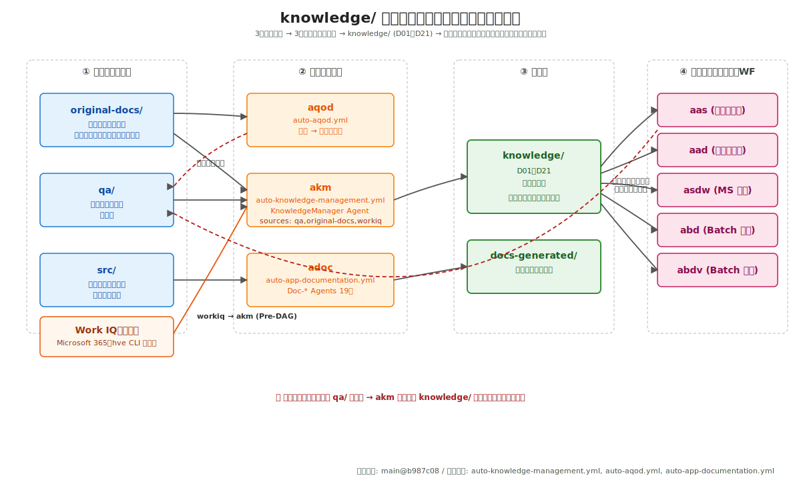
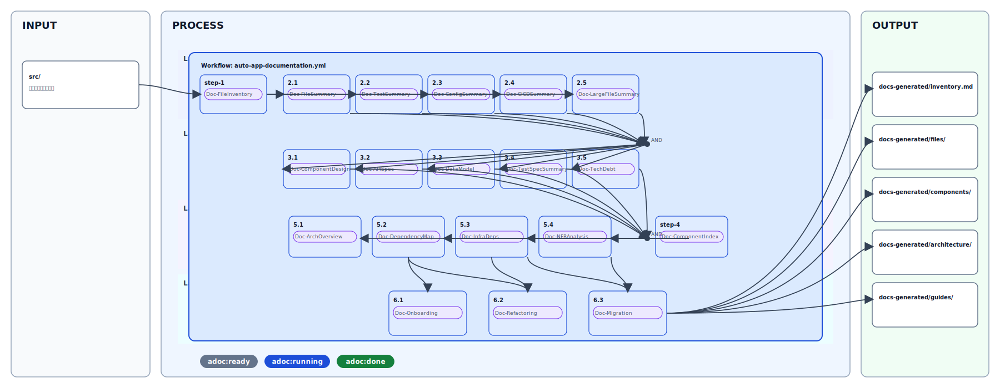
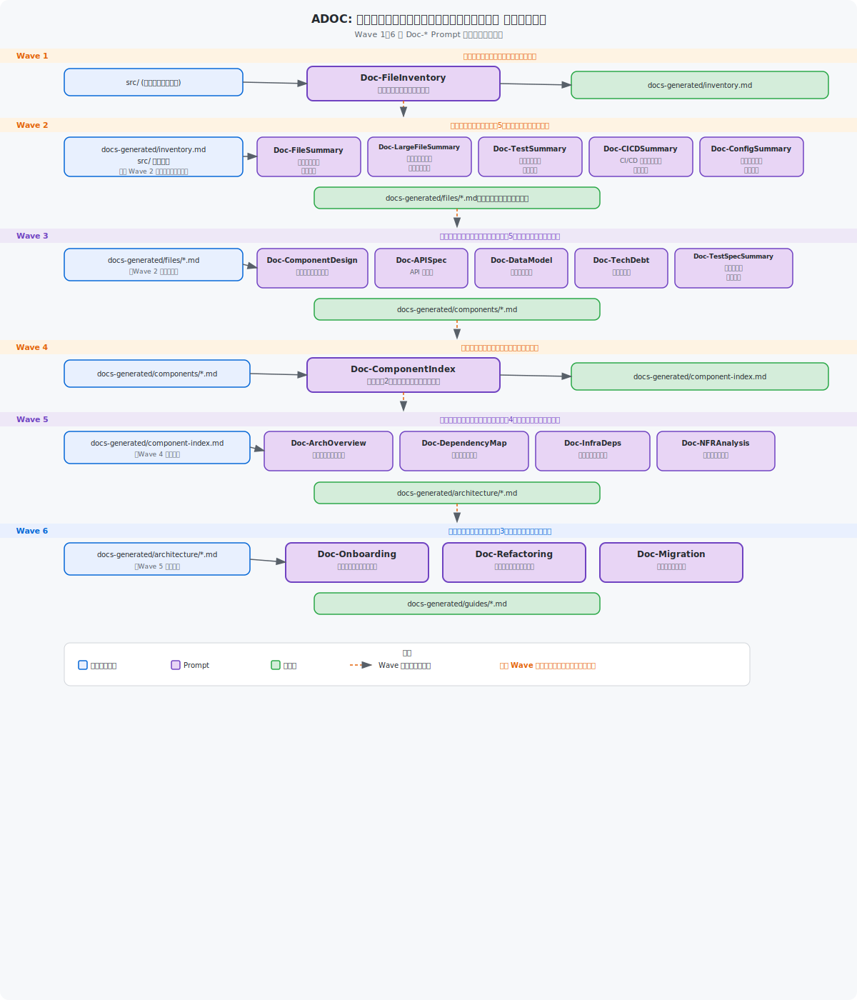

# Source Code からの Documentation（ソースコードからの段階的ドキュメント生成）

← [README](../README.md)

---

## 目次

- [対象読者](#対象読者)
- [前提](#前提)
- [次のステップ](#次のステップ)
- [概要（4層構造）](#概要4層構造)
- [Agent チェーン図（ADOC）](#agent-チェーン図adoc)
- [前提条件](#前提条件)
- [方式1: Copilot cloud agent 手動実行](#方式1-copilot-cloud-agent-手動実行)
- [方式2: ワークフローオーケストレーション（Web）](#方式2-ワークフローオーケストレーションweb)
- [方式3: ワークフローオーケストレーション（HVE CLI Orchestrator）](#方式3-ワークフローオーケストレーションhve-cli-orchestrator)
- [成果物出力先](#成果物出力先)
- [DAG 実行の Wave 計画](#dag-実行の-wave-計画)

---
## 対象読者

- `sourcecode-to-documentation.yml`（ADOC）でソースコード由来ドキュメントを生成する担当者
- `docs-generated/` を保守・運用する担当者

## 前提

- Issue Template: `.github/ISSUE_TEMPLATE/sourcecode-to-documentation.yml`
- Workflow: `.github/workflows/auto-orchestrator-dispatcher.yml` → `.github/workflows/auto-app-documentation-reusable.yml`
- Workflow ID: `adoc`（`hve/workflow_registry.py`）

## 次のステップ

- `original-docs/` からの質問票運用は [original-docs-review.md](./original-docs-review.md) を参照
- `knowledge/` への統合運用は [km-guide.md](./km-guide.md) を参照

## 概要（4層構造）

`adoc` ワークフローは、Context Window を小さく保つために、前段の要約のみを後段へ渡す 4 層構造で実行します。`src/` 相当の既存コードを入力に技術文書（`docs-generated/`）を生成し、`knowledge/` との整合確認を進める際の補助資料として活用できます。





- レイヤー1（Step.1〜2.x）: ファイルインベントリ + ファイル単位サマリー
- レイヤー2（Step.3.x）: コンポーネント/モジュール分析
- レイヤー2.5（Step.4）: レイヤー2成果物のインデックス
- レイヤー3〜4（Step.5.x〜6.x）: 横断分析 + 目的特化ドキュメント

---

## Agent チェーン図（ADOC）

以下の図は、このワークフローで使用される Custom Agent がファイルの入出力を介してどのように連鎖するかを示します。



### データフロー図（ADOC）

以下の図は、Wave 1〜6 の各 Doc-* Custom Agent が読み書きするファイルのデータフローを示します。




## 前提条件

- `hve` CLI が実行可能であること
- GitHub Copilot cloud agent が利用可能であること
- 出力先は `docs-generated/`（既存 `docs/` と分離）

> 💡 `knowledge/` の更新運用は [km-guide.md](./km-guide.md) を参照してください。

---

## 方式1: Copilot cloud agent 手動実行

1. Issue/Sub-issue を作成する
2. Step ごとに対応する `Doc-*` Custom Agent を選択して実行する
3. 各 Step 完了後に `adoc:done` ラベルが付与されることを確認する

---

## 方式2: ワークフローオーケストレーション（Web）

1. Issues → New issue で **Source Codeからのドキュメント作成** を選択
2. `branch` / `target_dirs` / `doc_purpose` などを入力
3. Submit 後、`auto-app-documentation` ラベルで開始し、`auto-orchestrator-dispatcher.yml` から `auto-app-documentation-reusable.yml` が実行される

### Issue Template フィールド詳細

| フィールド | 目的 | 入力例 |
|---|---|---|
| `branch` | ドキュメント生成を実行する対象ブランチ | `main` / `feature/adoc` |
| `target_dirs` | 対象ディレクトリを限定（未指定時は全体） | `src/,hve/` |
| `exclude_patterns` | 解析対象から除外するパターン | `node_modules/,dist/,*.lock` |
| `doc_purpose` | 生成物の主目的 | `all` / `onboarding` / `refactoring` / `migration` |
| `max_file_lines` | 大規模ファイル分割の閾値 | `300` / `500` / `1000` |
| `steps` | 実行する Step の限定（未選択時は全 Step） | Step.1〜Step.6 から選択 |
| `enable_review` | PR 完了時のセルフレビュー自動化 | チェックで `auto-context-review` 付与 |
| `enable_qa` | QA 質問票自動化 | チェックで `auto-qa` 付与 |
| `additional_comment` | ステップへ引き継ぐ追加条件 | `docs-generated/ のみ更新したい` |

---

## 方式3: ワークフローオーケストレーション（HVE CLI Orchestrator）

### CLI 実行例

```bash
python -m hve orchestrate \
  --workflow adoc \
  --branch main \
  --target-dirs src/,hve/ \
  --exclude-patterns "node_modules/,vendor/,dist/,*.lock,__pycache__/" \
  --doc-purpose all \
  --max-file-lines 500
```

目的別実行例:

```bash
python -m hve orchestrate --workflow adoc --doc-purpose onboarding
python -m hve orchestrate --workflow adoc --doc-purpose refactoring
python -m hve orchestrate --workflow adoc --doc-purpose migration
```

---

## 成果物出力先

- `docs-generated/inventory.md`
- `docs-generated/files/`
- `docs-generated/components/`
- `docs-generated/component-index.md`
- `docs-generated/architecture/`
- `docs-generated/guides/`

---

## DAG 実行の Wave 計画

```text
Wave 1: Step.1
Wave 2: Step.2.1 ‖ Step.2.2 ‖ Step.2.3 ‖ Step.2.4 ‖ Step.2.5
Wave 3: Step.3.1 ‖ Step.3.2 ‖ Step.3.3 ‖ Step.3.4 ‖ Step.3.5
Wave 4: Step.4
Wave 5: Step.5.1 ‖ Step.5.2 ‖ Step.5.3 ‖ Step.5.4
Wave 6: Step.6.1 ‖ Step.6.2 ‖ Step.6.3
```
