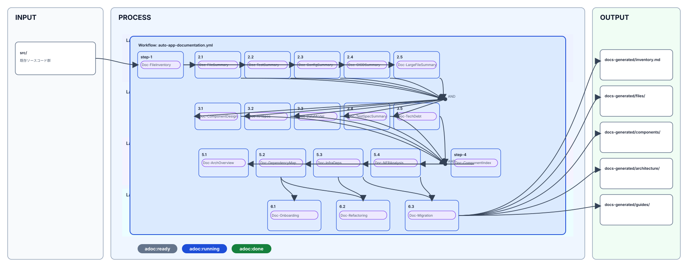
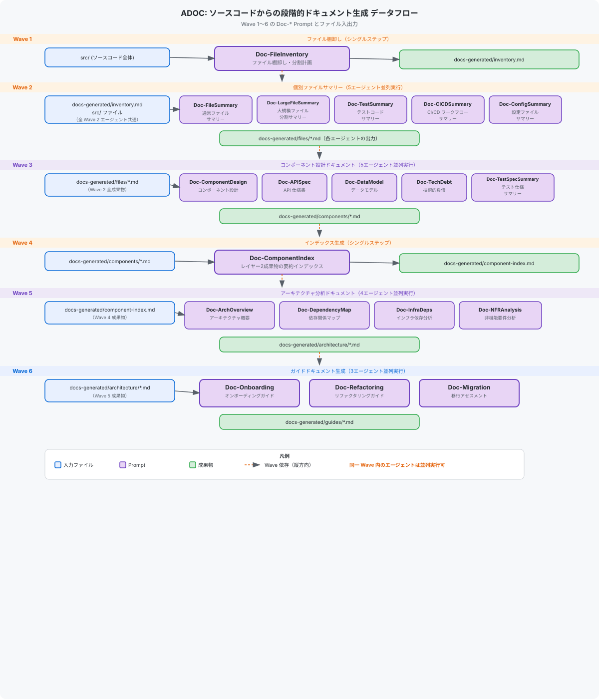

# Source Code からの Documentation（ソースコードからの段階的ドキュメント生成）

← [README](../README.md)

---

## 目次

- [対象読者](#対象読者)
- [前提](#前提)
- [次のステップ](#次のステップ)
- [概要（4層構造）](#概要4層構造)
- [Agent チェーン図（ADOC）](#agent-チェーン図adoc)
- [前提条件](#前提条件)
- [方式1: Copilot cloud agent 手動実行](#方式1-copilot-cloud-agent-手動実行)
- [方式2: ワークフローオーケストレーション（Web）](#方式2-ワークフローオーケストレーションweb)
- [方式3: ワークフローオーケストレーション（HVE CLI Orchestrator）](#方式3-ワークフローオーケストレーションhve-cli-orchestrator)
- [成果物出力先](#成果物出力先)
- [DAG 実行の Wave 計画](#dag-実行の-wave-計画)
- [利用手順（前提・操作・入出力・完了確認・失敗時対応）](#利用手順前提操作入出力完了確認失敗時対応)
- [カスタマイズ](#カスタマイズ)

---
## 対象読者

- `sourcecode-to-documentation.yml`（ADOC）でソースコード由来ドキュメントを生成する担当者
- `docs-generated/` を保守・運用する担当者

## 前提

- Issue Template: `.github/ISSUE_TEMPLATE/sourcecode-to-documentation.yml`
- Workflow: `.github/workflows/auto-orchestrator-dispatcher.yml` → `.github/workflows/auto-app-documentation-reusable.yml`
- Workflow ID: `adoc`（`hve/workflow_registry.py`）

## 次のステップ

- `docs-original/` からの質問票運用は [00-design-doc-ingestion.md](./00-design-doc-ingestion.md) を参照
- `knowledge/` への統合運用は [km-guide.md](./km-guide.md) を参照

## 概要（4層構造）

`adoc` ワークフローは、Context Window を小さく保つために、前段の要約のみを後段へ渡す 4 層構造で実行します。`src/` 相当の既存コードを入力に技術文書（`docs-generated/`）を生成し、`knowledge/` との整合確認を進める際の補助資料として活用できます。




- レイヤー1（Step.1〜2.x）: ファイルインベントリ + ファイル単位サマリー
- レイヤー2（Step.3.x）: コンポーネント/モジュール分析
- レイヤー2.5（Step.4）: レイヤー2成果物のインデックス
- レイヤー3〜4（Step.5.x〜6.x）: 横断分析 + 目的特化ドキュメント

---

## Agent チェーン図（ADOC）

以下の図は、このワークフローで使用される Prompt がファイルの入出力を介してどのように連鎖するかを示します。



### データフロー図（ADOC）

以下の図は、Wave 1〜6 の各 Doc-* Prompt が読み書きするファイルのデータフローを示します。




## 前提条件

- `hve` CLI が実行可能であること
- GitHub Copilot cloud agent が利用可能であること
- 出力先は `docs-generated/`（既存 `docs/` と分離）

> 💡 `knowledge/` の更新運用は [km-guide.md](./km-guide.md) を参照してください。

---

## 方式1: Copilot cloud agent 手動実行

1. Issue/Sub-issue を作成する
2. Step ごとに対応する `Doc-*` Prompt を選択して実行する
3. 各 Step 完了後に `adoc:done` ラベルが付与されることを確認する

---

## 方式2: ワークフローオーケストレーション（Web）

1. Issues → New issue で **Source Codeからのドキュメント作成** を選択
2. `branch` / `target_dirs` / `doc_purpose` などを入力
3. Submit 後、`auto-app-documentation` ラベルで開始し、`auto-orchestrator-dispatcher.yml` から `auto-app-documentation-reusable.yml` が実行される

### Issue Template フィールド詳細

| フィールド | 目的 | 入力例 |
|---|---|---|
| `branch` | ドキュメント生成を実行する対象ブランチ | `main` / `feature/adoc` |
| `target_dirs` | 対象ディレクトリを限定（未指定時は全体） | `src/,hve/` |
| `exclude_patterns` | 解析対象から除外するパターン | `node_modules/,dist/,*.lock` |
| `doc_purpose` | 生成物の主目的 | `all` / `onboarding` / `refactoring` / `migration` |
| `max_file_lines` | 大規模ファイル分割の閾値 | `300` / `500` / `1000` |
| `steps` | 実行する Step の限定（未選択時は全 Step） | Step.1〜Step.6 から選択 |
| `enable_review` | PR 完了時のセルフレビュー自動化 | チェックで `auto-context-review` 付与 |
| `enable_qa` | QA 質問票自動化 | チェックで `auto-qa` 付与 |
| `additional_comment` | ステップへ引き継ぐ追加条件 | `docs-generated/ のみ更新したい` |

---

## 方式3: ワークフローオーケストレーション（HVE CLI Orchestrator）

### CLI 実行例

```bash
python -m hve orchestrate \
  --workflow adoc \
  --branch main \
  --target-dirs src/,hve/ \
  --exclude-patterns "node_modules/,vendor/,dist/,*.lock,__pycache__/" \
  --doc-purpose all \
  --max-file-lines 500
```

目的別実行例:

```bash
python -m hve orchestrate --workflow adoc --doc-purpose onboarding
python -m hve orchestrate --workflow adoc --doc-purpose refactoring
python -m hve orchestrate --workflow adoc --doc-purpose migration
```

---

## 成果物出力先

- `docs-generated/inventory.md`
- `docs-generated/files/`
- `docs-generated/components/`
- `docs-generated/component-index.md`
- `docs-generated/architecture/`
- `docs-generated/guides/`

---

## DAG 実行の Wave 計画

```text
Wave 1: Step.1
Wave 2: Step.2.1 ‖ Step.2.2 ‖ Step.2.3 ‖ Step.2.4 ‖ Step.2.5
Wave 3: Step.3.1 ‖ Step.3.2 ‖ Step.3.3 ‖ Step.3.4 ‖ Step.3.5
Wave 4: Step.4
Wave 5: Step.5.1 ‖ Step.5.2 ‖ Step.5.3 ‖ Step.5.4
Wave 6: Step.6.1 ‖ Step.6.2 ‖ Step.6.3
```

> `hve/workflow_registry.py` の `adoc` 定義（2026-08-07 時点）は、上記 **19 の Agent Step** に加えて
> 表示用のコンテナ Step（`2` / `3` / `5` / `6`）を持つ。コンテナは Prompt を持たず、
> Cloud の Issue 上で子 Step をまとめるためのもの。チェーン図の「19 ステップ」はこの Agent Step の数。

---

## 利用手順（前提・操作・入出力・完了確認・失敗時対応）

| 軸 | 内容 |
|---|---|
| **前提** | 上の「前提条件」を満たすこと（`hve` CLI 実行可、GitHub Copilot cloud agent 利用可） |
| **操作** | 方式1〜3 のいずれか。既定は方式2（Issue Template）または方式3（CLI） |
| **入力** | `target_dirs`（未指定時は全体）/ `exclude_patterns`（既定 `node_modules/,vendor/,dist/,*.lock,__pycache__/`）/ `doc_purpose`（既定 `all`）/ `max_file_lines`（既定 `500`）/ `steps`（未選択時は全 Step） |
| **出力** | 上の「成果物出力先」の 6 系統。Step ごとの出力先は `hve/workflow_registry.py` の `output_paths`（fanout する Step は `output_paths_template`）が正本。ADOC の Step 2.1〜2.5 と 3.1 は `output_paths` が空で `output_paths_template` 側に出力先を持つ |
| **完了確認** | `docs-generated/component-index.md`（Step.4）と `doc_purpose` に対応する `docs-generated/guides/` 配下が生成されていること。Cloud ではラベルが `adoc:done` に遷移すること |
| **失敗時対応** | Wave の途中で止まった場合は依存元 Step の出力が空でないかを確認する（後段は前段の要約だけを読む設計のため、前段が空だと連鎖的に内容が薄くなる）。`max_file_lines` を下げると大規模ファイルの分割サマリーが増える。切り分けは [troubleshooting.md](./troubleshooting.md) |

---

## カスタマイズ

| 変えたいもの | 設定の正本（ここだけを編集する） | 拡張手順 | 回帰検証 |
|---|---|---|---|
| Step 構成・依存（Wave 計画）・出力パス | `hve/workflow_registry.py` の `adoc` 定義 | Step を足す場合は `depends_on` を明示して Wave を壊さない。コンテナ Step（`2`/`3`/`5`/`6`）は表示用 | `python -m pytest hve/tests/test_workflow_registry.py hve/tests/test_adoc_template_parity.py -q` |
| Step 本文テンプレート | `.github/prompts/steps/adoc/` 配下 | CLI/GUI と Cloud で同じテンプレートを使う。片側だけの変更は parity テストで落ちる | `python -m pytest hve/tests/test_adoc_template_parity.py -q` |
| 各 Agent の振る舞い | `.github/prompts/Doc-*.prompt.md` | 入出力契約は `.github/io-contracts/Doc-*--adoc--*.yaml` と対で更新する | `python -m pytest hve/tests/test_adoc_template_parity.py -q` |
| 既定の除外パターン・分割閾値・目的 | `hve/__main__.py` の `--exclude-patterns` / `--max-file-lines` / `--doc-purpose` の既定値 | Issue Template の既定値も揃える | `python -m pytest hve/tests/test_workflow_registry.py -q` |
| Cloud の入力欄 | `.github/ISSUE_TEMPLATE/sourcecode-to-documentation.yml` | 呼び出し先 `.github/workflows/auto-app-documentation-reusable.yml` の `inputs` と対で更新する | Issue Template から 1 度実行して確認 |

**互換性・安全性で壊してはならない境界**

- 出力先は `docs-generated/` に閉じる。既存の `docs/` を上書きしない（分離が設計意図）。
- 後段 Step は前段の**要約だけ**を読む。生ソースを後段へ渡す変更を入れると Context Window の前提が崩れる。
- Wave 4（`Step.4` = `Doc-ComponentIndex`）は Wave 3 の全 Step に依存する。依存を落とすと索引が欠ける。
- `docs-original/` と `knowledge/` は本ワークフローの出力先ではない。書き込まない。
