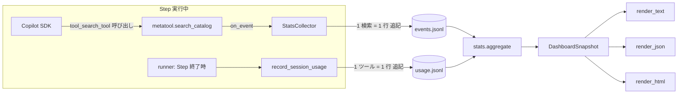
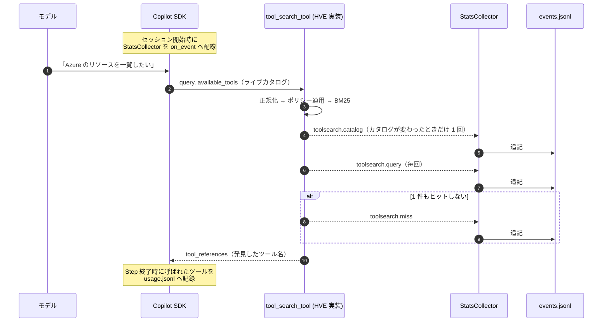
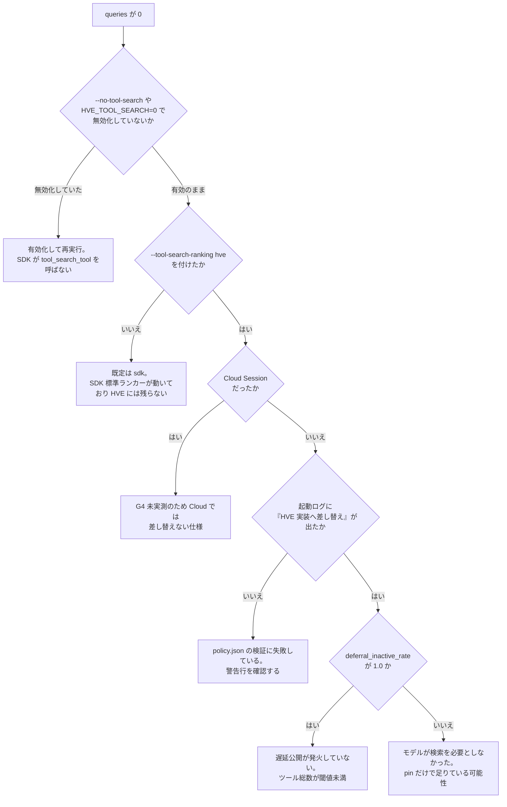

# Tool Search ダッシュボード — データ収集と指標の読み方

> 対象読者: HVE の Tool Search（`hve/toolsearch/`）を運用・調整する Software Engineer
>
> 関連: [users-guide/tool-search.md](tool-search.md)（仕組みとカスタマイズ）
> 要件: FR-TS-09（統計収集） / FR-TS-10（ダッシュボード）
>
> **最終更新: 2026-08-13**

> **先に読むこと**: [tool-search.md の冲頭バナー](tool-search.md)（2026-08-13 実測）のとおり、
> 現行の Copilot CLI では遅延公開が発火せず、`--tool-search-ranking hve` はトークンを**増やす**。
> 本ページの手順は **実装の検証と SDK 更新後の再評価**向けであり、本番運用で常時有効化するためのものではない。
> 判定に使う指標は `deferral_inactive_rate`（§3.2）と `token_reduction_valid`（§3.5）。

Tool Search は「必要になったときにツールを検索して公開する」機構なので、
**検索が実際に呼ばれているか**、**呼ばれた結果が使われているか**が見えないと調整できない。
本ダッシュボードはその 2 点を実データから可視化する。

---

## 1. 3 分で使う

### 利用手順の要約

| 軸 | 内容 |
|---|---|
| **前提** | 本リポジトリのルートで実行できること。Python は `pyproject.toml` の `requires-python = ">=3.11"` に従う。`hve` パッケージが import できること（追加インストールは不要）。GUI から使う場合は `PySide6` が導入済みであること |
| **操作** | 収集を有効にして 1 回 orchestrate を実行 → `python -m hve toolsearch dashboard` を実行 |
| **入力** | `.toolsearch/events.jsonl`（検索イベント）と `.toolsearch/usage.jsonl`（採用履歴）。パスは `--events` / `--usage`、または `HVE_TOOLSEARCH_EVENTS` / `HVE_TOOLSEARCH_USAGE` で差し替える |
| **出力** | 端末のテキスト表（既定） / `--json` の JSON / `--html <path>` の自己完結 HTML |
| **完了確認** | `queries` が 1 以上で、`catalog` と `上位一覧` が表示される。§3 の各指標が数値で埋まっていれば成功 |
| **失敗時対応** | `queries` が 0 のままなら §4 の切り分けフローへ。ファイルが無い旨のメッセージなら収集条件（下の注記）を満たしていない |

```bash
# 1. 収集を有効にして実行する（既定では収集も差し替えも行われない。検証目的のときだけ使う）
python -m hve orchestrate --workflow ard --tool-search-ranking hve

# 2. 端末で確認する
python -m hve toolsearch dashboard

# 3. 実行中にライブ監視する（2 秒ごとに再集計）
python -m hve toolsearch dashboard --follow

# 4. HTML として共有する（外部ネットワークへ接続しない自己完結ファイル）
python -m hve toolsearch dashboard --html work/toolsearch.html

# 5. 機械処理する
python -m hve toolsearch dashboard --json
```

> **収集される条件**: `tool_search`（既定有効）と `--tool-search-ranking hve` の **両方**が有効な
> 非 Cloud セッションだけ。どちらかが欠けると SDK 標準のランカーが動き、
> HVE 側にイベントは 1 件も残らない（`--tool-search-ranking` の既定は `sdk`）。

### GUI から使う

設定画面の **skills → Tool-Search** に 5 つのタブがある（Markdown-Query / Code-Query と同じ位置）。

| タブ | 内容 |
|---|---|
| **基本** | `tool_search`（遅延ロードの ON/OFF）と `tool_search_ranking`（ランキング実装）。この 2 つの入力欄は設定画面が単独で持ち、Step 1 右ペインには置かない |
| **Skill Layer** | Skill の Core / Extend 分類と `hve/skill_manifest.json` の workflow / step 別宣言を**閲覧専用**で表示。実行時の必須 Skill 解決は `runner.py` / `skill_resolver.py` が担う |
| **ポリシー** | `policy.json` の現在値（limit / tau / フィールド重み / pin / 検索語彙 / Step 別モード）を表示し、その場で編集・保存できる。詳細は [tool-search.md §6.5](tool-search.md#65-gui-から編集する) |
| **統計情報** | 本ページで説明するダッシュボードを表示。「再集計」「HTML で書き出す」「収集済みイベントを削除」の 3 ボタン |
| **コンテキスト内訳** | Step 実行と同じ経路でセッションを張り、層別（システムプロンプト / 組み込みツール定義 / MCP サーバー別）の実トークン数を実測する。ボタンを押したときだけ実行される |

統計は**タブを開いたときにだけ**読み込む（イベントログは伸び続けるため）。
削除は不可逆なので確認ダイアログを挟む。

> Step 1 右ペインにある「Foundry Toolbox: tool search」は**生成する AI Agent** 側の
> 設定で、本機能とは別ドメイン。混同しないこと。

---

## 2. データはどこから来るか

収集は 2 つの追記専用 JSONL に分かれている。役割が違うので混ぜていない。

| ストア | 既定パス | 環境変数 | 書き手 | 何のため |
|---|---|---|---|---|
| イベントログ | `＜repo-root＞/.toolsearch/events.jsonl` | `HVE_TOOLSEARCH_EVENTS` | `StatsCollector`（検索のたび） | 検索の起動・結果・コストの観測（FR-TS-09） |
| 利用履歴 | `＜repo-root＞/.toolsearch/usage.jsonl` | `HVE_TOOLSEARCH_USAGE` | `record_session_usage`（Step 終了時） | 自動 pin の学習（FR-TS-07） |

ダッシュボードは**この 2 つだけ**を読む。ネットワークにも Copilot にも接続しない。



### 2.1 収集のタイミング



### 2.2 記録するもの・しないもの

| 記録する | 記録しない |
|---|---|
| 検索クエリ文字列 | プロンプト本文・会話内容・モデル出力 |
| 返却ツール名とスコア | ツール定義の本文 |
| カタログ件数の内訳 | `additional_search_text`（検索専用語彙） |
| 検索レイテンシ | ファイル内容・環境変数・認証情報 |
| 推定トークン量 | ツールの引数値 |

`additional_search_text` を記録しないのは、そこに社内用語や非公開の別名を書く運用を
想定しているため。型（`ToolCard`）と収集の両方で外へ出ないようにしてある。

### 2.3 失敗しても止まらない

収集は best-effort。ディスクフル・権限エラー・壊れた行のいずれも Step を落とさない。

- 書き込み失敗 → 黙って捨てる（`StatsCollector._append` が `OSError` を握る）
- 壊れた行 → 読み込み時にその行だけ捨てる（`load_events`）
- ストアが存在しない → 空として扱い、指標は「データ不足」になる

### 2.4 VS Code の `tool_search` ログを同じ `.toolsearch/` に集める

ここまでの 2 つのストアは **HVE 自身の Tool Search ランカー**（`--tool-search-ranking hve`）の記録である。
これとは別に、**VS Code Copilot Chat が持つ `tool_search` ツール**（遅延ツール読み込み）の実行ログがある。
両者は別ドメインだが、出力先を `.toolsearch/` に揃えられる。

#### 経路は 2 つあり、片方だけが出力先を選べる

| 経路 | 出力先 | 出力先の変更 |
|---|---|---|
| Chat デバッグファイルログ | `<拡張ストレージ>/debug-logs/<sessionId>/main.jsonl`（Windows では `%APPDATA%\Code\User\workspaceStorage\<workspace-hash>\GitHub.copilot-chat\debug-logs\...`） | **不可**。ディレクトリを指定する設定は存在せず、拡張ストレージ URI から導出される |
| OpenTelemetry ファイルエクスポーター | `github.copilot.chat.otel.outfile` で指定したパス（JSON-lines） | **可能**。これを `.toolsearch/` へ向ける |

前者を有効化する設定は `github.copilot.chat.agentDebugLog.fileLogging.enabled`（既定 `false`）。
出力先を選べないため、`.toolsearch/` への集約には使えない。

#### 設定手順（OTel ファイルエクスポーター）

以下は **ユーザー設定 (`settings.json`) にしか書けない**（3 つとも `scope: application` のため、
ワークスペースの `.vscode/settings.json` では効かない）。**反映にはウィンドウの再読み込みが必要**。

```jsonc
// %APPDATA%\Code\User\settings.json
{
  "github.copilot.chat.otel.enabled": true,
  "github.copilot.chat.otel.exporterType": "file",
  // 絶対パスで指定する。設定するとエクスポーター種別は file に上書きされる。
  "github.copilot.chat.otel.outfile": "C:\\path\\to\\repo\\.toolsearch\\vscode-otel.jsonl"
}
```

`.toolsearch/` は `.gitignore` 済みなので、出力がコミット対象になることはない。

#### 注意点

- **全ワークスペース共通**: application scope のため、他のワークスペースで行った Copilot Chat の操作も
  同じファイルへ記録される。特定リポジトリだけを対象にすることはできない。
- **会話内容は既定で記録されない**: `github.copilot.chat.otel.captureContent` は既定 `false` で、
  入出力メッセージ・システム指示・ツール定義は含まれない。`true` にすると機微情報が入りうる。
- **属性の切り詰め**: `github.copilot.chat.otel.maxAttributeSizeChars` は既定 `0`（切り詰めなし）。
- ツール実行は OTel の `execute_tool` スパンとして記録され、`gen_ai.operation.name="execute_tool"` と
  `gen_ai.tool.name`（ツール名）を持つ。

#### 未確定事項（導入時に一度だけ実測して確認すること）

`tool_search` は VS Code Copilot Chat の**内部ツール**であり、拡張の `contributes.languageModelTools`
には登録されていない。そのため `execute_tool` スパンが `tool_search` に対しても発火するかは、
静的な確認だけでは断定できない。上記設定を入れてウィンドウを再読み込みし、実際に
`.toolsearch/vscode-otel.jsonl` へ `gen_ai.tool.name` が `tool_search` のレコードが現れるかを
一度確認すること。**確認できるまで「記録される」と前提にしないこと。**

`hve toolsearch dashboard` はこのファイルを読まない（HVE 自身の 2 ストアだけを集計する）。
本節は保存先を `.toolsearch/` に揃えるところまでを対象とする。

### 2.5 ファイルの中身

1 行 1 イベントの JSONL。`toolsearch.query` の例（実際は 1 行）。
**以下の数値はキーの並びを示すサンプルであり、現在の実測値ではない**（カタログ件数は接続する MCP サーバで変わる）:

```json
{
  "ts": "2026-08-04T09:12:33.481Z",
  "schema_version": 1,
  "kind": "toolsearch.query",
  "run_id": "20260804-091044",
  "workflow_id": "ard",
  "step_id": "1.1",
  "query": "Azure のリソースグループを一覧したい",
  "limit": 5,
  "hits": ["azmcp_group_list", "azmcp_subscription_list"],
  "scores": [4.812331, 2.104882],
  "latency_ms": 3.417,
  "engine": "mini_bm25",
  "catalog": {"total": 187, "pinned": 7, "searchable": 180, "dropped": 0,
              "deferred": 148, "mcp": 148, "native": 4, "skill": 35},
  "tokens": {"baseline": 54865, "exposed": 2140},
  "warnings": []
}
```

利用履歴（`usage.jsonl`）は 1 行 1 ツール:

```json
{"ts": "2026-08-04T09:20:11.004Z", "session_id": "20260804-091044:1.1",
 "workflow_id": "ard", "step_id": "1.1", "tool_id": "mcp:azure:azmcp_group_list"}
```

`ts` は後から足したフィールドなので、それ以前の履歴には無い。
無い行も自動 pin（FR-TS-07）では従来どおり数えるが、`--since` を付けたときだけ除外される。

### 2.6 掃除とプライバシー

ストアは追記専用なので放置すると増え続ける。削除は単にファイルを消せばよい。

```bash
# 期間を絞って見る（削除せずに済む）
python -m hve toolsearch dashboard --since 2026-08-01T00:00:00Z

# まるごと捨てる（リポジトリルートで実行する）
Remove-Item .toolsearch/events.jsonl
```

クエリ文字列にはユーザーの依頼内容が現れる。共有する前に中身を確認すること。
CI などで収集したくない場合は `--tool-search-ranking hve` を付けなければよい。

---

## 3. 指標の説明

`--json` の出力キーと、テキスト / HTML 上の表示名の対応。
**算出できない指標は `null`（テキストと HTML では「データ不足」）になる。0 では埋めない。**

### 3.1 メタ情報

| キー | 表示 | 意味 | 読み方 |
|---|---|---|---|
| `generated_at` | 生成 | 集計を行った UTC 時刻 | ライブ表示中は毎回更新される |
| `first_event_at` | 期間（左） | 集計対象で最も古いイベントの時刻 | `--since` を付けるとその範囲に絞られる |
| `last_event_at` | 期間（右） | 最も新しいイベントの時刻 | 「実行したのに更新されない」＝収集が有効になっていない |

### 3.2 検索の起動状況

| キー | 表示 | 意味 | 読み方 |
|---|---|---|---|
| `queries` | 検索回数 | `toolsearch.query` の件数 | **0 のまま = そもそも検索が呼ばれていない**。§4 の切り分けへ |
| `misses` | うち miss | 1 件も返せなかった検索の件数 | 増えているなら検索語彙かポリシーの問題 |
| `hit_rate` | ヒット率 | `1 - misses / queries` | 0.9 未満が続くなら `additional_search_text` の追加を検討 |
| `sessions` | セッション数 | `run_id:step_id` の異なり数 | 検索回数 ÷ これで「1 Step あたり何回検索したか」がわかる |
| `runs` | run 数 | `run_id` の異なり数 | ワークフロー実行回数の目安 |
| `deferral_inactive_rate` | 遅延公開が不活性だった割合 | FR-TS-08 の警告が付いた検索の割合 | **1.0 に近い = ランカーが実質無効**。§4 を参照。FR-TS-08 以外の警告はここには数えない（`warnings` へ出る） |

### 3.3 応答

| キー | 表示 | 意味 | 読み方 |
|---|---|---|---|
| `avg_hits` | 平均返却件数 | 1 検索あたりに返したツール数 | `limit`（既定 5）に張り付くなら `tau` が緩すぎる可能性 |
| `avg_top_score` | 平均トップスコア | 1 位の BM25 スコアの平均 | 低いまま推移するなら語彙が噛み合っていない |
| `latency_p50_ms` | レイテンシ p50 | 検索処理時間の中央値（ミリ秒） | 索引構築込み。カタログ件数に比例する |
| `latency_p95_ms` | レイテンシ p95 | 95 パーセンタイル | ここが数百 ms を超えるなら要調査 |
| `latency_max_ms` | レイテンシ 最大 | 最大値 | 初回だけ突出するのは正常（トークン推定のキャッシュ充填） |

### 3.4 カタログ構成（`catalog`）

| サブキー | 意味 | 読み方 |
|---|---|---|
| `total` | 検索対象になったツールの総数 | ライブカタログ + Skill の合計 |
| `pinned` | 常時公開されているツール数 | 多すぎるとトークン削減効果が薄れる |
| `searchable` | 検索で発見できるツール数 | `total - pinned - dropped` |
| `dropped` | `excluded_tools` 等で除外された数 | 意図した除外か確認する |
| `deferred` | SDK が遅延公開しているツール数 | **0 なら遅延化が効いていない**（FR-TS-08） |
| `mcp` / `native` / `skill` | 種別ごとの内訳 | `skill` が 0 なら Skill の合流に失敗している |

### 3.5 コンテキストコスト

| キー | 表示 | 意味 | 読み方 |
|---|---|---|---|
| `baseline_tokens` | 全定義前置き | 全ツール定義を前置きした場合の推定トークン量 | `tiktoken` があれば実トークン、無ければ文字数 ÷ 4 の概算 |
| `exposed_tokens` | 実公開 | pin + その検索の返却分の推定トークン量 | |
| `token_reduction` | トークン削減 | `1 - exposed / baseline` | **この機能の投資対効果そのもの**。低いなら pin を絞る |
| `token_reduction_valid` | （表示は下記） | `token_reduction` が削減率として成立するか | `deferral_inactive_rate` が 1.0（＝遅延公開が一度も発火していない）のとき `false` |

> **`token_reduction_valid` が `false` のとき、テキストと HTML は削減率の代わりに
> 「無効（遅延公開が発火していない）」と表示する。** ランカー内部の「pin + 返却分」対「全件」の比は、
> SDK が実際にツール定義を遅延化していなければ実際の削減につながらないため。
> JSON では `token_reduction` の値をそのまま残し、`token_reduction_valid` で成否を判別する。
> `deferral_inactive_rate` が `null`（検索が 1 件も無い）の場合は判定できないので `true` のままとし、
> `token_reduction` 自体が「データ不足」になる。

> この 3 つは**集計期間の平均ではなく、最新の 1 検索の観測値**。
> カタログ構成は実行中にほとんど変わらないため、現在の状態を表す値として扱う。
>
> いずれも**推定値**であり、モデルへ実際に送られたトークン数の実測ではない。
> 定義相当のテキスト（名前 + 説明 + 引数語彙）から算出している。

### 3.6 発見の質

| キー | 表示 | 意味 | 読み方 |
|---|---|---|---|
| `adoption_rate` | 採用率 | 検索で発見されたツールのうち、実際に呼ばれたものの割合 | 低い = 「見つかるが役に立っていない」。説明文かランキングを見直す |
| `never_hit_tools` | 一度も返されていないツール | カタログにあるが検索結果に一度も出ていないツール名 | `additional_search_text` の追加候補。運用上不要なら `excluded_tools` へ |

> `adoption_rate` と `never_hit_tools` は **`toolsearch.catalog` イベントが必要**。
> イベントログを途中から切り出した場合など、構成イベントが無ければ「データ不足」になる
> （名前から推測して埋めることはしない）。構成イベントはカタログの顔ぶれが変わったときだけ
> 出るので、`--since` を短く切ると落ちやすい。
>
> `adoption_rate` は `--since` で**両側とも**絞り込む（検索イベントも利用履歴も）。
> ただし **`ts` を持たない旧形式の利用履歴は、窓を指定したとき除外される**
> （窓の内側だと証明できないため）。窓を指定しなければ旧レコードも含む。

### 3.7 上位一覧

| キー | 表示 | 意味 | 読み方 |
|---|---|---|---|
| `top_queries` | よく使われたクエリ | クエリ文字列の頻度上位 | 頻出クエリの正解ツールは pin 候補 |
| `top_hit_tools` | よく返されたツール | 検索結果に出た回数の上位 | 常に上位なら `policy.json` で `always` pin にする |
| `top_miss_queries` | ヒットしなかったクエリ | miss したクエリの頻度上位 | **最も投資効率の高い改善対象**。§5 参照 |
| `top_called_tools` | 実際に呼ばれたツール | `usage.jsonl` 由来。ツール ID の頻度上位 | 検索経由でないツールも含む |
| `queries_by_scope` | Step 別の検索回数 | `workflow:step` ごとの検索回数 | 特定 Step だけ突出するなら、その Step は pin 運用が向く |

### 3.8 自動 pin のウォームアップ（`autopin_progress`）

FR-TS-07 の学習状況。`workflow × step` ごとに 1 行。

| サブキー | 意味 |
|---|---|
| `scope` | `workflow_id:step_id` |
| `sessions` | この scope で記録済みのセッション数 |
| `warmup_sessions` | 昇格が始まるまでに必要なセッション数（既定 20） |
| `promoted` | 現在自動 pin へ昇格しているツール ID（上位 3 件） |

`sessions` が `warmup_sessions` に届くまで `promoted` は空のまま。
これは仕様であり、故障ではない。

### 3.9 警告（`warnings`）

`toolsearch.query` に付随した警告メッセージと発生回数。代表例:

| メッセージ | 意味 | 対処 |
|---|---|---|
| `no deferred tools were present in the live catalog...` | 遅延公開が発火していない（FR-TS-08） | ツール総数が SDK の `defer_threshold` に届いていない。MCP サーバーを増やすか、この機能を無効化する |
| `the live tool catalog snapshot was unavailable...` | SDK からカタログが渡ってこなかった | SDK バージョンを確認する |

---

## 4. 「検索回数が 0 のまま」の切り分け



`HVE_TOOLSEARCH_EVENTS` を別パスへ向けている場合、ダッシュボード側にも
同じ `--events` を渡す必要がある点にも注意。

> ツール検索そのものは **既定で有効**（`HVE_TOOL_SEARCH` の既定値が真、`--tool-search` は明示指定用）。
> 無効化は `--no-tool-search` または `HVE_TOOL_SEARCH=0` を指定したときだけ起こる。

---

## 5. ダッシュボードを見て何を直すか

| 症状 | 見る指標 | 打ち手 |
|---|---|---|
| miss が多い | `top_miss_queries` | そのクエリの語彙を、正解ツールの `additional_search_text`（`hve/toolsearch/policy.json`）へ追加する。トークンコストは増えない |
| 発見されるが使われない | `adoption_rate` が低い | ツールの `description` を、モデルが判断できる粒度へ書き直す |
| 常に同じツールが 1 位 | `top_hit_tools` | `policy.json` の `pins` で `"always"` にして検索を経由させない |
| 出番のないツールが多い | `never_hit_tools` | 不要なら `excluded_tools`、必要なら検索語彙を足す |
| 削減率が低い | `token_reduction` | `pins` の `always` を減らす。`native:*:*` のワイルドカード pin は特に効く |
| 特定 Step だけ検索が多い | `queries_by_scope` | その Step を `step_overrides` の `pin_only` にして、検索そのものを止める |

`policy.json` の書き方は [users-guide/tool-search.md §6](tool-search.md) を参照。

---

## 6. CLI リファレンス

```
python -m hve toolsearch dashboard [オプション]
```

| オプション | 既定 | 説明 |
|---|---|---|
| `--events PATH` | `＜repo-root＞/.toolsearch/events.jsonl` | イベントログのパス |
| `--usage PATH` | `＜repo-root＞/.toolsearch/usage.jsonl` | 利用履歴のパス |
| `--since ISO8601` | なし | この UTC 時刻以降のイベントだけ集計する |
| `--top N` | 10 | 上位一覧の件数 |
| `--json` | — | JSON で出力する |
| `--html PATH` | — | 自己完結 HTML を書き出す |
| `--follow` | — | 一定間隔で再集計して更新する（`--once` と排他） |
| `--once` | 既定 | 1 回だけ描画して終了する |
| `--interval SEC` | 2.0 | `--follow` の更新間隔 |

### HTML 出力について

- `<script>` を持たず、CDN・外部フォント・リモート画像を一切参照しない
- 棒グラフはインライン SVG
- クエリ文字列は HTML エスケープする（ログ由来の文字列がそのまま描画されないため）

社内の閉じたネットワークやオフライン環境でもそのまま開ける。

---

## 7. プログラムから使う

```python
from hve.toolsearch.dashboard import build_dashboard, render_json
from hve.toolsearch.stats import StatsCollector, aggregate, load_events

# 保存済みストアから集計する
snapshot = build_dashboard()
print(snapshot.hit_rate, snapshot.token_reduction)

# 実行中プロセスが自分の分だけ見る（ファイルを読み直さない）
collector = StatsCollector(run_id="local", workflow_id="ard", step_id="1.1")
...  # build_session_toolset(on_event=collector) へ渡して実行
print(collector.snapshot().queries)

# 任意のイベント列を集計する
snapshot = aggregate(load_events("path/to/events.jsonl"), since="2026-08-01T00:00:00Z")
print(render_json(snapshot))
```

`DashboardSnapshot` は frozen dataclass で、`to_dict()` がそのまま JSON 化できる。

### 7.1 カスタマイズの正本・拡張手順・回帰検証・互換性

| 変えたいもの | 設定の正本 | 拡張手順 | 回帰検証 |
|---|---|---|---|
| 集計指標の追加・変更 | `hve/toolsearch/stats.py`（`aggregate` / `DashboardSnapshot`） | フィールドを追加し `to_dict()` へ載せる。既存キーは削除しない | `python -m pytest hve/tests/test_toolsearch_stats.py hve/tests/test_toolsearch_dashboard.py -q` |
| 端末表示 / JSON / HTML の描画 | `hve/toolsearch/dashboard.py`（`render_text` / `render_json` / `render_html`） | HTML は外部ネットワークへ接続しない自己完結を維持する | `python -m pytest hve/tests/test_toolsearch_dashboard.py -q` |
| CLI の引数 | `hve/__main__.py` の `toolsearch dashboard` パーサ | 既定値（`--top 10` / `--interval 2.0`）を変える場合は本ページも更新する | `python -m pytest hve/tests/test_toolsearch_dashboard.py -q` |
| 収集先パス | 環境変数 `HVE_TOOLSEARCH_EVENTS` / `HVE_TOOLSEARCH_USAGE` | コード変更なしで差し替えられる。ダッシュボード側にも同じパスを `--events` / `--usage` で渡す | 実行後にファイルへ追記されることを確認 |
| GUI の統計情報タブ | `hve/gui/toolsearch_settings_section.py` | タブ構成（基本 / ポリシー / 統計情報）と「収集済みイベントを削除」の確認ダイアログは維持する | 専用テストは未整備。`PySide6` 導入済み環境で GUI を起動して手動確認する（要確認） |

**互換性・安全性で壊してはならない境界**

- 収集は**失敗しても Step を落とさない**（§2.3）。例外を送出する変更を入れない。
- 記録するのはツール **ID とスコアだけ**で、クエリ本文や引数値は残さない（§2.2）。個人情報・秘密情報を書き出す変更を入れない。
- 2 つの JSONL は**追記専用**。既存行を書き換える実装にしない。
- `DashboardSnapshot.to_dict()` の既存キーは外部連携の契約。改名・削除は互換性を壊す。

---

## 8. 設計上の割り切り

| # | 割り切り | 理由 |
|---|---|---|
| 1 | トークン量は推定値で、実送信量ではない | SDK は展開後のトークン数を返さない。定義相当テキストから算出している |
| 2 | `adoption_rate` は「発見された」と「呼ばれた」の突合であり、因果ではない | pin されているツールが呼ばれた場合も `usage.jsonl` には載る |
| 3 | Cloud Session では 1 件も収集されない | ランキング差し替え自体を Cloud でゲートしているため（G4 未実測） |
| 4 | イベントログの自動ローテーションを持たない | 1 検索 1 行で追記量が小さい。手動削除または GUI のボタンで足りる |
| 5 | GUI Workbench の `[hve:stats]` ストリームとは統合していない | あちらは 1 実行の進捗、こちらは実行横断の累積で、寿命とスコープが異なる |
| 6 | 実行中プロセスの `StatsCollector.snapshot()` は直近 5,000 イベントまで | 長時間実行でメモリを伸ばさないため。ファイルには全件残る |

## 9. 収集のオーバヘッド（実測）

**取得条件**: 2026-08-05 実測。Python 3.14 / Windows。
Skill 総数 **73 件**は、リポジトリ内の `.github/skills`（2026-08-07 時点で 35 件）に加えて、
`default_skill_roots()` が併せて走査する `~/.agents/skills` / `~/.copilot/skills` を含めた計測環境の値。
外部 Skill ルートを持たない環境では件数がこれより少なくなり、所要時間も相応に短くなる。
自分の環境の件数はリポジトリのルートで次を実行すると確認できる（本リポジトリでは 35 件）。

```bash
python -c "from pathlib import Path; from hve.toolsearch.session import default_skill_roots; from hve.toolsearch.skill_catalog import discover_skills; print(len(discover_skills(default_skill_roots(Path('.')))))"
```

（本体 CLI の `hve toolsearch` は `dashboard` サブコマンドのみ。Skill 列挙サブコマンドは他リポジトリ配布キット側の `toolsearch skills` が持つ。）

| 処理 | 値 | 発生頻度 |
|---|---|---|
| `discover_skills`（`SKILL.md` 73 件の読み直し） | 中央値 **60.6 ms**（初回最大 534 ms） | Step ごと 1 回 |
| `build_session_toolset`（上記 ＋ ツール 74 件の登録） | 中央値 **58.1 ms** | Step ごと 1 回 |
| トークン推定の初回充填（カタログ 250 件） | **173.6 ms** | プロセスごと 1 回 |
| トークン推定（キャッシュ済み、250 件） | **0.05 ms** | 検索ごと |

Step の実行時間は通常数十秒〜数分なので、いずれも無視できる。
`SKILL.md` のキャッシュとトークン推定の事前計算は、この実測に基づいて**実装していない**。

> `latency_ms` にはトークン推定の時間を含めていない（検索本体だけを測るため）。
> 初回検索だけ体感で 170 ms 程度乗る点に注意。
