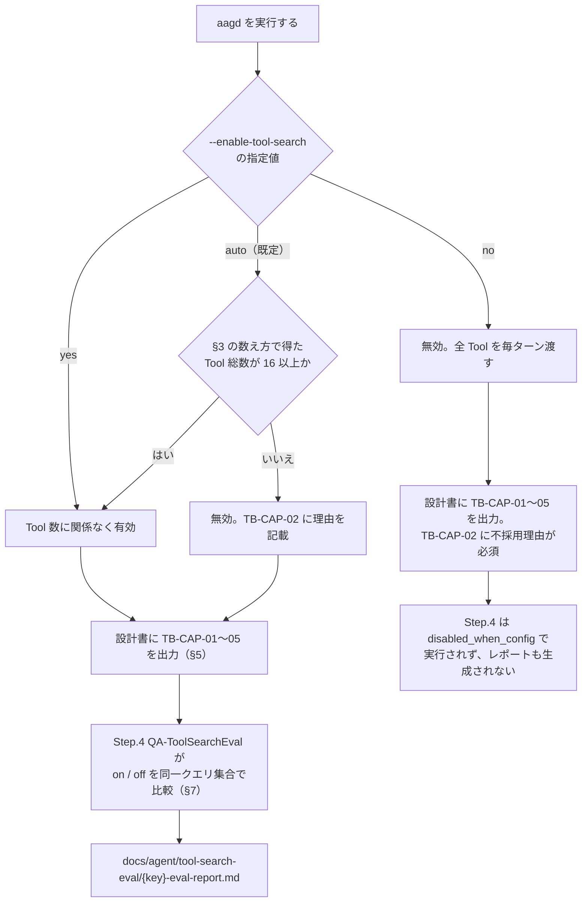
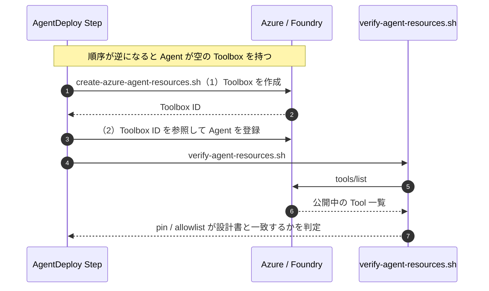

# Foundry Toolbox / Tool Search 利用ガイド（生成する AI Agent 向け）

生成する AI Agent に Microsoft Foundry の **Toolbox** と **tool search**（ツール定義の遅延ロード）を
適用するための手引き。

> **最終更新: 2026-08-13**

> **名前が似た 3 ファイルがある。最初にここで行き先を確定すること。**
>
> | ファイル | 対象 | 実体 | 設定名 |
> |---|---|---|---|
> | **本ガイド** | HVE が**生成する AI Agent** のツール表面 | Microsoft Foundry Toolbox | `--enable-tool-search` |
> | [tool-search.md](tool-search.md) | **HVE 自身**が動くときのツール表面 | `hve/toolsearch/`（HVE 実装） | `--tool-search` / `--tool-search-ranking` |
> | [tool-search-dashboard.md](tool-search-dashboard.md) | 上の実行時統計の見方 | `hve toolsearch dashboard` | — |
>
> 本ガイドの tool search は **Foundry 側の機能**で、HVE ランタイムの仕組みとは別物である。

## 0. 利用手順の要約

| 軸 | 内容 |
|---|---|
| **前提** | `aagd` ワークフローを実行できること（CLI / GUI / Cloud のいずれか）。Agent の Tool 総数を §3 の数え方で把握していること |
| **操作** | §4 の CLI / GUI / Cloud いずれかの経路で `auto` / `yes` / `no` を選び、`aagd` を実行する |
| **入力** | 設計対象の Agent 定義（AG-CAP-03 / 04 / 05）と `--enable-tool-search` の指定値 |
| **出力** | `docs/agent/agent-detail-{key}.md` の TB-CAP-01〜05（§5）と、`docs/agent/tool-search-eval/{key}-eval-report.md`（§7、`no` 以外） |
| **完了確認** | まず TB-CAP-01〜05 の 5 見出しがそろっていること。そのうえで指定値により分岐する。<br>・`auto` / `yes`: `Step.4` の評価レポート（`docs/agent/tool-search-eval/{key}-eval-report.md`）が生成されていること<br>・`no`: Step.4 は `hve/workflow_registry.py` の `disabled_when_config={"enable_tool_search": ["no"]}` により実行されず、レポートも生成されない。TB-CAP-02 に不採用理由が書かれていることを確認する |
| **失敗時対応** | 検証 FAIL の典型は §5「よくある失敗」。ゲートの取りこぼしは §7 の注記（`docs/agent/` 直下に置かない）を確認する |

---

## 1. そもそも何のための機能か

Agent に登録した Tool の定義は、既定では**毎ターン全件**モデルへ送られる。
Tool が増えるほど入力トークンが膨らみ、モデルが選ぶべき Tool を見失いやすくなる。

tool search を有効にすると、Tool 定義はカタログに置かれ、
モデルが必要と判断した時点で検索して取り出す形になる。

## 2. 有効化の目安は Tool 何個からか

**16 個以上で検討**（HVE の既定閾値は 15 超）。

ただしこの数字の性格を理解しておく必要がある。

| 事実 | 出典の性格 |
|---|---|
| 10〜15 個あたりから検討、という指針 | Microsoft Learn / 公式ブログ |
| 50 Tool で 60 パーセント超、1,000 Tool で 97 パーセント超のトークン削減 | **ToolRet ベンチマーク**（44,000+ tools / 7,000 queries）の値 |

削減率は **Tool の description 品質に強く依存する**。
description が不揃いなカタログでは、検索が正しい Tool を返さず、
トークンは減っても Tool 選択精度が落ちる。

→ **閾値 15 は出発点であり、確定値ではない**。AAGD Step.4 の実測で裏付ける。

## 3. Tool 数の数え方

二重計上しやすいので、Skill `foundry-toolbox-contract` の R1 に従う。

| 区分 | 数え方 |
|---|---|
| 検索経路 | AG-CAP-03 の **distinct な経路数**。1 行 = 1 Request class なので、同じ経路が複数行に現れる |
| REST Tool | AG-CAP-04 の CRUD マトリクスに現れる Tool |
| MCP Tool | AG-CAP-05 の allowlist に列挙された Tool |

「行数」で数えると過大になる。

### 3.1 有効化判断の全体像



## 4. 使い方

### CLI

```pwsh
hve orchestrate --workflow aagd --enable-tool-search auto
```

| 値 | 意味 |
|---|---|
| `auto`（既定） | 設計 Prompt が Tool 総数から判定する |
| `yes` | Tool 数に関係なく Toolbox と tool search を使う |
| `no` | tool search を使わない（全 Tool を毎ターン渡す）。実測 Step も走らない |

### GUI

設定画面の「Foundry Toolbox / tool search」セレクタで同じ 3 値を選ぶ。

### Cloud

**設問は無い**。Cloud では設計 Prompt が Tool 総数から自動判定する。
そのため Cloud では `no` を選んで実測 Step を落とすことができない。

## 5. 設計書に何が書かれるか

`docs/agent/agent-detail-{key}.md` に、以下が固定契約として出力される。

| 見出し（Skill の例では 7.5.x） | 契約 | 内容 | 必須キー行（Skill `foundry-toolbox-contract`） |
|---|---|---|---|
| 7.5.1 | TB-CAP-01 | Tool Inventory — 経路別の内訳と総数 | `Total tools` / `REST tools` / `MCP allowlist tools` / `Distinct search routes` / `Counting source` / `Checked at` |
| 7.5.2 | TB-CAP-02 | Toolbox Decision — 有効化するか、しないなら理由 | `Tool search` / `Connection topology`（無効かつ 16 Tool 以上なら `Reason` も） |
| 7.5.3 | TB-CAP-03 | Pinning Policy — 常時公開する Tool | `Pinned tools` / `Wildcard pin` |
| 7.5.4 | TB-CAP-04 | Search Metadata — `additional_search_text` | Tool ごとの `Tool ID` / `Pinned` / `Additional search text` |
| 7.5.5 | TB-CAP-05 | Discovery Budget — `limit`（1〜10） | `limit` / `Expected tool_search calls per turn` / `Overflow behavior` |

> **`7.5` という番号そのものは固定ではない。** validator（`hve/artifact_validation.py` の
> `_TOOLBOX_CONTRACT_HEADINGS`）は契約 ID と見出し名で照合しており、章番号は見ていない。
> `7.5.x` は Skill `foundry-toolbox-contract` が挙げている**良い例**。
> 固定契約なのは 5 見出しがそろっていることと、次の「見出しレベル」の規約。

### よくある失敗

- **見出しレベルを Section 7.5 より深くする**
  → セクション抽出が後続を飲み込み、検証がスキップされる。**同じレベル**にすること。
- **`additional_search_text` を推測で埋める**
  → 公式は反復的な改善を推奨している。初期は `deferred` と書いてよい。
  ただし**行そのものを省略すると FAIL** する。
- **pin に `"*"` を書く**
  → tool search を有効にしながら全件 pin するのは矛盾。FAIL。

## 6. デプロイ時に何が起きるか

`Dev-Microservice-Azure-AgentDeploy` が

1. `create-azure-agent-resources.sh` で **Agent 登録より前に** Toolbox を作成する
2. `verify-agent-resources.sh` で `tools/list` を叩き、期待どおりの公開状態かを確認する

Toolbox が Agent より後だと、Agent が空の Toolbox を参照した状態で登録されてしまう。



## 7. 実測（AAGD Step.4）

`QA-ToolSearchEval` が tool search の on / off を同一クエリ集合で比較する。

### 測定条件

- 評価クエリ 10 件以上。うち**複数 Tool の組み合わせを要するものを 3 件以上**
- **該当 Tool が存在しないタスク**を含める（過剰呼び出しの検出）
- 期待 Tool 集合は**事前に**記録する
- prompt caching はベースラインでも有効のまま（切ると削減率が過大に出る）

### 記録する指標

初期 `tools/list` トークン数 / 1 ターンあたり総入力トークン / Tool 選択正解率 /
`tool_search` 呼び出し回数 / 追加レイテンシ（p50・p95）/ 過剰呼び出し率

### 判定

| 観測 | 次にやること |
|---|---|
| トークン削減 20 パーセント未満 | `additional_search_text` を整備して再測定 |
| 正解率がベースラインより 10 パーセント以上低下 | pin 対象を見直す |
| 特定 Tool が繰り返し外れる | その Tool の description を改善対象として列挙 |
| いずれも問題なし | TB-CAP-02 の判定を妥当と結論づける |

出力先は `docs/agent/tool-search-eval/{key}-eval-report.md`。

> `docs/agent/` **直下**に置いてはならない。`docs/agent/*.md` は
> `aagd` ← `aag` のメタ依存ゲートの判定 glob であり、
> 評価レポートが直下にあると設計書が無くてもゲートが通ってしまう。

## 8. Cloud と registry の Step 採番

定義（SSoT）と実行（Cloud 再利用 YAML）の両方が registry と**一致済み**。

| 層 | 実体 |
| --- | --- |
| 定義（SSoT） | `hve/workflow_registry.py`（CLI/GUI）/ `.github/scripts/bash/lib/workflow-registry.sh`（Cloud） |
| 実行 | `.github/workflows/auto-ai-agent-dev-reusable.yml` |

`aagd` はどの面でも `1 / 2.1 / 2.2 / 2.3 / 3 / 4`。tool search の実測評価は **`Step.4`**。

> Cloud の Issue 上では、見やすさのため `Step.2` のコンテナ Issue を 1 つ作る（`2.1`/`2.2`/`2.3` の親）。
> これは表示上のもので、SSoT には存在しない。

この一致は `hve/tests/test_cloud_reusable_workflow_parity.py` で固定してある。

## 9. Agentic Retrieval との関係

Knowledge Base への接続には 2 つの位相がある。AR-CAP と TB-CAP の両方で
`Connection topology` を宣言し、食い違わせないこと。

| 値 | 意味 |
|---|---|
| `direct-kb` | Agent が Knowledge Base へ直接つながる |
| `via-toolbox` | Toolbox 経由で Knowledge Base 検索を Tool として公開する |

詳細は [agentic-retrieval-guide.md](agentic-retrieval-guide.md) を参照。

## 10. HVE 側のカスタマイズ

| 変えたいもの | 設定の正本（ここだけを編集する） | 拡張手順 | 回帰検証 |
|---|---|---|---|
| 有効化の閾値（既定 15 超） | `hve/artifact_validation.py` の `_TOOLBOX_TOOL_COUNT_THRESHOLD` | 定数を変更する。本ガイド §2 の「16 個以上」表記も同時に更新する（テストが両者の一致を固定している） | `python -m pytest hve/tests/test_tool_search_guide_contract.py -q` |
| `limit` の上限（既定 10） | `hve/artifact_validation.py` の `_TOOLBOX_MAX_SEARCH_LIMIT` | 公式の上限（10）を超える値にしない | 同上 |
| 接続トポロジの語彙 | `hve/artifact_validation.py` の `_TOOLBOX_TOPOLOGIES` | 追加時は本ガイド §9 と `agentic-retrieval-guide.md` の両方へ反映する | 同上 |
| TB-CAP の見出し名・必須キー行 | `hve/artifact_validation.py` の `_TOOLBOX_CONTRACT_HEADINGS` と Skill `.github/skills/foundry-toolbox-contract/SKILL.md` | 契約 ID を増減させる場合は Skill と Prompt の両方を更新する | `python -m pytest hve/tests/test_tool_search_guide_contract.py hve/tests/test_cloud_reusable_workflow_parity.py -q` |
| CLI / GUI の 3 値 | `hve/__main__.py` の `--enable-tool-search` | `auto` / `yes` / `no` 以外を足す場合は Cloud 側の判定も揃える | `python -m pytest hve/tests/test_tool_search_guide_contract.py -q` |
| Step 採番・評価レポートの出力先 | `hve/workflow_registry.py`（CLI/GUI）と `.github/scripts/bash/lib/workflow-registry.sh`（Cloud） | 両方を同時に更新する。片方だけの変更は parity テストで落ちる | `python -m pytest hve/tests/test_cloud_reusable_workflow_parity.py -q` |

**互換性・安全性で壊してはならない境界**

- 閾値・`limit` 上限・トポロジ語彙は**本ガイドと実装の一致**が契約テストで固定されている。実装だけ変えると CI が落ちる。
- `aagd` の Step ID `1 / 2.1 / 2.2 / 2.3 / 3 / 4` は CLI/GUI と Cloud の両 SSoT で一致していなければならない。
- 評価レポートは `docs/agent/tool-search-eval/` 配下に置く。`docs/agent/` 直下に置くとメタ依存ゲートが誤って通る（§7）。
- `additional_search_text` はモデルへ返すスキーマに含めない（検索索引専用）。公式仕様どおりの扱いを維持する。

## 11. 公式出典

| # | タイトル | URL | 本ガイドで根拠にしている記述 |
|---|---|---|---|
| 1 | Enable tool search in a toolbox - Microsoft Foundry | https://learn.microsoft.com/en-us/azure/foundry/agents/how-to/tools/tool-search | 検討の目安が 10〜15 Tool（§2）/ `limit` の既定 5・上限 10（§5）/ `pin` と `additional_search_text` の意味（§5）/ 自動 pin（§5） |
| 2 | Create and manage a toolbox in Foundry - Microsoft Foundry | https://learn.microsoft.com/en-us/azure/foundry/agents/how-to/tools/toolbox | Toolbox を Agent とは別のリソースとして作成・版管理する前提（§6） |
| 3 | Tool search: Finding the right tool at the right time（Microsoft Command Line） | https://commandline.microsoft.com/tool-search-toolboxes-foundry/ | ToolRet（44,000+ tools / 7,000 queries）での計測、50 Tool で 60 パーセント超・1,000 Tool で 97 パーセント超の削減（§2）/ prompt caching をベースラインでも有効にする理由（§7）/ 語彙整備で検索精度が改善する話（§5・§7） |
| 4 | ToolRet: A Benchmark for Tool Retrieval（arXiv:2503.01763） | https://arxiv.org/abs/2503.01763 | ベンチマークそのものの規模と性格（§2） |

> 出典 3 のトークン削減率はベンチマーク環境の値であり、本リポジトリの Agent での実測値ではない。
> 自分の Agent での値は §7 の `Step.4` で測る。

## 12. 参照

- Skill: `.github/skills/foundry-toolbox-contract/SKILL.md`
  - 参考: `references/pinning-and-search-metadata.md` / `references/toolbox-implementation.md`
- 関連ガイド: [agentic-retrieval-guide.md](agentic-retrieval-guide.md)（Knowledge Base 側）/
  [tool-search.md](tool-search.md)・[tool-search-dashboard.md](tool-search-dashboard.md)（HVE runtime 側）
